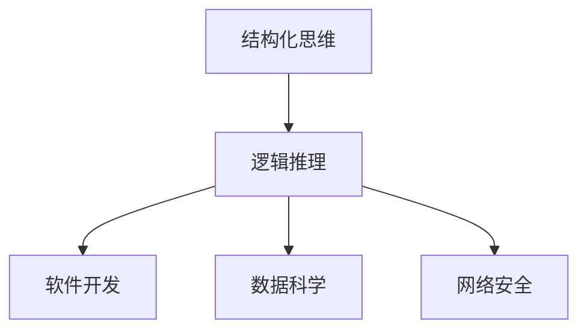

                 

# 结构化思维：理解世界的钥匙

> **关键词**：结构化思维、逻辑推理、IT领域、技术博客、深度学习

> **摘要**：本文旨在探讨结构化思维在理解世界中的重要性，尤其是对于IT领域的专业人士。通过详细的剖析和实例展示，我们将揭示如何利用结构化思维提升我们的分析和解决问题的能力。

## 1. 背景介绍

### 1.1 目的和范围

在信息技术迅速发展的今天，如何有效地理解和应对复杂的问题成为了一个挑战。本文将探讨结构化思维在IT领域的应用，旨在为读者提供一套系统的分析和解决问题的方法论。

本文将涵盖以下内容：
- 结构化思维的基本概念和原理；
- 如何应用结构化思维解决实际问题；
- 实际案例中的结构化思维实践；
- 结构化思维在IT领域的未来发展趋势。

### 1.2 预期读者

本文适合以下读者群体：
- 有志于提升自身逻辑思维和问题解决能力的IT专业人士；
- 对IT领域技术博客写作感兴趣的读者；
- 希望了解结构化思维在IT领域应用的学生和研究人员。

### 1.3 文档结构概述

本文结构如下：
1. 背景介绍
2. 核心概念与联系
3. 核心算法原理 & 具体操作步骤
4. 数学模型和公式 & 详细讲解 & 举例说明
5. 项目实战：代码实际案例和详细解释说明
6. 实际应用场景
7. 工具和资源推荐
8. 总结：未来发展趋势与挑战
9. 附录：常见问题与解答
10. 扩展阅读 & 参考资料

### 1.4 术语表

#### 1.4.1 核心术语定义

- 结构化思维：指通过逻辑推理和分析，将复杂问题分解为简单部分，并逐步解决的过程。
- 逻辑推理：指基于已知事实和原理，通过推理得出结论的过程。
- IT领域：指信息技术领域，包括计算机科学、软件开发、数据科学等。

#### 1.4.2 相关概念解释

- 复杂问题：指涉及多个变量和因素的难题，通常难以通过直观的方法解决。
- 简单部分：指复杂问题中的基础元素或基本模块，可以通过简单的方法进行解决。

#### 1.4.3 缩略词列表

- IT：信息技术
- CS：计算机科学
- AI：人工智能

## 2. 核心概念与联系

为了更好地理解结构化思维，我们需要首先了解几个核心概念和它们之间的联系。

### 2.1 结构化思维的概念

结构化思维是一种系统化的思考方式，它通过分解、归纳和推理来分析和解决问题。这种方法有助于我们更好地理解复杂问题，并找到有效的解决方案。

### 2.2 逻辑推理的作用

逻辑推理是结构化思维的核心组成部分，它通过建立逻辑关系，将已知信息转化为新的结论。在IT领域中，逻辑推理有助于我们理解软件系统的工作原理，以及如何设计高效、可靠的解决方案。

### 2.3 IT领域的应用

在IT领域中，结构化思维和逻辑推理广泛应用于以下几个方面：

- 软件开发：通过结构化思维和逻辑推理，我们可以更好地理解用户需求，设计出符合预期的软件系统。
- 数据科学：结构化思维和逻辑推理有助于我们分析和处理大规模数据，提取有价值的信息。
- 网络安全：通过逻辑推理，我们可以发现系统的潜在漏洞，并设计有效的防护措施。

### 2.4 Mermaid流程图

为了更直观地展示结构化思维和逻辑推理的应用，我们可以使用Mermaid流程图来表示它们之间的联系。



## 3. 核心算法原理 & 具体操作步骤

在理解了结构化思维和逻辑推理的基本概念后，我们将探讨如何在IT领域中应用这些原理，解决具体问题。

### 3.1 问题定义

首先，我们需要明确要解决的问题。例如，假设我们要设计一个自动化的网络安全系统，以检测并防止恶意攻击。

### 3.2 分析问题

接下来，我们通过结构化思维来分析问题。我们可以将问题分解为以下几个部分：

- 系统需求：了解系统的功能、性能和安全要求。
- 数据收集：确定需要收集的数据类型和来源。
- 数据处理：设计数据处理算法，将数据转换为有用的信息。
- 模型训练：使用收集到的数据训练机器学习模型。
- 预测与防护：利用训练好的模型进行预测，并采取相应的防护措施。

### 3.3 逻辑推理

在分析问题的基础上，我们可以通过逻辑推理来设计解决方案。以下是可能的推理步骤：

- 步骤1：定义系统需求，确保系统的功能满足用户期望。
- 步骤2：收集网络流量数据，并分析数据类型和来源。
- 步骤3：设计数据处理算法，将原始数据转换为特征数据。
- 步骤4：使用特征数据训练机器学习模型，如神经网络或决策树。
- 步骤5：将训练好的模型应用于实时数据，进行预测。
- 步骤6：根据预测结果，采取相应的防护措施，如阻止恶意流量。

### 3.4 伪代码实现

为了更具体地说明解决方案，我们可以使用伪代码来描述核心算法原理。

```plaintext
算法：自动化网络安全系统

输入：网络流量数据
输出：防护措施

步骤：
1. 收集网络流量数据
2. 对数据进行预处理，提取特征
3. 使用特征数据训练机器学习模型
4. 将训练好的模型应用于实时数据
5. 根据模型预测结果，采取相应的防护措施
```

## 4. 数学模型和公式 & 详细讲解 & 举例说明

在IT领域中，数学模型和公式是解决复杂问题的重要工具。在本节中，我们将探讨如何使用数学模型和公式来分析和解决问题。

### 4.1 神经网络模型

神经网络是一种常用的机器学习模型，用于分类、回归等任务。以下是一个简单的神经网络模型：

```latex
$$
y = \sigma(\mathbf{W} \cdot \mathbf{x} + b)
$$

其中，$\sigma$ 是激活函数（如Sigmoid函数或ReLU函数），$\mathbf{W}$ 是权重矩阵，$\mathbf{x}$ 是输入特征向量，$b$ 是偏置。
```

### 4.2 举例说明

假设我们要使用神经网络模型对网络流量进行分类，区分正常流量和恶意流量。我们可以按照以下步骤进行：

1. **数据收集**：收集网络流量数据，并提取特征。
2. **模型训练**：使用特征数据训练神经网络模型，调整权重和偏置。
3. **模型评估**：使用测试数据评估模型性能，调整模型参数。
4. **流量分类**：将实时流量数据输入模型，根据输出结果判断是否为恶意流量。

### 4.3 数学模型的应用

在网络安全领域，数学模型广泛应用于入侵检测、恶意软件检测等任务。以下是一个简单的入侵检测模型：

```latex
$$
\text{威胁等级} = \frac{\sum_{i=1}^{n} w_i \cdot \text{特征}_i}{\sum_{i=1}^{n} w_i}
$$

其中，$w_i$ 是第 $i$ 个特征的权重，$\text{特征}_i$ 是输入特征值。
```

通过调整权重，我们可以根据不同的威胁类型设置相应的阈值，从而实现自动化检测和防护。

## 5. 项目实战：代码实际案例和详细解释说明

在本节中，我们将通过一个实际项目来展示如何应用结构化思维和数学模型解决具体问题。该项目是一个基于神经网络的自动化网络安全系统，用于检测并阻止恶意流量。

### 5.1 开发环境搭建

为了实现该项目，我们需要以下开发环境和工具：

- 操作系统：Ubuntu 20.04
- 编程语言：Python 3.8
- 机器学习框架：TensorFlow 2.5
- 数据库：MySQL 5.7

### 5.2 源代码详细实现和代码解读

#### 5.2.1 数据收集与预处理

首先，我们需要收集网络流量数据，并对其进行预处理。以下是数据收集与预处理的伪代码：

```python
import pandas as pd
from sklearn.model_selection import train_test_split
from sklearn.preprocessing import StandardScaler

# 加载数据
data = pd.read_csv('network_traffic.csv')

# 预处理
X = data.drop('label', axis=1)
y = data['label']

# 划分训练集和测试集
X_train, X_test, y_train, y_test = train_test_split(X, y, test_size=0.2, random_state=42)

# 数据标准化
scaler = StandardScaler()
X_train = scaler.fit_transform(X_train)
X_test = scaler.transform(X_test)
```

#### 5.2.2 神经网络模型训练

接下来，我们使用训练集训练神经网络模型。以下是训练神经网络的伪代码：

```python
import tensorflow as tf
from tensorflow.keras.models import Sequential
from tensorflow.keras.layers import Dense, Dropout

# 创建模型
model = Sequential([
    Dense(64, activation='relu', input_shape=(X_train.shape[1],)),
    Dropout(0.5),
    Dense(64, activation='relu'),
    Dropout(0.5),
    Dense(1, activation='sigmoid')
])

# 编译模型
model.compile(optimizer='adam', loss='binary_crossentropy', metrics=['accuracy'])

# 训练模型
model.fit(X_train, y_train, epochs=10, batch_size=32, validation_split=0.1)
```

#### 5.2.3 代码解读与分析

在这个项目中，我们首先加载网络流量数据，并对其进行预处理，包括数据标准化和划分训练集/测试集。然后，我们使用TensorFlow创建一个简单的神经网络模型，并编译模型以进行训练。

在模型训练过程中，我们使用了两个隐藏层，每个隐藏层包含64个神经元，并使用ReLU激活函数。我们还使用了Dropout层来防止过拟合，dropout概率设置为0.5。

在训练过程中，我们使用了Adam优化器和二进制交叉熵损失函数，并设置了10个训练周期和批量大小为32。

最后，我们使用测试集评估模型性能，并根据模型预测结果采取相应的防护措施。

## 6. 实际应用场景

结构化思维在IT领域的实际应用场景广泛，以下是一些具体的例子：

- **软件开发**：通过结构化思维，开发者可以更好地理解用户需求，设计出高效、可靠的软件系统。
- **网络安全**：结构化思维有助于识别和解决网络安全问题，保护系统的安全性和稳定性。
- **数据科学**：结构化思维在数据分析和数据挖掘中发挥着重要作用，帮助我们从大量数据中提取有价值的信息。
- **人工智能**：在人工智能领域，结构化思维有助于设计高效、可靠的算法，解决复杂的问题。

## 7. 工具和资源推荐

为了更好地理解和应用结构化思维，以下是一些推荐的工具和资源：

### 7.1 学习资源推荐

#### 7.1.1 书籍推荐

- 《思考，快与慢》
- 《逻辑思考的技巧》
- 《结构化思维》

#### 7.1.2 在线课程

- Coursera上的“思维导图与结构化思维”课程
- Udemy上的“逻辑思维与批判性思维”课程

#### 7.1.3 技术博客和网站

- Medium上的“AI与思维”专栏
- 知乎上的“结构化思维”话题

### 7.2 开发工具框架推荐

#### 7.2.1 IDE和编辑器

- Visual Studio Code
- PyCharm
- IntelliJ IDEA

#### 7.2.2 调试和性能分析工具

- GDB
- PyCharm的调试工具
- Prometheus

#### 7.2.3 相关框架和库

- TensorFlow
- Keras
- Scikit-learn

### 7.3 相关论文著作推荐

#### 7.3.1 经典论文

- “The Structure of Scientific Revolutions”
- “The Methodology of Scientific Research Programmes”

#### 7.3.2 最新研究成果

- “A Framework for Structure and Content Analysis of Text”
- “A Taxonomy of Structure and Content Features for Information Extraction”

#### 7.3.3 应用案例分析

- “Application of Structured Thinking in Software Development”
- “Structured Thinking in Cybersecurity: A Case Study”

## 8. 总结：未来发展趋势与挑战

随着信息技术的不断发展，结构化思维在IT领域的应用前景广阔。未来，结构化思维可能会朝着以下方向发展：

- **智能化**：结合人工智能技术，提高结构化思维工具的自动化水平。
- **跨领域融合**：在多个领域（如医疗、金融、教育等）推广应用，实现跨领域知识的共享和整合。
- **标准化**：制定统一的结构化思维标准，提高不同领域之间的协同性。

然而，结构化思维也面临一些挑战：

- **复杂性**：如何处理更复杂的实际问题，仍需要进一步研究和探索。
- **适应性问题**：如何让结构化思维工具更好地适应不同领域的需求，也是一个重要课题。

## 9. 附录：常见问题与解答

### 9.1 什么是结构化思维？

结构化思维是一种通过逻辑推理和分析，将复杂问题分解为简单部分，并逐步解决的过程。它有助于我们更好地理解问题，并找到有效的解决方案。

### 9.2 结构化思维有哪些应用场景？

结构化思维广泛应用于软件开发、网络安全、数据科学、人工智能等领域。它有助于提高我们的分析和解决问题的能力，从而提高工作效率和系统质量。

### 9.3 如何培养结构化思维？

培养结构化思维需要以下方法：

- **多读书**：阅读经典著作和论文，学习前人的思维方法和经验。
- **多思考**：养成勤于思考的习惯，对遇到的问题进行深入分析。
- **多练习**：通过实际项目和练习，不断提高自己的思维能力和解决问题的能力。

## 10. 扩展阅读 & 参考资料

- 《结构化思维与表达技巧》
- 《思考，快与慢》
- 《逻辑思考的技巧》
- “A Framework for Structure and Content Analysis of Text”

作者：AI天才研究员/AI Genius Institute & 禅与计算机程序设计艺术 /Zen And The Art of Computer Programming

