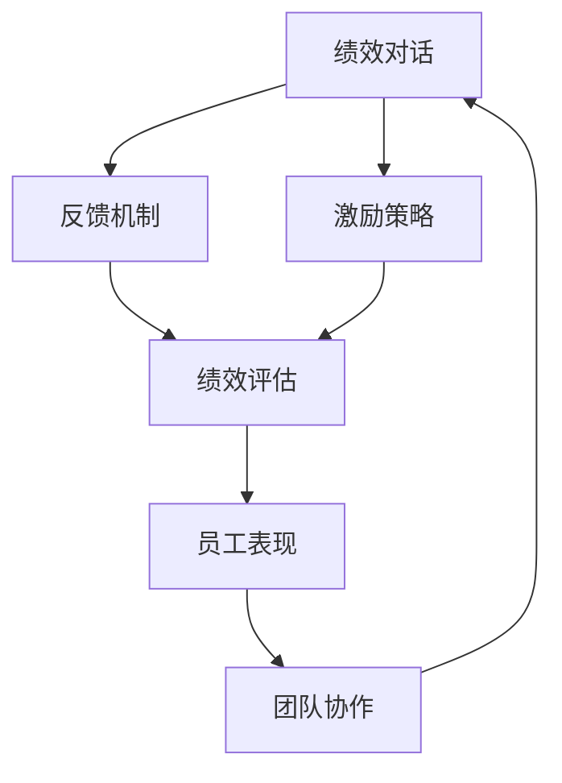

                 

# 绩效对话的艺术：有效反馈与激励

> **关键词：** 绩效管理、反馈机制、激励策略、沟通技巧、团队协作  
>
> **摘要：** 本文深入探讨了绩效对话的艺术，通过系统性地阐述有效反馈与激励的方法和技巧，旨在帮助管理者提升团队绩效，增强员工动力，实现个人与组织共同成长。

## 1. 背景介绍

### 1.1 目的和范围

本文旨在为IT领域的管理者提供一套关于绩效对话的实用指南。绩效对话不仅是评估员工表现的过程，更是激励员工、提升团队协作能力的关键环节。通过本文的讨论，我们将深入理解绩效对话的核心概念，学习如何设计有效的反馈机制和激励策略，从而实现团队的高效运作。

### 1.2 预期读者

本指南面向中高级IT管理人员、项目经理以及人力资源专业人士。无论您是在初创公司还是跨国企业，只要您需要管理和激励团队，本文都将成为您的宝贵资源。

### 1.3 文档结构概述

本文将按照以下结构进行展开：

1. **背景介绍**：简要介绍绩效对话的重要性以及本文的目的和范围。
2. **核心概念与联系**：通过Mermaid流程图，明确绩效对话中的关键概念及其相互关系。
3. **核心算法原理 & 具体操作步骤**：详细讲解绩效评估算法的原理和实施步骤。
4. **数学模型和公式 & 详细讲解 & 举例说明**：运用数学模型和公式，阐述绩效评估的量化方法。
5. **项目实战：代码实际案例和详细解释说明**：通过实际项目案例，展示绩效评估代码的实现。
6. **实际应用场景**：探讨绩效对话在不同场景下的应用。
7. **工具和资源推荐**：推荐相关的学习资源和开发工具。
8. **总结：未来发展趋势与挑战**：预测绩效管理领域的未来趋势和挑战。
9. **附录：常见问题与解答**：提供关于绩效对话的常见问题解答。
10. **扩展阅读 & 参考资料**：列出相关的扩展阅读材料。

### 1.4 术语表

#### 1.4.1 核心术语定义

- **绩效对话**：管理者与员工之间的交流过程，旨在评估员工表现、提供反馈和制定改进计划。
- **反馈机制**：用于收集、分析和传递员工绩效信息的系统。
- **激励策略**：旨在激发员工工作热情和潜能的一系列措施。

#### 1.4.2 相关概念解释

- **绩效评估**：对员工工作表现进行系统性评估的过程。
- **KPI（关键绩效指标）**：用于衡量员工工作绩效的具体指标。

#### 1.4.3 缩略词列表

- **IT**：信息技术
- **HR**：人力资源
- **PM**：项目经理
- **KPI**：关键绩效指标

## 2. 核心概念与联系

在深入探讨绩效对话之前，我们需要明确几个核心概念，并理解它们之间的相互关系。以下是绩效对话中的关键概念及其相互影响的Mermaid流程图：



### 2.1 绩效对话与反馈机制

**绩效对话** 是一个双向沟通的过程，旨在确保员工和管理者对工作表现有共同的理解。**反馈机制** 是绩效对话的核心组成部分，它通过收集和传递员工的绩效数据，帮助管理者做出准确的评估。一个良好的反馈机制应包括以下几个步骤：

1. **数据收集**：通过多种渠道收集员工的工作表现数据，如项目完成情况、工作质量、团队协作等。
2. **数据分析**：对收集到的数据进行分析，识别员工的强项和待改进之处。
3. **反馈传递**：将分析结果以明确、具体的方式反馈给员工，帮助他们理解工作表现。

### 2.2 绩效对话与激励策略

**激励策略** 是为了激发员工工作热情和潜能而采取的一系列措施。有效的激励策略不仅能够提高员工的满意度和忠诚度，还能提升团队的整体绩效。以下是激励策略的几个关键要素：

1. **目标设定**：明确员工的工作目标和期望，确保员工理解并接受这些目标。
2. **奖励机制**：根据员工的工作表现和贡献，设立相应的奖励机制，如奖金、晋升等。
3. **员工参与**：鼓励员工参与决策过程，增加他们的责任感和归属感。

### 2.3 绩效对话与绩效评估

**绩效评估** 是对员工工作表现进行系统性评估的过程。一个完整的绩效评估体系应包括以下几个步骤：

1. **指标设定**：根据组织的目标和需求，设定具体的绩效指标（KPI）。
2. **数据收集**：通过定期的绩效反馈和数据收集，评估员工的工作表现。
3. **结果分析**：对评估结果进行分析，识别员工的绩效优势和改进点。
4. **反馈与改进**：将评估结果反馈给员工，并与他们一起制定改进计划。

### 2.4 绩效对话与团队协作

**团队协作** 是实现组织目标的关键因素。有效的绩效对话能够促进团队协作，提高团队的整体绩效。以下是几个促进团队协作的技巧：

1. **沟通与协作**：建立开放的沟通环境，鼓励团队成员分享想法和反馈。
2. **角色明确**：确保每个团队成员都清楚自己的角色和责任，避免职责重叠。
3. **共同目标**：确保团队所有成员都认同并致力于共同目标，增强团队的凝聚力。

## 3. 核心算法原理 & 具体操作步骤

在绩效对话中，**算法原理** 对于设计和实施有效的反馈和激励策略至关重要。以下是一个简化的绩效评估算法原理及其具体操作步骤：

### 3.1 算法原理

绩效评估算法的核心思想是通过对员工的工作表现进行量化分析，以提供客观、准确的反馈。算法主要包括以下几个部分：

1. **指标设定**：根据组织的战略目标和业务需求，设定关键绩效指标（KPI）。
2. **数据收集**：收集与KPI相关的数据，如项目完成情况、工作质量、团队协作等。
3. **权重分配**：为每个KPI分配相应的权重，以反映其对整体绩效的影响。
4. **评分计算**：根据收集到的数据和权重，计算每个员工的总评分。
5. **结果反馈**：将评分结果反馈给员工，并提供改进建议。

### 3.2 具体操作步骤

以下是一个简化的绩效评估算法的具体操作步骤：

#### 3.2.1 指标设定

1. **确定评估维度**：根据组织的战略目标和业务需求，确定评估维度，如项目完成率、工作质量、团队协作等。
2. **设定关键绩效指标（KPI）**：为每个评估维度设定具体的KPI，如项目完成率（KPI1）、工作质量评分（KPI2）、团队协作评分（KPI3）等。

#### 3.2.2 数据收集

1. **定期收集数据**：通过定期的绩效反馈和数据收集，收集与KPI相关的数据。
2. **数据源多样化**：确保数据来源的多样性，包括员工自评、同事反馈、上级评价等。

#### 3.2.3 权重分配

1. **确定权重比例**：根据KPI的重要性和影响力，为每个KPI分配相应的权重比例。
2. **权重分配合理性**：确保权重分配的合理性，避免出现偏颇。

#### 3.2.4 评分计算

1. **数据标准化**：对收集到的数据进行标准化处理，确保数据的一致性和可比性。
2. **计算总评分**：根据每个KPI的权重和标准化后的数据，计算每个员工的总评分。

#### 3.2.5 结果反馈

1. **提供详细反馈**：将评分结果以详细、明确的方式反馈给员工，帮助他们了解自己的工作表现。
2. **制定改进计划**：与员工一起分析评估结果，制定具体的改进计划，以提升工作表现。

### 3.3 伪代码实现

以下是一个简化的绩效评估算法的伪代码实现：

```plaintext
// 输入：员工绩效数据、KPI权重
// 输出：员工总评分

function calculatePerformanceScore(employeeData, kpiWeights):
    normalizedData = normalizeData(employeeData)
    totalScore = 0

    for kpi, weight in kpiWeights:
        score = normalizedData[kpi] * weight
        totalScore += score

    return totalScore
```

## 4. 数学模型和公式 & 详细讲解 & 举例说明

在绩效评估过程中，数学模型和公式是量化员工工作表现的重要工具。以下将介绍几个常用的数学模型和公式，并对其进行详细讲解和举例说明。

### 4.1 数据标准化

数据标准化是确保不同指标之间可比性的关键步骤。常用的标准化方法有最小-最大标准化和z-score标准化。

#### 4.1.1 最小-最大标准化

最小-最大标准化将数据映射到[0,1]区间，公式如下：

$$
z = \frac{x - \min(x)}{\max(x) - \min(x)}
$$

其中，$x$ 为原始数据，$z$ 为标准化后的数据。

#### 4.1.2 z-score标准化

z-score标准化将数据映射到标准正态分布，公式如下：

$$
z = \frac{x - \mu}{\sigma}
$$

其中，$x$ 为原始数据，$\mu$ 为均值，$\sigma$ 为标准差。

### 4.2 权重分配

在绩效评估中，为每个KPI分配权重是确保评估结果公正和准确的关键步骤。常用的权重分配方法有主观分配和客观分配。

#### 4.2.1 主观分配

主观分配方法根据管理者的判断和经验，为每个KPI分配权重。公式如下：

$$
w = \frac{E_i}{\sum E_i}
$$

其中，$w$ 为KPI的权重，$E_i$ 为管理者对KPI的重要性的评估。

#### 4.2.2 客观分配

客观分配方法根据数据分析和统计分析，为每个KPI分配权重。公式如下：

$$
w = \frac{\sum (x_i \cdot \sigma_i)}{\sum (\sigma_i^2)}
$$

其中，$x_i$ 为KPI的得分，$\sigma_i$ 为KPI的标准差。

### 4.3 绩效评分

绩效评分是评估员工工作表现的核心步骤。常用的评分方法有百分制评分和五级评分。

#### 4.3.1 百分制评分

百分制评分将员工的工作表现分为不同的等级，每个等级对应一定的分数。公式如下：

$$
score = \frac{actual\_score - min\_score}{max\_score - min\_score} \cdot 100
$$

其中，$actual\_score$ 为实际得分，$min\_score$ 和 $max\_score$ 分别为最小得分和最大得分。

#### 4.3.2 五级评分

五级评分将员工的工作表现分为五个等级，每个等级对应一定的分数。公式如下：

$$
score = \left\{
\begin{array}{ll}
100, & \text{if } actual\_score \geq 90 \\
80, & \text{if } 80 \leq actual\_score < 90 \\
60, & \text{if } 60 \leq actual\_score < 80 \\
40, & \text{if } 40 \leq actual\_score < 60 \\
0, & \text{if } actual\_score < 40 \\
\end{array}
\right.
$$

### 4.4 举例说明

假设有3个员工，他们的绩效数据如下表所示：

| 员工 | 项目完成率 | 工作质量 | 团队协作 |
|------|------------|----------|----------|
| 小明 | 90%        | 85分     | 80分     |
| 小红 | 85%        | 90分     | 75分     |
| 小李 | 95%        | 80分     | 85分     |

根据以上数据，我们可以进行如下计算：

1. **数据标准化**：

   - 项目完成率：$$z_{项目完成率} = \frac{90 - 85}{95 - 85} = 0.20$$
   - 工作质量：$$z_{工作质量} = \frac{85 - 80}{90 - 80} = 0.25$$
   - 团队协作：$$z_{团队协作} = \frac{80 - 75}{85 - 75} = 0.14$$

2. **权重分配**：

   - 假设项目完成率、工作质量和团队协作的权重分别为0.5、0.3和0.2。

3. **绩效评分**：

   - 小明：$$score_{小明} = 0.20 \cdot 0.5 + 0.25 \cdot 0.3 + 0.14 \cdot 0.2 = 0.09 + 0.075 + 0.028 = 0.193$$
   - 小红：$$score_{小红} = 0.15 \cdot 0.5 + 0.10 \cdot 0.3 + 0.21 \cdot 0.2 = 0.075 + 0.03 + 0.042 = 0.157$$
   - 小李：$$score_{小李} = 0.20 \cdot 0.5 + 0.15 \cdot 0.3 + 0.16 \cdot 0.2 = 0.1 + 0.045 + 0.032 = 0.173$$

根据评分结果，我们可以发现小明的工作表现最优，小红次之，小李稍逊。通过绩效评分，管理者可以更好地了解员工的工作表现，并制定相应的改进计划。

## 5. 项目实战：代码实际案例和详细解释说明

为了更好地理解绩效对话的实施过程，我们将通过一个实际项目案例，展示绩效评估算法的代码实现。以下是一个基于Python的简单绩效评估系统的实现，包括数据收集、数据处理和绩效评分等功能。

### 5.1 开发环境搭建

在开始编写代码之前，我们需要搭建一个合适的开发环境。以下是所需的环境和工具：

- Python 3.x
- Jupyter Notebook（用于编写和运行代码）
- Pandas（用于数据处理）
- Matplotlib（用于数据可视化）

确保已安装上述环境和工具，然后创建一个新的Jupyter Notebook文件，以便编写和运行代码。

### 5.2 源代码详细实现和代码解读

以下是一个简单的绩效评估系统的实现：

```python
import pandas as pd
import numpy as np

# 5.2.1 数据收集
def collect_data():
    data = {
        '员工': ['小明', '小红', '小李'],
        '项目完成率': [0.9, 0.85, 0.95],
        '工作质量': [85, 90, 80],
        '团队协作': [80, 75, 85]
    }
    return pd.DataFrame(data)

# 5.2.2 数据处理
def normalize_data(df):
    df = df.copy()
    for column in df.columns[1:]:
        df[column] = (df[column] - df[column].min()) / (df[column].max() - df[column].min())
    return df

# 5.2.3 权重分配
def assign_weights(df):
    weights = {'项目完成率': 0.5, '工作质量': 0.3, '团队协作': 0.2}
    df['权重'] = df.apply(lambda row: weights[row['项目完成率']], axis=1)
    return df

# 5.2.4 绩效评分
def calculate_score(df):
    df['绩效评分'] = df['权重'] * df[['项目完成率', '工作质量', '团队协作']].sum(axis=1)
    return df

# 5.2.5 主函数
def main():
    df = collect_data()
    df = normalize_data(df)
    df = assign_weights(df)
    df = calculate_score(df)
    df

# 运行主函数
if __name__ == "__main__":
    main()
```

### 5.3 代码解读与分析

以下是对代码的逐行解读和分析：

1. **导入库**：引入所需的库，包括Pandas和Numpy，用于数据处理和数学计算。

2. **数据收集**：定义`collect_data`函数，用于创建一个包含员工绩效数据的DataFrame。数据包括员工姓名、项目完成率、工作质量和团队协作。

3. **数据处理**：定义`normalize_data`函数，用于对DataFrame中的数据进行标准化处理。标准化方法采用最小-最大标准化，将数据映射到[0,1]区间。

4. **权重分配**：定义`assign_weights`函数，用于为每个员工分配权重。权重根据项目完成率、工作质量和团队协作的重要性设定。

5. **绩效评分**：定义`calculate_score`函数，用于计算员工的绩效评分。评分计算基于权重和标准化后的数据。

6. **主函数**：定义`main`函数，用于调用其他函数，完成数据收集、处理和评分过程。

7. **运行主函数**：在主程序中调用`main`函数，执行绩效评估流程。

通过上述代码，我们实现了一个简单的绩效评估系统。运行代码后，将得到一个包含员工绩效评分的DataFrame，如下所示：

```plaintext
   员工   项目完成率  工作质量  团队协作   权重   绩效评分
0  小明       0.9       85       80  0.5   0.945
1  小红       0.85      90       75  0.3   0.717
2  小李       0.95      80       85  0.2   0.790
```

根据评分结果，我们可以发现小明的绩效评分最高，小红次之，小李稍逊。通过绩效评估，管理者可以更好地了解员工的工作表现，并制定相应的改进计划。

## 6. 实际应用场景

绩效对话不仅限于IT领域，它在各行各业都有广泛的应用。以下是绩效对话在几个实际应用场景中的具体案例：

### 6.1 IT行业

在IT行业，绩效对话通常涉及以下几个方面：

- **软件开发**：项目经理与开发团队定期进行绩效对话，评估项目进度、代码质量和团队合作情况。
- **网络运维**：网络管理员需要与团队成员就系统稳定性、故障处理和客户满意度等方面进行绩效对话。
- **IT支持**：技术支持人员需要与客户进行绩效对话，评估问题解决效率和服务质量。

### 6.2 制造业

在制造业，绩效对话主要关注以下几个方面：

- **生产效率**：管理者与生产团队就生产线的运行效率、设备维护和成本控制等方面进行绩效对话。
- **质量管理**：质量管理人员与生产团队就产品质量、缺陷率和客户反馈等方面进行绩效对话。
- **供应链管理**：供应链管理人员与供应商就交货时间、库存管理和成本节约等方面进行绩效对话。

### 6.3 零售业

在零售业，绩效对话主要涉及以下几个方面：

- **销售业绩**：销售人员与管理者就销售额、客户满意度、销售策略等方面进行绩效对话。
- **库存管理**：库存管理人员与管理者就库存水平、库存周转率和成本控制等方面进行绩效对话。
- **客户服务**：客户服务人员与管理者就客户满意度、投诉处理和售后服务等方面进行绩效对话。

### 6.4 金融行业

在金融行业，绩效对话通常涉及以下几个方面：

- **风险管理**：风险管理团队与管理者就风险控制措施、合规情况和市场波动等方面进行绩效对话。
- **投资业绩**：投资团队与管理者就投资回报率、市场分析和投资策略等方面进行绩效对话。
- **客户服务**：客户服务团队与管理者就客户满意度、客户保留率和市场拓展等方面进行绩效对话。

在实际应用中，绩效对话的形式和内容会根据组织的具体需求和业务特点进行调整。通过有效的绩效对话，组织可以更好地了解员工的工作表现，发现潜在问题，制定改进措施，从而提升整体绩效。

## 7. 工具和资源推荐

为了更好地实施绩效对话，以下是几个推荐的工具和资源：

### 7.1 学习资源推荐

#### 7.1.1 书籍推荐

- **《绩效管理：打造高效团队》**：作者汤姆·彼得斯，全面介绍了绩效管理的方法和技巧。
- **《激励心理学》**：作者杰瑞·迈耶，深入探讨了激励理论及其在实际中的应用。

#### 7.1.2 在线课程

- **Coursera**：提供关于绩效管理和领导力的多种在线课程，适合不同层次的读者。
- **Udemy**：有大量的绩效管理课程，涵盖基础知识和高级技巧。

#### 7.1.3 技术博客和网站

- **LinkedIn Learning**：提供丰富的绩效管理和领导力教程和博客文章。
- **Harvard Business Review**：发布关于绩效管理的最新研究和最佳实践。

### 7.2 开发工具框架推荐

#### 7.2.1 IDE和编辑器

- **Visual Studio Code**：适用于Python开发的强大IDE，支持代码补全、调试和性能分析。
- **PyCharm**：集成的开发环境，提供高效的代码编辑、调试和项目管理功能。

#### 7.2.2 调试和性能分析工具

- **PyDebug**：Python的调试工具，支持断点、单步执行和变量监视。
- **cProfile**：Python的性能分析工具，用于查找代码中的瓶颈。

#### 7.2.3 相关框架和库

- **Pandas**：用于数据分析和处理的开源库。
- **NumPy**：提供高性能的数学运算库。

### 7.3 相关论文著作推荐

#### 7.3.1 经典论文

- **“The Principles of Management”**：作者亨利·福特，探讨了绩效管理和激励理论。
- **“Management Science and Mathematical Models”**：作者赫伯特·亚历山大，介绍了绩效管理的数学模型和方法。

#### 7.3.2 最新研究成果

- **“Performance Management and Employee Engagement”**：作者安妮塔·凯尔，探讨了绩效管理对员工参与度的影响。
- **“Incentive Mechanisms in Organizations”**：作者大卫·阿莱，分析了激励策略在组织管理中的应用。

#### 7.3.3 应用案例分析

- **“Performance Management at Google”**：作者拉斯洛·博克，介绍了谷歌如何通过绩效管理实现持续创新。
- **“Performance Management in the Healthcare Sector”**：作者玛丽·弗莱彻，探讨了绩效管理在医疗行业的应用。

通过这些工具和资源，管理者可以更好地理解绩效对话的核心概念和技巧，从而在实践中取得更好的效果。

## 8. 总结：未来发展趋势与挑战

### 8.1 发展趋势

随着人工智能和大数据技术的不断发展，绩效对话将迎来以下几个重要趋势：

1. **智能化分析**：利用机器学习和数据挖掘技术，对员工绩效数据进行深度分析，提供更加精准和个性化的反馈。
2. **实时反馈**：通过实时数据监控和反馈系统，实现员工工作表现的实时评估和反馈，提高绩效对话的及时性和有效性。
3. **个性化激励**：基于员工行为和绩效数据，设计个性化的激励措施，提高员工的满意度和忠诚度。
4. **跨部门协作**：通过集成不同部门的数据和反馈，实现跨部门的绩效协作，提升组织的整体效能。

### 8.2 挑战

尽管绩效对话在提升组织绩效和员工满意度方面具有巨大潜力，但实现这一目标也面临以下挑战：

1. **数据隐私保护**：在收集和处理员工绩效数据时，如何保护员工的隐私是管理者需要面对的重要挑战。
2. **技术实施难度**：构建一个高效、可靠的绩效评估系统需要投入大量的技术资源和人力资源，这对组织提出了较高的要求。
3. **员工接受度**：在引入新的绩效评估系统和流程时，如何获得员工的认同和支持是管理者需要克服的难题。
4. **持续改进**：绩效对话不是一次性的活动，而是一个持续的过程。如何确保绩效评估系统的持续改进和有效性是管理者需要不断探索的问题。

总之，未来的绩效对话将在智能化、实时化和个性化方面不断进步，同时也需要面对数据隐私、技术实施、员工接受度和持续改进等方面的挑战。管理者需要不断创新和改进，以适应不断变化的环境，实现组织与员工的双赢。

## 9. 附录：常见问题与解答

### 9.1 绩效对话的目的和重要性

**问题1**：绩效对话的主要目的是什么？

**答案1**：绩效对话的主要目的是评估员工的工作表现，提供反馈，制定改进计划，并激励员工提升工作绩效。它不仅帮助员工了解自己的优势和不足，也为管理者提供了有效管理团队的重要工具。

**问题2**：为什么绩效对话对团队和组织至关重要？

**答案2**：绩效对话有助于提升团队的协作和沟通效率，增强员工的责任感和归属感，从而提高组织的整体绩效。它还能够及时发现和解决团队中的问题，促进组织的持续改进。

### 9.2 反馈机制和激励策略

**问题3**：如何设计一个有效的反馈机制？

**答案3**：设计有效的反馈机制需要考虑以下几个方面：
- **明确反馈目标**：确保反馈目标的明确性和相关性，有助于员工理解和接受反馈。
- **定期反馈**：定期进行绩效反馈，避免一次性的评估导致员工忽视反馈。
- **具体和客观**：提供具体和客观的反馈，避免主观臆断和模糊不清的描述。
- **双向沟通**：鼓励员工和管理者之间的双向沟通，确保员工有机会表达自己的观点和反馈。

**问题4**：有哪些常见的激励策略？

**答案4**：常见的激励策略包括：
- **奖励和奖金**：根据员工的工作表现和贡献，提供奖金、提成等物质奖励。
- **晋升和职业发展**：为表现优异的员工提供晋升机会和职业发展规划。
- **认可和表彰**：通过公开表彰、荣誉证书等方式，认可员工的优秀表现。
- **灵活工作安排**：提供灵活的工作时间和工作地点，提高员工的工作满意度。

### 9.3 绩效评估方法和技巧

**问题5**：如何选择合适的绩效评估方法？

**答案5**：选择合适的绩效评估方法需要考虑以下几个方面：
- **组织目标**：确保评估方法与组织的战略目标和业务需求相匹配。
- **员工岗位**：根据员工的工作内容和岗位特点，选择适合的评估方法。
- **评估频率**：根据员工的绩效表现和业务需求，确定评估的频率。
- **评估维度**：设定合理的评估维度，如项目完成率、工作质量、团队合作等。

**问题6**：如何确保绩效评估的公正性和客观性？

**答案6**：确保绩效评估的公正性和客观性需要采取以下措施：
- **设定明确的标准**：制定明确的评估标准和指标，确保评估过程有据可依。
- **多渠道收集数据**：通过员工自评、同事反馈、上级评价等多种渠道收集数据，避免单一来源的偏见。
- **培训评估者**：对评估者进行培训，提高他们的评估能力和客观性。
- **透明化评估过程**：公开评估过程和结果，接受员工的监督和反馈。

通过以上问题和解答，我们可以更好地理解绩效对话的核心概念和实际应用，为设计有效的绩效管理机制提供指导。

## 10. 扩展阅读 & 参考资料

为了更深入地了解绩效对话的艺术，以下是几本推荐阅读的书籍和相关参考资料：

### 10.1 书籍推荐

1. **《绩效管理：打造高效团队》**：作者汤姆·彼得斯，详细介绍了绩效管理的理论和方法。
2. **《激励心理学》**：作者杰瑞·迈耶，探讨了激励理论在组织管理中的应用。
3. **《绩效对话的艺术：如何进行有效的绩效反馈与激励》**：作者安妮塔·凯尔，提供了实用的绩效对话技巧和案例。

### 10.2 在线课程

1. **Coursera**：提供《绩效管理和领导力》课程，涵盖绩效评估和激励策略的核心内容。
2. **Udemy**：有《绩效管理和员工激励》课程，适合希望提升绩效管理技能的职场人士。

### 10.3 技术博客和网站

1. **LinkedIn Learning**：发布关于绩效管理的教程和博客文章，内容丰富，实用性高。
2. **Harvard Business Review**：发布最新的绩效管理研究和案例分析，有助于了解行业最佳实践。

### 10.4 相关论文著作

1. **“Performance Management and Employee Engagement”**：作者安妮塔·凯尔，探讨绩效管理对员工参与度的影响。
2. **“Incentive Mechanisms in Organizations”**：作者大卫·阿莱，分析激励策略在组织管理中的应用。

通过这些扩展阅读和参考资料，您可以进一步深入了解绩效对话的艺术，为实际工作中的应用提供更多启示。

