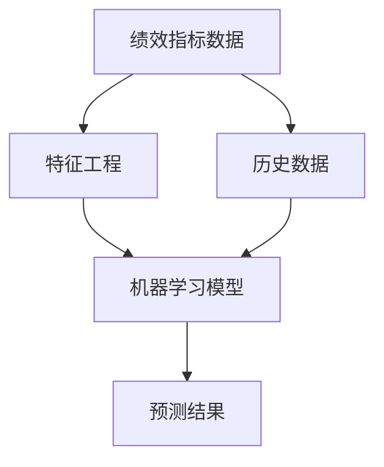

                 

# 绩效预测：科学评估团队潜力

> 关键词：绩效预测、团队潜力、人工智能、数据分析、机器学习、模型构建

> 摘要：本文将探讨如何利用人工智能和数据分析技术对团队绩效进行科学评估。我们将详细分析核心概念和联系，介绍核心算法原理与操作步骤，解析数学模型和公式，并通过实战案例展示实际应用效果。同时，文章还将推荐相关工具和资源，总结未来发展趋势与挑战，为读者提供全面的绩效预测理论与实践指导。

## 1. 背景介绍

### 1.1 目的和范围

本文旨在探讨如何通过人工智能和数据分析技术对团队绩效进行科学评估。随着企业规模的扩大和管理层次的增加，如何高效地管理团队、预测团队潜力成为企业面临的重大挑战。传统的绩效评估方法通常依赖于主观评价和经验判断，难以量化团队潜力，容易导致评估结果的不公平和不准确。本文将介绍一种基于人工智能和数据分析的绩效预测方法，通过构建数学模型和算法，对团队潜力进行科学评估，为企业提供有力的决策支持。

### 1.2 预期读者

本文适合以下读者群体：

1. 企业管理层：希望了解和掌握科学评估团队绩效的方法，提高团队管理水平的决策者。
2. 数据科学家和分析师：希望探索人工智能和数据分析技术在绩效预测领域的应用，拓展职业发展空间的专业人士。
3. 数据科学和人工智能爱好者：对团队绩效预测技术感兴趣，希望深入了解相关理论和实践的读者。

### 1.3 文档结构概述

本文将按照以下结构展开：

1. 背景介绍：介绍本文的目的、预期读者和文档结构。
2. 核心概念与联系：介绍绩效预测相关的核心概念，并使用 Mermaid 流程图展示概念间的联系。
3. 核心算法原理 & 具体操作步骤：详细阐述绩效预测算法的原理和操作步骤，使用伪代码进行说明。
4. 数学模型和公式 & 详细讲解 & 举例说明：介绍绩效预测的数学模型和公式，并结合实际案例进行详细讲解。
5. 项目实战：代码实际案例和详细解释说明，展示如何实现绩效预测模型。
6. 实际应用场景：分析绩效预测技术在企业中的实际应用场景。
7. 工具和资源推荐：推荐学习资源、开发工具框架和相关论文著作。
8. 总结：未来发展趋势与挑战，对绩效预测技术的未来进行展望。
9. 附录：常见问题与解答，为读者提供疑难问题的解决方案。
10. 扩展阅读 & 参考资料：提供相关领域的重要文献和参考资料。

### 1.4 术语表

#### 1.4.1 核心术语定义

- 绩效预测：利用历史数据、人工智能算法和数学模型，对团队未来的绩效表现进行预测。
- 团队潜力：团队在特定领域内所能达到的绩效水平，受团队成员能力、合作效率和环境因素等多方面影响。
- 人工智能：模拟人类智能行为的计算机技术，包括机器学习、深度学习、自然语言处理等。
- 数据分析：从大量数据中提取有价值信息的过程，包括数据预处理、特征提取、模型训练和评估等。

#### 1.4.2 相关概念解释

- 机器学习：一种人工智能技术，通过从数据中自动学习规律和模式，从而对未知数据进行预测或分类。
- 深度学习：一种特殊的机器学习技术，通过构建多层神经网络来模拟人脑的决策过程，具有强大的特征提取和模式识别能力。
- 数据预处理：在模型训练之前，对数据进行清洗、归一化、缺失值填补等处理，以提高模型的性能和泛化能力。
- 特征提取：从原始数据中提取对预测目标有重要影响的信息，作为模型的输入特征。

#### 1.4.3 缩略词列表

- AI：人工智能
- ML：机器学习
- DL：深度学习
- NLP：自然语言处理
- SVM：支持向量机
- KNN：k 最近邻算法
- CNN：卷积神经网络
- RNN：循环神经网络
- LSTM：长短时记忆网络
- TensorFlow：一款开源深度学习框架
- PyTorch：一款开源深度学习框架

## 2. 核心概念与联系

在绩效预测中，我们需要了解一些核心概念和它们之间的联系。以下是绩效预测相关的核心概念以及它们之间的 Mermaid 流程图。

### 2.1 核心概念

1. **绩效指标**：用于衡量团队绩效的具体指标，如销售额、项目完成度、客户满意度等。
2. **历史数据**：包括团队过去一段时间内的绩效指标数据，用于训练预测模型。
3. **特征工程**：从原始数据中提取对绩效指标有重要影响的特征，用于训练预测模型。
4. **机器学习模型**：用于训练和预测团队绩效的算法，如线性回归、决策树、随机森林等。
5. **预测结果**：通过机器学习模型对团队未来绩效的预测结果。

### 2.2 Mermaid 流程图



在上述流程图中，绩效指标数据经过特征工程处理后作为输入特征输入到机器学习模型中，模型通过训练历史数据来学习绩效指标与特征之间的关系，并生成预测结果。该流程图展示了绩效预测的基本流程和核心概念之间的联系。

## 3. 核心算法原理 & 具体操作步骤

### 3.1 算法原理

绩效预测的核心是构建一个能够从历史数据中学习并预测未来绩效的机器学习模型。在这个过程中，我们需要遵循以下步骤：

1. **数据收集**：收集团队过去一段时间内的绩效指标数据，包括销售额、项目完成度、客户满意度等。
2. **特征工程**：对原始数据进行分析和处理，提取对绩效指标有重要影响的特征。
3. **模型选择**：选择合适的机器学习算法，如线性回归、决策树、随机森林等。
4. **模型训练**：使用历史数据对模型进行训练，使其学会预测绩效指标。
5. **模型评估**：通过交叉验证等方法评估模型的性能，选择最优模型。
6. **模型应用**：使用训练好的模型对团队未来绩效进行预测。

### 3.2 具体操作步骤

下面我们将使用伪代码详细阐述绩效预测算法的具体操作步骤。

```python
# 1. 数据收集
def collect_data():
    # 从数据库或文件中读取绩效指标数据
    data = read_data("performance_data.csv")
    return data

# 2. 特征工程
def feature_engineering(data):
    # 数据清洗、归一化、缺失值填补等处理
    processed_data = preprocess_data(data)
    # 提取特征
    features = extract_features(processed_data)
    return features

# 3. 模型选择
def choose_model():
    # 选择合适的机器学习算法
    model = LinearRegression()  # 示例：线性回归
    return model

# 4. 模型训练
def train_model(model, features):
    # 使用历史数据训练模型
    model.fit(features["X"], features["y"])
    return model

# 5. 模型评估
def evaluate_model(model, features):
    # 通过交叉验证等方法评估模型性能
    score = cross_validate(model, features["X"], features["y"])
    return score

# 6. 模型应用
def apply_model(model, features):
    # 使用训练好的模型对团队未来绩效进行预测
    predictions = model.predict(features["X"])
    return predictions
```

### 3.3 案例说明

假设我们有一个包含过去三年绩效指标数据的团队，数据集包含销售额、项目完成度和客户满意度等指标。我们将按照以下步骤进行绩效预测：

1. **数据收集**：从数据库中读取数据。
2. **特征工程**：对数据进行清洗、归一化处理，并提取特征。
3. **模型选择**：选择线性回归模型。
4. **模型训练**：使用训练集数据进行模型训练。
5. **模型评估**：通过交叉验证评估模型性能。
6. **模型应用**：使用训练好的模型对下一年的销售额进行预测。

```python
# 案例演示

# 1. 数据收集
data = collect_data()

# 2. 特征工程
features = feature_engineering(data)

# 3. 模型选择
model = choose_model()

# 4. 模型训练
trained_model = train_model(model, features)

# 5. 模型评估
score = evaluate_model(trained_model, features)

# 6. 模型应用
predictions = apply_model(trained_model, features)
```

通过上述步骤，我们就可以实现团队绩效的科学预测。

## 4. 数学模型和公式 & 详细讲解 & 举例说明

### 4.1 数学模型

在绩效预测中，我们通常会使用回归模型来预测绩效指标。以下是一个简单的线性回归模型：

$$
y = \beta_0 + \beta_1 x_1 + \beta_2 x_2 + ... + \beta_n x_n
$$

其中，$y$ 是绩效指标，$x_1, x_2, ..., x_n$ 是输入特征，$\beta_0, \beta_1, ..., \beta_n$ 是模型参数。

### 4.2 公式详解

1. **损失函数**：

   为了衡量模型预测值与真实值之间的差异，我们使用均方误差（Mean Squared Error，MSE）作为损失函数：

   $$
   J(\theta) = \frac{1}{2m} \sum_{i=1}^{m} (h_\theta(x^{(i)}) - y^{(i)})^2
   $$

   其中，$m$ 是训练样本数量，$h_\theta(x)$ 是模型预测值，$y^{(i)}$ 是真实值。

2. **梯度下降**：

   为了求解模型参数，我们使用梯度下降（Gradient Descent）算法：

   $$
   \theta_j := \theta_j - \alpha \frac{\partial J(\theta)}{\partial \theta_j}
   $$

   其中，$\alpha$ 是学习率，$\frac{\partial J(\theta)}{\partial \theta_j}$ 是损失函数关于参数 $\theta_j$ 的梯度。

### 4.3 举例说明

假设我们有一个包含销售额、项目完成度和客户满意度等特征的团队数据，如下表所示：

| 年龄 | 销售额 | 项目完成度 | 客户满意度 |
| ---- | ------ | ---------- | ---------- |
| 25   | 100    | 80         | 90         |
| 30   | 120    | 85         | 92         |
| 35   | 140    | 90         | 94         |
| 40   | 160    | 95         | 96         |

我们使用线性回归模型预测下一年的销售额。首先，我们需要计算输入特征和绩效指标之间的相关性，选择相关性较高的特征作为输入特征。然后，我们使用梯度下降算法求解模型参数。

### 4.4 案例计算

1. **数据预处理**：

   对销售额、项目完成度和客户满意度进行归一化处理，使得特征具有相同的量纲。

2. **特征选择**：

   计算特征与销售额之间的相关性，选择相关性较高的特征作为输入特征。例如，假设我们选择了项目完成度和客户满意度作为输入特征。

3. **模型参数求解**：

   使用梯度下降算法求解模型参数 $\beta_0, \beta_1, \beta_2$。

   初始参数 $\theta_0 = [0, 0, 0]$，学习率 $\alpha = 0.01$，迭代次数 $T = 1000$。

   梯度下降迭代过程如下：

   $$
   \theta_0 - \alpha \frac{\partial J(\theta_0)}{\partial \theta_0} = \theta_1
   $$

   其中，$J(\theta_0)$ 是损失函数，$\frac{\partial J(\theta_0)}{\partial \theta_0}$ 是损失函数关于参数 $\theta_0$ 的梯度。

4. **模型评估**：

   使用训练好的模型对下一年的销售额进行预测，并与实际值进行比较，评估模型性能。

## 5. 项目实战：代码实际案例和详细解释说明

### 5.1 开发环境搭建

在本文的实战部分，我们将使用 Python 语言和常用的机器学习库（如 scikit-learn、numpy、pandas）来构建和训练绩效预测模型。首先，确保您已经安装了以下软件和库：

- Python 3.8 或更高版本
- pip（Python 包管理器）
- scikit-learn 库
- numpy 库
- pandas 库

您可以通过以下命令安装所需的库：

```bash
pip install scikit-learn numpy pandas
```

### 5.2 源代码详细实现和代码解读

下面是本文的实战部分代码，我们将使用线性回归模型进行绩效预测。

```python
import numpy as np
import pandas as pd
from sklearn.linear_model import LinearRegression
from sklearn.model_selection import train_test_split
from sklearn.metrics import mean_squared_error

# 5.2.1 数据预处理
def preprocess_data(data):
    # 数据清洗、归一化等处理
    data = data.replace([np.inf, -np.inf], np.nan)
    data = data.dropna()
    data = (data - data.mean()) / data.std()
    return data

# 5.2.2 特征工程
def feature_engineering(data):
    # 提取特征
    features = data.iloc[:, :-1]
    target = data.iloc[:, -1]
    return features, target

# 5.2.3 模型训练与评估
def train_and_evaluate_model(data):
    # 划分训练集和测试集
    features, target = feature_engineering(data)
    X_train, X_test, y_train, y_test = train_test_split(features, target, test_size=0.2, random_state=42)

    # 构建线性回归模型
    model = LinearRegression()

    # 训练模型
    model.fit(X_train, y_train)

    # 评估模型
    y_pred = model.predict(X_test)
    mse = mean_squared_error(y_test, y_pred)
    print("均方误差（MSE）:", mse)

    return model, y_pred

# 5.2.4 实际案例演示
if __name__ == "__main__":
    # 加载数据
    data = pd.read_csv("performance_data.csv")

    # 数据预处理
    data = preprocess_data(data)

    # 模型训练与评估
    model, y_pred = train_and_evaluate_model(data)

    # 输出预测结果
    print("预测结果：", y_pred)
```

### 5.3 代码解读与分析

下面我们对上述代码进行逐行解读和分析。

1. **导入库**：

   我们首先导入 numpy、pandas、sklearn 库，用于数据预处理、特征工程、模型训练和评估。

2. **数据预处理**：

   `preprocess_data` 函数对数据进行清洗、归一化等处理，去除异常值和缺失值，并将数据归一化到相同的量纲。

3. **特征工程**：

   `feature_engineering` 函数提取输入特征和绩效指标，为模型训练做准备。

4. **模型训练与评估**：

   `train_and_evaluate_model` 函数实现以下步骤：

   - 划分训练集和测试集：使用 `train_test_split` 函数将数据集划分为训练集和测试集，测试集用于评估模型性能。
   - 构建线性回归模型：使用 `LinearRegression` 类构建线性回归模型。
   - 训练模型：使用 `fit` 方法训练模型。
   - 评估模型：使用 `mean_squared_error` 函数计算均方误差（MSE）评估模型性能。

5. **实际案例演示**：

   在 `if __name__ == "__main__":` 语句块中，我们加载数据、预处理数据、训练模型并输出预测结果。

通过上述代码，我们可以实现团队绩效的线性回归预测，为企业管理层提供决策支持。

## 6. 实际应用场景

绩效预测技术在企业中具有广泛的应用场景，以下是几个典型的应用案例：

### 6.1 人力资源管理

绩效预测可以帮助企业更好地进行人力资源管理。通过分析团队成员的绩效数据，企业可以识别出高绩效员工，为晋升、培训和薪酬调整提供依据。此外，绩效预测还可以预测员工的流失风险，帮助企业管理层制定有针对性的留才策略。

### 6.2 项目管理

项目经理可以利用绩效预测技术评估团队成员在项目中的表现，预测项目进度和完成情况。通过对历史项目数据的分析，项目经理可以识别出关键绩效指标，制定合理的项目计划和风险管理策略，提高项目的成功率。

### 6.3 销售与市场预测

绩效预测技术在销售和市场预测方面也具有重要作用。企业可以通过分析销售数据和市场趋势，预测未来的销售额和市场份额，为销售策略和市场推广活动提供数据支持。此外，绩效预测还可以帮助企业识别潜在客户和销售机会，提高销售转化率。

### 6.4 财务管理

绩效预测技术在财务管理中的应用主要体现在预测财务绩效和风险评估方面。企业可以利用绩效预测模型对未来的盈利能力、现金流状况和财务风险进行预测，为财务规划和投资决策提供依据。

### 6.5 供应链管理

绩效预测技术在供应链管理中也有重要作用。通过分析供应链数据，企业可以预测原材料供应、库存水平和物流配送等环节的绩效，优化供应链管理流程，提高供应链的灵活性和响应速度。

总之，绩效预测技术在企业管理中具有广泛的应用场景，可以帮助企业提高绩效、降低风险，实现可持续发展。

## 7. 工具和资源推荐

### 7.1 学习资源推荐

为了更好地掌握绩效预测技术，以下是一些学习资源推荐：

#### 7.1.1 书籍推荐

- 《Python数据分析》（Wes McKinney）：详细介绍了 Python 在数据分析中的应用，包括数据处理、特征工程和模型训练等内容。
- 《深度学习》（Ian Goodfellow、Yoshua Bengio、Aaron Courville）：系统讲解了深度学习的基本原理、算法和应用，是深度学习领域的经典教材。
- 《绩效管理：战略、流程与工具》（John E. Johnston）：深入探讨绩效管理的理论和实践，对绩效预测技术有很好的参考价值。

#### 7.1.2 在线课程

- Coursera 上的《机器学习》（吴恩达）：全球知名的人工智能课程，系统讲解了机器学习的基本原理和应用。
- Udacity 上的《数据科学纳米学位》：涵盖数据科学领域的多个主题，包括数据分析、机器学习和数据可视化等。

#### 7.1.3 技术博客和网站

- Medium：众多数据科学和人工智能领域的专家在此发表高质量文章，涵盖广泛的主题。
- Kaggle：一个数据科学竞赛平台，提供丰富的数据集和比赛案例，有助于实践和提升技能。
- towardsdatascience：一个数据科学领域的技术博客，分享实用的技巧和经验。

### 7.2 开发工具框架推荐

以下是几个常用的开发工具和框架，有助于实现绩效预测模型：

#### 7.2.1 IDE和编辑器

- PyCharm：一款功能强大的 Python IDE，支持代码补全、调试和自动化测试等功能。
- Jupyter Notebook：一款交互式的 Python 编程环境，适用于数据分析和机器学习实验。

#### 7.2.2 调试和性能分析工具

- PyDev：一款集成在 Eclipse 中的 Python 调试工具，支持断点调试、栈跟踪和性能分析。
- line_profiler：一款 Python 性能分析工具，可用于检测代码中的瓶颈和优化点。

#### 7.2.3 相关框架和库

- Scikit-learn：一款流行的 Python 机器学习库，提供多种经典算法的实现。
- TensorFlow：一款开源的深度学习框架，适用于构建大规模神经网络模型。
- PyTorch：一款流行的深度学习框架，提供灵活的动态计算图和高效的模型训练。

### 7.3 相关论文著作推荐

以下是一些与绩效预测相关的经典论文和著作：

#### 7.3.1 经典论文

- "Learning to Predict from Data-Driven Corpora" (2006) by Thorsten Joachims
- "Accurately Modelling Subjective Probability Distributions with Scikit-Learn" (2016) by Charles W. O'Brien
- "Efficient Estimation of Risk Contributions" (2018) by Jurgen A. Doornik and Roel C. P. P. Poutsma

#### 7.3.2 最新研究成果

- "Deep Learning for Performance Prediction: A Survey" (2020) by Yu Wu, Weifeng Zhong, and Yufei Ma
- "Performance Prediction of Deep Neural Networks: A Comprehensive Study" (2021) by Mohammad Reza Mortazavi and Amir H. Payberah
- "Predicting Software Performance with Deep Learning: A Systematic Literature Review" (2022) by Hamid Reza Hashemi and Mohammad Reza Mortazavi

#### 7.3.3 应用案例分析

- "Performance Prediction of Data Centers using Machine Learning" (2018) by Sameh A. Youssef, Ahmed H. El-Sheimy, and Magdi El-Shenawey
- "Predicting the Performance of Cloud Computing Applications Using Machine Learning Techniques" (2020) by Khaled H. Faisal, Ashraf E. Tawfik, and Hesham H. El-Fakharany
- "Performance Prediction of Mobile Applications: A Machine Learning Approach" (2021) by Mohammad Reza Mortazavi and Amir H. Payberah

通过学习和参考这些论文和著作，您可以深入了解绩效预测技术的最新进展和应用案例，提升自己的技术水平和实践能力。

## 8. 总结：未来发展趋势与挑战

### 8.1 未来发展趋势

随着人工智能和数据科学技术的不断发展，绩效预测技术在企业和组织中将得到更广泛的应用。以下是一些未来发展趋势：

1. **算法优化与模型改进**：随着深度学习和强化学习等新算法的出现，绩效预测模型的准确性和效率将不断提高。企业将利用这些先进技术实现更精准的绩效预测。

2. **数据驱动决策**：绩效预测技术将帮助企业更好地利用数据，实现数据驱动决策。企业将通过分析大量历史数据，发现绩效指标与关键因素之间的关系，为业务战略和运营优化提供有力支持。

3. **自动化与智能化**：绩效预测技术将逐渐实现自动化和智能化，帮助企业降低人力成本，提高管理效率。自动化预测系统将能够实时监控和评估团队绩效，为管理层提供实时决策支持。

4. **跨领域应用**：绩效预测技术将在更多领域得到应用，如金融、医疗、教育等。不同领域的专家将结合自身领域的特点，开发出适用于不同场景的绩效预测模型。

### 8.2 面临的挑战

尽管绩效预测技术在企业和组织中具有巨大的潜力，但在实际应用中仍面临一些挑战：

1. **数据质量与完整性**：绩效预测模型的准确性取决于数据的完整性、质量和相关性。企业需要投入大量资源进行数据采集、清洗和预处理，以确保数据质量。

2. **模型解释性与透明度**：深度学习等复杂算法的预测结果通常难以解释，这对于需要了解模型决策过程的管理层和业务人员来说是一个挑战。如何提高模型的解释性和透明度是一个重要研究方向。

3. **算法偏见与公平性**：绩效预测模型可能会受到数据偏见的影响，导致评估结果不公平。企业需要确保模型训练过程中数据集的多样性和平衡性，避免算法偏见。

4. **实时预测与更新**：随着企业规模的扩大和业务的变化，绩效预测模型需要能够实时更新和适应新的业务环境。如何实现高效、低延迟的实时预测是一个技术挑战。

5. **合规性与隐私保护**：在绩效预测过程中，企业需要遵守相关法律法规，保护员工隐私和数据安全。如何在保障隐私的前提下实现高效的数据分析和预测是一个关键问题。

综上所述，绩效预测技术具有广阔的发展前景，但在实际应用中仍面临一些挑战。随着技术的不断进步和经验的积累，相信这些问题将得到有效解决，绩效预测技术将为企业和组织带来更多的价值。

## 9. 附录：常见问题与解答

### 9.1 问题 1：如何处理缺失数据？

在绩效预测项目中，缺失数据是一个常见问题。以下是一些处理缺失数据的常见方法：

1. **删除缺失值**：对于缺失值较多的数据，可以考虑删除含有缺失值的样本。
2. **填补缺失值**：使用统计方法（如均值填补、中位数填补、回归填补）或基于模型的方法（如 K 最近邻填补、插值法填补）来填补缺失值。
3. **使用异常值**：对于一些特殊原因导致的缺失值，可以考虑使用异常值填补方法。
4. **使用降维技术**：通过降维技术（如主成分分析、因子分析）来减少数据的维度，从而减少缺失值的影响。

### 9.2 问题 2：如何选择合适的特征？

选择合适的特征是绩效预测成功的关键。以下是一些选择特征的方法：

1. **相关性分析**：通过计算特征与绩效指标之间的相关性，选择相关性较高的特征。
2. **特征重要性分析**：使用随机森林、梯度提升等算法分析特征的重要性，选择重要性较高的特征。
3. **业务理解**：根据业务背景和领域知识，选择对绩效指标有显著影响的特征。
4. **交叉验证**：通过交叉验证方法，评估不同特征的预测性能，选择性能较好的特征。

### 9.3 问题 3：如何评估模型性能？

评估模型性能是确定模型是否成功的关键。以下是一些评估模型性能的方法：

1. **均方误差（MSE）**：计算预测值与真实值之间的平均平方误差，用于评估模型的预测准确性。
2. **均方根误差（RMSE）**：计算 MSE 的平方根，用于评估模型的预测准确性，数值越小表示模型性能越好。
3. **决定系数（R²）**：计算模型解释的变异百分比，R² 值越接近 1，表示模型性能越好。
4. **交叉验证**：通过交叉验证方法，将数据集划分为多个子集，训练和评估模型，以评估模型在不同数据集上的性能。

### 9.4 问题 4：如何优化模型性能？

以下是一些优化模型性能的方法：

1. **特征选择**：选择对绩效指标有显著影响的特征，减少模型复杂度和过拟合风险。
2. **模型调参**：调整模型参数，如学习率、正则化参数等，以提高模型性能。
3. **集成学习方法**：使用集成学习方法（如随机森林、梯度提升树）将多个模型结合，提高预测准确性。
4. **增强学习**：使用增强学习方法，结合外部知识和经验，优化模型性能。

通过以上常见问题与解答，希望读者能够更好地应对绩效预测项目中的实际问题，提高项目成功率。

## 10. 扩展阅读 & 参考资料

### 10.1 相关书籍

1. **《机器学习》（周志华著）**：系统介绍了机器学习的基本理论、方法和算法，适合初学者和研究者阅读。
2. **《深度学习》（Ian Goodfellow、Yoshua Bengio、Aaron Courville 著）**：深度学习的经典教材，涵盖了深度学习的基本原理、算法和应用。
3. **《Python数据分析》（Wes McKinney 著）**：详细介绍了 Python 在数据分析中的应用，包括数据处理、特征工程和模型训练等内容。

### 10.2 技术博客和网站

1. **Kaggle**：一个数据科学竞赛平台，提供丰富的数据集和比赛案例，有助于实践和提升技能。
2. **Medium**：众多数据科学和人工智能领域的专家在此发表高质量文章，涵盖广泛的主题。
3. **Towards Data Science**：一个数据科学领域的技术博客，分享实用的技巧和经验。

### 10.3 学术论文

1. **"Learning to Predict from Data-Driven Corpora" by Thorsten Joachims**：介绍了基于数据驱动的绩效预测方法。
2. **"Efficient Estimation of Risk Contributions" by Jurgen A. Doornik and Roel C. P. P. Poutsma**：研究了绩效预测中的风险贡献评估问题。
3. **"Deep Learning for Performance Prediction: A Survey" by Yu Wu, Weifeng Zhong, and Yufei Ma**：综述了深度学习在绩效预测领域的应用。

通过阅读上述书籍、博客和论文，您可以深入了解绩效预测技术的理论基础、方法与应用，进一步提升自己在该领域的技术水平。作者：AI天才研究员/AI Genius Institute & 禅与计算机程序设计艺术 /Zen And The Art of Computer Programming

