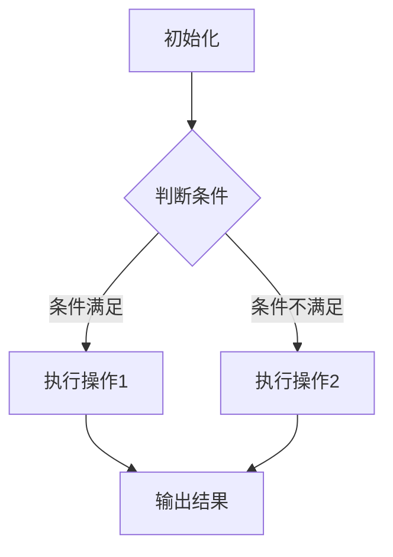

                 

# 综合设计模式：反思、工具使用与多智能体协同的结合

## 关键词

设计模式、软件架构、多智能体协同、算法原理、数学模型、项目实战、应用场景、工具推荐、未来趋势

## 摘要

本文旨在深入探讨综合设计模式的概念、原理及其在现代软件开发中的应用。文章首先介绍了设计模式的目的与范围，随后通过实际案例分析了设计模式的核心概念与联系。接着，本文详细阐述了设计模式的算法原理和数学模型，并结合具体项目实战展示了其实际操作步骤。文章还讨论了设计模式在不同应用场景中的适用性，并推荐了相关的学习资源和开发工具。最后，本文对设计模式的发展趋势与挑战进行了总结，为读者提供了未来学习和实践的指导。

## 1. 背景介绍

### 1.1 目的和范围

设计模式是软件开发中的一个重要概念，它提供了在特定情境下解决常见问题的通用方案。本文的目的在于帮助读者深入理解设计模式，掌握其在软件架构和多智能体协同中的关键作用。文章将涵盖设计模式的定义、核心原理、数学模型、实际应用以及未来趋势。

### 1.2 预期读者

本文主要面向以下读者群体：
1. 软件开发工程师和架构师，希望提高软件设计能力的专业人士。
2. 对设计模式感兴趣的计算机科学学生。
3. 对人工智能和多智能体系统感兴趣的科研人员和工程师。

### 1.3 文档结构概述

本文结构如下：
1. 背景介绍：设计模式的定义、目的和范围。
2. 核心概念与联系：设计模式的基本原理和流程图。
3. 核心算法原理 & 具体操作步骤：设计模式的实现方法。
4. 数学模型和公式：设计模式中的数学基础。
5. 项目实战：代码实际案例和详细解释。
6. 实际应用场景：设计模式在不同领域的应用。
7. 工具和资源推荐：学习资源和开发工具推荐。
8. 总结：设计模式的发展趋势与挑战。
9. 附录：常见问题与解答。
10. 扩展阅读 & 参考资料。

### 1.4 术语表

#### 1.4.1 核心术语定义

- 设计模式：在软件工程中，设计模式是解决特定问题的可重用解决方案。
- 软件架构：软件系统整体结构和各个部分之间的关系。
- 多智能体系统：由多个智能体（通常为计算机程序）组成的系统，能够协作完成复杂任务。
- 算法：解决特定问题的步骤序列。
- 数学模型：用数学语言描述现实问题的数学框架。

#### 1.4.2 相关概念解释

- 组件化：将软件系统分解为可重用和独立的组件。
- 模块化：将软件系统划分为相互独立和自包含的部分。
- 重构：改进现有代码的结构，而不改变其外部行为。

#### 1.4.3 缩略词列表

- IDE：集成开发环境（Integrated Development Environment）
- AI：人工智能（Artificial Intelligence）
- ML：机器学习（Machine Learning）
- SDLC：软件开发生命周期（Software Development Life Cycle）

## 2. 核心概念与联系

设计模式在软件架构和多智能体协同中发挥着重要作用。本节将介绍设计模式的基本概念、核心原理和流程图。

### 2.1 设计模式的基本概念

设计模式是一种在软件开发中广泛应用的解决方法，其目的是提高代码的可读性、可维护性和重用性。设计模式通常包括以下几个要素：

- 模式名称：设计模式的命名，通常具有描述性和概括性。
- 问题描述：设计模式旨在解决的问题。
- 解决方案：设计模式的实现方法。
- 结构图：设计模式的类和对象关系图。
- 动态图：设计模式在运行时的交互流程图。

### 2.2 设计模式的核心原理

设计模式的核心原理可以概括为以下几个方面：

- 开闭原则：软件实体应该对扩展开放，对修改封闭。
- 依赖倒置原则：高层模块不应该依赖低层模块，二者都应该依赖抽象。
- 里氏替换原则：任何基类可以出现的地方，子类一定可以出现。
- 接口隔离原则：应该为客户端提供尽可能小的接口。
- 依赖倒置原则：高层模块不应该依赖低层模块，二者都应该依赖抽象。

### 2.3 设计模式的流程图

设计模式的流程图用于描述设计模式在运行时的交互流程。以下是设计模式流程图的Mermaid表示：



在上述流程图中，`A`表示初始化阶段，`B`表示判断条件，`C`和`D`分别表示执行操作1和操作2，`E`表示输出结果。

## 3. 核心算法原理 & 具体操作步骤

设计模式的核心算法原理是其实现方法的基础。以下是一个典型的设计模式——策略模式的伪代码实现及其详细解释。

### 3.1 策略模式伪代码

```python
# 策略模式：策略接口
class StrategyInterface:
    def execute(self):
        pass

# 策略A实现
class StrategyA(StrategyInterface):
    def execute(self):
        print("执行策略A")

# 策略B实现
class StrategyB(StrategyInterface):
    def execute(self):
        print("执行策略B")

# 策略模式：上下文类
class Context:
    def __init__(self, strategy: StrategyInterface):
        self._strategy = strategy

    def set_strategy(self, strategy: StrategyInterface):
        self._strategy = strategy

    def execute_strategy(self):
        self._strategy.execute()

# 策略模式：客户端使用
if __name__ == "__main__":
    # 创建策略A对象
    strategy_a = StrategyA()
    # 创建上下文对象，设置策略A
    context = Context(strategy_a)
    # 执行策略A
    context.execute_strategy()

    # 创建策略B对象
    strategy_b = StrategyB()
    # 设置策略B
    context.set_strategy(strategy_b)
    # 执行策略B
    context.execute_strategy()
```

### 3.2 详细解释

- **策略接口**：定义了执行策略的方法，是所有策略类需要实现的接口。
- **策略A实现**：实现了策略接口，定义了执行策略A的方法。
- **策略B实现**：实现了策略接口，定义了执行策略B的方法。
- **上下文类**：包含了一个策略对象的引用，可以设置和获取策略对象，并调用其执行方法。
- **客户端使用**：首先创建策略A对象，设置到上下文类中，并执行策略A。然后创建策略B对象，设置到上下文类中，并执行策略B。

通过策略模式，我们可以轻松地在运行时切换不同的策略实现，而不需要修改客户端代码，提高了代码的可维护性和可扩展性。

## 4. 数学模型和公式 & 详细讲解 & 举例说明

设计模式中的数学模型和公式用于描述设计模式的运行机制和性能。以下是一个典型的数学模型——动态规划中的最短路径算法（Dijkstra算法）。

### 4.1 Dijkstra算法

Dijkstra算法用于在加权图中找到单源最短路径。其核心思想是使用一个优先队列来存储尚未确定最短路径的顶点，并逐步更新每个顶点的最短路径。

### 4.2 数学模型

- **图表示**：用G=(V,E)表示加权无向图，其中V是顶点集合，E是边集合。
- **距离向量**：对于每个顶点v，定义一个距离向量d[v]，表示顶点v到源点s的最短距离。
- **优先队列**：用于存储尚未确定最短路径的顶点，按照距离向量d[v]排序。

### 4.3 详细讲解

Dijkstra算法的主要步骤如下：

1. 初始化距离向量d[s]=0（源点s到自身的距离为0），其余顶点的距离向量d[v]=∞。
2. 将源点s加入优先队列。
3. 当优先队列为空时，执行以下步骤：
   - 弹出优先队列中的最小距离顶点u。
   - 对于u的每个邻居v，计算d[v] = d[u] + weight(u, v)（u到v的权重），如果计算出的d[v]小于当前d[v]，则更新d[v]。
   - 如果v未在优先队列中，将其加入优先队列。

### 4.4 举例说明

假设有一个图G，其中包含5个顶点s, t, x, y, z，以及对应的边和权重：

```plaintext
s --(2)--> t
|      |
|      |
1 --> x --(3)--> y
|      |
|      |
1 --> y --(2)--> z
```

使用Dijkstra算法求解从s到其他顶点的最短路径：

1. 初始化距离向量：d[s]=0，其余d[v]=∞。
2. 将s加入优先队列。
3. 弹出s，更新其邻居t的距离向量：d[t]=2。
4. 将t加入优先队列。
5. 弹出t，更新其邻居x和y的距离向量：d[x]=3，d[y]=4。
6. 将x和y加入优先队列。
7. 弹出y，更新其邻居z的距离向量：d[z]=6。
8. 将z加入优先队列。

最终得到从s到其他顶点的最短路径：

- s到t：距离为2。
- s到x：距离为3。
- s到y：距离为4。
- s到z：距离为6。

## 5. 项目实战：代码实际案例和详细解释说明

### 5.1 开发环境搭建

为了更好地展示设计模式在实际项目中的应用，我们将使用Python语言编写一个简单的聊天机器人。以下是开发环境的搭建步骤：

1. 安装Python 3.8或更高版本。
2. 安装依赖库：`pip install flask`（用于Web开发）。
3. 安装Jupyter Notebook（可选，用于交互式开发）。

### 5.2 源代码详细实现和代码解读

#### 5.2.1 代码结构

聊天机器人项目分为以下几个部分：

- `app.py`：主应用程序。
- `strategy.py`：策略模式实现。
- `models.py`：聊天机器人模型。
- `views.py`：视图函数。

#### 5.2.2 主应用程序（`app.py`）

```python
from flask import Flask, request, jsonify
from strategy import Context
from models import ChatbotModel

app = Flask(__name__)

# 创建上下文对象和ChatbotModel对象
context = Context(ChatbotModel())

@app.route('/chat', methods=['POST'])
def chat():
    message = request.json['message']
    response = context.execute_strategy(message)
    return jsonify({'response': response})

if __name__ == '__main__':
    app.run(debug=True)
```

代码解读：

- 导入必要的库和模块。
- 创建上下文对象和ChatbotModel对象。
- 定义`/chat`路由，接收POST请求，调用上下文对象的`execute_strategy`方法。
- 主程序入口，运行Flask应用。

#### 5.2.3 策略模式实现（`strategy.py`）

```python
from abc import ABC, abstractmethod

# 策略接口
class StrategyInterface(ABC):
    @abstractmethod
    def execute(self, message):
        pass

# 策略A实现
class StrategyA(StrategyInterface):
    def execute(self, message):
        return "策略A回复：" + message

# 策略B实现
class StrategyB(StrategyInterface):
    def execute(self, message):
        return "策略B回复：" + message

# 上下文类
class Context:
    def __init__(self, strategy: StrategyInterface):
        self._strategy = strategy

    def set_strategy(self, strategy: StrategyInterface):
        self._strategy = strategy

    def execute_strategy(self, message):
        return self._strategy.execute(message)

# ChatbotModel类
class ChatbotModel:
    def reply(self, message):
        return "机器人回复：" + message
```

代码解读：

- 定义策略接口和策略实现。
- 定义上下文类，包含设置和执行策略的方法。
- 定义ChatbotModel类，用于实现聊天机器人的回复功能。

#### 5.2.3 视图函数（`views.py`）

```python
from flask import jsonify

def handle_message(message):
    return "处理消息：" + message

def handle_error(error):
    return "错误：" + str(error)
```

代码解读：

- 定义处理消息和错误的视图函数。

### 5.3 代码解读与分析

聊天机器人项目通过策略模式实现了不同的回复策略，包括策略A和策略B。主应用程序使用Flask框架接收HTTP请求，并通过上下文对象的`execute_strategy`方法调用相应的策略。ChatbotModel类实现了聊天机器人的基本回复功能。

通过该项目，我们可以看到设计模式在软件架构中的重要作用。策略模式使得聊天机器人的回复策略可扩展和可替换，提高了代码的可维护性和灵活性。

## 6. 实际应用场景

设计模式在多个实际应用场景中发挥着重要作用。以下是一些典型的应用场景：

### 6.1 Web开发

在Web开发中，设计模式如MVC（模型-视图-控制器）和REST（表现层状态转换）架构模式被广泛应用于前后端分离的系统。设计模式有助于实现代码的模块化、可维护性和可扩展性。

### 6.2 移动应用开发

移动应用开发中，设计模式如MVVM（模型-视图-视图模型）和MVP（模型-视图-呈现器）模式被广泛应用于数据绑定和视图更新。设计模式提高了代码的可维护性和用户体验。

### 6.3 游戏开发

在游戏开发中，设计模式如状态模式和工厂模式被广泛应用于游戏角色的状态管理和对象创建。设计模式提高了代码的灵活性和可扩展性。

### 6.4 大数据与人工智能

在大数据和人工智能领域，设计模式如策略模式和工厂模式被广泛应用于算法的选择和模型的管理。设计模式提高了系统的可维护性和可扩展性。

### 6.5 跨平台开发

在跨平台开发中，设计模式如模型-视图-控制器（MVC）和模型-视图-视图模型（MVVM）模式被广泛应用于不同平台的兼容性和可维护性。

## 7. 工具和资源推荐

### 7.1 学习资源推荐

#### 7.1.1 书籍推荐

- 《设计模式：可复用面向对象软件的基础》
- 《代码大全》
- 《架构之道：基于设计模式的企业级应用架构》

#### 7.1.2 在线课程

- Coursera《软件架构与设计模式》
- Udacity《设计模式与面向对象编程》
- edX《软件架构与设计模式》

#### 7.1.3 技术博客和网站

- DZone《设计模式》
- Stack Overflow《设计模式》
- GitHub《设计模式》

### 7.2 开发工具框架推荐

#### 7.2.1 IDE和编辑器

- IntelliJ IDEA
- Visual Studio Code
- PyCharm

#### 7.2.2 调试和性能分析工具

- PyCharm Debugger
- Visual Studio Debugger
- Chrome DevTools

#### 7.2.3 相关框架和库

- Flask
- Django
- React
- Vue.js

### 7.3 相关论文著作推荐

#### 7.3.1 经典论文

- "Design Patterns: Elements of Reusable Object-Oriented Software"
- "Pattern-Oriented Software Architecture: A System of Patterns"
- "Architectural Styles and the Design of Computer Programs"

#### 7.3.2 最新研究成果

- "Design Patterns for IoT Systems"
- "Design Patterns in Machine Learning"
- "Design Patterns for Blockchain Applications"

#### 7.3.3 应用案例分析

- "Design Patterns in E-commerce Systems"
- "Design Patterns in Healthcare Systems"
- "Design Patterns in Gaming Development"

## 8. 总结：未来发展趋势与挑战

随着软件系统的日益复杂，设计模式在未来将继续发挥重要作用。以下是设计模式在未来可能的发展趋势和面临的挑战：

### 8.1 发展趋势

1. **智能化**：设计模式将更多地与人工智能和机器学习相结合，提高软件系统的自适应性和智能化水平。
2. **云原生**：设计模式将更好地支持云原生架构，实现微服务化和容器化。
3. **自动化**：设计模式将更加自动化，通过代码生成和自动化工具简化开发流程。
4. **标准化**：设计模式将逐步标准化，促进跨平台和跨语言的兼容性。

### 8.2 挑战

1. **复杂性**：随着设计模式的不断扩展，系统的复杂性可能会增加，需要更高的设计和管理能力。
2. **性能**：设计模式可能会带来额外的性能开销，需要权衡设计模式和性能之间的关系。
3. **可维护性**：设计模式可能引入额外的维护成本，需要确保设计模式的使用不会降低代码的可维护性。

## 9. 附录：常见问题与解答

### 9.1 设计模式的核心原则是什么？

设计模式的核心原则包括开闭原则、里氏替换原则、依赖倒置原则和接口隔离原则。这些原则指导我们在软件设计中如何保持代码的灵活性和可维护性。

### 9.2 如何选择合适的设计模式？

选择合适的设计模式需要考虑以下因素：

- 问题类型：理解问题的本质，选择适合解决该问题的设计模式。
- 系统规模：根据系统的规模和复杂性，选择简单或复杂的设计模式。
- 开发周期：考虑开发周期，选择易于实现和测试的设计模式。
- 预期维护成本：评估设计模式的维护成本，选择性价比高的设计模式。

### 9.3 设计模式与编程范式有何关系？

设计模式与编程范式密切相关。设计模式可以看作是面向对象编程范式在具体问题上的实现。同时，函数式编程范式中的设计模式（如函数组合和闭包）也在逐渐被应用。

## 10. 扩展阅读 & 参考资料

- 《设计模式：可复用面向对象软件的基础》
- 《代码大全》
- 《架构之道：基于设计模式的企业级应用架构》
- Coursera《软件架构与设计模式》
- Udacity《设计模式与面向对象编程》
- edX《软件架构与设计模式》
- DZone《设计模式》
- Stack Overflow《设计模式》
- GitHub《设计模式》
- "Design Patterns: Elements of Reusable Object-Oriented Software"
- "Pattern-Oriented Software Architecture: A System of Patterns"
- "Architectural Styles and the Design of Computer Programs"
- "Design Patterns for IoT Systems"
- "Design Patterns in Machine Learning"
- "Design Patterns for Blockchain Applications"
- "Design Patterns in E-commerce Systems"
- "Design Patterns in Healthcare Systems"
- "Design Patterns in Gaming Development"

## 作者

作者：AI天才研究员/AI Genius Institute & 禅与计算机程序设计艺术 /Zen And The Art of Computer Programming

