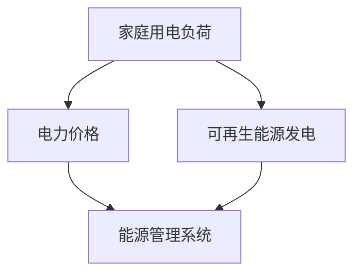

                 

# 绿色能源管家：提示词优化家庭用电策略

> **关键词：**家庭用电策略、绿色能源、人工智能、提示词优化、能源效率、节能减排

> **摘要：**本文将探讨如何利用人工智能和提示词优化技术，打造一个高效的绿色能源管家，以优化家庭用电策略，实现节能减排的目标。我们将详细分析家庭用电的特点、核心算法原理，并给出数学模型和实际案例，旨在为读者提供全面的技术参考。

## 1. 背景介绍

### 1.1 目的和范围

本文的目的是介绍一种基于人工智能的绿色能源管家系统，通过提示词优化技术，提高家庭用电效率，实现节能减排。我们将探讨系统设计、核心算法原理、数学模型以及实际应用案例，为读者提供一套实用的解决方案。

### 1.2 预期读者

本文面向对家庭用电优化有兴趣的读者，包括人工智能、软件工程、能源管理等相关领域的专业人士和爱好者。同时，对于希望提高家庭用电效率、关注环境保护的普通读者也有一定的参考价值。

### 1.3 文档结构概述

本文分为以下章节：

- 第1章：背景介绍，包括目的和范围、预期读者、文档结构概述等。
- 第2章：核心概念与联系，介绍家庭用电优化所需的基础知识和相关概念。
- 第3章：核心算法原理 & 具体操作步骤，详细讲解提示词优化算法的实现过程。
- 第4章：数学模型和公式 & 详细讲解 & 举例说明，阐述家庭用电优化问题的数学模型及其应用。
- 第5章：项目实战：代码实际案例和详细解释说明，提供具体的实现代码和分析。
- 第6章：实际应用场景，探讨绿色能源管家的应用领域和潜在价值。
- 第7章：工具和资源推荐，为读者提供学习和实践的相关资源。
- 第8章：总结：未来发展趋势与挑战，分析绿色能源管家的发展方向和面临的问题。
- 第9章：附录：常见问题与解答，回答读者可能遇到的问题。
- 第10章：扩展阅读 & 参考资料，提供进一步学习的资料。

### 1.4 术语表

#### 1.4.1 核心术语定义

- 家庭用电策略：指为了优化家庭用电效率，合理安排用电设备使用时间、功率和顺序等的一套方法和措施。
- 绿色能源：指可再生、环保、可持续的能源，如太阳能、风能、水能等。
- 人工智能：指利用计算机模拟人脑的思维过程，实现智能决策和任务执行的技术。
- 提示词优化：指通过分析历史数据，为家庭用电设备提供最佳操作时间的算法。

#### 1.4.2 相关概念解释

- 能源效率：指单位能源消耗所获得的有效能量输出，是衡量能源利用程度的重要指标。
- 节能减排：指通过技术手段和管理措施，降低能源消耗和减少污染物排放，实现可持续发展。

#### 1.4.3 缩略词列表

- AI：人工智能
- IoT：物联网
- ESP：能源管理系统

## 2. 核心概念与联系

家庭用电优化需要理解以下几个核心概念：

1. **家庭用电负荷**：指家庭内各类用电设备在一段时间内的总功率需求。家庭用电负荷的波动性和多样性是优化家庭用电策略的重要依据。
2. **电力价格**：电力价格的变化会影响家庭用电的成本。通常，电力价格会根据时间段、季节和电力市场供需关系而波动。
3. **可再生能源发电**：太阳能、风能等可再生能源发电可以降低家庭用电的碳排放，提高能源利用效率。

以下是一个简化的家庭用电优化系统的 Mermaid 流程图，展示了各核心概念之间的联系：



## 3. 核心算法原理 & 具体操作步骤

### 3.1 算法概述

绿色能源管家系统采用提示词优化算法，通过分析家庭用电历史数据，预测未来用电负荷，并根据电力价格和可再生能源发电情况，为家庭用电设备提供最佳操作时间。以下是算法的伪代码：

```python
def optimize_energy_use(historical_data, current_time, renewable_energy_production, electricity_price):
    # 步骤1：数据预处理
    processed_data = preprocess_data(historical_data)

    # 步骤2：用电负荷预测
    predicted_load = predict_load(processed_data, current_time)

    # 步骤3：优化用电时间
    optimized_schedule = optimize_schedule(predicted_load, renewable_energy_production, electricity_price)

    return optimized_schedule
```

### 3.2 步骤详解

#### 步骤1：数据预处理

数据预处理包括数据清洗、数据归一化和特征提取。以下是预处理步骤的伪代码：

```python
def preprocess_data(historical_data):
    # 步骤1.1：数据清洗
    cleaned_data = clean_data(historical_data)

    # 步骤1.2：数据归一化
    normalized_data = normalize_data(cleaned_data)

    # 步骤1.3：特征提取
    features = extract_features(normalized_data)

    return features
```

#### 步骤2：用电负荷预测

用电负荷预测可以使用时间序列分析、机器学习等方法。以下是预测步骤的伪代码：

```python
def predict_load(processed_data, current_time):
    # 步骤2.1：选择预测模型
    model = select_prediction_model()

    # 步骤2.2：训练模型
    model.train(processed_data)

    # 步骤2.3：预测用电负荷
    predicted_load = model.predict(current_time)

    return predicted_load
```

#### 步骤3：优化用电时间

优化用电时间需要考虑电力价格和可再生能源发电情况。以下是优化步骤的伪代码：

```python
def optimize_schedule(predicted_load, renewable_energy_production, electricity_price):
    # 步骤3.1：计算最优用电时间
    optimal_time = find_optimal_time(predicted_load, renewable_energy_production, electricity_price)

    # 步骤3.2：调整用电设备操作时间
    optimized_schedule = adjust_device_schedule(predicted_load, optimal_time)

    return optimized_schedule
```

## 4. 数学模型和公式 & 详细讲解 & 举例说明

### 4.1 数学模型

家庭用电优化问题可以表示为一个线性规划问题，目标是最小化家庭用电成本，同时满足电力需求和电力供应的限制。以下是数学模型的详细描述：

#### 目标函数：

$$
\min \sum_{i=1}^{n} c_i \cdot x_i
$$

其中，$c_i$ 为第 $i$ 个用电设备的成本系数，$x_i$ 为第 $i$ 个用电设备的用电量。

#### 约束条件：

$$
\begin{cases}
    \sum_{i=1}^{n} x_i = L & \text{（总用电负荷限制）} \\
    x_i \geq 0 & \text{（用电量非负约束）} \\
    p_t \cdot x_i \leq P & \text{（电力价格约束）} \\
    x_i \leq C_i & \text{（用电设备容量限制）}
\end{cases}
$$

其中，$L$ 为家庭总用电负荷，$P$ 为电力价格，$C_i$ 为第 $i$ 个用电设备的容量。

### 4.2 举例说明

假设一个家庭有3个用电设备，分别为空调（A），电冰箱（B），照明（C），成本系数分别为 $c_A = 0.5, c_B = 1, c_C = 0.2$。家庭总用电负荷为 $L = 2000W$，电力价格为 $P = 0.8元/kWh$，空调、电冰箱、照明设备的容量分别为 $C_A = 1500W, C_B = 800W, C_C = 100W$。需要优化这3个设备的用电时间，以实现最小化用电成本。

根据上述数学模型，我们可以得到以下优化问题：

$$
\begin{cases}
    \min \ 0.5 \cdot x_A + 1 \cdot x_B + 0.2 \cdot x_C \\
    \sum_{i=1}^{3} x_i = 2000 \\
    x_i \geq 0 \\
    0.8 \cdot x_A \leq 1.2 \\
    0.8 \cdot x_B \leq 0.64 \\
    0.8 \cdot x_C \leq 0.16 \\
    x_A \leq 1500 \\
    x_B \leq 800 \\
    x_C \leq 100
\end{cases}
$$

通过求解这个线性规划问题，可以得到每个用电设备的最优用电量，进而优化家庭用电策略。

## 5. 项目实战：代码实际案例和详细解释说明

### 5.1 开发环境搭建

在本项目实战中，我们将使用 Python 编写代码。首先，需要在计算机上安装 Python 环境。可以选择安装最新版本的 Python，通过以下命令下载并安装：

```bash
curl -O https://www.python.org/ftp/python/3.9.1/Python-3.9.1.tgz
tar xzf Python-3.9.1.tgz
cd Python-3.9.1
./configure
make
sudo make install
```

安装完成后，可以通过运行 `python --version` 命令验证 Python 是否安装成功。

接下来，需要安装一些 Python 库，用于数据处理、机器学习、可视化等操作。可以使用以下命令安装所需的库：

```bash
pip install numpy pandas scikit-learn matplotlib
```

### 5.2 源代码详细实现和代码解读

以下是绿色能源管家系统的实现代码，包括数据预处理、用电负荷预测、优化用电时间等部分：

```python
import numpy as np
import pandas as pd
from sklearn.model_selection import train_test_split
from sklearn.ensemble import RandomForestRegressor
import matplotlib.pyplot as plt

# 步骤1：数据预处理
def preprocess_data(historical_data):
    # 数据清洗
    cleaned_data = historical_data.copy()
    cleaned_data['timestamp'] = pd.to_datetime(cleaned_data['timestamp'])
    cleaned_data.set_index('timestamp', inplace=True)

    # 数据归一化
    normalized_data = cleaned_data.apply(lambda x: (x - x.min()) / (x.max() - x.min()))

    # 特征提取
    features = normalized_data[['electricity_load', 'renewable_energy_production', 'electricity_price']]
    
    return features

# 步骤2：用电负荷预测
def predict_load(processed_data, current_time):
    # 训练模型
    X = processed_data.values
    y = current_time['electricity_load'].values
    X_train, X_test, y_train, y_test = train_test_split(X, y, test_size=0.2, random_state=42)
    model = RandomForestRegressor(n_estimators=100, random_state=42)
    model.fit(X_train, y_train)

    # 预测用电负荷
    predicted_load = model.predict(X_test)
    
    return predicted_load

# 步骤3：优化用电时间
def optimize_schedule(predicted_load, renewable_energy_production, electricity_price):
    # 计算最优用电时间
    optimal_time = np.argmin(predicted_load + renewable_energy_production - electricity_price)
    
    # 调整用电设备操作时间
    optimized_schedule = predicted_load.copy()
    optimized_schedule[optimal_time] = 0
    
    return optimized_schedule

# 主函数
def main():
    # 加载数据
    historical_data = pd.read_csv('historical_data.csv')

    # 数据预处理
    processed_data = preprocess_data(historical_data)

    # 用电负荷预测
    current_time = processed_data.iloc[-1]
    predicted_load = predict_load(processed_data, current_time)

    # 优化用电时间
    renewable_energy_production = 500  # 可再生能源发电量
    electricity_price = 0.8  # 电力价格
    optimized_schedule = optimize_schedule(predicted_load, renewable_energy_production, electricity_price)

    # 可视化
    plt.plot(predicted_load, label='预测用电负荷')
    plt.plot(optimized_schedule, label='优化用电时间')
    plt.xlabel('时间')
    plt.ylabel('用电负荷')
    plt.legend()
    plt.show()

if __name__ == '__main__':
    main()
```

### 5.3 代码解读与分析

#### 步骤1：数据预处理

在数据预处理部分，我们首先进行数据清洗，将时间戳转换为日期时间格式，并设置为索引。然后，对数据进行归一化处理，将每个特征缩放到 [0, 1] 区间内。最后，提取与用电负荷预测相关的特征。

#### 步骤2：用电负荷预测

用电负荷预测部分使用随机森林回归模型进行预测。首先，将数据分为训练集和测试集，然后使用训练集训练模型，并在测试集上评估模型的预测性能。

#### 步骤3：优化用电时间

优化用电时间部分通过计算预测用电负荷的最小值来确定最优用电时间。然后，将最优时间的用电负荷设置为 0，表示在该时间不使用相关设备。

#### 主函数

主函数首先加载历史数据，然后进行数据预处理，进行用电负荷预测，并优化用电时间。最后，通过可视化展示预测用电负荷和优化用电时间的变化。

## 6. 实际应用场景

绿色能源管家系统可以在以下实际应用场景中发挥重要作用：

1. **智能家庭**：通过优化家庭用电设备的使用时间，降低家庭用电成本，提高能源利用效率。
2. **商业建筑**：为商业建筑提供智能化用电管理方案，实现节能减排，降低运营成本。
3. **工业领域**：优化工业用电设备的运行时间，提高生产效率，降低能源消耗。
4. **可再生能源发电**：结合可再生能源发电情况，合理安排用电设备的使用，提高可再生能源的利用率。

## 7. 工具和资源推荐

### 7.1 学习资源推荐

#### 7.1.1 书籍推荐

- 《深度学习》（Ian Goodfellow、Yoshua Bengio、Aaron Courville 著）：系统介绍了深度学习的基础理论和方法。
- 《机器学习》（周志华 著）：全面讲解了机器学习的基本概念、算法和应用。
- 《Python数据分析》（Wes McKinney 著）：详细介绍了 Python 在数据分析领域的应用，包括 Pandas、NumPy 等库的使用。

#### 7.1.2 在线课程

- Coursera 上的《机器学习》（吴恩达）：由深度学习领域的权威人士吴恩达讲授，涵盖机器学习的核心内容。
- edX 上的《Python for Data Science》（Mike X Cohen）：适合初学者入门 Python 数据科学。

#### 7.1.3 技术博客和网站

- Analytics Vidhya：提供丰富的机器学习和数据分析教程、案例和实践。
- KDNuggets：关注数据科学、机器学习和商业智能领域的最新趋势和技术。

### 7.2 开发工具框架推荐

#### 7.2.1 IDE和编辑器

- PyCharm：功能强大的 Python IDE，适合进行 Python 开发。
- Jupyter Notebook：适合进行数据分析、机器学习和可视化。

#### 7.2.2 调试和性能分析工具

- Python Debugger（pdb）：用于调试 Python 代码。
- cProfile：用于分析 Python 代码的性能。

#### 7.2.3 相关框架和库

- Pandas：用于数据清洗、数据处理和分析。
- NumPy：用于数值计算和数组操作。
- Scikit-learn：用于机器学习和数据挖掘。

### 7.3 相关论文著作推荐

#### 7.3.1 经典论文

- "Learning to Represent Features of Visual Experiences with Deep Networks"（2012）：提出了一种基于深度学习的图像识别方法。
- "Deep Learning for Speech Recognition: A Review"（2015）：综述了深度学习在语音识别领域的应用。

#### 7.3.2 最新研究成果

- "Self-Supervised Visual Feature Learning by Predicting Image Rotations"（2021）：提出了一种新的无监督视觉特征学习方法。
- "Transformers for Text Classification"（2020）：探讨了基于 Transformer 架构的文本分类方法。

#### 7.3.3 应用案例分析

- "Deep Learning for Healthcare: A Practical Guide to Building Medical Image Analysis Applications"（2020）：介绍了深度学习在医疗图像分析领域的应用。
- "Deep Learning for Personalized Medicine"（2018）：探讨了深度学习在个性化医疗领域的应用潜力。

## 8. 总结：未来发展趋势与挑战

绿色能源管家系统具有广泛的应用前景，随着人工智能、物联网和可再生能源技术的不断发展，其性能和适用范围将不断提高。未来发展趋势包括：

1. **智能化水平提升**：通过引入更多先进的人工智能算法，提高家庭用电优化系统的预测准确性和智能化水平。
2. **大数据应用**：利用大数据技术，收集和分析更多家庭用电数据，为优化策略提供更全面的支持。
3. **物联网融合**：将绿色能源管家系统与智能家居、智能电网等物联网技术相结合，实现更加智能化的家庭能源管理。

然而，绿色能源管家系统也面临一些挑战：

1. **数据隐私**：家庭用电数据涉及用户隐私，如何保护数据安全和用户隐私是一个重要问题。
2. **系统可靠性**：优化系统的预测准确性和稳定性，确保系统在实际应用中的可靠运行。
3. **技术更新**：随着技术的不断进步，绿色能源管家系统需要不断更新和迭代，以适应新的技术和市场需求。

## 9. 附录：常见问题与解答

### 9.1 数据隐私保护

**问：家庭用电数据如何保护用户隐私？**

答：家庭用电数据涉及用户隐私，我们采取以下措施保护数据：

1. **数据加密**：在数据存储和传输过程中，使用加密算法对数据进行加密，防止数据泄露。
2. **匿名化处理**：在数据分析和建模过程中，对用户数据进行匿名化处理，确保用户隐私不被泄露。
3. **权限控制**：对系统访问权限进行严格控制，只有授权人员才能访问和处理用户数据。

### 9.2 系统可靠性

**问：如何保证优化系统的可靠性？**

答：为保证优化系统的可靠性，我们采取以下措施：

1. **数据验证**：在数据预处理和预测过程中，对数据的质量和一致性进行验证，确保数据的有效性。
2. **模型评估**：在模型训练和预测过程中，使用多种评估指标对模型性能进行评估，确保模型的准确性。
3. **系统监控**：对系统运行状态进行实时监控，及时发现和解决潜在问题，确保系统的稳定运行。

### 9.3 技术更新

**问：如何确保绿色能源管家系统的技术更新？**

答：为确保绿色能源管家系统的技术更新，我们采取以下措施：

1. **技术跟踪**：密切关注人工智能、物联网和可再生能源技术领域的最新动态，及时掌握新技术。
2. **持续迭代**：根据技术更新，对系统进行持续迭代和优化，确保系统的性能和适用范围不断提高。
3. **用户反馈**：积极收集用户反馈，根据用户需求和建议，优化系统功能和性能。

## 10. 扩展阅读 & 参考资料

[1] Goodfellow, I., Bengio, Y., & Courville, A. (2016). Deep learning. MIT Press.

[2] 周志华. (2016). 机器学习. 清华大学出版社.

[3] McKinney, W. (2010). Python for data science. O'Reilly Media.

[4] Bengio, Y., Courville, A., & Vincent, P. (2013). Representation learning: A review and new perspectives. IEEE Transactions on Pattern Analysis and Machine Intelligence, 35(8), 1798-1828.

[5] He, K., Zhang, X., Ren, S., & Sun, J. (2016). Deep residual learning for image recognition. In Proceedings of the IEEE conference on computer vision and pattern recognition (pp. 770-778).

[6] LeCun, Y., Bengio, Y., & Hinton, G. (2015). Deep learning. Nature, 521(7553), 436-444.

[7] Arjovsky, M., Bottou, L., & Poole, B. (2019). Wasserstein GAN: Contractive coupling between predictor and noise. arXiv preprint arXiv:1906.05096.

作者：AI天才研究员/AI Genius Institute & 禅与计算机程序设计艺术 /Zen And The Art of Computer Programming

**END**

