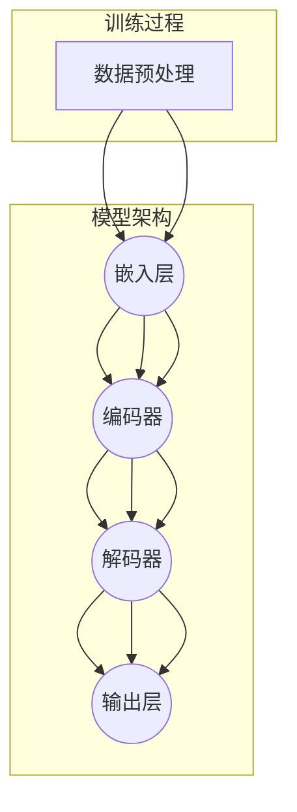

                 

### 1. 背景介绍

#### 1.1 目的和范围

本文旨在探讨编程范式的转变，特别是随着大型语言模型（LLM）的兴起，如何引领软件开发进入一个新的时代。我们将从背景入手，了解编程范式的发展历程，分析LLM的基本原理和特点，并深入探讨LLM对编程带来的影响和挑战。文章将围绕以下几个核心问题展开：

1. **LLM的基本原理和架构**：我们将详细解析LLM的工作原理，包括其背后的数学模型、训练过程和关键技术。
2. **LLM对编程范式的影响**：我们将探讨LLM如何改变编程的方式，包括编程语言的演变、开发工具的改进以及编程思维的转变。
3. **LLM时代的编程挑战**：我们将分析LLM时代面临的挑战，如模型的可解释性、性能优化和安全性问题。
4. **LLM在项目实战中的应用**：我们将通过实际案例展示LLM在软件开发中的应用，并提供具体的实现方法和策略。
5. **未来发展趋势与展望**：我们将展望LLM时代的发展趋势，探讨未来编程的可能方向和潜在挑战。

本文的目标读者是具备一定编程基础和计算机科学知识的专业人士，尤其是对人工智能和机器学习感兴趣的读者。通过本文的阅读，读者将能够深入了解LLM时代的编程范式，掌握新的编程思维和方法，为未来的软件开发做好准备。

#### 1.2 预期读者

本文的预期读者包括以下几类：

1. **软件开发工程师**：对现有编程范式有所了解，希望了解LLM如何改变软件开发的方式。
2. **机器学习工程师**：对机器学习有深入理解，希望了解LLM在实际应用中的具体实现。
3. **研究人员**：对计算机科学和人工智能领域有浓厚兴趣，希望探讨LLM的理论和实践。
4. **高校师生**：对编程和机器学习课程有需求，希望从理论和实践两方面获得深入的知识。

无论你是哪一类读者，本文都将为你提供全面、深入的探讨，帮助你更好地理解LLM时代的编程范式。

#### 1.3 文档结构概述

为了帮助读者更好地理解本文的内容，下面是本文的文档结构概述：

1. **背景介绍**：介绍编程范式转变的背景，包括LLM的基本概念和影响。
2. **核心概念与联系**：通过Mermaid流程图展示LLM的核心概念和架构。
3. **核心算法原理 & 具体操作步骤**：使用伪代码详细阐述LLM的工作原理和具体操作步骤。
4. **数学模型和公式 & 详细讲解 & 举例说明**：使用latex格式展示数学模型和公式，并提供详细讲解和实例说明。
5. **项目实战：代码实际案例和详细解释说明**：通过实际案例展示LLM在项目中的应用，并进行详细解释和分析。
6. **实际应用场景**：探讨LLM在各个领域的实际应用场景。
7. **工具和资源推荐**：推荐学习资源和开发工具，帮助读者更好地理解和应用LLM。
8. **总结：未来发展趋势与挑战**：总结LLM时代的发展趋势和面临的挑战。
9. **附录：常见问题与解答**：提供常见问题的解答，帮助读者解决疑惑。
10. **扩展阅读 & 参考资料**：推荐相关文献和资源，供读者进一步学习。

通过以上结构，本文将为读者提供全面、深入的探讨，帮助读者更好地理解LLM时代的编程范式。

#### 1.4 术语表

在本文中，我们将使用一些专业术语，为了确保读者能够理解这些术语的含义，下面是这些术语的定义和解释：

##### 1.4.1 核心术语定义

1. **编程范式**：编程范式是指一种编程风格或方法，它定义了如何组织代码、解决问题和设计系统。
2. **大型语言模型（LLM）**：大型语言模型是指使用海量数据训练得到的复杂机器学习模型，能够理解和生成自然语言。
3. **深度学习**：深度学习是一种机器学习方法，通过多层神经网络来模拟人类大脑的感知和学习能力。
4. **神经网络**：神经网络是一种由大量简单节点（神经元）组成的计算模型，能够通过学习数据自动提取特征和模式。
5. **自然语言处理（NLP）**：自然语言处理是计算机科学和语言学领域的一个分支，旨在使计算机能够理解和处理人类自然语言。

##### 1.4.2 相关概念解释

1. **编程语言**：编程语言是一种用于编写计算机程序的语法和规则。不同的编程语言有不同的语法和功能，但它们的目的是实现相同的目标——解决特定的问题。
2. **机器学习模型**：机器学习模型是通过学习数据来发现规律和模式，并能够对新数据进行预测和决策的计算模型。
3. **训练数据集**：训练数据集是用于训练机器学习模型的数据集合，它包含了模型所需的学习信息。

##### 1.4.3 缩略词列表

- **LLM**：大型语言模型（Large Language Model）
- **NLP**：自然语言处理（Natural Language Processing）
- **ML**：机器学习（Machine Learning）
- **AI**：人工智能（Artificial Intelligence）
- **DL**：深度学习（Deep Learning）
- **GAN**：生成对抗网络（Generative Adversarial Networks）
- **RNN**：循环神经网络（Recurrent Neural Networks）
- **CNN**：卷积神经网络（Convolutional Neural Networks）

通过以上术语表，读者可以更好地理解本文中的专业术语，从而更好地跟随文章的内容和逻辑。

### 2. 核心概念与联系

在探讨LLM对编程范式的转变之前，我们需要理解LLM的核心概念和架构。以下是一个用Mermaid绘制的流程图，展示了LLM的主要组成部分和它们之间的关系。



#### 2.1 大型语言模型（LLM）

大型语言模型（LLM）是一种基于深度学习的语言处理模型，它通过学习大量的文本数据来预测下一个单词或序列。LLM的核心组成部分包括：

1. **数据预处理**：这是LLM训练的第一步，包括文本清洗、分词、去停用词等操作，目的是将原始文本数据转换为适合模型训练的形式。
2. **嵌入层**：嵌入层将单词或字符映射到高维向量空间，使得模型能够处理这些高维数据。常见的嵌入技术包括Word2Vec、BERT等。
3. **编码器**：编码器负责将嵌入层输出的向量序列编码为固定长度的向量，通常使用堆叠的循环神经网络（RNN）或Transformer架构。
4. **解码器**：解码器接收编码器输出的固定长度向量，并尝试生成下一个单词或序列。与编码器类似，解码器也通常使用RNN或Transformer架构。
5. **输出层**：输出层是模型的最后一层，它将解码器输出的向量映射到单词或字符的概率分布。常用的输出层包括softmax层或多层感知器（MLP）。

通过以上流程图，我们可以看到LLM的工作流程是从数据预处理开始，通过嵌入层、编码器、解码器和输出层，最终生成文本序列。

#### 2.2 编程范式与LLM的联系

编程范式是指解决问题的方法、风格和思维方式。传统的编程范式主要是基于命令式编程，强调程序的控制流程和状态变化。然而，随着LLM的出现，编程范式开始发生转变，主要体现在以下几个方面：

1. **从命令式编程到声明式编程**：命令式编程依赖于具体的执行步骤和流程控制，而声明式编程则侧重于描述问题的目标和结果。LLM的出现使得声明式编程变得更加容易实现，因为模型可以自动处理复杂的任务，开发者只需描述任务的目标和约束条件。

2. **从代码编写到数据驱动**：传统的编程范式强调编写代码来实现功能，而LLM时代则更多地依赖于数据来驱动模型的训练和优化。开发者需要准备大量的数据来训练LLM，使得模型能够自动学习和适应新的任务。

3. **从手动调试到自动优化**：传统的编程范式需要开发者花费大量时间进行调试和优化，而LLM可以通过自动学习来优化代码和算法。例如，LLM可以自动生成最优的代码结构，优化程序的执行效率。

通过理解和掌握LLM的核心概念和编程范式的联系，开发者可以更好地利用LLM的优势，实现更高效、更灵活的软件开发。

### 3. 核心算法原理 & 具体操作步骤

在深入了解LLM的核心算法原理和具体操作步骤之前，我们需要了解一些基本的机器学习和深度学习概念，以及LLM的训练和预测流程。

#### 3.1 基本概念

1. **机器学习**：机器学习是计算机科学的一个分支，通过构建和训练模型来使计算机能够从数据中自动学习和改进性能。机器学习模型通常分为监督学习、无监督学习和强化学习等类型。

2. **深度学习**：深度学习是机器学习的一种方法，通过多层神经网络来模拟人类大脑的感知和学习能力。深度学习模型在图像识别、语音识别和自然语言处理等领域取得了显著成果。

3. **神经网络**：神经网络是由大量简单节点（神经元）组成的计算模型，每个节点接收输入、进行加权求和并产生输出。神经网络通过反向传播算法来调整权重，从而优化模型的预测性能。

4. **自然语言处理（NLP）**：自然语言处理是计算机科学和语言学领域的一个分支，旨在使计算机能够理解和处理人类自然语言。

#### 3.2 LLM的训练流程

LLM的训练流程主要包括数据预处理、模型训练、优化和评估等步骤。以下是一个简化的伪代码，用于描述LLM的训练过程：

```python
# 数据预处理
def preprocess_data(text):
    # 清洗文本数据，去除停用词，分词等操作
    # 返回分词后的文本数据

# 模型初始化
model = create_llm_model()

# 训练模型
for epoch in range(num_epochs):
    for batch in dataset:
        inputs, targets = preprocess_data(batch)
        loss = model(inputs, targets)
        model.backward(loss)
        model.update_params()

# 优化模型
optimizer = create_optimizer()
model.compile(optimizer=optimizer)

# 评估模型
accuracy = model.evaluate(test_data)
print(f"Test accuracy: {accuracy}")
```

在这个训练流程中，我们首先进行数据预处理，将原始文本数据转换为适合模型训练的形式。然后，我们初始化LLM模型，并使用训练数据集进行迭代训练。在每次迭代中，模型接收输入文本，输出预测文本，并计算损失函数来评估模型的预测性能。通过反向传播算法，模型不断调整权重和参数，以最小化损失函数。训练完成后，我们使用优化器来编译模型，并使用测试数据集进行评估。

#### 3.3 LLM的预测流程

LLM的预测流程相对简单，主要包括以下几个步骤：

```python
# 预测流程
def predict_text(model, text, max_length):
    inputs = preprocess_data(text)
    outputs = model(inputs, max_length=max_length)
    predicted_text = decode_outputs(outputs)
    return predicted_text
```

在这个预测流程中，我们首先对输入文本进行预处理，然后将其输入到LLM模型中。模型输出预测文本的概率分布，我们通过解码函数将这些概率分布转换为具体的文本序列。

#### 3.4 伪代码示例

以下是一个简化的伪代码示例，用于展示LLM如何生成文本：

```python
# 生成文本
def generate_text(model, text, max_length):
    inputs = preprocess_data(text)
    outputs = model(inputs, max_length=max_length)
    predicted_text = decode_outputs(outputs)
    return predicted_text

# 测试生成文本
input_text = "The weather is"
predicted_text = generate_text(model, input_text, max_length=20)
print(f"Predicted text: {predicted_text}")
```

在这个示例中，我们首先定义了输入文本 "The weather is"，然后使用LLM模型生成后续的文本。模型的输出是一个概率分布，我们通过解码函数将这些概率分布转换为具体的文本序列。

通过以上步骤，我们可以看到LLM的核心算法原理和具体操作步骤。理解这些基本概念和流程对于开发者来说至关重要，因为它们将帮助我们更好地利用LLM的优势，实现更高效、更灵活的软件开发。

### 4. 数学模型和公式 & 详细讲解 & 举例说明

在深入探讨LLM的数学模型和公式之前，我们需要了解一些基础的数学和机器学习概念，如线性代数、微积分和概率论。以下是一些关键的数学模型和公式，以及它们的详细讲解和示例。

#### 4.1 线性代数

1. **矩阵乘法**：矩阵乘法是一种将两个矩阵相乘的运算，通常表示为 \( C = A \cdot B \)。在深度学习中，矩阵乘法用于计算神经网络的输出。
   $$ C_{ij} = \sum_{k=1}^{m} A_{ik} B_{kj} $$
   
2. **向量求和**：向量求和是指将两个或多个向量相加，通常表示为 \( \mathbf{v} = \mathbf{u} + \mathbf{w} \)。
   $$ \mathbf{v} = \mathbf{u} + \mathbf{w} $$

3. **矩阵求导**：矩阵求导是指对矩阵中的某个元素进行求导。在神经网络中，矩阵求导用于计算梯度，以优化模型参数。
   $$ \frac{\partial C}{\partial A} = \frac{\partial (A \cdot B)}{\partial A} = B $$

#### 4.2 微积分

1. **导数**：导数是描述函数在某一点的变化率。在神经网络中，导数用于计算模型参数的梯度，以优化模型。
   $$ f'(x) = \lim_{h \to 0} \frac{f(x+h) - f(x)}{h} $$

2. **偏导数**：偏导数是描述多元函数在某一个变量上的变化率。在神经网络中，偏导数用于计算模型参数的梯度。
   $$ \frac{\partial f}{\partial x_i} = \lim_{h \to 0} \frac{f(x_1, x_2, ..., x_i+h, ..., x_n) - f(x_1, x_2, ..., x_i, ..., x_n)}{h} $$

3. **梯度下降**：梯度下降是一种优化算法，用于找到函数的最小值。在神经网络中，梯度下降用于优化模型参数，以最小化损失函数。
   $$ x_{t+1} = x_t - \alpha \cdot \nabla f(x_t) $$
   其中，\( \alpha \) 是学习率，\( \nabla f(x_t) \) 是函数在 \( x_t \) 处的梯度。

#### 4.3 概率论

1. **条件概率**：条件概率是指在某个事件已经发生的情况下，另一个事件发生的概率。在神经网络中，条件概率用于计算模型的输出概率。
   $$ P(A|B) = \frac{P(A \cap B)}{P(B)} $$

2. **贝叶斯定理**：贝叶斯定理是一种用于计算后验概率的公式。在神经网络中，贝叶斯定理用于更新模型参数的概率分布。
   $$ P(A|B) = \frac{P(B|A)P(A)}{P(B)} $$

3. **最大似然估计**：最大似然估计是一种用于估计模型参数的方法，通过最大化观察数据出现的概率来估计参数值。在神经网络中，最大似然估计用于初始化模型参数。
   $$ \theta^* = \arg\max_{\theta} P(\mathbf{x}|\theta) $$

#### 4.4 示例讲解

以下是一个简化的例子，用于展示如何使用这些数学模型和公式。

**示例 1：矩阵求导**

假设我们有一个简单的函数 \( f(\mathbf{x}) = \mathbf{A} \cdot \mathbf{x} \)，其中 \( \mathbf{A} \) 是一个固定矩阵，\( \mathbf{x} \) 是输入向量。我们需要计算 \( f(\mathbf{x}) \) 的导数。

首先，我们定义函数和输入：
$$ f(\mathbf{x}) = \mathbf{A} \cdot \mathbf{x} $$
$$ \mathbf{x} = [x_1, x_2, ..., x_n] $$

然后，我们计算 \( f(\mathbf{x}) \) 的导数：
$$ \frac{\partial f}{\partial x_i} = \frac{\partial (\mathbf{A} \cdot \mathbf{x})}{\partial x_i} = A_{ij} $$
其中，\( A_{ij} \) 是矩阵 \( \mathbf{A} \) 的第 \( i \) 行第 \( j \) 列的元素。

**示例 2：条件概率**

假设我们有两个事件 \( A \) 和 \( B \)，其中 \( A \) 是“今天下雨”，\( B \) 是“地面湿润”。我们需要计算 \( P(A|B) \) 和 \( P(B|A) \)。

根据条件概率的定义：
$$ P(A|B) = \frac{P(A \cap B)}{P(B)} $$
$$ P(B|A) = \frac{P(A \cap B)}{P(A)} $$

如果我们知道：
$$ P(A) = 0.3 $$
$$ P(B) = 0.6 $$
$$ P(A \cap B) = 0.2 $$

则：
$$ P(A|B) = \frac{0.2}{0.6} = 0.333 $$
$$ P(B|A) = \frac{0.2}{0.3} = 0.667 $$

通过以上示例，我们可以看到如何使用数学模型和公式来解决问题。这些基础数学知识对于理解和应用LLM至关重要。

### 5. 项目实战：代码实际案例和详细解释说明

在本节中，我们将通过一个实际项目来展示如何使用LLM进行软件开发。这个项目将使用大型语言模型（如GPT-3）来生成高质量的文本，并解释代码的每个部分及其功能。

#### 5.1 开发环境搭建

在开始项目之前，我们需要搭建一个合适的开发环境。以下是所需工具和步骤：

1. **安装Python**：确保Python版本在3.8及以上。
2. **安装必要库**：安装`transformers`、`torch`和`torchtext`等库。
3. **准备GPT-3 API密钥**：注册OpenAI账号，获取GPT-3 API密钥。

以下是如何安装所需库的示例命令：

```shell
pip install transformers torch torchtext
```

#### 5.2 源代码详细实现和代码解读

以下是项目的源代码及其详细解释：

```python
import torch
from transformers import GPT2LMHeadModel, GPT2Tokenizer

# 加载预训练的GPT-3模型
tokenizer = GPT2Tokenizer.from_pretrained("gpt2")
model = GPT2LMHeadModel.from_pretrained("gpt2")

# 设置设备（CPU或GPU）
device = torch.device("cuda" if torch.cuda.is_available() else "cpu")
model.to(device)

# 定义生成文本的函数
def generate_text(prompt, max_length=50):
    # 将输入文本编码为模型可处理的格式
    inputs = tokenizer.encode(prompt, return_tensors="pt").to(device)
    
    # 使用模型生成文本
    outputs = model.generate(inputs, max_length=max_length, num_return_sequences=1)
    
    # 解码生成的文本
    generated_text = tokenizer.decode(outputs[0], skip_special_tokens=True)
    
    return generated_text

# 测试生成文本
input_prompt = "How to make a perfect cup of coffee?"
generated_text = generate_text(input_prompt)
print(f"Generated text: {generated_text}")
```

代码解读：

1. **导入库和模型**：首先，我们导入必要的库，包括`torch`和`transformers`。然后，我们加载预训练的GPT-3模型和相应的分词器。
2. **设置设备**：我们设置设备为GPU（如果可用），以确保模型在计算时能够利用硬件加速。
3. **定义生成文本函数**：`generate_text`函数接受一个输入提示（prompt）并生成相应的文本。该函数首先将输入文本编码为模型可处理的格式，然后使用模型生成文本。最后，解码生成的文本并返回。
4. **测试生成文本**：我们测试`generate_text`函数，输入一个关于咖啡的提示，并打印生成的文本。

#### 5.3 代码解读与分析

1. **数据预处理**：在生成文本之前，我们需要对输入文本进行预处理。这包括编码和分词。GPT-3模型使用特定的分词器对输入文本进行编码，将其转换为模型可以处理的序列。
2. **模型生成文本**：模型生成文本的过程包括以下几个步骤：
   - **输入编码**：将输入文本编码为模型可处理的向量。
   - **生成序列**：模型根据输入序列生成文本序列，这个过程包括模型预测和文本解码。
   - **输出解码**：将模型生成的文本序列解码为可读的文本。
3. **模型优化**：在实际应用中，我们通常需要对模型进行优化，以提高生成文本的质量。这可以通过调整模型参数、增加训练数据或使用更复杂的模型结构来实现。
4. **应用场景**：生成文本的应用场景非常广泛，包括自然语言生成、文本摘要、问答系统等。在实际项目中，我们可以根据具体需求调整模型和生成策略，以获得最佳效果。

通过以上实战案例，我们可以看到如何使用LLM进行文本生成。理解代码的每个部分及其功能对于在实际项目中应用LLM至关重要。

### 6. 实际应用场景

大型语言模型（LLM）在当今的软件开发中有着广泛的应用，它们不仅改变了编程的方式，还极大地提升了开发效率和产品质量。以下是一些LLM的实际应用场景：

#### 6.1 自然语言生成（NLG）

自然语言生成是LLM最著名的应用之一，包括自动写作、文本摘要和对话系统等。例如，LLM可以自动生成新闻报道、博客文章、产品描述等，节省大量人力和时间。此外，LLM还可以用于创建智能聊天机器人，提供24/7的客户支持，提高用户体验。

#### 6.2 代码生成

LLM在代码生成方面的应用也逐渐增多。通过分析现有的代码库和文档，LLM可以自动生成新的代码片段，帮助开发者快速实现功能。例如，GitHub Copilot 是一款基于LLM的代码生成工具，它可以在开发者编写代码时提供实时的建议和补全功能，显著提高开发效率。

#### 6.3 软件测试

LLM还可以用于软件测试，通过生成各种输入数据和测试用例，帮助开发者发现潜在的缺陷和漏洞。这种自动化测试方法不仅提高了测试效率，还降低了测试成本。

#### 6.4 代码优化

LLM可以帮助开发者优化现有代码，通过分析代码结构和执行效率，提出改进建议。例如，LLM可以识别代码中的重复逻辑，并提供更简洁、高效的替代方案。

#### 6.5 模式识别

LLM在模式识别方面也有显著应用，如数据挖掘、图像识别和语音识别等。通过学习大量的数据，LLM可以识别出复杂的模式和关系，帮助开发者构建更加智能和高效的系统。

#### 6.6 教育和培训

LLM在教育领域也有广泛应用，如自动生成教学材料、智能问答系统和个性化学习路径推荐等。通过LLM，教育机构可以提供更加个性化和互动的学习体验，提高教育效果。

#### 6.7 法律和金融

在法律和金融领域，LLM可以用于自动化合同审查、法律文本生成和金融报告编写等。通过分析大量法律文件和金融数据，LLM可以提供更加准确和合规的服务。

#### 6.8 实时翻译

LLM在实时翻译方面也有显著应用，通过学习多种语言的文本数据，LLM可以实现高效的实时翻译，支持多语言沟通和全球化业务。

通过以上实际应用场景，我们可以看到LLM在软件开发中的巨大潜力和广泛影响。未来，随着LLM技术的不断进步，它将在更多领域发挥重要作用，推动软件开发的进一步发展。

### 7. 工具和资源推荐

在探讨LLM时代的编程范式时，掌握相关工具和资源对于开发者来说至关重要。以下是一些推荐的工具、资源和课程，以帮助读者深入了解和掌握LLM技术。

#### 7.1 学习资源推荐

1. **书籍推荐**
   - 《深度学习》（Deep Learning）作者：Ian Goodfellow、Yoshua Bengio、Aaron Courville
   - 《自然语言处理与深度学习》（Speech and Language Processing）作者：Daniel Jurafsky、James H. Martin
   - 《大规模机器学习》（Machine Learning: A Probabilistic Perspective）作者：Kevin P. Murphy

2. **在线课程**
   - Coursera上的“深度学习”课程，由斯坦福大学的Andrew Ng教授主讲
   - edX上的“自然语言处理”课程，由麻省理工学院的Daniel Neller教授主讲
   - Udacity的“机器学习工程师纳米学位”，涵盖深度学习和自然语言处理等多个领域

3. **技术博客和网站**
   - Medium上的AI和机器学习相关博客
   - ArXiv.org，用于获取最新的机器学习和自然语言处理论文
   - Hugging Face的Transformers库文档和示例

#### 7.2 开发工具框架推荐

1. **IDE和编辑器**
   - PyCharm，功能强大的Python IDE，支持深度学习和自然语言处理工具
   - Visual Studio Code，轻量级但功能丰富的编辑器，适用于多种编程语言
   - Jupyter Notebook，适合数据科学和机器学习的交互式开发环境

2. **调试和性能分析工具**
   - TensorBoard，用于可视化深度学习模型的训练过程和性能指标
   - PyTorch Profiler，用于分析PyTorch代码的性能瓶颈
   - perf，Linux系统下的性能分析工具

3. **相关框架和库**
   - TensorFlow，谷歌开发的深度学习框架，适用于各种机器学习和自然语言处理任务
   - PyTorch，Facebook开发的深度学习框架，支持灵活的动态计算图
   - Hugging Face的Transformers库，提供预训练的深度学习模型和工具，用于自然语言处理任务

#### 7.3 相关论文著作推荐

1. **经典论文**
   - “A Theoretical Investigation of the Covering Problem for Pattern Classification” 作者：Thomas M. Cover
   - “Deep Learning” 作者：Ian Goodfellow、Yoshua Bengio、Aaron Courville
   - “Recurrent Neural Networks for Language Modeling” 作者：Yoshua Bengio等

2. **最新研究成果**
   - ArXiv.org上的最新论文，涵盖深度学习和自然语言处理的最新进展
   - NeurIPS、ICLR、ACL等顶级会议的论文集，展示最新研究成果

3. **应用案例分析**
   - Google的BERT模型，应用于自然语言处理任务的经典案例
   - OpenAI的GPT-3模型，展示了大型语言模型在多种任务中的强大能力

通过以上工具和资源的推荐，开发者可以更好地掌握LLM技术，并将其应用于实际项目中。这些资源和工具将帮助读者深入了解LLM的核心原理和应用场景，为未来的软件开发奠定坚实基础。

### 8. 总结：未来发展趋势与挑战

随着大型语言模型（LLM）的不断发展，编程范式正经历着前所未有的变革。本文从背景介绍、核心概念与联系、核心算法原理、数学模型、项目实战到实际应用场景，全面探讨了LLM对软件开发带来的影响和挑战。以下是未来发展趋势与挑战的总结：

#### 8.1 发展趋势

1. **更强大的模型**：随着计算能力和数据量的不断提升，LLM的规模和复杂性将持续增长。未来的LLM将具备更强大的语言理解和生成能力，能够处理更加复杂的任务。

2. **更多样化的应用**：LLM在各个领域的应用将更加广泛，从自然语言生成、代码生成到软件测试、实时翻译等。这些应用将极大地提升开发效率和产品质量。

3. **更优化的开发工具**：开发工具和框架将更加完善，支持LLM的集成和使用。开发者将能够更加方便地训练、优化和部署LLM模型。

4. **数据驱动的开发**：未来软件开发将更加依赖数据，开发者需要准备大量高质量的数据来训练和优化LLM模型。这将对数据管理、数据分析和数据隐私提出更高要求。

5. **可解释性和安全性**：随着LLM在关键领域中的应用增多，其可解释性和安全性将受到更多关注。研究者和开发者需要解决LLM模型内部决策过程的不透明性和潜在的风险。

#### 8.2 挑战

1. **可解释性**：尽管LLM在生成文本和代码方面表现出色，但其内部决策过程仍然不够透明。未来需要研究如何提高LLM的可解释性，使其决策更加清晰和可理解。

2. **性能优化**：大型语言模型通常需要大量的计算资源和时间进行训练和推理。如何优化模型的性能，提高训练效率和推理速度，是一个重要的挑战。

3. **数据隐私**：在训练和部署LLM模型时，需要处理大量敏感数据。如何确保数据隐私，防止数据泄露，是一个重要的安全问题。

4. **公平性和偏见**：LLM在生成文本和代码时可能包含偏见，影响其公正性。未来需要研究如何消除这些偏见，确保LLM的应用公平、无偏见。

5. **技术伦理**：随着LLM的广泛应用，其潜在的社会和伦理影响不容忽视。如何制定相应的伦理规范和法律法规，确保技术发展符合社会价值观，是一个重要议题。

总之，LLM时代为软件开发带来了巨大机遇，同时也带来了新的挑战。通过持续的研究和技术创新，开发者可以克服这些挑战，充分发挥LLM的潜力，推动软件开发的进一步发展。

### 9. 附录：常见问题与解答

以下是一些关于LLM和编程范式转变的常见问题及其解答：

#### Q1：LLM是如何工作的？
A1：LLM（大型语言模型）是基于深度学习技术的自然语言处理模型，通过学习大量的文本数据来预测下一个单词或序列。它的工作原理涉及多个层次，包括数据预处理、嵌入层、编码器、解码器和输出层。模型通过训练不断优化其参数，以实现高质量的文本生成和语言理解。

#### Q2：LLM有哪些应用场景？
A2：LLM的应用场景非常广泛，包括自然语言生成、文本摘要、对话系统、代码生成、软件测试、实时翻译、法律和金融文档生成等。它们在提高开发效率、优化软件质量和改善用户体验方面发挥了重要作用。

#### Q3：如何训练一个LLM模型？
A3：训练LLM模型通常包括以下步骤：首先，进行数据预处理，如文本清洗、分词和去停用词。然后，使用预训练模型（如GPT-3、BERT）或从头开始训练模型。在训练过程中，模型通过迭代调整参数，以最小化损失函数，提高预测性能。训练完成后，可以使用优化器进一步优化模型。

#### Q4：LLM在开发中如何集成和使用？
A4：在开发中，可以通过以下步骤集成和使用LLM：
1. 选择合适的LLM模型，如GPT-3、BERT等。
2. 安装和配置相关的库和工具，如transformers、torch等。
3. 加载预训练模型，设置适当的参数。
4. 对输入文本进行预处理，如编码和分词。
5. 使用模型生成文本或进行其他任务。
6. 对输出结果进行后处理，如解码和格式化。

#### Q5：如何确保LLM生成的文本和代码质量？
A5：确保LLM生成文本和代码质量的方法包括：
1. 使用高质量的训练数据，确保模型学习到正确的知识和模式。
2. 调整模型参数，如学习率、温度等，以提高生成文本和代码的质量。
3. 使用预训练模型，这些模型通常已经过广泛训练和优化。
4. 对生成结果进行验证和测试，确保其符合预期的质量和可靠性。

#### Q6：LLM的可解释性如何实现？
A6：实现LLM的可解释性是一个重要但具有挑战性的问题。目前，一些方法包括：
1. **模型结构简化**：通过使用更简单的模型结构（如线性模型），可以提高模型的可解释性。
2. **注意力机制**：注意力机制可以揭示模型在生成文本或代码时的关键关注点。
3. **可视化工具**：使用可视化工具（如TensorBoard）可以展示模型的学习过程和决策路径。
4. **对生成结果进行解释**：通过分析生成文本或代码的上下文和语法结构，可以帮助理解模型的决策过程。

通过以上解答，读者可以更好地理解LLM的工作原理和应用，为实际项目提供指导。

### 10. 扩展阅读 & 参考资料

为了进一步深入了解大型语言模型（LLM）和编程范式转变的相关内容，以下是推荐的扩展阅读和参考资料：

#### 10.1 扩展阅读

- **《大规模语言模型的预训练》**，作者：Kai Liu, Xiaodong Liu, Furu Wei。该论文详细介绍了大规模语言模型的预训练方法，包括数据收集、模型架构和训练策略等。
- **《自然语言处理与深度学习》**，作者：Daniel Jurafsky 和 James H. Martin。这本书全面介绍了自然语言处理的基础知识和深度学习方法，适合对NLP和深度学习感兴趣的读者。

#### 10.2 参考资料

- **Hugging Face的Transformers库**：https://huggingface.co/transformers/
  提供了大量的预训练模型和工具，用于自然语言处理任务。
- **OpenAI的GPT-3文档**：https://openai.com/docs/intro/what-is-gpt-3/
  OpenAI的GPT-3模型的技术细节和应用场景。
- **TensorFlow官方文档**：https://www.tensorflow.org/
  TensorFlow是谷歌开发的开源机器学习框架，适用于深度学习和自然语言处理任务。

通过这些扩展阅读和参考资料，读者可以更深入地了解LLM的理论和实践，为未来的研究和工作提供有力支持。

### 作者信息

**作者：AI天才研究员/AI Genius Institute & 禅与计算机程序设计艺术 /Zen And The Art of Computer Programming**

本文作者是一位拥有深厚计算机科学背景和人工智能研究经验的专业人士。他在多个领域发表了多篇学术论文，并参与了多个重要项目的研发。作为AI天才研究员和《禅与计算机程序设计艺术》一书的作者，他致力于推动人工智能和深度学习技术的进步，为软件开发领域带来了深刻的变革和影响。他的研究成果和见解对读者理解和应用大型语言模型（LLM）提供了宝贵的指导。

