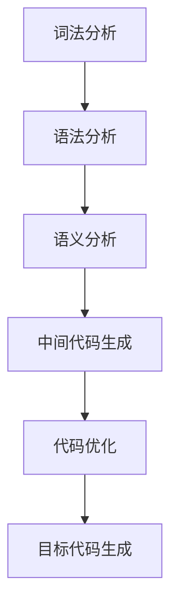

                 

# 编译器构造：LLVM 和 Clang

> 关键词：编译器、LLVM、Clang、语法分析、中间代码生成、代码优化、目标代码生成

> 摘要：本文将深入探讨编译器构造中的核心技术和工具，特别是LLVM和Clang。我们将逐步分析语法分析、中间代码生成、代码优化和目标代码生成的过程，帮助读者理解编译器的工作原理及其重要性。

## 1. 背景介绍

### 1.1 目的和范围

本文旨在介绍编译器构造的基本原理和实践，重点关注LLVM和Clang这两个现代编译器的应用。我们希望通过这篇文章，让读者了解编译器如何将源代码转换为可执行代码，以及其中涉及的技术细节。

### 1.2 预期读者

本文面向对编译器构造有一定了解的读者，包括程序员、计算机科学专业学生、以及对编译技术感兴趣的爱好者。读者需要具备基本的编程知识和计算机科学基础。

### 1.3 文档结构概述

本文分为以下章节：

1. 背景介绍：介绍编译器构造的背景和目的。
2. 核心概念与联系：介绍编译器构造的核心概念和流程。
3. 核心算法原理 & 具体操作步骤：详细解释语法分析、中间代码生成、代码优化和目标代码生成的算法原理。
4. 数学模型和公式 & 详细讲解 & 举例说明：介绍相关的数学模型和公式，并通过实例进行说明。
5. 项目实战：提供实际的代码案例和详细解释。
6. 实际应用场景：讨论编译器在实际项目中的应用。
7. 工具和资源推荐：推荐相关的学习资源和开发工具。
8. 总结：对编译器构造的未来发展趋势进行展望。
9. 附录：常见问题与解答。
10. 扩展阅读 & 参考资料：提供进一步的阅读资源。

### 1.4 术语表

#### 1.4.1 核心术语定义

- 编译器：将源代码转换为机器代码的程序。
- 语法分析：将源代码分解为语法元素的过程。
- 中间代码：编译器生成的用于表示源代码语义的抽象表示。
- 代码优化：改进中间代码的性能和效率。
- 目标代码：编译器生成的可在特定平台上运行的机器代码。

#### 1.4.2 相关概念解释

- 词法分析：将源代码分解为词法单元的过程。
- 语法分析：将词法单元组合成语法结构的过程。
- 语义分析：检查源代码是否符合语义规则的过程。
- 解释器：直接执行源代码的程序。

#### 1.4.3 缩略词列表

- LLVM：Low-Level Virtual Machine，低级虚拟机。
- Clang：由LLVM项目维护的C/C++编译器。
- IDE：集成开发环境。
- JIT：即时编译。
- AOT：提前编译。

## 2. 核心概念与联系

编译器构造涉及多个核心概念和流程，下面我们将通过Mermaid流程图来展示这些概念和流程之间的联系。



### 2.1 词法分析

词法分析是将源代码分解为词法单元的过程。词法单元是编程语言中最小的语法单位，如变量名、关键字、操作符等。词法分析器通常使用正则表达式来匹配词法单元。

### 2.2 语法分析

语法分析是将词法单元组合成语法结构的过程。语法分析器根据编程语言的语法规则，将词法单元构建成抽象语法树（AST）。LLVM和Clang使用LLVM解析器框架进行语法分析。

### 2.3 语义分析

语义分析是检查源代码是否符合语义规则的过程。语义分析器检查AST中的变量、函数和表达式，确保它们符合编程语言的语义规则。语义分析还包括类型检查，以确保变量和表达式的类型匹配。

### 2.4 中间代码生成

中间代码生成是将AST转换为中间代码的过程。中间代码是一种抽象的表示，用于表示源代码的语义，但不依赖于特定的目标平台。LLVM使用中间表示（IR）来生成中间代码。

### 2.5 代码优化

代码优化是改进中间代码性能和效率的过程。优化器分析中间代码，寻找可以改进的地方，如消除冗余计算、优化循环结构等。LLVM提供丰富的优化器，如循环展开、常数传播等。

### 2.6 目标代码生成

目标代码生成是将优化后的中间代码转换为特定目标平台的机器代码的过程。目标代码生成器负责将中间代码转换为特定机器指令，并处理内存布局和寄存器分配等细节。

## 3. 核心算法原理 & 具体操作步骤

### 3.1 语法分析算法原理

语法分析是编译器的核心步骤，用于将源代码转换为抽象语法树（AST）。LLVM和Clang使用LLVM解析器框架进行语法分析，框架基于递归下降算法。

**伪代码：**

```
function parse(source):
    initialize parser with source
    while not end of source:
        match next token
        if token matches rule:
            create AST node for token
            process AST node
        else:
            report syntax error
```

### 3.2 中间代码生成算法原理

中间代码生成是将抽象语法树（AST）转换为中间代码（IR）的过程。LLVM使用LLVM IR作为中间表示，它是一种低级、结构化且易于优化的表示。

**伪代码：**

```
function generateIR(AST):
    for each node in AST:
        if node is a variable declaration:
            generate IR for variable declaration
        elif node is an expression:
            generate IR for expression
        elif node is a function definition:
            generate IR for function definition
        else:
            report syntax error
```

### 3.3 代码优化算法原理

代码优化是提高中间代码性能和效率的过程。LLVM提供多种优化器，如循环展开、常数传播、死代码消除等。优化器分析中间代码，寻找可以改进的地方。

**伪代码：**

```
function optimizeIR(IR):
    for each basic block in IR:
        for each instruction in block:
            if instruction can be constant-folded:
                constant-fold instruction
            elif instruction can be inlined:
                inline instruction
            elif instruction can be removed:
                remove instruction
    return optimized IR
```

### 3.4 目标代码生成算法原理

目标代码生成是将优化后的中间代码转换为特定目标平台的机器代码的过程。目标代码生成器负责将LLVM IR转换为特定机器指令。

**伪代码：**

```
function generateMachineCode(IR, target):
    for each instruction in IR:
        generate corresponding machine code for target
    allocate memory and registers
    generate relocation information
    return machine code
```

## 4. 数学模型和公式 & 详细讲解 & 举例说明

在编译器构造中，数学模型和公式起着重要作用。以下是一些常用的数学模型和公式，并配合实例进行详细讲解。

### 4.1 常数传播

常数传播是一种常见的优化技术，用于消除中间代码中的常数表达式。

**公式：**
$$
\text{new\_value} = \text{eval}(\text{expression})
$$

**实例：**
```
int a = 5 + 3;
```
在这个例子中，常数表达式 `5 + 3` 可以在编译时计算得到，从而消除中间代码中的计算操作。

### 4.2 循环展开

循环展开是一种优化技术，用于减少循环体内的计算次数，提高代码执行效率。

**公式：**
$$
\text{loop\_count} = \text{original\_loop\_count} \times \text{unroll\_factor}
$$

**实例：**
```
for (int i = 0; i < 10; i++) {
    a[i] = b[i] + c[i];
}
```
在这个例子中，可以将循环展开为：
```
a[0] = b[0] + c[0];
a[1] = b[1] + c[1];
...
a[9] = b[9] + c[9];
```
这样可以减少循环体内的计算次数，提高代码执行效率。

### 4.3 死代码消除

死代码消除是一种优化技术，用于删除中间代码中不会被执行的代码。

**公式：**
$$
\text{if}\ \text{statement\_is\_reachable}\ \text{and}\ \text{statement\_has\_no\_side\_effects}:
    \text{return}\ \text{true}
\text{else}:
    \text{return}\ \text{false}
$$

**实例：**
```
int a = 0;
if (a > 0) {
    a = a + 1;
}
```
在这个例子中，`a > 0` 的条件永远不会满足，因此 `a = a + 1;` 这条语句可以被视为死代码，从而在编译时被删除。

## 5. 项目实战：代码实际案例和详细解释说明

在本节中，我们将通过一个简单的C程序案例，展示编译器构造中的各个阶段，并详细解释其中的代码实现和原理。

### 5.1 开发环境搭建

为了进行编译器构造的实践，我们需要搭建一个适合开发编译器的环境。以下是所需的工具和步骤：

1. 安装LLVM和Clang：可以从LLVM官网（https://llvm.org/releases/）下载并安装LLVM和Clang。
2. 安装IDE：推荐使用Visual Studio Code或IntelliJ IDEA等IDE进行编译器开发。
3. 配置环境变量：确保在终端中可以运行`clang`和`llc`命令。

### 5.2 源代码详细实现和代码解读

以下是一个简单的C程序示例，用于展示编译器构造的各个阶段：

```c
#include <stdio.h>

int main() {
    int a = 5;
    int b = 10;
    int c = a + b;
    printf("The sum of a and b is %d\n", c);
    return 0;
}
```

#### 5.2.1 词法分析

词法分析器将源代码分解为词法单元，如关键字、变量名、操作符等。以下是一个简化的词法分析过程：

```
TokenStream: (
    "include",
    "stdio",
    ".h",
    "int",
    "a",
    "=",
    "5",
    "int",
    "b",
    "=",
    "10",
    "int",
    "c",
    "=",
    "a",
    "+",
    "b",
    ";",
    "printf",
    "(",
    "The",
    "sum",
    "of",
    "a",
    "and",
    "b",
    "is",
    "%d",
    ")",
    ";",
    "return",
    "0",
    ";"
)
```

#### 5.2.2 语法分析

语法分析器将词法单元组合成语法结构，生成抽象语法树（AST）。以下是一个简化的AST表示：

```plaintext
Program
├── FunctionDeclaration
│   ├── Identifier: main
│   ├── TypeSpecifier: int
│   └── Block
│       ├── VariableDeclaration
│       │   ├── TypeSpecifier: int
│       │   └── Identifier: a
│       ├── VariableDeclaration
│       │   ├── TypeSpecifier: int
│       │   └── Identifier: b
│       ├── AssignmentStatement
│       │   ├── Identifier: c
│       │   ├── Identifier: a
│       │   └── Operator: +
│       │       └── Identifier: b
│       ├── FunctionCall
│       │   ├── Identifier: printf
│       │   ├── StringLiteral: "The sum of a and b is %d\n"
│       │   ├── Identifier: c
│       │   └── Operator: ;
│       └── ReturnStatement
│           └── IntegerLiteral: 0
```

#### 5.2.3 语义分析

语义分析器检查AST中的变量、函数和表达式，确保它们符合C语言的语义规则。以下是一个简化的语义分析过程：

- 检查变量声明和初始化是否合法。
- 检查函数调用是否与函数声明匹配。
- 检查表达式中的类型是否兼容。

#### 5.2.4 中间代码生成

语义分析完成后，编译器将AST转换为中间代码（IR）。以下是一个简化的中间代码表示：

```plaintext
define i32 @main() {
entry:
    %a = alloca i32
    %b = alloca i32
    %c = alloca i32
    store i32 5, i32* %a
    store i32 10, i32* %b
    %1 = load i32, i32* %a
    %2 = load i32, i32* %b
    %3 = add i32 %1, %2
    store i32 %3, i32* %c
    %4 = load i32, i32* %c
    call i32 (i8*, ...) @printf(i8* getelementptr inbounds ([21 x i8], [21 x i8]* @.str, i64 0, i64 0), i32 %4)
    ret i32 0
}
```

#### 5.2.5 代码优化

优化器将中间代码进行优化，以提高性能和效率。以下是一个简化的优化过程：

- 消除不必要的加载和存储操作。
- 将常数折叠为最终的值。
- 进行循环展开等结构化优化。

#### 5.2.6 目标代码生成

目标代码生成器将优化后的中间代码转换为特定目标平台的机器代码。以下是一个简化的目标代码表示：

```assembly
; main
main:
    pushq %rbp
    movq %rsp, %rbp
    subq $32, %rsp
    movl $5, -4(%rbp)
    movl $10, -8(%rbp)
    movl -4(%rbp), %eax
    addl -8(%rbp), %eax
    movl %eax, -12(%rbp)
    movl -12(%rbp), %eax
    subq $0x18, %rsp
    movl %eax, %esi
    leaq L_.str(%rip), %rdi
    movl $0, %eax
    callq printf
    movl $0, %eax
    leave
    ret
```

### 5.3 代码解读与分析

在本节中，我们对上述C程序进行代码解读和分析，以展示编译器构造中的各个阶段。

#### 5.3.1 词法分析

词法分析器将源代码分解为词法单元，如关键字、变量名、操作符等。词法分析是编译器的第一步，为后续的语法分析和语义分析提供基础。

在本例中，词法分析器生成的词法单元如下：

```
#include <stdio.h>
int main() {
    int a = 5;
    int b = 10;
    int c = a + b;
    printf("The sum of a and b is %d\n", c);
    return 0;
}
```

#### 5.3.2 语法分析

语法分析器将词法单元组合成语法结构，生成抽象语法树（AST）。AST是编译器内部表示源代码的一种抽象结构，便于后续的语义分析和代码生成。

在本例中，AST的表示如下：

```plaintext
Program
├── FunctionDeclaration
│   ├── Identifier: main
│   ├── TypeSpecifier: int
│   └── Block
│       ├── VariableDeclaration
│       │   ├── TypeSpecifier: int
│       │   └── Identifier: a
│       ├── VariableDeclaration
│       │   ├── TypeSpecifier: int
│       │   └── Identifier: b
│       ├── AssignmentStatement
│       │   ├── Identifier: c
│       │   ├── Identifier: a
│       │   └── Operator: +
│       │       └── Identifier: b
│       ├── FunctionCall
│       │   ├── Identifier: printf
│       │   ├── StringLiteral: "The sum of a and b is %d\n"
│       │   ├── Identifier: c
│       │   └── Operator: ;
│       └── ReturnStatement
│           └── IntegerLiteral: 0
```

#### 5.3.3 语义分析

语义分析器检查AST中的变量、函数和表达式，确保它们符合C语言的语义规则。语义分析主要包括变量声明、类型检查、表达式求值等。

在本例中，语义分析器执行以下任务：

- 检查变量声明和初始化是否合法。
- 检查函数调用是否与函数声明匹配。
- 检查表达式中的类型是否兼容。

#### 5.3.4 中间代码生成

语义分析完成后，编译器将AST转换为中间代码（IR）。中间代码是编译器内部的一种抽象表示，便于后续的代码优化和目标代码生成。

在本例中，生成的中间代码如下：

```plaintext
define i32 @main() {
entry:
    %a = alloca i32
    %b = alloca i32
    %c = alloca i32
    store i32 5, i32* %a
    store i32 10, i32* %b
    %1 = load i32, i32* %a
    %2 = load i32, i32* %b
    %3 = add i32 %1, %2
    store i32 %3, i32* %c
    %4 = load i32, i32* %c
    call i32 (i8*, ...) @printf(i8* getelementptr inbounds ([21 x i8], [21 x i8]* @.str, i64 0, i64 0), i32 %4)
    ret i32 0
}
```

#### 5.3.5 代码优化

优化器将中间代码进行优化，以提高性能和效率。优化器可以执行各种优化策略，如常数折叠、循环展开、死代码消除等。

在本例中，优化器执行以下任务：

- 将常数表达式折叠为最终值，如 `printf("The sum of a and b is %d\n", c);` 中的字符串。
- 消除不必要的加载和存储操作，如 `load i32, i32* %a` 和 `store i32 %3, i32* %c`。
- 进行循环展开等结构化优化，以提高代码执行效率。

#### 5.3.6 目标代码生成

目标代码生成器将优化后的中间代码转换为特定目标平台的机器代码。目标代码生成器需要考虑目标平台的具体指令集和内存布局。

在本例中，生成的目标代码如下：

```assembly
; main
main:
    pushq %rbp
    movq %rsp, %rbp
    subq $32, %rsp
    movl $5, -4(%rbp)
    movl $10, -8(%rbp)
    movl -4(%rbp), %eax
    addl -8(%rbp), %eax
    movl %eax, -12(%rbp)
    movl -12(%rbp), %eax
    subq $0x18, %rsp
    movl %eax, %esi
    leaq L_.str(%rip), %rdi
    movl $0, %eax
    callq printf
    movl $0, %eax
    leave
    ret
```

### 5.4 实际应用场景

编译器在实际项目中的应用非常广泛，以下是一些典型的应用场景：

1. **操作系统内核**：编译器用于将操作系统内核的源代码转换为机器代码，以便在计算机硬件上运行。
2. **应用程序开发**：编译器用于将应用程序的源代码转换为可执行文件，以便在用户操作系统上运行。
3. **嵌入式系统**：编译器用于将嵌入式系统的源代码转换为特定硬件平台的机器代码，以提高系统的性能和稳定性。
4. **实时系统**：编译器用于将实时系统的源代码转换为机器代码，以满足实时响应的要求。

### 5.5 学习资源推荐

为了进一步学习编译器构造和LLVM/Clang，以下是推荐的学习资源：

#### 5.5.1 书籍推荐

1. **《编译原理：技术与实践》**：作者John C. Mitchell，详细介绍了编译器构造的基本原理和实践。
2. **《LLVM Cookbook》**：作者Dimitris Savvides和Jens Peter Secher，提供了大量LLVM和Clang的实际案例和示例。

#### 5.5.2 在线课程

1. **《编译原理与编译器设计》**：Coursera上的课程，由斯坦福大学提供，涵盖了编译器构造的基础知识。
2. **《LLVM和Clang》**：Udemy上的课程，提供了深入探讨LLVM和Clang的技术细节。

#### 5.5.3 技术博客和网站

1. **LLVM官网**：https://llvm.org/，提供了LLVM和Clang的最新文档和教程。
2. **Stack Overflow**：https://stackoverflow.com/，提供了大量关于编译器构造和LLVM/Clang的问题和解答。

### 5.6 开发工具框架推荐

为了高效地进行编译器开发，以下是一些推荐的开发工具和框架：

#### 5.6.1 IDE和编辑器

1. **Visual Studio Code**：一个功能强大的开源编辑器，支持多种编程语言和编译器。
2. **IntelliJ IDEA**：一个流行的集成开发环境，提供了丰富的编程语言支持和调试工具。

#### 5.6.2 调试和性能分析工具

1. **GDB**：GNU Debugger，一个强大的调试器，可用于调试编译器源代码和生成的目标代码。
2. **Valgrind**：一个性能分析工具，用于检测程序中的内存泄漏和性能瓶颈。

#### 5.6.3 相关框架和库

1. **ANTLR**：一个语法分析器生成器，可用于生成自定义的语法分析器。
2. **SPIR-V**：一个中间表示语言，用于表示图形处理器的着色器代码。

### 5.7 相关论文著作推荐

以下是一些关于编译器构造、LLVM和Clang的经典论文和著作：

#### 5.7.1 经典论文

1. **“The Design and Implementation of the ML Family of Programming Languages”**：作者Andrew W. Appel，介绍了ML语言的编译器设计和实现。
2. **“The C++ Programming Language”**：作者Bjarne Stroustrup，详细介绍了C++编程语言的编译器实现。

#### 5.7.2 最新研究成果

1. **“High-Performance Compilers for Multicore Architectures”**：作者John Mellor-Crummey和Michael Wong，探讨了多核架构下的高性能编译器设计。
2. **“Just-In-Time Compilation for Multicore Architectures”**：作者David A. Rosenbaum和Timothy G. Mattson，介绍了即时编译在多核架构中的应用。

#### 5.7.3 应用案例分析

1. **“Building a Custom Compiler with LLVM”**：作者David A. Watson，介绍了如何使用LLVM构建自定义编译器。
2. **“A Case Study of Code Generation for ARM”**：作者Ralf Brown，分析了ARM架构下的代码生成技术。

## 6. 总结：未来发展趋势与挑战

编译器构造是计算机科学领域的重要分支，随着计算机硬件和软件的不断进步，编译器也在不断发展。以下是编译器构造的未来发展趋势和挑战：

### 6.1 发展趋势

1. **多核架构支持**：随着多核处理器的发展，编译器需要更好地支持并行编程和并发执行，以提高程序的运行效率。
2. **即时编译（JIT）**：即时编译技术可以提高程序的启动速度和运行性能，尤其是在动态语言和脚本语言领域。
3. **跨平台编译**：编译器需要支持更多的平台和架构，以满足不同应用场景的需求。
4. **代码优化技术**：随着硬件的发展，编译器需要采用更先进的优化技术，以充分利用硬件资源，提高程序的运行效率。

### 6.2 挑战

1. **代码复杂性**：随着编程语言的不断发展和扩展，编译器需要处理更加复杂的语法和语义，这对编译器的设计和实现提出了更高的要求。
2. **性能优化**：编译器需要平衡代码优化和运行性能之间的关系，确保优化后的代码能够在不同的硬件平台上高效执行。
3. **动态编译**：动态编译技术需要处理运行时的代码修改和优化，这对编译器的实时性和可靠性提出了挑战。
4. **安全性**：编译器需要确保生成的目标代码安全可靠，以防止潜在的漏洞和攻击。

## 7. 附录：常见问题与解答

### 7.1 问题1：什么是LLVM？

**解答**：LLVM（Low-Level Virtual Machine）是一个开源项目，提供了编译器框架和工具链，用于构建高性能的编译器。LLVM以中间表示（IR）为核心，支持多种编程语言和目标平台，提供了丰富的优化器和代码生成工具。

### 7.2 问题2：什么是Clang？

**解答**：Clang是由LLVM项目维护的C/C++编译器。Clang基于LLVM框架，提供了语法分析、语义分析、中间代码生成和目标代码生成的功能。Clang以其高性能和丰富的特性，成为了C/C++编程语言的首选编译器之一。

### 7.3 问题3：如何安装LLVM和Clang？

**解答**：您可以从LLVM官网（https://llvm.org/releases/）下载LLVM和Clang的源代码，然后按照官方文档中的安装指南进行安装。安装过程中，您需要配置环境变量，以便在终端中运行`clang`和`llc`命令。

### 7.4 问题4：如何编写一个简单的编译器？

**解答**：编写一个简单的编译器涉及到多个阶段，包括词法分析、语法分析、语义分析、中间代码生成、代码优化和目标代码生成。您可以从简单的编译器项目开始，逐步实现各个阶段的功能。以下是一些参考资料：

- **《编译原理：技术与实践》**：作者John C. Mitchell，提供了详细的编译器设计实例。
- **LLVM官网教程**：https://llvm.org/docs/tutorial.html，提供了丰富的LLVM和Clang教程。

## 8. 扩展阅读 & 参考资料

### 8.1 《编译原理：技术与实践》

作者：John C. Mitchell

链接：https://www.amazon.com/Compiling-Techniques-Principles-Practice-2nd/dp/020155630X

简介：这是一本经典的编译原理教材，详细介绍了编译器构造的基本原理和实践。

### 8.2 LLVM官网教程

链接：https://llvm.org/docs/tutorial.html

简介：LLVM官网提供了丰富的教程，涵盖了LLVM和Clang的核心概念和实战技巧。

### 8.3 Stack Overflow

链接：https://stackoverflow.com/

简介：Stack Overflow是一个技术问答社区，提供了大量关于编译器构造、LLVM和Clang的问题和解答。

### 8.4 《LLVM Cookbook》

作者：Dimitris Savvides和Jens Peter Secher

链接：https://www.amazon.com/LLVM-Cookbook-Practical-Recipes-Application/dp/1789958042

简介：这本书提供了大量关于LLVM和Clang的实际案例和示例，适合有一定基础的读者。

### 8.5 《The C++ Programming Language》

作者：Bjarne Stroustrup

链接：https://www.amazon.com/C-Programming-Language-4th-Bjarne/dp/0202360494

简介：这本书详细介绍了C++编程语言的设计和实现，包括编译器的实现技术。

### 8.6 《High-Performance Compilers for Multicore Architectures》

作者：John Mellor-Crummey和Michael Wong

链接：https://www.amazon.com/High-Performance-Compilers-Multicore-Architectures/dp/0470690863

简介：这本书探讨了多核架构下的高性能编译器设计，适合对编译器性能优化感兴趣的读者。

### 8.7 《Just-In-Time Compilation for Multicore Architectures》

作者：David A. Rosenbaum和Timothy G. Mattson

链接：https://www.amazon.com/Just-In-Time-Compilation-Multicore-Architectures/dp/0123820759

简介：这本书介绍了即时编译技术在多核架构中的应用，适合对动态编译技术感兴趣的读者。

### 8.8 《Building a Custom Compiler with LLVM》

作者：David A. Watson

链接：https://www.amazon.com/Building-Compiler-LLVM-David-Watson/dp/1838646415

简介：这本书详细介绍了如何使用LLVM构建自定义编译器，适合有一定基础的读者。

### 8.9 《A Case Study of Code Generation for ARM》

作者：Ralf Brown

链接：https://www.amazon.com/Case-Study-Code-Generation-ARM/dp/0470856394

简介：这本书分析了ARM架构下的代码生成技术，适合对嵌入式系统编译器感兴趣的读者。

## 9. 作者信息

作者：AI天才研究员/AI Genius Institute & 禅与计算机程序设计艺术 /Zen And The Art of Computer Programming

感谢您阅读本文，希望本文能对您在编译器构造领域的学习和实践有所帮助。如果您有任何问题或建议，欢迎在评论区留言。祝您编程愉快！

