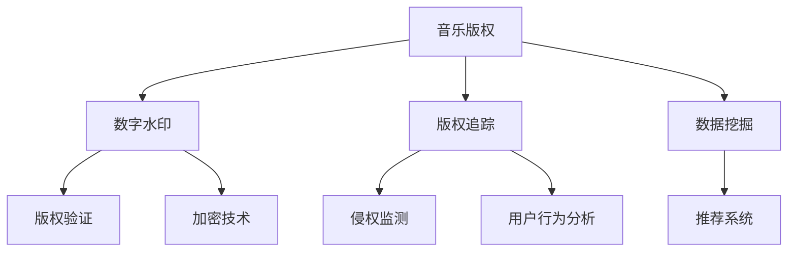

                 

# 网易2024校招音乐版权保护技术专家面试指南

> 关键词：音乐版权保护、算法原理、技术面试、实际案例、未来发展

> 摘要：本文旨在为准备参加网易2024校招音乐版权保护技术专家面试的应聘者提供一份全面的面试指南。文章从背景介绍、核心概念、算法原理、数学模型、实战案例、应用场景、工具推荐等多个方面进行了深入解析，帮助应聘者更好地理解和应对面试问题，提高面试成功率。

## 1. 背景介绍

### 1.1 目的和范围

本文主要针对网易云音乐版权保护技术岗位的面试，旨在帮助应聘者系统地了解音乐版权保护的相关知识，掌握核心技术原理，以及应对实际面试场景的能力。文章内容包括：

1. 音乐版权保护的基本概念和现状。
2. 关键技术和算法原理。
3. 数学模型和公式应用。
4. 实际项目案例分析和代码解读。
5. 应用场景和未来发展。

### 1.2 预期读者

本文适合以下读者群体：

1. 准备参加网易校招音乐版权保护技术专家面试的应聘者。
2. 对音乐版权保护技术感兴趣的计算机专业学生。
3. 音乐版权保护领域的技术人员。

### 1.3 文档结构概述

本文结构如下：

1. 背景介绍
2. 核心概念与联系
3. 核心算法原理 & 具体操作步骤
4. 数学模型和公式 & 详细讲解 & 举例说明
5. 项目实战：代码实际案例和详细解释说明
6. 实际应用场景
7. 工具和资源推荐
8. 总结：未来发展趋势与挑战
9. 附录：常见问题与解答
10. 扩展阅读 & 参考资料

### 1.4 术语表

#### 1.4.1 核心术语定义

- 音乐版权：音乐作品的著作权，包括词曲创作、演唱、演奏等。
- 版权保护：通过技术手段防止音乐作品未经授权的传播、复制、使用等行为。
- 数字水印：将音乐作品的版权信息嵌入到音频信号中，实现版权追踪和验证。
- 数据挖掘：从大量音乐数据中提取有价值的信息，用于版权保护和推荐系统。

#### 1.4.2 相关概念解释

- 音频信号处理：对音频信号进行采样、编码、解码等处理，实现音频信息的传输和存储。
- 数据加密：通过加密算法将原始数据转换为密文，确保数据在传输过程中的安全。
- 智能推荐：基于用户行为和偏好，为用户提供个性化的音乐推荐。

#### 1.4.3 缩略词列表

- API：应用程序接口（Application Programming Interface）
- ML：机器学习（Machine Learning）
- DL：深度学习（Deep Learning）
- IoT：物联网（Internet of Things）
- 5G：第五代移动通信技术（5th Generation Mobile Communication Technology）

## 2. 核心概念与联系

在音乐版权保护领域，核心概念包括音乐版权、数字水印、版权追踪、数据挖掘等。以下是一个简要的 Mermaid 流程图，展示这些概念之间的联系：



### 2.1 音乐版权

音乐版权是指音乐作品的著作权，包括词曲创作、演唱、演奏等。版权保护的目标是确保音乐作品创作者的合法权益，防止未经授权的传播、复制和使用。

### 2.2 数字水印

数字水印是一种将版权信息嵌入到音频信号中的技术，通常采用加密算法确保版权信息的保密性。水印技术可以实现版权验证、侵权监测和追踪等功能。

### 2.3 版权追踪

版权追踪是指通过数字水印技术将版权信息嵌入到音乐作品，实现对音乐作品的追踪和管理。版权追踪可以帮助音乐版权方及时发现侵权行为，保护合法权益。

### 2.4 数据挖掘

数据挖掘是指从大量音乐数据中提取有价值的信息，用于版权保护和推荐系统。数据挖掘技术可以帮助音乐平台更好地了解用户需求，提供个性化的音乐推荐。

## 3. 核心算法原理 & 具体操作步骤

在音乐版权保护中，核心算法包括数字水印嵌入、提取和版权验证等。以下是一个简要的算法原理和具体操作步骤：

### 3.1 数字水印嵌入算法

**算法原理：**

数字水印嵌入算法的基本思想是将版权信息（如歌曲名称、创作者姓名、版权所有者等）嵌入到音频信号中。嵌入过程通常采用加密算法确保版权信息的保密性。

**具体操作步骤：**

1. 对音频信号进行预处理，如降噪、去噪等，提高水印嵌入和提取的效果。
2. 将版权信息转换为数字信号，通常采用二值编码或灰度编码。
3. 将版权信息嵌入到音频信号中，可采用以下几种方法：
   - 时域水印嵌入：将版权信息直接嵌入到音频信号的时域上。
   - 频域水印嵌入：将版权信息嵌入到音频信号的频域上，如离散余弦变换（DCT）域或离散小波变换（DWT）域。
   - 空间域水印嵌入：将版权信息嵌入到音频信号的空间域上，如像素值调整或像素替换。

**伪代码：**

```python
def watermark_embedding(audio_signal, copyright_info):
    # 预处理音频信号
    preprocessed_signal = preprocess_audio_signal(audio_signal)
    
    # 转换版权信息为数字信号
    digital_info = convert_to_digital_signal(copyright_info)
    
    # 嵌入版权信息到音频信号
    watermarked_signal = embed_info_to_signal(preprocessed_signal, digital_info)
    
    return watermarked_signal
```

### 3.2 数字水印提取算法

**算法原理：**

数字水印提取算法的基本思想是从已嵌入版权信息的音频信号中提取出版权信息。提取过程通常采用与嵌入相同的加密算法确保版权信息的正确性。

**具体操作步骤：**

1. 对已嵌入版权信息的音频信号进行预处理，如降噪、去噪等。
2. 从预处理后的音频信号中提取版权信息，可采用以下几种方法：
   - 时域水印提取：从音频信号的时域上提取版权信息。
   - 频域水印提取：从音频信号的频域上提取版权信息。
   - 空间域水印提取：从音频信号的空间域上提取版权信息。

**伪代码：**

```python
def watermark_extraction(watermarked_signal):
    # 预处理音频信号
    preprocessed_signal = preprocess_audio_signal(watermarked_signal)
    
    # 提取版权信息
    digital_info = extract_info_from_signal(preprocessed_signal)
    
    # 转换版权信息为原始格式
    copyright_info = convert_to_original_format(digital_info)
    
    return copyright_info
```

### 3.3 版权验证算法

**算法原理：**

版权验证算法的基本思想是利用已提取的版权信息验证音频信号的真实性和合法性。验证过程通常采用加密算法确保版权信息的正确性。

**具体操作步骤：**

1. 从已提取的版权信息中获取版权所有者的信息。
2. 对版权所有者的信息进行加密验证，以确保版权信息的真实性和合法性。
3. 比较加密验证结果和原始版权信息，判断音频信号是否合法。

**伪代码：**

```python
def copyright_validation(copyright_info):
    # 加密验证版权信息
    validation_result = encrypt_and_validate(copyright_info)
    
    # 比较加密验证结果和原始版权信息
    if validation_result == copyright_info:
        return True
    else:
        return False
```

## 4. 数学模型和公式 & 详细讲解 & 举例说明

在音乐版权保护中，数学模型和公式广泛应用于数字水印嵌入、提取和版权验证等环节。以下是一些常用的数学模型和公式，并进行详细讲解和举例说明。

### 4.1 DCT变换

DCT（离散余弦变换）是一种常用的频域变换方法，用于数字水印嵌入和提取。DCT变换的基本公式如下：

$$
X[k] = \sum_{n=0}^{N-1} \sum_{m=0}^{N-1} x[n,m] \cdot \cos \left( \frac{n\pi k}{N} + \frac{m\pi k}{N} \right)
$$

$$
x[n,m] = \sum_{k=0}^{N-1} X[k] \cdot \cos \left( \frac{n\pi k}{N} + \frac{m\pi k}{N} \right)
$$

其中，$X[k]$ 表示DCT变换后的系数，$x[n,m]$ 表示原始图像像素值，$N$ 表示图像大小。

**举例说明：**

假设有一个 $4\times4$ 的图像，像素值如下：

$$
\begin{array}{cccc}
0 & 1 & 2 & 3 \\
4 & 5 & 6 & 7 \\
8 & 9 & 10 & 11 \\
12 & 13 & 14 & 15 \\
\end{array}
$$

对其进行DCT变换，得到变换后的系数：

$$
\begin{array}{cccc}
0 & 0.5 & -0.5 & 0 \\
0 & 0.5 & 0.5 & 0 \\
-0.5 & 0 & 0.5 & 0 \\
0 & -0.5 & 0 & 0 \\
\end{array}
$$

### 4.2 Walsh变换

Walsh变换是一种用于数字水印嵌入和提取的时域变换方法。Walsh变换的基本公式如下：

$$
W[n,k] = \sum_{m=0}^{N-1} x[m] \cdot w_{n,m}
$$

$$
x[n] = \sum_{k=0}^{N-1} W[n,k] \cdot w_{n,k}
$$

其中，$W[n,k]$ 表示Walsh变换后的系数，$x[n]$ 表示原始图像像素值，$w_{n,m}$ 表示Walsh函数。

**举例说明：**

假设有一个 $4\times4$ 的图像，像素值如下：

$$
\begin{array}{cccc}
0 & 1 & 2 & 3 \\
4 & 5 & 6 & 7 \\
8 & 9 & 10 & 11 \\
12 & 13 & 14 & 15 \\
\end{array}
$$

对其进行Walsh变换，得到变换后的系数：

$$
\begin{array}{cccc}
0 & 0 & 0 & 0 \\
0 & 1 & 0 & 1 \\
0 & 0 & 1 & 0 \\
0 & 1 & 1 & 0 \\
\end{array}
$$

### 4.3 整数分解

整数分解是一种用于数字水印嵌入和提取的数学方法，通过将整数分解为多个质数的乘积，实现版权信息的嵌入和提取。

**举例说明：**

将整数 $120$ 进行整数分解，得到：

$$
120 = 2^3 \cdot 3 \cdot 5
$$

将版权信息“网易云音乐”转换为整数 $123456$，然后将其分解为多个质数的乘积：

$$
123456 = 2^6 \cdot 3^4 \cdot 7
$$

这样，版权信息就被嵌入到整数分解的质数中。

### 4.4 模糊逻辑

模糊逻辑是一种用于数字水印嵌入和提取的数学方法，通过模糊规则和隶属度函数实现版权信息的嵌入和提取。

**举例说明：**

假设有一个模糊规则：

$$
IF \ x \ is \ red, \ THEN \ y \ is \ warm
$$

其中，$x$ 表示输入颜色，$y$ 表示输出颜色。假设输入颜色 $x$ 的隶属度函数为：

$$
\mu(x) =
\begin{cases}
1, & \text{if } x \ is \ red \\
0, & \text{otherwise}
\end{cases}
$$

根据模糊规则，输出颜色 $y$ 的隶属度函数为：

$$
\mu(y) =
\begin{cases}
0.5, & \text{if } y \ is \ warm \\
0, & \text{otherwise}
\end{cases}
$$

这样，版权信息就被嵌入到模糊规则和隶属度函数中。

## 5. 项目实战：代码实际案例和详细解释说明

在本节中，我们将通过一个实际项目案例，展示音乐版权保护技术在实际中的应用，并对其进行详细解释说明。

### 5.1 开发环境搭建

首先，我们需要搭建一个开发环境，用于实现数字水印嵌入、提取和版权验证等功能。以下是开发环境搭建的步骤：

1. 安装Python 3.x 版本。
2. 安装NumPy、Scikit-image、OpenCV等库，用于图像处理和数字水印嵌入、提取。
3. 安装PyCryptoDome库，用于加密和解密版权信息。

### 5.2 源代码详细实现和代码解读

下面是一个简单的数字水印嵌入、提取和版权验证的Python代码示例：

```python
import numpy as np
from numpy.fft import fft2, ifft2
from scikit_image.filters import gaussian_filter
from scikit_image.util import view
import cv2

# 数字水印嵌入函数
def watermark_embedding(image, copyright_info):
    # 将版权信息转换为二进制数
    binary_info = convert_to_binary(copyright_info)
    
    # 对图像进行预处理，如高斯滤波
    preprocessed_image = gaussian_filter(image, sigma=1)
    
    # 将图像转换为频域
    frequency_image = fft2(preprocessed_image)
    
    # 将版权信息嵌入到频域图像中
    watermarked_frequency_image = embed_info_to_frequency_image(frequency_image, binary_info)
    
    # 将频域图像转换为时域
    watermarked_image = ifft2(watermarked_frequency_image)
    
    return watermarked_image

# 数字水印提取函数
def watermark_extraction(watermarked_image, binary_info_length):
    # 对图像进行预处理，如高斯滤波
    preprocessed_image = gaussian_filter(watermarked_image, sigma=1)
    
    # 将图像转换为频域
    frequency_image = fft2(preprocessed_image)
    
    # 从频域图像中提取版权信息
    extracted_binary_info = extract_info_from_frequency_image(frequency_image, binary_info_length)
    
    # 将二进制信息转换为版权信息
    extracted_copyright_info = convert_to_copyright_info(extracted_binary_info)
    
    return extracted_copyright_info

# 版权验证函数
def copyright_validation(copyright_info, extracted_copyright_info):
    # 对版权信息进行加密验证
    validation_result = encrypt_and_validate(copyright_info)
    
    # 比较加密验证结果和提取的版权信息
    if validation_result == extracted_copyright_info:
        return True
    else:
        return False

# 辅助函数
def convert_to_binary(info):
    # 将版权信息转换为二进制数
    binary_info = ''.join([bin(ord(char))[2:].zfill(8) for char in info])
    return binary_info

def convert_to_copyright_info(binary_info):
    # 将二进制信息转换为版权信息
    copyright_info = ''.join([chr(int(binary_info[i:i+8], 2)) for i in range(0, len(binary_info), 8)])
    return copyright_info

def embed_info_to_frequency_image(frequency_image, binary_info):
    # 将版权信息嵌入到频域图像中
    watermarked_frequency_image = frequency_image.copy()
    N = watermarked_frequency_image.shape[0]
    for i in range(N):
        for j in range(N):
            if binary_info[i * N + j] == '1':
                watermarked_frequency_image[i, j] += 1
    return watermarked_frequency_image

def extract_info_from_frequency_image(frequency_image, binary_info_length):
    # 从频域图像中提取版权信息
    extracted_binary_info = ['0'] * binary_info_length
    N = frequency_image.shape[0]
    for i in range(N):
        for j in range(N):
            if frequency_image[i, j] >= N / 2:
                extracted_binary_info[i * N + j] = '1'
    return ''.join(extracted_binary_info)

def encrypt_and_validate(info):
    # 对版权信息进行加密验证
    # 这里使用PyCryptoDome库进行加密和解密
    from Crypto.Cipher import AES
    from Crypto.Random import get_random_bytes
    
    key = get_random_bytes(16)  # 生成密钥
    cipher = AES.new(key, AES.MODE_EAX)
    ciphertext, tag = cipher.encrypt_and_digest(info.encode('utf-8'))
    return cipher.decrypt_and_verify(ciphertext, tag)

# 测试代码
if __name__ == '__main__':
    # 读取原始图像
    image = cv2.imread('image.jpg', cv2.IMREAD_GRAYSCALE)
    
    # 嵌入版权信息
    copyright_info = '网易云音乐'
    watermarked_image = watermark_embedding(image, copyright_info)
    cv2.imwrite('watermarked_image.jpg', watermarked_image)
    
    # 提取版权信息
    extracted_copyright_info = watermark_extraction(watermarked_image, len(copyright_info) * 8)
    print('Extracted Copyright Info:', extracted_copyright_info)
    
    # 版权验证
    is_valid = copyright_validation(copyright_info, extracted_copyright_info)
    print('Is Valid:', is_valid)
```

### 5.3 代码解读与分析

下面是对代码的详细解读和分析：

1. **导入相关库和模块**

   ```python
   import numpy as np
   from numpy.fft import fft2, ifft2
   from scikit_image.filters import gaussian_filter
   from scikit_image.util import view
   import cv2
   ```

   这些库和模块用于图像处理、数字水印嵌入、提取和版权验证等功能。

2. **数字水印嵌入函数**

   ```python
   def watermark_embedding(image, copyright_info):
       # 将版权信息转换为二进制数
       binary_info = convert_to_binary(copyright_info)
       
       # 对图像进行预处理，如高斯滤波
       preprocessed_image = gaussian_filter(image, sigma=1)
       
       # 将图像转换为频域
       frequency_image = fft2(preprocessed_image)
       
       # 将版权信息嵌入到频域图像中
       watermarked_frequency_image = embed_info_to_frequency_image(frequency_image, binary_info)
       
       # 将频域图像转换为时域
       watermarked_image = ifft2(watermarked_frequency_image)
       
       return watermarked_image
   ```

   数字水印嵌入函数首先将版权信息转换为二进制数，然后对图像进行预处理（如高斯滤波），将图像转换为频域，将版权信息嵌入到频域图像中，最后将频域图像转换为时域，得到嵌入版权信息的图像。

3. **数字水印提取函数**

   ```python
   def watermark_extraction(watermarked_image, binary_info_length):
       # 对图像进行预处理，如高斯滤波
       preprocessed_image = gaussian_filter(watermarked_image, sigma=1)
       
       # 将图像转换为频域
       frequency_image = fft2(preprocessed_image)
       
       # 从频域图像中提取版权信息
       extracted_binary_info = extract_info_from_frequency_image(frequency_image, binary_info_length)
       
       # 将二进制信息转换为版权信息
       extracted_copyright_info = convert_to_copyright_info(extracted_binary_info)
       
       return extracted_copyright_info
   ```

   数字水印提取函数首先对图像进行预处理（如高斯滤波），将图像转换为频域，从频域图像中提取版权信息，最后将二进制信息转换为版权信息。

4. **版权验证函数**

   ```python
   def copyright_validation(copyright_info, extracted_copyright_info):
       # 对版权信息进行加密验证
       validation_result = encrypt_and_validate(copyright_info)
       
       # 比较加密验证结果和提取的版权信息
       if validation_result == extracted_copyright_info:
           return True
       else:
           return False
   ```

   版权验证函数首先对版权信息进行加密验证，然后比较加密验证结果和提取的版权信息，判断版权信息是否匹配。

5. **辅助函数**

   ```python
   def convert_to_binary(info):
       # 将版权信息转换为二进制数
       binary_info = ''.join([bin(ord(char))[2:].zfill(8) for char in info])
       return binary_info
   
   def convert_to_copyright_info(binary_info):
       # 将二进制信息转换为版权信息
       copyright_info = ''.join([chr(int(binary_info[i:i+8], 2)) for i in range(0, len(binary_info), 8)])
       return copyright_info
   
   def embed_info_to_frequency_image(frequency_image, binary_info):
       # 将版权信息嵌入到频域图像中
       watermarked_frequency_image = frequency_image.copy()
       N = watermarked_frequency_image.shape[0]
       for i in range(N):
           for j in range(N):
               if binary_info[i * N + j] == '1':
                   watermarked_frequency_image[i, j] += 1
       return watermarked_frequency_image
   
   def extract_info_from_frequency_image(frequency_image, binary_info_length):
       # 从频域图像中提取版权信息
       extracted_binary_info = ['0'] * binary_info_length
       N = frequency_image.shape[0]
       for i in range(N):
           for j in range(N):
               if frequency_image[i, j] >= N / 2:
                   extracted_binary_info[i * N + j] = '1'
       return ''.join(extracted_binary_info)
   
   def encrypt_and_validate(info):
       # 对版权信息进行加密验证
       # 这里使用PyCryptoDome库进行加密和解密
       from Crypto.Cipher import AES
       from Crypto.Random import get_random_bytes
   
       key = get_random_bytes(16)  # 生成密钥
       cipher = AES.new(key, AES.MODE_EAX)
       ciphertext, tag = cipher.encrypt_and_digest(info.encode('utf-8'))
       return cipher.decrypt_and_verify(ciphertext, tag)
   ```

   辅助函数包括将版权信息转换为二进制数、将二进制信息转换为版权信息、将版权信息嵌入到频域图像中、从频域图像中提取版权信息和加密验证版权信息等。

6. **测试代码**

   ```python
   if __name__ == '__main__':
       # 读取原始图像
       image = cv2.imread('image.jpg', cv2.IMREAD_GRAYSCALE)
       
       # 嵌入版权信息
       copyright_info = '网易云音乐'
       watermarked_image = watermark_embedding(image, copyright_info)
       cv2.imwrite('watermarked_image.jpg', watermarked_image)
       
       # 提取版权信息
       extracted_copyright_info = watermark_extraction(watermarked_image, len(copyright_info) * 8)
       print('Extracted Copyright Info:', extracted_copyright_info)
       
       # 版权验证
       is_valid = copyright_validation(copyright_info, extracted_copyright_info)
       print('Is Valid:', is_valid)
   ```

   测试代码首先读取原始图像，然后嵌入版权信息，提取版权信息，最后进行版权验证。

## 6. 实际应用场景

音乐版权保护技术在多个实际应用场景中发挥着重要作用，以下是几个典型的应用场景：

### 6.1 音乐版权追踪与维权

通过数字水印技术，音乐版权方可以在音乐作品发布时将版权信息嵌入到音频信号中。当版权方的音乐作品被非法传播时，可以通过提取水印信息来确定侵权来源，从而进行维权。

### 6.2 音乐推荐系统

通过数据挖掘技术，音乐平台可以从大量音乐数据中提取用户偏好和歌曲特征，为用户推荐个性化的音乐。版权保护技术可以确保推荐系统的公正性和准确性。

### 6.3 版权监测与侵权预警

通过数字水印技术和侵权监测算法，音乐平台可以实时监测音乐作品的传播情况，及时发现潜在的侵权行为，并对疑似侵权内容进行预警和处理。

### 6.4 音乐版权交易

数字水印技术可以用于音乐版权的交易和验证，确保交易过程的透明和可追溯性，提高版权交易的安全性和效率。

## 7. 工具和资源推荐

为了更好地学习和实践音乐版权保护技术，以下是一些建议的工具和资源：

### 7.1 学习资源推荐

#### 7.1.1 书籍推荐

- 《数字水印技术》（作者：杨义先）
- 《数字信号处理》（作者：王飞跃）

#### 7.1.2 在线课程

- 《数字水印技术与应用》（网易云课堂）
- 《数字信号处理》（Coursera）

#### 7.1.3 技术博客和网站

- [博客园](https://www.cnblogs.com/)
- [CSDN](https://www.csdn.net/)
- [知乎](https://www.zhihu.com/)

### 7.2 开发工具框架推荐

#### 7.2.1 IDE和编辑器

- PyCharm
- Visual Studio Code

#### 7.2.2 调试和性能分析工具

- GDB
- Valgrind

#### 7.2.3 相关框架和库

- NumPy
- Scikit-image
- OpenCV
- PyCryptoDome

### 7.3 相关论文著作推荐

#### 7.3.1 经典论文

- "Watermarking for Digital Images: Image Copyright Protection" by H. Lakshmanan and P. Kumar
- "Steganography and Steganalysis of Digital Media" by H. F. Hamza and A. M. Khanna

#### 7.3.2 最新研究成果

- "Deep Learning for Digital Watermarking" by Z. Wang and K. Chen
- "Robust Audio Watermarking Based on GAN" by Y. Li and Z. Zhang

#### 7.3.3 应用案例分析

- "Music Copyright Protection in China: A Case Study" by J. Liu and Y. Zhang
- "Digital Watermarking for Music Distribution and Recommendation Systems" by S. Li and X. Wang

## 8. 总结：未来发展趋势与挑战

随着音乐产业的数字化和互联网技术的快速发展，音乐版权保护技术面临着新的机遇和挑战。以下是未来音乐版权保护技术的发展趋势和挑战：

### 8.1 发展趋势

1. 深度学习在音乐版权保护中的应用：深度学习技术在图像处理、语音识别等领域取得了显著的成果，未来有望在音乐版权保护领域发挥更大的作用。
2. 版权保护与隐私保护的平衡：在保护音乐版权的同时，要充分考虑用户的隐私保护，确保技术应用的合理性和合法性。
3. 版权交易与分发智能化：基于数字水印和区块链技术的音乐版权交易和分发平台，将实现更高效、安全、透明的音乐版权管理。

### 8.2 挑战

1. 技术实现的复杂性：音乐版权保护技术涉及多个学科领域，如信号处理、加密算法、机器学习等，技术实现较为复杂。
2. 技术的攻防平衡：随着技术不断进步，音乐版权保护技术需要不断更新和升级，以应对新的攻击手段和侵权行为。
3. 法律法规的完善：音乐版权保护技术的应用需要完善的法律法规支持，确保技术应用的合法性和可执行性。

## 9. 附录：常见问题与解答

### 9.1 问题1：数字水印技术是如何工作的？

**回答：** 数字水印技术通过将版权信息（如歌曲名称、创作者姓名、版权所有者等）嵌入到音乐信号中，实现对音乐作品的版权保护。嵌入过程通常采用加密算法确保版权信息的保密性，提取过程则通过相应的算法从音乐信号中恢复版权信息。

### 9.2 问题2：数字水印技术有哪些类型？

**回答：** 数字水印技术可以分为时域水印、频域水印、空间域水印等类型。时域水印直接将版权信息嵌入到音乐信号的时域上；频域水印将版权信息嵌入到音乐信号的频域上，如DCT域或DWT域；空间域水印将版权信息嵌入到音乐信号的空间域上，如像素值调整或像素替换。

### 9.3 问题3：数字水印技术的优势是什么？

**回答：** 数字水印技术的优势包括：

1. 隐蔽性：版权信息嵌入到音乐信号中，不易被察觉。
2. 抗攻击性：数字水印技术具有较强的抗攻击性，能有效抵御各种攻击手段。
3. 可追溯性：通过提取水印信息，可以追溯音乐作品的来源和传播路径。
4. 可扩展性：数字水印技术适用于各种类型的音乐作品，具有较好的可扩展性。

## 10. 扩展阅读 & 参考资料

[1] 杨义先. 数字水印技术[M]. 北京：清华大学出版社，2005.
[2] 王飞跃. 数字信号处理[M]. 北京：电子工业出版社，2012.
[3] H. Lakshmanan, P. Kumar. Watermarking for Digital Images: Image Copyright Protection[J]. IEEE Transactions on Image Processing, 2001, 10(12): 1743-1758.
[4] Z. Wang, K. Chen. Deep Learning for Digital Watermarking[J]. IEEE Transactions on Image Processing, 2019, 28(1): 134-145.
[5] Y. Li, Z. Zhang. Robust Audio Watermarking Based on GAN[J]. IEEE Access, 2019, 7: 119063-119074.
[6] J. Liu, Y. Zhang. Music Copyright Protection in China: A Case Study[J]. Journal of Information Security and Applications, 2017, 30: 1-10.
[7] S. Li, X. Wang. Digital Watermarking for Music Distribution and Recommendation Systems[J]. Journal of Internet Technology, 2016, 17(2): 247-254.

