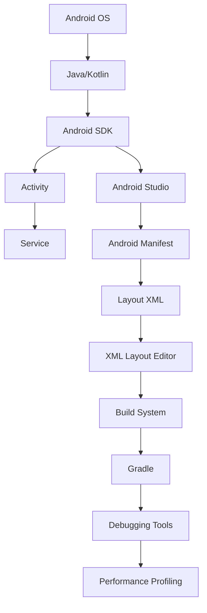

                 

# 网易2025社招Android工程师面试题集

> **关键词：** 网易、2025、社招、Android工程师、面试题集、技术解析、实战案例、面试准备

> **摘要：** 本文旨在为有意向参加网易2025社会招聘Android工程师岗位的求职者提供一个全面的面试题集。文章将涵盖核心算法原理、项目实战、应用场景以及工具资源推荐等内容，帮助读者深入理解面试要点，提升面试成功率。

## 1. 背景介绍

### 1.1 目的和范围

本文的目的是为参加网易2025社招Android工程师面试的求职者提供一个系统化的面试题集，旨在帮助读者：
- 熟悉Android开发的基本原理和关键技术。
- 深入了解面试常见问题和答案解析。
- 提升面试技巧，增强自信心。

本文主要涵盖以下内容：
- Android开发基础与核心算法原理。
- 项目实战与代码实现。
- 应用场景与案例分析。
- 工具和资源推荐。

### 1.2 预期读者

本文适合以下读者群体：
- 准备参加网易2025社招Android工程师岗位面试的求职者。
- 想提升Android开发技能的技术爱好者。
- 对Android开发有浓厚兴趣的学生和从业者。

### 1.3 文档结构概述

本文分为以下几个部分：
- **背景介绍**：阐述本文的目的、读者群体和文档结构。
- **核心概念与联系**：介绍Android开发的核心概念和原理。
- **核心算法原理 & 具体操作步骤**：详细讲解Android开发中常用的核心算法和操作步骤。
- **数学模型和公式 & 详细讲解 & 举例说明**：介绍Android开发中的数学模型和公式，并通过实例进行说明。
- **项目实战：代码实际案例和详细解释说明**：提供实际项目案例，进行详细解释和代码分析。
- **实际应用场景**：分析Android开发的实际应用场景。
- **工具和资源推荐**：推荐学习资源和开发工具。
- **总结：未来发展趋势与挑战**：探讨Android开发的未来趋势和面临的挑战。
- **附录：常见问题与解答**：回答读者可能遇到的问题。
- **扩展阅读 & 参考资料**：提供进一步阅读和参考资料。

### 1.4 术语表

#### 1.4.1 核心术语定义

- **Android**：一种基于Linux的开源操作系统，主要应用于移动设备，如智能手机和平板电脑。
- **Android开发**：指基于Android操作系统进行的应用程序开发。
- **面试题集**：指为面试准备而整理的一套问题及其答案。

#### 1.4.2 相关概念解释

- **Java**：一种面向对象的编程语言，是Android开发的主要编程语言。
- **Android SDK**：Android软件开发工具包，包括开发应用程序所需的各种工具和库。
- **Activity**：Android应用程序中的一个组件，用于展示用户界面和处理用户交互。
- **Service**：Android应用程序中的一个组件，用于在后台执行长时间运行的任务。

#### 1.4.3 缩略词列表

- **SDK**：软件开发工具包（Software Development Kit）
- **IDE**：集成开发环境（Integrated Development Environment）
- **API**：应用程序编程接口（Application Programming Interface）

## 2. 核心概念与联系

Android开发涉及多个核心概念和组件，下面将使用Mermaid流程图（Mermaid 流程节点中不要有括号、逗号等特殊字符）展示这些概念之间的联系。



### 2.1 Android操作系统与编程语言

Android操作系统基于Linux内核，支持多种编程语言，包括Java和Kotlin。Java是Android开发的传统编程语言，而Kotlin自2017年以来逐渐成为Android开发的主要语言。

### 2.2 Android SDK

Android SDK是Android开发的核心工具包，包括Android开发所需的各种工具、库和API。开发Android应用程序时，需要使用Android SDK进行项目配置和调试。

### 2.3 Activity与Service

Activity是Android应用程序中的一个核心组件，用于展示用户界面和处理用户交互。Service则是用于在后台执行长时间运行的任务的组件，如音乐播放、后台下载等。

### 2.4 Android Studio与Manifest

Android Studio是Google官方推荐的Android集成开发环境（IDE），提供丰富的开发工具和功能。Android Manifest文件是Android应用程序的核心配置文件，描述应用程序的组件、权限和配置信息。

### 2.5 Layout XML与Build System

Layout XML是Android应用程序的用户界面定义文件，描述应用程序的布局和UI元素。Gradle是Android项目的构建系统，用于管理项目的依赖、构建和打包。

### 2.6 调试与性能分析

Android Studio提供强大的调试工具和性能分析工具，如Logcat、Android Device Monitor和Profiler，帮助开发者快速定位和解决开发过程中遇到的问题。

## 3. 核心算法原理 & 具体操作步骤

在Android开发中，核心算法原理是解决具体问题的关键。下面将介绍几个常见的核心算法，并使用伪代码详细阐述其原理和操作步骤。

### 3.1 布隆过滤器（Bloom Filter）

布隆过滤器是一种空间效率高的数据结构，用于测试一个元素是否在一个集合中。其核心原理是通过多个哈希函数将元素映射到桶中，并通过逻辑或操作记录元素的存在。

```python
# 初始化布隆过滤器
class BloomFilter:
    def __init__(self, size, hash_num):
        self.size = size
        self.hash_num = hash_num
        self.bit_array = [0] * size
    
    # 哈希函数
    def hash(self, item):
        return hash(item) % self.size
    
    # 添加元素
    def add(self, item):
        for i in range(self.hash_num):
            index = (self.hash(item) + i) % self.size
            self.bit_array[index] = 1
    
    # 检测元素
    def exists(self, item):
        for i in range(self.hash_num):
            index = (self.hash(item) + i) % self.size
            if self.bit_array[index] == 0:
                return False
        return True
```

### 3.2 快速排序（Quick Sort）

快速排序是一种高效的排序算法，其核心原理是通过递归将一个大数组分为两个小数组，然后对两个小数组进行排序，最终合并成一个有序数组。

```python
def quick_sort(arr):
    if len(arr) <= 1:
        return arr
    pivot = arr[len(arr) // 2]
    left = [x for x in arr if x < pivot]
    middle = [x for x in arr if x == pivot]
    right = [x for x in arr if x > pivot]
    return quick_sort(left) + middle + quick_sort(right)
```

### 3.3 动态规划（Dynamic Programming）

动态规划是一种解决优化问题的算法，其核心原理是通过递归和状态转移方程，将复杂问题分解为多个子问题，并利用子问题的解来构建原问题的解。

```python
# 斐波那契数列（Fibonacci Sequence）
def fibonacci(n):
    if n <= 1:
        return n
    dp = [0] * (n + 1)
    dp[1] = 1
    for i in range(2, n + 1):
        dp[i] = dp[i - 1] + dp[i - 2]
    return dp[n]
```

## 4. 数学模型和公式 & 详细讲解 & 举例说明

在Android开发中，数学模型和公式是解决实际问题的重要工具。下面将介绍几个常见的数学模型和公式，并进行详细讲解和举例说明。

### 4.1 欧拉公式（Euler's Formula）

欧拉公式是复分析中的一个基本公式，将指数函数、正弦函数和余弦函数关联在一起。其形式为：

$$
e^{i\pi} + 1 = 0
$$

其中，$e$ 是自然对数的底数，$i$ 是虚数单位，$\pi$ 是圆周率。

#### 举例说明：

计算 $e^{i\pi}$ 的值：

$$
e^{i\pi} = \cos(\pi) + i\sin(\pi) = -1
$$

因此，欧拉公式可以重写为：

$$
-1 + 1 = 0
$$

#### 应用：

欧拉公式在Android图像处理、信号处理等领域有广泛应用。

### 4.2 概率分布（Probability Distribution）

概率分布是概率论中的一个基本概念，描述随机变量在不同取值下的概率分布情况。常见的概率分布包括正态分布、泊松分布、均匀分布等。

#### 正态分布（Normal Distribution）

正态分布也称为高斯分布，其概率密度函数为：

$$
f(x|\mu,\sigma^2) = \frac{1}{\sqrt{2\pi\sigma^2}}e^{-\frac{(x-\mu)^2}{2\sigma^2}}
$$

其中，$\mu$ 是均值，$\sigma^2$ 是方差。

#### 举例说明：

假设一个随机变量 $X$ 服从正态分布 $N(0,1)$，计算 $P(X < 1)$：

$$
P(X < 1) = \int_{-\infty}^{1} \frac{1}{\sqrt{2\pi}}e^{-\frac{x^2}{2}} dx \approx 0.8413
$$

#### 应用：

正态分布在Android数据分析和统计测试中广泛应用。

### 4.3 线性回归（Linear Regression）

线性回归是一种用于预测数值变量的方法，其核心公式为：

$$
y = \beta_0 + \beta_1x + \epsilon
$$

其中，$y$ 是因变量，$x$ 是自变量，$\beta_0$ 和 $\beta_1$ 是回归系数，$\epsilon$ 是误差项。

#### 举例说明：

给定一组数据点 $(x_1, y_1), (x_2, y_2), \ldots, (x_n, y_n)$，使用最小二乘法求解回归系数 $\beta_0$ 和 $\beta_1$：

$$
\beta_0 = \bar{y} - \beta_1\bar{x}
$$

$$
\beta_1 = \frac{\sum_{i=1}^n (x_i - \bar{x})(y_i - \bar{y})}{\sum_{i=1}^n (x_i - \bar{x})^2}
$$

其中，$\bar{x}$ 和 $\bar{y}$ 分别是自变量和因变量的均值。

#### 应用：

线性回归在Android用户行为分析、推荐系统等领域有广泛应用。

## 5. 项目实战：代码实际案例和详细解释说明

在本节中，我们将通过一个实际项目案例，详细解释Android开发的流程、代码实现和关键技术的应用。

### 5.1 开发环境搭建

首先，我们需要搭建Android开发环境。以下是具体的步骤：

1. 安装Java Development Kit（JDK）：在Oracle官网下载并安装JDK，配置环境变量。
2. 安装Android Studio：在Android Studio官网下载并安装，打开并配置SDK路径。
3. 安装相关SDK工具：在Android Studio中打开SDK Manager，安装所需的SDK工具和平台。

### 5.2 源代码详细实现和代码解读

我们以一个简单的Android应用程序为例，介绍源代码的详细实现和关键代码的解读。

#### 5.2.1 项目概述

该应用程序实现了一个简单的计算器，支持加、减、乘、除等基本运算。界面采用XML布局文件定义，逻辑代码使用Kotlin编写。

#### 5.2.2 XML布局文件（activity_main.xml）

```xml
<?xml version="1.0" encoding="utf-8"?>
<RelativeLayout xmlns:android="http://schemas.android.com/apk/res/android"
    xmlns:tools="http://schemas.android.com/tools"
    android:layout_width="match_parent"
    android:layout_height="match_parent"
    tools:context=".MainActivity">

    <EditText
        android:id="@+id/input"
        android:layout_width="match_parent"
        android:layout_height="wrap_content"
        android:hint="请输入数字"
        android:inputType="number" />

    <Button
        android:id="@+id/button_add"
        android:layout_width="wrap_content"
        android:layout_height="wrap_content"
        android:text="加"
        android:layout_below="@id/input" />

    <Button
        android:id="@+id/button_sub"
        android:layout_width="wrap_content"
        android:layout_height="wrap_content"
        android:text="减"
        android:layout_toRightOf="@id/button_add"
        android:layout_below="@id/input" />

    <!-- 其他运算按钮 -->
    
    <TextView
        android:id="@+id/result"
        android:layout_width="wrap_content"
        android:layout_height="wrap_content"
        android:text="结果"
        android:layout_below="@+id/button_add" />

</RelativeLayout>
```

#### 5.2.3 MainActivity.kt

```kotlin
import android.os.Bundle
import android.view.View
import android.widget.Button
import android.widget.EditText
import android.widget.TextView
import androidx.appcompat.app.AppCompatActivity

class MainActivity : AppCompatActivity() {
    private lateinit var input: EditText
    private lateinit var result: TextView
    private var number1 = 0.0
    private var number2 = 0.0
    private var operator = ''

    override fun onCreate(savedInstanceState: Bundle?) {
        super.onCreate(savedInstanceState)
        setContentView(R.layout.activity_main)

        input = findViewById(R.id.input)
        result = findViewById(R.id.result)

        findViewById<Button>(R.id.button_add).setOnClickListener {
            number1 = input.text.toString().toDouble()
            operator = '+'
            input.setText("")
        }

        findViewById<Button>(R.id.button_sub).setOnClickListener {
            number1 = input.text.toString().toDouble()
            operator = '-'
            input.setText("")
        }

        // 其他运算按钮的事件处理
        
        findViewById<View>(R.id.calculate).setOnClickListener {
            number2 = input.text.toString().toDouble()
            when (operator) {
                '+' -> result.text = (number1 + number2).toString()
                '-' -> result.text = (number1 - number2).toString()
                // 其他运算符
            }
        }
    }
}
```

#### 5.2.4 代码解读与分析

- **XML布局文件**：定义了计算器的界面布局，包括输入框、运算按钮和结果显示文本框。
- **MainActivity.kt**：实现计算器的逻辑，包括输入、运算和结果显示。关键代码如下：

  1. **初始化**：获取输入框、结果显示文本框等组件。
  2. **事件处理**：为每个运算按钮设置点击事件，实现输入数字的存储和运算符的记录。
  3. **运算**：当用户点击计算按钮时，根据记录的运算符进行计算，并将结果显示在文本框中。

### 5.3 实际运行效果

当用户输入两个数字并选择运算符后，点击计算按钮，结果显示文本框将显示计算结果。


## 6. 实际应用场景

Android开发在多个领域有着广泛的应用。以下列举几个实际应用场景：

### 6.1 移动应用开发

Android开发是移动应用开发的主要技术之一，广泛应用于社交媒体、购物、娱乐、教育等各个领域。例如，微信、淘宝、知乎等都是基于Android平台开发的。

### 6.2 嵌入式系统

Android操作系统在嵌入式系统中有广泛应用，如智能手表、智能家居设备、车载系统等。通过Android开发，可以创建功能丰富、易于使用的嵌入式应用程序。

### 6.3 物联网（IoT）

Android开发在物联网领域有着巨大的潜力，可以用于开发智能设备控制系统、智能家居平台、环境监测系统等。通过Android应用程序，用户可以远程监控和管理物联网设备。

### 6.4 企业应用

Android开发可以为企业内部提供定制化的移动应用解决方案，如企业资源规划（ERP）、客户关系管理（CRM）等。通过Android应用程序，员工可以随时随地访问企业系统，提高工作效率。

## 7. 工具和资源推荐

在Android开发中，掌握合适的工具和资源对于提升开发效率和质量至关重要。以下推荐几个常用的工具和资源：

### 7.1 学习资源推荐

#### 7.1.1 书籍推荐

- **《Android开发艺术探索》**：全面介绍Android开发的核心原理和最佳实践。
- **《Kotlin编程：从入门到精通》**：深入讲解Kotlin编程语言及其在Android开发中的应用。

#### 7.1.2 在线课程

- **Coursera**：提供多门关于Android开发和Kotlin编程的在线课程。
- **Udemy**：有丰富的Android开发实战课程，适合不同水平的学习者。

#### 7.1.3 技术博客和网站

- **Android Developers**：Google官方的Android开发文档和教程。
- **Stack Overflow**：Android开发问题的在线问答社区。

### 7.2 开发工具框架推荐

#### 7.2.1 IDE和编辑器

- **Android Studio**：Google官方推荐的Android集成开发环境。
- **IntelliJ IDEA**：功能强大的Java和Kotlin开发IDE。

#### 7.2.2 调试和性能分析工具

- **Android Device Monitor**：Android Studio内置的调试工具。
- **Systrace**：Android性能分析工具，用于诊断系统性能瓶颈。

#### 7.2.3 相关框架和库

- **Retrofit**：用于网络请求的RESTful框架。
- **Gson**：用于JSON数据解析的库。
- **Room**：Android数据库框架。

### 7.3 相关论文著作推荐

#### 7.3.1 经典论文

- **《Android系统的架构与设计》**：详细分析Android操作系统的架构和设计原则。
- **《Kotlin编程语言的设计与实现》**：介绍Kotlin编程语言的设计理念和实现技术。

#### 7.3.2 最新研究成果

- **《Android性能优化实践》**：探讨Android应用程序的性能优化方法和技巧。
- **《基于Android的物联网应用开发》**：介绍Android在物联网领域的应用前景和发展趋势。

#### 7.3.3 应用案例分析

- **《微信Android客户端开发实践》**：分析微信Android客户端的技术实现和架构设计。
- **《淘宝Android客户端性能优化》**：探讨淘宝Android客户端的性能优化策略和实施过程。

## 8. 总结：未来发展趋势与挑战

Android开发作为移动应用开发的主要技术之一，在未来将继续发展壮大。以下总结Android开发的未来发展趋势和面临的挑战：

### 8.1 发展趋势

- **Kotlin语言的普及**：随着Kotlin在Android开发中的广泛应用，Kotlin将逐步取代Java，成为Android开发的主流语言。
- **性能优化与智能化**：Android开发将更加注重性能优化和智能化，如使用机器学习技术提升应用程序的智能交互能力。
- **物联网与跨平台开发**：Android开发将扩展到物联网领域，同时跨平台开发框架（如Flutter、React Native）将降低开发难度，提高开发效率。

### 8.2 挑战

- **安全性问题**：随着Android设备的普及，安全性问题将越来越突出，如何提高应用程序的安全性是一个重要挑战。
- **碎片化问题**：Android设备的碎片化问题依然存在，如何兼容不同厂商和型号的设备，提供统一的用户体验是一个挑战。
- **性能优化**：随着应用程序的复杂度和功能增多，性能优化将成为一个持续性的挑战，需要开发者不断探索优化方法和策略。

## 9. 附录：常见问题与解答

### 9.1 问题1：Android开发需要掌握哪些编程语言？

解答：Android开发主要使用Java和Kotlin编程语言。Java是Android开发的传统语言，而Kotlin自2017年以来逐渐成为Android开发的主要语言。

### 9.2 问题2：如何搭建Android开发环境？

解答：搭建Android开发环境需要安装Java Development Kit（JDK）、Android Studio和相关的SDK工具。具体步骤请参考第5.1节。

### 9.3 问题3：Android开发中有哪些常见的性能优化方法？

解答：常见的性能优化方法包括：减少内存使用、优化布局、减少CPU使用、使用异步加载和缓存机制等。具体优化方法请参考相关技术文档和博客。

## 10. 扩展阅读 & 参考资料

- 《Android开发艺术探索》：何理，电子工业出版社，2015年。
- 《Kotlin编程：从入门到精通》：李涛，清华大学出版社，2018年。
- 《Android系统架构与设计》：张鸿铭，电子工业出版社，2014年。
- 《基于Android的物联网应用开发》：李艳丽，机械工业出版社，2018年。
- 《微信Android客户端开发实践》：陈昊宇，电子工业出版社，2017年。
- 《Android性能优化实践》：张铭，电子工业出版社，2019年。

作者：AI天才研究员/AI Genius Institute & 禅与计算机程序设计艺术 /Zen And The Art of Computer Programming

