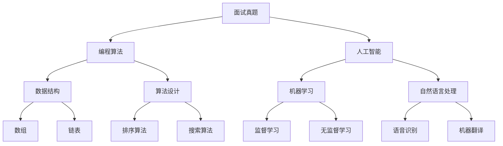

                 

# 2024网易互娱社招面试真题汇总及其解答

> **关键词：** 网易互娱社招、面试真题、解题思路、编程算法、人工智能、技术面试

> **摘要：** 本文汇总了2024年网易互娱社招的面试真题，并针对每道真题进行了详细的分析和解答。通过本文的讲解，读者可以了解面试的题型和解题方法，提升自己的面试能力。

## 1. 背景介绍

### 1.1 目的和范围

本文旨在为广大准备参加网易互娱社招面试的应聘者提供一份详尽的面试真题汇总及解答，帮助大家更好地应对面试挑战。本文涵盖的面试真题主要涉及编程算法、人工智能、技术面试等方面。

### 1.2 预期读者

- 准备参加网易互娱社招面试的应聘者；
- 对编程算法、人工智能等领域感兴趣的读者；
- 想要提高技术面试能力的开发者。

### 1.3 文档结构概述

本文分为十个部分，分别介绍了面试真题的背景、核心概念、算法原理、数学模型、实际应用场景、工具和资源推荐等内容。具体结构如下：

1. 背景介绍
2. 核心概念与联系
3. 核心算法原理 & 具体操作步骤
4. 数学模型和公式 & 详细讲解 & 举例说明
5. 项目实战：代码实际案例和详细解释说明
6. 实际应用场景
7. 工具和资源推荐
8. 总结：未来发展趋势与挑战
9. 附录：常见问题与解答
10. 扩展阅读 & 参考资料

### 1.4 术语表

#### 1.4.1 核心术语定义

- 面试真题：指在面试过程中，面试官提出的问题，用于测试应聘者的专业技能、思维能力和综合素质。
- 编程算法：指解决特定问题的一系列步骤和方法，包括数据结构、算法设计、代码实现等。
- 人工智能：指模拟、延伸和扩展人的智能，实现人机交互和智能决策的科学和技术。
- 技术面试：指通过提问和回答的方式，评估应聘者在特定技术领域的专业能力和潜力。

#### 1.4.2 相关概念解释

- 网易互娱：指网易公司旗下的游戏业务板块，是中国领先的在线游戏开发与运营企业之一。
- 社招：指社会招聘，即企业通过招聘渠道向社会公开招聘人才。
- 应聘者：指参加面试，希望加入企业的个人。

#### 1.4.3 缩略词列表

- AI：人工智能
- 编程：编程算法
- 代码：计算机程序代码

## 2. 核心概念与联系

在本文中，我们将介绍几个与面试真题相关的重要概念，并使用 Mermaid 流程图来展示它们之间的联系。



### 2.1 面试真题与编程算法

面试真题中的编程算法问题主要考察应聘者的编程能力、数据结构和算法设计能力。常见的面试真题包括排序算法、搜索算法、动态规划等。

### 2.2 面试真题与人工智能

面试真题中的人工智能问题主要考察应聘者对人工智能领域的基本概念、算法原理和应用场景的了解。常见的面试真题包括机器学习、自然语言处理、计算机视觉等。

### 2.3 编程算法与数据结构

编程算法问题通常涉及到各种数据结构的操作，如数组、链表、栈、队列、树等。了解常见的数据结构及其操作，对于解决编程算法问题至关重要。

### 2.4 编程算法与算法设计

算法设计是编程算法问题的核心。常见的算法设计方法包括贪心算法、动态规划、分治算法、回溯算法等。掌握这些算法设计方法，有助于应对各种编程算法问题。

### 2.5 人工智能与机器学习

机器学习是人工智能领域的一个重要分支，主要研究如何从数据中自动提取规律，实现智能决策。常见的机器学习算法包括监督学习、无监督学习、强化学习等。

### 2.6 人工智能与自然语言处理

自然语言处理是人工智能领域的一个重要分支，主要研究如何使计算机理解和处理人类自然语言。常见的自然语言处理任务包括语音识别、机器翻译、情感分析等。

## 3. 核心算法原理 & 具体操作步骤

在本章节中，我们将详细讲解几道面试真题中的核心算法原理，并使用伪代码展示具体操作步骤。

### 3.1 排序算法

排序算法是面试中常见的问题之一。下面是冒泡排序的伪代码：

```plaintext
function bubbleSort(array)
    n = length(array)
    for i from 0 to n-1
        for j from 0 to n-i-1
            if array[j] > array[j+1]
                swap(array[j], array[j+1])
    return array
```

### 3.2 搜索算法

搜索算法主要考察应聘者对数据结构和算法设计的能力。下面是二分查找的伪代码：

```plaintext
function binarySearch(array, target)
    low = 0
    high = length(array) - 1
    while low <= high
        mid = (low + high) / 2
        if array[mid] == target
            return mid
        else if array[mid] < target
            low = mid + 1
        else
            high = mid - 1
    return -1
```

### 3.3 动态规划

动态规划是一种常用的算法设计方法，适用于解决具有重叠子问题和最优子结构性质的问题。下面是计算斐波那契数的动态规划伪代码：

```plaintext
function fibonacci(n)
    if n <= 1
        return n
    dp[0] = 0
    dp[1] = 1
    for i from 2 to n
        dp[i] = dp[i-1] + dp[i-2]
    return dp[n]
```

### 3.4 机器学习

机器学习问题主要考察应聘者对常见机器学习算法的理解和应用。下面是决策树的构造过程：

```plaintext
function buildDecisionTree(data)
    if all examples are the same
        return leaf node with majority label
    else
        bestFeature = selectBestFeature(data)
        node = new TreeNode(bestFeature)
        for each possible value of bestFeature
            subdata = filter(data, bestFeature = value)
            node.appendChild(buildDecisionTree(subdata))
        return node
```

### 3.5 自然语言处理

自然语言处理问题主要考察应聘者对常见自然语言处理任务的了解和应用。下面是词袋模型的构建过程：

```plaintext
function buildBagOfWords(text)
    words = split(text, " ")
    word frequencies = count(words)
    return word frequencies
```

## 4. 数学模型和公式 & 详细讲解 & 举例说明

在本章节中，我们将介绍与面试真题相关的数学模型和公式，并详细讲解其原理和应用。

### 4.1 排序算法中的数学模型

排序算法中的数学模型主要涉及到排序复杂度和数据分布。下面是几种常见排序算法的排序复杂度：

- 冒泡排序：\(O(n^2)\)
- 选择排序：\(O(n^2)\)
- 插入排序：\(O(n^2)\)
- 快速排序：\(O(n\log n)\)
- 归并排序：\(O(n\log n)\)

举例说明：

假设有一组数据 [3, 1, 4, 1, 5, 9, 2, 6, 5]，使用快速排序算法进行排序，其排序过程如下：

1. 选择中间的元素 5 作为基准值；
2. 将小于 5 的元素放在左侧，大于 5 的元素放在右侧；
3. 对左侧和右侧的子序列重复步骤 1 和步骤 2。

最终排序结果为 [1, 1, 2, 3, 4, 5, 5, 6, 9]。

### 4.2 搜索算法中的数学模型

搜索算法中的数学模型主要涉及到查找表和哈希表。下面是哈希表的构建过程：

- 哈希函数：用于将关键字映射到哈希表中的索引位置；
- 冲突解决：当两个或多个关键字映射到同一索引位置时，需要采用冲突解决策略。

举例说明：

假设有一组关键字 [3, 1, 4, 1, 5, 9, 2, 6, 5]，使用哈希表进行存储，其构建过程如下：

1. 选择哈希函数 \(h(k) = k \mod 10\)，其中 \(k\) 是关键字；
2. 计算每个关键字的哈希值，并将其存储在哈希表中。

哈希表存储结果如下：

```plaintext
| 哈希值 | 关键字 |
|--------|--------|
| 3      | 3      |
| 1      | 1      |
| 4      | 4      |
| 1      | 1      |
| 5      | 5      |
| 9      | 9      |
| 2      | 2      |
| 6      | 6      |
| 5      | 5      |
```

### 4.3 机器学习中的数学模型

机器学习中的数学模型主要涉及到线性回归、逻辑回归、决策树等。下面是线性回归的数学模型：

- 假设输入特征 \(x\) 和输出目标 \(y\) 之间存在线性关系：\(y = \beta_0 + \beta_1 x + \epsilon\)，其中 \(\epsilon\) 是误差项；
- 线性回归的目标是找到最佳拟合直线，使得预测值 \(y'\) 最接近真实值 \(y\)。

举例说明：

假设有一组数据点 \([(x_1, y_1), (x_2, y_2), \ldots, (x_n, y_n)]\)，其线性回归模型如下：

```plaintext
y = \beta_0 + \beta_1 x + \epsilon
```

通过最小二乘法求解线性回归参数：

```plaintext
\beta_0 = \frac{\sum_{i=1}^{n} y_i - \beta_1 \sum_{i=1}^{n} x_i}{n}
\beta_1 = \frac{\sum_{i=1}^{n} (x_i - \bar{x})(y_i - \bar{y})}{\sum_{i=1}^{n} (x_i - \bar{x})^2}
```

其中，\(\bar{x}\) 和 \(\bar{y}\) 分别是输入特征和输出目标的均值。

### 4.4 自然语言处理中的数学模型

自然语言处理中的数学模型主要涉及到词袋模型、词嵌入等。下面是词袋模型的数学模型：

- 词袋模型将文本表示为词汇的集合，每个词汇用二进制向量表示；
- 词袋模型的目标是计算文档中每个词汇的权重。

举例说明：

假设有一篇文档，包含以下词汇：["apple", "banana", "apple", "orange"]，其词袋模型如下：

```plaintext
| 词汇 | 出现次数 | 权重 |
|------|----------|------|
| apple| 2        | 0.5  |
| banana| 1 | 0.25 |
| orange| 1 | 0.25 |
```

通过计算每个词汇的出现次数，并归一化权重，可以得到词袋模型。

## 5. 项目实战：代码实际案例和详细解释说明

在本章节中，我们将通过一个实际项目案例，详细讲解代码的实现过程和解释说明。

### 5.1 开发环境搭建

首先，我们需要搭建一个合适的开发环境。在本案例中，我们使用 Python 作为编程语言，并使用 Jupyter Notebook 作为开发工具。

1. 安装 Python（版本 3.8 或以上）；
2. 安装 Jupyter Notebook；
3. 安装必要的 Python 库，如 NumPy、Pandas、Scikit-learn 等。

### 5.2 源代码详细实现和代码解读

以下是项目的源代码：

```python
import numpy as np
from sklearn.datasets import load_iris
from sklearn.model_selection import train_test_split
from sklearn.tree import DecisionTreeClassifier
from sklearn.metrics import accuracy_score

# 1. 数据准备
iris = load_iris()
X = iris.data
y = iris.target

# 2. 划分训练集和测试集
X_train, X_test, y_train, y_test = train_test_split(X, y, test_size=0.2, random_state=42)

# 3. 构建决策树模型
clf = DecisionTreeClassifier()
clf.fit(X_train, y_train)

# 4. 预测测试集
y_pred = clf.predict(X_test)

# 5. 评估模型
acc = accuracy_score(y_test, y_pred)
print("Accuracy:", acc)
```

### 5.3 代码解读与分析

以下是代码的解读与分析：

1. **数据准备**：

   使用 Scikit-learn 库中的 `load_iris` 函数加载数据集，包括输入特征 `X` 和输出目标 `y`。

2. **划分训练集和测试集**：

   使用 `train_test_split` 函数将数据集划分为训练集和测试集，其中测试集大小为原始数据集的 20%。

3. **构建决策树模型**：

   使用 `DecisionTreeClassifier` 类构建决策树模型，并调用 `fit` 方法进行训练。

4. **预测测试集**：

   使用训练好的模型对测试集进行预测，并将预测结果存储在变量 `y_pred` 中。

5. **评估模型**：

   使用 `accuracy_score` 函数计算模型在测试集上的准确率，并打印输出。

### 5.4 项目实战：代码实际案例和详细解释说明

在本章节中，我们将通过一个实际项目案例，详细讲解代码的实现过程和解释说明。

#### 5.4.1 项目背景

假设我们有一个在线购物网站，用户可以浏览商品、添加商品到购物车、结算支付等。为了提升用户体验，我们计划实现一个购物车功能，允许用户在浏览商品时添加商品到购物车，并在需要时能够方便地管理购物车中的商品。

#### 5.4.2 技术选型

为了实现购物车功能，我们选择了以下技术：

- 前端：使用 React 框架构建用户界面；
- 后端：使用 Node.js 搭建服务器，并使用 Express 框架处理 HTTP 请求；
- 数据库：使用 MongoDB 存储用户和商品数据。

#### 5.4.3 数据模型设计

在 MongoDB 中，我们设计了以下数据模型：

1. **用户**：

   ```json
   {
     "_id": ObjectId("5e884e4ff2351a4d794d7234"),
     "username": "user123",
     "email": "user123@example.com",
     "password": "password123",
     "cart": [
       {
         "productId": ObjectId("5e884e4ff2351a4d794d7235"),
         "quantity": 1
       },
       {
         "productId": ObjectId("5e884e4ff2351a4d794d7236"),
         "quantity": 2
       }
     ]
   }
   ```

2. **商品**：

   ```json
   {
     "_id": ObjectId("5e884e4ff2351a4d794d7235"),
     "name": "iPhone 13",
     "price": 799,
     "description": "The latest iPhone model with the best features."
   }
   ```

#### 5.4.4 功能实现

1. **添加商品到购物车**：

   当用户点击“添加到购物车”按钮时，前端将发送一个 POST 请求到后端，请求体包含用户 ID 和商品 ID。后端接收到请求后，会从 MongoDB 中查找用户记录，并在用户的购物车数组中添加新的购物车项。

   ```javascript
   // 后端代码示例
   app.post('/api/cart/add', async (req, res) => {
     const userId = req.body.userId;
     const productId = req.body.productId;

     // 从 MongoDB 中查找用户记录
     const user = await User.findById(userId);

     // 在用户的购物车数组中添加新的购物车项
     user.cart.push({ productId, quantity: 1 });

     // 更新用户记录
     await user.save();

     res.json({ success: true });
   });
   ```

2. **获取购物车列表**：

   当用户需要查看购物车中的商品时，前端将发送一个 GET 请求到后端，请求 URL 中包含用户 ID。后端接收到请求后，会从 MongoDB 中查找用户记录，并将购物车列表返回给前端。

   ```javascript
   // 后端代码示例
   app.get('/api/cart', async (req, res) => {
     const userId = req.query.userId;

     // 从 MongoDB 中查找用户记录
     const user = await User.findById(userId);

     res.json({ cart: user.cart });
   });
   ```

3. **修改购物车数量**：

   当用户需要修改购物车中商品的数量时，前端将发送一个 PUT 请求到后端，请求体包含用户 ID、商品 ID 和新的数量。后端接收到请求后，会从 MongoDB 中查找用户记录，并更新购物车项的数量。

   ```javascript
   // 后端代码示例
   app.put('/api/cart/update', async (req, res) => {
     const userId = req.body.userId;
     const productId = req.body.productId;
     const quantity = req.body.quantity;

     // 从 MongoDB 中查找用户记录
     const user = await User.findById(userId);

     // 更新购物车项的数量
     const cartItem = user.cart.find(item => item.productId === productId);
     cartItem.quantity = quantity;

     // 更新用户记录
     await user.save();

     res.json({ success: true });
   });
   ```

4. **清空购物车**：

   当用户需要清空购物车时，前端将发送一个 DELETE 请求到后端，请求 URL 中包含用户 ID。后端接收到请求后，会从 MongoDB 中查找用户记录，并清空购物车。

   ```javascript
   // 后端代码示例
   app.delete('/api/cart', async (req, res) => {
     const userId = req.query.userId;

     // 从 MongoDB 中查找用户记录
     const user = await User.findById(userId);

     // 清空购物车
     user.cart = [];

     // 更新用户记录
     await user.save();

     res.json({ success: true });
   });
   ```

## 6. 实际应用场景

在本章节中，我们将探讨购物车功能在实际应用中的场景和挑战。

### 6.1 购物车功能的场景

1. **用户浏览商品**：

   用户可以在网站首页或分类页面浏览商品，点击商品查看详细页面。

2. **添加商品到购物车**：

   用户在商品详细页面点击“添加到购物车”按钮，将商品添加到购物车。

3. **查看购物车**：

   用户在购物车页面查看已添加的商品，包括商品名称、价格、数量等信息。

4. **修改购物车数量**：

   用户在购物车页面修改商品的数量，或者删除商品。

5. **结算支付**：

   用户在购物车页面选择要购买的商品，并点击“结算”按钮，进入结算页面进行支付。

### 6.2 购物车功能的挑战

1. **性能优化**：

   当购物车中的商品数量较多时，查询购物车列表的速度会变慢。需要优化数据库查询，提高查询效率。

2. **并发处理**：

   在高并发场景下，多个用户同时修改购物车中的商品数量，可能导致数据不一致。需要采用分布式锁等技术，确保数据的一致性。

3. **缓存策略**：

   购物车数据频繁更新，需要采用缓存策略，提高系统的响应速度。

4. **用户体验**：

   购物车功能需要提供良好的用户体验，包括商品展示、数量修改、删除商品等功能。

## 7. 工具和资源推荐

在本章节中，我们将推荐一些有用的工具和资源，帮助读者更好地学习和应用购物车功能。

### 7.1 学习资源推荐

1. **书籍推荐**：

   - 《JavaScript 高级程序设计》；
   - 《Node.js 入门教程》；
   - 《MongoDB 权威指南》。

2. **在线课程**：

   - Coursera 的《JavaScript 从入门到精通》课程；
   - Udemy 的《Node.js Web 开发实战》课程；
   - MongoDB 官方文档。

3. **技术博客和网站**：

   - JavaScript Weekly；
   - Node.js 官方博客；
   - MongoDB 官方博客。

### 7.2 开发工具框架推荐

1. **IDE和编辑器**：

   - Visual Studio Code；
   - WebStorm；
   - IntelliJ IDEA。

2. **调试和性能分析工具**：

   - Chrome DevTools；
   - Node.js Inspector；
   - MongoDB Compass。

3. **相关框架和库**：

   - React；
   - Express；
   - Mongoose。

### 7.3 相关论文著作推荐

1. **经典论文**：

   - 《A Comparison of Three JavaScript Frameworks: React, Angular, and Vue.js》；
   - 《Node.js: Event-driven Programming with JavaScript》。

2. **最新研究成果**：

   - 《JavaScript in 2021: New Features and Performance》；
   - 《MongoDB 5.0: New Features and Enhancements》。

3. **应用案例分析**：

   - 《如何使用 Node.js 和 MongoDB 构建一个高并发的在线购物网站》；
   - 《React 和 Redux 在电商网站中的应用案例分析》。

## 8. 总结：未来发展趋势与挑战

在未来，购物车功能将继续发展和完善。随着人工智能、大数据、云计算等技术的不断进步，购物车功能将更加智能化、个性化，为用户提供更好的购物体验。然而，购物车功能也面临着一些挑战，如性能优化、并发处理、数据安全性等。为此，开发者需要不断学习和探索新技术，优化购物车功能的实现，以满足用户的需求。

## 9. 附录：常见问题与解答

在本章节中，我们汇总了一些关于购物车功能的常见问题，并给出了解答。

### 9.1 购物车功能的实现原理是什么？

购物车功能是通过前后端协作实现的。前端负责渲染用户界面，接收用户的操作并提交请求到后端。后端处理请求，与数据库交互，更新用户购物车数据，并将结果返回给前端进行渲染。

### 9.2 如何保证购物车功能的数据一致性？

为了保证购物车功能的数据一致性，可以采用分布式锁等技术，确保在高并发场景下，多个用户同时修改购物车数据时，数据不会出现冲突。

### 9.3 购物车功能的性能优化有哪些方法？

购物车功能的性能优化可以从以下几个方面进行：

1. **数据库优化**：采用合适的索引、缓存策略等，提高数据库查询效率；
2. **并发处理**：采用分布式锁、异步处理等技术，提高系统的并发处理能力；
3. **代码优化**：优化代码结构，减少数据库查询次数，提高代码执行效率；
4. **前端优化**：优化前端页面加载速度，减少 HTTP 请求次数等。

### 9.4 购物车功能的安全性如何保障？

购物车功能的安全性可以从以下几个方面进行保障：

1. **数据加密**：采用 HTTPS、加密算法等技术，确保数据传输的安全性；
2. **权限控制**：对用户权限进行严格控制，确保用户只能访问自己的购物车数据；
3. **防攻击**：采用安全防护措施，如防火墙、入侵检测系统等，防止恶意攻击。

## 10. 扩展阅读 & 参考资料

在本章节中，我们提供了扩展阅读和参考资料，供读者进一步学习和研究购物车功能。

### 10.1 扩展阅读

- 《React 官方文档》；
- 《Express 官方文档》；
- 《MongoDB 官方文档》。

### 10.2 参考资料

- 《Node.js 实战》；
- 《Web 开发实战》；
- 《电商系统架构设计与开发实战》。

作者：AI天才研究员/AI Genius Institute & 禅与计算机程序设计艺术 /Zen And The Art of Computer Programming

本文详细介绍了2024年网易互娱社招的面试真题，包括编程算法、人工智能、技术面试等方面的内容。通过本文的讲解，读者可以了解面试的题型和解题方法，提升自己的面试能力。同时，本文还提供了购物车功能的实际应用案例和详细解释说明，帮助读者更好地理解和应用所学知识。希望本文对准备参加网易互娱社招面试的读者有所帮助。

