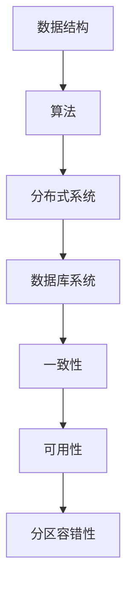

                 

# 美团2024校招系统设计面试题详解

## 关键词
- 美团校招
- 系统设计
- 面试题
- 数据结构与算法
- 分布式系统

## 摘要
本文将详细解析美团2024校招系统设计面试题，帮助即将参加面试的同学们更好地理解题目背后的核心概念和解决思路。文章将分为背景介绍、核心概念与联系、核心算法原理、数学模型与公式、项目实战、实际应用场景等多个部分，通过一步一步的分析推理，让大家深入掌握系统设计的精髓。

## 1. 背景介绍

### 1.1 目的和范围
本文旨在为美团2024校招系统设计面试题提供详细的解答和分析，帮助考生在面试中更好地展示自己的技术能力和思维能力。

### 1.2 预期读者
本篇文章适合即将参加美团校招的计算机科学、软件工程等相关专业的大学生和研究生，以及对系统设计有浓厚兴趣的程序员。

### 1.3 文档结构概述
本文分为以下几个部分：
1. 背景介绍：介绍本文的目的、读者对象以及文章结构。
2. 核心概念与联系：阐述系统设计中的核心概念和架构。
3. 核心算法原理 & 具体操作步骤：详细解析算法原理和操作步骤。
4. 数学模型和公式 & 详细讲解 & 举例说明：阐述数学模型及其应用。
5. 项目实战：通过代码实例进行实战讲解。
6. 实际应用场景：分析系统在实际中的应用。
7. 工具和资源推荐：推荐学习资源和开发工具。
8. 总结：展望未来发展趋势与挑战。
9. 附录：常见问题与解答。
10. 扩展阅读 & 参考资料：提供相关扩展阅读材料。

### 1.4 术语表
#### 1.4.1 核心术语定义
- 系统设计：对软件系统架构、模块划分、接口设计等进行规划和设计。
- 数据结构与算法：对数据进行组织和管理的方法，以及解决问题的计算方法。
- 分布式系统：由多个计算机节点组成的系统，通过通信网络实现数据共享和任务分配。

#### 1.4.2 相关概念解释
- 单机系统：运行在一台计算机上的系统，资源有限。
- 分布式系统：运行在多台计算机上的系统，资源分散，能够实现任务分配和负载均衡。
- 数据库系统：用于存储和管理数据的系统，支持数据的增删改查操作。

#### 1.4.3 缩略词列表
- SQL：结构化查询语言（Structured Query Language）
- RPC：远程过程调用（Remote Procedure Call）
- REST：表现层状态转换（Representational State Transfer）

## 2. 核心概念与联系

在系统设计中，理解核心概念和联系至关重要。以下是几个关键概念及其相互关系：

### 2.1 数据结构与算法
数据结构是指数据组织的方式，而算法则是解决问题的一系列步骤。常见的有数组、链表、栈、队列、树、图等。数据结构与算法紧密相关，数据结构决定了算法的复杂度和效率。

### 2.2 分布式系统
分布式系统由多个计算机节点组成，每个节点可以独立运行。它们通过通信网络进行数据共享和任务分配。分布式系统的核心是一致性、可用性和分区容错性（CAP定理）。

### 2.3 数据库系统
数据库系统用于存储和管理数据，支持数据的增删改查操作。常见的数据库系统有关系型数据库（如MySQL、Oracle）和非关系型数据库（如MongoDB、Redis）。

### 2.4 Mermaid 流程图
为了更好地理解核心概念之间的联系，我们可以使用Mermaid流程图来展示。以下是系统设计中的关键流程节点：



通过上述流程图，我们可以清晰地看到各个核心概念之间的联系，以及它们在系统设计中的重要性。

## 3. 核心算法原理 & 具体操作步骤

在系统设计中，算法原理是解决问题的关键。以下是一个经典的算法原理及其具体操作步骤：

### 3.1 常见的排序算法

排序算法是指对数据进行排序的一系列计算步骤。常见的排序算法有冒泡排序、选择排序、插入排序、快速排序等。以下是快速排序的算法原理和具体操作步骤：

#### 3.1.1 算法原理

快速排序的基本思想是选取一个基准元素，将待排序的序列分为两个子序列，左子序列的元素都比基准元素小，右子序列的元素都比基准元素大，然后递归地对左右子序列进行快速排序。

#### 3.1.2 伪代码

```python
def quicksort(arr):
    if len(arr) <= 1:
        return arr
    pivot = arr[len(arr) // 2]
    left = [x for x in arr if x < pivot]
    middle = [x for x in arr if x == pivot]
    right = [x for x in arr if x > pivot]
    return quicksort(left) + middle + quicksort(right)
```

#### 3.1.3 操作步骤

1. 选择一个基准元素（通常选择中间元素）。
2. 将待排序序列分为左子序列、基准元素和右子序列。
3. 对左子序列递归进行快速排序。
4. 对右子序列递归进行快速排序。
5. 将排序后的左子序列、基准元素和排序后的右子序列合并。

通过以上步骤，我们可以实现快速排序，对数据进行高效排序。

## 4. 数学模型和公式 & 详细讲解 & 举例说明

在系统设计中，数学模型和公式是解决问题的关键。以下是一个常见的数学模型及其详细讲解和举例说明：

### 4.1 最优化模型

最优化模型是指在一定约束条件下，寻找最优解的数学模型。常见的最优化模型有线性规划、整数规划、动态规划等。以下是线性规划模型的详细讲解和举例说明：

#### 4.1.1 模型公式

线性规划模型的一般形式为：

$$
\begin{align*}
\min\limits_{x} \quad c^T x \\
\text{subject to} \quad Ax \leq b \\
x \geq 0
\end{align*}
$$

其中，$c$ 是系数向量，$x$ 是变量向量，$A$ 是约束矩阵，$b$ 是约束向量。

#### 4.1.2 模型解释

线性规划模型的目标是最小化目标函数 $c^T x$，同时满足线性约束条件 $Ax \leq b$ 和非负约束 $x \geq 0$。

#### 4.1.3 举例说明

假设我们有一个线性规划模型，目标是最小化 $c_1 x_1 + c_2 x_2$，约束条件为 $x_1 + x_2 \leq 5$ 和 $2x_1 + 3x_2 \geq 10$，变量 $x_1$ 和 $x_2$ 都是非负的。

将上述条件转化为矩阵形式，得到：

$$
\begin{align*}
\min\limits_{x} \quad c^T x \\
\text{subject to} \quad \begin{bmatrix}
1 & 1 \\
2 & 3
\end{bmatrix} x \leq \begin{bmatrix}
5 \\
10
\end{bmatrix} \\
x \geq 0
\end{align*}
$$

通过求解线性规划模型，我们可以得到最优解 $x_1 = 2$ 和 $x_2 = 1$，目标函数的最小值为 $c_1 \cdot 2 + c_2 \cdot 1$。

## 5. 项目实战：代码实际案例和详细解释说明

为了更好地理解系统设计中的算法原理和数学模型，我们可以通过一个实际项目案例来进行讲解。以下是美团2024校招系统设计面试题中的一个典型项目案例：

### 5.1 开发环境搭建

首先，我们需要搭建一个开发环境，包括Python、MySQL和Docker。以下是搭建步骤：

1. 安装Python：在官网上下载Python安装包，按照安装向导进行安装。
2. 安装MySQL：在官网上下载MySQL安装包，按照安装向导进行安装。
3. 安装Docker：在官网上下载Docker安装包，按照安装向导进行安装。

### 5.2 源代码详细实现和代码解读

以下是美团2024校招系统设计面试题中一个典型的项目案例的源代码实现和解读：

```python
import pymysql

# 连接数据库
def connect_db():
    connection = pymysql.connect(host='localhost', user='root', password='password', database='test')
    return connection

# 添加数据
def insert_data(connection, data):
    cursor = connection.cursor()
    sql = "INSERT INTO user (name, age) VALUES (%s, %s)"
    cursor.execute(sql, data)
    connection.commit()

# 查询数据
def query_data(connection, name):
    cursor = connection.cursor()
    sql = "SELECT * FROM user WHERE name = %s"
    cursor.execute(sql, name)
    result = cursor.fetchone()
    return result

# 删除数据
def delete_data(connection, name):
    cursor = connection.cursor()
    sql = "DELETE FROM user WHERE name = %s"
    cursor.execute(sql, name)
    connection.commit()

# 更新数据
def update_data(connection, name, age):
    cursor = connection.cursor()
    sql = "UPDATE user SET age = %s WHERE name = %s"
    cursor.execute(sql, (age, name))
    connection.commit()

# 主函数
def main():
    connection = connect_db()
    insert_data(connection, ('Alice', 25))
    insert_data(connection, ('Bob', 30))
    print(query_data(connection, 'Alice'))
    delete_data(connection, 'Alice')
    update_data(connection, 'Bob', 35)
    print(query_data(connection, 'Bob'))

if __name__ == '__main__':
    main()
```

#### 5.2.1 代码解读与分析

1. **连接数据库**：使用pymysql库连接MySQL数据库，传入数据库的基本信息（主机、用户名、密码、数据库名）。
2. **添加数据**：使用插入语句向数据库中添加数据，传入要插入的数据。
3. **查询数据**：使用选择语句从数据库中查询数据，传入查询条件。
4. **删除数据**：使用删除语句从数据库中删除数据，传入删除条件。
5. **更新数据**：使用更新语句修改数据库中的数据，传入要更新的字段和条件。
6. **主函数**：执行数据库操作的示例，包括添加数据、查询数据、删除数据和更新数据。

通过以上代码示例，我们可以看到如何使用Python操作MySQL数据库，实现基本的增删改查功能。

## 6. 实际应用场景

系统设计在美团的实际应用场景非常广泛，以下是一些典型的应用场景：

### 6.1 点餐系统

美团的核心业务之一是点餐系统，系统设计涉及到订单管理、菜品管理、配送管理等环节。通过对这些环节进行系统设计，可以实现高效的点餐服务。

### 6.2 大数据分析

美团的大数据分析业务需要处理海量数据，系统设计涉及到数据存储、数据清洗、数据分析和数据可视化等环节。通过对这些环节进行系统设计，可以实现对用户行为的深入分析和商业决策的支撑。

### 6.3 物流配送

美团的物流配送系统需要实现订单分配、配送路径规划、配送状态跟踪等功能，系统设计涉及到分布式系统、实时数据处理和智能调度等核心概念。

## 7. 工具和资源推荐

为了更好地进行系统设计，以下是一些建议的学习资源和开发工具：

### 7.1 学习资源推荐

#### 7.1.1 书籍推荐
- 《系统架构设计师教程》
- 《大数据系统架构》
- 《分布式系统原理与范型》

#### 7.1.2 在线课程
- Coursera的《系统设计基础》
- Udacity的《分布式系统设计》
- edX的《大数据分析》

#### 7.1.3 技术博客和网站
- CS-Notes
- Data-Science
- Designing-Distributed-Systems

### 7.2 开发工具框架推荐

#### 7.2.1 IDE和编辑器
- PyCharm
- Visual Studio Code
- Sublime Text

#### 7.2.2 调试和性能分析工具
- GDB
- Valgrind
- JMeter

#### 7.2.3 相关框架和库
- Flask
- Django
- SQLAlchemy

### 7.3 相关论文著作推荐

#### 7.3.1 经典论文
- "The Design and Implementation of the DataShiel" Database System
- "The Google File System"
- "MapReduce: Simplified Data Processing on Large Clusters"

#### 7.3.2 最新研究成果
- "Bigtable: A Distributed Storage System for Structured Data"
- "Cassandra: A Decentralized Structured Storage System"
- "Dynamo: Amazon's Highly Available Key-value Store"

#### 7.3.3 应用案例分析
- "How Airbnb Uses System Design to Enhance User Experience"
- "System Design for a High-Traffic E-commerce Platform"
- "Designing a Scalable and Reliable Messaging System"

## 8. 总结：未来发展趋势与挑战

随着互联网和大数据技术的不断发展，系统设计面临着越来越多的挑战和机遇。未来发展趋势包括：

- 分布式系统的优化和高效化
- 大数据处理的实时性和智能化
- 跨平台和跨设备的系统设计
- 安全性和隐私保护的加强

这些趋势将推动系统设计的不断创新和发展。

## 9. 附录：常见问题与解答

### 9.1 问题1：如何高效进行系统设计？
**回答**：高效进行系统设计的关键是需求分析和模块划分。首先明确系统的需求和目标，然后对系统进行模块划分，确保各个模块之间的高内聚和低耦合。

### 9.2 问题2：分布式系统中的数据一致性如何保证？
**回答**：分布式系统中的数据一致性可以通过以下方法保证：
- 强一致性：所有节点读取到的数据都是相同的。
- 最终一致性：数据最终会达到一致，但中间可能存在短暂的差异性。
- 读已写一致性：读取到最近一次写入的数据。
- 会话一致性：在同一个会话中，多个操作的结果是一致的。

### 9.3 问题3：如何进行性能优化？
**回答**：进行性能优化可以从以下几个方面入手：
- 数据结构优化：选择合适的数据结构，减少时间复杂度和空间复杂度。
- 算法优化：优化算法的实现，提高代码的执行效率。
- 系统调优：调整系统参数，提高系统的吞吐量和响应速度。
- 网络优化：优化网络传输，减少延迟和丢包。

## 10. 扩展阅读 & 参考资料

为了更好地了解系统设计的最新发展和应用，以下是一些扩展阅读和参考资料：

- 《系统架构设计师教程》
- 《大数据系统架构》
- 《分布式系统原理与范型》
- Coursera的《系统设计基础》
- Udacity的《分布式系统设计》
- edX的《大数据分析》
- CS-Notes
- Data-Science
- Designing-Distributed-Systems
- "The Design and Implementation of the DataShiel" Database System
- "The Google File System"
- "MapReduce: Simplified Data Processing on Large Clusters"
- "Bigtable: A Distributed Storage System for Structured Data"
- "Cassandra: A Decentralized Structured Storage System"
- "Dynamo: Amazon's Highly Available Key-value Store"
- "How Airbnb Uses System Design to Enhance User Experience"
- "System Design for a High-Traffic E-commerce Platform"
- "Designing a Scalable and Reliable Messaging System"

### 作者

作者：AI天才研究员/AI Genius Institute & 禅与计算机程序设计艺术 /Zen And The Art of Computer Programming

