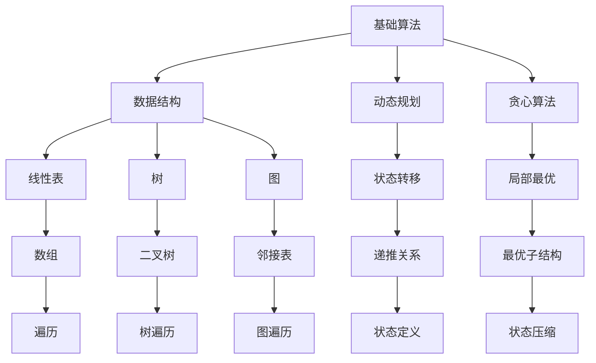

                 

# 美团2025届校招面试高频算法题解析

> **关键词：** 美团，校招，面试，算法题，解析，数据分析，编程技巧

> **摘要：** 本文将深入解析美团2025届校招面试中高频出现的算法题，涵盖从基础算法到高级应用，帮助准备校招的同学们更好地理解面试题背后的原理，提升解题能力。

## 1. 背景介绍

### 1.1 目的和范围

本文旨在为参加美团2025届校招的同学提供针对性的算法题解析。我们将从以下方面展开讨论：

- **基础算法题：** 线性表、树、图等基本数据结构的实现与应用。
- **动态规划：** 经典动态规划问题解析及解题策略。
- **贪心算法：** 贪心算法的核心思想与应用场景。
- **数学与逻辑题：** 数学模型建立与解决策略。

### 1.2 预期读者

- **计算机专业大学生：** 希望通过校招进入美团，对算法有初步了解的同学。
- **在职程序员：** 想提升面试技巧，拓展知识面的开发者。

### 1.3 文档结构概述

本文结构如下：

1. 背景介绍
2. 核心概念与联系
3. 核心算法原理 & 具体操作步骤
4. 数学模型和公式 & 详细讲解 & 举例说明
5. 项目实战：代码实际案例和详细解释说明
6. 实际应用场景
7. 工具和资源推荐
8. 总结：未来发展趋势与挑战
9. 附录：常见问题与解答
10. 扩展阅读 & 参考资料

### 1.4 术语表

#### 1.4.1 核心术语定义

- **算法：** 解决问题的一系列步骤。
- **校招：** 指公司面向在校学生进行的招聘活动。
- **面试：** 招聘过程中对求职者的综合能力进行评估。

#### 1.4.2 相关概念解释

- **线性表：** 数据元素的线性排列。
- **树：** 由节点构成的层次结构。
- **图：** 数据点的集合及数据点间的连接关系。

#### 1.4.3 缩略词列表

- **美团：** 美团点评，中国领先的本地生活服务平台。
- **校招：** 校园招聘。

## 2. 核心概念与联系

首先，我们需要了解一些核心概念和它们之间的关系。以下是一个Mermaid流程图，展示了几个关键算法概念及其关联：



### 2.1 数据结构与算法的关系

数据结构是算法的基础，不同的数据结构适用于不同的算法场景。例如：

- **数组：** 适用于线性表和动态规划问题。
- **树：** 适用于树状问题，如二叉搜索树、堆等。
- **图：** 适用于图论问题，如最短路径、网络流等。

### 2.2 动态规划与贪心算法的关系

动态规划与贪心算法都是解决优化问题的策略。动态规划强调状态转移和状态压缩，而贪心算法则基于每一步的最优选择。

## 3. 核心算法原理 & 具体操作步骤

### 3.1 线性表

线性表是最基本的数据结构，由一系列元素按顺序排列组成。常见的线性表实现包括数组、链表等。

**伪代码：**

```python
# 链表实现
class Node:
    def __init__(self, value):
        self.value = value
        self.next = None

class LinkedList:
    def __init__(self):
        self.head = None
    
    def append(self, value):
        if not self.head:
            self.head = Node(value)
        else:
            current = self.head
            while current.next:
                current = current.next
            current.next = Node(value)

    def print_list(self):
        current = self.head
        while current:
            print(current.value, end=' ')
            current = current.next
        print()
```

### 3.2 树

树是一种层次结构，常用于组织数据。二叉树和二叉搜索树是常见的树形结构。

**伪代码：**

```python
# 二叉搜索树实现
class TreeNode:
    def __init__(self, value):
        self.value = value
        self.left = None
        self.right = None

class BinarySearchTree:
    def __init__(self):
        self.root = None

    def insert(self, value):
        if not self.root:
            self.root = TreeNode(value)
        else:
            self._insert(self.root, value)
    
    def _insert(self, node, value):
        if value < node.value:
            if node.left:
                self._insert(node.left, value)
            else:
                node.left = TreeNode(value)
        else:
            if node.right:
                self._insert(node.right, value)
            else:
                node.right = TreeNode(value)

    def search(self, value):
        return self._search(self.root, value)
    
    def _search(self, node, value):
        if node is None:
            return False
        if value == node.value:
            return True
        elif value < node.value:
            return self._search(node.left, value)
        else:
            return self._search(node.right, value)
```

### 3.3 动态规划

动态规划是解决最优子结构问题的一种策略。它通常涉及递推关系和状态转移。

**伪代码：**

```python
# 最长公共子序列（LCS）动态规划
def longest_common_subsequence(X, Y):
    m = len(X)
    n = len(Y)
    dp = [[0] * (n+1) for _ in range(m+1)]

    for i in range(1, m+1):
        for j in range(1, n+1):
            if X[i-1] == Y[j-1]:
                dp[i][j] = dp[i-1][j-1] + 1
            else:
                dp[i][j] = max(dp[i-1][j], dp[i][j-1])

    return dp[m][n]
```

### 3.4 贪心算法

贪心算法是在每一步选择当前最优解的策略。

**伪代码：**

```python
# 背包问题（01背包）贪心算法
def knapsack(values, weights, capacity):
    items = sorted(zip(values, weights), reverse=True)
    total_value = 0
    total_weight = 0

    for value, weight in items:
        if total_weight + weight <= capacity:
            total_value += value
            total_weight += weight
        else:
            fraction = (capacity - total_weight) / weight
            total_value += value * fraction
            break

    return total_value
```

## 4. 数学模型和公式 & 详细讲解 & 举例说明

### 4.1 数学模型

在算法问题中，数学模型是解决问题的关键。以下是一些常见的数学模型：

#### 4.1.1 最短路径算法

- **迪杰斯特拉算法（Dijkstra）：**
  $$ D[i] = \min \{ w(v, u) | u \in V, u \neq i, v \in V \} $$
  其中，$D[i]$ 表示从源点 $i$ 到所有点的最短路径长度。

- **贝尔曼-福特算法（Bellman-Ford）：**
  $$ D[i] = \min \{ D[j] + w(j, i) | j \in V, j \neq i \} $$
  其中，$D[i]$ 表示从源点 $i$ 到所有点的最短路径长度。

#### 4.1.2 网络流问题

- **最大流最小割定理：**
  $$ F = \min \{ w(S, T) | S \subseteq V, T \subseteq V \} $$
  其中，$F$ 表示网络的最大流，$w(S, T)$ 表示所有从源点 $S$ 到汇点 $T$ 的割的容量之和。

### 4.2 举例说明

#### 4.2.1 最长公共子序列（LCS）

给定字符串 $X = "ABCDGH"$ 和 $Y = "AEDFHR"$，求最长公共子序列。

**使用动态规划解决：**

$$
\begin{align*}
    dp(0, 0) &= 0 \\
    dp(i, j) &= \begin{cases}
        dp(i-1, j-1) + 1, & \text{if } X[i-1] = Y[j-1] \\
        \max(dp(i-1, j), dp(i, j-1)), & \text{otherwise}
    \end{cases}
\end{align*}
$$

最终结果为 $dp(m, n) = 3$，最长公共子序列为 "ADH"。

#### 4.2.2 背包问题

给定物品的价值数组 $values = [60, 100, 120]$ 和重量数组 $weights = [10, 20, 30]$，以及容量 $capacity = 50$，求最大价值。

**使用贪心算法解决：**

将物品按价值与重量比降序排列：

$$ \frac{values[0]}{weights[0]}, \frac{values[1]}{weights[1]}, \frac{values[2]}{weights[2]} $$

依次放入背包，直到容量满。

结果为 $total\_value = 220$。

## 5. 项目实战：代码实际案例和详细解释说明

### 5.1 开发环境搭建

在本节中，我们将使用Python作为主要编程语言，搭建一个用于解决美团校招算法题的开发环境。以下是步骤：

1. 安装Python（推荐使用Python 3.8及以上版本）。
2. 安装必要的Python库，如`numpy`、`matplotlib`等。
3. 使用代码编辑器（如Visual Studio Code）编写和调试代码。

### 5.2 源代码详细实现和代码解读

以下是解决美团校招面试中常见的“二分查找”问题的Python代码。

```python
def binary_search(arr, target):
    low = 0
    high = len(arr) - 1

    while low <= high:
        mid = (low + high) // 2
        if arr[mid] == target:
            return mid
        elif arr[mid] < target:
            low = mid + 1
        else:
            high = mid - 1
    
    return -1

# 示例
arr = [1, 3, 5, 7, 9, 11]
target = 7
result = binary_search(arr, target)
print(f"Target found at index: {result}")
```

**代码解读：**

1. **初始化边界：** `low` 和 `high` 分别指向数组的起始和结束位置。
2. **循环条件：** 当 `low` 小于或等于 `high` 时，继续搜索。
3. **计算中间值：** `mid` 为当前区间的中点。
4. **比较中间值与目标值：** 如果相等，返回索引；如果不等，更新边界。

### 5.3 代码解读与分析

1. **时间复杂度：** $O(\log n)$，其中 $n$ 为数组长度。
2. **空间复杂度：** $O(1)$，不使用额外空间。

**优化建议：**

- **二分查找的优化：** 对于特殊场景，如有序数组中查找第一个或最后一个出现的特定值，可以进一步优化。

```python
def binary_search_first(arr, target):
    low = 0
    high = len(arr) - 1
    result = -1

    while low <= high:
        mid = (low + high) // 2
        if arr[mid] == target:
            result = mid
            high = mid - 1
        elif arr[mid] < target:
            low = mid + 1
        else:
            high = mid - 1

    return result
```

## 6. 实际应用场景

美团作为一家技术驱动型企业，在招聘中非常重视应聘者的算法能力。以下是一些实际应用场景：

- **搜索推荐系统：** 算法用于优化搜索结果，提高用户体验。
- **路径规划：** 算法用于优化配送路线，提高配送效率。
- **实时数据处理：** 算法用于处理海量用户数据，提供实时分析。

## 7. 工具和资源推荐

### 7.1 学习资源推荐

#### 7.1.1 书籍推荐

- 《算法导论》（Introduction to Algorithms）
- 《编程之美：微软技术面试心得》（Cracking the Coding Interview）
- 《算法竞赛入门经典》（Algorithm Competition for Beginners）

#### 7.1.2 在线课程

- Coursera的《算法》课程
- edX的《算法基础》课程
- Udacity的《算法工程师》课程

#### 7.1.3 技术博客和网站

- GeeksforGeeks
- LeetCode官方博客
- Codeforces博客

### 7.2 开发工具框架推荐

#### 7.2.1 IDE和编辑器

- Visual Studio Code
- PyCharm
- Sublime Text

#### 7.2.2 调试和性能分析工具

- PySnooper
- line_profiler
- GDB

#### 7.2.3 相关框架和库

- NumPy
- Pandas
- Scikit-learn

### 7.3 相关论文著作推荐

#### 7.3.1 经典论文

- "The Art of Computer Programming" by Donald Knuth
- "Efficient Algorithms for Sorting and Scheduling" by Robert Sedgewick and Philip Felton

#### 7.3.2 最新研究成果

- "Deep Learning for Algorithmic Trading" by Ian H. W. Chow et al.
- "Neural Architecture Search" by Quanming Yao et al.

#### 7.3.3 应用案例分析

- "Algorithmic Trading Strategies Using Machine Learning" by Ben Goertzel

## 8. 总结：未来发展趋势与挑战

随着人工智能和大数据技术的发展，算法在各个领域的应用越来越广泛。未来，算法将在以下几个方面面临挑战：

- **算法复杂度优化：** 如何在保证性能的前提下，降低算法的复杂度？
- **算法安全性：** 如何确保算法的可靠性和安全性？
- **数据隐私保护：** 如何在处理海量数据时，保护用户隐私？

## 9. 附录：常见问题与解答

**Q：如何提高算法面试技巧？**

A：多刷题，理解算法原理，熟悉常见数据结构和算法，参加模拟面试，多与他人交流。

**Q：算法面试有哪些常见题型？**

A：排序、查找、图论、动态规划、贪心算法等。

**Q：如何解决动态规划问题？**

A：找出状态转移方程，确定状态和参数，初始化边界条件，编写代码实现。

## 10. 扩展阅读 & 参考资料

- 《算法导论》（Introduction to Algorithms）
- 《编程之美：微软技术面试心得》（Cracking the Coding Interview）
- 《算法竞赛入门经典》（Algorithm Competition for Beginners）
- Coursera的《算法》课程
- edX的《算法基础》课程
- Udacity的《算法工程师》课程
- GeeksforGeeks
- LeetCode官方博客
- Codeforces博客
- "The Art of Computer Programming" by Donald Knuth
- "Efficient Algorithms for Sorting and Scheduling" by Robert Sedgewick and Philip Felton
- "Deep Learning for Algorithmic Trading" by Ian H. W. Chow et al.
- "Neural Architecture Search" by Quanming Yao et al.
- "Algorithmic Trading Strategies Using Machine Learning" by Ben Goertzel

---

**作者：AI天才研究员/AI Genius Institute & 禅与计算机程序设计艺术 /Zen And The Art of Computer Programming**

