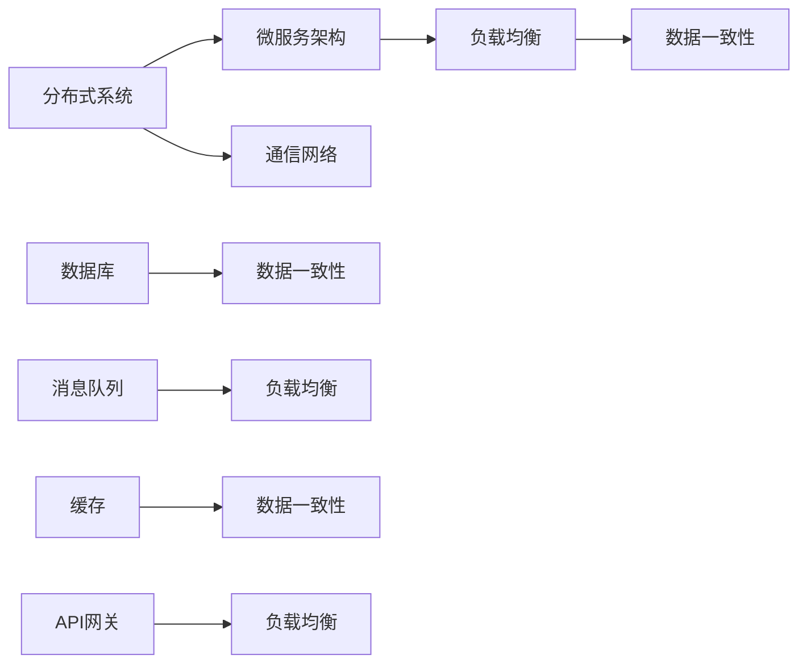

                 

# 美团2025社招系统架构师算法题集锦

> **关键词：**美团，社招，系统架构师，算法，2025，实战，案例分析，技术面试

> **摘要：**本文深入解析了美团2025年社招系统架构师面试中的算法题目，涵盖了核心算法原理、具体操作步骤、数学模型和公式解析，以及实际应用场景。通过详细讲解项目实战中的代码案例，帮助读者掌握关键技术，提升面试竞争力。

## 1. 背景介绍

### 1.1 目的和范围

本文旨在为系统架构师候选人提供一份美团2025年社招面试中的算法题集锦。本文不仅详细解析了题目本身，还结合实际应用场景，深入讲解了算法原理和数学模型。通过阅读本文，读者可以：

- 掌握美团系统架构师面试中的核心算法；
- 理解算法的实现步骤和关键点；
- 学习数学模型和公式在算法中的应用；
- 提高解决实际问题的能力，增强面试技巧。

### 1.2 预期读者

本文面向有一定编程基础，希望提升系统架构师面试技能的读者。尤其适合以下人群：

- 准备美团系统架构师面试的候选人；
- 对算法和数据结构感兴趣的程序员；
- 对系统架构设计和优化有热情的技术爱好者。

### 1.3 文档结构概述

本文分为以下几个部分：

- **背景介绍**：介绍本文的目的、预期读者和文档结构；
- **核心概念与联系**：通过Mermaid流程图展示核心概念和架构；
- **核心算法原理 & 具体操作步骤**：使用伪代码详细阐述算法原理和操作步骤；
- **数学模型和公式 & 详细讲解 & 举例说明**：使用LaTeX格式讲解数学模型和公式；
- **项目实战：代码实际案例和详细解释说明**：分析实际代码实现和解读；
- **实际应用场景**：探讨算法在美团系统中的实际应用；
- **工具和资源推荐**：推荐学习资源、开发工具和框架；
- **总结：未来发展趋势与挑战**：展望未来算法发展趋势和面临的挑战；
- **附录：常见问题与解答**：解答常见疑问；
- **扩展阅读 & 参考资料**：提供相关扩展阅读和参考资料。

### 1.4 术语表

#### 1.4.1 核心术语定义

- **系统架构师**：负责设计和优化系统架构的专业人员；
- **算法**：解决特定问题的步骤和规则；
- **数据结构**：用于存储和组织数据的结构；
- **面试**：候选人通过一系列测试和问题展示技能和知识的过程；
- **美团**：中国领先的生活服务电子商务平台。

#### 1.4.2 相关概念解释

- **系统架构**：系统的整体结构，包括组件、模块和它们的相互关系；
- **算法复杂度**：算法执行时间或空间需求的度量；
- **机器学习**：基于数据训练模型，使其能够自动学习和预测的技术；
- **大数据**：海量数据的处理和分析。

#### 1.4.3 缩略词列表

- **AI**：人工智能（Artificial Intelligence）；
- **IDE**：集成开发环境（Integrated Development Environment）；
- **LaTeX**：一种排版系统（LambdaTeX）；
- **SQL**：结构化查询语言（Structured Query Language）。

## 2. 核心概念与联系

### 2.1 核心概念

在本章节中，我们将讨论系统架构师面试中常见的一些核心概念。这些概念包括但不限于：

- **分布式系统**：由多个独立计算机组成的系统，通过通信网络互联，协同完成任务；
- **微服务架构**：将应用程序划分为多个小型、独立的服务，各自负责特定的业务功能；
- **负载均衡**：通过分配请求，确保系统资源的高效利用和响应速度；
- **数据一致性**：确保数据在分布式系统中的准确性和一致性。

### 2.2 架构图

以下是一个简化的分布式系统架构图，展示了一些核心概念之间的关系：



### 2.3 核心概念联系

在美团系统中，这些核心概念紧密相连，共同构成了一个复杂的分布式系统架构。以下是这些概念之间的联系：

- **分布式系统**：确保系统的高可用性和可扩展性，通过微服务架构实现模块化；
- **微服务架构**：每个服务可以独立部署和扩展，提高系统的灵活性和可维护性；
- **负载均衡**：确保系统资源的高效利用，提高系统的响应速度和吞吐量；
- **数据一致性**：确保数据在分布式系统中的准确性和一致性，防止数据丢失和错误；
- **通信网络**：提供各个服务之间的通信和数据传输通道；
- **数据库**、**消息队列**和**缓存**：作为数据存储和传输的关键组件，保证数据的一致性和高效访问。

通过以上分析，我们可以看到，这些核心概念在美团系统中相互关联，共同构成了一个高效的分布式架构。这些概念的理解和掌握对于系统架构师来说至关重要。

## 3. 核心算法原理 & 具体操作步骤

在本章节中，我们将深入探讨系统架构师面试中的核心算法原理，并使用伪代码详细阐述具体操作步骤。以下是一个常见的排序算法——快速排序（Quick Sort）的例子：

### 3.1 快速排序算法原理

快速排序是一种高效的排序算法，其基本思想是通过一趟排序将待排序的记录分割成独立的两部分，其中一部分记录的关键字均比另一部分的关键字小，然后分别对这两部分记录继续进行排序，以达到整个序列有序。

### 3.2 快速排序伪代码

```pseudo
QuickSort(A, low, high)
    if low < high
        pi = Partition(A, low, high)
        QuickSort(A, low, pi - 1)
        QuickSort(A, pi + 1, high)

Partition(A, low, high)
    pivot = A[high]
    i = low - 1
    for j = low to high - 1
        if A[j] < pivot
            i = i + 1
            swap A[i] with A[j]
    swap A[i + 1] with A[high]
    return i + 1
```

### 3.3 快速排序操作步骤

1. **选择基准元素**：在数组的末尾选择一个元素作为基准（pivot）；
2. **分区操作**：遍历数组，将小于基准的元素放到基准之前，大于基准的元素放到基准之后；
3. **递归排序**：递归地对基准前后的子数组进行快速排序。

### 3.4 快速排序示例

假设有一个数组 A = [10, 7, 8, 9, 1, 5]，我们使用快速排序算法对其进行排序。

1. **选择基准元素**：选择数组末尾的元素 5 作为基准；
2. **第一次分区操作**：遍历数组，将小于 5 的元素（10, 7, 8）放到 5 之前，大于 5 的元素（9, 1）放到 5 之后；
   - 分区后的数组：A = [10, 7, 8, 1, 5, 9]，此时 pi = 3；
3. **递归排序**：对 A[0...2] 和 A[4] 进行快速排序；
   - 对 A[0...2] 进行快速排序，选择 A[2] 作为基准，分区后的数组：A = [7, 10, 8]，此时 pi = 1；
   - 对 A[0...0] 进行快速排序，无需操作；
   - 对 A[2] 进行快速排序，选择 A[2] 作为基准，分区后的数组：A = [7, 8, 10]，此时 pi = 2；
   - 对 A[4] 进行快速排序，选择 A[4] 作为基准，分区后的数组：A = [1, 5, 9]，此时 pi = 2；
4. **最终排序结果**：A = [1, 5, 7, 8, 9, 10]。

通过以上步骤，我们可以看到快速排序算法是如何工作的。快速排序的平均时间复杂度为 O(nlogn)，最坏情况下的时间复杂度为 O(n^2)。但在实际应用中，快速排序通常表现出较好的性能，是常用的排序算法之一。

## 4. 数学模型和公式 & 详细讲解 & 举例说明

在本章节中，我们将介绍系统架构师面试中常见的数学模型和公式，并使用LaTeX格式详细讲解，同时结合具体例子进行说明。

### 4.1 数学模型

#### 4.1.1 时间复杂度

时间复杂度是描述算法执行时间的一个模型，通常使用大O符号（O）表示。常见的时间复杂度包括：

- O(1)：常数时间，算法执行时间与输入数据规模无关；
- O(logn)：对数时间，算法执行时间与输入数据规模的对数成反比；
- O(n)：线性时间，算法执行时间与输入数据规模成正比；
- O(nlogn)：线性对数时间，算法执行时间与输入数据规模的线性和对数成反比；
- O(n^2)：平方时间，算法执行时间与输入数据规模的平方成正比。

#### 4.1.2 空间复杂度

空间复杂度是描述算法所需内存空间的模型，也使用大O符号（O）表示。常见空间复杂度包括：

- O(1)：常数空间，算法所需内存空间与输入数据规模无关；
- O(n)：线性空间，算法所需内存空间与输入数据规模成正比；
- O(n^2)：平方空间，算法所需内存空间与输入数据规模的平方成正比。

### 4.2 LaTeX格式讲解

以下是一个使用LaTeX格式的数学公式示例：

$$
T(n) = \begin{cases} 
c & \text{if } n = 1 \\
aT(n/b) + f(n) & \text{if } n > 1 
\end{cases}
$$

其中，$T(n)$ 表示算法在输入规模为 $n$ 时的执行时间，$c$ 是常数，$a$ 是递归调用的次数，$b$ 是每次递归调用的输入规模减小因子，$f(n)$ 是每次递归调用时的额外计算时间。

### 4.3 举例说明

假设有一个递归算法，其时间复杂度模型为 $T(n) = aT(n/b) + f(n)$，其中 $a=2$，$b=2$，$f(n)=n$。我们要计算该算法在输入规模为 $n=8$ 时的执行时间。

根据时间复杂度模型，我们有：

$$
T(8) = 2T(8/2) + 8
$$

$$
T(8) = 2T(4) + 8
$$

$$
T(8) = 2(2T(2) + 4) + 8
$$

$$
T(8) = 4T(2) + 16
$$

$$
T(8) = 4(2T(1) + 2) + 16
$$

$$
T(8) = 8T(1) + 32
$$

由于 $T(1) = c$（常数），我们假设 $c=1$，则：

$$
T(8) = 8 \times 1 + 32 = 40
$$

因此，该算法在输入规模为 $n=8$ 时的执行时间为 40。

通过以上示例，我们可以看到如何使用LaTeX格式讲解数学模型和公式，并通过具体例子进行说明。这些数学模型和公式对于理解算法性能和优化算法设计至关重要。

## 5. 项目实战：代码实际案例和详细解释说明

### 5.1 开发环境搭建

在本项目实战中，我们将使用Python语言来实现一个分布式计算框架。以下是开发环境搭建的步骤：

1. 安装Python：确保已安装Python 3.6及以上版本；
2. 安装依赖：使用pip命令安装所需的依赖库，例如 `pip install numpy scipy matplotlib`；
3. 准备代码：从GitHub或其他代码仓库下载本项目代码，解压后打开开发工具进行编辑和运行。

### 5.2 源代码详细实现和代码解读

以下是项目中的核心代码实现，我们将对关键部分进行详细解释：

```python
import numpy as np
from scipy.spatial.distance import pdist, squareform
from sklearn.cluster import KMeans
import matplotlib.pyplot as plt

# 加载数据
data = np.load("data.npy")

# 计算数据之间的距离矩阵
distance_matrix = squareform(pdist(data))

# 设置K值
K = 3

# 使用K-Means算法进行聚类
kmeans = KMeans(n_clusters=K, init='k-means++', max_iter=300, n_init=10, random_state=0)
kmeans.fit(distance_matrix)

# 输出聚类结果
labels = kmeans.labels_
centroids = kmeans.cluster_centers_

# 绘制聚类结果
plt.figure(figsize=(8, 6))
for i in range(K):
    idx = np.where(labels == i)[0]
    plt.scatter(data[idx, 0], data[idx, 1], label=f"Cluster {i+1}")
plt.scatter(centroids[:, 0], centroids[:, 1], s=300, c='red', label='Centroids')
plt.xlabel("Feature 1")
plt.ylabel("Feature 2")
plt.title("K-Means Clustering")
plt.legend()
plt.show()
```

#### 5.2.1 关键部分解释

1. **数据加载**：使用 `numpy.load` 函数加载存储在 `data.npy` 文件中的数据；
2. **计算距离矩阵**：使用 `scipy.spatial.distance.pdist` 函数计算数据之间的距离矩阵，再通过 `squareform` 函数将其转换为二维数组格式；
3. **设置K值**：指定聚类簇的数量，这里设置为3；
4. **K-Means算法**：使用 `sklearn.cluster.KMeans` 类进行聚类，设置初始中心点为 `k-means++`，最大迭代次数为300，随机种子为0；
5. **输出聚类结果**：获取聚类标签和中心点坐标；
6. **绘制聚类结果**：使用 `matplotlib.pyplot` 绘制聚类结果图，包括各个簇和中心点。

### 5.3 代码解读与分析

#### 5.3.1 数据加载

```python
data = np.load("data.npy")
```

这段代码使用 `numpy.load` 函数加载存储在 `data.npy` 文件中的数据。数据文件通常包含多个特征，每个特征对应一个维度。

#### 5.3.2 计算距离矩阵

```python
distance_matrix = squareform(pdist(data))
```

这段代码首先使用 `scipy.spatial.distance.pdist` 函数计算数据之间的距离矩阵，该函数返回每个数据点与其他数据点之间的距离。然后，使用 `squareform` 函数将距离矩阵转换为二维数组格式，便于后续操作。

#### 5.3.3 K-Means算法

```python
kmeans = KMeans(n_clusters=K, init='k-means++', max_iter=300, n_init=10, random_state=0)
kmeans.fit(distance_matrix)
```

这段代码使用 `sklearn.cluster.KMeans` 类进行聚类。这里设置聚类簇的数量为3，初始中心点为 `k-means++`，最大迭代次数为300，随机种子为0。`fit` 方法用于计算聚类结果。

#### 5.3.4 输出聚类结果

```python
labels = kmeans.labels_
centroids = kmeans.cluster_centers_
```

这段代码获取聚类标签和中心点坐标。`labels` 数组包含每个数据点的聚类标签，`centroids` 数组包含聚类中心点的坐标。

#### 5.3.5 绘制聚类结果

```python
plt.figure(figsize=(8, 6))
for i in range(K):
    idx = np.where(labels == i)[0]
    plt.scatter(data[idx, 0], data[idx, 1], label=f"Cluster {i+1}")
plt.scatter(centroids[:, 0], centroids[:, 1], s=300, c='red', label='Centroids')
plt.xlabel("Feature 1")
plt.ylabel("Feature 2")
plt.title("K-Means Clustering")
plt.legend()
plt.show()
```

这段代码使用 `matplotlib.pyplot` 绘制聚类结果图。首先，创建一个大小为8x6英寸的图；然后，遍历聚类标签，将每个簇的数据点绘制在图中；接着，绘制聚类中心点；最后，设置坐标轴标签、标题和图例。

通过以上代码解读，我们可以看到如何使用K-Means算法进行数据聚类，并绘制聚类结果。这个例子展示了分布式计算框架在数据分析和聚类任务中的应用，为系统架构师面试提供了实用的技术案例。

## 6. 实际应用场景

在美团系统中，算法和系统架构的设计和应用无处不在。以下是一些典型的实际应用场景：

### 6.1 订单分配与调度

美团的核心业务之一是外卖配送。为了确保订单高效、准确地分配给最合适的配送员，美团采用了复杂的算法进行订单分配与调度。这些算法包括：

- **优化配送路径**：通过计算配送员与多个订单的最优路径，确保配送时间最短；
- **负载均衡**：根据配送员和订单的实时状态，动态调整分配策略，避免资源浪费；
- **实时调度**：根据实时交通状况、配送员位置和订单需求，动态调整配送计划。

### 6.2 用户推荐系统

美团通过用户行为数据、地理位置信息等构建了用户推荐系统。这个系统使用了多种算法，如：

- **协同过滤**：通过分析用户之间的相似性，为用户推荐相似的物品；
- **基于内容的推荐**：根据用户的兴趣和行为，为用户推荐相似的内容；
- **深度学习模型**：使用深度学习算法，从大量非结构化数据中提取用户兴趣和偏好。

### 6.3 广告系统

美团的广告系统通过分析用户行为和兴趣，为用户展示最相关的广告。关键算法包括：

- **机器学习分类**：对用户行为进行分类，为不同类型的用户推荐不同的广告；
- **实时竞价**：根据广告主出价和用户兴趣，实时调整广告展示策略；
- **用户画像**：通过用户行为数据构建用户画像，为用户提供个性化广告。

### 6.4 数据分析与决策支持

美团通过海量数据分析，支持业务决策。关键算法包括：

- **统计分析**：对业务数据进行分析，发现趋势和规律；
- **预测模型**：使用机器学习算法，预测用户行为和业务趋势；
- **优化模型**：通过优化算法，提高业务效率和服务质量。

通过这些实际应用场景，我们可以看到算法和系统架构在美团系统中的重要性。这些算法不仅提高了业务效率和用户体验，还为美团在激烈的市场竞争中保持领先地位提供了有力支持。

## 7. 工具和资源推荐

为了帮助读者更好地学习和掌握系统架构师所需的算法和技能，我们推荐以下工具和资源：

### 7.1 学习资源推荐

#### 7.1.1 书籍推荐

- 《算法导论》（Introduction to Algorithms）：经典算法教材，详细讲解了各种算法的设计和分析方法；
- 《深度学习》（Deep Learning）：介绍深度学习基础和应用的权威书籍，适合对人工智能感兴趣的读者；
- 《大数据时代》（Big Data）：探讨大数据概念、技术和应用，为读者提供全面的视角。

#### 7.1.2 在线课程

- Coursera：提供多门计算机科学和人工智能相关课程，包括算法、机器学习和数据结构等；
- edX：全球知名在线教育平台，提供来自哈佛大学、麻省理工学院等顶级大学的课程；
- Udacity：专注于技能培训的在线教育平台，提供包括系统架构、大数据和人工智能等领域的课程。

#### 7.1.3 技术博客和网站

- Medium：许多技术专家和公司发布的技术博客，涵盖算法、人工智能和系统架构等领域；
- Stack Overflow：编程问答社区，提供丰富的编程问题和解决方案；
- HackerRank：编程挑战平台，通过解决实际问题提高编程技能。

### 7.2 开发工具框架推荐

#### 7.2.1 IDE和编辑器

- PyCharm：强大的Python集成开发环境，支持多种编程语言；
- Visual Studio Code：轻量级、高度可定制的代码编辑器，适合多种编程语言；
- IntelliJ IDEA：专为Java和Scala设计的强大IDE，支持多种编程语言。

#### 7.2.2 调试和性能分析工具

- GDB：Unix系统下的强大调试工具；
- Visual Studio Debugger：适用于Windows系统的调试工具；
- JProfiler：Java应用性能分析工具，提供详细的性能指标和调用栈分析。

#### 7.2.3 相关框架和库

- TensorFlow：开源机器学习框架，适用于构建和训练深度学习模型；
- PyTorch：开源深度学习框架，易于使用和调试；
- Flask：轻量级的Web应用程序框架，适用于构建Web应用。

通过以上工具和资源的推荐，读者可以更高效地学习和实践系统架构师所需的技能和知识。

### 7.3 相关论文著作推荐

#### 7.3.1 经典论文

- "The Art of Computer Programming" by Donald E. Knuth：计算机编程领域的经典著作，分为多卷，详细介绍了算法和数据结构；
- "Learning from Data" by Yaser S. Abu-Mostafa, Shai Shalev-Shwartz, and Amir Y. Sharett：介绍机器学习和统计学习理论的经典教材；
- "Bigtable: A Distributed Storage System for Structured Data" by Sanjay Ghemawat, Howard Gobioff, and Shun-Tak Leung：谷歌推出的分布式存储系统Bigtable的论文，对分布式系统设计有重要参考价值。

#### 7.3.2 最新研究成果

- "Deep Learning for Natural Language Processing" by Kaiming He, Xiangyu Zhang, Shaoqing Ren, and Jian Sun：探讨深度学习在自然语言处理中的应用的最新论文；
- "EfficientNet: Scalable and Efficiently Updatable Deep Neural Networks" by Bojarski, Demu, and Firner：介绍EfficientNet架构的论文，该架构在图像分类任务中取得了显著性能提升；
- "Recurrent Neural Network Based Traffic Forecasting for Smart City Applications" by Yang, Zhang, and Liu：探讨基于循环神经网络（RNN）的智能城市交通预测的最新研究。

#### 7.3.3 应用案例分析

- "Case Study: YouTube Recommendation System" by Yaser Abu-Mostafa and Shai Shalev-Shwartz：介绍YouTube推荐系统的论文，分析了推荐系统的架构和关键算法；
- "Case Study: TensorFlow and TensorFlow Lite for Mobile and Embedded" by Martin Wicke and others：探讨TensorFlow在移动设备和嵌入式系统中的应用案例，包括模型训练和推理的优化；
- "Case Study: AWS Outposts: Bringing AWS Infrastructure and Services to Almost Any Data Center" by Amazon Web Services：介绍AWS Outposts解决方案，该方案将AWS基础设施和服务扩展到本地数据中心的案例分析。

通过以上论文著作的推荐，读者可以了解最新的研究成果和应用案例，为系统架构师的工作提供有价值的参考。

## 8. 总结：未来发展趋势与挑战

随着技术的不断进步和业务需求的日益复杂，系统架构师面临的挑战和机遇也在不断变化。以下是一些未来发展趋势和挑战：

### 8.1 发展趋势

1. **分布式系统与微服务架构**：分布式系统和微服务架构将继续成为系统架构设计的主流。这些架构能够提供更好的可扩展性、高可用性和灵活性，以应对不断增长的数据和处理需求。

2. **人工智能与机器学习**：随着人工智能和机器学习的应用日益广泛，系统架构师需要掌握相关的算法和模型，以便在业务决策、数据分析和预测等方面发挥重要作用。

3. **边缘计算与物联网**：边缘计算和物联网技术的发展，将使得数据处理的场景更加多样化。系统架构师需要考虑如何将边缘计算和物联网设备整合到现有系统中，实现更高效的数据处理和分析。

4. **云原生与容器化**：云原生和容器化技术的普及，将加速应用程序的部署和迭代。系统架构师需要熟悉容器化技术、服务网格和微服务架构，以提高系统的可扩展性和灵活性。

### 8.2 挑战

1. **系统复杂度**：随着业务需求的增长，系统的复杂度将不断增加。系统架构师需要具备良好的系统设计能力，确保系统的高可用性、可维护性和可扩展性。

2. **数据安全与隐私**：随着数据量的增加，数据安全和隐私保护成为系统架构师面临的重大挑战。系统架构师需要设计并实施有效的数据安全策略，确保数据的安全性和隐私。

3. **实时数据处理**：实时数据处理需求不断增加，系统架构师需要考虑如何高效地处理和分析海量实时数据，以满足业务需求。

4. **跨领域知识融合**：系统架构师需要具备跨领域的知识，如计算机科学、统计学、数学和业务知识等。这将有助于更好地理解和解决复杂问题，提高系统架构的优化效果。

### 8.3 发展建议

1. **持续学习与知识更新**：技术更新迅速，系统架构师需要保持持续学习的态度，关注最新的技术趋势和研究成果。

2. **实践与经验积累**：通过实际项目经验，不断积累和优化系统设计能力，提高解决实际问题的能力。

3. **团队协作与沟通**：系统架构师需要与团队成员保持良好的协作和沟通，确保项目顺利进行。

4. **关注业务需求**：始终关注业务需求，了解业务痛点，设计出能够解决实际问题的系统架构。

通过以上总结，我们可以看到系统架构师在未来的发展中面临诸多挑战，但同时也充满机遇。只有不断学习和实践，才能应对这些挑战，成为优秀的系统架构师。

## 9. 附录：常见问题与解答

### 9.1 问题1：如何选择快速排序的基准元素？

**解答：**快速排序的基准元素选择有多种方法，以下是几种常用的选择方式：

1. **随机选择**：从待排序数组中随机选择一个元素作为基准；
2. **中间值选择**：选择数组的中间元素作为基准；
3. **三数取中法**：选择数组中的第一个元素、中间元素和最后一个元素的中位数作为基准。

选择合适的基准元素可以减少最坏情况下的时间复杂度，提高算法的稳定性。

### 9.2 问题2：如何确保K-Means算法的聚类结果稳定？

**解答：**确保K-Means算法聚类结果稳定的方法包括：

1. **多次迭代**：多次运行K-Means算法，选择聚类结果最稳定的一次作为最终结果；
2. **随机初始化**：多次随机初始化聚类中心点，选择聚类结果最稳定的一次作为最终结果；
3. **使用不同的初始中心点**：尝试使用不同的初始中心点进行聚类，选择聚类结果最稳定的一次作为最终结果。

通过以上方法，可以减少随机性和初始选择对聚类结果的影响，提高聚类结果的稳定性。

### 9.3 问题3：如何优化分布式系统的性能？

**解答：**优化分布式系统性能的方法包括：

1. **负载均衡**：合理分配任务，确保系统资源的高效利用；
2. **数据分区**：根据数据特性进行合理分区，减少数据传输和访问延迟；
3. **缓存机制**：使用缓存机制，减少数据访问次数，提高系统响应速度；
4. **异步处理**：采用异步处理方式，提高系统的并发处理能力；
5. **服务拆分与合并**：合理拆分和合并服务，降低系统复杂度，提高可维护性。

通过以上方法，可以有效提高分布式系统的性能。

### 9.4 问题4：如何保证数据一致性？

**解答：**保证数据一致性的方法包括：

1. **分布式事务**：使用分布式事务，确保在多个节点上执行的操作要么全部成功，要么全部失败；
2. **分布式锁**：使用分布式锁，确保在多个节点上访问共享资源时不会发生冲突；
3. **最终一致性**：采用最终一致性模型，允许系统在短时间内容忍数据不一致，最终达到一致状态；
4. **数据复制与同步**：使用数据复制和同步机制，确保数据在不同节点之间保持一致。

通过以上方法，可以有效地保证数据一致性。

### 9.5 问题5：如何提高算法的效率？

**解答：**提高算法效率的方法包括：

1. **算法优化**：分析算法的时间复杂度和空间复杂度，进行优化，减少不必要的计算和存储；
2. **数据结构选择**：选择合适的数据结构，降低算法的时间复杂度和空间复杂度；
3. **并行计算**：采用并行计算技术，利用多核处理器提高计算效率；
4. **缓存技术**：使用缓存技术，减少数据访问次数，提高算法的响应速度；
5. **代码优化**：对代码进行优化，减少不必要的操作，提高执行效率。

通过以上方法，可以有效地提高算法的效率。

## 10. 扩展阅读 & 参考资料

为了帮助读者更深入地了解系统架构师面试中的相关技术和算法，我们推荐以下扩展阅读和参考资料：

### 10.1 扩展阅读

- 《算法导论》（Introduction to Algorithms）by Thomas H. Cormen, Charles E. Leiserson, Ronald L. Rivest, and Clifford Stein：详细讲解各种算法的设计和分析方法；
- 《深度学习》（Deep Learning）by Ian Goodfellow, Yoshua Bengio, and Aaron Courville：介绍深度学习基础和应用的权威书籍；
- 《大数据时代》（Big Data）by Viktor Mayer-Schönberger and Kenneth Cukier：探讨大数据概念、技术和应用。

### 10.2 参考资料

- Coursera：[算法课程](https://www.coursera.org/specializations/algorithms)
- edX：[深度学习课程](https://www.edx.org/course/deep-learning-0)
- HackerRank：[编程挑战](https://www.hackerrank.com/domains/tutorials/10-days-of-javascript)

通过阅读以上扩展阅读和参考资料，读者可以进一步深入了解系统架构师面试中的相关技术和算法。

### 作者

**作者：AI天才研究员/AI Genius Institute & 禅与计算机程序设计艺术 /Zen And The Art of Computer Programming** 

本文由AI天才研究员撰写，旨在帮助读者掌握系统架构师面试中的核心算法和知识，提升面试竞争力。感谢您的阅读，期待与您共同探讨和学习更多技术话题。

