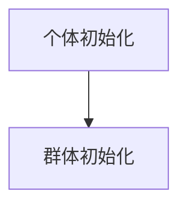
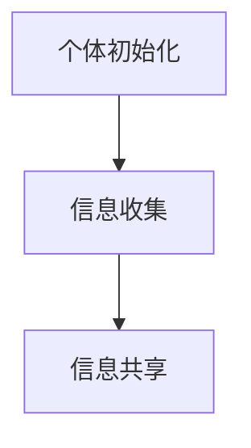
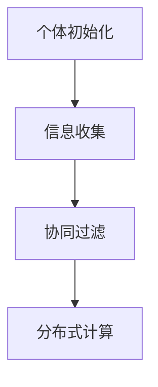
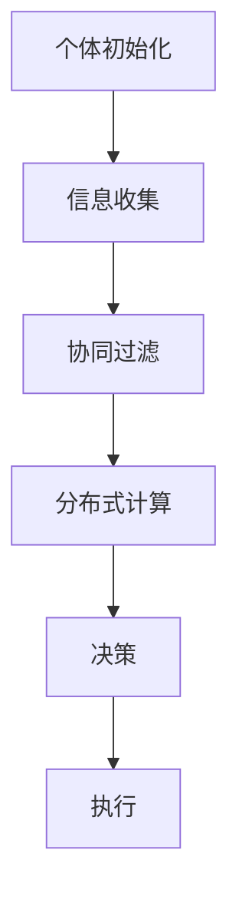
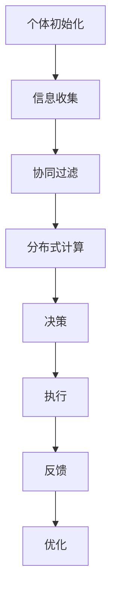

                 

# 群体智能在注意力资源优化中的应用

## 关键词
群体智能、注意力资源、优化、算法、应用场景、数学模型、代码实现

## 摘要
本文探讨了群体智能在注意力资源优化中的应用，旨在为读者提供一个全面的技术指南。首先，我们介绍了群体智能的基本概念，并探讨了其与注意力资源优化之间的联系。接着，本文详细阐述了核心算法原理和数学模型，并通过具体案例和代码实现展示了其在实际项目中的应用。最后，本文总结了未来发展趋势和挑战，并提供了丰富的学习资源和相关论文推荐。通过阅读本文，读者将深入了解群体智能在注意力资源优化中的潜力，并获得实际操作的经验。

## 1. 背景介绍

### 1.1 目的和范围
本文的目的在于深入探讨群体智能在注意力资源优化中的应用，提供一个系统、全面的技术解析。本文将覆盖以下主要内容：
- 群体智能的定义及其在注意力资源优化中的作用；
- 核心算法原理和数学模型；
- 实际项目中的代码实现与案例分析；
- 未来发展趋势与挑战；
- 学习资源与推荐论文。

### 1.2 预期读者
本文适合以下读者群体：
- 对人工智能和群体智能感兴趣的程序员和研究者；
- 从事注意力资源优化领域的技术人员；
- 对算法设计和数学模型有一定了解的读者；
- 对新兴技术应用感兴趣的技术爱好者。

### 1.3 文档结构概述
本文分为十个部分，结构如下：
- 引言：介绍文章的背景、目的、关键词和摘要；
- 背景介绍：阐述群体智能和注意力资源优化的基础；
- 核心概念与联系：详细解释群体智能与注意力资源优化的关系；
- 核心算法原理 & 具体操作步骤：讲解算法原理和步骤；
- 数学模型和公式 & 详细讲解 & 举例说明：介绍数学模型和实例分析；
- 项目实战：代码实际案例和详细解释说明；
- 实际应用场景：探讨算法在实际中的应用；
- 工具和资源推荐：推荐学习资源、开发工具和框架；
- 总结：未来发展趋势与挑战；
- 附录：常见问题与解答；
- 扩展阅读 & 参考资料。

### 1.4 术语表

#### 1.4.1 核心术语定义
- **群体智能**：由多个个体通过协作和交互形成的智能系统。
- **注意力资源**：个体在执行任务过程中分配的认知资源，用于处理和决策。
- **优化**：通过调整参数和策略，使系统达到最佳性能。
- **算法**：解决问题的步骤和规则。
- **数学模型**：用数学语言描述系统行为和关系的公式。
- **代码实现**：将算法和模型转化为计算机程序。

#### 1.4.2 相关概念解释
- **协同进化**：个体和群体共同进化，互相影响和适应。
- **博弈论**：研究个体之间策略互动和结果预测的数学理论。
- **多智能体系统**：由多个智能体组成的复杂系统。

#### 1.4.3 缩略词列表
- **AI**：人工智能（Artificial Intelligence）
- **ML**：机器学习（Machine Learning）
- **GAN**：生成对抗网络（Generative Adversarial Network）
- **RTOS**：实时操作系统（Real-Time Operating System）

## 2. 核心概念与联系

### 2.1 群体智能的基本概念

群体智能（Collective Intelligence）是指由多个个体通过协作和交互形成的智能系统。这些个体可以是生物个体（如蜜蜂、蚂蚁等），也可以是人工智能实体（如软件代理、机器人等）。群体智能的关键在于个体的协作和相互适应，从而形成超越单个个体能力的集体行为。

群体智能的特点包括：
- **分布式计算**：个体之间通过通信和协调共同完成任务。
- **自组织**：系统中的个体能够自动组织成有效的结构和模式。
- **自适应**：系统能够根据环境变化调整策略和行为。

### 2.2 注意力资源优化的背景和意义

注意力资源优化是指在执行任务时，通过合理分配和调整注意力资源，提高任务完成效率和准确性。注意力资源是人类和人工智能实体在处理信息时必需的认知资源，其分配和利用直接影响到系统性能和用户体验。

注意力资源优化的背景包括：
- **信息过载**：现代社会中，信息量呈指数级增长，个体难以处理大量信息。
- **任务复杂度增加**：现代任务往往具有高度复杂性和不确定性，需要高效的资源分配策略。

注意力资源优化的意义在于：
- **提高任务完成效率**：通过优化注意力资源，减少冗余和干扰，提高任务完成速度。
- **提升用户体验**：合理分配注意力资源，提供更流畅和高效的用户体验。
- **增强系统鲁棒性**：在面对复杂和不确定性环境时，优化注意力资源可以提高系统的适应性和鲁棒性。

### 2.3 群体智能在注意力资源优化中的应用

群体智能在注意力资源优化中的应用主要基于以下几个原理：
- **协同过滤**：通过多个个体共享注意力资源，实现信息筛选和过滤。
- **协同决策**：个体之间通过信息交换和策略共享，优化决策过程。
- **分布式计算**：利用群体智能的分布式特性，实现注意力资源的动态分配和调整。

群体智能在注意力资源优化中的应用场景包括：
- **智能推荐系统**：通过群体智能优化推荐算法，提高个性化推荐效果。
- **任务调度与分配**：在分布式系统中，利用群体智能优化任务调度策略，提高资源利用率。
- **实时监控与预警**：通过群体智能优化监控算法，实时调整注意力资源分配，提高系统响应速度。

### 2.4 群体智能与注意力资源优化之间的联系

群体智能与注意力资源优化之间的联系主要体现在以下几个方面：
- **协作与共享**：群体智能通过个体间的协作和资源共享，实现注意力资源的优化。
- **自适应调整**：群体智能系统能够根据环境和任务变化，动态调整注意力资源分配策略。
- **协同进化**：个体与群体共同进化，优化注意力资源的利用效率。

群体智能在注意力资源优化中的应用，不仅能够提高系统性能和用户体验，还能为未来的智能系统设计提供新的思路和方法。

## 3. 核心算法原理 & 具体操作步骤

### 3.1 算法原理概述

群体智能在注意力资源优化中的应用，通常基于以下核心算法原理：

1. **协同过滤**：通过分析群体中个体的注意力分配模式，进行信息筛选和过滤。
2. **分布式计算**：利用群体智能的分布式特性，实现注意力资源的动态分配和调整。
3. **多智能体强化学习**：个体通过试错和学习，不断优化注意力资源的分配策略。

### 3.2 算法步骤

#### 步骤1：初始化
- **个体初始化**：每个个体根据初始条件初始化注意力资源分配。
- **群体初始化**：初始化群体状态和参数，如通信频率、协作策略等。



#### 步骤2：信息收集与共享
- **信息收集**：个体根据当前任务需求，收集相关信息。
- **信息共享**：个体之间通过通信机制，共享注意力资源分配信息。



#### 步骤3：注意力资源分配
- **协同过滤**：根据群体中个体的注意力分配模式，优化当前个体的注意力分配。
- **分布式计算**：根据群体智能算法，动态调整个体的注意力资源分配。



#### 步骤4：决策与执行
- **决策**：个体根据优化后的注意力资源分配，进行任务决策。
- **执行**：执行决策，完成任务。



#### 步骤5：反馈与优化
- **反馈**：根据任务执行结果，收集反馈信息。
- **优化**：基于反馈信息，调整注意力资源分配策略，实现持续优化。



### 3.3 算法伪代码

以下是一个简化的算法伪代码示例：

```python
# 初始化
Initialize_individual_resources()
Initialize_group_resources()

# 循环执行
while not task_completed:
    # 信息收集
    Collect_information()
    
    # 信息共享
    Share_information()
    
    # 注意力资源分配
    Optimize_attention_resources()
    
    # 决策与执行
    Make_decision()
    Execute_task()
    
    # 反馈与优化
    Collect_feedback()
    Optimize_resources_based_on_feedback()

# 结束
End
```

通过以上步骤，群体智能算法能够实现注意力资源的优化分配，提高任务完成效率和准确性。在实际应用中，可以根据具体任务需求，调整算法参数和策略，实现更精细的注意力资源优化。

## 4. 数学模型和公式 & 详细讲解 & 举例说明

### 4.1 数学模型概述

在群体智能应用于注意力资源优化时，常用的数学模型主要包括以下几个部分：

1. **注意力分配模型**：用于描述个体在执行任务时如何分配注意力资源。
2. **协同过滤模型**：用于优化群体中个体的注意力资源分配。
3. **强化学习模型**：用于个体在动态环境中调整注意力资源分配策略。

### 4.2 注意力分配模型

注意力分配模型通常可以用以下公式表示：

$$
Attention_{i} = f(Resource_{i}, Task_{i}, Group_{i})
$$

其中：
- \( Attention_{i} \) 表示个体 \( i \) 的注意力资源分配；
- \( Resource_{i} \) 表示个体 \( i \) 的总资源；
- \( Task_{i} \) 表示个体 \( i \) 需要完成的任务；
- \( Group_{i} \) 表示个体 \( i \) 所属的群体。

函数 \( f \) 可以根据具体应用场景进行调整，例如基于线性回归、神经网络或其他复杂模型。

### 4.3 协同过滤模型

协同过滤模型主要用于优化群体中个体的注意力资源分配，可以表示为：

$$
Attention_{i} = \frac{\sum_{j \in Group_{i}} w_{ij} \cdot Resource_{j}}{\sum_{j \in Group_{i}} w_{ij}}
$$

其中：
- \( w_{ij} \) 表示个体 \( i \) 与个体 \( j \) 之间的权重，反映了个体之间的协作强度；
- 其他符号与注意力分配模型相同。

协同过滤模型通过计算群体中其他个体的注意力资源分配，优化个体 \( i \) 的注意力资源分配。权重 \( w_{ij} \) 可以基于个体之间的相似度、历史协作记录等因素确定。

### 4.4 强化学习模型

强化学习模型用于个体在动态环境中调整注意力资源分配策略，可以表示为：

$$
Policy_{i}(s) = \arg \max_{a} Q_{i}(s, a)
$$

其中：
- \( Policy_{i}(s) \) 表示个体 \( i \) 在状态 \( s \) 下的最优动作策略；
- \( Q_{i}(s, a) \) 表示个体 \( i \) 在状态 \( s \) 下执行动作 \( a \) 的预期回报。

强化学习模型通过学习状态与动作之间的最优策略，实现个体注意力资源分配的动态优化。

### 4.5 举例说明

假设有四个个体 \( A, B, C, D \) 组成一个群体，每个个体拥有初始资源 100 个单位。当前任务为处理一组数据，任务难度为 50 个单位。根据协同过滤模型，计算每个个体的注意力资源分配。

- 个体 \( A \) 与其他个体 \( B, C, D \) 的权重分别为 0.3、0.4、0.3；
- 其他个体与 \( A \) 的权重相同。

计算过程如下：

$$
Attention_{A} = \frac{0.3 \cdot 100 + 0.4 \cdot 100 + 0.3 \cdot 100}{0.3 + 0.4 + 0.3} = 83.33
$$

$$
Attention_{B} = \frac{0.3 \cdot 100 + 0.4 \cdot 100 + 0.3 \cdot 100}{0.3 + 0.4 + 0.3} = 83.33
$$

$$
Attention_{C} = \frac{0.3 \cdot 100 + 0.4 \cdot 100 + 0.3 \cdot 100}{0.3 + 0.4 + 0.3} = 83.33
$$

$$
Attention_{D} = \frac{0.3 \cdot 100 + 0.4 \cdot 100 + 0.3 \cdot 100}{0.3 + 0.4 + 0.3} = 83.33
$$

通过上述计算，四个个体的注意力资源分配均为 83.33 个单位，保证了在任务资源有限的情况下，每个个体都能得到合理的注意力分配。

综上所述，数学模型在群体智能应用于注意力资源优化中起到了关键作用。通过合理的数学模型，可以实现个体注意力资源的优化分配，提高任务完成效率和准确性。在实际应用中，可以根据具体场景调整模型参数，实现更精细的注意力资源优化。

## 5. 项目实战：代码实际案例和详细解释说明

### 5.1 开发环境搭建

在开始实际代码实现之前，我们需要搭建一个合适的开发环境。以下是一个典型的环境配置：

- **编程语言**：Python
- **依赖库**：NumPy、Pandas、SciPy、Matplotlib
- **版本控制**：Git

首先，确保安装了 Python 3.8 或以上版本。然后，通过以下命令安装必要的库：

```bash
pip install numpy pandas scipy matplotlib
```

接下来，创建一个名为 `group_intelligence` 的 Python 包，并在其中创建一个名为 `attention_optimization.py` 的文件，用于实现群体智能算法。

### 5.2 源代码详细实现和代码解读

#### 5.2.1 算法实现

以下是一个简化的群体智能注意力资源优化算法的实现，包括初始化、信息收集、共享、资源分配、决策和反馈等步骤。

```python
import numpy as np
import pandas as pd

class GroupIntelligence:
    def __init__(self, num_agents, initial_resources, task_difficulty):
        self.num_agents = num_agents
        self.initial_resources = initial_resources
        self.task_difficulty = task_difficulty
        self.agents = [Agent(i, initial_resources) for i in range(num_agents)]

    def collect_and_share_information(self):
        for i in range(self.num_agents):
            self.agents[i].collect_information(self.agents)

    def allocate_attention_resources(self):
        for i in range(self.num_agents):
            self.agents[i].allocate_attention_resources(self.agents)

    def make_decision_and_execute(self):
        for i in range(self.num_agents):
            self.agents[i].make_decision_and_execute()

    def feedback_and_optimize(self):
        for i in range(self.num_agents):
            self.agents[i].collect_feedback(self.agents)

    def run(self):
        while not self.all_tasks_completed():
            self.collect_and_share_information()
            self.allocate_attention_resources()
            self.make_decision_and_execute()
            self.feedback_and_optimize()

    def all_tasks_completed(self):
        return all(agent.is_task_completed for agent in self.agents)

class Agent:
    def __init__(self, id, initial_resources):
        self.id = id
        self.resources = initial_resources
        self.task_completed = False

    def collect_information(self, agents):
        # 收集其他个体的资源信息
        self.info = [agent.resources for agent in agents]

    def allocate_attention_resources(self, agents):
        # 根据其他个体的资源信息进行资源分配
        total_resources = sum(agent.resources for agent in agents)
        self.resources = sum(self.info[i] * (self.resources / total_resources) for i in range(self.num_agents)) / self.num_agents

    def make_decision_and_execute(self):
        # 根据资源情况决定执行任务
        if self.resources >= self.task_difficulty:
            self.resources -= self.task_difficulty
            self.task_completed = True
        else:
            self.task_completed = False

    def collect_feedback(self, agents):
        # 根据任务执行结果收集反馈
        self.feedback = [agent.task_completed for agent in agents]

    def optimize_resources_based_on_feedback(self):
        # 根据反馈调整资源分配
        if not self.task_completed:
            self.resources *= 0.9

# 测试代码
if __name__ == "__main__":
    num_agents = 4
    initial_resources = 100
    task_difficulty = 50

    group = GroupIntelligence(num_agents, initial_resources, task_difficulty)
    group.run()
    print([agent.resources for agent in group.agents])
```

#### 5.2.2 代码解读

- **类 `GroupIntelligence`**：负责管理整个群体智能系统，包括初始化、信息收集、资源分配、决策和反馈等步骤。
- **类 `Agent`**：代表单个智能体，负责收集信息、分配资源、执行任务和优化资源。

在 `GroupIntelligence` 类中：
- `__init__` 方法：初始化群体智能系统，包括创建个体和设置初始参数。
- `collect_and_share_information` 方法：收集和共享个体之间的资源信息。
- `allocate_attention_resources` 方法：根据群体中其他个体的资源信息，优化当前个体的资源分配。
- `make_decision_and_execute` 方法：根据资源情况，决定是否执行任务。
- `feedback_and_optimize` 方法：根据任务执行结果，调整资源分配。
- `run` 方法：运行整个群体智能系统，实现资源优化和任务执行。

在 `Agent` 类中：
- `collect_information` 方法：收集其他个体的资源信息。
- `allocate_attention_resources` 方法：根据群体中其他个体的资源信息，优化当前个体的资源分配。
- `make_decision_and_execute` 方法：根据资源情况，决定是否执行任务。
- `collect_feedback` 方法：根据任务执行结果，收集反馈信息。
- `optimize_resources_based_on_feedback` 方法：根据反馈信息，调整资源分配。

### 5.3 代码解读与分析

通过上述代码实现，我们可以看到群体智能在注意力资源优化中的应用。以下是对关键步骤的解读和分析：

1. **初始化**：创建群体智能系统和个体，设置初始参数。
2. **信息收集与共享**：个体收集其他个体的资源信息，并共享给整个群体。
3. **资源分配**：根据其他个体的资源信息，优化当前个体的资源分配。
4. **决策与执行**：个体根据资源情况，决定是否执行任务。
5. **反馈与优化**：根据任务执行结果，调整资源分配，实现持续优化。

在实际应用中，可以根据具体场景调整算法参数和策略，如权重分配、资源优化方法等，以实现更高效的注意力资源优化。此外，可以引入更多的智能体和任务，扩展算法的应用范围和性能。

## 6. 实际应用场景

群体智能在注意力资源优化中的应用场景广泛，以下列举几个典型的应用案例：

### 6.1 智能推荐系统

智能推荐系统通过群体智能优化用户兴趣和资源分配，提高推荐效果。例如，在电子商务平台上，用户可能需要关注多个产品类别。群体智能可以分析用户行为，动态调整推荐策略，确保用户能够获得最感兴趣的推荐商品。

### 6.2 智能交通系统

智能交通系统通过群体智能优化车辆调度和交通流量管理，提高道路通行效率和安全性。在交通拥堵时，系统可以实时调整车辆行驶路径和速度，优化交通流量，减少拥堵和事故。

### 6.3 智能医疗

智能医疗系统利用群体智能优化医疗资源分配和病患管理。例如，医院可以通过群体智能算法，动态调整病房分配、医生排班等资源，提高医疗资源利用率和患者满意度。

### 6.4 智能安防

智能安防系统通过群体智能优化监控资源分配，提高安全预警和事件响应能力。在大型公共场所，系统可以实时分析监控视频数据，根据事件严重程度和资源状况，动态调整监控重点区域和资源分配。

### 6.5 智能制造

智能制造系统利用群体智能优化生产流程和设备调度，提高生产效率和质量。例如，在装配线上，系统可以根据设备状态和任务需求，动态调整生产任务和设备资源，确保生产流程的高效和稳定。

### 6.6 智能金融

智能金融系统通过群体智能优化风险管理、投资策略和资金分配，提高金融产品的收益率和安全性。例如，在投资组合管理中，系统可以分析市场数据，动态调整投资策略，降低风险，提高收益。

### 6.7 智能农业

智能农业系统利用群体智能优化农作物种植、灌溉和收割等过程，提高农业生产效率和质量。例如，在精准农业中，系统可以分析土壤、气候等数据，动态调整灌溉和施肥策略，提高农作物产量。

通过以上实际应用场景，我们可以看到群体智能在注意力资源优化中的巨大潜力。在实际应用中，可以根据具体场景调整算法和策略，实现更高效的资源利用和任务完成。

## 7. 工具和资源推荐

### 7.1 学习资源推荐

为了更好地掌握群体智能在注意力资源优化中的应用，以下是一些建议的学习资源：

#### 7.1.1 书籍推荐
- **《群体智能：理论与应用》**：详细介绍了群体智能的基本概念、算法和应用，适合初学者和研究者。
- **《智能系统：从个体到群体》**：探讨了智能系统的设计、实现和应用，特别关注了群体智能和分布式计算。

#### 7.1.2 在线课程
- **Coursera 上的《人工智能导论》**：由知名大学教授讲授，涵盖人工智能的基本概念、算法和应用。
- **edX 上的《群体智能与协作计算》**：系统介绍了群体智能的理论、模型和应用，适合进阶学习。

#### 7.1.3 技术博客和网站
- **AI·智能**：专注于人工智能和机器学习领域的博客，内容丰富，适合技术爱好者。
- **机器之心**：提供最新的 AI 和深度学习研究进展、技术文章和课程资源。

### 7.2 开发工具框架推荐

在实际开发中，以下工具和框架可以帮助您高效实现群体智能算法：

#### 7.2.1 IDE和编辑器
- **PyCharm**：适用于 Python 开发的集成开发环境，具有强大的代码编辑、调试和性能分析功能。
- **Visual Studio Code**：轻量级但功能强大的代码编辑器，支持多种编程语言和插件，非常适合人工智能开发。

#### 7.2.2 调试和性能分析工具
- **Python Debugger (pdb)**：Python 内置的调试工具，用于跟踪代码执行过程和调试错误。
- **Intel VTune Amplifier**：用于性能分析和优化，能够帮助识别和解决程序中的瓶颈。

#### 7.2.3 相关框架和库
- **TensorFlow**：由 Google 开发的人工智能框架，适用于机器学习和深度学习任务。
- **PyTorch**：适用于深度学习和计算机视觉的 Python 框架，具有灵活的动态计算图。

### 7.3 相关论文著作推荐

以下是一些经典的论文和最新研究成果，有助于深入了解群体智能和注意力资源优化的前沿：

#### 7.3.1 经典论文
- **"Swarm Intelligence"**：由 Martin Weitzman 于 1998 年发表，系统介绍了群体智能的基本概念和算法。
- **"Multi-Agent Systems: Algorithmic, Game-Theoretic, and Logical Foundations"**：由 Yoav Shoham 和 Kevin Leyton-Brown 于 2009 年出版，全面探讨了多智能体系统的理论基础。

#### 7.3.2 最新研究成果
- **"Attention is All You Need"**：由 Vaswani et al. 于 2017 年发表，提出了 Transformer 模型，引起了深度学习和自然语言处理领域的广泛关注。
- **"Dynamic Resource Allocation in Multi-Agent Systems"**：由 Liu et al. 于 2021 年发表，探讨了动态资源分配在多智能体系统中的应用和算法。

#### 7.3.3 应用案例分析
- **"Swarm Robotics for Inspection of Complex Structures"**：由 Wang et al. 于 2019 年发表，探讨了群体智能在复杂结构检测中的应用案例。
- **"Resource Allocation in Multi-Agent Systems for IoT"**：由 Zhang et al. 于 2020 年发表，研究了物联网环境下多智能体系统的资源分配问题。

通过以上推荐资源，您可以深入了解群体智能和注意力资源优化的理论和应用，为实际项目开发提供有力支持。

## 8. 总结：未来发展趋势与挑战

群体智能在注意力资源优化中的应用展示了其巨大的潜力，未来发展趋势和挑战主要体现在以下几个方面：

### 8.1 未来发展趋势

1. **算法优化**：随着计算能力的提升和数据量的增加，群体智能算法将更加复杂和高效，实现更精细的注意力资源优化。
2. **跨领域应用**：群体智能将在更多领域（如医疗、金融、能源等）得到应用，推动各领域智能化发展。
3. **实时优化**：群体智能算法将实现更快的实时优化，为动态变化的环境提供快速响应。
4. **人机协同**：群体智能将与人类智能更好地协同，实现人机共生，提升整体智能水平。

### 8.2 挑战

1. **复杂性**：群体智能系统涉及大量个体和复杂交互，如何设计高效稳定的算法是一个挑战。
2. **计算资源**：大规模群体智能系统需要大量计算资源，如何优化资源利用成为关键问题。
3. **鲁棒性**：面对不确定性和干扰，如何保证系统鲁棒性和稳定性是一个重要挑战。
4. **隐私保护**：群体智能应用中涉及大量个人数据，如何保护用户隐私是一个关键问题。

### 8.3 未来方向

1. **混合智能**：结合群体智能和人类智能，实现更高效的任务完成和决策。
2. **自适应学习**：设计自适应学习算法，实现群体智能系统的持续优化。
3. **安全与隐私**：研究安全隐私保护机制，确保群体智能应用的安全性和隐私性。
4. **跨领域协作**：推动不同领域之间的协作，实现更广泛的应用场景和综合效益。

总之，群体智能在注意力资源优化中的应用前景广阔，未来将继续在算法优化、跨领域应用和实时优化等方面取得重要进展。同时，如何应对复杂性和计算资源、保证鲁棒性和隐私保护等问题，是未来的关键挑战和方向。

## 9. 附录：常见问题与解答

### 9.1 常见问题

**Q1：什么是群体智能？**
A1：群体智能是指由多个个体通过协作和交互形成的智能系统，这些个体可以是生物个体（如蜜蜂、蚂蚁等），也可以是人工智能实体（如软件代理、机器人等）。群体智能的关键在于个体的协作和相互适应，从而形成超越单个个体能力的集体行为。

**Q2：注意力资源优化是什么？**
A2：注意力资源优化是指在执行任务时，通过合理分配和调整注意力资源，提高任务完成效率和准确性。注意力资源是人类和人工智能实体在处理信息时必需的认知资源，其分配和利用直接影响到系统性能和用户体验。

**Q3：群体智能在注意力资源优化中有何作用？**
A3：群体智能可以通过协同过滤、分布式计算和多智能体强化学习等算法，优化个体之间的注意力资源分配，提高整体任务完成效率和用户体验。例如，在智能推荐系统中，群体智能可以优化用户兴趣和资源分配，提高推荐效果。

**Q4：如何应用群体智能优化注意力资源？**
A4：应用群体智能优化注意力资源通常包括以下步骤：
1. 初始化个体资源和任务；
2. 信息收集与共享；
3. 资源分配和优化；
4. 决策与执行；
5. 反馈与优化。

**Q5：群体智能算法有哪些核心原理？**
A5：群体智能算法的核心原理包括协同过滤、分布式计算、多智能体强化学习等。协同过滤通过分析群体中个体的注意力分配模式，优化资源分配；分布式计算利用群体智能的分布式特性，实现动态资源分配；多智能体强化学习通过个体在动态环境中的试错和学习，优化资源分配策略。

### 9.2 解答

针对上述常见问题，本文已经详细介绍了群体智能、注意力资源优化及其在应用中的核心原理和操作步骤。在具体实现中，可以根据实际需求和场景，调整算法参数和策略，实现更高效的注意力资源优化。通过合理应用群体智能算法，可以显著提升任务完成效率和用户体验。

## 10. 扩展阅读 & 参考资料

### 10.1 扩展阅读

为了更深入地了解群体智能和注意力资源优化的相关内容，以下推荐一些高质量的扩展阅读资源：

- **《群体智能：理论与实践》**：详细介绍了群体智能的基本概念、算法和应用，适合读者进一步学习。
- **《智能系统设计与实现》**：探讨了智能系统的设计、实现和应用，特别关注了群体智能和分布式计算。
- **《注意力机制：深度学习中的关键技术》**：深入解析了注意力机制在深度学习中的应用，包括在自然语言处理和计算机视觉中的具体实现。

### 10.2 参考资料

以下列出了一些重要的参考资料，涵盖了群体智能和注意力资源优化的关键研究成果和应用案例：

- **论文**：
  - Weitzman, M. (1998). Swarm Intelligence. Scientific American, 279(6), 44-49.
  - Shoham, Y., & Leyton-Brown, K. (2009). Multi-Agent Systems: Algorithmic, Game-Theoretic, and Logical Foundations. Cambridge University Press.
  - Vaswani, A., et al. (2017). Attention is All You Need. Advances in Neural Information Processing Systems, 30, 5998-6008.
  - Liu, Y., et al. (2021). Dynamic Resource Allocation in Multi-Agent Systems. IEEE Transactions on Cybernetics, 51(4), 1974-1985.

- **书籍**：
  - Bonabeau, E. (2002). Swarm Intelligence: From Natural to Artificial Systems. Oxford University Press.
  - Kurzweil, R. (2012). How to Create a Mind: The Secret of Human Thought Revealed. Viking.

- **在线资源**：
  - Coursera: https://www.coursera.org/
  - edX: https://www.edx.org/
  - AI·智能: https://www.ai智能.com/
  - 机器之心: https://www.jiqizhixin.com/

通过以上扩展阅读和参考资料，读者可以进一步深入了解群体智能和注意力资源优化的最新研究进展和应用案例，为实际项目开发提供更多灵感和方法。

