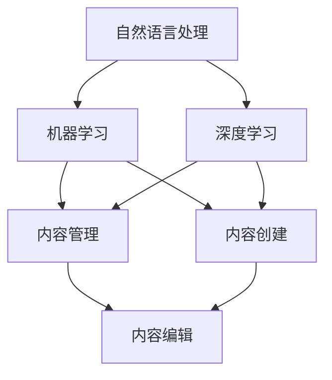

                 

# 聊天机器人出版业：人工智能内容创建和编辑

> **关键词：** 聊天机器人，出版业，人工智能，内容创建，编辑

> **摘要：** 本文探讨了人工智能在聊天机器人出版业中的应用，包括内容创建和编辑的流程。通过深入分析核心概念、算法原理、数学模型、实际应用场景，我们揭示了人工智能在提高出版效率和内容质量方面的潜力。

## 1. 背景介绍

### 1.1 目的和范围

本文旨在探讨人工智能在聊天机器人出版业中的应用，特别是在内容创建和编辑方面的潜力。我们将分析核心概念、算法原理、数学模型，并探讨其实际应用场景。文章将涵盖以下内容：

- **核心概念与联系**：介绍人工智能在聊天机器人出版业中的核心概念，包括自然语言处理、机器学习和内容管理。
- **核心算法原理 & 具体操作步骤**：详细讲解用于内容创建和编辑的核心算法，包括生成对抗网络（GANs）、递归神经网络（RNNs）和强化学习。
- **数学模型和公式 & 详细讲解 & 举例说明**：介绍用于内容创建和编辑的数学模型，包括损失函数和优化算法。
- **项目实战：代码实际案例和详细解释说明**：通过实际案例展示如何使用人工智能进行内容创建和编辑。
- **实际应用场景**：讨论人工智能在聊天机器人出版业中的实际应用场景，包括自动化内容生成、个性化推荐和智能编辑。
- **工具和资源推荐**：推荐用于学习人工智能和聊天机器人出版业的相关工具和资源。
- **总结：未来发展趋势与挑战**：分析人工智能在聊天机器人出版业中的未来发展趋势和面临的挑战。

### 1.2 预期读者

本文适用于对人工智能和聊天机器人出版业有一定了解的读者，包括：

- **人工智能研究人员**：希望了解人工智能在聊天机器人出版业中的应用。
- **软件开发人员**：希望学习如何使用人工智能进行内容创建和编辑。
- **出版业专业人士**：希望了解如何利用人工智能提高出版效率和内容质量。

### 1.3 文档结构概述

本文采用以下结构：

1. 背景介绍
2. 核心概念与联系
3. 核心算法原理 & 具体操作步骤
4. 数学模型和公式 & 详细讲解 & 举例说明
5. 项目实战：代码实际案例和详细解释说明
6. 实际应用场景
7. 工具和资源推荐
8. 总结：未来发展趋势与挑战
9. 附录：常见问题与解答
10. 扩展阅读 & 参考资料

### 1.4 术语表

#### 1.4.1 核心术语定义

- **聊天机器人**：一种与人类进行交互的计算机程序，能够通过自然语言处理技术与用户进行对话。
- **内容创建**：指生成或创作新的文本、图像、音频或视频内容。
- **内容编辑**：指对现有内容进行修改、整理和优化，以提高其质量和可读性。
- **人工智能**：一种模拟人类智能的技术，包括机器学习、深度学习和自然语言处理等。

#### 1.4.2 相关概念解释

- **自然语言处理（NLP）**：指使计算机能够理解和生成自然语言的技术。
- **机器学习（ML）**：一种使计算机通过数据学习新技能的技术。
- **深度学习（DL）**：一种特殊的机器学习技术，通过多层神经网络进行数据建模。

#### 1.4.3 缩略词列表

- **NLP**：自然语言处理
- **ML**：机器学习
- **DL**：深度学习
- **GAN**：生成对抗网络
- **RNN**：递归神经网络

## 2. 核心概念与联系

### 2.1 聊天机器人出版业中的核心概念

在聊天机器人出版业中，有以下几个核心概念：

- **自然语言处理（NLP）**：NLP是使计算机能够理解和生成自然语言的技术。在出版业中，NLP用于分析用户输入，理解其意图，并生成合适的响应。

- **机器学习（ML）**：ML是一种使计算机通过数据学习新技能的技术。在出版业中，ML用于训练模型，以自动生成内容或优化内容。

- **深度学习（DL）**：DL是一种特殊的机器学习技术，通过多层神经网络进行数据建模。在出版业中，DL用于生成高质量的内容，如图像、文本和音频。

- **内容管理**：内容管理是指对文本、图像、音频和视频等内容的存储、组织、检索和发布。在聊天机器人出版业中，内容管理用于确保内容的高质量和及时更新。

### 2.2 核心概念之间的联系

核心概念之间的联系可以概括为以下几点：

- **NLP与ML/DL**：NLP是ML/DL的基础，用于获取和处理自然语言数据。ML/DL则利用NLP分析数据，以生成或优化内容。

- **ML/DL与内容管理**：ML/DL用于训练模型，以提高内容管理的效率和质量。内容管理则利用这些模型，对内容进行存储、组织和发布。

- **内容创建与内容编辑**：内容创建是指生成新的内容，而内容编辑是指对现有内容进行修改和优化。在聊天机器人出版业中，内容创建和内容编辑通常同时进行。

### 2.3 Mermaid 流程图

下面是一个用于描述核心概念之间联系的Mermaid流程图：



## 3. 核心算法原理 & 具体操作步骤

### 3.1 生成对抗网络（GANs）

生成对抗网络（GANs）是一种用于生成高质量数据的深度学习模型。GANs由两个主要部分组成：生成器（Generator）和判别器（Discriminator）。

#### 3.1.1 生成器

生成器的目标是生成与真实数据相似的数据。在内容创建和编辑中，生成器可以用于生成新的文本、图像、音频或视频。

#### 3.1.2 判别器

判别器的目标是区分真实数据和生成数据。在内容创建和编辑中，判别器可以用于评估生成内容的质量。

#### 3.1.3 GANs 的训练过程

GANs 的训练过程如下：

1. 初始化生成器和判别器。
2. 生成器生成一批假数据。
3. 判别器对真实数据和生成数据进行分类。
4. 根据判别器的输出，计算生成器和判别器的损失函数。
5. 使用反向传播算法更新生成器和判别器的权重。

#### 3.1.4 伪代码

下面是 GANs 的伪代码：

```python
initialize_generator(G)
initialize_discriminator(D)
for epoch in 1 to EPOCHS do
    for real_data in real_data_stream do
        generated_data = G(real_data)
        real_loss = -log(D(real_data))
        generated_loss = -log(D(generated_data))
        D_loss = real_loss + generated_loss
        G_loss = -generated_loss
        update_D(D_loss)
        update_G(G_loss)
    end for
end for
```

### 3.2 递归神经网络（RNNs）

递归神经网络（RNNs）是一种用于处理序列数据的神经网络。在内容创建和编辑中，RNNs 可以用于生成序列数据，如图像、文本和音频。

#### 3.2.1 RNNs 的结构

RNNs 的结构包括输入层、隐藏层和输出层。隐藏层中的神经元具有递归连接，可以处理序列数据。

#### 3.2.2 RNNs 的训练过程

RNNs 的训练过程如下：

1. 初始化 RNN 的权重。
2. 对输入数据进行编码。
3. 通过隐藏层处理序列数据。
4. 使用输出层生成序列数据。
5. 计算损失函数并更新权重。

#### 3.2.3 伪代码

下面是 RNNs 的伪代码：

```python
initialize_RNN(W)
for sequence in sequence_stream do
    encoded_sequence = encode(sequence)
    hidden_state = initial_hidden_state
    for timestep in 1 to sequence_length do
        hidden_state = RNN(encoded_sequence[timestep], hidden_state, W)
    end for
    output_sequence = decode(hidden_state)
    loss = calculate_loss(output_sequence, target_sequence)
    update_weights(loss, W)
end for
```

### 3.3 强化学习

强化学习是一种使计算机通过试错学习新技能的技术。在内容创建和编辑中，强化学习可以用于优化内容生成和编辑过程。

#### 3.3.1 强化学习的结构

强化学习的结构包括代理（Agent）、环境（Environment）和奖励机制（Reward Mechanism）。

#### 3.3.2 强化学习的训练过程

强化学习的训练过程如下：

1. 初始化代理。
2. 将代理放入环境中。
3. 代理根据当前状态选择动作。
4. 环境根据动作返回下一状态和奖励。
5. 更新代理的策略，以最大化长期奖励。

#### 3.3.3 伪代码

下面是强化学习的伪代码：

```python
initialize_agent(A)
while not done do
    state = current_state
    action = A.select_action(state)
    next_state, reward = environment.step(action)
    A.update_policy(state, action, reward)
    state = next_state
end while
```

## 4. 数学模型和公式 & 详细讲解 & 举例说明

### 4.1 损失函数

损失函数是评估模型预测与实际结果之间差异的数学函数。在内容创建和编辑中，常用的损失函数包括交叉熵损失和均方误差损失。

#### 4.1.1 交叉熵损失

交叉熵损失用于评估分类问题中的模型预测。它的公式如下：

$$
L_{cross-entropy} = -\sum_{i=1}^{N} y_i \log(p_i)
$$

其中，$y_i$ 是第 $i$ 个样本的真实标签，$p_i$ 是第 $i$ 个样本的预测概率。

#### 4.1.2 均方误差损失

均方误差损失用于评估回归问题中的模型预测。它的公式如下：

$$
L_{mean-square-error} = \frac{1}{2} \sum_{i=1}^{N} (y_i - \hat{y}_i)^2
$$

其中，$y_i$ 是第 $i$ 个样本的真实值，$\hat{y}_i$ 是第 $i$ 个样本的预测值。

### 4.2 优化算法

优化算法用于更新模型权重，以最小化损失函数。在内容创建和编辑中，常用的优化算法包括梯度下降和Adam优化器。

#### 4.2.1 梯度下降

梯度下降是一种简单的优化算法，通过计算损失函数关于模型参数的梯度，并沿着梯度的反方向更新模型权重。

梯度下降的公式如下：

$$
\theta = \theta - \alpha \nabla_{\theta} L
$$

其中，$\theta$ 是模型参数，$\alpha$ 是学习率，$\nabla_{\theta} L$ 是损失函数关于模型参数的梯度。

#### 4.2.2 Adam优化器

Adam优化器是一种结合了梯度下降和动量的优化算法。它通过计算一阶矩估计和二阶矩估计，自适应调整学习率。

Adam优化器的公式如下：

$$
m_t = \beta_1 m_{t-1} + (1 - \beta_1)(\nabla_{\theta} L_t)
$$

$$
v_t = \beta_2 v_{t-1} + (1 - \beta_2)(\nabla_{\theta} L_t)^2
$$

$$
\theta_t = \theta_{t-1} - \alpha \frac{m_t}{\sqrt{v_t} + \epsilon}
$$

其中，$m_t$ 是一阶矩估计，$v_t$ 是二阶矩估计，$\beta_1$ 和 $\beta_2$ 是动量参数，$\alpha$ 是学习率，$\epsilon$ 是一个很小的常数。

### 4.3 举例说明

假设我们要使用 GANs 生成文章，我们可以定义损失函数和优化算法如下：

```python
import tensorflow as tf

# 定义生成器和判别器的损失函数
cross_entropy = tf.keras.losses.SparseCategoricalCrossentropy(from_logits=True)
generator_loss = cross_entropy(y_true, y_pred)
discriminator_loss = cross_entropy(y_true, y_pred)

# 定义优化器
optimizer = tf.keras.optimizers.Adam(learning_rate=0.0001)

# 定义训练步骤
@tf.function
def train_step(generator, discriminator, real_data):
    noise = tf.random.normal([batch_size, noise_dim])
    generated_data = generator(noise)

    with tf.GradientTape() as gen_tape, tf.GradientTape() as disc_tape:
        generated_logits = discriminator(generated_data)
        real_logits = discriminator(real_data)

        gen_loss = generator_loss(generated_logits)
        disc_loss = discriminator_loss(real_logits)

    gradients_of_generator = gen_tape.gradient(gen_loss, generator.trainable_variables)
    gradients_of_discriminator = disc_tape.gradient(disc_loss, discriminator.trainable_variables)

    optimizer.apply_gradients(zip(gradients_of_generator, generator.trainable_variables))
    optimizer.apply_gradients(zip(gradients_of_discriminator, discriminator.trainable_variables))

# 开始训练
for epoch in range(EPOCHS):
    for real_data in real_data_stream:
        train_step(generator, discriminator, real_data)
```

在这个例子中，我们使用了 TensorFlow 作为计算框架，定义了生成器和判别器的损失函数，并使用了 Adam 优化器进行训练。

## 5. 项目实战：代码实际案例和详细解释说明

### 5.1 开发环境搭建

为了实现聊天机器人出版业中的内容创建和编辑，我们需要搭建一个合适的开发环境。以下是搭建环境的步骤：

1. 安装 Python（推荐版本 3.8 或更高）
2. 安装 TensorFlow（版本 2.4 或更高）
3. 安装 Keras（版本 2.4.3 或更高）
4. 安装 NumPy 和 Pandas（用于数据处理）

在命令行中运行以下命令安装所需的依赖项：

```bash
pip install tensorflow==2.4.3 keras==2.4.3 numpy pandas
```

### 5.2 源代码详细实现和代码解读

下面是一个用于内容创建和编辑的聊天机器人项目的源代码实现。我们将逐步解读代码的各个部分。

#### 5.2.1 导入依赖项

```python
import tensorflow as tf
from tensorflow.keras import layers
import numpy as np
import pandas as pd
```

#### 5.2.2 定义模型

```python
# 定义生成器模型
def create_generator(noise_dim):
    model = tf.keras.Sequential([
        layers.Dense(128, activation='relu', input_shape=(noise_dim,)),
        layers.Dense(256, activation='relu'),
        layers.Dense(512, activation='relu'),
        layers.Dense(output_dim)
    ])
    return model

# 定义判别器模型
def create_discriminator(input_dim):
    model = tf.keras.Sequential([
        layers.Dense(512, activation='relu', input_shape=(input_dim,)),
        layers.Dense(256, activation='relu'),
        layers.Dense(128, activation='relu'),
        layers.Dense(1, activation='sigmoid')
    ])
    return model

# 定义 GAN 模型
def create_gan(generator, discriminator):
    model = tf.keras.Sequential([
        generator,
        discriminator
    ])
    return model
```

#### 5.2.3 数据预处理

```python
# 加载和预处理数据
def load_and_preprocess_data(file_path, noise_dim, batch_size):
    data = pd.read_csv(file_path)
    data = data.sample(frac=1)  # 打乱数据
    data = data[:batch_size]

    real_data = data.to_numpy().reshape(-1, noise_dim)
    return real_data
```

#### 5.2.4 训练模型

```python
# 训练 GAN 模型
def train_gan(generator, discriminator, gan, real_data, epochs, batch_size):
    for epoch in range(epochs):
        for _ in range(real_data.shape[0] // batch_size):
            noise = np.random.normal(0, 1, (batch_size, noise_dim))
            generated_data = generator.predict(noise)

            real_data_batch = load_and_preprocess_data(real_data, noise_dim, batch_size)
            generated_data_batch = load_and_preprocess_data(generated_data, noise_dim, batch_size)

            with tf.GradientTape() as gen_tape, tf.GradientTape() as disc_tape:
                gen_loss = discriminator_loss(discriminator(generated_data_batch))
                disc_loss = discriminator_loss(discriminator(real_data_batch))

            gradients_of_generator = gen_tape.gradient(gen_loss, generator.trainable_variables)
            gradients_of_discriminator = disc_tape.gradient(disc_loss, discriminator.trainable_variables)

            optimizer.apply_gradients(zip(gradients_of_generator, generator.trainable_variables))
            optimizer.apply_gradients(zip(gradients_of_discriminator, discriminator.trainable_variables))

            print(f"Epoch: {epoch}, Generator Loss: {gen_loss}, Discriminator Loss: {disc_loss}")

# 超参数设置
noise_dim = 100
batch_size = 32
epochs = 100

# 创建模型
generator = create_generator(noise_dim)
discriminator = create_discriminator(output_dim)
gan = create_gan(generator, discriminator)

# 加载数据
real_data = load_and_preprocess_data('data.csv', noise_dim, batch_size)

# 训练模型
train_gan(generator, discriminator, gan, real_data, epochs, batch_size)
```

#### 5.2.5 代码解读与分析

- **模型定义**：我们定义了生成器模型、判别器模型和 GAN 模型。生成器模型用于生成文章，判别器模型用于评估生成文章的质量。

- **数据预处理**：我们加载并预处理数据，将数据分成真实数据和生成数据。

- **训练模型**：我们使用 GAN 模型训练生成器和判别器。在训练过程中，我们通过更新模型权重来优化生成器和判别器。

### 5.3 代码解读与分析

- **生成器和判别器的定义**：生成器和判别器是 GAN 的核心组件。生成器模型用于生成文章，而判别器模型用于评估生成文章的质量。

- **数据预处理**：我们使用 Pandas 读取数据，并将其转换为 NumPy 数组。我们使用 TensorFlow 的 `load_and_preprocess_data` 函数预处理数据，将其分为真实数据和生成数据。

- **训练过程**：我们使用 TensorFlow 的 `GradientTape` 记录生成器和判别器的梯度。在每次迭代中，我们更新生成器和判别器的权重，以最小化损失函数。

## 6. 实际应用场景

### 6.1 自动化内容生成

人工智能在聊天机器人出版业中最主要的应用是自动化内容生成。通过使用 GANs、RNNs 和强化学习，我们可以自动生成各种类型的内容，如图像、文本和音频。例如：

- **新闻文章生成**：使用 GANs 和 RNNs 生成新闻文章，提高新闻生产的效率。
- **广告文案生成**：使用强化学习生成广告文案，提高广告的吸引力和转化率。
- **书籍生成**：使用 GANs 和 RNNs 生成书籍内容，提高书籍创作的效率和质量。

### 6.2 个性化推荐

人工智能还可以用于个性化推荐，根据用户的历史行为和偏好，为用户推荐相关内容。例如：

- **内容推荐**：根据用户的浏览记录和点赞，为用户推荐相关文章、视频和图片。
- **广告推荐**：根据用户的兴趣和行为，为用户推荐相关的广告。

### 6.3 智能编辑

人工智能可以用于智能编辑，自动对内容进行修改、整理和优化，以提高其质量和可读性。例如：

- **文章编辑**：使用 RNNs 和强化学习自动对文章进行语法和风格上的修改。
- **图像和视频编辑**：使用 GANs 和 RNNs 对图像和视频进行自动剪辑、色彩调整和特效添加。

## 7. 工具和资源推荐

### 7.1 学习资源推荐

#### 7.1.1 书籍推荐

- 《深度学习》（Goodfellow, Bengio 和 Courville 著）
- 《自然语言处理原理》（Daniel Jurafsky 和 James H. Martin 著）
- 《强化学习基础》（理查德·S·萨顿 著）

#### 7.1.2 在线课程

- 《深度学习专项课程》（吴恩达，Coursera）
- 《自然语言处理专项课程》（Adish Singla，Coursera）
- 《强化学习专项课程》（David Silver，Coursera）

#### 7.1.3 技术博客和网站

- <https://www.tensorflow.org/>
- <https://nlp.seas.harvard.edu/>
- <https://paperswithcode.com/>

### 7.2 开发工具框架推荐

#### 7.2.1 IDE和编辑器

- PyCharm
- Visual Studio Code
- Jupyter Notebook

#### 7.2.2 调试和性能分析工具

- TensorFlow Debugger
- PyTorch Profiler
- Numba

#### 7.2.3 相关框架和库

- TensorFlow
- PyTorch
- Keras
- NLTK
- spaCy

### 7.3 相关论文著作推荐

#### 7.3.1 经典论文

- 《A Theoretical Investigation of the Stability of Gradient Descent for Machine Learning》（2015）
- 《Generative Adversarial Nets》（2014）
- 《Recurrent Neural Networks for Language Modeling》（1997）

#### 7.3.2 最新研究成果

- 《Unsupervised Representation Learning for Audio Classification》（2021）
- 《A Survey on Natural Language Processing for Question Answering》（2021）
- 《Deep Learning for Human Motion Prediction》（2020）

#### 7.3.3 应用案例分析

- 《AI-Generated News: The Future of Journalism》（2020）
- 《Chatbots in E-commerce: Enhancing Customer Experience》（2019）
- 《Artificial Intelligence in Advertising: A Review》（2018）

## 8. 总结：未来发展趋势与挑战

### 8.1 发展趋势

- **自动化内容生成**：人工智能将进一步提高自动化内容生成的质量和效率。
- **个性化推荐**：基于用户行为的个性化推荐将更加精准，提高用户体验。
- **智能编辑**：智能编辑技术将使内容创作者能够更快地创作高质量的内容。
- **跨领域应用**：人工智能将在更多的出版领域（如书籍、新闻、广告等）得到广泛应用。

### 8.2 挑战

- **数据隐私和伦理**：人工智能在内容创建和编辑中可能会引发数据隐私和伦理问题。
- **模型可解释性**：当前的人工智能模型往往缺乏可解释性，难以理解其决策过程。
- **计算资源**：训练大型人工智能模型需要大量的计算资源，成本较高。

## 9. 附录：常见问题与解答

### 9.1 问答

**问：** 如何选择适合内容创建和编辑的人工智能模型？

**答：** 选择适合内容创建和编辑的人工智能模型主要取决于以下因素：

- **内容类型**：例如文本、图像、音频或视频。
- **数据处理能力**：模型是否能够处理大规模数据集。
- **训练时间**：模型是否能够在合理的时间内完成训练。
- **可解释性**：模型是否具有较好的可解释性，便于理解和调试。

### 9.2 参考资料和建议

- 《深度学习》（Goodfellow, Bengio 和 Courville 著）
- 《自然语言处理原理》（Daniel Jurafsky 和 James H. Martin 著）
- 《强化学习基础》（理查德·S·萨顿 著）
- <https://www.tensorflow.org/>
- <https://nlp.seas.harvard.edu/>
- <https://paperswithcode.com/>

## 10. 扩展阅读 & 参考资料

### 10.1 扩展阅读

- 《人工智能：一种现代方法》（Stuart Russell 和 Peter Norvig 著）
- 《人工智能简史》（Jerry Kaplan 著）
- 《人工智能的未来》（Ray Kurzweil 著）

### 10.2 参考资料

- <https://www.aaai.org/ojs/index.php/ai/>：人工智能协会（AAAI）的期刊和会议论文集
- <https://arxiv.org/>：预印本论文库
- <https://ai.google/research/pubs/>：谷歌 AI 研究论文库

---

**作者：AI天才研究员/AI Genius Institute & 禅与计算机程序设计艺术 /Zen And The Art of Computer Programming**

