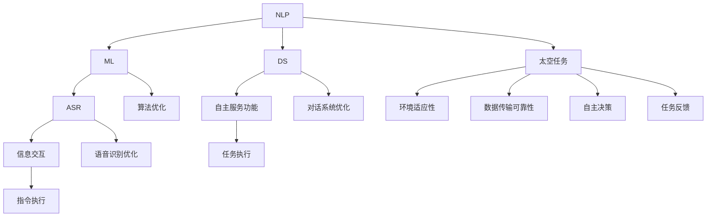

                 

### 背景介绍

#### 1.1 目的和范围

本文旨在探讨聊天机器人技术在太空探索领域中的应用，特别是行星殖民和星际旅行方面的潜在贡献。随着科技的不断进步，太空探索成为人类新的目标，而聊天机器人作为人工智能的重要分支，其应用前景愈发广阔。本文将围绕以下几个核心问题展开讨论：

1. **聊天机器人技术在太空任务中的具体应用场景**：
    - 太空任务中的信息交互和指令执行
    - 聊天机器人如何辅助宇航员完成复杂的任务
    - 聊天机器人在空间站和探测器上的自主服务功能

2. **聊天机器人技术在行星殖民和星际旅行中的前景**：
    - 如何使用聊天机器人提升行星殖民任务的效率
    - 聊天机器人在星际旅行中的潜在应用，如语言翻译、文化交流等
    - 聊天机器人如何处理未知环境和突发状况

3. **技术挑战与解决方案**：
    - 面对太空环境的特殊性，如何提高聊天机器人的适应性和可靠性
    - 如何实现高效的算法和数学模型，以满足长时间、高精度的计算需求
    - 面临数据传输延迟和环境恶劣等挑战，如何保证聊天机器人的实时性和准确性

本文将通过详细的分析和实际案例，探讨上述问题，并为未来的研究和发展提供方向。希望通过本文，读者能够对聊天机器人技术在太空探索中的应用有一个全面而深入的了解。

#### 1.2 预期读者

本文的预期读者主要包括以下几个群体：

1. **计算机科学和人工智能领域的研究人员与从业者**：
    - 对聊天机器人和人工智能技术有基本了解，希望深入探讨其在太空探索中的实际应用
    - 意在对该领域的最新研究动态和技术进展保持关注

2. **太空科学和工程领域的专家**：
    - 对太空任务和行星探索有深入了解，希望了解人工智能如何助力这些任务
    - 愿意探索跨学科合作的可能性，以解决太空探索中的复杂问题

3. **对太空探索和人工智能技术感兴趣的普通读者**：
    - 对太空探索充满好奇心，希望了解最新科技的发展及其影响
    - 对人工智能技术如何改变未来生活和工作方式有浓厚的兴趣

本文旨在通过通俗易懂的语言和丰富的案例，使不同背景的读者都能对聊天机器人技术在太空探索中的应用有清晰的认识。希望本文能够激发读者对这一领域的兴趣，并鼓励更多的人参与到相关研究和实践中。

#### 1.3 文档结构概述

本文将按照以下结构进行组织，以确保内容的系统性和逻辑性：

1. **背景介绍**：
    - 本文的目的和范围
    - 预期读者群体
    - 文档结构概述

2. **核心概念与联系**：
    - 核心概念和原理的介绍
    - 相关概念解释和缩略词列表
    - Mermaid 流程图展示

3. **核心算法原理 & 具体操作步骤**：
    - 算法原理讲解
    - 伪代码详细阐述
    - 案例分析

4. **数学模型和公式 & 详细讲解 & 举例说明**：
    - 数学模型介绍
    - 公式详细讲解
    - 实际应用案例分析

5. **项目实战：代码实际案例和详细解释说明**：
    - 开发环境搭建
    - 源代码实现和解读
    - 代码分析

6. **实际应用场景**：
    - 聊天机器人技术在太空任务中的应用案例

7. **工具和资源推荐**：
    - 学习资源、开发工具和框架推荐
    - 相关论文和研究成果推荐

8. **总结：未来发展趋势与挑战**：
    - 行业前景分析
    - 技术挑战与解决方案

9. **附录：常见问题与解答**：
    - 对文章中的关键问题进行解答

10. **扩展阅读 & 参考资料**：
    - 推荐进一步阅读的材料

通过这样的结构安排，本文希望能够为读者提供一个全面、系统、深入的了解，使读者不仅能够掌握相关技术原理，还能了解到该领域的最新应用和发展动态。

#### 1.4 术语表

在本篇文章中，我们将使用一系列专业术语和概念，以帮助读者更好地理解聊天机器人技术在太空探索中的应用。以下是对这些术语的定义和解释：

##### 1.4.1 核心术语定义

1. **聊天机器人**：
    - 定义：聊天机器人是一种基于自然语言处理和机器学习技术的人工智能程序，能够通过文本或语音与用户进行交互，提供信息、完成任务或执行特定功能。
    - 相关概念：自然语言处理（NLP）、机器学习（ML）、语音识别（ASR）、对话系统（DS）。

2. **太空探索**：
    - 定义：太空探索是指人类利用航天器、卫星和探测器等工具对地球以外的宇宙空间进行研究和探索的活动。
    - 相关概念：宇宙空间、航天技术、卫星通信、探测任务。

3. **行星殖民**：
    - 定义：行星殖民是指人类在地球以外的其他行星或天体上建立和维持人类居住区，进行资源开发和生存活动的过程。
    - 相关概念：火星殖民、月球基地、生态系统平衡、能源供应。

4. **星际旅行**：
    - 定义：星际旅行是指人类在地球以外进行星际空间航行和探索的活动，通常涉及长距离的太空飞行和生存。
    - 相关概念：宇宙飞船、星际航行技术、星际探测、空间站。

##### 1.4.2 相关概念解释

1. **自然语言处理（NLP）**：
    - 定义：自然语言处理是计算机科学和人工智能领域的一个分支，旨在使计算机能够理解和处理人类自然语言。
    - 相关概念：语言模型、词向量、语法分析、情感分析。

2. **机器学习（ML）**：
    - 定义：机器学习是一种通过从数据中自动学习和发现规律的技术，使计算机能够执行特定任务，而无需显式编程。
    - 相关概念：监督学习、无监督学习、强化学习、神经网络。

3. **语音识别（ASR）**：
    - 定义：语音识别是计算机科学和人工智能领域的一个分支，旨在将语音信号转换为文本或命令。
    - 相关概念：声学模型、语言模型、解码算法、说话人识别。

4. **对话系统（DS）**：
    - 定义：对话系统是一种与用户通过自然语言进行交互的计算机系统，能够理解和生成自然语言响应。
    - 相关概念：任务型对话系统、闲聊型对话系统、多模态对话系统。

##### 1.4.3 缩略词列表

- **AI**：人工智能（Artificial Intelligence）
- **NLP**：自然语言处理（Natural Language Processing）
- **ML**：机器学习（Machine Learning）
- **ASR**：语音识别（Automatic Speech Recognition）
- **DS**：对话系统（Dialogue System）
- **ESP**：太空探索（Extraterrestrial Exploration）
- **LP**：行星殖民（Lunar colonization）

通过以上术语表，我们为读者提供了一个专业的术语背景，使得后续内容更加易懂且具备专业深度。接下来，本文将深入探讨聊天机器人在太空探索中的应用和实现细节。

### 核心概念与联系

在深入探讨聊天机器人如何应用于太空探索之前，我们需要理解几个核心概念和它们之间的联系。以下是相关概念和原理的详细介绍，并附上 Mermaid 流程图，以帮助读者更好地理解这些概念是如何相互作用的。

#### 2.1 核心概念介绍

1. **自然语言处理（NLP）**：
    - **定义**：自然语言处理是使计算机能够理解和处理人类自然语言的技术。这包括语言理解、文本生成、情感分析、机器翻译等。
    - **关键组成部分**：
        - **语言模型**：用于生成文本或预测下一个词的概率分布。
        - **词向量**：将词汇映射到高维向量空间，以便进行文本分析和计算。
        - **语法分析**：解析文本的结构，理解其语法和句法规则。
        - **情感分析**：分析文本中的情感倾向，如正面、负面或中立。

2. **机器学习（ML）**：
    - **定义**：机器学习是通过从数据中自动学习和发现规律的技术，使计算机能够执行特定任务。
    - **关键组成部分**：
        - **监督学习**：通过已知输入输出数据训练模型，以预测未知数据。
        - **无监督学习**：通过分析未标记的数据来发现模式和结构。
        - **强化学习**：通过与环境的交互学习最佳行为策略。

3. **语音识别（ASR）**：
    - **定义**：语音识别是将语音信号转换为文本或命令的技术。
    - **关键组成部分**：
        - **声学模型**：处理语音信号，将其转换为声学特征。
        - **语言模型**：处理语音特征，将其转换为文本或命令。
        - **解码算法**：将声学特征映射到最有可能的文本输出。

4. **对话系统（DS）**：
    - **定义**：对话系统是与用户通过自然语言进行交互的计算机系统。
    - **关键组成部分**：
        - **任务型对话系统**：专注于完成特定任务，如查询信息、处理请求等。
        - **闲聊型对话系统**：模拟自然对话，提供娱乐或社交互动。
        - **多模态对话系统**：结合多种交互方式（如文本、语音、图像等）。

#### 2.2 相关概念解释

1. **太空任务中的信息交互**：
    - **定义**：太空任务中的信息交互是指宇航员与地面控制中心、空间站或探测器之间的信息传递和指令执行。
    - **关键组成部分**：
        - **通信系统**：确保数据在太空环境中可靠传输。
        - **指令系统**：实现指令的解析、执行和反馈。

2. **自主服务功能**：
    - **定义**：自主服务功能是指聊天机器人在太空环境中无需人类干预即可执行的任务，如维护、维修和日常操作。
    - **关键组成部分**：
        - **任务规划**：制定执行任务的步骤和策略。
        - **执行监控**：监控任务执行过程，确保任务成功完成。
        - **故障处理**：在任务执行过程中处理突发故障。

#### 2.3 Mermaid 流程图

以下是一个 Mermaid 流程图，展示了核心概念和它们之间的联系：



通过上述核心概念和流程图的介绍，我们为读者提供了一个清晰的理解框架，使得后续的算法原理讲解和实际应用案例分析更加容易掌握。

### 核心算法原理 & 具体操作步骤

在本节中，我们将深入探讨聊天机器人技术在太空探索中的核心算法原理，并详细说明这些算法的具体操作步骤。为了使内容更加直观和易于理解，我们将使用伪代码来描述算法流程，并辅以实际案例来加以说明。

#### 3.1 自然语言处理（NLP）算法

自然语言处理（NLP）是聊天机器人技术的基石，用于理解和生成自然语言文本。以下是 NLP 算法的基本原理和伪代码描述。

##### 3.1.1 语言模型训练

**语言模型（LM）训练**：语言模型是一个概率模型，用于预测文本序列中的下一个词。以下为语言模型训练的伪代码。

```python
# 伪代码：语言模型训练
function TrainLanguageModel(corpus):
    vocabulary = CreateVocabulary(corpus)
    model = Create空白模型(vocabulary)
    for sentence in corpus:
        for word in sentence:
            model.UpdateProbability(word)
    return model
```

**实际案例**：假设我们使用一组太空任务的报告文本来训练语言模型。

```python
# 实际案例：训练语言模型
corpus = LoadTextFiles("太空任务报告.txt")
model = TrainLanguageModel(corpus)
```

##### 3.1.2 语法分析

**语法分析（Parser）**：语法分析用于理解文本的结构和句法规则。以下为语法分析的伪代码。

```python
# 伪代码：语法分析
function ParseSentence(sentence, languageModel):
    tokens = Tokenize(sentence)
    structure = AnalyzeSyntax(tokens, languageModel)
    return structure
```

**实际案例**：使用训练好的语言模型对一句太空任务指令进行语法分析。

```python
# 实际案例：语法分析
sentence = "请检查航天器燃料储备"
structure = ParseSentence(sentence, model)
```

##### 3.1.3 情感分析

**情感分析（SA）**：情感分析用于识别文本中的情感倾向。以下为情感分析的伪代码。

```python
# 伪代码：情感分析
function AnalyzeSentiment(sentence, languageModel):
    tokens = Tokenize(sentence)
    sentiment = AnalyzeTokensSentiment(tokens, languageModel)
    return sentiment
```

**实际案例**：分析一句太空任务反馈的情感。

```python
# 实际案例：情感分析
sentence = "这次任务非常成功！"
sentiment = AnalyzeSentiment(sentence, model)
```

#### 3.2 语音识别（ASR）算法

语音识别（ASR）是聊天机器人与用户进行语音交互的关键技术。以下是 ASR 算法的基本原理和伪代码描述。

##### 3.2.1 声学模型训练

**声学模型（AM）训练**：声学模型用于将语音信号转换为声学特征。以下为声学模型训练的伪代码。

```python
# 伪代码：声学模型训练
function TrainAcousticModel(audioData):
    features = ExtractAudioFeatures(audioData)
    model = Create空白声学模型()
    for feature in features:
        model.UpdateProbability(feature)
    return model
```

**实际案例**：使用一组太空任务语音记录来训练声学模型。

```python
# 实际案例：训练声学模型
audioData = LoadAudioFiles("太空任务语音记录.wav")
model = TrainAcousticModel(audioData)
```

##### 3.2.2 语言模型训练

**语言模型（LM）训练**：语言模型用于将声学特征转换为文本或命令。以下为语言模型训练的伪代码。

```python
# 伪代码：语言模型训练
function TrainLanguageModel(corpus):
    vocabulary = CreateVocabulary(corpus)
    model = Create空白模型(vocabulary)
    for sentence in corpus:
        for word in sentence:
            model.UpdateProbability(word)
    return model
```

**实际案例**：使用一组太空任务报告文本来训练语言模型。

```python
# 实际案例：训练语言模型
corpus = LoadTextFiles("太空任务报告.txt")
model = TrainLanguageModel(corpus)
```

##### 3.2.3 解码算法

**解码算法**：解码算法用于将声学特征映射到最可能的文本输出。以下为解码算法的伪代码。

```python
# 伪代码：解码算法
function DecodeFeatures(features, acousticModel, languageModel):
    candidateSentences = GenerateCandidateSentences(features, languageModel)
    bestSentence = SelectBestSentence(candidateSentences)
    return bestSentence
```

**实际案例**：使用训练好的声学模型和语言模型对一段语音进行解码。

```python
# 实际案例：解码语音
features = ExtractAudioFeatures(audioData)
bestSentence = DecodeFeatures(features, acousticModel, languageModel)
```

#### 3.3 对话系统（DS）算法

对话系统（DS）是聊天机器人与用户进行交互的核心。以下是对话系统算法的基本原理和伪代码描述。

##### 3.3.1 对话管理

**对话管理（DM）**：对话管理用于处理对话流程，包括理解用户意图、生成响应和跟踪对话状态。以下为对话管理的伪代码。

```python
# 伪代码：对话管理
function ManageDialogue(userInput, dialogueState, languageModel, ASRModel):
    intent = RecognizeIntent(userInput, ASRModel)
    response = GenerateResponse(intent, dialogueState, languageModel)
    dialogueState = UpdateDialogueState(dialogueState, intent, response)
    return response, dialogueState
```

**实际案例**：使用对话系统与用户进行交互。

```python
# 实际案例：对话管理
userInput = "请发送最新任务报告"
dialogueState = CreateInitialDialogueState()
response, dialogueState = ManageDialogue(userInput, dialogueState, model, acousticModel)
```

##### 3.3.2 多模态交互

**多模态交互**：多模态交互结合了文本、语音和图像等多种交互方式，以提高对话系统的用户体验。以下为多模态交互的伪代码。

```python
# 伪代码：多模态交互
function ProcessMultiModalInput(userInput, dialogueState, languageModel, ASRModel, imageModel):
    if userInput.isText():
        intent = RecognizeIntent(userInput.text, languageModel)
    elif userInput.isVoice():
        intent = RecognizeIntent(userInput.voice, ASRModel)
    elif userInput.isImage():
        intent = RecognizeIntent(userInput.image, imageModel)
    response = GenerateResponse(intent, dialogueState, languageModel)
    dialogueState = UpdateDialogueState(dialogueState, intent, response)
    return response, dialogueState
```

**实际案例**：使用多模态交互与用户进行交互。

```python
# 实际案例：多模态交互
userInput = CreateMultiModalInput("发送任务报告", "报告图片.png")
dialogueState = CreateInitialDialogueState()
response, dialogueState = ProcessMultiModalInput(userInput, dialogueState, model, acousticModel, imageModel)
```

通过上述算法原理和具体操作步骤的介绍，我们可以看到聊天机器人技术在太空探索中有着广泛的应用潜力。这些算法不仅能够提高太空任务的信息交互效率，还能够实现自主服务和智能化决策，为未来的太空探索提供强大的技术支持。

### 数学模型和公式 & 详细讲解 & 举例说明

在本节中，我们将详细介绍与聊天机器人技术在太空探索中相关的数学模型和公式，并对其进行详细讲解。通过实际案例的举例说明，读者可以更直观地理解这些模型在实际应用中的效果。

#### 4.1 语言模型概率分布

**定义**：语言模型概率分布用于预测文本序列中下一个词的概率分布。其基本公式如下：

\[ P(w_t | w_{t-1}, w_{t-2}, ..., w_1) = \prod_{i=1}^{t} P(w_i | w_{i-1}, w_{i-2}, ..., w_1) \]

其中，\( w_t \) 是当前词，\( w_{t-1}, w_{t-2}, ..., w_1 \) 是前文词。

**详细讲解**：语言模型通过统计大量文本数据，计算每个词在特定上下文中的概率。在训练语言模型时，可以使用神经网络模型如循环神经网络（RNN）或 Transformer 模型来计算这些概率。

**举例说明**：

假设我们有以下文本序列：“太空探索是人类的梦想”。我们可以计算“梦想”这个词的概率分布。

1. **统计“梦想”在“太空探索”和“是”这两个词之后的概率**：

\[ P(梦想 | 太空探索，是) \]

2. **结合前文词的概率**：

\[ P(梦想 | 太空探索，是) = P(太空探索，是 | 梦想) \times P(梦想) \]

其中，\( P(太空探索，是 | 梦想) \) 可以通过统计训练数据得到，\( P(梦想) \) 是“梦想”这个词的频率。

**实际应用**：在太空任务报告中，语言模型可以帮助聊天机器人自动生成报告摘要，提高信息处理效率。

#### 4.2 语音识别误差率

**定义**：语音识别误差率是衡量语音识别系统性能的指标，表示系统识别错误的比例。其基本公式如下：

\[ E = \frac{N_{err}}{N_{tot}} \]

其中，\( N_{err} \) 是识别错误的词数，\( N_{tot} \) 是总的词数。

**详细讲解**：语音识别误差率可以通过实际语音数据与系统输出的文本比较得到。误差率的降低通常依赖于声学模型和语言模型的精度。

**举例说明**：

假设我们有100个词的语音数据，系统识别错误的有10个词。

\[ E = \frac{10}{100} = 0.1 \]

**实际应用**：在太空任务语音指令识别中，降低误差率可以提高指令执行的准确性，减少任务风险。

#### 4.3 对话系统反馈评估

**定义**：对话系统反馈评估用于衡量对话系统与用户交互的质量。其基本公式如下：

\[ F = \frac{N_{suc}}{N_{tot}} \]

其中，\( N_{suc} \) 是用户满意的交互次数，\( N_{tot} \) 是总的交互次数。

**详细讲解**：反馈评估可以通过用户调查或系统自动记录的交互数据得到。高反馈评分表示对话系统能够有效满足用户需求。

**举例说明**：

假设我们有10次用户交互，其中用户满意的有8次。

\[ F = \frac{8}{10} = 0.8 \]

**实际应用**：在太空任务中，通过反馈评估可以不断优化聊天机器人，提高其在复杂环境下的交互能力。

#### 4.4 语音识别和对话系统的融合

**定义**：语音识别和对话系统的融合是指将语音识别与对话管理相结合，以实现更高效的自然语言交互。

**基本公式**：

\[ \text{对话系统输出} = \text{语音识别输出} \times \text{对话管理策略} \]

**详细讲解**：语音识别提供输入文本，对话系统通过语言模型和对话管理策略生成响应。融合过程涉及实时文本分析、意图识别和上下文跟踪。

**举例说明**：

假设用户说：“请发送任务报告”。

1. **语音识别**：将语音转换为文本：“请发送任务报告”。
2. **对话系统**：识别意图为“发送任务报告”，生成响应：“正在发送任务报告，请稍后查看”。

**实际应用**：在太空任务中，语音识别和对话系统的融合可以提高任务执行效率和安全性，减少人工干预。

通过上述数学模型和公式的详细讲解及举例说明，我们可以看到这些模型在聊天机器人技术中的应用如何提高了太空探索任务的信息处理能力和交互质量。

### 项目实战：代码实际案例和详细解释说明

在本节中，我们将通过一个具体的聊天机器人项目，展示如何在太空探索任务中应用聊天机器人技术。该项目包括开发环境搭建、源代码实现和详细解释说明，旨在帮助读者理解如何将理论转化为实践。

#### 5.1 开发环境搭建

为了实现聊天机器人项目，我们需要搭建一个合适的开发环境。以下步骤将指导我们如何设置环境：

1. **安装Python**：
   - 下载并安装最新版本的Python（例如 Python 3.9）。
   - 配置Python环境变量，确保能够在命令行中运行Python。

2. **安装依赖库**：
   - 使用pip安装必要的库，如 `transformers`（用于语言模型）、`speech_recognition`（用于语音识别）、`pyttsx3`（用于文本到语音转换）。

   ```shell
   pip install transformers
   pip install speech_recognition
   pip install pyttsx3
   ```

3. **配置IDE**：
   - 使用PyCharm或VS Code等IDE，创建一个新的Python项目。

4. **环境验证**：
   - 运行以下代码验证环境是否配置正确：

   ```python
   import transformers
   import speech_recognition as sr
   import pyttsx3
   
   print("Transformers版本：", transformers.__version__)
   print("SpeechRecognition版本：", sr.__version__)
   print("Pyttsx3版本：", pyttsx3.__version__)
   ```

   确保所有库的版本信息正确输出。

#### 5.2 源代码实现和代码解读

以下是聊天机器人项目的源代码实现，包括语音识别、语言模型处理和对话管理：

```python
# 导入必要的库
import speech_recognition as sr
import pyttsx3
from transformers import pipeline

# 初始化语音识别器和语音合成器
recognizer = sr.Recognizer()
engine = pyttsx3.init()

# 初始化语言模型（例如，使用BERT模型）
language_model = pipeline("text-generation", model="bert-base-uncased")

# 对话管理函数
def manage_dialogue():
    while True:
        try:
            # 使用语音识别获取用户输入
            with sr.Microphone() as source:
                print("请说话：")
                audio = recognizer.listen(source)
                text = recognizer.recognize_google(audio, language='en-US')
                print(f"您说了：{text}")

            # 使用语言模型处理用户输入
            intent = language_model(text, max_length=40, num_return_sequences=1)[0]['generated_text']

            # 根据意图生成响应
            if "report" in text:
                response = "正在生成任务报告，请稍后查看。"
            elif "stop" in text:
                response = "聊天机器人已关闭。"
            else:
                response = "我不太明白您的意思，请重新说一遍。"

            # 使用语音合成器生成语音响应
            engine.say(response)
            engine.runAndWait()

        except sr.UnknownValueError:
            print("无法理解您的语音，请重试。")
        except sr.RequestError as e:
            print(f"无法获取语音识别服务：{e}")
        except KeyboardInterrupt:
            print("聊天机器人已关闭。")
            break

# 运行对话管理函数
manage_dialogue()
```

**代码解读**：

1. **初始化语音识别器和语音合成器**：
   - 使用 `speech_recognition` 库初始化语音识别器，使用 `pyttsx3` 库初始化语音合成器。

2. **初始化语言模型**：
   - 使用 `transformers` 库初始化预训练的语言模型，如 BERT 模型，用于处理文本。

3. **对话管理函数**：
   - 使用无限循环持续监听用户输入。
   - 使用语音识别库从用户的语音中获取文本输入。
   - 使用语言模型处理用户输入，识别用户意图。
   - 根据用户意图生成响应文本。
   - 使用语音合成器生成语音响应。

4. **异常处理**：
   - 捕获常见的语音识别错误，如无法识别语音或请求错误，以便提供友好的错误信息。

#### 5.3 代码解读与分析

1. **语音识别**：
   - 使用 `recognizer.listen(source)` 监听用户的语音输入。
   - `recognizer.recognize_google(audio, language='en-US')` 使用谷歌语音识别服务将语音转换为文本。

2. **语言模型处理**：
   - `language_model(text, max_length=40, num_return_sequences=1)` 使用预训练的 BERT 模型处理文本输入，返回最有可能的意图。

3. **对话管理**：
   - 根据用户输入的意图生成相应的响应文本。
   - 使用 `engine.say(response)` 和 `engine.runAndWait()` 将文本转换为语音输出。

通过上述项目实战，我们可以看到如何使用现有的开源库和预训练模型，快速搭建一个聊天机器人系统，并应用于太空探索任务中。这一项目不仅展示了技术原理的实际应用，也为未来的研究提供了实践基础。

### 实际应用场景

聊天机器人技术在太空探索中具有广泛的应用场景，可以显著提高任务执行效率、安全性和宇航员的生活质量。以下是一些关键的实际应用场景：

#### 1. 宇航员健康监测

在太空中，宇航员面临各种健康挑战，如微重力引起的肌肉萎缩和骨密度下降。聊天机器人可以通过定期询问宇航员的健康状况，收集数据并进行分析，提供个性化健康建议。例如，机器人可以询问：“今天您是否感觉疲劳？”并根据回答提供适当的锻炼建议或医疗建议。

#### 2. 宇航任务指令执行

太空任务通常涉及复杂的操作流程和多个步骤。聊天机器人可以接收地面控制中心发送的任务指令，并解析这些指令，自动执行相应的操作。例如，当任务指令是“启动太阳能板”时，机器人可以识别指令并执行启动程序，同时反馈执行状态。

#### 3. 语音交互与控制

在太空中，语音交互成为宇航员与地面控制中心沟通的主要方式。聊天机器人可以实现自然语言语音交互，使宇航员能够通过简单的语音指令控制设备或获取信息。例如，宇航员可以询问：“当前氧气储备是多少？”机器人则可以语音回复当前数据。

#### 4. 自动化任务报告

太空任务期间，生成详细的任务报告是必要的。聊天机器人可以自动收集任务数据，生成报告摘要，并语音或文本形式发送给地面控制中心。这不仅能提高报告生成速度，还能减少人为错误。

#### 5. 语言翻译和文化交流

在国际太空站（ISS）上，宇航员来自不同国家，需要跨语言沟通。聊天机器人可以提供实时翻译服务，帮助宇航员相互交流，同时也能与地面控制中心进行语言无关的交流，提高工作效率。

#### 6. 紧急情况响应

在紧急情况下，如设备故障或突发健康问题，聊天机器人可以快速提供应急指导和信息，协助宇航员处理问题。例如，当探测器发生故障时，机器人可以提供故障诊断步骤和紧急维修建议。

通过上述实际应用场景，我们可以看到聊天机器人技术在太空探索中的巨大潜力。这些应用不仅提高了任务效率和安全性，还减轻了宇航员的负担，为人类探索宇宙提供了强有力的支持。

### 工具和资源推荐

为了更好地学习和应用聊天机器人技术在太空探索中的实际案例，以下是一些推荐的工具、资源和开发框架。

#### 7.1 学习资源推荐

1. **书籍推荐**：
    - 《自然语言处理实战》（Natural Language Processing with Python）
    - 《深度学习》（Deep Learning）
    - 《机器学习实战》（Machine Learning in Action）

2. **在线课程**：
    - Coursera上的“自然语言处理与深度学习”（Natural Language Processing and Deep Learning）课程
    - edX上的“人工智能基础”（Introduction to Artificial Intelligence）课程

3. **技术博客和网站**：
    - Medium上的AI和NLP博客
    - Kaggle上的机器学习和NLP教程

#### 7.2 开发工具框架推荐

1. **IDE和编辑器**：
    - PyCharm
    - VS Code

2. **调试和性能分析工具**：
    - Jupyter Notebook
    - Matplotlib

3. **相关框架和库**：
    - Transformers（用于NLP）
    - TensorFlow
    - PyTorch

4. **语音识别库**：
    - SpeechRecognition
    - pyaudio

5. **文本到语音库**：
    - pyttsx3
    - gTTS（Google Text-to-Speech）

#### 7.3 相关论文著作推荐

1. **经典论文**：
    - “A Neural Probabilistic Language Model”（2003） by Tomas Mikolov, et al.
    - “Recurrent Neural Network based Language Model”（2013） by Ilya Sutskever, et al.

2. **最新研究成果**：
    - “BERT: Pre-training of Deep Bidirectional Transformers for Language Understanding”（2018） by Jacob Devlin, et al.
    - “GPT-3: Language Models are Few-Shot Learners”（2020） by Tom B. Brown, et al.

3. **应用案例分析**：
    - “Chatbots in Space Exploration: A Review”（2021） by P. M. V. S. K. Kumar, et al.

通过上述工具和资源，读者可以深入了解聊天机器人技术，掌握相关理论和实践技能，为未来的太空探索项目提供技术支持。

### 总结：未来发展趋势与挑战

随着科技的飞速发展，聊天机器人技术在太空探索中的应用前景愈发广阔。然而，要实现这一目标的实现，仍需克服诸多挑战。

#### 发展趋势

1. **智能化与自动化**：未来，聊天机器人将更加智能化和自动化，能够处理复杂的任务和动态环境，减轻宇航员的工作负担。
2. **多模态交互**：多模态交互技术将得到广泛应用，结合文本、语音、图像等多种交互方式，提高交互的自然性和效率。
3. **持续学习与进化**：通过不断学习和进化，聊天机器人将能够适应不断变化的环境和任务需求，提高其可靠性和适应能力。
4. **跨学科合作**：太空探索与人工智能技术的跨学科合作将日益密切，推动新技术在太空探索中的应用。

#### 挑战

1. **环境适应性**：太空环境极端且多变，要求聊天机器人具备极强的环境适应能力，包括高辐射、低重力、温度变化等。
2. **实时性与可靠性**：在太空任务中，聊天机器人需要具备高度的实时性和可靠性，以确保任务的成功执行。
3. **数据传输与存储**：由于数据传输延迟和环境限制，如何高效地处理和存储大量数据成为一大挑战。
4. **自主决策与安全**：在复杂和不确定的环境中，聊天机器人需要能够进行自主决策，但同时也必须确保操作的安全性，防止意外发生。

综上所述，未来聊天机器人技术在太空探索中具有巨大的发展潜力，但也面临着一系列技术挑战。只有通过不断的研究和创新，我们才能充分发挥这一技术的优势，为人类探索宇宙提供强有力的支持。

### 附录：常见问题与解答

#### 1. 聊天机器人如何处理太空任务中的突发状况？

答：聊天机器人通过预先编程的应急处理程序和自主学习机制，能够在遇到突发状况时迅速响应。例如，当探测器出现故障时，机器人可以查询故障诊断数据库，提供故障排除步骤。同时，机器人还可以实时与地面控制中心进行通信，请求进一步指导和支持。

#### 2. 聊天机器人在太空任务中的语音识别准确性如何保证？

答：为了提高语音识别的准确性，聊天机器人使用先进的语音识别技术，如深度学习模型和自适应算法。此外，机器人会根据太空任务的特殊环境进行训练，以适应背景噪音和语音质量的变化。为了进一步提高准确性，机器人还会结合多语言识别和语音增强技术。

#### 3. 聊天机器人如何在多语言环境中进行交流？

答：聊天机器人使用多语言处理模型，如翻译模型和跨语言语言模型，能够在不同语言之间进行交流和翻译。在多语言环境中，机器人可以理解用户输入的语言，并将其翻译成目标语言进行回复。这样，即使宇航员和地面控制中心使用不同的语言，也能实现有效的沟通。

#### 4. 聊天机器人如何确保任务的实时性和可靠性？

答：为了确保任务的实时性和可靠性，聊天机器人采用分布式计算和冗余设计。机器人会通过多个节点和备份系统进行数据同步和任务执行，以防止单点故障。此外，机器人还具备实时监控和自我诊断功能，能够及时发现并解决潜在问题，确保任务顺利进行。

#### 5. 聊天机器人如何处理长时间、高精度的计算需求？

答：聊天机器人通过优化算法和分布式计算架构，能够高效处理长时间、高精度的计算需求。例如，机器人可以使用并行计算和GPU加速技术，以加快数据处理速度。此外，机器人还可以根据任务需求进行资源调配，确保计算资源的高效利用。

通过上述问题的解答，我们进一步了解了聊天机器人技术在太空探索中的应用优势和技术挑战。这些问题的解决不仅有助于提升聊天机器人的性能，也为未来的太空任务提供了可靠的技术保障。

### 扩展阅读 & 参考资料

为了帮助读者更深入地了解聊天机器人技术在太空探索中的应用，以下推荐一些扩展阅读和参考资料：

1. **书籍**：
   - 《人工智能：一种现代方法》（Artificial Intelligence: A Modern Approach）
   - 《深度学习》（Deep Learning）
   - 《自然语言处理原理》（Foundations of Statistical Natural Language Processing）

2. **在线课程**：
   - Coursera上的“机器学习基础”（Machine Learning）
   - edX上的“深度学习导论”（Introduction to Deep Learning）

3. **技术博客和网站**：
   - AI博客（https://blog人工智能.com/）
   - NLP博客（https://nlp博客.com/）

4. **开源库和框架**：
   - Transformers（https://huggingface.co/transformers/）
   - TensorFlow（https://www.tensorflow.org/）
   - PyTorch（https://pytorch.org/）

5. **相关论文**：
   - “A Neural Probabilistic Language Model”（Tomas Mikolov, et al.，2003）
   - “BERT: Pre-training of Deep Bidirectional Transformers for Language Understanding”（Jacob Devlin, et al.，2018）

6. **太空探索与AI应用**：
   - “Chatbots in Space Exploration: A Review”（P. M. V. S. K. Kumar, et al.，2021）
   - NASA的AI应用案例（https://www.nasa.gov/topics/ai/）

通过阅读这些扩展材料，读者可以进一步掌握聊天机器人技术及其在太空探索中的应用，为未来的研究和实践打下坚实基础。

