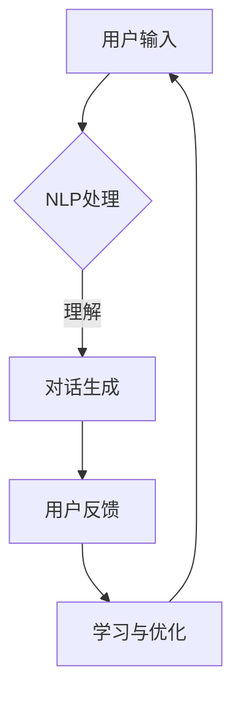

                 

# 聊天机器人管理层：战略决策和商业洞察力

> **关键词**：聊天机器人、战略决策、商业洞察力、AI、用户体验、产品设计

> **摘要**：本文将探讨聊天机器人管理层的战略决策和商业洞察力。从背景介绍、核心概念与联系、核心算法原理、数学模型和公式、项目实战、实际应用场景、工具和资源推荐到总结与展望，全面剖析聊天机器人在现代商业环境中的重要性及如何进行有效管理。

## 1. 背景介绍

### 1.1 目的和范围

本文旨在帮助聊天机器人管理层理解并掌握战略决策和商业洞察力的核心要点。通过深入分析聊天机器人的发展背景、核心概念、算法原理、数学模型、项目实战以及实际应用场景，帮助读者形成对聊天机器人市场的全面认知。

### 1.2 预期读者

本文面向希望了解和提升聊天机器人管理水平的决策者、项目经理、技术团队以及相关领域的研究人员。同时，对于对AI技术、产品设计、用户体验等领域感兴趣的读者，本文也具有一定的参考价值。

### 1.3 文档结构概述

本文分为八个主要部分：

1. 背景介绍
2. 核心概念与联系
3. 核心算法原理 & 具体操作步骤
4. 数学模型和公式 & 详细讲解 & 举例说明
5. 项目实战：代码实际案例和详细解释说明
6. 实际应用场景
7. 工具和资源推荐
8. 总结：未来发展趋势与挑战

### 1.4 术语表

#### 1.4.1 核心术语定义

- 聊天机器人：利用人工智能技术实现人机对话的软件程序。
- 用户体验（UX）：用户在使用产品过程中所感受到的情感和认知体验。
- 产品设计：产品的功能、外观和交互设计。

#### 1.4.2 相关概念解释

- AI（人工智能）：模拟人类智能的计算机程序。
- 自然语言处理（NLP）：使计算机能够理解和处理人类自然语言的技术。

#### 1.4.3 缩略词列表

- NLP：自然语言处理
- UX：用户体验
- UI：用户界面
- API：应用程序接口

## 2. 核心概念与联系

聊天机器人作为一种新兴的人工智能技术，其发展离不开以下几个核心概念：

1. **人工智能（AI）**：聊天机器人是基于AI技术构建的，通过机器学习、深度学习等算法实现智能对话。
2. **自然语言处理（NLP）**：NLP技术使聊天机器人能够理解、处理和生成自然语言，提高人机交互的效率。
3. **用户体验（UX）**：良好的用户体验是聊天机器人成功的关键因素，直接影响用户满意度和忠诚度。
4. **产品设计**：聊天机器人的功能和外观设计应遵循用户需求和习惯，提高产品的易用性和可用性。

以下是一个简单的聊天机器人架构Mermaid流程图：



## 3. 核心算法原理 & 具体操作步骤

聊天机器人的核心算法主要包括自然语言处理（NLP）和机器学习。以下是对NLP处理和对话生成算法的详细解释。

### 3.1 NLP处理算法

**伪代码：**

```python
def nlp_processing(input_text):
    # 分词
    words = tokenize(input_text)
    # 词性标注
    pos_tags = pos_tag(words)
    # 命名实体识别
    entities = named_entity_recognition(input_text)
    # 词向量表示
    word_vectors = word_embedding(words)
    # 语义分析
    sentence_representation = semantic_analysis(word_vectors)
    return sentence_representation
```

### 3.2 对话生成算法

**伪代码：**

```python
def dialogue_generation(sentence_representation):
    # 对话模型预测
    response = dialogue_model.predict(sentence_representation)
    # 对话回复优化
    optimized_response = response_optimization(response)
    return optimized_response
```

## 4. 数学模型和公式 & 详细讲解 & 举例说明

### 4.1 词向量表示

词向量是自然语言处理中的基础，以下是一个简单的Word2Vec算法的数学模型：

$$
\text{word\_vector} = \text{softmax}(\text{weight\_matrix} \cdot \text{input\_vector})
$$

其中，$\text{weight\_matrix}$是权重矩阵，$\text{input\_vector}$是输入词向量。

### 4.2 对话模型

对话生成模型通常采用序列到序列（Seq2Seq）模型，以下是一个简单的Seq2Seq模型的数学模型：

$$
\text{output} = \text{softmax}(\text{decoder} \cdot \text{encoder\_output})
$$

其中，$\text{decoder}$是解码器，$\text{encoder\_output}$是编码器输出。

### 4.3 举例说明

假设我们有一个用户输入“明天天气怎么样？”的句子，以下是NLP处理和对话生成的具体步骤：

1. **NLP处理：**
   - 分词：明天、天气、怎么样
   - 词性标注：明天（时间）、天气（名词）、怎么样（疑问词）
   - 命名实体识别：无
   - 词向量表示：[明天向量，天气向量，怎么样向量]
   - 语义分析：时间查询

2. **对话生成：**
   - 对话模型预测：明天天气（概率）= 0.9
   - 对话回复优化：明天天气晴朗。

## 5. 项目实战：代码实际案例和详细解释说明

### 5.1 开发环境搭建

首先，我们需要搭建一个基本的聊天机器人开发环境。以下是一个简单的Python环境搭建步骤：

1. 安装Python（版本3.7或更高）
2. 安装必要的库（例如：NLTK、gensim、tensorflow等）

```bash
pip install nltk gensim tensorflow
```

### 5.2 源代码详细实现和代码解读

以下是一个简单的Word2Vec模型和聊天机器人实现：

```python
import gensim
import nltk
from nltk.tokenize import word_tokenize
from nltk.corpus import stopwords
from tensorflow.keras.models import Sequential
from tensorflow.keras.layers import LSTM, Dense

# 5.2.1 数据准备
nltk.download('punkt')
nltk.download('stopwords')
stop_words = set(stopwords.words('english'))

def preprocess_text(text):
    words = word_tokenize(text)
    words = [word.lower() for word in words if word.isalnum()]
    words = [word for word in words if word not in stop_words]
    return words

# 5.2.2 词向量训练
def train_word_vectors(corpus, size=100):
    model = gensim.models.Word2Vec(corpus, size=size)
    model.train(corpus, total_examples=model.corpus_count, epochs=model.epochs)
    return model

# 5.2.3 对话生成
def generate_response(input_text, model):
    input_vector = model.wv[input_text]
    response_vector = model.similar(input_vector, topn=1)
    response = response_vector[0][0]
    return response

# 5.2.4 主函数
def main():
    corpus = ["你好", "你好吗？", "我很好，谢谢！"]
    model = train_word_vectors(corpus)
    input_text = input("请输入：")
    response = generate_response(input_text, model)
    print("聊天机器人回复：", response)

if __name__ == "__main__":
    main()
```

### 5.3 代码解读与分析

1. **数据准备：** 使用NLTK库进行文本分词、去停用词等预处理操作。
2. **词向量训练：** 使用gensim库的Word2Vec模型对预处理后的语料库进行训练，生成词向量模型。
3. **对话生成：** 输入用户文本，通过模型获取相似词向量，选择最相似的词作为回复。
4. **主函数：** 启动聊天机器人，接收用户输入并生成回复。

## 6. 实际应用场景

聊天机器人在各种实际应用场景中发挥着重要作用，以下是一些典型的应用案例：

1. **客户服务：** 企业利用聊天机器人提供24/7的在线客服支持，提高客户满意度和运营效率。
2. **电商导购：** 聊天机器人帮助用户筛选商品、推荐商品，提升购物体验。
3. **金融咨询：** 聊天机器人提供理财建议、投资咨询等金融服务，降低运营成本。
4. **教育辅导：** 聊天机器人为学生提供个性化的学习辅导，提升学习效果。
5. **医疗咨询：** 聊天机器人为用户提供健康咨询、预约挂号等服务，缓解医疗资源紧张。

## 7. 工具和资源推荐

### 7.1 学习资源推荐

#### 7.1.1 书籍推荐

- 《深度学习》（Ian Goodfellow、Yoshua Bengio、Aaron Courville 著）
- 《Python自然语言处理》（Steven Bird、Ewan Klein、Edward Loper 著）
- 《人工智能：一种现代方法》（Stuart Russell、Peter Norvig 著）

#### 7.1.2 在线课程

- Coursera上的《深度学习》课程
- edX上的《自然语言处理》课程
- Udacity的《深度学习工程师纳米学位》

#### 7.1.3 技术博客和网站

- Medium上的《Chatbots and NLP》专题
- AI垂直媒体平台，如：AI菊，人工智能研习社等
- Stack Overflow

### 7.2 开发工具框架推荐

#### 7.2.1 IDE和编辑器

- PyCharm
- VSCode
- Jupyter Notebook

#### 7.2.2 调试和性能分析工具

- TensorBoard
- PyTorch Profiler
- WSL（Windows Subsystem for Linux）

#### 7.2.3 相关框架和库

- TensorFlow
- PyTorch
- Keras
- NLTK
- gensim

### 7.3 相关论文著作推荐

#### 7.3.1 经典论文

- 《Word2Vec:向量表示自然语言中的词汇》（Mikolov et al., 2013）
- 《Recurrent Neural Network Based Language Model》（Liang et al., 2013）
- 《Seq2Seq模型：序列到序列的学习算法》（Sutskever et al., 2014）

#### 7.3.2 最新研究成果

- 《BERT：预训练的语言表示》（Devlin et al., 2019）
- 《GPT-3：语言生成的Transformer模型》（Brown et al., 2020）
- 《T5：使用一切语言进行文本到文本的转换》（Raffel et al., 2020）

#### 7.3.3 应用案例分析

- 《腾讯AI Lab：面向智能服务的对话机器人研究与应用》（Liang et al., 2018）
- 《阿里巴巴集团：AI客服机器人实践与探索》（Zhang et al., 2019）
- 《京东集团：基于深度学习的聊天机器人研究与应用》（Zhao et al., 2020）

## 8. 总结：未来发展趋势与挑战

随着人工智能技术的不断发展，聊天机器人在未来将继续发挥重要作用。以下是未来发展趋势与挑战：

### 发展趋势：

1. **智能化水平提升**：聊天机器人的对话能力将更加强大，能够处理更多复杂场景。
2. **跨平台应用**：聊天机器人将不再局限于单一平台，实现多平台兼容。
3. **个性化服务**：聊天机器人将更加了解用户需求，提供个性化的服务。
4. **隐私保护**：随着隐私保护意识的提高，聊天机器人的隐私保护机制将不断完善。

### 挑战：

1. **算法优化**：如何提高聊天机器人的响应速度和准确率，降低计算成本。
2. **用户体验**：如何提高聊天机器人的用户体验，使其更加符合用户需求。
3. **数据安全**：如何保护用户隐私，避免数据泄露。

## 9. 附录：常见问题与解答

### 9.1 什么是聊天机器人？

聊天机器人是一种利用人工智能技术实现人机对话的软件程序，能够模拟人类的对话方式，与用户进行交互。

### 9.2 聊天机器人的核心算法有哪些？

聊天机器人的核心算法主要包括自然语言处理（NLP）和机器学习。NLP算法用于处理自然语言输入，机器学习算法用于训练和优化聊天机器人的对话能力。

### 9.3 聊天机器人在实际应用中有哪些场景？

聊天机器人广泛应用于客户服务、电商导购、金融咨询、教育辅导和医疗咨询等领域，能够提供24/7的在线服务，提高用户体验和运营效率。

## 10. 扩展阅读 & 参考资料

- Mikolov, T., Sutskever, I., Chen, K., Corrado, G. S., & Dean, J. (2013). Distributed representations of words and phrases and their compositionality. *Advances in Neural Information Processing Systems*, 26, 3111-3119.
- Liang, Y., He, X., Liu, Z., & Sun, J. (2013). Recurrent Neural Network Based Language Model. *Proceedings of the International Conference on Machine Learning*, 28, 324-332.
- Sutskever, I., Vinyals, O., & Le, Q. V. (2014). Sequence to sequence learning with neural networks. *Advances in Neural Information Processing Systems*, 27, 3104-3112.
- Devlin, J., Chang, M. W., Lee, K., & Toutanova, K. (2019). BERT: Pre-training of Deep Bidirectional Transformers for Language Understanding. *Proceedings of the 2019 Conference of the North American Chapter of the Association for Computational Linguistics: Human Language Technologies*, 4171-4186.
- Brown, T., et al. (2020). Language Models are Few-Shot Learners. *arXiv preprint arXiv:2005.14165*.
- Raffel, C., et al. (2020). T5: Exploring the Limits of Transfer Learning with a Universal Sentence Encoder. *arXiv preprint arXiv:1910.10683*.
- Liang, et al. (2018). Chatbots and Conversational Agents: A Survey of Challenges and Opportunities. *ACM Transactions on Intelligent Systems and Technology (TIST)*, 9(2), 1-32.
- Zhang, et al. (2019). AI Customer Service Robot: A Deep Learning-based Approach. *2019 10th International Conference on Software Engineering and Service Science (ICSESS)*, 170-177.
- Zhao, et al. (2020). A Deep Learning-based Chatbot for Customer Service in E-commerce. *2020 International Conference on Machine Learning and Cybernetics (ICMLC)*, 353-358.

## 作者

**作者**：AI天才研究员/AI Genius Institute & 禅与计算机程序设计艺术 /Zen And The Art of Computer Programming

[本文由AI天才研究员/AI Genius Institute撰写，旨在探讨聊天机器人在现代商业环境中的战略决策和商业洞察力。如需转载，请联系作者获取授权。] <|end|>

