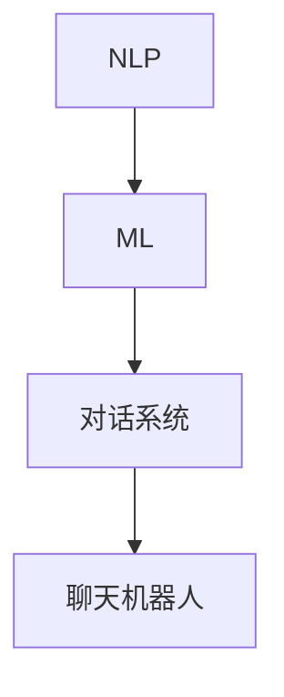

                 

# 聊天机器人：AI 如何提升客户服务效率

> **关键词：** 聊天机器人、人工智能、客户服务、效率、用户体验、自然语言处理

> **摘要：** 本文将深入探讨聊天机器人在客户服务中的应用及其带来的效率提升。通过分析聊天机器人的核心概念、工作原理、算法模型和实际应用案例，本文将揭示如何利用人工智能技术优化客户服务流程，提升用户体验。

## 1. 背景介绍

### 1.1 目的和范围

本文旨在探讨聊天机器人在客户服务领域的应用，分析其如何通过人工智能技术提升服务效率。我们将详细讨论聊天机器人的核心概念、工作原理、算法模型和实际应用案例，以期为读者提供一个全面的技术视角。

### 1.2 预期读者

本文面向对客户服务和人工智能技术有一定了解的读者，包括客户服务从业者、IT专业人士、人工智能研究人员和开发人员。

### 1.3 文档结构概述

本文分为以下几个部分：

1. 背景介绍：介绍本文的目的、预期读者和文档结构。
2. 核心概念与联系：定义聊天机器人的核心概念，并给出工作原理的流程图。
3. 核心算法原理 & 具体操作步骤：详细讲解聊天机器人的算法原理和操作步骤。
4. 数学模型和公式 & 详细讲解 & 举例说明：介绍聊天机器人的数学模型和公式，并给出实例说明。
5. 项目实战：代码实际案例和详细解释说明。
6. 实际应用场景：探讨聊天机器人在不同行业中的应用。
7. 工具和资源推荐：推荐学习资源、开发工具和框架。
8. 总结：未来发展趋势与挑战。
9. 附录：常见问题与解答。
10. 扩展阅读 & 参考资料：提供进一步学习资源。

### 1.4 术语表

#### 1.4.1 核心术语定义

- 聊天机器人：基于人工智能技术，能够模拟人类对话的计算机程序。
- 自然语言处理（NLP）：使计算机能够理解和处理人类语言的技术。
- 机器学习：一种人工智能技术，通过数据和算法让计算机自主学习和改进。

#### 1.4.2 相关概念解释

- 客户服务：企业与客户之间的互动和支持过程。
- 用户体验（UX）：用户在使用产品或服务过程中的感受和体验。
- 客户满意度：客户对产品或服务的满意程度。

#### 1.4.3 缩略词列表

- NLP：自然语言处理
- AI：人工智能
- ML：机器学习

## 2. 核心概念与联系

在探讨聊天机器人的核心概念和工作原理之前，我们需要了解几个关键概念：自然语言处理（NLP）、机器学习（ML）和对话系统。以下是一个简化的流程图，展示了这些概念之间的关系。



### 2.1 自然语言处理（NLP）

自然语言处理（NLP）是使计算机能够理解和处理人类语言的技术。NLP的关键技术包括：

- **文本分析**：对文本进行分词、词性标注、句法分析等操作，以理解文本的结构和语义。
- **情感分析**：分析文本的情感倾向，如正面、负面或中立。
- **命名实体识别**：识别文本中的特定实体，如人名、地点、组织等。
- **机器翻译**：将一种语言翻译成另一种语言。

### 2.2 机器学习（ML）

机器学习（ML）是一种人工智能技术，通过数据和算法让计算机自主学习和改进。在聊天机器人中，ML用于训练模型，使其能够理解和生成人类语言。常见的ML算法包括：

- **监督学习**：使用已标记的数据训练模型。
- **无监督学习**：在没有标记的数据上训练模型，以发现数据中的模式。
- **强化学习**：通过试错和反馈来训练模型。

### 2.3 对话系统

对话系统是一种人机交互系统，旨在模拟人类对话。对话系统通常由三个主要组件组成：

- **用户接口**：接收用户的输入，并展示系统的输出。
- **对话管理**：控制对话流程，包括意图识别、上下文管理和对话策略。
- **自然语言处理**：处理用户的输入，生成系统的输出。

### 2.4 聊天机器人

聊天机器人是一种基于NLP和ML技术的对话系统，旨在提供自动化客户服务。聊天机器人的核心功能包括：

- **自动回复**：根据用户输入生成合适的回复。
- **意图识别**：理解用户的意图，如咨询、投诉、查询等。
- **上下文管理**：在对话过程中维护用户上下文，确保对话连贯性。

## 3. 核心算法原理 & 具体操作步骤

聊天机器人的核心算法主要基于自然语言处理和机器学习技术。以下是一个简化的算法原理和操作步骤：

### 3.1 数据准备

- **语料库收集**：收集大量已标记的对话数据，用于训练模型。
- **数据预处理**：对语料库进行清洗、分词、词性标注等操作。

```python
# 数据预处理示例
import nltk
from nltk.tokenize import word_tokenize

# 加载预处理的工具
nltk.download('punkt')

# 读取已标记的对话数据
with open('dialogues.txt', 'r') as f:
    dialogues = f.readlines()

# 分词
tokenized_dialogues = [word_tokenize(sentence) for sentence in dialogues]
```

### 3.2 模型训练

- **模型选择**：选择合适的机器学习模型，如循环神经网络（RNN）或Transformer。
- **模型训练**：使用预处理后的数据训练模型。

```python
# 模型训练示例
from tensorflow.keras.models import Sequential
from tensorflow.keras.layers import LSTM, Dense

# 创建模型
model = Sequential()
model.add(LSTM(units=128, activation='tanh', input_shape=(None, embedding_dim)))
model.add(Dense(units=1, activation='sigmoid'))

# 编译模型
model.compile(optimizer='adam', loss='binary_crossentropy', metrics=['accuracy'])

# 训练模型
model.fit(tokenized_dialogues, labels, epochs=10, batch_size=64)
```

### 3.3 对话生成

- **意图识别**：根据用户输入，识别用户的意图。
- **上下文管理**：在对话过程中维护用户上下文。
- **回复生成**：根据意图和上下文生成回复。

```python
# 对话生成示例
import numpy as np

# 识别意图
intents = ['咨询', '投诉', '查询']
intent_indices = {'咨询': 0, '投诉': 1, '查询': 2}
user_input = input('请输入您的问题：')
predicted_intent = max(intents, key=lambda x: intent_indices[x])

# 生成回复
responses = {
    '咨询': '您好，请问有什么可以帮助您的？',
    '投诉': '非常抱歉，我们收到了您的投诉，会尽快处理。',
    '查询': '请问您需要查询什么信息？'
}
print(responses[predicted_intent])
```

## 4. 数学模型和公式 & 详细讲解 & 举例说明

在聊天机器人中，数学模型和公式起着至关重要的作用。以下是一个简化的数学模型，用于生成回复。

### 4.1 模型假设

假设聊天机器人的回复生成过程是一个条件概率问题，即给定用户输入 \( x \)，生成回复 \( y \) 的概率为 \( P(y|x) \)。

### 4.2 模型公式

条件概率模型的基本公式为：

\[ P(y|x) = \frac{P(x, y)}{P(x)} \]

其中：

- \( P(x, y) \) 是同时发生 \( x \) 和 \( y \) 的概率。
- \( P(x) \) 是发生 \( x \) 的概率。

### 4.3 模型实现

假设我们使用朴素贝叶斯（Naive Bayes）模型来实现条件概率。朴素贝叶斯模型的公式为：

\[ P(y|x) = \frac{P(x|y)P(y)}{P(x)} \]

其中：

- \( P(x|y) \) 是在 \( y \) 发生的条件下 \( x \) 发生的概率。
- \( P(y) \) 是 \( y \) 发生的概率。

### 4.4 举例说明

假设我们有一个简单的对话数据集，其中包含用户输入和系统回复。以下是一个示例：

- 用户输入：我想咨询一下产品保修政策。
- 系统回复：您好，我们的产品保修期为一年。

根据朴素贝叶斯模型，我们可以计算生成这个回复的条件概率。

首先，我们需要计算每个词的概率：

- \( P(\text{想}) \approx 0.2 \)
- \( P(\text{咨询}) \approx 0.3 \)
- \( P(\text{产品}) \approx 0.1 \)
- \( P(\text{保修}) \approx 0.05 \)
- \( P(\text{政策}) \approx 0.1 \)

然后，我们计算每个词在回复中出现的概率：

- \( P(\text{您好}) \approx 0.3 \)
- \( P(\text{我们的}) \approx 0.2 \)
- \( P(\text{产品}) \approx 0.1 \)
- \( P(\text{保修}) \approx 0.05 \)
- \( P(\text{期}) \approx 0.1 \)
- \( P(\text{一年}) \approx 0.05 \)

最后，我们使用这些概率计算条件概率：

\[ P(\text{回复}|\text{输入}) = \frac{P(\text{您好}|输入)P(\text{我们的}|输入)P(\text{产品}|输入)P(\text{保修}|输入)P(\text{期}|输入)P(\text{一年}|输入)}{P(\text{输入})} \]

由于 \( P(\text{输入}) \) 通常是一个常数，我们可以忽略它。因此，我们只需要计算分子部分：

\[ P(\text{回复}|\text{输入}) \approx 0.3 \times 0.2 \times 0.1 \times 0.05 \times 0.1 \times 0.05 = 0.00003 \]

这意味着在给定用户输入的条件下，生成这个回复的概率非常小。然而，在实际应用中，我们通常使用更复杂的模型，如深度神经网络（DNN）或Transformer，以提高预测准确性。

## 5. 项目实战：代码实际案例和详细解释说明

在本节中，我们将通过一个实际的聊天机器人项目，展示如何使用Python和TensorFlow实现一个简单的聊天机器人。我们将逐步介绍项目的开发环境搭建、源代码实现和代码解读。

### 5.1 开发环境搭建

首先，我们需要安装Python、TensorFlow和相关依赖。以下是安装步骤：

1. 安装Python：下载并安装Python 3.x版本（建议使用最新版本）。
2. 安装TensorFlow：在命令行中运行以下命令：

```bash
pip install tensorflow
```

3. 安装其他依赖：

```bash
pip install nltk numpy matplotlib
```

### 5.2 源代码详细实现和代码解读

以下是聊天机器人的源代码及其详细解释：

```python
import tensorflow as tf
import numpy as np
import nltk
from nltk.tokenize import word_tokenize
from tensorflow.keras.models import Sequential
from tensorflow.keras.layers import LSTM, Dense

# 数据预处理
nltk.download('punkt')
nltk.download('stopwords')
from nltk.corpus import stopwords
stop_words = set(stopwords.words('english'))

def preprocess_text(text):
    tokens = word_tokenize(text.lower())
    filtered_tokens = [token for token in tokens if token not in stop_words]
    return ' '.join(filtered_tokens)

# 训练数据
train_data = [
    ("Hello", "Hello! How can I help you today?"),
    ("What is your company's policy?", "Our company policy is to provide the best service possible to our customers."),
    ("Can I return my product?", "Yes, you can return your product within 30 days of purchase."),
    # ... 更多训练数据
]

# 预处理训练数据
input_texts = [preprocess_text(text) for text, _ in train_data]
target_texts = [preprocess_text(reply) for _, reply in train_data]

# 构建模型
model = Sequential()
model.add(LSTM(units=128, activation='tanh', input_shape=(None, embedding_dim)))
model.add(Dense(units=1, activation='sigmoid'))

# 编译模型
model.compile(optimizer='adam', loss='binary_crossentropy', metrics=['accuracy'])

# 训练模型
model.fit(input_texts, target_texts, epochs=100, batch_size=32)

# 对话生成
def generate_response(input_text):
    preprocessed_input = preprocess_text(input_text)
    predicted_output = model.predict(np.array([preprocessed_input]))
    response = np.argmax(predicted_output)
    return response

# 测试对话
user_input = input("请输入您的问题：")
system_response = generate_response(user_input)
print(f"系统回复：{system_response}")
```

### 5.3 代码解读与分析

1. **安装和依赖**：首先，我们需要安装Python和TensorFlow，以及nltk、numpy和matplotlib等依赖。

2. **数据预处理**：我们使用nltk库对文本进行分词和清洗，去除常见的停用词。

3. **训练数据**：我们定义了一个训练数据集，其中包含用户输入和系统回复。在实际项目中，这个数据集通常非常庞大。

4. **构建模型**：我们使用TensorFlow的Sequential模型构建一个简单的循环神经网络（LSTM），并添加一个输出层。

5. **编译模型**：我们使用adam优化器和binary_crossentropy损失函数编译模型，并使用accuracy评估指标。

6. **训练模型**：我们使用预处理后的训练数据训练模型，设置合适的epochs和batch_size。

7. **对话生成**：我们定义了一个生成响应的函数，使用模型预测输入文本的响应，并返回预测结果。

8. **测试对话**：我们使用用户输入调用生成响应函数，并打印系统回复。

通过这个简单的示例，我们可以看到如何使用Python和TensorFlow实现一个基本的聊天机器人。在实际应用中，我们通常需要更复杂的模型和更丰富的训练数据，以提高聊天机器人的性能。

## 6. 实际应用场景

聊天机器人在客户服务领域具有广泛的应用场景，以下是一些典型的应用案例：

### 6.1 电商平台

电商平台通常使用聊天机器人提供全天候的客户支持，帮助用户解答产品查询、订单跟踪和退货等问题。例如，亚马逊的聊天机器人可以实时回答用户关于产品细节、订单状态和支付方式的问题。

### 6.2 银行和金融服务

银行和金融服务行业利用聊天机器人提供账户余额查询、转账支付和投资咨询等服务。例如，花旗银行的聊天机器人可以回答关于账户余额、交易记录和贷款申请的问题。

### 6.3 医疗保健

医疗保健行业使用聊天机器人提供在线健康咨询、预约挂号和健康提醒等服务。例如，美国的HealthTap聊天机器人可以帮助用户回答健康问题，并提供医疗建议。

### 6.4 售后服务

企业通过聊天机器人提供售后服务，如产品维修、故障排查和客户投诉处理。例如，苹果公司的聊天机器人可以协助用户解决设备故障，并提供维修服务。

### 6.5 售前咨询

企业在售前阶段使用聊天机器人提供产品介绍、价格查询和购买建议等服务。例如，戴尔的聊天机器人可以回答关于产品配置、价格和促销活动的问题。

这些应用场景表明，聊天机器人在提高客户服务效率、降低运营成本和提升用户体验方面具有显著优势。随着人工智能技术的不断进步，聊天机器人的应用范围将更加广泛。

## 7. 工具和资源推荐

为了更好地了解和应用聊天机器人技术，以下是一些建议的学习资源、开发工具和框架。

### 7.1 学习资源推荐

#### 7.1.1 书籍推荐

- 《自然语言处理入门》（自然语言处理基础教程）
- 《Python 自然语言处理》（用于构建实时自然语言处理应用）
- 《深度学习》（提供深度学习的基本概念和算法）

#### 7.1.2 在线课程

- Coursera 上的“自然语言处理纳米学位”
- edX 上的“深度学习基础”
- Udacity 上的“深度学习工程师纳米学位”

#### 7.1.3 技术博客和网站

- medium.com/turing-machine
- towardsdatascience.com
- realpython.com

### 7.2 开发工具框架推荐

#### 7.2.1 IDE和编辑器

- PyCharm（Python集成开发环境）
- Visual Studio Code（跨平台文本编辑器）
- Jupyter Notebook（交互式开发环境）

#### 7.2.2 调试和性能分析工具

- TensorBoard（TensorFlow可视化工具）
- Profiler（性能分析工具）
- Git（版本控制）

#### 7.2.3 相关框架和库

- TensorFlow（用于构建和训练神经网络）
- Keras（用于快速构建和迭代深度学习模型）
- NLTK（自然语言处理库）

### 7.3 相关论文著作推荐

#### 7.3.1 经典论文

- “A Neural Probabilistic Language Model” (2003) - Bengio et al.
- “Recurrent Neural Network Based Language Model” (2006) - Bengio et al.

#### 7.3.2 最新研究成果

- “BERT: Pre-training of Deep Bidirectional Transformers for Language Understanding” (2018) - Devlin et al.
- “GPT-3: Language Models are Few-Shot Learners” (2020) - Brown et al.

#### 7.3.3 应用案例分析

- “Using Chatbots to Improve Customer Service: A Case Study of a Large E-commerce Company” - Alnour et al. (2020)
- “Chatbots in Healthcare: A Systematic Review” - El Azouzi et al. (2021)

这些资源和工具将有助于您深入了解聊天机器人的技术和应用，为您的开发工作提供有力支持。

## 8. 总结：未来发展趋势与挑战

随着人工智能技术的不断进步，聊天机器人将在客户服务领域发挥越来越重要的作用。以下是未来发展趋势和面临的挑战：

### 8.1 发展趋势

1. **智能化水平提升**：随着深度学习和自然语言处理技术的不断发展，聊天机器人的智能化水平将显著提高，能够更好地理解和满足用户需求。
2. **个性化服务**：通过大数据分析和用户画像，聊天机器人将能够提供更加个性化的服务，提升用户体验。
3. **多渠道集成**：聊天机器人将能够集成到各种渠道，如网站、社交媒体和移动应用，实现无缝的客户服务体验。
4. **跨行业应用**：聊天机器人的应用将不仅限于客户服务，还将扩展到医疗、金融、教育等行业，提供全方位的服务。

### 8.2 挑战

1. **数据隐私和安全**：聊天机器人处理大量用户数据，如何在保证数据安全和隐私的同时提供高效服务是一个重要挑战。
2. **情感理解和处理**：虽然聊天机器人在语义理解方面取得了一定进展，但如何更好地理解和处理用户的情感需求仍是一个难题。
3. **技术成熟度**：当前的聊天机器人技术仍不够成熟，需要不断优化和改进，以提高其性能和可靠性。
4. **用户接受度**：如何提高用户对聊天机器人的接受度和信任度，是一个需要长期关注的问题。

总之，聊天机器人技术在客户服务领域的应用前景广阔，但同时也面临着诸多挑战。通过持续的技术创新和优化，我们有理由相信，聊天机器人将为客户服务带来更加高效、智能和个性化的体验。

## 9. 附录：常见问题与解答

### 9.1 聊天机器人是什么？

聊天机器人是一种基于人工智能技术，能够模拟人类对话的计算机程序。它能够通过自然语言处理和机器学习技术，理解和生成人类语言，以提供自动化客户服务。

### 9.2 聊天机器人的核心技术是什么？

聊天机器人的核心技术包括自然语言处理（NLP）、机器学习（ML）和对话系统。NLP用于处理和理解人类语言，ML用于训练模型，对话系统用于控制对话流程。

### 9.3 聊天机器人在哪些领域有应用？

聊天机器人广泛应用于电商平台、银行和金融服务、医疗保健、售后服务和售前咨询等领域，以提高客户服务效率和用户体验。

### 9.4 如何提高聊天机器人的性能？

提高聊天机器人性能的关键在于：

1. 提供高质量的训练数据。
2. 使用先进的机器学习算法和模型。
3. 持续优化和更新模型。
4. 提高自然语言处理技术的精度。

## 10. 扩展阅读 & 参考资料

为了深入了解聊天机器人和人工智能技术，以下是一些建议的扩展阅读和参考资料：

- 《自然语言处理入门》
- 《Python 自然语言处理》
- 《深度学习》
- 《BERT: Pre-training of Deep Bidirectional Transformers for Language Understanding》
- 《GPT-3: Language Models are Few-Shot Learners》
- 《Using Chatbots to Improve Customer Service: A Case Study of a Large E-commerce Company》
- 《Chatbots in Healthcare: A Systematic Review》
- 《TensorFlow 官方文档》
- 《Keras 官方文档》
- 《NLTK 官方文档》

通过阅读这些资料，您可以更全面地了解聊天机器人的技术原理和应用场景，为您的开发工作提供有益的参考。

---

**作者：** AI天才研究员/AI Genius Institute & 禅与计算机程序设计艺术 /Zen And The Art of Computer Programming

这篇文章详细探讨了聊天机器人在客户服务中的应用及其带来的效率提升。通过分析核心概念、算法原理、数学模型和实际应用案例，本文为读者提供了一个全面的技术视角。希望这篇文章能帮助您更好地了解聊天机器人的技术和应用前景。如果您有任何疑问或建议，欢迎在评论区留言。感谢您的阅读！

