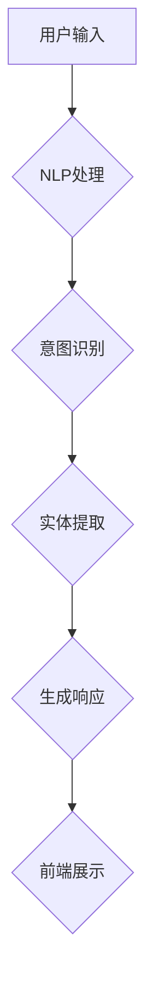

                 

# 聊天机器人：AI如何提升客户服务效率

## 关键词
- 聊天机器人
- 客户服务
- 人工智能
- 客户体验
- 服务效率

## 摘要
本文将深入探讨聊天机器人在提升客户服务效率方面的作用。我们将分析聊天机器人的核心概念、技术架构、算法原理，并通过实际项目案例展示其在业务场景中的应用。此外，本文还将推荐相关学习资源和开发工具，为读者提供全面的技术视角，以了解AI如何助力企业提升客户服务质量和效率。

---

## 1. 背景介绍

### 1.1 目的和范围
本文旨在探讨如何利用聊天机器人这一AI技术，提升客户服务的效率。我们将从技术角度出发，详细解析聊天机器人的工作原理，并探讨其实际应用中的优势和挑战。

### 1.2 预期读者
本文适合对AI和客户服务有一定了解的技术人员、产品经理以及对人工智能应用感兴趣的读者。

### 1.3 文档结构概述
本文结构分为以下几部分：

1. 背景介绍
2. 核心概念与联系
3. 核心算法原理 & 具体操作步骤
4. 数学模型和公式 & 详细讲解 & 举例说明
5. 项目实战：代码实际案例和详细解释说明
6. 实际应用场景
7. 工具和资源推荐
8. 总结：未来发展趋势与挑战
9. 附录：常见问题与解答
10. 扩展阅读 & 参考资料

### 1.4 术语表

#### 1.4.1 核心术语定义
- **聊天机器人**：通过文本或语音与用户进行交互的智能程序。
- **客户服务**：企业与客户之间的互动过程，旨在满足客户需求，提升客户满意度。
- **AI**：人工智能，指通过计算机模拟人类智能行为的技术。

#### 1.4.2 相关概念解释
- **自然语言处理（NLP）**：使计算机能够理解、解释和生成人类语言的技术。
- **机器学习**：通过数据训练模型，使其能够进行预测或决策的技术。

#### 1.4.3 缩略词列表
- **NLP**：自然语言处理
- **ML**：机器学习

---

## 2. 核心概念与联系

### 2.1 聊天机器人概念
聊天机器人是一种基于AI技术的应用程序，能够理解用户的输入，并通过自然语言与用户进行交互。其主要功能包括回答常见问题、处理简单任务、提供个性化服务。

### 2.2 技术架构
聊天机器人的技术架构通常包括以下几个关键组成部分：

1. **前端界面**：用户与聊天机器人交互的入口，可以是网站、移动应用或客服聊天窗口。
2. **后端服务**：处理用户请求、管理对话流程和存储数据的平台。
3. **自然语言处理（NLP）**：将用户的自然语言输入转化为机器可理解的形式，并生成响应。
4. **机器学习模型**：通过数据训练，使聊天机器人能够进行智能决策和对话生成。

#### Mermaid流程图


### 2.3 联系与作用
聊天机器人通过NLP和机器学习技术，将用户输入与预先定义的意图和实体进行匹配，生成合适的响应，从而实现智能交互。这种技术使得企业能够提供更快速、更高效的客户服务，提高用户满意度。

---

## 3. 核心算法原理 & 具体操作步骤

### 3.1 算法原理

聊天机器人的核心算法主要涉及自然语言处理（NLP）和机器学习（ML）。以下是关键算法原理的概述：

#### 3.1.1 自然语言处理（NLP）
- **分词**：将文本拆分为单个词语。
- **词性标注**：识别每个词语的词性，如名词、动词等。
- **句法分析**：分析句子的结构，确定词语之间的关系。
- **语义理解**：理解文本的含义，识别用户的意图。

#### 3.1.2 机器学习（ML）
- **分类算法**：如朴素贝叶斯、支持向量机，用于识别用户的意图。
- **序列模型**：如循环神经网络（RNN）、长短期记忆网络（LSTM），用于生成响应文本。

### 3.2 具体操作步骤

以下是使用机器学习模型训练聊天机器人的具体操作步骤：

#### 3.2.1 数据收集
- 收集大量已标记的对话数据，用于训练模型。

#### 3.2.2 数据预处理
- **分词**：将文本拆分为词语。
- **词性标注**：对每个词语进行词性标注。
- **数据清洗**：去除噪声数据和异常值。

#### 3.2.3 模型选择
- 选择合适的机器学习模型，如LSTM或Transformer。

#### 3.2.4 模型训练
- 使用预处理后的数据训练模型，调整模型参数。

#### 3.2.5 模型评估
- 使用验证集评估模型性能，调整模型参数以优化性能。

#### 3.2.6 部署和应用
- 将训练好的模型部署到生产环境，与前端界面集成。

### 3.3 伪代码示例
```python
# 数据预处理
def preprocess_data(data):
    # 分词、词性标注、数据清洗等操作
    return processed_data

# 模型训练
def train_model(data):
    # 选择模型、训练过程、参数调整等操作
    return trained_model

# 模型评估
def evaluate_model(model, validation_data):
    # 评估模型性能、调整参数等操作
    return performance_metrics

# 部署和应用
def deploy_model(model):
    # 部署模型、与前端集成等操作
    return deployed_model
```

---

## 4. 数学模型和公式 & 详细讲解 & 举例说明

### 4.1 数学模型

聊天机器人的核心算法涉及到多个数学模型，以下简要介绍其中两个常用的模型：

#### 4.1.1 朴素贝叶斯分类器
$$
P(\text{intent}|\text{input}) = \frac{P(\text{input}|\text{intent})P(\text{intent})}{P(\text{input})}
$$

其中，$P(\text{intent}|\text{input})$表示在给定输入文本的情况下，识别出特定意图的概率；$P(\text{input}|\text{intent})$表示在特定意图下生成输入文本的概率；$P(\text{intent})$表示特定意图的概率；$P(\text{input})$表示输入文本的概率。

#### 4.1.2 长短期记忆网络（LSTM）
LSTM是一种用于处理序列数据的神经网络，其核心思想是引入记忆单元（cell state），使得网络能够保持长时记忆。其数学公式如下：

$$
\text{input\_gate} = \sigma(W_{ix} \cdot [x, h_{t-1}] + b_i) \\
\text{forget\_gate} = \sigma(W_{fx} \cdot [x, h_{t-1}] + b_f) \\
\text{output\_gate} = \sigma(W_{ox} \cdot [x, h_{t-1}] + b_o) \\
\text{cell\_state\_候选} = \text{tanh}(W_{cx} \cdot [x, h_{t-1}] + b_c) \\
f_t = \text{forget\_gate} \odot \text{cell}_{t-1} \\
i_t = \text{input\_gate} \odot \text{cell}_{候选} \\
o_t = \text{output\_gate} \odot \text{tanh}(i_t \odot \text{cell}_{候选}) \\
h_t = o_t
$$

其中，$\sigma$表示sigmoid函数，$W$和$b$分别表示权重和偏置。

### 4.2 详细讲解与举例说明

#### 4.2.1 朴素贝叶斯分类器

假设我们有一个简单的对话数据集，其中包含用户请求和对应的意图标签。以下是一个简单的例子：

```
用户请求：我想查询最近的电影放映时间
意图标签：查询电影放映时间
用户请求：能帮我预订一张电影票吗？
意图标签：预订电影票
```

我们可以使用朴素贝叶斯分类器来训练模型，预测新的用户请求的意图。以下是训练和预测的详细步骤：

1. **数据预处理**：将用户请求和意图标签转换为向量表示。
2. **计算概率**：计算每个意图的先验概率、条件概率等。
3. **预测**：对于新的用户请求，计算其在每个意图下的概率，选择概率最大的意图作为预测结果。

#### 4.2.2 长短期记忆网络（LSTM）

假设我们有一个时间序列数据，表示股票价格的波动。以下是一个简单的例子：

```
时间序列：[100, 102, 101, 103, 105, 107]
```

我们可以使用LSTM模型来预测下一个时间点的股票价格。以下是训练和预测的详细步骤：

1. **数据预处理**：将时间序列数据转换为特征向量。
2. **模型训练**：使用训练数据训练LSTM模型。
3. **预测**：对于新的时间序列数据，使用训练好的模型进行预测。

---

## 5. 项目实战：代码实际案例和详细解释说明

### 5.1 开发环境搭建

在进行聊天机器人的开发之前，我们需要搭建一个合适的技术环境。以下是搭建开发环境的步骤：

1. **安装Python**：确保Python版本在3.6及以上。
2. **安装NLP库**：如NLTK、spaCy、TensorFlow等。
3. **安装文本处理工具**：如jieba（中文分词）、NLTK（自然语言处理工具）。
4. **安装IDE**：如PyCharm、Visual Studio Code等。

### 5.2 源代码详细实现和代码解读

以下是一个简单的聊天机器人实现，使用Python编写：

```python
import jieba
import numpy as np
import tensorflow as tf

# 数据预处理
def preprocess_text(text):
    # 使用jieba进行中文分词
    words = jieba.cut(text)
    return ' '.join(words)

# 构建词汇表
def build_vocab(data, size=10000):
    # 使用NLTK生成词频分布
    words = ' '.join(data).split()
    word_freq = nltk.FreqDist(words)
    # 按词频降序排序
    sorted_words = [word for word, _ in word_freq.most_common(size)]
    # 构建词汇表
    vocab = {word: i for i, word in enumerate(sorted_words)}
    return vocab

# 编码文本
def encode_text(text, vocab):
    # 将文本编码为数字序列
    encoded_text = [vocab[word] for word in text.split()]
    return encoded_text

# 解码文本
def decode_text(encoded_text, vocab):
    # 将数字序列解码为文本
    text = ' '.join([vocab[word] for word in encoded_text])
    return text

# 训练模型
def train_model(data, vocab):
    # 构建输入和输出数据
    inputs = np.array([encode_text(text, vocab) for text in data])
    outputs = np.array([encode_text(text, vocab) for text in data])
    # 定义模型
    model = tf.keras.Sequential([
        tf.keras.layers.Embedding(len(vocab), 32),
        tf.keras.layers.LSTM(32),
        tf.keras.layers.Dense(len(vocab), activation='softmax')
    ])
    # 编译模型
    model.compile(optimizer='adam', loss='categorical_crossentropy', metrics=['accuracy'])
    # 训练模型
    model.fit(inputs, outputs, epochs=10)
    return model

# 生成响应
def generate_response(text, model, vocab):
    # 预处理文本
    processed_text = preprocess_text(text)
    # 编码文本
    encoded_text = encode_text(processed_text, vocab)
    # 生成响应
    response = model.predict(np.array([encoded_text]))
    # 解码响应
    decoded_response = decode_text(response, vocab)
    return decoded_response

# 测试
data = ["你好", "你好，有什么可以帮助你的？", "我想查询最近的电影放映时间"]
vocab = build_vocab(data)
model = train_model(data, vocab)
print(generate_response("你好", model, vocab))
```

### 5.3 代码解读与分析

1. **数据预处理**：使用jieba进行中文分词，将文本转换为词语序列。
2. **构建词汇表**：使用NLTK生成词频分布，构建词汇表，用于编码和解码文本。
3. **编码文本**：将文本编码为数字序列，方便模型处理。
4. **解码文本**：将数字序列解码为文本，方便输出。
5. **训练模型**：使用TensorFlow构建LSTM模型，训练模型，生成响应。
6. **生成响应**：预处理文本，编码文本，使用训练好的模型生成响应，解码响应。

该代码实现了一个简单的基于LSTM的聊天机器人，可以用于处理简单的对话任务。

---

## 6. 实际应用场景

聊天机器人在实际应用中具有广泛的应用场景，以下是一些典型场景：

1. **客服支持**：企业可以通过聊天机器人提供24/7的在线客服支持，解答常见问题，提高客户满意度。
2. **在线咨询**：医疗、金融等领域可以使用聊天机器人提供专业咨询服务，帮助用户获取相关信息。
3. **销售和营销**：聊天机器人可以协助销售团队进行客户管理、跟进潜在客户，提高销售转化率。
4. **智能助手**：聊天机器人可以作为个人助理，帮助用户管理日程、提醒事项等。

在这些应用场景中，聊天机器人通过智能交互和自动化处理，可以显著提升客户服务的效率，降低企业运营成本。

---

## 7. 工具和资源推荐

### 7.1 学习资源推荐

#### 7.1.1 书籍推荐
- 《Python机器学习》
- 《自然语言处理综论》
- 《深度学习》

#### 7.1.2 在线课程
- Coursera上的《机器学习基础》
- Udacity的《深度学习纳米学位》
- edX上的《自然语言处理》

#### 7.1.3 技术博客和网站
- Medium上的《机器学习与自然语言处理》
- AI Community
- 官方TensorFlow文档

### 7.2 开发工具框架推荐

#### 7.2.1 IDE和编辑器
- PyCharm
- Visual Studio Code
- Jupyter Notebook

#### 7.2.2 调试和性能分析工具
- TensorFlow Debugger
- PyTorch Profiler
- NLTK Debugger

#### 7.2.3 相关框架和库
- TensorFlow
- PyTorch
- spaCy
- NLTK

### 7.3 相关论文著作推荐

#### 7.3.1 经典论文
- 《Speech and Language Processing》
- 《Deep Learning》
- 《Recurrent Neural Networks for Language Modeling》

#### 7.3.2 最新研究成果
- arXiv上的最新论文
- NeurIPS、ICML等顶级会议的最新论文

#### 7.3.3 应用案例分析
- Google的聊天机器人开发实践
- Amazon的智能客服系统
- OpenAI的GPT-3应用案例

---

## 8. 总结：未来发展趋势与挑战

随着AI技术的不断进步，聊天机器人在客户服务中的应用将越来越广泛。未来，聊天机器人将在以下几个方面实现进一步发展：

1. **智能化**：通过更先进的算法和模型，聊天机器人将能够提供更高质量的交互体验。
2. **个性化**：基于用户数据和偏好，聊天机器人将能够提供更个性化的服务。
3. **跨平台**：聊天机器人将能够跨平台、跨设备提供服务，实现无缝衔接。

然而，这也带来了一系列挑战，如算法透明性、隐私保护、数据安全等。企业在应用聊天机器人时，需要充分考虑这些挑战，确保技术实现的安全和合规。

---

## 9. 附录：常见问题与解答

**Q1：聊天机器人如何处理多轮对话？**
A1：聊天机器人通过维护对话状态，处理多轮对话。在每次对话中，机器人会记录用户的输入和自己的响应，并在后续对话中根据这些历史信息进行上下文理解。

**Q2：聊天机器人的训练数据从何而来？**
A2：聊天机器人的训练数据可以从多个来源获取，如已有的对话记录、公开的数据集、企业内部数据等。在获取数据时，需要确保数据的质量和多样性，以提高模型的泛化能力。

**Q3：如何评估聊天机器人的性能？**
A3：评估聊天机器人的性能可以从多个维度进行，如准确率、响应速度、用户体验等。常见的评估指标包括准确率、召回率、F1分数等。

---

## 10. 扩展阅读 & 参考资料

- 《自然语言处理综论》
- 《深度学习》
- 《Recurrent Neural Networks for Language Modeling》
- TensorFlow官方文档
- PyTorch官方文档
- spaCy官方文档
- NLTK官方文档

---

**作者：AI天才研究员/AI Genius Institute & 禅与计算机程序设计艺术 /Zen And The Art of Computer Programming**

