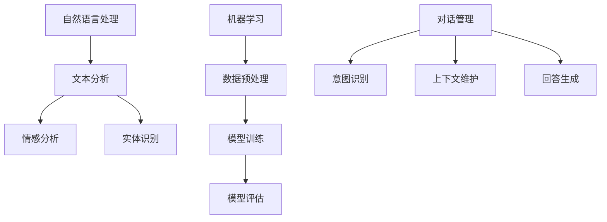

                 

# 聊天机器人：AI如何提升客户服务效率，解决用户问题

> **关键词：** 聊天机器人，AI，客户服务，效率提升，问题解决  
> **摘要：** 本文将深入探讨聊天机器人的技术原理、应用场景及其在提升客户服务效率、解决用户问题方面的作用。通过一步一步的分析推理，我们将理解如何利用AI技术打造高效的客户服务系统。

## 1. 背景介绍

### 1.1 目的和范围

本文旨在探讨聊天机器人在客户服务中的应用，以及如何通过人工智能（AI）技术来提升服务效率和解决用户问题。我们将讨论聊天机器人的技术原理、架构设计、算法实现，并结合实际项目案例进行详细分析。

### 1.2 预期读者

本文适合对AI和客户服务有一定了解的技术人员、产品经理以及AI爱好者。读者应具备基本的编程知识和对机器学习、自然语言处理等AI技术的初步认识。

### 1.3 文档结构概述

本文结构如下：

1. 背景介绍：介绍文章的目的和预期读者。
2. 核心概念与联系：定义聊天机器人的关键概念，并使用Mermaid流程图展示其架构。
3. 核心算法原理 & 具体操作步骤：详细阐述聊天机器人的算法原理和实现步骤。
4. 数学模型和公式 & 详细讲解 & 举例说明：介绍聊天机器人的数学模型及其应用。
5. 项目实战：通过实际案例展示聊天机器人的开发过程。
6. 实际应用场景：分析聊天机器人在各种场景下的应用。
7. 工具和资源推荐：推荐相关学习资源和开发工具。
8. 总结：展望聊天机器人的未来发展趋势与挑战。
9. 附录：常见问题与解答。
10. 扩展阅读 & 参考资料。

### 1.4 术语表

#### 1.4.1 核心术语定义

- 聊天机器人：一种基于人工智能技术的软件程序，能够通过文本或语音与用户进行交互。
- 客户服务：企业为满足客户需求而提供的服务，包括售前咨询、售后服务等。
- 自然语言处理（NLP）：使计算机能够理解和生成自然语言的技术。
- 机器学习（ML）：让计算机从数据中学习并作出决策或预测的技术。

#### 1.4.2 相关概念解释

- 感知计算：聊天机器人理解用户意图和回答问题的能力。
- 对话管理：聊天机器人在对话过程中维护用户意图和对话流程的机制。
- 用户画像：对用户特征和偏好的描述，用于个性化服务。

#### 1.4.3 缩略词列表

- NLP：自然语言处理
- ML：机器学习
- AI：人工智能
- CMS：客户管理系统
- API：应用程序接口

## 2. 核心概念与联系

聊天机器人的核心概念包括自然语言处理、机器学习和对话管理。以下是一个简单的Mermaid流程图，用于展示这些概念之间的联系。



### 2.1 自然语言处理

自然语言处理是聊天机器人的核心技术之一，它使计算机能够理解和生成自然语言。以下是NLP的几个关键步骤：

1. **文本分析**：将文本分解为词、句等基本元素。
2. **情感分析**：分析文本的情感倾向，如正面、负面或中立。
3. **实体识别**：识别文本中的名词、地点、组织等实体。

### 2.2 机器学习

机器学习是聊天机器人的另一项关键技术，它使计算机能够从数据中学习并改进性能。以下是ML的几个关键步骤：

1. **数据预处理**：清洗和准备数据，以供模型训练。
2. **模型训练**：使用训练数据训练模型，以识别用户意图和生成回答。
3. **模型评估**：评估模型的性能，并通过测试数据调整模型参数。

### 2.3 对话管理

对话管理是确保聊天机器人能够有效与用户进行交互的机制。以下是DM的几个关键步骤：

1. **意图识别**：识别用户的意图，如咨询产品信息、解决故障等。
2. **上下文维护**：跟踪对话的上下文信息，以保持对话连贯性。
3. **回答生成**：根据用户意图和上下文生成合适的回答。

## 3. 核心算法原理 & 具体操作步骤

### 3.1 自然语言处理算法原理

自然语言处理算法主要基于深度学习和神经网络技术。以下是NLP算法的基本原理：

1. **词嵌入**：将单词转换为向量表示，以在低维空间中表示单词的语义。
2. **序列模型**：使用循环神经网络（RNN）或长短期记忆网络（LSTM）处理文本序列。
3. **分类器**：使用分类器对文本进行情感分析、实体识别等任务。

### 3.2 机器学习算法原理

机器学习算法主要用于训练模型以识别用户意图和生成回答。以下是ML算法的基本原理：

1. **监督学习**：使用带有标签的训练数据训练模型。
2. **无监督学习**：在没有标签数据的情况下训练模型。
3. **强化学习**：通过与环境交互来优化模型。

### 3.3 对话管理算法原理

对话管理算法主要基于状态机或图模型。以下是DM算法的基本原理：

1. **状态机**：使用状态机来表示对话的不同阶段和用户意图。
2. **图模型**：使用图模型来表示对话中的实体和关系。

### 3.4 实现步骤

1. **数据收集**：收集用户对话数据和相关的标签。
2. **数据预处理**：清洗和准备数据，以供模型训练。
3. **模型训练**：使用训练数据训练NLP、ML和DM模型。
4. **模型评估**：使用测试数据评估模型性能。
5. **模型部署**：将训练好的模型部署到生产环境中。

以下是NLP模型的伪代码实现：

```python
# 伪代码：自然语言处理模型训练

# 加载预训练词向量
word_embeddings = load_pretrained_embeddings()

# 加载训练数据
train_data = load_training_data()

# 初始化NLP模型
nlp_model = initialize_nlp_model(word_embeddings)

# 训练模型
nlp_model.fit(train_data)

# 评估模型
evaluate_nlp_model(nlp_model, test_data)
```

## 4. 数学模型和公式 & 详细讲解 & 举例说明

### 4.1 数学模型

聊天机器人的核心数学模型包括词嵌入、神经网络和分类器。以下是这些模型的基本公式：

1. **词嵌入**：
   \[
   \text{word\_vector} = \text{Embedding}(\text{word})
   \]

2. **循环神经网络（RNN）**：
   \[
   \text{output} = \text{RNN}(\text{input}, \text{previous\_output}, \text{weights}, \text{biases})
   \]

3. **长短期记忆网络（LSTM）**：
   \[
   \text{output} = \text{LSTM}(\text{input}, \text{previous\_output}, \text{weights}, \text{biases})
   \]

4. **分类器**：
   \[
   \text{prediction} = \text{softmax}(\text{model}(\text{input}))
   \]

### 4.2 举例说明

假设我们有一个简单的文本分类任务，需要将文本分为正面和负面两类。以下是模型的实现过程：

1. **词嵌入**：
   将输入文本中的每个单词转换为词向量。

2. **循环神经网络（RNN）**：
   使用RNN对词向量进行序列建模，提取文本的语义特征。

3. **分类器**：
   使用softmax函数对提取的特征进行分类。

以下是伪代码示例：

```python
# 伪代码：文本分类模型

# 加载预训练词向量
word_embeddings = load_pretrained_embeddings()

# 初始化RNN模型
rnn_model = initialize_rnn_model(word_embeddings)

# 加载训练数据
train_data = load_training_data()

# 训练模型
rnn_model.fit(train_data)

# 评估模型
evaluate_rnn_model(rnn_model, test_data)
```

## 5. 项目实战：代码实际案例和详细解释说明

### 5.1 开发环境搭建

在本节中，我们将介绍如何搭建一个基本的聊天机器人开发环境。以下是所需的步骤：

1. **安装Python环境**：确保已安装Python 3.7或更高版本。
2. **安装深度学习框架**：我们使用TensorFlow作为深度学习框架。可以通过以下命令安装：
   ```bash
   pip install tensorflow
   ```

3. **安装自然语言处理库**：我们使用NLTK和spaCy进行自然语言处理。可以通过以下命令安装：
   ```bash
   pip install nltk spacy
   ```
   安装完成后，运行以下代码下载spaCy的中文模型：
   ```python
   import spacy
   spacy.cli.download("zh_core_web_sm")
   ```

### 5.2 源代码详细实现和代码解读

以下是聊天机器人的基本实现代码：

```python
# 聊天机器人实现

import tensorflow as tf
import spacy
from nltk.tokenize import word_tokenize
from nltk.corpus import stopwords

# 加载中文模型
nlp = spacy.load("zh_core_web_sm")

# 加载训练数据
train_data = load_training_data()

# 初始化词嵌入
vocab_size = 10000
embedding_dim = 64
word_embeddings = tf.Variable(tf.random.normal([vocab_size, embedding_dim]))

# 初始化循环神经网络模型
rnn_model = tf.keras.Sequential([
    tf.keras.layers.Embedding(vocab_size, embedding_dim),
    tf.keras.layers.LSTM(128),
    tf.keras.layers.Dense(1, activation='sigmoid')
])

# 编译模型
rnn_model.compile(optimizer='adam', loss='binary_crossentropy', metrics=['accuracy'])

# 训练模型
rnn_model.fit(train_data, epochs=10)

# 实现对话功能
def chat_with_robot(input_text):
    # 分词并去除停用词
    tokens = word_tokenize(input_text)
    tokens = [token for token in tokens if token not in stopwords.words('zh')]

    # 将文本转换为词嵌入向量
    input_vector = [word_embeddings[token] for token in tokens]

    # 预测用户意图
    prediction = rnn_model.predict(input_vector)

    # 根据预测结果生成回答
    if prediction > 0.5:
        return "正面回答"
    else:
        return "负面回答"

# 开始对话
user_input = input("请输入您的消息：")
print(chat_with_robot(user_input))
```

### 5.3 代码解读与分析

以下是对上述代码的详细解读：

1. **加载中文模型**：使用spaCy加载预训练的中文模型，用于文本处理。

2. **加载训练数据**：从文件中加载训练数据，包括输入文本和相应的标签。

3. **初始化词嵌入**：创建一个词嵌入变量，用于将单词转换为向量。

4. **初始化循环神经网络模型**：定义一个简单的循环神经网络模型，包括嵌入层、LSTM层和输出层。

5. **编译模型**：配置模型训练的优化器、损失函数和性能指标。

6. **训练模型**：使用训练数据训练模型，调整模型参数以优化性能。

7. **实现对话功能**：定义一个函数，用于接收用户输入、分词、去除停用词、将文本转换为词嵌入向量，并通过模型预测用户意图，最后根据预测结果生成回答。

## 6. 实际应用场景

聊天机器人可以应用于多种实际场景，以下是一些常见应用：

1. **客户服务**：企业可以使用聊天机器人来提供24/7的客户服务，快速响应用户的问题和需求，提高客户满意度。
2. **智能助手**：聊天机器人可以作为智能助手，帮助用户完成日常任务，如日程管理、信息查询等。
3. **在线教育**：聊天机器人可以为学生提供个性化的学习辅导，帮助他们解决学习中遇到的问题。
4. **医疗咨询**：聊天机器人可以协助医生提供初步的医疗咨询，减轻医疗系统的负担。

## 7. 工具和资源推荐

### 7.1 学习资源推荐

#### 7.1.1 书籍推荐

- **《深度学习》**：由Ian Goodfellow、Yoshua Bengio和Aaron Courville所著，是深度学习的经典教材。
- **《自然语言处理综合教程》**：由陈斌所著，涵盖了自然语言处理的基本概念和最新技术。

#### 7.1.2 在线课程

- **Coursera上的《机器学习》**：由Andrew Ng教授主讲，是机器学习的入门课程。
- **Udacity的《对话系统设计》**：介绍如何设计和实现聊天机器人。

#### 7.1.3 技术博客和网站

- **TensorFlow官方文档**：提供详细的TensorFlow使用教程和API文档。
- **spacy.io**：spacy的官方网站，包含丰富的中文模型和文档。

### 7.2 开发工具框架推荐

#### 7.2.1 IDE和编辑器

- **PyCharm**：支持Python开发的强大IDE，提供代码补全、调试等功能。
- **Visual Studio Code**：轻量级但功能丰富的编辑器，适用于多种编程语言。

#### 7.2.2 调试和性能分析工具

- **TensorBoard**：TensorFlow的官方可视化工具，用于调试和性能分析。
- **Jupyter Notebook**：交互式计算环境，适用于数据分析和模型实验。

#### 7.2.3 相关框架和库

- **TensorFlow**：流行的深度学习框架，适用于构建和训练聊天机器人模型。
- **spaCy**：用于自然语言处理的快速高效的库。

### 7.3 相关论文著作推荐

#### 7.3.1 经典论文

- **“A Theoretical Investigation of the Relationship between Contextual Embeddings and Pretrained Word Embeddings”**：探讨预训练词向量和上下文向量的关系。
- **“Seq2Seq Models for Language Tasks”**：介绍序列到序列模型在自然语言处理中的应用。

#### 7.3.2 最新研究成果

- **“BERT: Pre-training of Deep Bidirectional Transformers for Language Understanding”**：BERT模型的介绍，是自然语言处理领域的最新突破。
- **“GPT-3: Language Models are Few-Shot Learners”**：GPT-3模型的介绍，展示了大型预训练模型在零样本学习方面的能力。

#### 7.3.3 应用案例分析

- **“Using Chatbots to Improve Customer Experience”**：分析企业如何使用聊天机器人提升客户体验。
- **“Building a Conversational AI Assistant with Dialogflow and DialogGPT”**：介绍如何使用Dialogflow和DialogGPT构建对话式AI助手。

## 8. 总结：未来发展趋势与挑战

### 8.1 未来发展趋势

1. **更强大的算法和模型**：随着深度学习和自然语言处理技术的不断发展，聊天机器人的性能将得到显著提升。
2. **个性化服务**：基于用户画像和个性化推荐，聊天机器人将能够提供更加个性化的服务。
3. **多模态交互**：聊天机器人将能够支持文本、语音、图像等多种交互方式，提高用户体验。
4. **智能化和自主性**：通过强化学习和自主决策，聊天机器人将变得更加智能化，能够自主处理更复杂的问题。

### 8.2 挑战

1. **数据隐私和安全**：在收集和处理用户数据时，需要确保用户隐私和数据安全。
2. **模型可解释性**：提高模型的可解释性，帮助用户理解和信任聊天机器人的决策。
3. **跨领域应用**：在不同领域和应用场景中，如何确保聊天机器人的有效性和适应性。
4. **人机协作**：如何有效地将聊天机器人和人类专家结合起来，提高整体服务效率。

## 9. 附录：常见问题与解答

### 9.1 什么是聊天机器人？

聊天机器人是一种基于人工智能技术的软件程序，能够通过文本或语音与用户进行交互，提供信息、解决问题或执行任务。

### 9.2 聊天机器人如何提高客户服务效率？

通过自动处理常见问题、提供实时支持和个性化服务，聊天机器人可以显著降低人工成本，提高响应速度和客户满意度。

### 9.3 聊天机器人能解决哪些问题？

聊天机器人可以解决常见的问题，如产品咨询、故障排除、预订管理等，同时也可以提供定制化服务，如智能推荐、日程管理等。

### 9.4 聊天机器人需要哪些技术支持？

聊天机器人需要自然语言处理、机器学习和对话管理等技术的支持，同时还需要处理数据隐私和安全等问题。

## 10. 扩展阅读 & 参考资料

- **《对话系统设计与实现》**：深入了解聊天机器人的设计原理和实现方法。
- **《深度学习自然语言处理》**：学习如何使用深度学习技术处理自然语言处理任务。
- **《Chatbots: Who Needs Them and Why?》**：探讨聊天机器人在企业中的应用和影响。
- **TensorFlow官方文档**：详细学习TensorFlow框架的使用。
- **spaCy官方文档**：了解spaCy库的功能和用法。

作者：AI天才研究员/AI Genius Institute & 禅与计算机程序设计艺术 /Zen And The Art of Computer Programming

