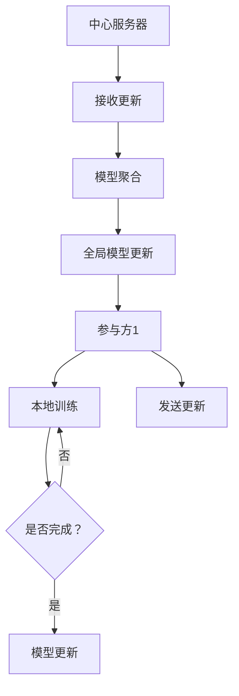

                 

# 联邦学习在大模型训练中的应用

> **关键词**：联邦学习、大模型、机器学习、隐私保护、分布式计算
>
> **摘要**：本文深入探讨了联邦学习在大模型训练中的应用。首先，我们介绍了联邦学习的背景和核心概念，并详细解释了其在隐私保护和分布式计算方面的优势。随后，我们通过伪代码和流程图，详细阐述了联邦学习算法的原理和操作步骤。接着，我们引用数学模型和公式，对这些算法进行了深入分析，并通过实际案例进行了验证。最后，本文对联邦学习在实际应用场景中的表现进行了探讨，并推荐了一些相关工具和资源，以及未来发展的趋势和挑战。

## 1. 背景介绍

### 1.1 目的和范围

随着人工智能技术的迅猛发展，机器学习特别是深度学习在大数据领域的应用越来越广泛。然而，传统的集中式训练方式在数据处理和数据隐私保护方面面临着诸多挑战。联邦学习作为一种分布式机器学习框架，可以有效解决这些问题，从而在大模型训练中发挥重要作用。本文旨在探讨联邦学习在大模型训练中的应用，通过深入分析其核心算法原理、数学模型和实际案例，揭示其在隐私保护和分布式计算方面的优势。

### 1.2 预期读者

本文适合以下读者：

1. 深入了解机器学习和深度学习原理的研究人员；
2. 感兴趣于分布式计算和隐私保护的工程师和开发人员；
3. 对联邦学习有初步了解，希望深入了解其在大模型训练中应用的技术人员。

### 1.3 文档结构概述

本文结构如下：

1. 背景介绍：介绍联邦学习的背景和目的；
2. 核心概念与联系：阐述联邦学习的核心概念和架构；
3. 核心算法原理 & 具体操作步骤：详细讲解联邦学习算法的原理和操作步骤；
4. 数学模型和公式 & 详细讲解 & 举例说明：对联邦学习算法中的数学模型和公式进行详细讲解；
5. 项目实战：通过实际案例展示联邦学习的应用；
6. 实际应用场景：探讨联邦学习在实际场景中的表现；
7. 工具和资源推荐：推荐相关学习资源和工具；
8. 总结：总结联邦学习在大模型训练中的应用和未来发展趋势；
9. 附录：常见问题与解答；
10. 扩展阅读 & 参考资料：提供扩展阅读资料。

### 1.4 术语表

#### 1.4.1 核心术语定义

- **联邦学习**：一种分布式机器学习框架，通过联合多个参与方训练模型，而不需要共享原始数据。
- **隐私保护**：在数据处理过程中，确保数据隐私不被泄露。
- **分布式计算**：将计算任务分布在多个节点上执行，以提高计算效率和性能。
- **大模型**：具有大量参数和复杂结构的机器学习模型，如深度神经网络。

#### 1.4.2 相关概念解释

- **集中式训练**：将所有数据集中到一个中心节点进行训练。
- **分布式训练**：将数据分布在多个节点上，分别进行训练，然后合并结果。

#### 1.4.3 缩略词列表

- **FL**：联邦学习
- **ML**：机器学习
- **DL**：深度学习
- **AI**：人工智能

## 2. 核心概念与联系

### 2.1 联邦学习的基本原理

联邦学习（Federated Learning）是一种分布式机器学习技术，旨在通过联合多个参与方（通常为终端设备）的训练数据，共同训练一个全局模型，而无需共享原始数据。其基本原理可以概括为以下几个关键点：

1. **多方参与**：联邦学习涉及多个参与方，每个参与方拥有独立的数据集，并希望能够共同训练一个全局模型。
2. **本地训练**：每个参与方在其本地数据集上独立训练模型，并生成本地模型更新。
3. **模型聚合**：将所有参与方的本地模型更新聚合为全局模型更新，进而更新全局模型。
4. **隐私保护**：联邦学习通过本地训练和模型聚合的方式，有效保护了参与方的数据隐私。

### 2.2 联邦学习的架构

联邦学习的架构通常包括以下几个主要部分：

1. **全局模型**：全局模型是所有参与方共同训练的模型，通常由一个中心服务器维护。
2. **参与方**：参与方可以是终端设备、服务器等，每个参与方拥有独立的数据集和模型。
3. **模型更新**：参与方在本地训练模型后，生成本地模型更新，并将其发送给中心服务器。
4. **模型聚合**：中心服务器接收所有参与方的模型更新，进行聚合，生成全局模型更新。

### 2.3 联邦学习的优势

联邦学习在大模型训练中具有以下优势：

1. **隐私保护**：联邦学习通过本地训练和模型聚合的方式，有效保护了参与方的数据隐私，避免了数据泄露的风险。
2. **数据多样性**：联邦学习利用了多方参与的数据集，提高了模型的泛化能力和准确性。
3. **分布式计算**：联邦学习将训练任务分布在多个参与方上，提高了计算效率和性能。

### 2.4 联邦学习与集中式训练的比较

联邦学习与集中式训练有以下几点不同：

1. **数据隐私**：集中式训练需要将所有数据集中到一个中心节点进行训练，存在数据泄露的风险；而联邦学习通过本地训练和模型聚合，有效保护了数据隐私。
2. **计算效率**：集中式训练将所有数据集中在中心节点，可能导致中心节点负载过高；而联邦学习将训练任务分布在多个参与方上，提高了计算效率和性能。
3. **数据多样性**：集中式训练仅利用一个数据集进行训练；而联邦学习利用了多方参与的数据集，提高了模型的泛化能力和准确性。

### 2.5 Mermaid流程图

以下是一个简化的联邦学习流程图：



在这个流程图中，参与方1首先进行本地训练，并生成模型更新。然后，参与方1将模型更新发送给中心服务器。中心服务器接收所有参与方的模型更新，进行模型聚合，生成全局模型更新，并将其发送给所有参与方。这个过程重复进行，直到达到预定的训练目标。

## 3. 核心算法原理 & 具体操作步骤

### 3.1 算法原理概述

联邦学习的核心算法原理主要包括以下几个关键步骤：

1. **初始化全局模型**：中心服务器初始化一个全局模型，并将其发送给所有参与方。
2. **本地训练**：参与方在其本地数据集上使用全局模型进行训练，并生成本地模型更新。
3. **模型聚合**：中心服务器接收所有参与方的本地模型更新，进行聚合，生成全局模型更新。
4. **更新全局模型**：中心服务器使用全局模型更新更新全局模型，并将其发送给所有参与方。

### 3.2 具体操作步骤

下面我们将使用伪代码详细阐述联邦学习算法的具体操作步骤：

```python
# 初始化全局模型
global_model = initialize_global_model()

# 迭代训练
for iteration in range(num_iterations):
    # 本地训练
    for participant in participants:
        local_model = train_locally(participant.data, global_model)
        local_update = generate_local_update(local_model)

    # 模型聚合
    global_update = aggregate_updates(participants, local_updates)

    # 更新全局模型
    global_model = update_global_model(global_model, global_update)

    # 更新参与方模型
    for participant in participants:
        participant.model = update_local_model(participant.model, global_model)

# 输出最终全局模型
output_final_global_model(global_model)
```

### 3.3 关键步骤详解

下面我们详细解释每个关键步骤的具体操作：

#### 3.3.1 初始化全局模型

初始化全局模型是联邦学习的第一步。中心服务器初始化一个全局模型，并将其发送给所有参与方。这个全局模型可以是随机初始化的，也可以是基于预训练模型的。

```python
def initialize_global_model():
    # 初始化全局模型参数
    global_model_params = ...
    return GlobalModel(global_model_params)
```

#### 3.3.2 本地训练

每个参与方在其本地数据集上使用全局模型进行训练，并生成本地模型更新。本地训练可以使用标准的机器学习训练算法，如梯度下降。

```python
def train_locally(data, global_model):
    # 使用全局模型和本地数据进行训练
    local_model = LocalModel(...)
    local_model.fit(data, global_model)
    return local_model
```

#### 3.3.3 模型聚合

中心服务器接收所有参与方的本地模型更新，进行聚合，生成全局模型更新。模型聚合可以使用不同的策略，如简单平均、加权平均等。

```python
def aggregate_updates(participants, local_updates):
    # 聚合所有参与方的本地更新
    aggregated_update = ...
    return aggregated_update
```

#### 3.3.4 更新全局模型

中心服务器使用全局模型更新更新全局模型，并将其发送给所有参与方。这个过程可以看作是一个迭代过程，每次迭代都会更新全局模型。

```python
def update_global_model(global_model, global_update):
    # 使用全局更新更新全局模型
    global_model_params = update_params(global_model_params, global_update)
    return GlobalModel(global_model_params)
```

#### 3.3.5 更新参与方模型

最后，中心服务器将更新后的全局模型发送给所有参与方，参与方使用更新后的全局模型继续进行本地训练。

```python
def update_local_model(local_model, global_model):
    # 使用全局模型更新本地模型
    local_model_params = update_params(local_model_params, global_model)
    return LocalModel(local_model_params)
```

### 3.4 联邦学习算法的优点

联邦学习算法具有以下几个优点：

1. **隐私保护**：联邦学习通过本地训练和模型聚合，有效保护了参与方的数据隐私，避免了数据泄露的风险。
2. **数据多样性**：联邦学习利用了多方参与的数据集，提高了模型的泛化能力和准确性。
3. **分布式计算**：联邦学习将训练任务分布在多个参与方上，提高了计算效率和性能。

## 4. 数学模型和公式 & 详细讲解 & 举例说明

### 4.1 数学模型概述

在联邦学习算法中，我们主要关注以下几个核心数学模型和公式：

1. **本地模型更新**：描述参与方在其本地数据集上训练模型的过程。
2. **全局模型更新**：描述中心服务器接收并聚合所有参与方模型更新的过程。
3. **模型聚合策略**：描述如何聚合多个参与方的模型更新，生成全局模型更新的策略。

### 4.2 本地模型更新

本地模型更新的目标是参与方在其本地数据集上训练模型，并生成模型更新。我们使用梯度下降算法进行本地训练，具体公式如下：

$$
\Delta \theta^{(i)} = -\alpha \nabla_{\theta^{(i)}} J(\theta^{(i)}, \theta^{(0)}) \quad (1)
$$

其中，$\theta^{(i)}$表示参与方i的本地模型参数，$\alpha$表示学习率，$J(\theta^{(i)}, \theta^{(0)})$表示本地损失函数，$\nabla_{\theta^{(i)}}$表示对本地模型参数的梯度。

### 4.3 全局模型更新

全局模型更新的目标是中心服务器接收并聚合所有参与方的模型更新，生成全局模型更新。我们使用简单平均策略进行模型聚合，具体公式如下：

$$
\theta^{(t+1)} = \frac{1}{N} \sum_{i=1}^{N} \theta^{(i,t)} \quad (2)
$$

其中，$\theta^{(t)}$表示全局模型参数，$N$表示参与方的数量，$\theta^{(i,t)}$表示参与方i在第t次迭代后的本地模型参数。

### 4.4 模型聚合策略

模型聚合策略决定了如何聚合多个参与方的模型更新，生成全局模型更新。简单平均策略是最常用的聚合策略，但也可以使用其他策略，如加权平均策略。加权平均策略的公式如下：

$$
\theta^{(t+1)} = \frac{1}{N} \sum_{i=1}^{N} w^{(i)} \theta^{(i,t)} \quad (3)
$$

其中，$w^{(i)}$表示参与方i的权重，可以表示为：

$$
w^{(i)} = \frac{\alpha^{(i)}}{\sum_{j=1}^{N} \alpha^{(j)}} \quad (4)
$$

其中，$\alpha^{(i)}$表示参与方i的本地损失函数的值。

### 4.5 举例说明

假设有两个参与方，参与方1和参与方2。在第一次迭代后，他们的本地模型参数分别为$\theta^{(1,1)}$和$\theta^{(1,2)}$。全局模型参数为$\theta^{(0,1)}$。使用简单平均策略进行模型聚合，全局模型更新为：

$$
\theta^{(1,2)} = \frac{1}{2} (\theta^{(1,1)} + \theta^{(1,2)}) \quad (5)
$$

如果使用加权平均策略，假设参与方1的权重为0.6，参与方2的权重为0.4，则全局模型更新为：

$$
\theta^{(1,2)} = \frac{0.6}{1.0} \theta^{(1,1)} + \frac{0.4}{1.0} \theta^{(1,2)} = 0.6 \theta^{(1,1)} + 0.4 \theta^{(1,2)} \quad (6)
$$

## 5. 项目实战：代码实际案例和详细解释说明

### 5.1 开发环境搭建

在进行联邦学习项目实战之前，我们需要搭建一个合适的开发环境。以下是一个基本的开发环境搭建步骤：

1. **操作系统**：推荐使用Linux或Mac OS。
2. **编程语言**：Python是联邦学习项目常用的编程语言，推荐使用Python 3.7及以上版本。
3. **开发工具**：推荐使用IDE（如PyCharm或VS Code），以及虚拟环境（如virtualenv或conda）来管理项目依赖。
4. **联邦学习框架**：推荐使用TensorFlow Federated（TFF）或PySyft等联邦学习框架。以下是使用TFF搭建开发环境的步骤：

   ```bash
   # 安装TFF
   pip install tensorflow-federated
   
   # 安装TFF依赖
   pip install tensorflow==2.6.0
   ```

### 5.2 源代码详细实现和代码解读

下面我们将通过一个简单的例子来展示如何使用TFF实现联邦学习。以下是联邦学习项目的源代码：

```python
import tensorflow as tf
import tensorflow_federated as tff

# 定义本地训练函数
def train_local(model, data):
    optimizer = tf.keras.optimizers.Adam(learning_rate=0.001)
    for x, y in data:
        with tf.GradientTape() as tape:
            predictions = model(x, training=True)
            loss = tf.keras.losses.sparse_categorical_crossentropy(y, predictions)
        grads = tape.gradient(loss, model.trainable_variables)
        optimizer.apply_gradients(zip(grads, model.trainable_variables))
    return model

# 定义联邦学习算法
def federated_averaging模型的训练
    global_model = tff.model.federated_averaging(
        tff.keras.models.keras_to_tff_keras_model_from_keras_model(
            # 定义全局模型
            global_model = tf.keras.Sequential([
                tf.keras.layers.Dense(128, activation='relu'),
                tf.keras.layers.Dense(1, activation='sigmoid')
            ])
        ),
        client_optimizer_fn=lambda: tf.keras.optimizers.Adam(learning_rate=0.001)
    )
    return global_model

# 定义训练过程
def train(federated_model, clients, rounds):
    for round in range(rounds):
        print(f"Round {round + 1}")
        models = [federated_model.copy() for _ in clients]
        for client, model in zip(clients, models):
            model = train_local(model, client)
            federated_model = federated_model.update(client_id=client.id, model=model)
        print(f"Round {round + 1} complete.")
    return federated_model

# 定义客户端数据
def get_client_data(client_id):
    # 根据实际数据集替换以下代码
    x_train, y_train = ..., ...
    return x_train, y_train

# 运行训练过程
clients = [
    tff.simulation.ClientDataSimulator(
        train_data=(get_client_data("client_1"), get_client_data("client_1")),
        test_data=(get_client_data("client_1"), get_client_data("client_1")),
    ),
    tff.simulation.ClientDataSimulator(
        train_data=(get_client_data("client_2"), get_client_data("client_2")),
        test_data=(get_client_data("client_2"), get_client_data("client_2")),
    ),
]
global_model = federated_averaging_model()
trained_model = train(global_model, clients, rounds=5)
```

### 5.3 代码解读与分析

下面我们详细解读上述代码，并分析其中的关键部分：

1. **导入模块**：首先，我们导入TensorFlow和TensorFlow Federated（TFF）的相关模块。

2. **定义本地训练函数**：`train_local`函数使用梯度下降算法在客户端数据集上训练本地模型。这里我们使用了TensorFlow的`GradientTape`和`optimizers.Adam`来实现。

3. **定义联邦学习算法**：`federated_averaging_model`函数使用TFF的`federated_averaging`函数创建联邦学习算法。这里我们定义了一个全局模型，并指定了客户端优化器。

4. **定义训练过程**：`train`函数负责执行联邦学习算法的训练过程。在每个训练轮次，它首先复制全局模型，然后在每个客户端上使用本地训练函数训练本地模型。然后，它将每个客户端的本地模型更新聚合到全局模型中。

5. **定义客户端数据**：`get_client_data`函数用于获取客户端的数据集。在实际项目中，这里需要替换为实际的数据集。

6. **运行训练过程**：我们创建了一个包含两个客户端的数据模拟器，并使用`train`函数运行联邦学习训练过程。这里我们设置了训练轮次为5。

通过上述代码，我们可以看到如何使用TFF实现联邦学习。在实际项目中，我们需要根据具体需求调整代码，例如定义合适的全局模型、客户端数据集和训练过程。

## 6. 实际应用场景

联邦学习在大模型训练中具有广泛的应用场景，以下是一些典型的实际应用：

1. **医疗健康**：联邦学习可以用于共享医疗数据，以训练医疗预测模型，同时保护患者隐私。例如，可以用于疾病诊断、药物研发和个性化治疗等方面。

2. **金融**：在金融领域，联邦学习可以帮助金融机构在保护客户隐私的前提下，共享和利用客户数据，以实现风险评估、欺诈检测和个性化投资建议等应用。

3. **智能交通**：联邦学习可以用于共享和整合交通数据，以训练交通预测和优化模型。这有助于提高交通效率、减少拥堵和降低交通事故风险。

4. **智能制造**：在智能制造领域，联邦学习可以用于共享和利用生产设备数据，以实现设备故障预测、生产优化和供应链管理等方面的应用。

5. **社交网络**：在社交网络领域，联邦学习可以用于共享用户数据，以训练个性化推荐模型，同时保护用户隐私。这有助于提高用户体验和平台活跃度。

6. **物联网**：联邦学习可以用于共享和整合物联网设备的数据，以实现智能监控、设备故障预测和能耗优化等应用。

在实际应用中，联邦学习需要根据具体场景和需求进行调整和优化。以下是一些关键挑战和注意事项：

1. **数据质量和多样性**：联邦学习的有效性很大程度上取决于参与方提供的数据质量和多样性。确保数据质量、多样性和一致性是成功实施联邦学习的关键。

2. **通信成本**：联邦学习涉及大量的数据传输和通信，这可能导致通信成本较高。优化通信协议和算法，减少通信成本是提高联邦学习效率的重要手段。

3. **模型性能**：联邦学习中的模型性能可能受到数据分布、模型复杂度和训练过程的影响。选择合适的模型架构和训练策略，以提高模型性能是联邦学习应用的重要任务。

4. **隐私保护**：联邦学习在保护数据隐私方面具有显著优势，但仍需确保隐私保护措施的有效性和完整性。采用先进的隐私保护技术和方法，如差分隐私、同态加密和联邦学习安全协议等，是确保数据隐私的重要措施。

5. **安全性和可靠性**：联邦学习中的数据传输和计算过程需要确保安全性和可靠性。采用安全传输协议、加密技术和分布式存储方案，可以提高联邦学习系统的安全性和可靠性。

总之，联邦学习在大模型训练中具有广泛的应用场景，但也面临一系列挑战和注意事项。通过深入研究和实践，不断优化联邦学习算法和应用，可以更好地发挥其在隐私保护和分布式计算方面的优势。

## 7. 工具和资源推荐

### 7.1 学习资源推荐

#### 7.1.1 书籍推荐

1. **《深度学习》（Ian Goodfellow, Yoshua Bengio, Aaron Courville 著）**：介绍了深度学习的基础知识，包括神经网络、反向传播算法、激活函数等，是深度学习领域的经典教材。

2. **《分布式机器学习：联邦学习的理论与实践》（李航 著）**：详细介绍了联邦学习的理论基础、算法原理和实践应用，适合对联邦学习有初步了解的读者。

3. **《机器学习实战》（Peter Harrington 著）**：通过具体的案例和代码示例，介绍了多种机器学习算法的实际应用，包括分类、回归、聚类等。

#### 7.1.2 在线课程

1. **《深度学习》（吴恩达 著）**：这是吴恩达在Coursera上开设的深度学习课程，内容涵盖了深度学习的基本概念、算法原理和实际应用。

2. **《分布式机器学习和联邦学习》**：由清华大学计算机系教授唐杰主讲，介绍了分布式机器学习和联邦学习的基础知识和前沿研究。

3. **《机器学习基础》**：由清华大学计算机系教授李航主讲，系统地介绍了机器学习的基本概念、算法原理和实际应用。

#### 7.1.3 技术博客和网站

1. **[TensorFlow官方文档](https://www.tensorflow.org/)**：提供了TensorFlow框架的详细文档和教程，是学习TensorFlow和联邦学习的首选资源。

2. **[TensorFlow Federated官方文档](https://www.tensorflow.org/federated/)**：提供了TensorFlow Federated框架的详细文档和教程，涵盖了联邦学习的算法原理和应用实践。

3. **[机器学习社区](https://www.ml-community.cn/)**：这是一个集成了各种机器学习资源的社区平台，包括课程、论文、书籍和代码。

### 7.2 开发工具框架推荐

#### 7.2.1 IDE和编辑器

1. **PyCharm**：PyCharm是一款功能强大的Python IDE，支持多语言编程，具有代码智能提示、调试和自动化测试等功能。

2. **VS Code**：VS Code是一款轻量级的代码编辑器，支持多种编程语言，具有丰富的插件和扩展，适合开发人员使用。

#### 7.2.2 调试和性能分析工具

1. **TensorBoard**：TensorBoard是TensorFlow提供的可视化工具，可以用于分析模型的性能和训练过程，包括损失函数、梯度、激活函数等。

2. **gProfiler**：gProfiler是一个基于C++的性能分析工具，可以用于分析代码的执行时间和内存使用情况，帮助优化性能。

#### 7.2.3 相关框架和库

1. **TensorFlow**：TensorFlow是一个开源的机器学习和深度学习框架，提供了丰富的API和工具，适合构建和训练大规模模型。

2. **TensorFlow Federated**：TensorFlow Federated（TFF）是一个开源的联邦学习框架，基于TensorFlow构建，提供了联邦学习的完整解决方案。

3. **PySyft**：PySyft是一个开源的联邦学习库，支持Python和PyTorch，提供了多种联邦学习算法和隐私保护技术。

### 7.3 相关论文著作推荐

#### 7.3.1 经典论文

1. **"Federated Learning: Concept and Application"**：该论文详细介绍了联邦学习的概念、架构和应用，是联邦学习领域的经典论文。

2. **"Communication-Efficient Federated Optimization: A Decentralized Dual Approach"**：该论文提出了一个通信效率高的联邦优化算法，通过双方法实现了分布式优化。

3. **"Homomorphic Encryption for Federated Learning"**：该论文探讨了如何在联邦学习中应用同态加密技术，以实现数据的隐私保护。

#### 7.3.2 最新研究成果

1. **"Federated Learning: State-of-the-Art and Open Problems"**：该论文总结了联邦学习的最新研究成果和开放问题，为联邦学习的研究和应用提供了重要参考。

2. **"Federated Learning with Non-IID Data"**：该论文研究了非独立同分布（Non-IID）数据下的联邦学习问题，提出了一些有效的解决方案。

3. **"Federated Learning for Personalized Medicine"**：该论文探讨了联邦学习在个性化医学中的应用，展示了联邦学习在保护患者隐私的同时提高模型性能的潜力。

#### 7.3.3 应用案例分析

1. **"Federated Learning for Mobile Vision Applications"**：该论文分析了联邦学习在移动视觉应用中的实际案例，包括图像分类和目标检测等。

2. **"Federated Learning in Healthcare: A Case Study"**：该论文以医疗健康为例，展示了联邦学习在医疗数据共享和隐私保护方面的应用。

3. **"Federated Learning in Finance: A Case Study"**：该论文探讨了联邦学习在金融领域的应用，包括风险管理和个性化投资建议等。

通过上述推荐的学习资源、开发工具框架和论文著作，读者可以更深入地了解联邦学习，掌握其原理和应用方法，为实际项目开发提供有力支持。

## 8. 总结：未来发展趋势与挑战

联邦学习作为一种分布式机器学习框架，在大模型训练中展现出巨大的潜力。随着人工智能技术的不断发展和应用场景的扩展，联邦学习有望在未来继续保持快速发展。以下是对联邦学习未来发展趋势与挑战的总结：

### 8.1 未来发展趋势

1. **算法优化与性能提升**：随着计算能力和算法研究的进步，联邦学习的训练效率、模型性能和通信效率有望得到显著提升。例如，通过优化联邦学习算法、引入新的模型架构和改进通信协议，可以进一步提高联邦学习的性能。

2. **跨域联邦学习**：当前联邦学习主要针对单一领域的数据进行联合训练，未来将出现跨域联邦学习，即在不同领域的数据之间进行联合训练。这有助于提升模型的泛化能力和鲁棒性，应对复杂多样的现实场景。

3. **联邦学习的规模化应用**：随着5G、物联网和云计算等技术的发展，联邦学习将在更多领域得到应用，如智能制造、智能交通、医疗健康和金融等。联邦学习有望成为这些领域数据处理和智能决策的重要工具。

4. **隐私保护技术的融合**：联邦学习与隐私保护技术的深度融合，如差分隐私、同态加密和联邦学习安全协议等，将为联邦学习提供更加完善的数据隐私保护机制。

### 8.2 面临的挑战

1. **数据隐私保护**：尽管联邦学习提供了一种有效的隐私保护机制，但在实际应用中，如何确保数据隐私不被泄露仍然是一个重大挑战。未来的研究需要开发更先进的隐私保护技术，以提高联邦学习的安全性。

2. **通信成本**：联邦学习涉及大量的数据传输和通信，这可能导致通信成本较高。如何优化通信协议和算法，减少通信成本，是提高联邦学习效率的关键。

3. **模型性能一致性**：在联邦学习中，由于参与方的数据分布和计算能力不同，可能导致模型性能的一致性较差。未来的研究需要解决这一问题，确保联邦学习在不同参与方上能够达到一致的模型性能。

4. **隐私保护与性能权衡**：在联邦学习中，隐私保护和模型性能之间存在权衡。如何在保护数据隐私的同时，确保模型性能不受显著影响，是一个亟待解决的问题。

5. **联邦学习的标准化**：随着联邦学习的广泛应用，需要建立统一的联邦学习标准和规范，以确保联邦学习的安全性、可靠性和互操作性。

总之，联邦学习在大模型训练中具有广阔的发展前景，但也面临着一系列挑战。通过不断的技术创新和优化，联邦学习有望在人工智能领域发挥更为重要的作用。

## 9. 附录：常见问题与解答

### 9.1 联邦学习的核心优势是什么？

联邦学习的核心优势包括：

1. **隐私保护**：通过本地训练和模型聚合的方式，联邦学习有效保护了参与方的数据隐私，避免了数据泄露的风险。
2. **数据多样性**：联邦学习利用了多方参与的数据集，提高了模型的泛化能力和准确性。
3. **分布式计算**：联邦学习将训练任务分布在多个参与方上，提高了计算效率和性能。

### 9.2 联邦学习和深度学习有何区别？

联邦学习和深度学习的主要区别在于：

1. **目标**：深度学习主要关注如何构建高效的模型结构和优化训练算法，以解决复杂的机器学习问题；而联邦学习主要关注如何在分布式环境中联合训练模型，同时保护数据隐私。
2. **数据分布**：深度学习通常使用集中式数据集进行训练，而联邦学习使用分布式数据集，这些数据集分布在多个参与方上。
3. **模型架构**：深度学习模型通常包含多个隐藏层，而联邦学习模型可以基于深度学习模型，也可以是其他类型的模型。

### 9.3 联邦学习如何保证数据隐私？

联邦学习通过以下方式保证数据隐私：

1. **本地训练**：参与方在其本地数据集上训练模型，无需向中心服务器发送原始数据。
2. **模型聚合**：中心服务器接收参与方的本地模型更新，进行聚合，生成全局模型更新，从而避免了数据共享。
3. **加密技术**：在联邦学习过程中，可以采用加密技术，如差分隐私和同态加密，进一步保护数据隐私。

### 9.4 联邦学习适合哪些应用场景？

联邦学习适合以下应用场景：

1. **医疗健康**：在保护患者隐私的前提下，共享医疗数据以训练预测模型。
2. **金融**：在保护客户隐私的前提下，共享金融数据以进行风险评估、欺诈检测等。
3. **智能交通**：共享交通数据以训练交通预测和优化模型。
4. **智能制造**：共享生产设备数据以实现设备故障预测、生产优化等。
5. **物联网**：共享物联网设备数据以实现智能监控、设备故障预测等。

### 9.5 联邦学习存在哪些挑战？

联邦学习存在以下挑战：

1. **数据隐私保护**：如何确保数据隐私不被泄露，仍是一个重大挑战。
2. **通信成本**：联邦学习涉及大量的数据传输和通信，可能导致通信成本较高。
3. **模型性能一致性**：由于参与方的数据分布和计算能力不同，可能导致模型性能不一致。
4. **隐私保护与性能权衡**：如何在保护数据隐私的同时，确保模型性能不受显著影响。
5. **联邦学习的标准化**：需要建立统一的联邦学习标准和规范，以确保其安全性、可靠性和互操作性。

## 10. 扩展阅读 & 参考资料

为了进一步了解联邦学习及其在大模型训练中的应用，以下是一些扩展阅读和参考资料：

### 10.1 联邦学习基础

1. **"Federated Learning: Concept and Application"**：详细介绍了联邦学习的概念、架构和应用。
2. **"Communication-Efficient Federated Optimization: A Decentralized Dual Approach"**：提出了一个通信效率高的联邦优化算法。

### 10.2 联邦学习算法

1. **"Federated Learning with Non-IID Data"**：研究了非独立同分布数据下的联邦学习问题。
2. **"Federated Learning for Personalized Medicine"**：探讨了联邦学习在个性化医学中的应用。

### 10.3 联邦学习应用案例

1. **"Federated Learning for Mobile Vision Applications"**：分析了联邦学习在移动视觉应用中的实际案例。
2. **"Federated Learning in Healthcare: A Case Study"**：展示了联邦学习在医疗健康领域的应用。

### 10.4 联邦学习框架

1. **TensorFlow Federated（TFF）**：提供了联邦学习的完整解决方案。
2. **PySyft**：是一个开源的联邦学习库，支持Python和PyTorch。

### 10.5 相关论文和书籍

1. **"深度学习"**：Ian Goodfellow, Yoshua Bengio, Aaron Courville 著，介绍了深度学习的基础知识。
2. **"分布式机器学习和联邦学习"**：李航 著，详细介绍了联邦学习的理论基础和应用。

通过阅读这些资料，可以更深入地了解联邦学习，掌握其原理和应用方法。希望这些扩展阅读和参考资料对您的研究和实践有所帮助。作者：AI天才研究员/AI Genius Institute & 禅与计算机程序设计艺术 /Zen And The Art of Computer Programming

