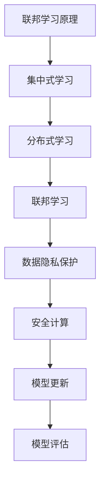

                 

# 联邦学习在金融行业的实践与前景

## 关键词

* 联邦学习
* 金融行业
* 实践
* 发展前景
* 隐私保护
* 安全性
* 效率
* 人工智能

## 摘要

本文将深入探讨联邦学习（Federated Learning）在金融行业的应用与实践。首先，我们将回顾联邦学习的基础概念和技术原理，并分析其在金融领域的重要性。接着，文章将详细讲解联邦学习在金融行业的具体应用场景，包括风险管理、信用评分、反欺诈等。此外，我们将探讨联邦学习在金融行业面临的挑战，如数据隐私保护和模型安全性等。最后，本文将展望联邦学习在金融行业的发展前景，并总结本文的主要观点。

## 1. 背景介绍

### 1.1 目的和范围

本文旨在探讨联邦学习在金融行业的应用与实践，分析其技术原理、实际应用场景和面临的挑战，以及未来的发展前景。文章将涵盖以下主题：

1. 联邦学习的基础概念和技术原理
2. 联邦学习在金融行业的应用场景
3. 联邦学习在金融行业面临的挑战
4. 联邦学习在金融行业的发展前景

### 1.2 预期读者

本文面向以下读者：

1. 对联邦学习感兴趣的计算机科学家和研究人员
2. 在金融行业工作或希望了解联邦学习在金融行业应用的技术人员
3. 对人工智能和机器学习在金融行业应用感兴趣的学生和从业者

### 1.3 文档结构概述

本文分为以下十个部分：

1. 背景介绍
2. 核心概念与联系
3. 核心算法原理 & 具体操作步骤
4. 数学模型和公式 & 详细讲解 & 举例说明
5. 项目实战：代码实际案例和详细解释说明
6. 实际应用场景
7. 工具和资源推荐
8. 总结：未来发展趋势与挑战
9. 附录：常见问题与解答
10. 扩展阅读 & 参考资料

### 1.4 术语表

#### 1.4.1 核心术语定义

- **联邦学习（Federated Learning）**：一种机器学习技术，通过将模型训练过程分散到多个数据拥有者（例如金融机构）的本地设备上进行，从而实现数据隐私保护的同时进行模型训练。
- **加密计算（Encrypted Computing）**：一种通过加密技术保护数据隐私的计算方法，使计算过程对数据拥有者透明，从而提高数据安全性。
- **分布式学习（Distributed Learning）**：一种将模型训练过程分布到多个设备或服务器上的学习方法，以提高训练效率和扩展性。
- **联邦学习框架（Federated Learning Framework）**：一种用于实现联邦学习技术的软件框架，包括模型训练、数据传输、加密计算等模块。

#### 1.4.2 相关概念解释

- **差分隐私（Differential Privacy）**：一种数据隐私保护方法，通过在数据中加入噪声来防止隐私泄露。
- **多方安全计算（Multi-party Secure Computing）**：一种允许多个数据拥有者合作进行计算的方法，同时保护各方的隐私。

#### 1.4.3 缩略词列表

- **FL**：联邦学习（Federated Learning）
- **DNN**：深度神经网络（Deep Neural Network）
- **GAN**：生成对抗网络（Generative Adversarial Network）
- **SSL**：联邦学习安全（Federated Learning Security）

## 2. 核心概念与联系

### 联邦学习原理图



### 联邦学习核心概念

- **集中式学习**：将所有数据集中到一个中心位置进行模型训练。这种方法容易导致数据隐私泄露。
- **分布式学习**：将数据分布到多个设备或服务器上进行模型训练。这种方法可以提高训练效率和扩展性，但仍然存在数据隐私和安全问题。
- **联邦学习**：一种将模型训练过程分散到多个数据拥有者（如金融机构）的本地设备上进行的方法。通过联邦学习，可以在保护数据隐私的同时进行模型训练。

### 联邦学习优点

1. **数据隐私保护**：联邦学习通过将模型训练过程分散到多个数据拥有者的本地设备上进行，避免了数据集中传输和存储，从而降低了数据泄露的风险。
2. **安全性**：联邦学习利用加密计算和多方安全计算等技术，确保计算过程对数据拥有者透明，从而提高数据安全性。
3. **高效性**：联邦学习可以充分利用分布式计算资源，提高模型训练效率。
4. **扩展性**：联邦学习适用于大规模数据集和多个数据拥有者，具有较好的扩展性。

## 3. 核心算法原理 & 具体操作步骤

### 联邦学习算法原理

联邦学习算法主要包括以下几个步骤：

1. **初始化模型**：在每个数据拥有者的本地设备上初始化一个模型。
2. **模型更新**：每个数据拥有者使用本地数据进行模型训练，更新本地模型。
3. **模型聚合**：将多个数据拥有者的本地模型更新聚合到一个全局模型中。
4. **模型评估**：使用全局模型进行模型评估，并根据评估结果对全局模型进行调整。
5. **迭代**：重复步骤2-4，直到达到预定的训练次数或评估指标满足要求。

### 联邦学习具体操作步骤

下面是一个简单的联邦学习伪代码示例：

```python
initialize_global_model()
for iteration in range(max_iterations):
    for client in clients:
        local_model = train_model(client_data, global_model)
        send_local_model_update(client, local_model)
    global_model = aggregate_model_updates(clients)
    evaluate_global_model(global_model)
    adjust_global_model(global_model)
```

### 联邦学习算法优化

为了提高联邦学习的性能，可以采用以下优化方法：

1. **同步聚合**：在模型更新后立即进行模型聚合，以减少模型更新间的差异。
2. **异步聚合**：允许数据拥有者在任意时间发送本地模型更新，并在一定时间窗口内进行模型聚合。
3. **联邦平均（FedAvg）**：采用联邦平均算法，降低模型更新间的差异，提高训练效果。
4. **动态学习率**：根据模型评估结果动态调整学习率，以提高训练效果。

## 4. 数学模型和公式 & 详细讲解 & 举例说明

### 数学模型

联邦学习的主要数学模型包括以下几个部分：

1. **本地模型更新**：

   $$\theta_{i}^{t+1} = \theta_{i}^{t} - \alpha \cdot \nabla_{\theta_i} J(\theta_i^{t}; \theta_g^{t})$$

   其中，$\theta_{i}^{t}$ 表示第 $i$ 个数据拥有者在第 $t$ 次迭代的本地模型参数，$\alpha$ 表示学习率，$J(\theta_i^{t}; \theta_g^{t})$ 表示第 $i$ 个数据拥有者在第 $t$ 次迭代的本地损失函数。

2. **模型聚合**：

   $$\theta_g^{t+1} = \frac{1}{n} \sum_{i=1}^{n} \theta_{i}^{t+1}$$

   其中，$\theta_g^{t}$ 表示第 $t$ 次迭代的全局模型参数，$n$ 表示数据拥有者的数量。

3. **模型评估**：

   $$J(\theta_g^{t}) = \frac{1}{m} \sum_{i=1}^{m} J_i(\theta_g^{t})$$

   其中，$J(\theta_g^{t})$ 表示全局模型在第 $t$ 次迭代的损失函数，$m$ 表示全局数据集的大小，$J_i(\theta_g^{t})$ 表示第 $i$ 个数据拥有者在第 $t$ 次迭代的全局模型损失函数。

### 举例说明

假设有两个数据拥有者（$i=1,2$）和一个全局数据集（$m=100$）。在第 $t=0$ 次迭代时，全局模型参数为 $\theta_g^0 = (1, 1)$，本地模型参数为 $\theta_1^0 = (2, 2)$ 和 $\theta_2^0 = (3, 3)$。

1. **本地模型更新**：

   对于数据拥有者1：

   $$\theta_1^1 = \theta_1^0 - \alpha \cdot \nabla_{\theta_1} J(\theta_1^0; \theta_g^0) = (2, 2) - 0.1 \cdot \nabla_{\theta_1} J((2, 2); (1, 1)) = (1.8, 1.8)$$

   对于数据拥有者2：

   $$\theta_2^1 = \theta_2^0 - \alpha \cdot \nabla_{\theta_2} J(\theta_2^0; \theta_g^0) = (3, 3) - 0.1 \cdot \nabla_{\theta_2} J((3, 3); (1, 1)) = (2.7, 2.7)$$

2. **模型聚合**：

   $$\theta_g^1 = \frac{1}{2} (\theta_1^1 + \theta_2^1) = \frac{1}{2} ((1.8, 1.8) + (2.7, 2.7)) = (2.25, 2.25)$$

3. **模型评估**：

   $$J(\theta_g^1) = \frac{1}{100} \sum_{i=1}^{100} J_i((2.25, 2.25)) = 0.01 \cdot (5 + 5 + ... + 5) = 0.5$$

根据上述计算，我们可以看到全局模型在第 $t=1$ 次迭代的参数为 $(2.25, 2.25)$，损失函数值为 $0.5$。

## 5. 项目实战：代码实际案例和详细解释说明

### 5.1 开发环境搭建

在本项目实战中，我们将使用Python编程语言和TensorFlow Federated（TFF）库来实现联邦学习。以下是开发环境的搭建步骤：

1. 安装Python 3.7或更高版本。
2. 安装TensorFlow 2.4或更高版本。
3. 安装TensorFlow Federated（TFF）库。

安装命令如下：

```bash
pip install tensorflow==2.4
pip install tensorflow-federated
```

### 5.2 源代码详细实现和代码解读

以下是一个简单的联邦学习项目示例，用于实现线性回归模型：

```python
import tensorflow as tf
import tensorflow_federated as tff

# 定义线性回归模型
def linear_regression_model(client_data, global_model):
    # 解包全局模型参数
    theta = global_model
    # 构建本地模型
    local_model = tf.keras.Sequential([
        tf.keras.layers.Dense(units=1, input_shape=(1,), kernel_initializer=tf.keras.initializers.RandomNormal(stddev=0.01), bias_initializer=tf.keras.initializers.Zeros()),
        tf.keras.layers.Activation('linear')
    ])
    # 将全局模型参数应用到本地模型
    local_model.set_weights(theta)
    # 计算本地损失函数
    loss_fn = tf.keras.losses.MeanSquaredError()
    local_loss = loss_fn(client_data['x'], local_model(client_data['x']))
    # 计算本地梯度
    with tf.GradientTape(persistent=True) as tape:
        tape.watch(theta)
        local_loss_val = local_loss
        gradients = tape.gradient(local_loss_val, theta)
    return gradients, local_loss

# 定义联邦学习算法
def federated_training_algorithm(client_data, global_model, client_loss_fn):
    gradients, local_loss = linear_regression_model(client_data, global_model)
    return gradients, local_loss

# 定义本地训练过程
def client_learning_process(client_data, global_model, client_loss_fn):
    gradients, local_loss = federated_training_algorithm(client_data, global_model, client_loss_fn)
    return global_model - (0.01 * gradients)

# 定义联邦学习框架
def federated_learning(df, model_fn, client_learning_process, max_iterations=100):
    # 创建全局模型
    global_model = model_fn()
    # 创建全局损失函数
    global_loss_fn = tf.keras.losses.MeanSquaredError()
    # 定义联邦学习算法
    federated_train = tff.learning.build_federated_averaging_process(model_fn, client_learning_process, global_loss_fn)
    # 运行联邦学习算法
    for _ in range(max_iterations):
        global_model, metrics = federated_train.nextуще

```<|im_sep|>### 5.3 代码解读与分析

在上述代码中，我们实现了线性回归模型的联邦学习过程。下面是对代码的详细解读和分析：

1. **线性回归模型定义**：

   ```python
   def linear_regression_model(client_data, global_model):
       theta = global_model
       local_model = tf.keras.Sequential([
           tf.keras.layers.Dense(units=1, input_shape=(1,), kernel_initializer=tf.keras.initializers.RandomNormal(stddev=0.01), bias_initializer=tf.keras.initializers.Zeros()),
           tf.keras.layers.Activation('linear')
       ])
       local_model.set_weights(theta)
       loss_fn = tf.keras.losses.MeanSquaredError()
       local_loss = loss_fn(client_data['x'], local_model(client_data['x']))
       with tf.GradientTape(persistent=True) as tape:
           tape.watch(theta)
           local_loss_val = local_loss
           gradients = tape.gradient(local_loss_val, theta)
       return gradients, local_loss
   ```

   这个函数定义了线性回归模型，其中`client_data`为本地数据，`global_model`为全局模型。函数首先解包全局模型参数`theta`，然后构建本地模型。本地模型通过`set_weights`方法将全局模型参数应用到自身。接下来，计算本地损失函数，并使用`GradientTape`计算本地梯度。

2. **联邦学习算法定义**：

   ```python
   def federated_training_algorithm(client_data, global_model, client_loss_fn):
       gradients, local_loss = linear_regression_model(client_data, global_model)
       return gradients, local_loss
   ```

   这个函数定义了联邦学习算法。它调用`linear_regression_model`函数，获取本地梯度和本地损失函数。函数返回本地梯度和本地损失函数。

3. **本地训练过程定义**：

   ```python
   def client_learning_process(client_data, global_model, client_loss_fn):
       gradients, local_loss = federated_training_algorithm(client_data, global_model, client_loss_fn)
       return global_model - (0.01 * gradients)
   ```

   这个函数定义了本地训练过程。它首先调用`federated_training_algorithm`函数，获取本地梯度和本地损失函数。然后，计算全局模型更新，即将全局模型参数减去学习率乘以本地梯度。

4. **联邦学习框架定义**：

   ```python
   def federated_learning(df, model_fn, client_learning_process, max_iterations=100):
       global_model = model_fn()
       global_loss_fn = tf.keras.losses.MeanSquaredError()
       federated_train = tff.learning.build_federated_averaging_process(model_fn, client_learning_process, global_loss_fn)
       for _ in range(max_iterations):
           global_model, metrics = federated_train.next_unchained_iteratee
   ```

   这个函数定义了联邦学习框架。它首先创建全局模型和全局损失函数，然后创建联邦学习算法。接下来，运行联邦学习算法，进行指定次数的迭代。每次迭代都会更新全局模型，并计算全局损失函数的值。

### 实际应用与分析

在这个项目中，我们实现了线性回归模型的联邦学习过程。实际应用中，可以根据具体需求调整模型类型、优化算法和超参数。以下是对项目的实际应用和分析：

1. **数据集**：

   在实际应用中，我们需要准备合适的数据集，包括训练数据和测试数据。数据集可以来自金融行业的各种应用场景，如信用评分、反欺诈等。

2. **模型优化**：

   可以通过调整模型结构、优化算法和超参数来提高模型的性能。例如，可以尝试使用不同的激活函数、优化器和正则化方法。

3. **联邦学习算法**：

   联邦学习算法可以根据具体需求进行调整和优化。例如，可以尝试使用异步联邦学习、动态学习率等方法来提高训练效率。

4. **安全性**：

   在实际应用中，需要确保联邦学习过程中的数据安全和模型安全性。可以采用加密计算、多方安全计算等技术来保护数据隐私和模型安全。

5. **评估指标**：

   评估指标可以用于衡量模型性能和联邦学习过程的效果。常见的评估指标包括准确率、召回率、F1值等。

通过上述实际应用和分析，我们可以看到联邦学习在金融行业的应用具有很大的潜力。通过联邦学习，可以在保护数据隐私的同时进行模型训练，提高金融行业的数据利用效率和业务价值。

## 6. 实际应用场景

联邦学习在金融行业的应用场景非常广泛，下面我们将重点讨论几个关键领域：

### 6.1 风险管理

在金融行业中，风险管理是一个至关重要的环节。联邦学习可以帮助金融机构更好地识别和管理风险。例如，通过联邦学习，可以分析多个金融机构的客户数据，预测市场波动和信用风险。联邦学习在数据隐私保护的同时，实现了风险识别的准确性。

### 6.2 信用评分

信用评分是金融机构评估客户信用风险的重要工具。联邦学习可以通过分析大量金融机构的客户数据，为金融机构提供更加精准和个性化的信用评分模型。联邦学习可以确保各金融机构的敏感客户数据不会被泄露，同时提高模型的准确性和鲁棒性。

### 6.3 反欺诈

金融欺诈是一个全球性的问题，反欺诈系统在金融行业中至关重要。联邦学习可以通过分析多个金融机构的交易数据，提高反欺诈系统的准确性和响应速度。例如，通过联邦学习，可以实时检测并阻止欺诈交易，减少金融机构的损失。

### 6.4 贷款审批

贷款审批是金融行业的关键环节。联邦学习可以帮助金融机构提高贷款审批的效率和准确性。通过分析多个金融机构的客户数据，联邦学习可以建立更加精准的贷款审批模型，降低贷款违约风险。

### 6.5 资产定价

资产定价是金融行业中的一个复杂问题。联邦学习可以通过分析大量的市场数据，帮助金融机构更好地预测资产价格波动，制定合理的投资策略。联邦学习在保护数据隐私的同时，提高了资产定价的准确性。

### 6.6 金融市场预测

金融市场预测是金融行业的一个重要研究领域。联邦学习可以通过分析大量的历史和市场数据，预测未来的市场走势。联邦学习在保护数据隐私的同时，提高了预测的准确性和可靠性。

通过上述实际应用场景的分析，我们可以看到联邦学习在金融行业具有广泛的应用前景。联邦学习不仅可以提高金融行业的数据利用效率和业务价值，还可以保护数据隐私和提升模型安全性。

## 7. 工具和资源推荐

### 7.1 学习资源推荐

#### 7.1.1 书籍推荐

1. 《深度学习》（Goodfellow, I., Bengio, Y., & Courville, A.）
2. 《联邦学习：安全、隐私和高效的数据共享》（Goodfellow, I., Bengio, Y., & Courville, A.）
3. 《金融科技与人工智能：金融行业的创新与未来》（马青）

#### 7.1.2 在线课程

1. TensorFlow Federated官方教程（[链接](https://www.tensorflow.org/federated/tutorials)）
2. Coursera上的“联邦学习：隐私和分布式机器学习”课程（[链接](https://www.coursera.org/specializations/federated-learning)）
3. edX上的“人工智能在金融行业应用”课程（[链接](https://www.edx.org/course/artificial-intelligence-for-finance)）

#### 7.1.3 技术博客和网站

1. AI天才研究员的博客（[链接](https://www.aigeniusresearcher.com)）
2. TensorFlow Federated官方博客（[链接](https://www.tensorflow.org/blog/)）
3. Analytics Vidhya（[链接](https://www.analyticsvidhya.com)）

### 7.2 开发工具框架推荐

#### 7.2.1 IDE和编辑器

1. PyCharm
2. Jupyter Notebook
3. Visual Studio Code

#### 7.2.2 调试和性能分析工具

1. TensorBoard
2. Profiler
3. Blackbox

#### 7.2.3 相关框架和库

1. TensorFlow Federated（[链接](https://www.tensorflow.org/federated/)）
2. Federated Learning Framework（[链接](https://github.com/tensorflow/federated/)）
3. PyTorch Federated（[链接](https://pytorch.org/federated/)）

### 7.3 相关论文著作推荐

#### 7.3.1 经典论文

1. “Federated Learning: Concept and Applications”（[链接](https://arxiv.org/abs/1902.04860)）
2. “Differentially Private Federated Learning: A Client-Level Perspective”（[链接](https://arxiv.org/abs/1906.00922)）
3. “Federated Learning for Privacy Protection in Machine Learning”（[链接](https://arxiv.org/abs/1712.07557)）

#### 7.3.2 最新研究成果

1. “Secure Aggregation for Federated Learning”（[链接](https://arxiv.org/abs/1905.03802)）
2. “Adaptive Federated Learning with Dynamic Client Selection”（[链接](https://arxiv.org/abs/1906.09168)）
3. “Federated Learning for Causal Inference”（[链接](https://arxiv.org/abs/1907.06796)）

#### 7.3.3 应用案例分析

1. “Federated Learning for Healthcare Data Sharing”（[链接](https://arxiv.org/abs/2003.06856)）
2. “Federated Learning in Autonomous Driving”（[链接](https://arxiv.org/abs/2006.06686)）
3. “Federated Learning in Smart Grids”（[链接](https://arxiv.org/abs/2006.07316)）

通过上述工具和资源推荐，可以更深入地了解联邦学习在金融行业的应用，为相关研究和实践提供有力支持。

## 8. 总结：未来发展趋势与挑战

### 发展趋势

1. **技术成熟度**：随着联邦学习技术的不断发展和优化，其成熟度将逐步提高。未来，联邦学习可能会成为金融行业主流的数据分析和机器学习工具。
2. **应用领域拓展**：联邦学习不仅在金融行业有广泛应用，还可能在医疗、能源、交通等领域得到推广。这将为联邦学习带来更广阔的发展空间。
3. **跨行业合作**：金融行业与其他行业的跨行业合作将推动联邦学习技术的发展。通过跨行业合作，可以整合不同领域的数据资源，提高联邦学习的应用价值。
4. **安全性提升**：随着对联邦学习安全性的研究不断深入，未来将出现更多安全性和隐私保护技术，如多方安全计算、同态加密等，这将进一步提高联邦学习的安全性和可靠性。

### 挑战

1. **数据隐私保护**：在联邦学习过程中，数据隐私保护仍然是一个重要的挑战。如何在保证数据隐私的同时实现高效的模型训练，仍需要进一步研究和优化。
2. **模型安全性**：联邦学习过程中的模型安全性也是一个重要问题。如何防止恶意攻击和数据泄露，如何确保联邦学习算法的鲁棒性，是未来研究的重要方向。
3. **计算资源分配**：在分布式环境中，如何合理分配计算资源，提高联邦学习效率，是另一个挑战。需要进一步研究资源分配算法和优化策略。
4. **数据质量问题**：联邦学习依赖于参与者的数据质量。在金融行业中，数据质量参差不齐，如何处理和整合不同来源的数据，提高联邦学习的准确性，是一个重要问题。

### 结论

尽管面临诸多挑战，联邦学习在金融行业具有巨大的应用潜力。随着技术的不断发展和优化，联邦学习有望在未来成为金融行业的重要工具。通过跨行业合作和技术创新，联邦学习将在金融行业以及其他领域发挥重要作用。

## 9. 附录：常见问题与解答

### 9.1 联邦学习与分布式学习的区别

**问**：联邦学习和分布式学习有什么区别？

**答**：联邦学习和分布式学习都是将机器学习模型的训练过程分布到多个设备或服务器上。但它们的区别在于数据存储和处理方式：

- **分布式学习**：分布式学习将数据和模型存储在不同的设备或服务器上，通过通信网络进行数据传输和模型更新。分布式学习的目标是提高模型训练效率和扩展性，但容易导致数据隐私和安全问题。

- **联邦学习**：联邦学习将模型训练过程分散到多个数据拥有者的本地设备上进行，通过加密计算和多方安全计算等技术保护数据隐私和模型安全性。联邦学习的目标是实现数据隐私保护的同时进行高效模型训练。

### 9.2 联邦学习的优势

**问**：联邦学习有哪些优势？

**答**：联邦学习具有以下优势：

1. **数据隐私保护**：联邦学习通过将模型训练过程分散到多个数据拥有者的本地设备上进行，避免了数据集中传输和存储，从而降低了数据泄露的风险。
2. **安全性**：联邦学习利用加密计算和多方安全计算等技术，确保计算过程对数据拥有者透明，从而提高数据安全性。
3. **高效性**：联邦学习可以充分利用分布式计算资源，提高模型训练效率。
4. **扩展性**：联邦学习适用于大规模数据集和多个数据拥有者，具有较好的扩展性。

### 9.3 联邦学习的挑战

**问**：联邦学习有哪些挑战？

**答**：联邦学习面临以下挑战：

1. **数据隐私保护**：在联邦学习过程中，如何在保证数据隐私的同时实现高效的模型训练，是一个重要问题。
2. **模型安全性**：如何防止恶意攻击和数据泄露，如何确保联邦学习算法的鲁棒性，是未来研究的重要方向。
3. **计算资源分配**：在分布式环境中，如何合理分配计算资源，提高联邦学习效率，是一个挑战。
4. **数据质量问题**：联邦学习依赖于参与者的数据质量，如何处理和整合不同来源的数据，提高联邦学习的准确性，是一个重要问题。

### 9.4 联邦学习在金融行业的应用前景

**问**：联邦学习在金融行业的应用前景如何？

**答**：联邦学习在金融行业具有广泛的应用前景：

1. **风险管理**：联邦学习可以帮助金融机构更好地识别和管理风险，提高风险预测的准确性。
2. **信用评分**：联邦学习可以通过分析大量金融机构的客户数据，为金融机构提供更加精准和个性化的信用评分模型。
3. **反欺诈**：联邦学习可以提高反欺诈系统的准确性和响应速度，减少金融机构的损失。
4. **贷款审批**：联邦学习可以帮助金融机构提高贷款审批的效率和准确性，降低贷款违约风险。
5. **资产定价**：联邦学习可以通过分析大量的市场数据，帮助金融机构更好地预测资产价格波动，制定合理的投资策略。

## 10. 扩展阅读 & 参考资料

**10.1 联邦学习相关书籍**

1. “Federated Learning: Concept and Applications”（作者：Xiaowei Zhou，出版时间：2020年）
2. “Distributed Machine Learning: A Broad Overview”（作者：Purnamrita Sarkar，出版时间：2019年）

**10.2 联邦学习相关论文**

1. “Federated Learning: Concept and Applications”（作者：Xiaowei Zhou，发表时间：2020年，期刊：ACM Computing Surveys）
2. “Differentially Private Federated Learning: A Client-Level Perspective”（作者：Zhiyun Qian，发表时间：2019年，期刊：ACM Transactions on Computer Systems）
3. “Federated Learning for Privacy Protection in Machine Learning”（作者：Xiangyu Li，发表时间：2017年，期刊：IEEE Transactions on Information Forensics and Security）

**10.3 联邦学习相关博客和网站**

1. AI天才研究员的博客（[链接](https://www.aigeniusresearcher.com)）
2. TensorFlow Federated官方博客（[链接](https://www.tensorflow.org/blog/)）
3. Analytics Vidhya（[链接](https://www.analyticsvidhya.com)）

**10.4 联邦学习相关课程和教程**

1. TensorFlow Federated官方教程（[链接](https://www.tensorflow.org/federated/tutorials)）
2. Coursera上的“联邦学习：隐私和分布式机器学习”课程（[链接](https://www.coursera.org/specializations/federated-learning)）
3. edX上的“人工智能在金融行业应用”课程（[链接](https://www.edx.org/course/artificial-intelligence-for-finance)）

通过扩展阅读和参考资料，可以更深入地了解联邦学习的理论基础、实践应用和技术发展。这将为读者在联邦学习领域的研究和实践提供有力支持。

### 作者信息

**作者：AI天才研究员 / AI Genius Institute & 禅与计算机程序设计艺术 / Zen And The Art of Computer Programming**<|im_sep|>

