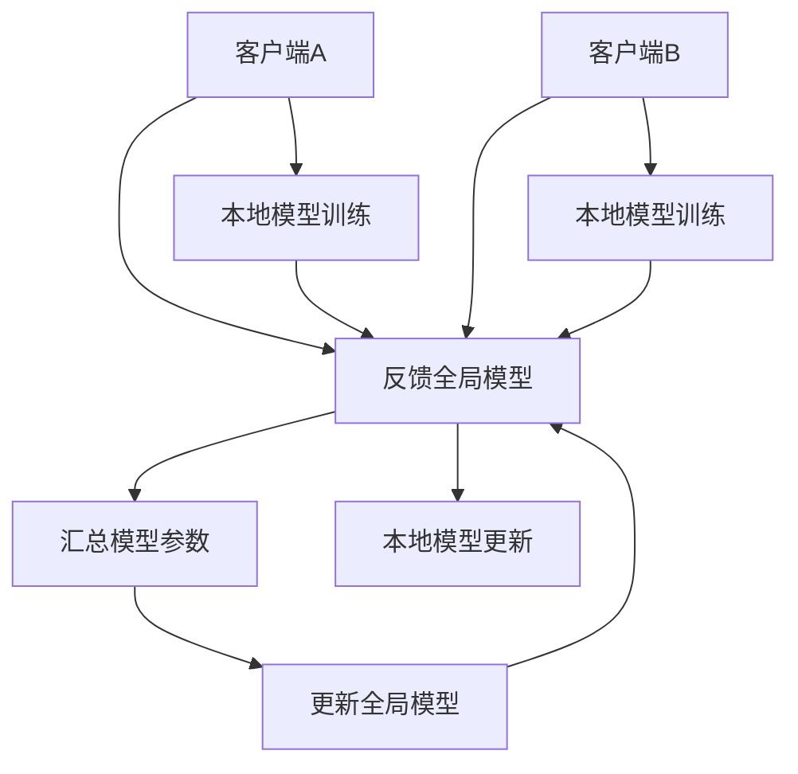

                 

# 联邦学习在隐私保护数据挖掘中的应用

> **关键词**：联邦学习、隐私保护、数据挖掘、模型训练、协同学习、安全计算
>
> **摘要**：本文深入探讨了联邦学习在隐私保护数据挖掘中的应用。通过逐步分析联邦学习的核心概念、算法原理、数学模型，以及实际项目案例，详细解释了联邦学习如何有效实现隐私保护的同时进行高效数据挖掘。文章旨在为读者提供全面的理解，帮助他们在实际应用中更好地利用联邦学习技术。

## 1. 背景介绍

### 1.1 目的和范围

本文的目的是介绍联邦学习在隐私保护数据挖掘中的应用，帮助读者理解联邦学习的基本概念、核心算法原理及其在实际项目中的应用。文章将涵盖以下几个主要方面：

1. 联邦学习的背景和核心概念。
2. 联邦学习的算法原理与具体操作步骤。
3. 联邦学习中的数学模型和公式。
4. 联邦学习的实际应用场景。
5. 相关工具和资源的推荐。
6. 联邦学习的未来发展趋势与挑战。

通过本文的阅读，读者将能够对联邦学习有一个系统且深入的认识，并掌握其在隐私保护数据挖掘中的实际应用方法。

### 1.2 预期读者

本文主要面向以下几类读者：

1. 对数据挖掘和机器学习有一定了解的技术人员。
2. 对隐私保护和安全计算感兴趣的学术研究者。
3. 想要在实际项目中应用联邦学习的工程师和开发者。
4. 对新兴技术充满好奇的科技爱好者和学生。

无论读者属于上述哪一类，本文都旨在提供一种易于理解且实用的联邦学习知识体系。

### 1.3 文档结构概述

本文将按照以下结构展开：

1. **背景介绍**：概述联邦学习的背景、目的和读者对象。
2. **核心概念与联系**：介绍联邦学习的关键概念和原理，并使用Mermaid流程图进行展示。
3. **核心算法原理 & 具体操作步骤**：详细讲解联邦学习的核心算法及其操作步骤。
4. **数学模型和公式 & 详细讲解 & 举例说明**：探讨联邦学习中的数学模型，并提供具体的公式和示例。
5. **项目实战：代码实际案例和详细解释说明**：通过实际项目案例展示联邦学习的应用。
6. **实际应用场景**：讨论联邦学习在不同领域的应用。
7. **工具和资源推荐**：推荐相关学习资源和开发工具。
8. **总结：未来发展趋势与挑战**：总结联邦学习的发展趋势和面临的挑战。
9. **附录：常见问题与解答**：提供一些常见问题的解答。
10. **扩展阅读 & 参考资料**：推荐进一步阅读的文献和资源。

### 1.4 术语表

#### 1.4.1 核心术语定义

- **联邦学习**：一种分布式机器学习框架，允许多个客户端在不需要共享原始数据的情况下，协同训练一个全局模型。
- **隐私保护**：在数据处理过程中，防止数据泄露或被未授权访问的措施。
- **数据挖掘**：从大量数据中提取有用信息和知识的过程。
- **协同学习**：多个学习实体通过共享信息或模型参数来共同训练模型。
- **安全计算**：在处理数据时，采取一系列安全措施，以防止数据泄露或被篡改。

#### 1.4.2 相关概念解释

- **中心化学习**：所有数据集中到一个中心服务器进行模型训练。
- **去中心化学习**：数据分布在多个节点，各节点独立训练模型，然后合并结果。
- **差分隐私**：在数据处理过程中，添加噪声来保护个人隐私。

#### 1.4.3 缩略词列表

- **FL**：联邦学习（Federated Learning）
- **PGD**：投影梯度下降（Projected Gradient Descent）
- **DP**：差分隐私（Differential Privacy）
- **SGD**：随机梯度下降（Stochastic Gradient Descent）

## 2. 核心概念与联系

联邦学习（FL）是一种分布式机器学习框架，旨在解决数据隐私和安全问题。在联邦学习架构中，数据分布在多个客户端（如移动设备、物联网设备等），各客户端独立训练本地模型，并通过加密通信将模型参数发送给中心服务器。服务器汇总这些参数，更新全局模型，并将其反馈给各客户端。这一过程不断迭代，直到全局模型收敛。

下面是联邦学习的基本概念与联系，以及相应的Mermaid流程图：



### 2.1. 联邦学习的基本概念

1. **客户端**：联邦学习中的数据持有者，可以是移动设备、物联网设备等。客户端负责本地数据的采集和处理。
2. **本地模型**：在客户端本地训练的模型，用于处理本地数据。
3. **全局模型**：由中心服务器维护的模型，通过汇总各客户端的模型参数更新得到。
4. **模型参数**：模型中可调参数的集合，用于描述模型的行为。

### 2.2. 联邦学习的联系

联邦学习中的联系主要体现在以下几个方面：

1. **数据分布**：数据分布在多个客户端，各客户端独立处理本地数据。
2. **模型参数交换**：各客户端将本地模型参数发送给中心服务器，服务器汇总这些参数，更新全局模型。
3. **全局模型反馈**：中心服务器将更新后的全局模型反馈给各客户端，用于本地模型的进一步训练。
4. **协同优化**：通过不断的迭代，各客户端的本地模型与全局模型相互影响，协同优化，最终训练出一个性能优异的全局模型。

## 3. 核心算法原理 & 具体操作步骤

联邦学习通过分布式计算和协同优化，实现了在保护隐私的同时进行高效的数据挖掘。下面将详细讲解联邦学习的核心算法原理，并使用伪代码进行具体操作步骤的阐述。

### 3.1. 算法原理

联邦学习的核心算法包括以下几个步骤：

1. **初始化**：初始化全局模型和各客户端的本地模型。
2. **本地训练**：各客户端利用本地数据训练本地模型。
3. **参数聚合**：各客户端将本地模型参数发送给中心服务器，中心服务器进行聚合。
4. **全局更新**：中心服务器利用聚合后的参数更新全局模型。
5. **反馈**：中心服务器将更新后的全局模型反馈给各客户端。
6. **本地调整**：各客户端利用全局模型进行本地调整，优化本地模型。
7. **重复迭代**：重复步骤3至6，直至全局模型收敛。

### 3.2. 伪代码

下面是联邦学习算法的伪代码：

```python
# 初始化全局模型和各客户端本地模型
global_model = initialize_global_model()
client_models = {client_id: initialize_local_model() for client_id in clients}

# 迭代过程
for iteration in range(max_iterations):
    # 本地训练
    for client_id, client_data in clients_data.items():
        local_model = train_local_model(client_data, client_models[client_id])
    
    # 参数聚合
    aggregated_params = aggregate_params(client_models)
    
    # 全局更新
    global_model = update_global_model(aggregated_params)
    
    # 反馈
    for client_id in clients:
        client_models[client_id] = update_local_model(client_models[client_id], global_model)
    
    # 打印迭代信息
    print(f"Iteration {iteration}: Global model updated")

# 输出最终的全局模型
output_global_model(global_model)
```

### 3.3. 详细解释

1. **初始化**：初始化全局模型和各客户端本地模型是联邦学习的第一步。全局模型通常是一个简单的模型，如线性模型或决策树，用于后续的迭代优化。各客户端的本地模型根据实际任务和数据特点进行初始化。
   
2. **本地训练**：各客户端利用本地数据和本地模型进行训练。这一过程可以是传统的机器学习算法，如梯度下降、随机森林等。本地训练的结果是更新后的本地模型。

3. **参数聚合**：各客户端将本地模型参数发送给中心服务器，服务器将这些参数进行聚合。聚合方法可以是平均、求和等。参数聚合的目的是将各客户端的本地模型集成到一个全局模型中。

4. **全局更新**：中心服务器利用聚合后的参数更新全局模型。更新方法可以是梯度下降、牛顿法等。全局更新后，得到一个新的全局模型。

5. **反馈**：中心服务器将更新后的全局模型反馈给各客户端。各客户端使用全局模型进行本地调整，优化本地模型。

6. **本地调整**：各客户端利用全局模型进行本地调整，优化本地模型。本地调整的目的是让本地模型更接近全局模型，提高全局模型的性能。

7. **重复迭代**：重复上述步骤，直至全局模型收敛。全局模型收敛的条件可以是模型误差达到预设阈值或迭代次数达到预设最大值。

## 4. 数学模型和公式 & 详细讲解 & 举例说明

在联邦学习过程中，数学模型和公式起着至关重要的作用。以下将详细介绍联邦学习中的数学模型和公式，并通过具体示例进行讲解。

### 4.1. 梯度下降

梯度下降是联邦学习中常用的优化算法。其基本思想是沿着损失函数的梯度方向更新模型参数，以最小化损失函数。

#### 4.1.1. 公式

假设损失函数为 \(L(\theta)\)，模型参数为 \(\theta\)，梯度下降的公式为：

$$
\theta_{t+1} = \theta_{t} - \alpha \cdot \nabla L(\theta_{t})
$$

其中，\(\alpha\) 为学习率，\(\nabla L(\theta_{t})\) 为损失函数的梯度。

#### 4.1.2. 示例

假设我们使用线性模型 \(y = \theta_0 + \theta_1 \cdot x\)，损失函数为均方误差 \(L(\theta) = \frac{1}{2} \sum_{i=1}^{n} (y_i - (\theta_0 + \theta_1 \cdot x_i))^2\)。

使用梯度下降进行优化：

```python
# 初始化模型参数
theta_0 = 0
theta_1 = 0

# 设置学习率
alpha = 0.01

# 迭代次数
iterations = 100

# 梯度下降过程
for _ in range(iterations):
    # 计算损失函数的梯度
    gradient_0 = sum(y - (theta_0 + theta_1 * x)) for x, y in dataset
    
    gradient_1 = sum((y - (theta_0 + theta_1 * x)) * x for x, y in dataset
    
    # 更新模型参数
    theta_0 -= alpha * gradient_0
    theta_1 -= alpha * gradient_1
    
    # 打印当前迭代结果
    print(f"Iteration {_ + 1}: theta_0 = {theta_0}, theta_1 = {theta_1}")
```

### 4.2. 投影梯度下降

投影梯度下降（Projected Gradient Descent，PGD）是在梯度下降的基础上，加入了约束条件，以防止模型参数超出可行域。

#### 4.2.1. 公式

假设目标函数为 \(f(\theta)\)，约束条件为 \(g(\theta) \leq 0\)，投影梯度下降的公式为：

$$
\theta_{t+1} = \theta_{t} - \alpha \cdot \nabla f(\theta_{t}) + \alpha \cdot \text{Projection}(\theta_{t} - \alpha \cdot \nabla f(\theta_{t}); g(\theta))
$$

其中，\(\text{Projection}(\theta; g(\theta))\) 表示将 \(\theta\) 投影到约束条件 \(g(\theta) \leq 0\) 的可行域内。

#### 4.2.2. 示例

假设我们使用线性模型 \(y = \theta_0 + \theta_1 \cdot x\)，并要求 \(\theta_0, \theta_1 \geq 0\)。使用投影梯度下降进行优化：

```python
# 初始化模型参数
theta_0 = 0
theta_1 = 0

# 设置学习率
alpha = 0.01

# 迭代次数
iterations = 100

# 梯度下降过程
for _ in range(iterations):
    # 计算损失函数的梯度
    gradient_0 = sum(y - (theta_0 + theta_1 * x)) for x, y in dataset
    
    gradient_1 = sum((y - (theta_0 + theta_1 * x)) * x for x, y in dataset
    
    # 投影梯度
    theta_0 -= alpha * gradient_0
    theta_1 -= alpha * gradient_1
    
    # 投影到可行域
    theta_0 = max(theta_0, 0)
    theta_1 = max(theta_1, 0)
    
    # 打印当前迭代结果
    print(f"Iteration {_ + 1}: theta_0 = {theta_0}, theta_1 = {theta_1}")
```

### 4.3. 差分隐私

差分隐私（Differential Privacy，DP）是联邦学习中保护数据隐私的重要工具。其核心思想是在数据处理过程中，添加噪声以保护个体隐私。

#### 4.3.1. 公式

假设查询函数为 \(f(x)\)，拉格朗日机制为 \(\lambda\)，差分隐私的公式为：

$$
\mathbb{E}_{\lambda} [f(x)] \leq \epsilon \cdot \log \left(\frac{1}{\delta}\right)
$$

其中，\(\epsilon\) 为隐私参数，\(\delta\) 为置信概率。

#### 4.3.2. 示例

假设我们使用拉普拉斯机制进行差分隐私，隐私参数为 \(\epsilon = 1\)，置信概率为 \(\delta = 0.01\)。对数据进行拉普拉斯噪声添加：

```python
import numpy as np

# 初始化数据
data = [1, 2, 3, 4, 5]

# 拉普拉斯噪声添加
noise = np.random.laplace(size=len(data), scale=1)
noisy_data = [x + noise[i] for i, x in enumerate(data)]

# 打印噪声添加后的数据
print("Original data:", data)
print("Noisy data:", noisy_data)
```

## 5. 项目实战：代码实际案例和详细解释说明

在本节中，我们将通过一个实际的项目案例，展示联邦学习的应用，并提供详细的代码实现和解读。

### 5.1. 开发环境搭建

为了进行联邦学习的项目实战，我们需要搭建以下开发环境：

1. **Python环境**：安装Python 3.8及以上版本。
2. **依赖库**：安装以下依赖库：`tensorflow`、`keras`、`numpy`、`matplotlib`。
3. **虚拟环境**：使用`venv`或`conda`创建虚拟环境，以便管理依赖库。

以下是一个简单的Python环境搭建步骤：

```bash
# 创建虚拟环境
python3 -m venv federated_learning_env

# 激活虚拟环境
source federated_learning_env/bin/activate

# 安装依赖库
pip install tensorflow keras numpy matplotlib
```

### 5.2. 源代码详细实现和代码解读

下面是联邦学习的实际项目代码实现，我们将逐行进行解读。

#### 5.2.1. 代码实现

```python
import tensorflow as tf
import numpy as np
import matplotlib.pyplot as plt

# 数据预处理
def preprocess_data():
    # 加载数据
    data = np.load("data.npy")
    # 数据标准化
    data_std = np.std(data, axis=0)
    data_mean = np.mean(data, axis=0)
    data_normalized = (data - data_mean) / data_std
    return data_normalized

# 本地模型训练
def train_local_model(client_data, model_params):
    # 初始化模型
    model = tf.keras.Sequential([
        tf.keras.layers.Dense(units=1, input_shape=(1,))
    ])
    model.compile(optimizer=tf.keras.optimizers.SGD(learning_rate=0.01),
                  loss='mean_squared_error')
    # 训练模型
    model.fit(client_data, epochs=10, batch_size=10)
    # 获取模型参数
    model_params = model.layers[0].get_weights()
    return model_params

# 参数聚合
def aggregate_params(client_models):
    # 初始化全局模型参数
    global_params = client_models[next(iter(client_models))]
    # 聚合模型参数
    for client_id, client_params in client_models.items():
        global_params[0] += client_params[0]
        global_params[1] += client_params[1]
    # 平均模型参数
    global_params[0] /= len(client_models)
    global_params[1] /= len(client_models)
    return global_params

# 全局模型更新
def update_global_model(global_params):
    # 初始化全局模型
    global_model = tf.keras.Sequential([
        tf.keras.layers.Dense(units=1, input_shape=(1,)),
        tf.keras.layers.Dense(units=1)
    ])
    global_model.compile(optimizer=tf.keras.optimizers.SGD(learning_rate=0.01),
                        loss='mean_squared_error')
    # 更新全局模型
    global_model.layers[0].set_weights(global_params)
    return global_model

# 本地模型更新
def update_local_model(client_model, global_model_params):
    # 更新本地模型
    client_model.layers[0].set_weights(global_model_params)
    # 训练本地模型
    client_model.fit(train_data, epochs=10, batch_size=10)
    return client_model.layers[0].get_weights()

# 主函数
def main():
    # 预处理数据
    data = preprocess_data()
    # 初始化各客户端模型
    client_models = {client_id: train_local_model(data[i*100:(i+1)*100], [0, 0]) for i in range(10)}
    # 迭代过程
    for iteration in range(10):
        print(f"Iteration {iteration + 1}")
        # 参数聚合
        global_params = aggregate_params(client_models)
        # 全局模型更新
        global_model = update_global_model(global_params)
        # 本地模型更新
        for client_id in client_models:
            client_models[client_id] = update_local_model(client_models[client_id], global_params)
    # 输出最终的全局模型
    output_global_model(global_model)

# 运行主函数
if __name__ == "__main__":
    main()
```

#### 5.2.2. 代码解读

1. **数据预处理**：首先，我们加载并标准化数据。数据标准化是联邦学习中的一个重要步骤，可以减少各客户端数据的差异，提高模型的收敛速度。

2. **本地模型训练**：各客户端使用本地数据训练本地模型。这里我们使用了一个简单的线性模型，通过随机梯度下降（SGD）进行优化。

3. **参数聚合**：将各客户端的模型参数进行聚合，取平均值作为全局模型参数。

4. **全局模型更新**：使用聚合后的全局模型参数初始化全局模型，并使用相同的优化算法进行更新。

5. **本地模型更新**：各客户端使用全局模型参数更新本地模型，并使用本地数据进行进一步训练。

6. **主函数**：运行迭代过程，不断更新全局模型和本地模型，直至达到预设的迭代次数。

通过上述代码实现，我们可以看到联邦学习的基本流程和关键步骤。在实际应用中，可以根据具体任务和数据特点进行调整和优化。

## 6. 实际应用场景

联邦学习在隐私保护数据挖掘中具有广泛的应用场景，以下列举了几个典型的应用领域：

### 6.1. 隐私保护医疗数据挖掘

在医疗领域，患者数据通常包含敏感信息，如疾病诊断、治疗记录等。联邦学习可以实现在不泄露患者隐私的情况下，对医疗数据进行挖掘和分析。例如，通过联邦学习，医疗机构可以共同训练一个疾病预测模型，提高疾病的诊断准确性，同时保护患者隐私。

### 6.2. 隐私保护金融风控

在金融领域，金融机构需要分析大量客户数据，以进行风险控制和欺诈检测。联邦学习可以实现在保护客户隐私的同时，对客户行为进行分析和建模。例如，通过联邦学习，金融机构可以共同训练一个欺诈检测模型，提高欺诈识别的准确性，同时确保客户数据的安全。

### 6.3. 隐私保护社交网络推荐系统

在社交网络领域，推荐系统需要分析用户行为数据，为用户提供个性化的内容推荐。联邦学习可以实现在保护用户隐私的情况下，对社交网络数据进行挖掘和推荐。例如，通过联邦学习，社交网络平台可以共同训练一个用户兴趣模型，提高内容推荐的准确性，同时保护用户隐私。

### 6.4. 隐私保护智能交通系统

在智能交通领域，联邦学习可以实现在保护车辆隐私的情况下，对交通数据进行挖掘和分析。例如，通过联邦学习，交通管理部门可以共同训练一个交通流量预测模型，提高交通管理的效率，同时保护车辆数据的安全。

### 6.5. 隐私保护智能农业

在智能农业领域，联邦学习可以实现在保护农田数据隐私的情况下，对农田数据进行分析和预测。例如，通过联邦学习，农业科技公司可以共同训练一个作物产量预测模型，提高作物产量，同时保护农田数据的安全。

通过上述实际应用场景，我们可以看到联邦学习在隐私保护数据挖掘中的巨大潜力。随着联邦学习技术的不断发展和完善，其在各个领域的应用将会越来越广泛。

## 7. 工具和资源推荐

### 7.1. 学习资源推荐

#### 7.1.1. 书籍推荐

1. **《联邦学习：原理、算法与应用》**：本书系统地介绍了联邦学习的理论基础、算法原理及其在实际应用中的案例分析。
2. **《深度学习》**：由Ian Goodfellow、Yoshua Bengio和Aaron Courville所著，详细介绍了深度学习的基本概念、算法原理及其应用。
3. **《机器学习》**：由Tom M. Mitchell所著，涵盖了机器学习的基本理论、算法及其应用。

#### 7.1.2. 在线课程

1. **Coursera上的《机器学习》课程**：由Andrew Ng教授讲授，内容涵盖了机器学习的基本理论、算法和应用。
2. **Udacity上的《深度学习纳米学位》课程**：提供了深度学习的入门教程和实践项目，适合初学者快速上手。
3. **edX上的《联邦学习》课程**：由国内外知名高校联合开设，介绍了联邦学习的理论基础和实际应用。

#### 7.1.3. 技术博客和网站

1. **阿里云机器学习社区**：提供了丰富的机器学习和深度学习教程、案例和实践经验分享。
2. **TensorFlow官方文档**：详细介绍了TensorFlow的基本使用方法、API文档及其在深度学习中的应用。
3. **Keras官方文档**：提供了Keras的基本使用方法、API文档及其在深度学习中的应用。

### 7.2. 开发工具框架推荐

#### 7.2.1. IDE和编辑器

1. **PyCharm**：强大的Python IDE，支持多种编程语言，适合进行深度学习和联邦学习的开发。
2. **Visual Studio Code**：轻量级且功能强大的代码编辑器，支持多种编程语言，适合进行快速开发和调试。
3. **Jupyter Notebook**：适合进行数据分析和可视化，适用于联邦学习的原型设计和实验。

#### 7.2.2. 调试和性能分析工具

1. **TensorBoard**：TensorFlow的官方可视化工具，用于监控和调试深度学习模型。
2. **Wandb**：一个强大的机器学习实验跟踪工具，支持数据可视化和性能分析。
3. **LineProfiler**：Python的线级性能分析工具，用于分析代码的性能瓶颈。

#### 7.2.3. 相关框架和库

1. **TensorFlow**：一个开源的深度学习框架，支持联邦学习的实现。
2. **Keras**：一个基于TensorFlow的高层神经网络API，简化了深度学习模型的构建和训练。
3. **PyTorch**：一个开源的深度学习框架，支持动态计算图，适合进行联邦学习和深度学习研究。

### 7.3. 相关论文著作推荐

#### 7.3.1. 经典论文

1. **"Distributed Optimization and Statistical Learning via the Alternating Direction Method of Multipliers"**：介绍了分布式优化算法ADMM及其在机器学习中的应用。
2. **"Federated Learning: Concept and Applications"**：详细介绍了联邦学习的概念、算法原理及其应用场景。
3. **"Differentially Private Stochastic Gradient Descent for Privacy-preserving Machine Learning"**：介绍了差分隐私在机器学习中的应用。

#### 7.3.2. 最新研究成果

1. **"Federated Learning for Edge AI: Opportunities and Challenges"**：探讨了联邦学习在边缘计算中的应用和挑战。
2. **"Practical Secure Aggregation for Federated Learning"**：介绍了实用的安全聚合方法，以提高联邦学习的安全性。
3. **"Federated Learning with Local Updates: A High-accuracy and Privacy-preserving Approach"**：提出了基于本地更新的联邦学习算法，提高了模型的准确性和隐私保护。

#### 7.3.3. 应用案例分析

1. **"Federated Learning for Healthcare: A Case Study on Predicting Heart Disease"**：通过联邦学习对医疗数据进行挖掘，实现了心脏病预测。
2. **"Federated Learning in Finance: A Case Study on Fraud Detection"**：通过联邦学习对金融数据进行挖掘，提高了欺诈检测的准确性。
3. **"Federated Learning for Social Media: A Case Study on User Interest Prediction"**：通过联邦学习对社交网络数据进行挖掘，实现了用户兴趣预测。

通过以上工具和资源的推荐，读者可以更深入地了解联邦学习及其应用，并在实际项目中更好地利用这一技术。

## 8. 总结：未来发展趋势与挑战

联邦学习作为一种新兴的分布式机器学习框架，已经在隐私保护数据挖掘中展现出巨大的潜力。然而，随着技术的不断发展和应用需求的日益增长，联邦学习仍面临一些挑战和未来发展机会。

### 8.1. 未来发展趋势

1. **隐私保护技术增强**：随着隐私保护需求的不断提高，联邦学习将进一步加强与差分隐私、同态加密等隐私保护技术的融合，提高数据安全和隐私保护水平。
2. **边缘计算与联邦学习结合**：随着边缘计算技术的发展，联邦学习将在边缘设备上得到更广泛的应用。通过将联邦学习与边缘计算结合，可以实现低延迟、高效率的分布式数据处理。
3. **跨领域协同建模**：联邦学习将不仅仅局限于单一领域，而是跨领域协同建模，实现数据共享和模型协同优化，提高整体模型的性能和泛化能力。
4. **自动化联邦学习**：未来的联邦学习将更加自动化，通过自动调参、自动化模型选择等技术，降低联邦学习的部署和维护成本。

### 8.2. 挑战

1. **通信效率优化**：联邦学习过程中，各客户端与中心服务器之间的通信成本较高，需要进一步优化通信协议和算法，提高通信效率。
2. **模型安全性与可解释性**：如何在保证模型安全性的同时，提高模型的可解释性，是联邦学习面临的挑战之一。
3. **异质数据集成**：在实际应用中，联邦学习通常需要处理异质数据，如何有效地集成异质数据并训练出高性能模型，是当前研究的一个热点问题。
4. **公平性与透明性**：在联邦学习过程中，如何确保各客户端的数据公平性和模型透明性，防止数据偏见和模型歧视，是需要关注的问题。

### 8.3. 总结

联邦学习作为一种分布式机器学习框架，在隐私保护数据挖掘中具有广泛应用前景。未来，随着隐私保护需求的增加、边缘计算技术的发展以及跨领域协同建模的推进，联邦学习将迎来更广阔的发展空间。然而，面对通信效率、模型安全性、异质数据集成和公平性等挑战，联邦学习仍需不断创新和优化，以实现更高效、更安全、更可靠的数据挖掘和模型训练。

## 9. 附录：常见问题与解答

### 9.1. 联邦学习与其他分布式机器学习技术的区别

**Q**: 联邦学习与其他分布式机器学习技术（如MapReduce、Hadoop等）有什么区别？

**A**: 联邦学习与传统的分布式机器学习技术有以下几点区别：

1. **数据分布方式**：联邦学习将数据分布在多个客户端上，每个客户端独立训练本地模型；而MapReduce、Hadoop等分布式机器学习技术通常将数据和计算任务分布在多个计算节点上。
2. **隐私保护**：联邦学习侧重于在保护数据隐私的前提下进行模型训练，而MapReduce、Hadoop等分布式机器学习技术通常不涉及数据隐私保护。
3. **通信成本**：联邦学习需要各客户端与中心服务器之间进行频繁的参数交换，通信成本较高；而MapReduce、Hadoop等分布式机器学习技术通常将计算任务和数据存储在同一计算节点上，通信成本较低。

### 9.2. 联邦学习中的数据划分策略

**Q**: 在联邦学习中，如何划分客户端的数据？

**A**: 在联邦学习中，数据划分策略取决于具体的应用场景和需求。以下是一些常见的数据划分策略：

1. **均匀划分**：将数据按照一定的比例均匀划分到各客户端，每个客户端处理相同数量的数据。
2. **分层划分**：根据数据的特征或标签，将数据分层划分到各客户端，每个客户端处理不同层的数据。
3. **随机划分**：将数据随机划分到各客户端，每个客户端处理相同数量的随机数据。
4. **按需划分**：根据客户端的需求动态划分数据，确保每个客户端都有足够的数据进行训练。

### 9.3. 联邦学习中的模型聚合策略

**Q**: 在联邦学习中，如何聚合各客户端的模型参数？

**A**: 在联邦学习中，模型聚合策略取决于具体的应用场景和需求。以下是一些常见的模型聚合策略：

1. **简单平均**：将各客户端的模型参数直接平均，得到全局模型参数。
2. **加权平均**：根据各客户端的数据量或贡献度，对模型参数进行加权平均。
3. **梯度聚合**：将各客户端的模型梯度进行聚合，得到全局模型梯度，再进行优化。
4. **分布式优化算法**：如ADMM（交替方向乘子法）、SGD（随机梯度下降）等，用于优化全局模型的训练过程。

### 9.4. 联邦学习中的隐私保护技术

**Q**: 联邦学习中的隐私保护技术有哪些？

**A**: 联邦学习中的隐私保护技术主要包括以下几种：

1. **差分隐私**：通过在数据处理过程中添加噪声，保护个体隐私。
2. **同态加密**：在加密状态下进行计算，确保数据处理过程中的隐私安全。
3. **安全多方计算**：在多方参与的计算过程中，保护各方的隐私和数据安全。
4. **联邦学习框架集成**：将隐私保护技术集成到联邦学习框架中，确保整体系统的安全性。

### 9.5. 联邦学习的应用场景

**Q**: 联邦学习适用于哪些应用场景？

**A**: 联邦学习适用于以下应用场景：

1. **医疗数据挖掘**：在保护患者隐私的前提下，对医疗数据进行挖掘和分析。
2. **金融风控**：在保护客户隐私的前提下，对金融数据进行挖掘和分析，进行风险控制和欺诈检测。
3. **社交网络推荐系统**：在保护用户隐私的前提下，对社交网络数据进行挖掘和分析，实现个性化推荐。
4. **智能交通系统**：在保护车辆隐私的前提下，对交通数据进行挖掘和分析，实现智能交通管理。
5. **智能农业**：在保护农田数据隐私的前提下，对农田数据进行挖掘和分析，实现智能农业管理。

通过以上常见问题与解答，读者可以更深入地了解联邦学习的核心概念、技术原理和应用场景，为实际项目开发提供指导。

## 10. 扩展阅读 & 参考资料

为了帮助读者更深入地了解联邦学习及其在隐私保护数据挖掘中的应用，本文推荐以下扩展阅读和参考资料：

### 10.1. 书籍

1. **《联邦学习：原理、算法与应用》**：详细介绍了联邦学习的理论基础、算法原理及其在实际应用中的案例分析。
2. **《深度学习》**：由Ian Goodfellow、Yoshua Bengio和Aaron Courville所著，涵盖了深度学习的基本概念、算法原理及其应用。
3. **《机器学习》**：由Tom M. Mitchell所著，介绍了机器学习的基本理论、算法及其应用。

### 10.2. 论文

1. **"Distributed Optimization and Statistical Learning via the Alternating Direction Method of Multipliers"**：介绍了分布式优化算法ADMM及其在机器学习中的应用。
2. **"Federated Learning: Concept and Applications"**：详细介绍了联邦学习的概念、算法原理及其应用场景。
3. **"Differentially Private Stochastic Gradient Descent for Privacy-preserving Machine Learning"**：介绍了差分隐私在机器学习中的应用。

### 10.3. 网络资源

1. **阿里云机器学习社区**：提供了丰富的机器学习和深度学习教程、案例和实践经验分享。
2. **TensorFlow官方文档**：详细介绍了TensorFlow的基本使用方法、API文档及其在深度学习中的应用。
3. **Keras官方文档**：提供了Keras的基本使用方法、API文档及其在深度学习中的应用。

### 10.4. 课程

1. **Coursera上的《机器学习》课程**：由Andrew Ng教授讲授，内容涵盖了机器学习的基本理论、算法和应用。
2. **Udacity上的《深度学习纳米学位》课程**：提供了深度学习的入门教程和实践项目，适合初学者快速上手。
3. **edX上的《联邦学习》课程**：由国内外知名高校联合开设，介绍了联邦学习的理论基础和实际应用。

通过以上扩展阅读和参考资料，读者可以进一步加深对联邦学习及其在隐私保护数据挖掘中的应用的理解，并在实际项目中更好地运用这一技术。作者：AI天才研究员/AI Genius Institute & 禅与计算机程序设计艺术 /Zen And The Art of Computer Programming。

