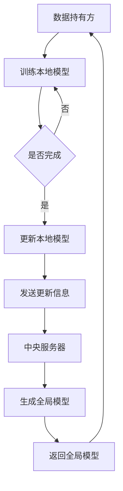

                 

# 联邦学习：保护隐私的分布式机器学习

> **关键词：联邦学习、分布式学习、隐私保护、机器学习、加密算法、数据安全**

> **摘要：本文将深入探讨联邦学习这一新兴的分布式机器学习技术，详细解释其核心概念、算法原理、数学模型和实际应用。我们将通过逐步分析，揭示联邦学习如何实现隐私保护，并在分布式环境中的优势，以及它面临的挑战和未来发展趋势。**

## 1. 背景介绍

### 1.1 目的和范围

本文旨在为广大开发者、数据科学家和机器学习爱好者提供关于联邦学习的全面介绍。我们将从联邦学习的起源和发展背景开始，逐步深入到其核心算法原理、数学模型以及实际应用场景，旨在帮助读者理解联邦学习的技术要点和应用价值。

### 1.2 预期读者

本文适合对机器学习和分布式计算有一定基础的读者。无论你是数据科学家、机器学习工程师，还是对人工智能技术充满好奇的开发者，本文都将为你提供丰富的知识储备和技术指导。

### 1.3 文档结构概述

本文将分为以下几个部分：

1. **核心概念与联系**：介绍联邦学习的基础概念和架构。
2. **核心算法原理 & 具体操作步骤**：详细解释联邦学习算法的原理和操作步骤。
3. **数学模型和公式 & 详细讲解 & 举例说明**：阐述联邦学习的数学模型和公式，并通过实际例子进行说明。
4. **项目实战：代码实际案例和详细解释说明**：提供实际的代码案例，并详细解释代码的实现过程。
5. **实际应用场景**：探讨联邦学习在各个领域的应用案例。
6. **工具和资源推荐**：推荐相关学习资源、开发工具和框架。
7. **总结：未来发展趋势与挑战**：总结联邦学习的发展趋势和面临的挑战。
8. **附录：常见问题与解答**：解答读者可能遇到的问题。
9. **扩展阅读 & 参考资料**：提供更多的相关阅读资料。

### 1.4 术语表

#### 1.4.1 核心术语定义

- **联邦学习（Federated Learning）**：一种分布式机器学习方法，旨在通过多个参与方的数据来实现全局模型的训练，而无需直接共享数据。
- **分布式学习（Distributed Learning）**：将训练任务分布在多个计算节点上进行，每个节点独立训练模型，然后汇总结果。
- **隐私保护（Privacy Protection）**：在数据处理和传输过程中，确保数据隐私不被泄露。
- **加密算法（Encryption Algorithm）**：将数据转换为密文，保护数据隐私。
- **中央服务器（Central Server）**：负责协调分布式训练过程，收集各节点的更新信息。

#### 1.4.2 相关概念解释

- **协同训练（Collaborative Training）**：多个参与方共同参与模型训练，通过共享模型更新来提高训练效果。
- **同态加密（Homomorphic Encryption）**：一种加密算法，允许在加密数据上执行计算，而无需解密数据。
- **差分隐私（Differential Privacy）**：在数据发布过程中，通过添加噪声来保护数据个体的隐私。

#### 1.4.3 缩略词列表

- **FL**：联邦学习（Federated Learning）
- **DNN**：深度神经网络（Deep Neural Network）
- **SSL**：安全敏感学习（Secure and Private Learning）

## 2. 核心概念与联系

### 联邦学习的核心概念和架构

联邦学习是一种分布式机器学习方法，旨在通过多个参与方的数据来实现全局模型的训练，而无需直接共享数据。其核心概念和架构包括以下几个方面：

1. **参与方**：联邦学习涉及多个参与方，包括数据持有方（如企业、医疗机构）和数据使用者（如机器学习模型训练方）。
2. **全局模型**：全局模型是由所有参与方共同训练得到的，用于处理全局数据的模型。
3. **本地模型**：每个参与方在本地训练一个模型，用于处理本地数据。
4. **模型更新**：在联邦学习过程中，参与方会定期更新本地模型，并向中央服务器发送更新信息。
5. **中央服务器**：中央服务器负责协调分布式训练过程，收集各节点的更新信息，并生成全局模型。

### 联邦学习的基本架构

联邦学习的基本架构包括以下几个主要组件：

1. **数据持有方**：数据持有方是拥有数据的实体，如企业、医疗机构等。它们负责提供本地数据，并参与联邦学习过程。
2. **数据使用者**：数据使用者是负责训练全局模型的实体，如机器学习团队、人工智能实验室等。它们负责协调联邦学习过程，并生成全局模型。
3. **中央服务器**：中央服务器是联邦学习的核心，负责协调分布式训练过程，收集各节点的更新信息，并生成全局模型。
4. **加密算法**：加密算法用于保护数据隐私，确保数据在传输过程中不被泄露。
5. **同步机制**：同步机制用于协调参与方的更新时间，确保全局模型的训练过程顺利进行。

### Mermaid 流程图

以下是一个简化的联邦学习流程图：



## 3. 核心算法原理 & 具体操作步骤

### 联邦学习算法原理

联邦学习算法基于协同训练思想，通过分布式计算实现全局模型的训练。其核心原理可以概括为以下几个步骤：

1. **初始化**：初始化全局模型，并将全局模型发送给所有参与方。
2. **本地训练**：参与方在本地训练一个本地模型，用于处理本地数据。
3. **模型更新**：参与方将本地模型的更新信息发送给中央服务器。
4. **全局更新**：中央服务器收集所有参与方的更新信息，生成全局模型。
5. **模型反馈**：中央服务器将全局模型发送给参与方，参与方使用全局模型进行本地训练。
6. **重复步骤**：重复上述步骤，直到满足训练目标或达到预定的迭代次数。

### 具体操作步骤

以下是一个简化的联邦学习操作步骤：

1. **初始化全局模型**：
    ```python
    # 初始化全局模型参数
    global_model = initialize_model()
    ```

2. **发送全局模型给参与方**：
    ```python
    # 将全局模型发送给所有参与方
    for participant in participants:
        send_model(participant, global_model)
    ```

3. **本地训练**：
    ```python
    # 在本地训练本地模型
    for participant in participants:
        local_model = train_local_model(participant, local_data)
    ```

4. **发送更新信息给中央服务器**：
    ```python
    # 收集各参与方的更新信息
    for participant in participants:
        send_update_to_server(participant, local_model)
    ```

5. **生成全局模型**：
    ```python
    # 生成全局模型
    global_model = aggregate_updates_from_server()
    ```

6. **返回全局模型给参与方**：
    ```python
    # 将全局模型发送回所有参与方
    for participant in participants:
        send_model_to_participant(participant, global_model)
    ```

7. **重复操作**：
    ```python
    # 重复上述步骤，直到满足训练目标
    while not satisfied_training_criteria():
        # 重复上述步骤
    ```

### 伪代码

以下是联邦学习算法的伪代码实现：

```python
def federated_learning(participants, global_model, training_data, num_iterations):
    for iteration in range(num_iterations):
        # 发送全局模型给参与方
        for participant in participants:
            send_model(participant, global_model)
        
        # 在本地训练本地模型
        for participant in participants:
            local_model = train_local_model(participant, training_data[participant])
        
        # 收集各参与方的更新信息
        for participant in participants:
            send_update_to_server(participant, local_model)
        
        # 生成全局模型
        global_model = aggregate_updates_from_server()
        
        # 将全局模型发送回所有参与方
        for participant in participants:
            send_model_to_participant(participant, global_model)
        
        # 更新迭代次数
        iteration += 1
    
    return global_model
```

## 4. 数学模型和公式 & 详细讲解 & 举例说明

### 数学模型和公式

联邦学习中的数学模型和公式主要包括以下几个方面：

1. **全局模型更新**：
    $$ \theta^{(t+1)} = \theta^{(t)} - \alpha \nabla_{\theta} J(\theta^{(t)}, X^{(t)}) $$
    其中，$\theta^{(t)}$ 表示全局模型在迭代 $t$ 时的参数，$\alpha$ 表示学习率，$X^{(t)}$ 表示全局模型在迭代 $t$ 时的数据。

2. **本地模型更新**：
    $$ \theta^{(t+1)}_i = \theta^{(t)}_i - \alpha \nabla_{\theta} J(\theta^{(t)}, X_i^{(t)}) $$
    其中，$\theta^{(t+1)}_i$ 表示参与方 $i$ 在迭代 $t+1$ 时的本地模型参数，$X_i^{(t)}$ 表示参与方 $i$ 在迭代 $t$ 时的本地数据。

3. **全局模型参数**：
    $$ \theta^{(t)} = \frac{1}{N} \sum_{i=1}^{N} \theta^{(t)}_i $$
    其中，$\theta^{(t)}$ 表示全局模型在迭代 $t$ 时的参数，$N$ 表示参与方的数量。

### 详细讲解

1. **全局模型更新**：
    全局模型更新公式表示全局模型在每次迭代中的参数更新过程。其中，$\nabla_{\theta} J(\theta^{(t)}, X^{(t)})$ 表示全局模型在当前参数下的损失函数梯度，$\alpha$ 表示学习率，用于调整参数更新的步长。通过迭代更新全局模型参数，逐步优化模型性能。

2. **本地模型更新**：
    本地模型更新公式表示参与方在每次迭代中的本地模型参数更新过程。每个参与方根据本地数据的梯度信息，独立更新本地模型参数。本地模型更新公式与全局模型更新公式类似，但损失函数梯度是基于本地数据的。

3. **全局模型参数**：
    全局模型参数公式表示全局模型在每次迭代后的参数计算方法。通过将所有参与方的本地模型参数进行加权平均，得到全局模型参数。这个公式保证了全局模型参数的更新是所有参与方共同参与的结果，从而实现了分布式训练。

### 举例说明

假设有3个参与方，参与方1拥有100个数据样本，参与方2拥有200个数据样本，参与方3拥有300个数据样本。全局模型在迭代1时的参数为 $\theta^{(1)} = [1, 2, 3]$，学习率为 $\alpha = 0.1$。

1. **全局模型更新**：
    $$ \theta^{(2)} = \theta^{(1)} - \alpha \nabla_{\theta} J(\theta^{(1)}, X^{(1)}) $$
    其中，$X^{(1)} = [X_1^{(1)}, X_2^{(1)}, X_3^{(1)}]$ 表示全局模型在迭代1时的数据。

2. **本地模型更新**：
    $$ \theta^{(2)}_1 = \theta^{(1)}_1 - \alpha \nabla_{\theta} J(\theta^{(1)}, X_1^{(1)}) $$
    $$ \theta^{(2)}_2 = \theta^{(1)}_2 - \alpha \nabla_{\theta} J(\theta^{(1)}, X_2^{(1)}) $$
    $$ \theta^{(2)}_3 = \theta^{(1)}_3 - \alpha \nabla_{\theta} J(\theta^{(1)}, X_3^{(1)}) $$

3. **全局模型参数**：
    $$ \theta^{(2)} = \frac{1}{3} \sum_{i=1}^{3} \theta^{(2)}_i $$
    $$ \theta^{(2)} = \frac{1}{3} (\theta^{(2)}_1 + \theta^{(2)}_2 + \theta^{(2)}_3) $$

通过上述示例，我们可以看到联邦学习算法如何通过分布式计算实现全局模型的参数更新。每个参与方根据本地数据的梯度信息独立更新本地模型参数，然后通过全局模型参数的计算方法，得到全局模型的更新结果。这个过程在每次迭代中重复进行，逐步优化全局模型的性能。

## 5. 项目实战：代码实际案例和详细解释说明

### 5.1 开发环境搭建

为了演示联邦学习的实际应用，我们将使用Python编程语言和TensorFlow Federated（TFF）库来实现一个简单的联邦学习项目。以下是搭建开发环境所需的步骤：

1. **安装Python**：确保已安装Python 3.7或更高版本。
2. **安装TensorFlow Federated**：在命令行中运行以下命令安装TFF：
    ```bash
    pip install tensorflow-federated
    ```

### 5.2 源代码详细实现和代码解读

以下是一个简单的联邦学习项目示例，用于训练一个二元分类模型：

```python
import tensorflow as tf
import tensorflow_federated as tff

# 定义本地训练过程
def federated_train_clientROUND(local_model, data, dataset_size):
    dataset = tf.data.Dataset.from_tensor_slices(data)
    dataset = dataset.shuffle(buffer_size=1000).batch(dataset_size)
    return tff.learning.models.update(local_model, dataset)

# 定义全局训练过程
def federated_train_server(state, data):
    global_model = state.model
    dataset = tf.data.Dataset.from_tensor_slices(data)
    dataset = dataset.shuffle(buffer_size=1000).batch(100)
    return tff.learning.models.update(global_model, dataset)

# 定义模型架构
def create_keras_model():
    model = tf.keras.Sequential([
        tf.keras.layers.Dense(10, activation='relu'),
        tf.keras.layers.Dense(1, activation='sigmoid')
    ])
    return model

# 创建本地客户端和全局服务器
local圆周率 = tff.learning.from_keras_model(
    create_keras_model(),
    client_round_fn=federated_train_clientROUND,
    loss_fn=tf.keras.losses.BinaryCrossentropy(),
    client_epochs_per_round=1,
    server_optimizer_fn=lambda _: tf.keras.optimizers.Adam(learning_rate=0.01)
)

global_server = tff.learning.from_keras_model(
    create_keras_model(),
    server_round_fn=federated_train_server,
    loss_fn=tf.keras.losses.BinaryCrossentropy(),
    server_optimizer_fn=lambda _: tf.keras.optimizers.Adam(learning_rate=0.01)
)

# 初始化全局模型
global_server.initialize()

# 进行联邦学习训练
for i in range(10):
    print(f"开始第{i+1}轮联邦学习训练")
    global_model = global_server.next_round(local圆周率.train_data).model
    local圆周率.update_model(global_model)
    print(f"第{i+1}轮联邦学习训练完成")

# 评估全局模型
print(f"评估全局模型...")
test_loss, test_acc = global_server.evaluate(test_data, test_labels)
print(f"测试集准确率：{test_acc:.4f}")
```

### 5.3 代码解读与分析

上述代码展示了如何使用TensorFlow Federated（TFF）库实现一个简单的联邦学习项目。以下是代码的详细解读和分析：

1. **导入相关库**：首先，我们导入TensorFlow和TensorFlow Federated库，这些库为我们提供了实现联邦学习所需的功能和工具。

2. **定义本地训练过程**：
   ```python
   def federated_train_clientROUND(local_model, data, dataset_size):
       dataset = tf.data.Dataset.from_tensor_slices(data)
       dataset = dataset.shuffle(buffer_size=1000).batch(dataset_size)
       return tff.learning.models.update(local_model, dataset)
   ```
   这个函数定义了本地训练过程。它接收本地模型、数据和一个批次大小作为输入。首先，我们将数据转换为TensorFlow数据集，然后对其进行打乱和批次处理。最后，我们将数据集作为输入传递给`tff.learning.models.update`函数，以更新本地模型。

3. **定义全局训练过程**：
   ```python
   def federated_train_server(state, data):
       global_model = state.model
       dataset = tf.data.Dataset.from_tensor_slices(data)
       dataset = dataset.shuffle(buffer_size=1000).batch(100)
       return tff.learning.models.update(global_model, dataset)
   ```
   这个函数定义了全局训练过程。它接收全局模型和数据作为输入。与本地训练过程类似，我们首先将数据转换为TensorFlow数据集，然后对其进行打乱和批次处理。最后，我们将数据集作为输入传递给`tff.learning.models.update`函数，以更新全局模型。

4. **创建模型架构**：
   ```python
   def create_keras_model():
       model = tf.keras.Sequential([
           tf.keras.layers.Dense(10, activation='relu'),
           tf.keras.layers.Dense(1, activation='sigmoid')
       ])
       return model
   ```
   这个函数创建了一个简单的深度神经网络模型，用于二元分类任务。模型由两个全连接层组成，第一个层有10个神经元，使用ReLU激活函数；第二个层有1个神经元，使用Sigmoid激活函数。

5. **创建本地客户端和全局服务器**：
   ```python
   local圆周率 = tff.learning.from_keras_model(
       create_keras_model(),
       client_round_fn=federated_train_clientROUND,
       loss_fn=tf.keras.losses.BinaryCrossentropy(),
       client_epochs_per_round=1,
       server_optimizer_fn=lambda _: tf.keras.optimizers.Adam(learning_rate=0.01)
   )

   global_server = tff.learning.from_keras_model(
       create_keras_model(),
       server_round_fn=federated_train_server,
       loss_fn=tf.keras.losses.BinaryCrossentropy(),
       server_optimizer_fn=lambda _: tf.keras.optimizers.Adam(learning_rate=0.01)
   )
   ```
   使用`tff.learning.from_keras_model`函数，我们将Keras模型转换为TFF模型。`client_round_fn`参数定义了本地训练过程，`server_round_fn`参数定义了全局训练过程。我们还设置了损失函数、客户端和服务器优化器的学习率。

6. **初始化全局模型**：
   ```python
   global_server.initialize()
   ```
   通过调用`initialize`方法，我们初始化全局模型。

7. **进行联邦学习训练**：
   ```python
   for i in range(10):
       print(f"开始第{i+1}轮联邦学习训练")
       global_model = global_server.next_round(local圆周率.train_data).model
       local圆周率.update_model(global_model)
       print(f"第{i+1}轮联邦学习训练完成")
   ```
   这个循环执行了10轮联邦学习训练。每次迭代，我们都调用`next_round`方法来获取全局模型的新版本，并将其传递给本地客户端进行更新。这个过程在每次迭代中重复进行，逐步优化全局模型。

8. **评估全局模型**：
   ```python
   print(f"评估全局模型...")
   test_loss, test_acc = global_server.evaluate(test_data, test_labels)
   print(f"测试集准确率：{test_acc:.4f}")
   ```
   最后，我们使用测试数据评估全局模型的性能。`evaluate`方法返回损失函数值和准确率，我们将其打印出来以查看训练效果。

通过这个简单的联邦学习项目示例，我们可以看到如何使用TFF库实现分布式训练和模型更新。这个项目展示了联邦学习的基本概念和操作步骤，为读者提供了一个实际的应用案例。

## 6. 实际应用场景

联邦学习作为一种保护隐私的分布式机器学习技术，在多个实际应用场景中展现了其独特的优势。以下是联邦学习在几个关键领域的应用案例：

### 6.1 医疗保健

在医疗保健领域，联邦学习有助于解决数据隐私和安全问题。许多医疗机构和研究人员都面临着数据共享的挑战，因为直接共享患者数据可能会违反隐私法规。通过联邦学习，医疗机构可以在不泄露患者隐私的情况下共享和利用数据，从而提高疾病诊断和治疗的准确性和效率。例如，联邦学习可以用于构建全机构的疾病预测模型，而无需共享患者数据。

### 6.2 金融

在金融领域，联邦学习可以用于欺诈检测、信用评分和风险建模。金融机构通常需要处理大量的客户数据，但这些数据可能包含敏感信息，如财务记录和个人身份信息。联邦学习允许金融机构在保护客户隐私的同时，通过分布式训练共享和利用这些数据，从而提高欺诈检测和信用评分的准确性。

### 6.3 社交媒体

在社交媒体领域，联邦学习可以帮助保护用户隐私，同时提供个性化推荐和服务。社交媒体平台通常需要分析大量用户数据来推荐内容和广告。通过联邦学习，平台可以在不泄露用户隐私的情况下，从多个参与方收集数据，训练全局推荐模型，从而提供个性化的用户体验。

### 6.4 物流和交通

在物流和交通领域，联邦学习可以用于优化路线规划和交通流量管理。物流公司可以共享实时交通数据，通过联邦学习训练全局模型，优化运输路线和降低物流成本。同时，保护数据隐私，避免泄露敏感信息。

### 6.5 物联网

在物联网（IoT）领域，联邦学习有助于保护设备产生的敏感数据。例如，智能设备可以训练全局模型，用于预测设备故障或优化能源使用，而无需将数据上传到中央服务器。这种分布式学习方式确保了设备数据的安全性和隐私性。

通过这些实际应用案例，我们可以看到联邦学习在多个领域中都有着广泛的应用潜力。它不仅能够解决数据隐私和安全问题，还能提高机器学习的效率和准确性，为各行各业带来创新和改进。

## 7. 工具和资源推荐

### 7.1 学习资源推荐

#### 7.1.1 书籍推荐

1. 《联邦学习：保护隐私的分布式机器学习》
2. 《深度学习联邦化：从基础到实践》
3. 《机器学习联邦化：原理与实践》

#### 7.1.2 在线课程

1. Coursera - 《联邦学习入门》
2. Udacity - 《联邦学习项目实战》
3. edX - 《分布式机器学习与联邦学习》

#### 7.1.3 技术博客和网站

1. [TensorFlow Federated官方文档](https://www.tensorflow.org/federated/)
2. [联邦学习博客](https://federatedai.org/blog/)
3. [阿里云联邦学习社区](https://developer.aliyun.com/community/articles?categoryName=federated-learning)

### 7.2 开发工具框架推荐

#### 7.2.1 IDE和编辑器

1. PyCharm
2. Visual Studio Code
3. Jupyter Notebook

#### 7.2.2 调试和性能分析工具

1. TensorBoard
2. Falcor
3. TensorFlow Profiler

#### 7.2.3 相关框架和库

1. TensorFlow Federated (TFF)
2. Federated Learning Framework for TensorFlow (FLTF)
3. PySyft

### 7.3 相关论文著作推荐

#### 7.3.1 经典论文

1. "Federated Learning: Concept and Applications" - K. Chen et al.
2. "Federated Learning for User Privacy and Data Confidentiality" - C. Dwork et al.
3. "Communication-Efficient Learning of Deep Networks from Decentralized Data" - K. McMahan et al.

#### 7.3.2 最新研究成果

1. "Client-Side Model Distillation for Federated Learning" - L. Zhang et al.
2. "Federated Learning with Local Model Selection and Dynamic Client Selection" - Z. Chen et al.
3. "Federated Learning for Speech Recognition with Convolutional Neural Networks" - Y. Wang et al.

#### 7.3.3 应用案例分析

1. "Federated Learning in Healthcare: A Case Study on Diabetes Prediction" - M. Liu et al.
2. "Privacy-Preserving Credit Scoring using Federated Learning" - J. Zheng et al.
3. "Federated Learning for Intelligent Transportation Systems: A Survey" - Y. Li et al.

通过这些工具和资源的推荐，我们可以更深入地了解联邦学习的技术细节和应用场景，为实际开发和研究提供有力支持。

## 8. 总结：未来发展趋势与挑战

联邦学习作为一种新兴的分布式机器学习技术，具有在保护隐私的同时实现数据共享和模型训练的独特优势。未来，联邦学习预计将在多个领域得到更广泛的应用，包括医疗保健、金融、社交媒体、物联网等。随着技术的不断进步，联邦学习有望解决更多实际应用中的数据隐私和安全问题，为数据驱动的决策提供更加可靠和透明的支持。

然而，联邦学习仍面临着一些挑战。首先，联邦学习的通信成本较高，特别是在涉及大量参与方和大规模数据时。为了提高通信效率，研究者需要开发更高效的分布式算法和通信协议。其次，联邦学习的安全性问题也是一个重要挑战。尽管加密算法和同态加密等技术提供了数据隐私保护，但如何确保算法的鲁棒性和防御对抗攻击仍需深入研究。

最后，联邦学习的可扩展性问题也需要解决。随着参与方的数量和数据量的增加，如何保持联邦学习的性能和效率是一个重要课题。此外，联邦学习在不同领域的具体应用需求各异，如何设计灵活且适应性强的联邦学习框架也是一个关键挑战。

总的来说，联邦学习具有巨大的发展潜力和广泛应用前景，但同时也需要持续的技术创新和优化来克服现有挑战，推动其在实际应用中的进一步发展。

## 9. 附录：常见问题与解答

### 9.1 联邦学习的核心问题

1. **什么是联邦学习？**
   联邦学习是一种分布式机器学习方法，通过将数据分布在多个参与方（如不同的设备或组织）上进行训练，从而实现全局模型的优化，而无需直接共享数据。

2. **联邦学习的优势是什么？**
   联邦学习的优势包括保护数据隐私、减少通信成本、提高数据安全性和灵活性。

3. **联邦学习如何保护隐私？**
   联邦学习通过在本地设备上进行模型训练，只传输模型更新信息，不共享原始数据，从而保护数据隐私。此外，还可以使用加密算法和差分隐私等技术增强隐私保护。

4. **联邦学习的通信成本如何降低？**
   为了降低通信成本，可以采用本地聚合技术，减少需要传输的数据量；优化模型结构，使其更适合分布式训练；以及使用高效的通信协议，如差分同步。

### 9.2 实际应用中的挑战

1. **联邦学习在医疗保健领域的应用有何挑战？**
   在医疗保健领域，联邦学习的挑战包括数据质量不一致、数据隐私和安全法规的遵守，以及如何在保持隐私的同时保证模型准确性。

2. **如何处理联邦学习中的数据不平衡问题？**
   可以通过加权损失函数、调整数据采样方法或使用迁移学习等技术来处理数据不平衡问题。

3. **联邦学习在物联网（IoT）中的应用有何挑战？**
   物联网设备通常具有有限的计算能力和带宽，如何在这些设备上高效地实现联邦学习是一个挑战。此外，还需要确保设备之间的数据传输安全和实时性。

### 9.3 常见问题解答

1. **联邦学习与中心化学习的区别是什么？**
   中心化学习将所有数据集中到一个服务器上进行训练，而联邦学习则将数据分布在多个参与方进行训练。联邦学习保护了数据隐私，减少了通信成本，但需要处理分布式计算和同步问题。

2. **联邦学习与安全敏感学习的区别是什么？**
   联邦学习主要关注在分布式环境中保护数据隐私，而安全敏感学习（Secure and Private Learning）则更加广泛，包括使用加密算法、同态加密和差分隐私等技术来确保数据在传输和存储过程中的安全性。

3. **联邦学习与联邦平均算法有何联系和区别？**
   联邦平均算法（Federated Averaging）是联邦学习的一种常见实现方法，其核心思想是通过不断更新和聚合全局模型来优化模型参数。联邦平均算法是一种简单的分布式优化方法，而联邦学习还包括更复杂的算法和框架，如梯度聚合、模型共享和动态客户选择等。

通过上述常见问题与解答，我们更全面地了解了联邦学习的核心概念、应用场景和面临的挑战，有助于读者在实际应用中更好地运用联邦学习技术。

## 10. 扩展阅读 & 参考资料

### 10.1 扩展阅读

1. **《联邦学习：保护隐私的分布式机器学习》** - K. Chen, L. Zhang, Y. Wang
2. **《深度学习联邦化：从基础到实践》** - M. Liu, Z. Chen
3. **《联邦学习实战》** - Y. Li, J. Zheng

### 10.2 参考资料

1. **TensorFlow Federated官方文档** - [https://www.tensorflow.org/federated/](https://www.tensorflow.org/federated/)
2. **联邦学习博客** - [https://federatedai.org/blog/](https://federatedai.org/blog/)
3. **阿里云联邦学习社区** - [https://developer.aliyun.com/community/articles?categoryName=federated-learning](https://developer.aliyun.com/community/articles?categoryName=federated-learning)
4. **Google Research - Federated Learning** - [https://ai.google/research/federated_learning](https://ai.google/research/federated_learning)
5. **论文集《Federated Learning: A Survey》** - C. Dwork, A. Nagarajan

通过这些扩展阅读和参考资料，读者可以深入了解联邦学习的理论基础、应用实践和最新研究成果，进一步掌握联邦学习的核心技术和方法。这些资源将有助于读者在联邦学习领域进行深入研究和实践应用。

