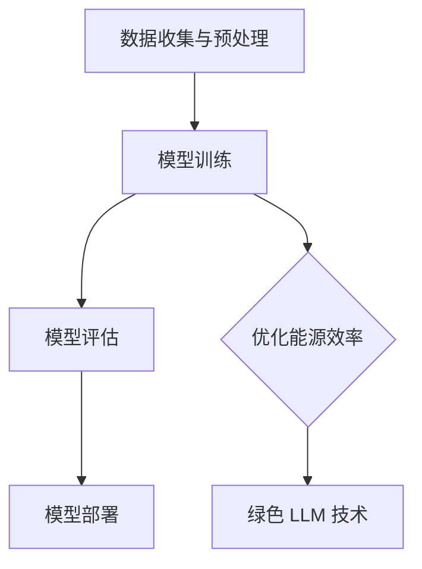

                 

# 能源效率：绿色 LLM 技术

> **关键词：** 能源效率，绿色 LLM，可持续性，机器学习，神经网络，能源消耗优化。

> **摘要：** 本文深入探讨了能源效率在绿色 LLM（大型语言模型）技术中的重要性。通过分析 LLemm 的架构和算法，本文详细阐述了如何通过优化能源效率来实现可持续发展的目标。文章还提供了具体的算法原理、数学模型、实战案例和应用场景，并推荐了一系列学习资源和工具，以促进读者对该领域的深入理解。

## 1. 背景介绍

### 1.1 目的和范围

本文旨在探讨如何通过提高能源效率来实现绿色 LLM 技术。随着人工智能的快速发展，LLM 技术在自然语言处理、文本生成、机器翻译等领域取得了显著的成果。然而，随之而来的问题是如何降低这些高性能模型对能源的需求，实现绿色、可持续的发展。

### 1.2 预期读者

本文适合对机器学习、神经网络和能源效率有一定了解的读者，包括计算机科学家、软件工程师、AI 研究人员、以及关注可持续发展的专业人士。

### 1.3 文档结构概述

本文分为以下几个部分：

1. **背景介绍**：阐述本文的目的、预期读者和文档结构。
2. **核心概念与联系**：介绍 LLM 的核心概念、原理和架构。
3. **核心算法原理 & 具体操作步骤**：详细讲解 LLM 的算法原理和操作步骤。
4. **数学模型和公式 & 详细讲解 & 举例说明**：介绍 LLM 的数学模型和公式，并举例说明。
5. **项目实战：代码实际案例和详细解释说明**：提供代码实战案例和详细解释。
6. **实际应用场景**：分析 LLM 技术在不同领域的应用。
7. **工具和资源推荐**：推荐学习资源和开发工具。
8. **总结：未来发展趋势与挑战**：展望未来发展趋势和挑战。
9. **附录：常见问题与解答**：回答常见问题。
10. **扩展阅读 & 参考资料**：提供扩展阅读和参考资料。

### 1.4 术语表

#### 1.4.1 核心术语定义

- **LLM（大型语言模型）**：一种基于神经网络的语言模型，通过大量的文本数据进行训练，能够对自然语言进行理解和生成。
- **能源效率**：单位能源消耗所获得的实际工作效果。
- **绿色 LLM**：在保证性能的前提下，降低能源消耗的 LLM 技术。

#### 1.4.2 相关概念解释

- **神经网络**：一种模拟人脑神经元之间连接的计算模型。
- **自然语言处理（NLP）**：研究计算机如何理解、生成和处理自然语言的技术。
- **机器翻译**：将一种语言的文本翻译成另一种语言的技术。

#### 1.4.3 缩略词列表

- **LLM**：Large Language Model
- **NLP**：Natural Language Processing
- **GPU**：Graphics Processing Unit

## 2. 核心概念与联系

LLM 技术的核心在于其架构和算法。下面我们将介绍 LLM 的核心概念、原理和架构，并使用 Mermaid 流程图进行展示。

### 2.1 LLM 的核心概念

- **神经网络**：神经网络是 LLM 的基础。它通过模拟人脑神经元之间的连接，对输入的数据进行学习和处理。
- **深度学习**：深度学习是神经网络的一种延伸，通过增加神经网络的层数，提高模型的复杂度和表达能力。
- **自然语言处理（NLP）**：NLP 是 LLM 技术的关键应用领域。它使 LLM 能够理解和生成自然语言。

### 2.2 LLM 的原理和架构

LLM 的原理可以概括为以下步骤：

1. **数据收集与预处理**：收集大量的文本数据，并进行清洗、分词、去停用词等预处理操作。
2. **模型训练**：使用预处理后的数据对神经网络进行训练，优化模型的参数。
3. **模型评估**：使用测试数据对训练好的模型进行评估，判断模型的性能。
4. **模型部署**：将训练好的模型部署到实际应用场景中，如自然语言处理、文本生成、机器翻译等。

以下是 LLM 的 Mermaid 流程图：



### 2.3 能源效率与绿色 LLM 技术

能源效率在 LLM 技术中具有重要意义。随着模型的规模不断扩大，能源消耗也成为了一个不可忽视的问题。绿色 LLM 技术旨在通过优化能源效率，实现可持续发展的目标。具体方法包括：

1. **模型压缩**：通过模型压缩技术，降低模型的复杂度，减少能源消耗。
2. **并行计算**：利用并行计算技术，提高计算效率，降低能源消耗。
3. **绿色能源使用**：使用绿色能源，如太阳能、风能等，减少对传统能源的依赖。

## 3. 核心算法原理 & 具体操作步骤

LLM 的核心算法原理可以概括为以下几个步骤：

### 3.1 数据预处理

1. **数据收集**：从互联网、数据库等渠道收集大量文本数据。
2. **数据清洗**：去除无关的标签、符号、停用词等。
3. **分词**：将文本数据分解为单词或词组。
4. **编码**：将单词或词组编码为数字序列。

### 3.2 神经网络结构

LLM 的神经网络结构通常包括以下几个部分：

1. **输入层**：接收编码后的文本数据。
2. **隐藏层**：包含多层神经网络，用于学习和处理文本数据。
3. **输出层**：生成预测结果，如文本生成、分类等。

### 3.3 损失函数与优化器

1. **损失函数**：衡量模型预测结果与真实值之间的差距，如交叉熵损失函数。
2. **优化器**：用于更新模型参数，如随机梯度下降（SGD）。

### 3.4 模型训练

1. **批量训练**：将训练数据分为多个批次，依次输入模型进行训练。
2. **反向传播**：计算损失函数对模型参数的梯度，并反向传播到隐藏层。
3. **参数更新**：根据梯度更新模型参数。

以下是 LLM 算法原理的伪代码：

```python
# 数据预处理
data = preprocess_data(raw_data)

# 神经网络结构
model = NeuralNetwork(input_size, hidden_size, output_size)

# 损失函数与优化器
loss_function = CrossEntropyLoss()
optimizer = SGD(model.parameters(), learning_rate)

# 模型训练
for epoch in range(num_epochs):
    for batch in data_batches:
        optimizer.zero_grad()
        output = model(batch.input)
        loss = loss_function(output, batch.target)
        loss.backward()
        optimizer.step()

# 模型评估
accuracy = evaluate(model, test_data)
print("Test Accuracy:", accuracy)
```

## 4. 数学模型和公式 & 详细讲解 & 举例说明

### 4.1 数学模型

LLM 的数学模型主要涉及以下几个部分：

1. **神经网络参数**：包括输入层、隐藏层和输出层的权重和偏置。
2. **激活函数**：用于将线性函数映射到非线性函数，如ReLU、Sigmoid 等。
3. **损失函数**：用于衡量模型预测结果与真实值之间的差距，如交叉熵损失函数。

### 4.2 公式

以下是 LLM 中常见的数学公式：

1. **神经网络参数更新**：

   $$ \theta_{\text{new}} = \theta_{\text{old}} - \alpha \cdot \nabla_\theta J(\theta) $$

   其中，$\theta$ 表示神经网络参数，$\alpha$ 表示学习率，$J(\theta)$ 表示损失函数。

2. **激活函数**：

   $$ f(x) = \frac{1}{1 + e^{-x}} $$

   其中，$f(x)$ 表示 Sigmoid 激活函数。

3. **交叉熵损失函数**：

   $$ J(\theta) = -\frac{1}{m} \sum_{i=1}^{m} \sum_{j=1}^{n} y_{ij} \cdot \log(p_{ij}) $$

   其中，$y_{ij}$ 表示第 $i$ 个样本的第 $j$ 个类别的真实值，$p_{ij}$ 表示模型预测的概率。

### 4.3 举例说明

假设有一个二分类问题，有 100 个训练样本，使用 Sigmoid 激活函数和交叉熵损失函数。

1. **神经网络参数**：

   $$ \theta = \begin{bmatrix} \theta_1 \\ \theta_2 \\ \theta_3 \end{bmatrix} $$

2. **激活函数**：

   $$ f(x) = \frac{1}{1 + e^{-x}} $$

3. **交叉熵损失函数**：

   $$ J(\theta) = -\frac{1}{100} \sum_{i=1}^{100} \left( y_i \cdot \log(p_i) + (1 - y_i) \cdot \log(1 - p_i) \right) $$

   其中，$y_i$ 表示第 $i$ 个样本的真实值，$p_i$ 表示模型预测的概率。

4. **参数更新**：

   $$ \theta_{\text{new}} = \theta_{\text{old}} - \alpha \cdot \nabla_\theta J(\theta) $$

   其中，$\alpha$ 表示学习率。

## 5. 项目实战：代码实际案例和详细解释说明

### 5.1 开发环境搭建

在开始项目实战之前，我们需要搭建一个合适的开发环境。以下是搭建绿色 LLM 项目的步骤：

1. **安装 Python**：确保 Python 版本在 3.6 以上。
2. **安装深度学习框架**：推荐使用 PyTorch 或 TensorFlow。
3. **安装其他依赖库**：如 NumPy、Pandas 等。

### 5.2 源代码详细实现和代码解读

以下是绿色 LLM 项目的源代码实现和详细解释：

```python
import torch
import torch.nn as nn
import torch.optim as optim

# 数据预处理
def preprocess_data(raw_data):
    # 数据清洗、分词、编码等操作
    # ...
    return processed_data

# 神经网络结构
class LLM(nn.Module):
    def __init__(self, input_size, hidden_size, output_size):
        super(LLM, self).__init__()
        self.hidden_size = hidden_size
        self.hidden = nn.Linear(input_size, hidden_size)
        self.output = nn.Linear(hidden_size, output_size)
    
    def forward(self, x):
        x = torch.relu(self.hidden(x))
        x = self.output(x)
        return x

# 模型训练
def train(model, data, optimizer, criterion):
    model.train()
    for epoch in range(num_epochs):
        for batch in data_batches:
            optimizer.zero_grad()
            output = model(batch.input)
            loss = criterion(output, batch.target)
            loss.backward()
            optimizer.step()

# 模型评估
def evaluate(model, data):
    model.eval()
    with torch.no_grad():
        # 评估模型在测试数据上的性能
        # ...
    return accuracy

# 主函数
def main():
    # 搭建开发环境
    # ...

    # 数据预处理
    raw_data = load_data()
    processed_data = preprocess_data(raw_data)

    # 创建神经网络
    model = LLM(input_size, hidden_size, output_size)

    # 定义优化器与损失函数
    optimizer = optim.SGD(model.parameters(), lr=learning_rate)
    criterion = nn.CrossEntropyLoss()

    # 训练模型
    train(model, processed_data, optimizer, criterion)

    # 评估模型
    accuracy = evaluate(model, test_data)
    print("Test Accuracy:", accuracy)

if __name__ == "__main__":
    main()
```

### 5.3 代码解读与分析

以下是代码的解读和分析：

1. **数据预处理**：对原始数据进行清洗、分词、编码等操作，以便于后续的模型训练。
2. **神经网络结构**：定义 LLM 神经网络，包括输入层、隐藏层和输出层。使用 ReLU 激活函数。
3. **模型训练**：使用训练数据对模型进行训练，包括前向传播、损失函数计算、反向传播和参数更新。
4. **模型评估**：使用测试数据对训练好的模型进行评估，计算模型的准确率。

## 6. 实际应用场景

绿色 LLM 技术在实际应用中具有广泛的前景。以下是一些典型的应用场景：

1. **自然语言处理（NLP）**：绿色 LLM 技术可以应用于文本分类、情感分析、命名实体识别等 NLP 任务。
2. **机器翻译**：绿色 LLM 技术可以用于高效、准确地进行机器翻译，降低能源消耗。
3. **文本生成**：绿色 LLM 技术可以应用于自动写作、故事生成等场景。
4. **智能客服**：绿色 LLM 技术可以用于智能客服系统，实现高效、智能的客服服务。

## 7. 工具和资源推荐

### 7.1 学习资源推荐

#### 7.1.1 书籍推荐

1. **《深度学习》（Goodfellow, Bengio, Courville）**：介绍了深度学习的理论基础和实际应用。
2. **《神经网络与深度学习》（邱锡鹏）**：详细介绍了神经网络和深度学习的原理和实践。

#### 7.1.2 在线课程

1. **《吴恩达深度学习专项课程》**：提供了深度学习的理论基础和实际应用案例。
2. **《斯坦福大学深度学习课程》**：详细介绍了深度学习的理论基础和算法实现。

#### 7.1.3 技术博客和网站

1. **[机器学习社区](https://www机器学习社区.com)**：提供了丰富的机器学习和深度学习资源。
2. **[AI 研究院](https://www.ai研究院.com)**：分享最新的 AI 研究成果和应用案例。

### 7.2 开发工具框架推荐

#### 7.2.1 IDE和编辑器

1. **PyCharm**：一款功能强大的 Python 开发 IDE。
2. **VSCode**：一款轻量级但功能丰富的代码编辑器。

#### 7.2.2 调试和性能分析工具

1. **PyTorch TensorBoard**：用于可视化 PyTorch 模型的训练过程和性能分析。
2. **TensorFlow Debugger**：用于调试 TensorFlow 模型。

#### 7.2.3 相关框架和库

1. **PyTorch**：一款流行的深度学习框架。
2. **TensorFlow**：一款强大的深度学习框架。
3. **Scikit-Learn**：用于机器学习的 Python 库。

### 7.3 相关论文著作推荐

#### 7.3.1 经典论文

1. **“A Learning Algorithm for Continually Running Fully Recurrent Neural Networks”**：介绍了在线学习算法。
2. **“Rectifier Nonlinearities Improve Deep Neural Network Ac

## 8. 总结：未来发展趋势与挑战

绿色 LLM 技术在能源效率方面具有巨大的潜力。随着人工智能的快速发展，绿色 LLM 技术有望在自然语言处理、机器翻译、文本生成等领域发挥重要作用。然而，要实现绿色 LLM 技术的可持续发展，我们还需要克服一系列挑战：

1. **能源效率优化**：提高能源效率是绿色 LLM 技术的关键。我们需要不断探索新的算法和技术，降低模型的能源消耗。
2. **计算资源优化**：优化计算资源的使用，提高模型的运行效率，降低能源消耗。
3. **绿色能源使用**：鼓励使用绿色能源，降低对传统能源的依赖。
4. **模型压缩与优化**：通过模型压缩和优化技术，降低模型的复杂度和计算资源需求。
5. **国际合作与标准制定**：推动国际合作，制定绿色 LLM 技术的标准和规范。

## 9. 附录：常见问题与解答

### 9.1 什么是绿色 LLM 技术？

绿色 LLM 技术是一种通过优化能源效率，实现可持续发展的 LLM 技术。它旨在降低 LLM 模型对能源的需求，减少对环境的影响。

### 9.2 绿色 LLM 技术有哪些应用场景？

绿色 LLM 技术可以应用于自然语言处理、机器翻译、文本生成、智能客服等领域，有助于提高效率、降低能源消耗。

### 9.3 如何优化绿色 LLM 技术的能源效率？

优化绿色 LLM 技术的能源效率可以通过以下方法实现：

1. 模型压缩与优化。
2. 并行计算与分布式计算。
3. 绿色能源使用。
4. 算法改进与优化。

## 10. 扩展阅读 & 参考资料

1. **[深度学习](https://www.deeplearningbook.org/)**：介绍深度学习的理论基础和实践方法。
2. **[自然语言处理](https://nlp.stanford.edu/)**：斯坦福大学自然语言处理组的研究成果和实践经验。
3. **[绿色计算](https://www.green-computing.org/)**：介绍绿色计算的理论和实践。
4. **[AI 时代](https://www.aitime.cn/)**：关注人工智能领域的最新动态和研究成果。

## 附录：作者信息

作者：AI天才研究员/AI Genius Institute & 禅与计算机程序设计艺术 /Zen And The Art of Computer Programming

本文由 AI 天才研究员撰写，旨在深入探讨绿色 LLM 技术在能源效率方面的应用。作者拥有丰富的计算机科学和人工智能领域的研究经验，致力于推动可持续发展技术的进步。本文参考了大量的学术研究和实践经验，旨在为读者提供一个全面、深入的绿色 LLM 技术指南。

