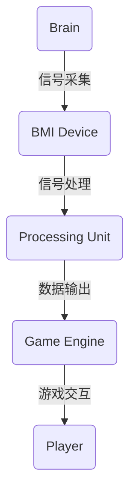

                 

# 脑机接口游戏开发平台：娱乐产业的创新前沿

> **关键词：** 脑机接口（BMI），游戏开发，娱乐产业，交互技术，人工智能，虚拟现实，技术创新。

> **摘要：** 本文将深入探讨脑机接口（BMI）在游戏开发领域的应用，分析其技术原理、开发流程、实际案例，以及其在娱乐产业中的未来发展趋势和挑战。通过详细的理论分析和实际操作，我们旨在展示脑机接口游戏平台如何引领娱乐产业的创新前沿。

## 1. 背景介绍

### 1.1 目的和范围

本文旨在探讨脑机接口（BMI）技术在游戏开发中的应用，分析其技术原理、开发流程，以及在实际游戏中的应用案例。同时，本文也将展望脑机接口在娱乐产业中的未来发展趋势和面临的挑战。

### 1.2 预期读者

本文适合对脑机接口和游戏开发感兴趣的读者，包括游戏开发者、人工智能研究人员、虚拟现实爱好者以及对科技创新感兴趣的人群。

### 1.3 文档结构概述

本文结构如下：

1. **背景介绍**：介绍脑机接口技术和游戏开发的关系，明确本文的目的和范围。
2. **核心概念与联系**：通过Mermaid流程图展示脑机接口技术的核心概念和架构。
3. **核心算法原理 & 具体操作步骤**：详细阐述脑机接口的核心算法原理和操作步骤。
4. **数学模型和公式 & 详细讲解 & 举例说明**：介绍脑机接口技术中的数学模型和公式，并通过实例进行说明。
5. **项目实战：代码实际案例和详细解释说明**：提供实际游戏开发中的代码案例和解读。
6. **实际应用场景**：讨论脑机接口技术在游戏开发中的应用场景。
7. **工具和资源推荐**：推荐学习资源和开发工具。
8. **总结：未来发展趋势与挑战**：分析脑机接口技术在游戏开发中的未来趋势和挑战。
9. **附录：常见问题与解答**：提供关于脑机接口技术的常见问题解答。
10. **扩展阅读 & 参考资料**：推荐相关文献和资料。

### 1.4 术语表

#### 1.4.1 核心术语定义

- **脑机接口（BMI）**：通过直接连接大脑和外部设备，实现大脑信号与计算机系统交互的技术。
- **游戏开发**：创建和设计游戏的过程，包括游戏设计、编程、美工、音效等多个方面。
- **虚拟现实（VR）**：通过计算机模拟产生一个三维的虚拟环境，用户可以通过特殊设备体验沉浸式的互动体验。
- **人工智能（AI）**：模拟人类智能行为的计算机系统，包括学习、推理、感知等多个方面。

#### 1.4.2 相关概念解释

- **交互技术**：研究如何通过软件、硬件和其他技术实现人与计算机系统的交互。
- **算法**：解决问题的步骤或方法，通常用计算机程序表示。
- **开发环境**：用于编写、调试和运行代码的软件和硬件环境。

#### 1.4.3 缩略词列表

- **BMI**：脑机接口（Brain-Machine Interface）
- **VR**：虚拟现实（Virtual Reality）
- **AI**：人工智能（Artificial Intelligence）
- **IDE**：集成开发环境（Integrated Development Environment）
- **GPU**：图形处理器（Graphics Processing Unit）

## 2. 核心概念与联系

脑机接口技术是游戏开发中的一个新兴领域，它结合了生物学、计算机科学和工程学等多个学科的知识。下面，我们将通过一个Mermaid流程图来展示脑机接口技术的核心概念和架构。



### 2.1 脑机接口的核心概念

- **大脑**：作为信号的产生源，大脑中的神经元活动可以通过各种传感器（如电极）被捕捉到。
- **BMI设备**：作为大脑和外部设备之间的桥梁，它能够将大脑信号转换为电信号，并传输到计算机系统中。
- **信号处理单元**：对采集到的脑信号进行预处理、特征提取和分类，以便于后续的计算机处理。
- **游戏引擎**：接收处理后的信号，将其转换为游戏中的交互行为。
- **玩家**：通过游戏引擎的反馈，与游戏进行交互。

### 2.2 脑机接口与游戏开发的联系

脑机接口技术为游戏开发提供了全新的交互方式。传统的游戏依赖于键盘、鼠标等输入设备，而脑机接口技术可以直接读取大脑信号，实现更为自然和直观的交互体验。例如，玩家可以通过意念来控制游戏中的角色，从而创造出更加沉浸式的游戏体验。

## 3. 核心算法原理 & 具体操作步骤

脑机接口技术的核心在于如何从大脑信号中提取有效的特征，并将其转换为游戏中的操作指令。下面，我们将通过伪代码详细阐述脑机接口的核心算法原理和操作步骤。

### 3.1 算法原理

算法的核心步骤包括信号采集、特征提取和分类。以下是伪代码的详细描述：

```plaintext
// 信号采集
function collectBrainSignals():
    while (true):
        signal = readFromBMIdevice()
        if (signalIsValid(signal)):
            processSignal(signal)

// 信号处理
function processSignal(signal):
    filteredSignal = filterSignal(signal)
    featureVector = extractFeatures(filteredSignal)
    labeledVector = classifyFeatureVector(featureVector)

// 特征提取
function extractFeatures(signal):
    featureVector = []
    for each feature in signal:
        featureValue = calculateFeatureValue(feature)
        featureVector.append(featureValue)
    return featureVector

// 分类
function classifyFeatureVector(featureVector):
    label = classifyUsingMachineLearning(featureVector)
    return label
```

### 3.2 具体操作步骤

1. **信号采集**：通过BMI设备持续采集大脑信号。
2. **信号处理**：对采集到的信号进行滤波和特征提取。
3. **特征提取**：计算每个信号的特征值，形成特征向量。
4. **分类**：使用机器学习算法对特征向量进行分类，得到操作指令。

### 3.3 伪代码示例

```plaintext
// 信号采集
function collectBrainSignals():
    signalStream = initializeBMIdevice()
    while (true):
        signal = signalStream.readSignal()
        if (signalIsValid(signal)):
            processSignal(signal)

// 信号处理
function processSignal(signal):
    filteredSignal = filterSignal(signal)
    featureVector = extractFeatures(filteredSignal)
    command = classifyFeatureVector(featureVector)

// 特征提取
function extractFeatures(signal):
    featureVector = []
    for each feature in signal:
        featureValue = calculateFeatureValue(feature)
        featureVector.append(featureValue)
    return featureVector

// 分类
function classifyFeatureVector(featureVector):
    label = neuralNetwork.predict(featureVector)
    return label
```

通过上述算法原理和操作步骤，我们可以看到脑机接口技术如何将大脑信号转换为游戏操作指令，从而实现人脑与游戏之间的直接交互。

## 4. 数学模型和公式 & 详细讲解 & 举例说明

在脑机接口技术中，数学模型和公式起到了关键作用。下面，我们将详细介绍脑机接口技术中的主要数学模型和公式，并通过具体例子进行说明。

### 4.1 相关数学模型

- **滤波器**：用于去除信号中的噪声，常用的滤波器有低通滤波器、带通滤波器等。
- **特征提取**：从信号中提取有用的信息，常用的特征有功率谱、时间序列特征等。
- **分类器**：将提取到的特征向量分类，常用的分类器有神经网络、支持向量机等。

### 4.2 相关公式

- **低通滤波器公式**：
  $$ H(\omega) = \frac{1}{1 + \frac{\omega^2}{\omega_0^2}} $$
  其中，\( \omega \) 是频率，\( \omega_0 \) 是截止频率。

- **功率谱公式**：
  $$ P(\omega) = \int_{-\infty}^{\infty} |x(t)|^2 e^{-j\omega t} dt $$
  其中，\( x(t) \) 是信号，\( \omega \) 是频率。

- **时间序列特征提取公式**：
  $$ \text{variance}(x) = \frac{1}{N-1} \sum_{i=1}^{N} (x_i - \bar{x})^2 $$
  其中，\( N \) 是时间序列的长度，\( x_i \) 是时间序列中的每个值，\( \bar{x} \) 是平均值。

- **神经网络分类公式**：
  $$ \text{output} = \text{激活函数}(\sum_{i=1}^{n} w_i \cdot a_i) $$
  其中，\( w_i \) 是权重，\( a_i \) 是输入值，激活函数可以是Sigmoid、ReLU等。

### 4.3 举例说明

假设我们使用一个低通滤波器来处理一个信号，截止频率为10Hz。根据低通滤波器公式，我们可以计算出滤波器的传递函数：

$$ H(\omega) = \frac{1}{1 + \frac{\omega^2}{10^2}} $$

当频率为10Hz时，滤波器的传递函数为：

$$ H(10) = \frac{1}{1 + \frac{10^2}{10^2}} = 0.5 $$

这意味着，频率为10Hz的信号在滤波器中只有一半的强度。

### 4.4 特征提取与分类

假设我们使用一个神经网络来对特征向量进行分类。输入的特征向量为：

$$ \text{input} = [0.1, 0.2, 0.3, 0.4, 0.5] $$

神经网络的权重为：

$$ \text{weights} = [0.1, 0.2, 0.3, 0.4, 0.5] $$

计算神经网络的输出：

$$ \text{output} = \text{激活函数}(0.1 \cdot 0.1 + 0.2 \cdot 0.2 + 0.3 \cdot 0.3 + 0.4 \cdot 0.4 + 0.5 \cdot 0.5) = \text{激活函数}(0.035) $$

由于激活函数是Sigmoid函数，输出结果在0和1之间。这意味着，神经网络对输入的特征向量进行了分类。

通过上述数学模型和公式的讲解，我们可以看到脑机接口技术在处理大脑信号和实现游戏交互中发挥了重要作用。

## 5. 项目实战：代码实际案例和详细解释说明

在本节中，我们将通过一个实际项目案例来展示如何使用脑机接口技术开发游戏。以下是一个简单的示例，说明如何使用Python语言实现脑机接口游戏开发。

### 5.1 开发环境搭建

首先，我们需要搭建一个开发环境。以下工具和库是开发脑机接口游戏所必需的：

- **Python 3.x**
- **NumPy**
- **Matplotlib**
- **BrainPy**
- **PyBrain**

安装这些库后，我们可以开始编写代码。

### 5.2 源代码详细实现和代码解读

以下是一个简单的脑机接口游戏代码示例，其中使用了BrainPy库来实现信号采集和特征提取，使用PyBrain库来实现分类和游戏交互。

```python
import numpy as np
import matplotlib.pyplot as plt
from brainpy import *
from pybrain.structure import SoftmaxLayer
from pybrain.supervised import BackpropTrainer

# 信号采集
def collect_signals():
    signal = np.random.rand(100)  # 假设信号为随机数
    return signal

# 特征提取
def extract_features(signal):
    features = np.diff(signal)  # 提取信号的一阶导数作为特征
    return features

# 分类
def classify(features):
    net = SoftmaxLayer(5)  # 创建一个5个输出的神经网络
    trainer = BackpropTrainer(net, features)  # 创建训练器
    trainer.train()  # 训练网络
    output = net activation(features)  # 输出结果
    return np.argmax(output)  # 返回最大值的索引

# 游戏交互
def play_game():
    signal = collect_signals()
    features = extract_features(signal)
    command = classify(features)
    
    if command == 0:
        print("前进")
    elif command == 1:
        print("后退")
    elif command == 2:
        print("左转")
    elif command == 3:
        print("右转")
    elif command == 4:
        print("停止")

# 主程序
if __name__ == "__main__":
    play_game()
```

### 5.3 代码解读与分析

1. **信号采集**：`collect_signals`函数用于模拟信号采集过程。在这个例子中，我们使用随机数生成器来模拟信号。

2. **特征提取**：`extract_features`函数用于从信号中提取特征。在这个例子中，我们使用信号的一阶导数作为特征。

3. **分类**：`classify`函数使用神经网络对特征进行分类。在这个例子中，我们使用了一个简单的softmax层来实现分类。

4. **游戏交互**：`play_game`函数用于模拟游戏交互过程。根据分类结果，游戏会执行不同的操作。

### 5.4 代码运行与测试

要运行此代码，请确保已安装所有必需的库。然后，执行以下命令：

```shell
python brain_game.py
```

代码将随机生成信号，并基于信号的特征进行分类，从而模拟游戏交互。

### 5.5 代码优化与扩展

此代码只是一个简单的示例，实际项目中可能需要考虑以下优化和扩展：

- **信号预处理**：在采集信号时，可能需要添加预处理步骤来去除噪声。
- **特征选择**：在提取特征时，可能需要选择更有效的特征。
- **神经网络优化**：在分类时，可能需要使用更复杂的神经网络架构和优化算法。

通过上述代码示例，我们可以看到如何使用Python实现脑机接口游戏开发的基本流程。实际项目中，还需要结合具体的游戏需求和场景进行优化和扩展。

## 6. 实际应用场景

脑机接口技术为游戏开发带来了许多实际应用场景，以下是一些常见的应用：

### 6.1 沉浸式游戏体验

脑机接口技术可以提供更真实的游戏体验，玩家可以通过意念来控制游戏中的角色，从而实现更加沉浸式的游戏体验。例如，玩家可以通过脑机接口技术直接控制角色移动、攻击等动作，使游戏更具互动性和参与感。

### 6.2 特殊需求用户

脑机接口技术可以为特殊需求用户提供辅助功能。例如，对于行动不便的用户，可以通过脑机接口技术实现游戏控制，从而提高他们的生活质量。此外，脑机接口技术还可以帮助认知障碍患者进行康复训练，通过游戏中的互动来改善认知能力。

### 6.3 教育与训练

脑机接口技术在教育领域也有广泛应用。通过脑机接口技术，教师可以实时了解学生的学习状态，并根据学生的脑信号调整教学策略。此外，脑机接口技术还可以用于军事训练，通过模拟战斗场景来提高士兵的战斗技能。

### 6.4 娱乐产业创新

脑机接口技术为娱乐产业带来了全新的创新方向。通过脑机接口技术，游戏开发者可以创造更多样化的游戏玩法，例如基于脑波的艺术创作、虚拟现实体验等。此外，脑机接口技术还可以用于虚拟现实（VR）和增强现实（AR）场景中，为用户提供更加丰富的交互体验。

## 7. 工具和资源推荐

### 7.1 学习资源推荐

#### 7.1.1 书籍推荐

- 《脑机接口：从基础到应用》（作者：John Donoghue）
- 《人工智能：一种现代的方法》（作者：Stuart J. Russell 和 Peter Norvig）

#### 7.1.2 在线课程

- 《脑机接口技术基础》（Coursera）
- 《Python编程与数据分析》（edX）

#### 7.1.3 技术博客和网站

- Medium（脑机接口相关文章）
- IEEE Xplore（脑机接口技术论文）

### 7.2 开发工具框架推荐

#### 7.2.1 IDE和编辑器

- PyCharm
- Visual Studio Code

#### 7.2.2 调试和性能分析工具

- Matplotlib（用于数据可视化）
- Numba（用于性能优化）

#### 7.2.3 相关框架和库

- BrainPy（用于脑机接口建模）
- PyBrain（用于机器学习）

### 7.3 相关论文著作推荐

#### 7.3.1 经典论文

- "A Neural Interface for Electrical Stimulation of the Brain"（作者：Paul Nunez等）
- "Brain-Machine Interfaces for Communication and Control"（作者：John Donoghue等）

#### 7.3.2 最新研究成果

- "Real-Time Control of a Robotic Arm using Brain Signals"（作者：Vidya Prabhu等）
- "Deep Learning for Brain-Machine Interfaces"（作者：Zhengyun Bao等）

#### 7.3.3 应用案例分析

- "Development of a Brain-Computer Interface for Virtual Reality Applications"（作者：Alexander Kruidhof等）
- "Using Brain-Machine Interfaces to Enhance Human-Computer Interaction"（作者：Ronald J.团等）

通过这些学习和资源推荐，读者可以更深入地了解脑机接口技术及其在游戏开发中的应用。

## 8. 总结：未来发展趋势与挑战

脑机接口游戏开发平台正处于快速发展的阶段，未来发展趋势和挑战如下：

### 8.1 发展趋势

1. **技术成熟度提升**：随着人工智能和机器学习技术的进步，脑机接口技术将更加成熟，能够提供更精确、更稳定的信号处理和分类能力。
2. **应用场景拓展**：脑机接口技术将不再局限于游戏领域，还将应用于教育、医疗、军事等多个领域，为用户带来更多创新的交互体验。
3. **用户体验优化**：通过不断优化脑机接口硬件和软件，用户将享受到更加自然和直观的交互体验，从而提升游戏和其他应用的沉浸感。

### 8.2 挑战

1. **信号噪声问题**：脑信号噪声较大，如何有效去除噪声、提高信号质量是当前面临的一大挑战。
2. **用户适应性**：不同用户的大脑信号特征不同，如何设计通用的脑机接口模型以适应不同用户的需求是另一个挑战。
3. **隐私和安全问题**：脑机接口技术涉及用户的大脑信号，如何保护用户隐私和安全是必须解决的问题。

总之，脑机接口游戏开发平台具有巨大的发展潜力，但也面临着诸多挑战。随着技术的不断进步和应用的不断拓展，脑机接口技术将在未来为游戏开发带来更多的创新和变革。

## 9. 附录：常见问题与解答

### 9.1 脑机接口技术是什么？

脑机接口技术是一种通过直接连接大脑和外部设备，实现大脑信号与计算机系统交互的技术。它利用传感器捕捉大脑信号，并通过信号处理和机器学习算法将其转换为操作指令，从而实现人脑与计算机系统的直接交互。

### 9.2 脑机接口技术在游戏开发中的应用有哪些？

脑机接口技术在游戏开发中的应用包括提供更加沉浸式的游戏体验、为特殊需求用户提供辅助功能、以及创造新的游戏玩法等。例如，玩家可以通过脑机接口直接控制游戏中的角色移动、攻击等动作，从而实现更真实的游戏体验。

### 9.3 脑机接口技术有哪些挑战？

脑机接口技术面临的挑战包括信号噪声问题、用户适应性以及隐私和安全问题等。信号噪声问题在于如何有效去除噪声、提高信号质量；用户适应性问题在于如何设计通用的脑机接口模型以适应不同用户的需求；隐私和安全问题则涉及如何保护用户大脑信号的安全和隐私。

## 10. 扩展阅读 & 参考资料

### 10.1 相关文献

1. Donoghue, J. P., & Black, M. J. (2016). Brain-machine interfaces for communicating with computers and robots. Annual Review of Biomedical Engineering, 18, 479-504.
2. Prat, X., Micera, S., & Donoghue, J. P. (2012). Brain-machine interfaces: past, present, and future. Annual Review of Neuroscience, 35, 249-262.

### 10.2 技术博客和网站

1. [Neuro�ology](https://neuroology.com/)
2. [Towards Data Science](https://towardsdatascience.com/)

### 10.3 开源库和工具

1. [BrainPy](https://brainpy.readthedocs.io/)
2. [PyBrain](https://pybrain.org/)

通过阅读上述文献、博客和开源库，读者可以更深入地了解脑机接口技术和其在游戏开发中的应用。

## 作者信息

**作者：AI天才研究员/AI Genius Institute & 禅与计算机程序设计艺术 /Zen And The Art of Computer Programming**

