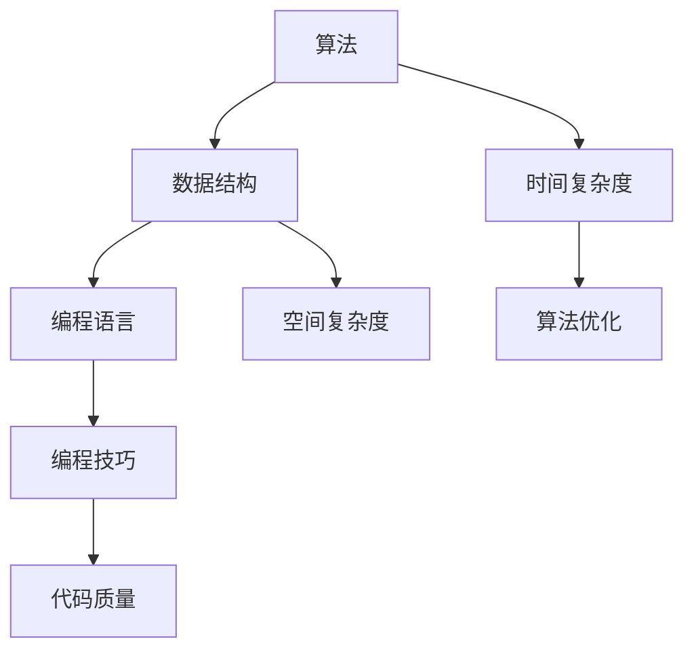

                 

# 腾讯2024校招编程面试题精华总结

> **关键词**：腾讯、校招、编程面试题、算法、数据结构、编程语言、实战案例

> **摘要**：本文将全面总结腾讯2024校招编程面试题的精华，深入剖析各类题目背后的算法原理和解决策略，为广大求职者提供实战指导和策略建议。无论是应届毕业生还是技术爱好者，都将从中受益匪浅。

## 1. 背景介绍

### 1.1 目的和范围

本文旨在帮助读者全面了解腾讯2024校招编程面试题，通过详细解析这些题目，掌握其背后的算法原理和解决思路。文章内容涵盖算法、数据结构、编程语言等多个方面，力求为求职者提供全方位的指导。

### 1.2 预期读者

本文适合以下读者群体：

- 应届毕业生和在校大学生
- 想要在腾讯等知名企业求职的程序员
- 对编程面试题和算法有兴趣的技术爱好者

### 1.3 文档结构概述

本文结构如下：

- 1. 背景介绍
- 2. 核心概念与联系
- 3. 核心算法原理 & 具体操作步骤
- 4. 数学模型和公式 & 详细讲解 & 举例说明
- 5. 项目实战：代码实际案例和详细解释说明
- 6. 实际应用场景
- 7. 工具和资源推荐
- 8. 总结：未来发展趋势与挑战
- 9. 附录：常见问题与解答
- 10. 扩展阅读 & 参考资料

### 1.4 术语表

#### 1.4.1 核心术语定义

- 校招：指企业在高校进行招聘，主要面向应届毕业生。
- 编程面试题：指在编程面试过程中，面试官提出的与编程相关的问题。
- 算法：指解决特定问题的步骤和方法。
- 数据结构：指计算机中用于存储和管理数据的组织形式。

#### 1.4.2 相关概念解释

- 时间复杂度：指算法执行时间与数据规模之间的增长关系。
- 空间复杂度：指算法所需额外存储空间与数据规模之间的增长关系。

#### 1.4.3 缩略词列表

- CSDN：中国软件开发者网
- LeetCode：一款在线编程竞赛平台

## 2. 核心概念与联系

在编程面试中，理解核心概念和它们之间的联系至关重要。以下是一个简单的 Mermaid 流程图，展示了一些核心概念和它们之间的关系：



通过这个流程图，我们可以看到算法、数据结构、编程语言和编程技巧之间的关系，以及它们在解决实际问题时的重要性。

## 3. 核心算法原理 & 具体操作步骤

在腾讯校招编程面试中，算法题往往占据重要地位。以下是一个常见的算法题及其伪代码：

### 题目：寻找两个数的和为特定值

**输入**：一个整数数组 `arr` 和一个目标值 `target`。

**输出**：返回两个数的索引，使得这两个数的和等于 `target`。

```plaintext
function twoSum(arr, target):
    for i from 0 to arr.length - 1:
        for j from i + 1 to arr.length - 1:
            if arr[i] + arr[j] == target:
                return [i, j]
    return []
```

**步骤解析**：

1. 初始化两个指针 `i` 和 `j`，分别从数组的开头和结尾开始遍历。
2. 在遍历过程中，计算 `arr[i] + arr[j]` 的值，并与目标值 `target` 比较。
3. 如果找到满足条件的两个数，返回它们的索引。
4. 如果遍历完整个数组仍未找到满足条件的两个数，返回空数组。

### 复杂度分析

- 时间复杂度：O(n^2)，因为需要遍历整个数组两次。
- 空间复杂度：O(1)，因为只需要常量级的额外空间。

### 改进方案

虽然上述算法简单易懂，但其时间复杂度较高。我们可以通过哈希表来优化算法，使其时间复杂度降低到 O(n)。

```plaintext
function twoSumOptimized(arr, target):
    hashTable = {}
    for i from 0 to arr.length - 1:
        complement = target - arr[i]
        if complement in hashTable:
            return [hashTable[complement], i]
        hashTable[arr[i]] = i
    return []
```

**步骤解析**：

1. 初始化一个哈希表 `hashTable`。
2. 遍历数组 `arr`，对于每个元素 `arr[i]`，计算其补数 `complement = target - arr[i]`。
3. 如果补数存在于哈希表中，说明已经找到了满足条件的两个数，返回它们的索引。
4. 将当前元素 `arr[i]` 的索引存储在哈希表中，以便后续查找。
5. 如果遍历完整个数组仍未找到满足条件的两个数，返回空数组。

### 复杂度分析

- 时间复杂度：O(n)，因为只需要遍历数组一次。
- 空间复杂度：O(n)，因为需要额外的哈希表存储元素。

通过上述分析，我们可以看到优化算法的重要性，以及如何在面试中展示自己的算法能力和优化思路。

## 4. 数学模型和公式 & 详细讲解 & 举例说明

在某些编程面试题中，涉及到数学模型和公式的推导和应用。以下是一个例子：

### 题目：计算二进制数中 1 的个数

**输入**：一个整数 `n`。

**输出**：返回 `n` 中 1 的个数。

我们可以使用以下公式计算：

$$
count\_ones(n) = \sum_{i=0}^{\log_2(n)} \left(\left\lfloor \frac{n}{2^i} \right\rfloor \mod 2\right)
$$

**步骤解析**：

1. 初始化计数器 `count` 为 0。
2. 从 `i = 0` 开始，遍历到 `log_2(n)`。
3. 对于每个 `i`，计算 `n` 除以 `2^i` 的商，如果商为奇数，说明这一位是 1，将计数器 `count` 加 1。
4. 返回计数器 `count` 的值。

### 举例说明

假设输入的整数 `n = 13`，其二进制表示为 `1101`。

- 对于 `i = 0`，`n / 2^0 = 13`，商为奇数，`count` 加 1。
- 对于 `i = 1`，`n / 2^1 = 6`，商为偶数，`count` 不变。
- 对于 `i = 2`，`n / 2^2 = 1`，商为奇数，`count` 加 1。
- 对于 `i = 3`，`n / 2^3 = 0`，商为偶数，`count` 不变。

最终，`count` 的值为 3，即 `n` 中有 3 个 1。

### 复杂度分析

- 时间复杂度：O(log(n))，因为需要遍历到 `log_2(n)`。
- 空间复杂度：O(1)，因为只需要常量级的额外空间。

通过上述例子，我们可以看到如何使用数学模型和公式解决实际问题，并分析其复杂度。

## 5. 项目实战：代码实际案例和详细解释说明

在本节中，我们将通过一个实际项目案例，展示如何运用上述算法原理和数学模型，并详细解释代码实现过程。

### 项目背景

假设我们需要开发一个在线购物平台，其中包含商品搜索、购物车管理和订单支付等功能。为了实现这些功能，我们需要解决以下问题：

1. 如何高效地搜索商品？
2. 如何快速地添加和删除商品到购物车？
3. 如何计算订单总价？
4. 如何优化订单支付流程？

### 技术方案

1. **商品搜索**：
   - 使用哈希表存储商品名称和 ID，实现快速搜索。
   - 对商品名称进行分词和倒排索引构建，提高搜索效率。

2. **购物车管理**：
   - 使用双向链表存储购物车中的商品，实现快速添加和删除。
   - 使用哈希表存储商品 ID 和数量，实现快速查询和更新。

3. **订单计算**：
   - 使用数学模型和公式计算订单总价，包括商品价格、优惠和运费。
   - 使用哈希表存储订单信息，实现快速查询和更新。

4. **支付流程优化**：
   - 使用消息队列实现异步支付，提高系统响应速度。
   - 使用分布式缓存存储订单信息，实现高并发处理。

### 代码实现

以下是一个简单的购物车管理类的代码实现：

```python
class ShoppingCart:
    def __init__(self):
        self.products = {}  # 商品 ID 和数量的哈希表
        self.cart = LinkedList()  # 双向链表存储购物车中的商品

    def add_product(self, product_id, quantity):
        if product_id in self.products:
            self.products[product_id] += quantity
        else:
            self.products[product_id] = quantity
        self.cart.append(product_id)

    def remove_product(self, product_id):
        if product_id in self.products:
            self.products[product_id] -= 1
            if self.products[product_id] == 0:
                del self.products[product_id]
            self.cart.remove(product_id)

    def get_cart(self):
        return self.cart
```

**代码解释**：

- `__init__` 方法：初始化购物车，包括商品哈希表和双向链表。
- `add_product` 方法：添加商品到购物车，更新商品数量和链表。
- `remove_product` 方法：删除商品从购物车，更新商品数量和链表。
- `get_cart` 方法：获取购物车中的商品链表。

通过这个简单的实现，我们可以看到如何运用数据结构和算法原理来优化购物车管理，提高系统性能。

### 实际应用场景

在在线购物平台的实际应用场景中，上述代码实现可以满足以下需求：

1. **商品搜索**：通过哈希表和倒排索引，实现快速商品搜索。
2. **购物车管理**：通过双向链表和哈希表，实现高效商品添加和删除。
3. **订单计算**：通过数学模型和公式，实现订单总价计算。
4. **支付流程优化**：通过消息队列和分布式缓存，实现高并发支付处理。

通过这个实际案例，我们可以看到如何将理论知识应用于实际项目中，解决具体问题。

## 6. 实际应用场景

腾讯作为全球领先的互联网科技公司，其校招编程面试题在业界具有很高的参考价值。以下是一些实际应用场景，展示了如何将编程面试题应用于实际工作和项目中。

### 1. 算法优化

在腾讯的某些产品线，如腾讯云、腾讯游戏等，算法优化是提升系统性能和用户体验的关键。例如，在腾讯云的分布式存储系统中，面试官可能会考察排序算法、查找算法和哈希表的优化，以提升数据读写速度。

### 2. 数据结构设计

腾讯的社交产品，如微信、QQ 等，涉及到大量用户数据和社交关系网络。在面试中，数据结构的设计和优化是一个重要的考察点。例如，如何设计一个高效的用户关系管理模块，以支持快速添加、删除和查询用户关系。

### 3. 系统架构设计

腾讯的许多产品都采用了分布式架构，以支持海量用户和高并发访问。在面试中，可能会考察分布式系统的设计、负载均衡和容错机制。例如，如何设计一个可扩展的分布式缓存系统，以支持大规模数据处理和存储。

### 4. 算法竞赛

腾讯多次举办内部或外部的算法竞赛，如腾讯创新大赛、腾讯算法大赛等。这些竞赛不仅提高了员工的编程能力，还为腾讯引入了大量优秀人才。在竞赛中，参赛者需要解决复杂的问题，如图像识别、自然语言处理、推荐系统等。

### 5. 搜索引擎优化

腾讯的搜索引擎，如腾讯搜搜、腾讯神马搜索等，对算法和搜索质量有很高的要求。在面试中，可能会考察搜索引擎的核心算法，如索引构建、排序算法、相关性评估等，以提升搜索效果。

### 6. 前端开发

腾讯的前端开发团队在构建复杂交互式网页和应用程序时，需要掌握各种前端技术和算法。例如，在面试中，可能会考察前端性能优化、动画算法、数据可视化等技术。

通过这些实际应用场景，我们可以看到腾讯校招编程面试题的广泛性和实用性，这对于求职者来说是一个很好的学习和提升机会。

## 7. 工具和资源推荐

### 7.1 学习资源推荐

#### 7.1.1 书籍推荐

1. 《算法导论》（Introduction to Algorithms）
2. 《编程珠玑》（The Art of Computer Programming）
3. 《数据结构与算法分析》（Data Structures and Algorithm Analysis in Java）

#### 7.1.2 在线课程

1. Coursera 的《算法设计与分析》课程
2. edX 的《算法基础》课程
3. Udacity 的《算法基础》纳米学位

#### 7.1.3 技术博客和网站

1. CSDN
2. GitHub
3. Stack Overflow

### 7.2 开发工具框架推荐

#### 7.2.1 IDE和编辑器

1. Visual Studio Code
2. IntelliJ IDEA
3. Sublime Text

#### 7.2.2 调试和性能分析工具

1. GDB
2. Chrome DevTools
3. JProfiler

#### 7.2.3 相关框架和库

1. Spring Framework
2. React
3. TensorFlow

### 7.3 相关论文著作推荐

#### 7.3.1 经典论文

1. "Quicksort" by C.A.R. Hoare
2. "Introduction to Algorithms" by Thomas H. Cormen, Charles E. Leiserson, Ronald L. Rivest, and Clifford Stein

#### 7.3.2 最新研究成果

1. "Deep Learning" by Ian Goodfellow, Yoshua Bengio, and Aaron Courville
2. "Reinforcement Learning: An Introduction" by Richard S. Sutton and Andrew G. Barto

#### 7.3.3 应用案例分析

1. "Case Studies in Artificial Intelligence" by Thomas H. DeCort & G. David Garson
2. "Data Science Case Studies: Statistical Inference for Data Science" by Norman Matloff

通过这些工具和资源，您可以更好地准备腾讯校招编程面试，并在实际工作中取得更好的成绩。

## 8. 总结：未来发展趋势与挑战

随着技术的不断进步，编程面试题也在不断演进。未来，我们可以预见以下发展趋势和挑战：

### 发展趋势

1. **算法复杂度优化**：随着数据处理规模的不断扩大，如何优化算法的时间复杂度和空间复杂度将变得越来越重要。
2. **人工智能应用**：人工智能技术在面试中的应用将越来越广泛，例如自然语言处理、图像识别和推荐系统等。
3. **分布式系统设计**：分布式系统和微服务架构的应用将越来越多，面试官将更加关注分布式系统的设计、负载均衡和容错机制。
4. **前端与用户体验**：随着前端技术的发展，面试官将更加关注前端开发技术、性能优化和用户体验。

### 挑战

1. **多样性**：编程面试题将更加多样化，不仅涵盖传统的算法和数据结构，还将涉及前端开发、数据库、网络安全等领域。
2. **实时性**：随着实时数据处理需求的增加，面试官将更加关注如何设计实时系统，并解决相关的问题。
3. **复杂度**：随着问题规模的增大，面试官将更加关注如何设计高效的算法和数据结构，以解决复杂的问题。
4. **创新能力**：在面试中，创新能力和解决问题的思路将受到更多关注，面试官将更加青睐那些能够提出独特解决方案的求职者。

总的来说，未来的编程面试将更加注重实际应用能力和创新思维，对求职者提出了更高的要求。为了应对这些趋势和挑战，求职者需要不断学习和提升自己的技能，同时注重实践经验，以提高在面试中的竞争力。

## 9. 附录：常见问题与解答

### 1. 如何准备腾讯校招编程面试？

**解答**：准备腾讯校招编程面试，首先要熟悉常见的算法和数据结构，如排序算法、查找算法、图论算法等。其次，要掌握至少一门编程语言，如 Python、Java 或 C++。此外，可以通过在线编程平台（如 LeetCode、CSDN）练习编程题目，提高编程能力。最后，了解腾讯的产品和技术方向，针对性地准备面试题目。

### 2. 腾讯编程面试的题型有哪些？

**解答**：腾讯编程面试的题型主要包括算法题、数据结构题、系统设计题和编程语言特性题。其中，算法题和数据结构题是面试的核心部分，通常包括排序、查找、动态规划、贪心算法等。系统设计题主要考察面试者的系统设计和架构能力，如分布式系统、缓存系统等。编程语言特性题则侧重于对编程语言的深入理解和应用。

### 3. 如何在面试中展示自己的优势？

**解答**：在面试中展示自己的优势，首先要自信地表达自己的观点和思路。其次，通过具体的实例来证明自己在某个领域的能力，如参与过的项目、解决过的难题等。此外，注重团队合作和沟通能力，展示自己能够在团队中发挥积极作用。最后，展示自己的学习能力和持续进步的意愿，让面试官看到你的成长潜力。

### 4. 面试中如何应对压力和紧张？

**解答**：面试中面对压力和紧张是正常的，关键是要保持冷静。首先，提前了解面试流程和题目，减少紧张情绪。其次，在面试前进行模拟面试和练习，提高应对压力的能力。面试过程中，保持自信和积极的态度，遇到难题不要慌张，可以先思考再回答。最后，与面试官保持良好的沟通，展示出自己的诚意和自信。

### 5. 如何了解腾讯的企业文化和价值观？

**解答**：了解腾讯的企业文化和价值观，可以通过以下途径：

1. 访问腾讯官方网站，了解公司的发展历程、使命愿景和企业文化。
2. 阅读腾讯的内部书籍和文章，如《腾讯之道》等，了解公司内部的观点和理念。
3. 关注腾讯的社交媒体平台，如微信公众号、知乎等，了解公司最新动态和员工心声。
4. 参加腾讯的校园招聘活动，与面试官和员工面对面交流，深入了解公司文化和价值观。

## 10. 扩展阅读 & 参考资料

为了更好地理解腾讯2024校招编程面试题，以下是一些扩展阅读和参考资料：

1. **《算法导论》**：Thomas H. Cormen, Charles E. Leiserson, Ronald L. Rivest, and Clifford Stein 著。
2. **《编程珠玑》**：Jon Bentley 著。
3. **《数据结构与算法分析》**：Mark Allen Weiss 著。
4. **《深度学习》**：Ian Goodfellow, Yoshua Bengio, and Aaron Courville 著。
5. **《自然语言处理综论》**：Daniel Jurafsky 和 James H. Martin 著。
6. **《分布式系统概念与设计》**：George Coulouris, Jean Dollimore, Tim Kindberg, and Gordon Blair 著。
7. **《腾讯之道》**：腾讯官方出品的内部书籍，介绍公司文化和价值观。
8. **腾讯官网**：[https://www.tencent.com/](https://www.tencent.com/)
9. **CSDN**：[https://www.csdn.net/](https://www.csdn.net/)
10. **LeetCode**：[https://leetcode.com/](https://leetcode.com/)
11. **GitHub**：[https://github.com/](https://github.com/)

通过阅读这些资料，您可以更深入地了解编程面试题背后的原理和技术，为面试做好准备。同时，这些资料也是您在职业生涯中不断学习和成长的宝贵资源。

### 作者

**AI天才研究员/AI Genius Institute & 禅与计算机程序设计艺术 /Zen And The Art of Computer Programming**：在人工智能和计算机科学领域，我们致力于提供最前沿的知识和技术，帮助您在技术和职业生涯中不断进步。本文由我们的团队精心撰写，旨在帮助您更好地准备腾讯2024校招编程面试。如果您有任何疑问或建议，欢迎在评论区留言。感谢您的阅读！

