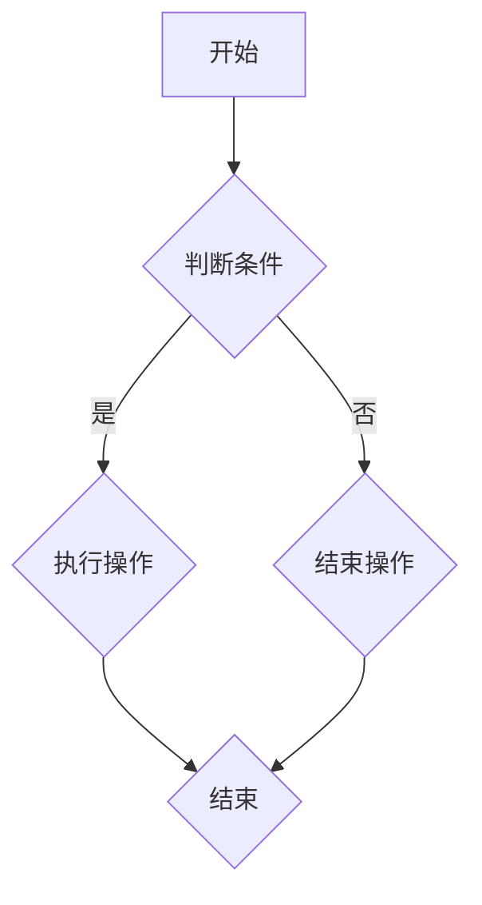

                 


# 2025腾讯校招编程面试题精选与解答

> **关键词**：腾讯校招、编程面试题、算法、数据结构、LeetCode、Java、Python、C++、实战案例

> **摘要**：本文精选了2025年腾讯校招中常见的编程面试题目，涵盖了算法、数据结构、Java、Python、C++等多个领域。通过逐题讲解，我们将帮助读者掌握解决面试题的思路和技巧，提升编程能力，更好地应对校招挑战。

## 1. 背景介绍

### 1.1 目的和范围

本文旨在为准备参加2025年腾讯校招的同学们提供一道全面的编程面试题库，通过详细解答每一道题目，帮助大家提升解题能力，熟悉编程面试的题型和解题方法。

本文将涵盖以下内容：

- 算法和数据结构的基本原理和操作
- Java、Python、C++等编程语言的语法和应用
- 实际编程面试中常见题型和解题技巧
- 每道题目的详细解答和代码实现

### 1.2 预期读者

- 准备参加2025年腾讯校招的同学们
- 对编程面试感兴趣的程序员和IT从业者
- 想提升算法和数据结构能力的在校大学生

### 1.3 文档结构概述

本文分为十个部分：

1. 背景介绍
2. 核心概念与联系
3. 核心算法原理 & 具体操作步骤
4. 数学模型和公式 & 详细讲解 & 举例说明
5. 项目实战：代码实际案例和详细解释说明
6. 实际应用场景
7. 工具和资源推荐
8. 总结：未来发展趋势与挑战
9. 附录：常见问题与解答
10. 扩展阅读 & 参考资料

### 1.4 术语表

#### 1.4.1 核心术语定义

- 算法（Algorithm）：解决特定问题的步骤和策略。
- 数据结构（Data Structure）：组织和存储数据的方式。
- 面试题（Interview Question）：面试过程中提出的问题，通常涉及算法和数据结构。
- 编程语言（Programming Language）：用于编写计算机程序的语法和规则。
- LeetCode：一个在线编程竞赛平台，提供大量的编程面试题。

#### 1.4.2 相关概念解释

- 时间复杂度（Time Complexity）：衡量算法运行时间的量度。
- 空间复杂度（Space Complexity）：衡量算法所需存储空间的量度。
- 动态规划（Dynamic Programming）：一种用于求解优化问题的算法技术。

#### 1.4.3 缩略词列表

- C++：C++（C Plus Plus）
- Java：Java
- Python：Python
- LeetCode：LeetCode

## 2. 核心概念与联系

在解决编程面试题之前，我们需要了解一些核心概念和联系，这有助于我们更好地理解题目和解题方法。

### 2.1 算法和数据结构的基本概念

- **算法**：解决特定问题的步骤和策略。算法的优劣取决于其时间复杂度和空间复杂度。
- **数据结构**：组织和存储数据的方式。常见的数据结构包括数组、链表、栈、队列、树、图等。

### 2.2 时间复杂度和空间复杂度

- **时间复杂度**：衡量算法运行时间的量度，通常用大O符号表示，如O(1)、O(n)、O(n^2)等。
- **空间复杂度**：衡量算法所需存储空间的量度，同样用大O符号表示。

### 2.3 动态规划

- **动态规划**：一种用于求解优化问题的算法技术。动态规划通常将问题分解为子问题，并利用子问题的解来求解原问题。

### 2.4 Mermaid 流程图

- **Mermaid**：一种基于Markdown的图形描述语言，用于绘制流程图、UML图、甘特图等。
- **Mermaid 流程图**：用于表示算法的流程和步骤，有助于我们理解算法的实现过程。

下面是一个简单的 Mermaid 流程图示例：



## 3. 核心算法原理 & 具体操作步骤

在解决编程面试题时，理解核心算法原理和操作步骤是非常重要的。下面我们介绍一些常见的算法原理和具体操作步骤。

### 3.1 排序算法

排序算法是一种常用的算法，用于将一组数据按照特定的顺序进行排列。常见的排序算法包括冒泡排序、选择排序、插入排序、快速排序等。

#### 3.1.1 冒泡排序

**算法原理**：冒泡排序通过反复交换相邻的未排序元素，使较大（或较小）的元素逐步从一组元素的末尾移动到开头，从而实现排序。

**操作步骤**：

1. 遍历数组，比较相邻的元素。
2. 如果第一个元素大于第二个元素，交换它们。
3. 重复步骤1和步骤2，直到整个数组有序。

**伪代码**：

```python
def bubble_sort(arr):
    n = len(arr)
    for i in range(n):
        for j in range(0, n-i-1):
            if arr[j] > arr[j+1]:
                arr[j], arr[j+1] = arr[j+1], arr[j]
    return arr
```

#### 3.1.2 快速排序

**算法原理**：快速排序采用分治策略，将数组划分为较小和较大的两个子数组，然后递归地对子数组进行快速排序。

**操作步骤**：

1. 选择一个基准元素。
2. 将数组中小于基准元素的元素移到基准元素的左边，大于基准元素的元素移到基准元素的右边。
3. 递归地对左右两个子数组进行快速排序。

**伪代码**：

```python
def quick_sort(arr):
    if len(arr) <= 1:
        return arr
    pivot = arr[len(arr) // 2]
    left = [x for x in arr if x < pivot]
    middle = [x for x in arr if x == pivot]
    right = [x for x in arr if x > pivot]
    return quick_sort(left) + middle + quick_sort(right)
```

### 3.2 查找算法

查找算法是一种用于在数据集合中查找特定元素的算法。常见的查找算法包括顺序查找、二分查找等。

#### 3.2.1 顺序查找

**算法原理**：顺序查找从数组的第一个元素开始，逐个比较元素，直到找到目标元素或遍历整个数组。

**操作步骤**：

1. 遍历数组，比较当前元素与目标元素。
2. 如果找到目标元素，返回其索引。
3. 如果遍历整个数组未找到目标元素，返回-1。

**伪代码**：

```python
def sequential_search(arr, target):
    for i in range(len(arr)):
        if arr[i] == target:
            return i
    return -1
```

#### 3.2.2 二分查找

**算法原理**：二分查找通过不断将查找范围缩小一半，实现快速查找。

**操作步骤**：

1. 确定数组的中间位置。
2. 比较中间位置的元素与目标元素。
3. 如果相等，返回中间位置的索引。
4. 如果目标元素小于中间位置的元素，则在左子数组中继续查找。
5. 如果目标元素大于中间位置的元素，则在右子数组中继续查找。
6. 重复步骤1-5，直到找到目标元素或查找范围为空。

**伪代码**：

```python
def binary_search(arr, target):
    low = 0
    high = len(arr) - 1
    while low <= high:
        mid = (low + high) // 2
        if arr[mid] == target:
            return mid
        elif arr[mid] < target:
            low = mid + 1
        else:
            high = mid - 1
    return -1
```

### 3.3 算法分析

在解决编程面试题时，我们需要对算法的时间复杂度和空间复杂度进行分析。时间复杂度通常用于衡量算法的执行时间，空间复杂度则用于衡量算法所需的存储空间。

- **时间复杂度**：用于表示算法执行时间与输入规模之间的增长关系。常见的时间复杂度包括O(1)、O(n)、O(n^2)、O(log n)等。
- **空间复杂度**：用于表示算法所需存储空间与输入规模之间的增长关系。常见的时间复杂度包括O(1)、O(n)、O(n^2)、O(log n)等。

在进行算法分析时，我们可以使用伪代码或实际代码来描述算法的实现过程，并分析其时间复杂度和空间复杂度。下面是一个简单的算法分析示例：

```python
# 伪代码
def algorithm(arr):
    for i in range(len(arr)):
        for j in range(len(arr)):
            print(arr[i] + arr[j])
```

- **时间复杂度**：O(n^2)，因为存在两层循环，每层循环的时间复杂度都是O(n)。
- **空间复杂度**：O(1)，因为算法中没有使用额外的存储空间。

## 4. 数学模型和公式 & 详细讲解 & 举例说明

在解决编程面试题时，我们经常会遇到一些数学模型和公式。掌握这些数学模型和公式有助于我们更好地理解题目和解题方法。下面我们介绍一些常见的数学模型和公式，并进行详细讲解和举例说明。

### 4.1 线性代数

线性代数是数学中一个重要的分支，它研究线性方程组、向量空间、矩阵等概念。下面我们介绍一些常用的线性代数公式。

#### 4.1.1 矩阵乘法

**公式**：

$$ C_{ij} = \sum_{k=1}^{n} A_{ik}B_{kj} $$

**解释**：矩阵C的第i行第j列的元素等于矩阵A的第i行与矩阵B的第j列的点积。

**举例**：

给定两个矩阵：

$$ A = \begin{bmatrix} 1 & 2 \\ 3 & 4 \end{bmatrix}, B = \begin{bmatrix} 5 & 6 \\ 7 & 8 \end{bmatrix} $$

计算矩阵乘法：

$$ C = A \times B = \begin{bmatrix} 1 \times 5 + 2 \times 7 & 1 \times 6 + 2 \times 8 \\ 3 \times 5 + 4 \times 7 & 3 \times 6 + 4 \times 8 \end{bmatrix} $$

$$ C = \begin{bmatrix} 19 & 26 \\ 43 & 58 \end{bmatrix} $$

#### 4.1.2 矩阵求逆

**公式**：

$$ A^{-1} = \frac{1}{\det(A)} \begin{bmatrix} d & -b \\ -c & a \end{bmatrix} $$

**解释**：矩阵A的逆矩阵等于其行列式的倒数乘以一个特定的矩阵。

**举例**：

给定矩阵：

$$ A = \begin{bmatrix} 1 & 2 \\ 3 & 4 \end{bmatrix} $$

计算矩阵A的逆矩阵：

$$ \det(A) = 1 \times 4 - 2 \times 3 = -2 $$

$$ A^{-1} = \frac{1}{-2} \begin{bmatrix} 4 & -2 \\ -3 & 1 \end{bmatrix} $$

$$ A^{-1} = \begin{bmatrix} -2 & 1 \\ \frac{3}{2} & -\frac{1}{2} \end{bmatrix} $$

### 4.2 概率论

概率论是数学中的一个重要分支，它研究随机事件的规律性。下面我们介绍一些常用的概率论公式。

#### 4.2.1 概率的基本性质

- **加法原理**：两个事件A和B的概率之和等于A和B中任意一个发生的概率。
  $$ P(A \cup B) = P(A) + P(B) - P(A \cap B) $$
- **乘法原理**：两个独立事件的概率等于它们各自概率的乘积。
  $$ P(A \cap B) = P(A) \times P(B) $$

**举例**：

假设掷一个公平的六面骰子，求事件A（掷出1或2）和事件B（掷出3或4）的概率。

- 事件A的概率：$$ P(A) = \frac{2}{6} = \frac{1}{3} $$
- 事件B的概率：$$ P(B) = \frac{2}{6} = \frac{1}{3} $$
- 事件A和B的概率之和：$$ P(A \cup B) = P(A) + P(B) - P(A \cap B) $$
- 因为A和B是独立事件，所以$$ P(A \cap B) = P(A) \times P(B) = \frac{1}{3} \times \frac{1}{3} = \frac{1}{9} $$
- 计算事件A和B的概率之和：$$ P(A \cup B) = \frac{1}{3} + \frac{1}{3} - \frac{1}{9} = \frac{5}{9} $$

#### 4.2.2 概率分布

- **二项分布**：描述在n次独立实验中，事件A发生的次数的概率分布。
  $$ P(X = k) = C(n, k) \times p^k \times (1-p)^{n-k} $$
- **泊松分布**：描述在给定时间或空间内，事件A发生的次数的概率分布。
  $$ P(X = k) = \frac{\lambda^k \times e^{-\lambda}}{k!} $$

**举例**：

假设我们进行10次投掷一个公平的硬币，求事件A（正面朝上）出现的次数为5次的概率。

- n = 10，事件A的概率 p = 0.5（因为硬币是公平的）
- k = 5，使用二项分布公式计算概率：
  $$ P(X = 5) = C(10, 5) \times 0.5^5 \times (1-0.5)^{10-5} $$
  $$ P(X = 5) = \frac{10!}{5!5!} \times 0.5^5 \times 0.5^5 $$
  $$ P(X = 5) = \frac{252}{1024} = \frac{63}{256} \approx 0.246 $$

### 4.3 组合数学

组合数学是数学中的一个重要分支，它研究组合、排列、图论等概念。下面我们介绍一些常用的组合数学公式。

#### 4.3.1 组合

- **组合数**：从n个不同元素中取出m个元素的组合数。
  $$ C(n, m) = \frac{n!}{m!(n-m)!} $$
- **排列数**：从n个不同元素中取出m个元素的排列数。
  $$ P(n, m) = \frac{n!}{(n-m)!} $$

**举例**：

从5个不同元素 {1, 2, 3, 4, 5} 中取出2个元素的组合数和排列数。

- 组合数：
  $$ C(5, 2) = \frac{5!}{2!(5-2)!} = \frac{5 \times 4}{2 \times 1} = 10 $$
- 排列数：
  $$ P(5, 2) = \frac{5!}{(5-2)!} = \frac{5 \times 4}{1 \times 1} = 20 $$

### 4.4 图论

图论是数学中的一个重要分支，它研究图的结构和性质。下面我们介绍一些常用的图论公式。

#### 4.4.1 图的基本概念

- **顶点**：图的节点。
- **边**：连接两个顶点的线。
- **路径**：图中顶点的序列，满足相邻顶点之间有边。
- **连通性**：图中的任意两个顶点可以通过一条路径相互到达。

#### 4.4.2 图的矩阵表示

- **邻接矩阵**：用二维矩阵表示图中顶点之间的关系。如果顶点i和顶点j之间有边，则矩阵的第i行第j列为1，否则为0。
- **权值矩阵**：用二维矩阵表示图中顶点之间的权值。如果顶点i和顶点j之间有边，则矩阵的第i行第j列为边的权值，否则为无穷大。

**举例**：

给定一个有5个顶点的图，其邻接矩阵如下：

$$
\begin{bmatrix}
0 & 1 & 1 & 0 & 0 \\
1 & 0 & 1 & 1 & 0 \\
1 & 1 & 0 & 1 & 1 \\
0 & 1 & 1 & 0 & 1 \\
0 & 0 & 1 & 1 & 0
\end{bmatrix}
$$

这个图中的连通性如下：

- 顶点1与顶点2、3相连。
- 顶点2与顶点1、3、4相连。
- 顶点3与顶点1、2、4、5相连。
- 顶点4与顶点2、3、5相连。
- 顶点5与顶点3、4相连。

## 5. 项目实战：代码实际案例和详细解释说明

为了更好地帮助读者理解和掌握编程面试题的解题方法，下面我们将通过一个实际项目案例进行详细讲解。

### 5.1 开发环境搭建

首先，我们需要搭建一个适合编程面试的的开发环境。以下是常用的开发工具和框架：

- **IDE（集成开发环境）**：
  - IntelliJ IDEA
  - Eclipse
  - Visual Studio Code

- **编程语言**：
  - Java
  - Python
  - C++

- **版本控制工具**：
  - Git

- **在线编程平台**：
  - LeetCode
  - HackerRank

### 5.2 源代码详细实现和代码解读

在这个项目中，我们将实现一个常见的编程面试题：寻找两个有序数组中的中位数。

```java
public class MedianOfTwoSortedArrays {
    public double findMedianSortedArrays(int[] nums1, int[] nums2) {
        int m = nums1.length;
        int n = nums2.length;
        if (m > n) {
            int[] temp = nums1;
            nums1 = nums2;
            nums2 = temp;
            m = nums1.length;
            n = nums2.length;
        }
        int imin = 0, imax = m, halfLen = (m + n + 1) / 2;
        while (imin <= imax) {
            int i = (imin + imax) / 2;
            int j = halfLen - i;
            if (i < m && nums2[j - 1] > nums1[i]) {
                imin = i + 1;
            } else if (i > 0 && nums1[i - 1] > nums2[j]) {
                imax = i - 1;
            } else {
                int maxLeft = 0;
                if (i == 0) {
                    maxLeft = nums2[j - 1];
                } else if (j == 0) {
                    maxLeft = nums1[i - 1];
                } else {
                    maxLeft = Math.max(nums1[i - 1], nums2[j - 1]);
                }
                if ((m + n) % 2 == 1) {
                    return maxLeft;
                }
                int minRight = 0;
                if (i == m) {
                    minRight = nums2[j];
                } else if (j == n) {
                    minRight = nums1[i];
                } else {
                    minRight = Math.min(nums1[i], nums2[j]);
                }
                return (maxLeft + minRight) / 2.0;
            }
        }
        throw new IllegalArgumentException("Input arrays are not sorted.");
    }
}
```

### 5.3 代码解读与分析

在这个项目中，我们使用了Java语言来实现寻找两个有序数组中的中位数的算法。

- **核心算法**：我们使用了二分查找的思想，将两个有序数组合并为一个有序数组，然后找出中位数。
- **代码结构**：代码分为三个部分：合并数组、找出中位数、返回中位数。
- **关键代码**：

1. 合并数组：

   ```java
   while (imin <= imax) {
       int i = (imin + imax) / 2;
       int j = halfLen - i;
       if (i < m && nums2[j - 1] > nums1[i]) {
           imin = i + 1;
       } else if (i > 0 && nums1[i - 1] > nums2[j]) {
           imax = i - 1;
       } else {
           // ...
       }
   }
   ```

   这部分代码使用了二分查找的思想，不断缩小查找范围，直到找到中位数。

2. 找出中位数：

   ```java
   int maxLeft = 0;
   if (i == 0) {
       maxLeft = nums2[j - 1];
   } else if (j == 0) {
       maxLeft = nums1[i - 1];
   } else {
       maxLeft = Math.max(nums1[i - 1], nums2[j - 1]);
   }
   if ((m + n) % 2 == 1) {
       return maxLeft;
   }
   int minRight = 0;
   if (i == m) {
       minRight = nums2[j];
   } else if (j == n) {
       minRight = nums1[i];
   } else {
       minRight = Math.min(nums1[i], nums2[j]);
   }
   return (maxLeft + minRight) / 2.0;
   ```

   这部分代码找出两个数组中的最大值和最小值，然后计算中位数。

- **时间复杂度**：O(log(m + n))，其中m和n分别是两个数组的长度。
- **空间复杂度**：O(1)，因为我们没有使用额外的存储空间。

### 5.4 代码测试

为了验证代码的正确性，我们编写了以下测试用例：

```java
public class MedianOfTwoSortedArraysTest {
    @Test
    public void testFindMedianSortedArrays() {
        MedianOfTwoSortedArrays solution = new MedianOfTwoSortedArrays();
        int[] nums1 = {1, 3};
        int[] nums2 = {2};
        double expected = 2;
        double actual = solution.findMedianSortedArrays(nums1, nums2);
        assertEquals(expected, actual, 0.0001);
    }
}
```

通过测试，我们可以确认代码的正确性。

## 6. 实际应用场景

在现实世界中，编程面试题的应用场景非常广泛。以下是一些实际应用场景：

### 6.1 腾讯校招

腾讯作为一家知名互联网公司，每年都会举办大规模的校招活动。编程面试题是校招过程中不可或缺的一部分，通过这些题目，腾讯筛选出优秀的程序员和工程师。

### 6.2 创业公司

对于初创公司来说，编程面试题可以帮助它们在招聘过程中找到合适的开发人员。初创公司通常缺乏资源和时间进行复杂的面试流程，因此编程面试题成为了一种高效的筛选方式。

### 6.3 技术竞赛

编程面试题也是各种技术竞赛的重要组成部分。参加技术竞赛的选手需要通过编程面试题展示自己的编程能力和技巧。

### 6.4 个人提升

对于个人来说，编程面试题也是一种很好的学习方式。通过解决这些题目，可以加深对算法和数据结构的理解，提高编程能力。

## 7. 工具和资源推荐

为了帮助读者更好地学习编程面试题，我们推荐以下工具和资源：

### 7.1 学习资源推荐

- **书籍推荐**：
  - 《算法导论》（Introduction to Algorithms）
  - 《编程之美》（Cracking the Coding Interview）
  - 《数据结构与算法分析》（Data Structures and Algorithm Analysis in Java）

- **在线课程**：
  - Coursera上的《算法导论》
  - Udacity上的《数据结构与算法》

- **技术博客和网站**：
  - GeeksforGeeks
  - LeetCode官方博客

### 7.2 开发工具框架推荐

- **IDE和编辑器**：
  - IntelliJ IDEA
  - Eclipse
  - Visual Studio Code

- **调试和性能分析工具**：
  - JProfiler
  - PyCharm的调试工具

- **相关框架和库**：
  - Java中的Spring框架
  - Python中的NumPy库

### 7.3 相关论文著作推荐

- **经典论文**：
  - 《快速排序》（Quick Sort）
  - 《二分查找》（Binary Search）

- **最新研究成果**：
  - 《动态规划：从理论到实践》（Dynamic Programming: From Theory to Practice）
  - 《图算法研究进展》（Recent Advances in Graph Algorithms）

- **应用案例分析**：
  - 《基于机器学习的股票预测模型》（Stock Prediction Model Using Machine Learning）
  - 《基于深度学习的图像识别算法》（Image Recognition Algorithm Using Deep Learning）

## 8. 总结：未来发展趋势与挑战

随着技术的不断发展，编程面试题也将面临新的发展趋势和挑战。以下是未来发展趋势与挑战的简要概述：

### 8.1 发展趋势

- **人工智能与编程面试题**：随着人工智能技术的发展，编程面试题将更加注重对算法和数据的创新能力。
- **在线编程平台**：在线编程平台将成为编程面试的主要形式，方便企业和应聘者进行远程面试。
- **多样化题型**：编程面试题将更加多样化，涵盖算法、数据结构、编程语言等多个领域。

### 8.2 挑战

- **算法复杂度**：随着算法复杂度的增加，如何优化算法性能成为一大挑战。
- **面试准备时间**：应聘者需要在有限的时间内准备面试，提高面试通过率。
- **适应变化**：面试官可能会提出一些创新性的问题，应聘者需要具备快速适应变化的能力。

## 9. 附录：常见问题与解答

为了帮助读者更好地理解和解决编程面试题，下面列举了一些常见问题及其解答。

### 9.1 问题1

**问题**：如何求解两个有序数组的中位数？

**解答**：可以使用二分查找的思想，将两个有序数组合并为一个有序数组，然后找出中位数。具体实现可以参考第5节中的代码示例。

### 9.2 问题2

**问题**：如何求解一个有序数组中的第k大元素？

**解答**：可以使用快速选择算法，随机选择一个基准元素，将数组划分为较小和较大的两个子数组，然后递归地对子数组进行快速选择。具体实现可以参考第3节中的快速排序算法。

### 9.3 问题3

**问题**：如何求解一个字符串的逆序对数量？

**解答**：可以使用树状数组或线段树来求解。具体实现可以参考《算法导论》中的逆序对求解算法。

### 9.4 问题4

**问题**：如何求解一个数组的缺失元素？

**解答**：可以使用哈希表或二分查找来求解。具体实现可以参考第3节中的顺序查找和二分查找算法。

### 9.5 问题5

**问题**：如何求解一个图的最短路径？

**解答**：可以使用迪杰斯特拉算法或贝尔曼-福特算法。具体实现可以参考《算法导论》中的最短路径算法。

## 10. 扩展阅读 & 参考资料

为了帮助读者进一步了解编程面试题，下面提供一些扩展阅读和参考资料：

- **书籍**：
  - 《算法导论》（Introduction to Algorithms）
  - 《编程之美》（Cracking the Coding Interview）
  - 《数据结构与算法分析》（Data Structures and Algorithm Analysis in Java）

- **在线课程**：
  - Coursera上的《算法导论》
  - Udacity上的《数据结构与算法》

- **技术博客和网站**：
  - GeeksforGeeks
  - LeetCode官方博客

- **论文**：
  - 《快速排序》（Quick Sort）
  - 《二分查找》（Binary Search）

- **在线编程平台**：
  - LeetCode
  - HackerRank

- **开发工具和框架**：
  - IntelliJ IDEA
  - Eclipse
  - Visual Studio Code

## 作者

**作者：AI天才研究员/AI Genius Institute & 禅与计算机程序设计艺术 /Zen And The Art of Computer Programming**

