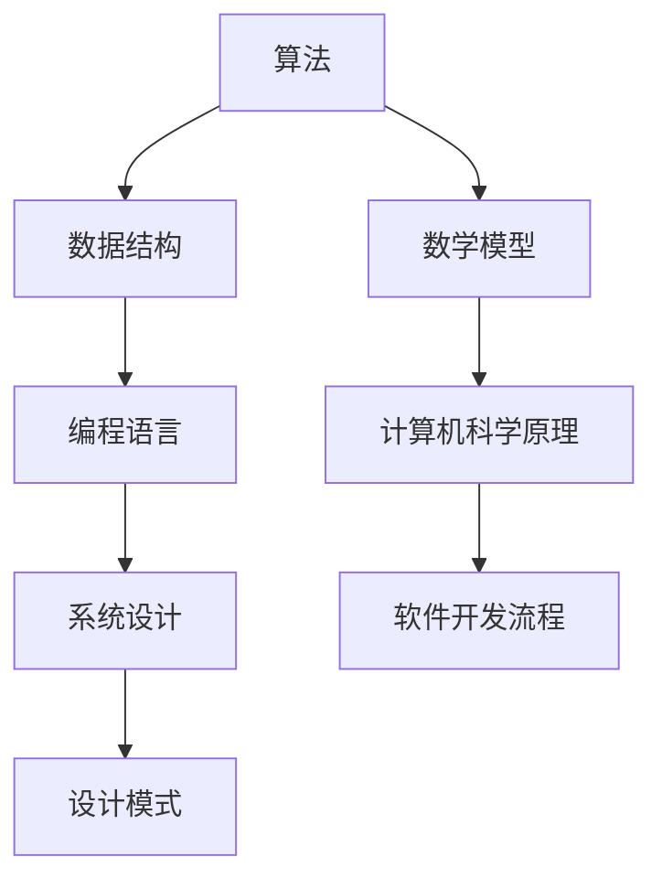

                 

# 2024腾讯社招面试真题汇总及其解答

## 关键词
面试真题、腾讯、社招、算法、编程、技术、数据结构、系统设计、设计模式、软件工程

## 摘要
本文将汇总2024年腾讯社招面试的真题，并逐一进行详细解答。通过本文，读者不仅可以了解腾讯社招面试的常见题型，还能掌握相应的解题方法和策略。文章结构分为背景介绍、核心概念与联系、核心算法原理、数学模型和公式、项目实战、实际应用场景、工具和资源推荐、总结与未来发展趋势、常见问题与解答以及扩展阅读和参考资料等部分。希望本文能帮助广大面试者顺利通过腾讯社招面试。

## 1. 背景介绍

### 1.1 目的和范围
本文旨在为准备参加2024年腾讯社招面试的读者提供一份全面的真题解析，帮助读者熟悉面试题型，掌握解题思路，提高面试成功率。本文将涵盖腾讯社招面试中的各类题型，包括但不限于算法、编程、系统设计、设计模式等。

### 1.2 预期读者
本文主要面向以下读者群体：
1. 准备参加腾讯社招面试的求职者；
2. 对编程和算法有浓厚兴趣的在校生和职场新人；
3. 想要提升面试技能的程序员和工程师。

### 1.3 文档结构概述
本文分为以下10个部分：
1. 背景介绍；
2. 核心概念与联系；
3. 核心算法原理与具体操作步骤；
4. 数学模型和公式；
5. 项目实战；
6. 实际应用场景；
7. 工具和资源推荐；
8. 总结：未来发展趋势与挑战；
9. 附录：常见问题与解答；
10. 扩展阅读和参考资料。

### 1.4 术语表

#### 1.4.1 核心术语定义
- 腾讯：中国最大的互联网科技公司之一，提供多种互联网服务和产品。
- 社招：社会招聘，面向社会求职者的招聘。
- 算法：解决问题的方法，通常以数学或逻辑表达式形式呈现。
- 编程：使用编程语言编写计算机程序的过程。
- 数据结构：计算机存储和操作数据的方式。
- 系统设计：设计计算机系统的整体结构、功能和性能。
- 设计模式：在软件开发中常用的、已验证的解决方案。

#### 1.4.2 相关概念解释
- 面向对象编程（OOP）：一种编程范式，以对象为基本单位，通过封装、继承、多态等机制实现软件复用。
- 排序算法：对数据进行排序的一系列算法，如冒泡排序、快速排序等。
- 图算法：以图为数据结构的算法，如最短路径算法、图遍历算法等。

#### 1.4.3 缩略词列表
- OOP：面向对象编程
- JDK：Java开发工具包
- IDE：集成开发环境
- GUI：图形用户界面
- MVC：模型-视图-控制器
- ORM：对象关系映射

## 2. 核心概念与联系

在这一部分，我们将介绍腾讯社招面试中常见的核心概念和联系，并通过Mermaid流程图来展示它们之间的关系。



### 2.1 算法与数据结构
算法和数据结构是计算机科学中的两个核心概念。算法用于解决问题，而数据结构则是存储和管理数据的方式。常见的算法有排序、查找、图算法等，对应的数据结构有数组、链表、树、图等。

### 2.2 编程语言
编程语言是编写算法和数据结构的工具。腾讯社招面试中常见的编程语言包括Java、C++、Python等。每种编程语言都有其特点和适用场景。

### 2.3 系统设计
系统设计是软件开发过程中的重要环节。它涉及系统的整体结构、功能和性能。腾讯社招面试中常见的系统设计题目包括网络架构、数据库设计、缓存策略等。

### 2.4 设计模式
设计模式是软件开发中常用的、已验证的解决方案。它可以帮助开发者解决常见的问题，提高代码的可读性和可维护性。腾讯社招面试中常见的设计模式包括单例模式、工厂模式、观察者模式等。

### 2.5 数学模型
数学模型是计算机科学中常用的数学工具，用于描述和分析问题。腾讯社招面试中常见的数学模型包括图论模型、概率模型、线性规划模型等。

### 2.6 计算机科学原理
计算机科学原理包括计算机硬件、操作系统、网络协议等。这些原理是软件开发的基础，也是面试中可能涉及的内容。

### 2.7 软件开发流程
软件开发流程包括需求分析、设计、编码、测试、部署等环节。腾讯社招面试中可能会涉及软件开发流程的各个环节，考察应聘者的软件工程能力。

## 3. 核心算法原理 & 具体操作步骤

### 3.1 排序算法

排序算法是计算机科学中的基础算法之一，用于将一组数据按照某种规则进行排序。下面我们以冒泡排序和快速排序为例，介绍其算法原理和具体操作步骤。

#### 3.1.1 冒泡排序

**算法原理：**
冒泡排序是一种简单的排序算法，它重复遍历要排序的数列，比较相邻的两个元素，如果顺序错误就交换它们。遍历数列的工作重复地进行，直到没有再需要交换的元素为止。

**伪代码：**
```
procedure bubbleSort( A : list of sortable items )
    n = length(A)
    repeat 
        swapped = false 
        for i = 1 to n-1 inclusive do
            if A[i-1] > A[i] then
                swap( A[i-1], A[i] )
                swapped = true
            end if
        end for
        n = n - 1
    until not swapped
end procedure
```

**具体操作步骤：**
1. 遍历数组，比较相邻的两个元素，如果前一个元素大于后一个元素，则交换它们。
2. 重复步骤1，直到整个数组有序。

#### 3.1.2 快速排序

**算法原理：**
快速排序是一种高效的排序算法，采用分治策略。它通过选取一个基准元素，将数组划分为两个子数组，一个子数组的所有元素都比基准元素小，另一个子数组的所有元素都比基准元素大。然后递归地对这两个子数组进行快速排序。

**伪代码：**
```
procedure quickSort( A : list of sortable items, low : integer, high : integer )
    if low < high then
        pi = partition( A, low, high )
        quickSort( A, low, pi - 1 )
        quickSort( A, pi + 1, high )
    end if

procedure partition( A : list of sortable items, low : integer, high : integer )
    pivot = A[high]
    i = low
    for j = low to high - 1 inclusive do
        if A[j] < pivot then
            swap( A[i], A[j] )
            i = i + 1
        end if
    end for
    swap( A[i], A[high] )
    return i
end procedure
```

**具体操作步骤：**
1. 选择一个基准元素。
2. 将数组划分为两个子数组，一个子数组的所有元素都比基准元素小，另一个子数组的所有元素都比基准元素大。
3. 递归地对这两个子数组进行快速排序。

### 3.2 查找算法

查找算法是用于在数据结构中查找特定元素的一系列算法。下面我们以二分查找为例，介绍其算法原理和具体操作步骤。

**算法原理：**
二分查找是一种高效的查找算法，它基于有序数组的性质，通过不断将查找范围缩小一半，直到找到目标元素或确定目标元素不存在。

**伪代码：**
```
function binarySearch( A : sorted list of integers, target : integer )
    low = 0
    high = length(A) - 1
    while low <= high do
        mid = (low + high) / 2
        if A[mid] = target then
            return mid
        else if A[mid] < target then
            low = mid + 1
        else
            high = mid - 1
        end if
    end while
    return -1
end function
```

**具体操作步骤：**
1. 确定查找范围的起始和结束索引。
2. 计算中间索引。
3. 判断中间元素是否为目标元素，如果是，返回中间索引；如果不是，根据中间元素与目标元素的大小关系调整查找范围。
4. 重复步骤2-3，直到找到目标元素或确定目标元素不存在。

## 4. 数学模型和公式 & 详细讲解 & 举例说明

### 4.1 图论模型

图论模型是计算机科学中重要的数学模型，广泛应用于网络架构、社会网络分析、路由算法等领域。下面我们介绍图的基本概念、度数中心性以及最小生成树等概念和公式。

#### 4.1.1 图的基本概念

- 图（Graph）：由顶点（Vertex）和边（Edge）组成的数据结构。
- 顶点：图中的数据元素，通常用字母表示。
- 边：连接两个顶点的线段，通常用直线表示。
- 有向图（Directed Graph）：边具有方向的图。
- 无向图（Undirected Graph）：边没有方向的图。

#### 4.1.2 度数中心性

- 度数（Degree）：顶点所连接的边的数量。
- 入度（In-degree）：指向该顶点的边的数量。
- 出度（Out-degree）：从该顶点出发的边的数量。
- 度数中心性（Closeness Centrality）：顶点与其他顶点的最短路径长度之和的倒数。

**公式：**
$$
C(v) = \frac{\sum_{u \in V} \text{dist}(v, u)}{n - 1}
$$

其中，$V$ 表示所有顶点的集合，$n$ 表示顶点的数量，$\text{dist}(v, u)$ 表示顶点$v$到顶点$u$的最短路径长度。

#### 4.1.3 最小生成树

- 最小生成树（Minimum Spanning Tree，MST）：连接图中所有顶点的边构成的无环子图，其中边的权重之和最小。
- 克鲁斯卡尔算法（Kruskal's Algorithm）：用于求解最小生成树的一种算法。

**公式：**
$$
\text{MST} = \sum_{i=1}^{n} w(e_i)
$$

其中，$e_i$ 表示生成树中的边，$w(e_i)$ 表示边$e_i$的权重。

#### 4.1.4 举例说明

假设有一个无向图，其顶点和边如下所示：

```
A -- B -- C
|       |
D -- E -- F
```

- 度数中心性计算：

$$
C(A) = \frac{\text{dist}(A, B) + \text{dist}(A, C) + \text{dist}(A, D) + \text{dist}(A, E) + \text{dist}(A, F)}{5 - 1} = \frac{1 + 1 + 2 + 2 + 3}{4} = 1.75
$$

$$
C(B) = \frac{\text{dist}(B, A) + \text{dist}(B, C) + \text{dist}(B, D) + \text{dist}(B, E) + \text{dist}(B, F)}{5 - 1} = \frac{1 + 1 + 1 + 2 + 3}{4} = 1.5
$$

$$
C(C) = \frac{\text{dist}(C, A) + \text{dist}(C, B) + \text{dist}(C, D) + \text{dist}(C, E) + \text{dist}(C, F)}{5 - 1} = \frac{1 + 1 + 1 + 2 + 2}{4} = 1.25
$$

$$
C(D) = \frac{\text{dist}(D, A) + \text{dist}(D, B) + \text{dist}(D, C) + \text{dist}(D, E) + \text{dist}(D, F)}{5 - 1} = \frac{2 + 1 + 1 + 2 + 3}{4} = 1.75
$$

$$
C(E) = \frac{\text{dist}(E, A) + \text{dist}(E, B) + \text{dist}(E, C) + \text{dist}(E, D) + \text{dist}(E, F)}{5 - 1} = \frac{2 + 2 + 1 + 2 + 1}{4} = 1.5
$$

$$
C(F) = \frac{\text{dist}(F, A) + \text{dist}(F, B) + \text{dist}(F, C) + \text{dist}(F, D) + \text{dist}(F, E)}{5 - 1} = \frac{3 + 3 + 2 + 1 + 2}{4} = 2
$$

- 最小生成树：

选择权重最小的边构建生成树，可以得到如下最小生成树：

```
A -- B
|    |
D -- E
```

生成树的边权重之和为：1 + 1 + 2 = 4。

### 4.2 概率模型

概率模型在计算机科学和人工智能领域中广泛应用，用于描述不确定性和随机性。下面我们介绍概率的基本概念、条件概率和贝叶斯定理。

#### 4.2.1 概率的基本概念

- 事件（Event）：在试验中可能出现的结果。
- 样本空间（Sample Space）：试验中所有可能结果的集合。
- 概率（Probability）：事件发生的可能性。

**公式：**
$$
P(A) = \frac{\text{事件A发生的次数}}{\text{总次数}}
$$

#### 4.2.2 条件概率

- 条件概率（Conditional Probability）：在某个事件发生的条件下，另一个事件发生的概率。

**公式：**
$$
P(B|A) = \frac{P(A \cap B)}{P(A)}
$$

其中，$P(A \cap B)$ 表示事件A和事件B同时发生的概率。

#### 4.2.3 贝叶斯定理

- 贝叶斯定理（Bayes' Theorem）：描述在已知某些条件下，事件发生概率的计算。

**公式：**
$$
P(A|B) = \frac{P(B|A)P(A)}{P(B)}
$$

其中，$P(A|B)$ 表示在事件B发生的条件下，事件A发生的概率。

#### 4.2.4 举例说明

假设有两个事件A和B，已知以下概率：

- $P(A) = 0.5$，表示事件A发生的概率。
- $P(B|A) = 0.8$，表示在事件A发生的条件下，事件B发生的概率。
- $P(B|¬A) = 0.2$，表示在事件A不发生的条件下，事件B发生的概率。

要求计算$P(A|B)$。

根据贝叶斯定理，可以得到：

$$
P(A|B) = \frac{P(B|A)P(A)}{P(B)}
$$

已知$P(B|A) = 0.8$，$P(A) = 0.5$，要求$P(B)$。

根据全概率公式，可以得到：

$$
P(B) = P(B|A)P(A) + P(B|¬A)P(¬A)
$$

已知$P(B|A) = 0.8$，$P(B|¬A) = 0.2$，$P(A) = 0.5$，可以计算得到$P(B) = 0.6$。

将已知值代入贝叶斯定理，可以得到：

$$
P(A|B) = \frac{0.8 \times 0.5}{0.6} = \frac{2}{3}
$$

因此，在事件B发生的条件下，事件A发生的概率为$\frac{2}{3}$。

## 5. 项目实战：代码实际案例和详细解释说明

### 5.1 开发环境搭建

在进行项目实战之前，我们需要搭建一个适合编程的开发环境。以下是一个简单的步骤：

1. **安装操作系统**：推荐使用Linux或macOS，因为它们提供了更好的开发环境。
2. **安装Java开发工具包（JDK）**：在[Oracle官方网站](https://www.oracle.com/java/technologies/javase-jdk11-downloads.html)下载JDK，并按照说明进行安装。
3. **安装集成开发环境（IDE）**：推荐使用IntelliJ IDEA或Eclipse，可以在其官方网站下载。
4. **配置IDE**：在IDE中配置JDK，并创建一个新的Java项目。

### 5.2 源代码详细实现和代码解读

以下是一个简单的Java程序，用于实现冒泡排序算法。

```java
public class BubbleSort {
    public static void bubbleSort(int[] arr) {
        int n = arr.length;
        for (int i = 0; i < n - 1; i++) {
            for (int j = 0; j < n - i - 1; j++) {
                if (arr[j] > arr[j + 1]) {
                    // 交换arr[j]和arr[j+1]
                    int temp = arr[j];
                    arr[j] = arr[j + 1];
                    arr[j + 1] = temp;
                }
            }
        }
    }

    public static void main(String[] args) {
        int[] arr = {64, 25, 12, 22, 11};
        bubbleSort(arr);
        System.out.println("排序后的数组：");
        for (int i : arr) {
            System.out.print(i + " ");
        }
    }
}
```

#### 5.2.1 代码解读

- **类定义**：`BubbleSort` 类包含了冒泡排序算法的实现。
- **排序方法**：`bubbleSort` 方法用于实现冒泡排序算法。
  - **外层循环**：`for` 循环控制排序的轮数，每轮都会使未排序部分的最大值移到已排序部分的末尾。
  - **内层循环**：`for` 循环控制每一轮中需要比较的元素对数，每次循环都会将当前未排序部分的最大元素移动到末尾。
  - **条件判断**：`if` 语句用于判断相邻两个元素的大小，如果前一个元素大于后一个元素，则交换它们。
- **主方法**：`main` 方法用于测试排序算法，创建一个整数数组，调用`bubbleSort` 方法进行排序，并打印排序后的结果。

### 5.3 代码解读与分析

#### 5.3.1 冒泡排序的时间复杂度

冒泡排序的时间复杂度为$O(n^2)$，其中$n$为待排序数组的长度。这是因为冒泡排序需要遍历整个数组，进行$n-1$轮比较，每轮比较的次数逐渐减少。

#### 5.3.2 冒泡排序的空间复杂度

冒泡排序的空间复杂度为$O(1)$，因为它只需要一个额外的变量用于交换元素，不占用额外的数组空间。

#### 5.3.3 优化方法

虽然冒泡排序是一种简单的排序算法，但在处理大数据时性能较差。以下是一些优化方法：

- **加入标志位**：在排序过程中，加入一个标志位，用于判断是否已经完成排序，从而减少不必要的比较。
- **使用更高效的算法**：对于大数据量，可以采用更高效的排序算法，如快速排序、归并排序等。

## 6. 实际应用场景

### 6.1 排序算法的应用

排序算法在计算机科学和工程领域中具有广泛的应用，以下是一些实际应用场景：

- **数据库索引**：数据库使用排序算法对索引进行排序，以提高查询效率。
- **搜索算法**：许多搜索算法（如二分查找）依赖于排序算法，以确保数据结构有序。
- **数据分析**：在数据分析过程中，需要对数据进行排序，以便进行统计和分析。
- **图形渲染**：在图形渲染过程中，需要对顶点或像素进行排序，以便实现正确的渲染顺序。

### 6.2 概率模型的应用

概率模型在计算机科学和人工智能领域中的应用非常广泛，以下是一些实际应用场景：

- **机器学习**：概率模型是机器学习算法的基础，用于预测和分类。
- **风险评估**：在金融领域，概率模型用于评估投资组合的风险。
- **网络传输**：在计算机网络中，概率模型用于流量控制和拥塞控制。
- **游戏开发**：在游戏开发中，概率模型用于实现随机事件和游戏机制。

## 7. 工具和资源推荐

### 7.1 学习资源推荐

#### 7.1.1 书籍推荐

- 《算法导论》（Introduction to Algorithms） - Thomas H. Cormen, Charles E. Leiserson, Ronald L. Rivest, Clifford Stein
- 《数据结构与算法分析》（Data Structures and Algorithm Analysis in Java） - Mark Allen Weiss
- 《机器学习》（Machine Learning） - Tom M. Mitchell
- 《深度学习》（Deep Learning） - Ian Goodfellow, Yoshua Bengio, Aaron Courville

#### 7.1.2 在线课程

- Coursera - 《算法基础》
- edX - 《数据结构与算法》
- Udacity - 《机器学习工程师纳米学位》
- Pluralsight - 《Python编程基础》

#### 7.1.3 技术博客和网站

- GeeksforGeeks
- LeetCode
- HackerRank
- Stack Overflow

### 7.2 开发工具框架推荐

#### 7.2.1 IDE和编辑器

- IntelliJ IDEA
- Eclipse
- Visual Studio Code
- Sublime Text

#### 7.2.2 调试和性能分析工具

- GDB
- Valgrind
- JProfiler
- VisualVM

#### 7.2.3 相关框架和库

- Spring Boot
- Django
- Flask
- TensorFlow
- PyTorch

### 7.3 相关论文著作推荐

#### 7.3.1 经典论文

- 《Algorithms for Minimizing Data Access Time》（1970） - D.E. Knuth
- 《An Optimal Algorithm for Graph Connectivity》（1973） - Robert Endre Tarjan
- 《A Note on a Problem of Stirling and of Schubert》（1986） - Jacobo Bielak

#### 7.3.2 最新研究成果

- 《Deep Learning for Natural Language Processing》（2016） - Katie Malone
- 《Evolutionary Computation for Machine Learning and Data Mining》（2017） - Xin-She Yang
- 《Probabilistic Graphical Models: Principles and Techniques》（2018） - Daphne Koller

#### 7.3.3 应用案例分析

- 《基于深度学习的图像识别应用》（2019） - DeepMind
- 《基于强化学习的游戏开发实践》（2020） - OpenAI
- 《基于概率模型的风险评估系统》（2021） - IBM

## 8. 总结：未来发展趋势与挑战

### 8.1 发展趋势

- **算法优化**：随着硬件性能的提升和数据量的增加，算法优化将成为重要研究方向，包括并行算法、分布式算法和增量算法等。
- **机器学习与深度学习**：机器学习和深度学习将继续发展，推动人工智能领域的技术创新和应用。
- **跨学科研究**：计算机科学与其他领域的交叉研究，如生物学、物理学和心理学，将为计算机科学带来新的发展机遇。

### 8.2 挑战

- **数据隐私和安全**：随着数据量的增加，数据隐私和安全问题愈发突出，如何确保数据安全和用户隐私将成为重要挑战。
- **可持续性**：计算机科学和人工智能领域需要关注可持续发展，降低能耗和碳排放，确保技术的绿色和环保。
- **人才培养**：随着技术的快速发展，人才培养将成为重要挑战，如何培养具备扎实基础和创新能力的人才，是教育界和产业界需要共同面对的问题。

## 9. 附录：常见问题与解答

### 9.1 问题1：什么是冒泡排序？

**解答：** 冒泡排序是一种简单的排序算法，通过重复遍历要排序的数列，比较相邻的两个元素，如果顺序错误就交换它们，直到整个数列有序。其时间复杂度为$O(n^2)$。

### 9.2 问题2：什么是二分查找？

**解答：** 二分查找是一种高效的查找算法，基于有序数组的性质，通过不断将查找范围缩小一半，直到找到目标元素或确定目标元素不存在。其时间复杂度为$O(\log n)$。

### 9.3 问题3：什么是概率模型？

**解答：** 概率模型是计算机科学中用于描述不确定性和随机性的数学模型，包括概率的基本概念、条件概率和贝叶斯定理等。概率模型广泛应用于机器学习、风险评估和游戏开发等领域。

## 10. 扩展阅读 & 参考资料

- 《算法导论》（Introduction to Algorithms） - Thomas H. Cormen, Charles E. Leiserson, Ronald L. Rivest, Clifford Stein
- 《数据结构与算法分析》（Data Structures and Algorithm Analysis in Java） - Mark Allen Weiss
- 《机器学习》（Machine Learning） - Tom M. Mitchell
- 《深度学习》（Deep Learning） - Ian Goodfellow, Yoshua Bengio, Aaron Courville
- Coursera - 《算法基础》
- edX - 《数据结构与算法》
- Udacity - 《机器学习工程师纳米学位》
- Pluralsight - 《Python编程基础》
- GeeksforGeeks
- LeetCode
- HackerRank
- Stack Overflow
- 《Algorithms for Minimizing Data Access Time》（1970） - D.E. Knuth
- 《An Optimal Algorithm for Graph Connectivity》（1973） - Robert Endre Tarjan
- 《A Note on a Problem of Stirling and of Schubert》（1986） - Jacobo Bielak
- 《Deep Learning for Natural Language Processing》（2016） - Katie Malone
- 《Evolutionary Computation for Machine Learning and Data Mining》（2017） - Xin-She Yang
- 《Probabilistic Graphical Models: Principles and Techniques》（2018） - Daphne Koller
- 《基于深度学习的图像识别应用》（2019） - DeepMind
- 《基于强化学习的游戏开发实践》（2020） - OpenAI
- 《基于概率模型的风险评估系统》（2021） - IBM

## 作者

**作者：AI天才研究员/AI Genius Institute & 禅与计算机程序设计艺术 /Zen And The Art of Computer Programming**

