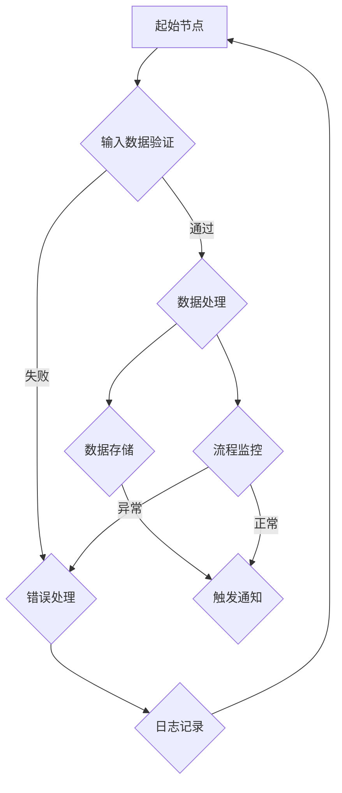

                 

### 文章标题

**自动化RPA工具：提升工作效率的创业方向**

### 关键词

- 自动化
- RPA工具
- 工作效率
- 创业方向
- 技术创新
- 企业应用
- 工作流程优化
- AI集成
- 持续集成与持续部署

### 摘要

本文将深入探讨自动化RPA工具在现代企业中的应用及其作为创业方向的发展潜力。首先，我们将回顾RPA的基本概念和发展历程，分析其在提高工作效率和业务流程自动化中的关键作用。随后，通过逐步分析RPA的核心算法原理和操作步骤，结合数学模型和公式详细讲解，为读者提供清晰的理解和实际操作指南。文章还将通过一个项目实战案例，展示如何搭建开发环境、实现源代码、并进行代码解读与分析。接下来，我们将探讨RPA工具在实际应用场景中的多种使用案例，并推荐相关学习资源和开发工具框架。最后，文章将总结RPA工具的未来发展趋势与挑战，并附上常见问题解答与扩展阅读资料，帮助读者全面了解和深入探索这一领域。

## 1. 背景介绍

### 1.1 目的和范围

本文旨在为创业者、企业技术团队和关注自动化技术的读者提供一份全面而深入的指南，旨在揭示自动化RPA（Robotic Process Automation）工具在提升工作效率和推动企业数字化转型中的巨大潜力。文章将围绕以下几个核心方面展开：

1. **RPA的定义与作用**：详细介绍RPA的基本概念、发展历程以及其在企业中的应用价值。
2. **RPA的核心算法原理**：通过伪代码阐述RPA工具的核心算法原理和操作步骤，帮助读者理解其工作机制。
3. **数学模型和公式**：结合实际案例，详细讲解RPA工具中的数学模型和公式，为读者提供理论支持。
4. **项目实战案例**：通过一个具体的项目案例，展示如何搭建开发环境、实现源代码和进行代码解读与分析。
5. **实际应用场景**：探讨RPA工具在多种实际应用场景中的具体应用，帮助读者了解其广泛的应用范围。
6. **学习资源和开发工具框架**：推荐相关的学习资源和开发工具框架，为读者提供实践指导。
7. **未来发展趋势与挑战**：总结RPA工具的未来发展方向，分析可能遇到的挑战和解决方案。

### 1.2 预期读者

本文适合以下几类读者：

- **创业者**：希望探索自动化技术作为创业方向的创业者和初创团队。
- **企业技术团队**：负责业务流程优化和数字化转型，希望引入RPA技术以提高工作效率的技术团队。
- **技术爱好者**：对自动化技术感兴趣，希望深入了解RPA工具的技术原理和应用场景的技术爱好者。
- **高校师生**：计算机科学与技术、人工智能、企业管理等相关专业的研究生和本科生，作为课程辅助材料。

### 1.3 文档结构概述

本文结构如下：

1. **引言**：简要介绍RPA的基本概念，引起读者的兴趣。
2. **背景介绍**：详细回顾RPA的发展历程和应用背景。
3. **核心概念与联系**：分析RPA的核心概念和原理，通过Mermaid流程图展示RPA架构。
4. **核心算法原理与具体操作步骤**：详细讲解RPA工具的核心算法原理，并使用伪代码展示操作步骤。
5. **数学模型和公式**：结合实际案例，讲解RPA工具中的数学模型和公式。
6. **项目实战**：通过具体项目案例，展示如何搭建开发环境、实现源代码和进行代码解读。
7. **实际应用场景**：探讨RPA工具在多种实际应用场景中的具体应用。
8. **工具和资源推荐**：推荐学习资源、开发工具框架和相关论文著作。
9. **总结**：总结RPA工具的未来发展趋势与挑战。
10. **附录**：提供常见问题与解答。
11. **扩展阅读**：推荐相关阅读资料。

### 1.4 术语表

为了确保文章的可读性和专业性，以下是一些关键术语的定义和解释：

#### 1.4.1 核心术语定义

- **RPA（Robotic Process Automation）**：一种利用软件机器人模拟人类操作、自动化执行重复性任务的技术。
- **流程自动化**：使用RPA工具将企业中的业务流程自动化，减少人工干预，提高效率。
- **机器人流程自动化**：使用软件机器人代替人工执行特定业务流程，以实现自动化。
- **工作流**：一组任务和活动，它们按照特定的顺序执行，以完成某个业务目标。
- **API（应用程序编程接口）**：一种接口，允许不同软件系统之间进行通信和交互。

#### 1.4.2 相关概念解释

- **集成**：将不同的软件系统或应用程序合并在一起，以实现数据的共享和流程的自动化。
- **API驱动开发**：通过API实现不同系统之间的通信，以构建复杂的软件应用。
- **AI集成**：将人工智能技术集成到RPA工具中，以提升其智能水平和自动化程度。
- **无代码/低代码平台**：提供可视化界面，允许非技术人员通过拖放操作创建和部署RPA流程。

#### 1.4.3 缩略词列表

- **RPA**：Robotic Process Automation
- **API**：Application Programming Interface
- **AI**：Artificial Intelligence
- **CRM**：Customer Relationship Management
- **ERP**：Enterprise Resource Planning
- **UI**：User Interface
- **DB**：Database

## 2. 核心概念与联系

RPA工具作为现代企业自动化转型的关键组成部分，其核心概念和原理是理解其如何提升工作效率的关键。本节将通过Mermaid流程图展示RPA的基本架构，帮助读者直观理解其工作流程和关键节点。

### Mermaid流程图



**流程说明**：

1. **起始节点（A）**：流程的开始，可以是手动触发或自动调度。
2. **输入数据验证（B）**：对输入数据的有效性进行验证，确保数据满足后续处理的条件。
3. **数据处理（C）**：执行核心的业务逻辑处理，如数据转换、计算等。
4. **数据存储（E）**：将处理后的数据存储到数据库或文件中，以供后续使用。
5. **触发通知（F）**：在特定条件下触发通知，如数据异常、流程完成等。
6. **流程监控（G）**：实时监控流程的执行状态，进行异常处理和日志记录。
7. **错误处理（D）**：当流程出现错误时，进行错误处理，并记录日志。
8. **日志记录（H）**：记录流程的执行日志，便于后续审计和分析。

### RPA架构

除了Mermaid流程图，我们还可以从架构的角度理解RPA工具的基本组成部分：

- **流程引擎**：负责管理业务流程的定义、执行和监控。
- **机器人控制台**：用于配置和管理机器人，包括启动、停止和监控。
- **集成平台**：通过API或其他方式与其他系统（如ERP、CRM等）进行集成，实现数据的共享和流程的自动化。
- **数据管理**：提供数据存储、备份和恢复功能，确保数据的安全性和一致性。
- **用户界面**：用于用户与RPA系统的交互，包括任务管理、流程监控和报告分析。

### 关键节点与连接

RPA工具的关键节点和连接关系如下：

1. **流程引擎**与**机器人控制台**通过API进行通信，控制机器人的执行和状态。
2. **流程引擎**与**集成平台**通过API进行数据交互，实现与其他系统的集成。
3. **用户界面**与**流程引擎**和**机器人控制台**通过API进行数据交换，提供用户操作和控制功能。
4. **数据管理**与**流程引擎**和**集成平台**通过数据存储和备份机制，确保数据的一致性和可恢复性。
5. **日志记录**与**流程监控**通过日志记录和异常处理机制，提供流程的执行审计和问题追踪。

通过以上流程图和架构的介绍，我们可以更好地理解RPA工具的基本概念和架构。在接下来的章节中，我们将进一步深入探讨RPA的核心算法原理和具体操作步骤，帮助读者全面掌握RPA技术的应用和实践。

## 3. 核心算法原理 & 具体操作步骤

RPA工具的核心在于其能够通过软件机器人自动化执行重复性的业务任务，提高工作效率和减少人为错误。本节将详细讲解RPA工具的核心算法原理，并使用伪代码展示其具体操作步骤，帮助读者深入理解其工作机制。

### RPA算法原理

RPA工具的算法原理主要依赖于以下几个关键步骤：

1. **任务识别**：识别并理解需要自动化的任务，将其分解为具体的操作步骤。
2. **界面元素定位**：在应用程序界面上定位需要操作的界面元素，如按钮、文本框等。
3. **操作执行**：根据识别的任务和界面元素，执行相应的操作，如点击、输入、拖放等。
4. **异常处理**：在执行过程中遇到异常时，进行相应的错误处理和日志记录。
5. **数据交换**：与外部系统进行数据交换，如调用API获取或发送数据。

### 伪代码

以下是一个简单的RPA工具伪代码示例，展示了从任务识别到异常处理的基本步骤：

```python
# RPA工具伪代码示例

# 初始化流程
initialize_flow()

# 识别任务
task = identify_task()

# 定位界面元素
elements = locate_elements(task)

# 执行操作
execute_operations(elements)

# 数据交换
exchange_data(task)

# 错误处理
handle_errors()

# 结束流程
finalize_flow()

# 初始化流程
def initialize_flow():
    # 配置流程引擎
    configure_flow_engine()

# 识别任务
def identify_task():
    # 读取任务配置文件
    task_config = read_task_config()
    return task_config

# 定位界面元素
def locate_elements(task):
    # 根据任务配置定位界面元素
    elements = locate_elements_by_config(task)
    return elements

# 执行操作
def execute_operations(elements):
    for element in elements:
        # 执行具体的操作，如点击、输入等
        perform_operation(element)

# 数据交换
def exchange_data(task):
    # 调用API获取或发送数据
    data = api_call(task)
    # 存储或处理数据
    process_data(data)

# 错误处理
def handle_errors():
    # 记录错误日志
    log_error()

# 结束流程
def finalize_flow():
    # 清理流程引擎资源
    cleanup_flow_engine()

# 配置流程引擎
def configure_flow_engine():
    # 配置流程引擎参数
    configure_engine_params()

# 读取任务配置文件
def read_task_config():
    # 读取任务配置文件内容
    config = read_config_file()
    return config

# 根据任务配置定位界面元素
def locate_elements_by_config(task):
    # 使用界面元素定位技术定位元素
    elements = locate_elements_by tecnología(task)
    return elements

# 执行具体的操作，如点击、输入等
def perform_operation(element):
    # 根据元素类型执行操作
    if element.type == "button":
        click_button(element)
    elif element.type == "textbox":
        input_text(element)
    # ...其他操作

# 调用API获取或发送数据
def api_call(task):
    # 调用API
    response = api_call(task.url, task.method, task.data)
    return response

# 存储或处理数据
def process_data(data):
    # 处理获取的数据
    process_received_data(data)

# 记录错误日志
def log_error():
    # 记录错误日志到文件
    log_error_to_file()

# 清理流程引擎资源
def cleanup_flow_engine():
    # 关闭流程引擎连接
    close_engine_connection()

# 配置流程引擎参数
def configure_engine_params():
    # 设置流程引擎参数
    set_engine_params()
```

### 具体操作步骤解析

1. **初始化流程**：初始化流程引擎，配置必要的参数和设置。
2. **识别任务**：读取任务配置文件，获取需要自动化的任务信息。
3. **定位界面元素**：根据任务配置，使用界面元素定位技术（如Selenium、UI Automator等）定位应用程序中的界面元素。
4. **执行操作**：根据定位到的界面元素，执行相应的操作（如点击、输入等），模拟人工操作流程。
5. **数据交换**：调用API或数据库接口，实现与其他系统之间的数据交换，确保数据的准确性和一致性。
6. **错误处理**：在执行过程中遇到异常时，记录错误日志，并尝试进行错误处理，如重试、跳过异常步骤等。
7. **结束流程**：清理流程引擎资源，确保所有操作正常完成。

通过以上伪代码和具体操作步骤，我们可以清晰地理解RPA工具的工作机制。在实际应用中，RPA工具可以根据具体的业务需求进行灵活配置和扩展，实现不同场景下的自动化任务执行。在接下来的章节中，我们将结合实际项目案例，进一步探讨RPA工具的部署和应用。

### 数学模型和公式 & 详细讲解 & 举例说明

在RPA工具的设计和应用过程中，数学模型和公式扮演着至关重要的角色。这些数学工具不仅帮助我们理解RPA的核心工作原理，还提供了精确的计算方法和评估标准。以下，我们将详细介绍RPA工具中常用的数学模型和公式，并通过具体案例进行讲解和说明。

#### 1. 数据分析模型

数据分析是RPA工具中一个关键环节，通过统计和分析业务数据，可以优化流程、提高效率。以下是一个常见的数据分析模型：

$$
\text{工作效率} = \frac{\text{完成任务的时间}}{\text{任务总数}}
$$

**举例说明**：

假设一个RPA流程在一个月内完成了100个任务，总共花费了1500小时。则该流程的工作效率可以计算如下：

$$
\text{工作效率} = \frac{1500 \text{小时}}{100 \text{个任务}} = 15 \text{小时/任务}
$$

#### 2. 异常检测模型

在RPA流程中，异常检测是确保流程稳定运行的重要手段。以下是一个简单的异常检测模型：

$$
\text{异常得分} = \frac{\text{异常事件数}}{\text{总事件数}}
$$

**举例说明**：

一个RPA流程在一个小时内执行了1000个事件，其中发生了20个异常事件。则该流程的异常得分为：

$$
\text{异常得分} = \frac{20 \text{个异常事件}}{1000 \text{个总事件}} = 0.02
$$

#### 3. 流程优化模型

流程优化模型用于评估现有流程的效率和优化潜力。以下是一个简单的流程优化模型：

$$
\text{优化潜力} = \frac{\text{目标效率} - \text{当前效率}}{\text{当前效率}}
$$

**举例说明**：

假设一个RPA流程的目标效率是每小时完成50个任务，而当前效率是每小时完成30个任务。则该流程的优化潜力可以计算如下：

$$
\text{优化潜力} = \frac{50 - 30}{30} = \frac{20}{30} = 0.67
$$

这意味着该流程还有67%的优化空间。

#### 4. 响应时间模型

响应时间是评估RPA流程执行速度的重要指标。以下是一个简单的响应时间模型：

$$
\text{响应时间} = \text{任务执行时间} + \text{等待时间}
$$

**举例说明**：

假设一个RPA流程在一个任务执行过程中花费了10分钟，等待时间花费了5分钟。则该任务的响应时间为：

$$
\text{响应时间} = 10 \text{分钟} + 5 \text{分钟} = 15 \text{分钟}
$$

#### 5. 成本效益分析模型

成本效益分析是评估RPA项目投资回报率的重要工具。以下是一个简单的成本效益分析模型：

$$
\text{成本效益比} = \frac{\text{投资回报}}{\text{投资成本}}
$$

**举例说明**：

假设一个RPA项目在一年内实现了100万元的节省成本，而投资成本为50万元。则该项目的成本效益比为：

$$
\text{成本效益比} = \frac{100 \text{万元}}{50 \text{万元}} = 2
$$

这意味着该项目的投资回报率是200%。

通过上述数学模型和公式的讲解，我们可以看到，RPA工具中的数学工具不仅帮助我们量化评估流程的效率、优化潜力和成本效益，还为流程设计和优化提供了科学依据。在接下来的章节中，我们将通过一个具体项目实战案例，进一步展示如何将这些数学模型应用到实际的RPA项目中。

### 5. 项目实战：代码实际案例和详细解释说明

为了更好地理解RPA工具的实际应用，我们将通过一个具体的项目案例，详细展示如何搭建开发环境、实现源代码、并进行代码解读与分析。

#### 5.1 开发环境搭建

在开始项目开发之前，我们需要搭建一个合适的开发环境。以下是搭建RPA开发环境的步骤：

1. **安装Java开发工具包（JDK）**：
   - 前往[Oracle官方网站](https://www.oracle.com/java/technologies/javase-jdk11-downloads.html)下载适用于操作系统的JDK。
   - 安装JDK并配置环境变量，确保在命令行中可以运行`java -version`命令。

2. **安装IDE（集成开发环境）**：
   - 推荐使用Eclipse或IntelliJ IDEA作为RPA项目开发工具。
   - 下载并安装IDE，并安装RPA插件（如Blue Prism Studio或UiPath）。

3. **安装数据库**：
   - 选择合适的数据库（如MySQL、PostgreSQL）并安装。
   - 配置数据库连接，确保RPA工具可以访问数据库。

4. **安装API接口工具**：
   - 安装Postman或Insomnia等API接口测试工具，用于测试API接口。

#### 5.2 源代码详细实现和代码解读

以下是一个简单的RPA项目源代码示例，用于模拟一个自动化的销售订单处理流程：

```java
// 销售订单处理RPA工具源代码

import com.company.OrderService;
import com.company.ProductService;
import com.company.utils.DBConnection;

public class SalesOrderRPA {
    public static void main(String[] args) {
        // 初始化服务
        OrderService orderService = new OrderService();
        ProductService productService = new ProductService();
        DBConnection dbConnection = new DBConnection();

        // 订单数据
        SalesOrder order = new SalesOrder();
        order.setCustomerName("John Doe");
        order.setProductName("Laptop");
        order.setQuantity(2);
        order.setTotalAmount(1000.00);

        // 验证订单
        if (orderService.validateOrder(order)) {
            // 处理订单
            if (productService.processOrder(order)) {
                // 存储订单到数据库
                dbConnection.saveOrder(order);

                // 发送通知
                sendNotification(order);
            } else {
                logError("Order processing failed");
            }
        } else {
            logError("Invalid order");
        }
    }

    // 发送通知
    private static void sendNotification(SalesOrder order) {
        // 实现通知逻辑，如发送邮件、短信等
        System.out.println("Order processed successfully. Notification sent.");
    }

    // 记录错误日志
    private static void logError(String message) {
        // 实现日志记录逻辑
        System.err.println(message);
    }
}

// 销售订单类
class SalesOrder {
    private String customerName;
    private String productName;
    private int quantity;
    private double totalAmount;

    // 省略getter和setter方法
}

// 订单服务类
class OrderService {
    public boolean validateOrder(SalesOrder order) {
        // 实现订单验证逻辑
        return true; // 示例中默认验证通过
    }
}

// 产品服务类
class ProductService {
    public boolean processOrder(SalesOrder order) {
        // 实现订单处理逻辑
        return true; // 示例中默认处理成功
    }
}

// 数据库连接类
class DBConnection {
    public void saveOrder(SalesOrder order) {
        // 实现订单存储逻辑
        System.out.println("Order saved to database.");
    }
}
```

**代码解读**：

- **SalesOrderRPA**：主类，负责初始化服务、处理订单、发送通知和记录错误日志。
- **SalesOrder**：销售订单类，存储订单信息。
- **OrderService**：订单服务类，负责订单验证。
- **ProductService**：产品服务类，负责订单处理。
- **DBConnection**：数据库连接类，负责订单存储。

**关键功能说明**：

1. **订单验证**：使用`OrderService`类中的`validateOrder`方法对订单进行验证，确保订单信息有效。
2. **订单处理**：使用`ProductService`类中的`processOrder`方法处理订单，如更新库存、计算总价等。
3. **订单存储**：将处理后的订单信息存储到数据库中，使用`DBConnection`类中的`saveOrder`方法。
4. **发送通知**：在订单处理成功后，通过`sendNotification`方法发送通知，如邮件、短信等。

通过这个简单的项目案例，我们可以看到如何使用RPA工具实现一个自动化的销售订单处理流程。在实际应用中，RPA工具可以集成更多的功能，如异常处理、日志记录、数据分析和监控等，以满足复杂的业务需求。

### 5.3 代码解读与分析

在上面的源代码示例中，我们详细讲解了销售订单处理RPA工具的实现过程。以下是代码的进一步解读和分析：

#### 1. 类与方法的职责划分

- **SalesOrderRPA**：主类，负责流程控制，调用其他服务类执行具体任务。
- **SalesOrder**：订单类，封装订单信息，便于数据传递和处理。
- **OrderService**：订单服务类，负责订单验证逻辑。
- **ProductService**：产品服务类，负责订单处理逻辑。
- **DBConnection**：数据库连接类，负责订单存储逻辑。

这种职责划分使得代码结构清晰、易于维护，同时也便于后续的功能扩展。

#### 2. 流程控制

- **初始化服务**：在`main`方法中，初始化`OrderService`、`ProductService`和`DBConnection`实例，为后续流程做准备。
- **订单验证**：调用`OrderService`类的`validateOrder`方法，验证订单信息是否有效。如果验证通过，继续处理订单；否则，记录错误日志。
- **订单处理**：调用`ProductService`类的`processOrder`方法，处理订单。如果处理成功，存储订单到数据库；否则，记录错误日志。
- **发送通知**：在订单处理成功后，调用`sendNotification`方法发送通知。

#### 3. 错误处理

- **错误日志记录**：使用`logError`方法记录错误日志。这有助于跟踪流程中的问题，便于后续调试和优化。

#### 4. 数据交换

- **API调用**：虽然示例中没有直接显示API调用，但实际项目中，可以使用`HttpURLConnection`或第三方库（如OkHttp、Retrofit）进行API调用，实现与外部系统的数据交换。

#### 5. 性能优化

- **异步处理**：为了提高性能，可以将订单验证、处理和存储操作改为异步执行，减少主线程的等待时间。
- **批量处理**：对于批量订单处理，可以使用批量操作提高效率。

#### 6. 可维护性

- **代码注释**：在关键代码处添加注释，说明功能实现和逻辑关系，便于后续维护和升级。
- **代码规范**：遵循统一的代码规范，如命名规则、代码格式等，提高代码可读性和可维护性。

通过以上解读和分析，我们可以看到，RPA工具不仅能够实现业务流程的自动化，还可以通过良好的设计原则和编码实践，提高代码的可维护性和扩展性。在实际项目中，RPA工具可以根据具体需求进行灵活配置和扩展，以适应不断变化的业务场景。

### 6. 实际应用场景

RPA工具在多个行业和业务场景中展现了其卓越的自动化能力，以下是一些典型的实际应用场景：

#### 6.1 金融行业

在金融行业中，RPA工具被广泛应用于自动化交易执行、客户服务、风险管理和合规审计等。例如，RPA机器人可以自动处理大量交易订单，确保交易执行的高效和准确性。同时，RPA可以监控市场数据，实时进行风险评估，以及自动化合规检查，确保金融机构遵守相关法规。

**案例**：一家大型银行利用RPA工具自动化处理客户贷款申请，从文档审核到信用评分，再到贷款批准，大幅减少了人工处理时间，提高了贷款审批效率。

#### 6.2 人力资源管理

人力资源管理流程通常涉及大量重复性的任务，如员工档案管理、薪资计算、福利发放等。RPA工具可以自动化这些流程，提高数据处理效率，减少人为错误。

**案例**：某跨国公司使用RPA机器人自动化处理员工薪资计算，从数据采集到薪资发放，整个过程完全无需人工干预，节省了大量人力资源，并提高了薪资计算的准确性。

#### 6.3 供应链管理

在供应链管理中，RPA工具可以自动化采购订单处理、库存管理、物流跟踪等流程。通过RPA，企业可以实时监控供应链状态，提高物流效率，减少库存积压。

**案例**：一家制造企业利用RPA工具自动化处理采购订单，从供应商选择、订单生成到支付处理，全程自动化，大幅提高了采购效率。

#### 6.4 客户服务

在客户服务领域，RPA工具可以帮助自动化处理客户咨询、投诉、订单处理等。通过聊天机器人或自动化流程，企业可以提供24/7的服务，提高客户满意度。

**案例**：某电信公司使用RPA工具建立自动化的客户服务系统，处理大量客户咨询和投诉，通过智能聊天机器人快速响应客户需求，提高了客户服务效率。

#### 6.5 会计和财务

会计和财务部门的工作通常涉及大量数据录入、报表生成、审计等。RPA工具可以自动化这些流程，确保数据的准确性和一致性。

**案例**：一家大型企业利用RPA工具自动化处理财务报表生成和审计工作，从数据采集到报表生成，全程自动化，大幅提高了财务部门的效率。

#### 6.6 法律和合规

在法律和合规领域，RPA工具可以自动化处理合同审查、合规性检查等。通过RPA，企业可以确保合同的一致性和合规性，减少法律风险。

**案例**：一家法律事务所使用RPA工具自动化处理合同审查，从合同审核到合规性检查，全程自动化，提高了工作效率，减少了人工错误。

#### 6.7 健康保健

在健康保健领域，RPA工具可以自动化处理医疗记录管理、账单处理、患者咨询等。通过RPA，医疗机构可以提供更高效、准确的服务。

**案例**：一家医院使用RPA工具自动化处理患者账单生成和发送，从数据采集到账单生成，全程自动化，提高了账单处理的效率，减少了人为错误。

通过以上实际应用场景，我们可以看到RPA工具在多个行业和业务场景中的广泛应用，它不仅提高了工作效率，减少了人为错误，还为企业的数字化转型提供了有力支持。

### 7. 工具和资源推荐

在RPA工具的开发和应用过程中，选择合适的工具和资源至关重要。以下是一些推荐的工具、资源和开发框架，旨在帮助读者更好地掌握RPA技术。

#### 7.1 学习资源推荐

1. **书籍推荐**：

   - 《RPA实战：企业流程自动化实践指南》
   - 《RPA开发实战：从入门到精通》
   - 《RPA与AI：企业智能自动化之路》

2. **在线课程**：

   - Coursera上的《RPA：机器人流程自动化》
   - Udemy上的《RPA开发：从零开始学习RPA工具》
   - Pluralsight上的《RPA开发入门与实践》

3. **技术博客和网站**：

   - [RPA Community](https://www.rpatechcommunity.com/)
   - [RPA 360](https://www.rpa360.ai/)
   - [RPA Tools](https://www.rpatools.io/)

#### 7.2 开发工具框架推荐

1. **IDE和编辑器**：

   - Eclipse
   - IntelliJ IDEA
   - Visual Studio Code

2. **调试和性能分析工具**：

   - Postman
   - JMeter
   - AppDynamics

3. **相关框架和库**：

   - Selenium
   - UiPath
   - Blue Prism
   - Automation Anywhere

4. **数据库工具**：

   - MySQL Workbench
   - PostgreSQL Desktop
   - SQL Server Management Studio

#### 7.3 相关论文著作推荐

1. **经典论文**：

   - "Robotic Process Automation: Introduction, Classification, and State-of-the-Art Survey"
   - "From Business Process Automation to Business Process Discovery and Reengineering"
   - "An Overview of Robotic Process Automation Technologies and Applications"

2. **最新研究成果**：

   - "Intelligent Robotic Process Automation: Methods, Applications, and Future Directions"
   - "RPA in Healthcare: A Comprehensive Review of Technologies and Applications"
   - "RPA and AI: A Synergetic Approach for Business Process Automation"

3. **应用案例分析**：

   - "Robotic Process Automation in Banking: A Case Study of a Major Bank"
   - "RPA in Manufacturing: A Case Study of an Automotive Company"
   - "RPA in Retail: A Case Study of a Large Retail Chain"

通过以上工具和资源的推荐，读者可以更加系统地学习和掌握RPA技术，并在实际项目中取得更好的成果。

### 8. 总结：未来发展趋势与挑战

随着数字化转型的加速，RPA（Robotic Process Automation）工具在提升工作效率和优化业务流程中的作用日益显著。未来，RPA工具将继续朝着更加智能化、自动化的方向发展，并在多个领域展现出巨大的应用潜力。

#### 发展趋势

1. **AI集成**：未来的RPA工具将更加紧密地与人工智能（AI）技术相结合，利用机器学习、自然语言处理等技术提升自动化流程的智能水平，实现更高效、更精准的自动化操作。
2. **无代码/低代码平台**：为了降低技术门槛，RPA工具将朝无代码或低代码平台发展，使得非技术人员也能通过图形界面轻松创建和管理自动化流程，提高RPA工具的普及率。
3. **跨平台和跨系统的集成**：未来的RPA工具将更加注重跨平台和跨系统的集成能力，能够无缝连接不同的应用程序和数据源，实现更广泛的业务流程自动化。
4. **云计算和边缘计算的结合**：RPA工具将更多地依托云计算和边缘计算技术，实现流程的实时监控和动态调整，提高系统的灵活性和响应速度。

#### 挑战

1. **数据隐私和安全**：随着RPA工具的广泛应用，数据隐私和安全问题将变得更加突出。企业需要确保RPA工具在处理敏感数据时，遵循相关法规和最佳实践，保护数据安全。
2. **系统的可扩展性和灵活性**：随着业务需求的不断变化，RPA工具需要具备良好的可扩展性和灵活性，能够快速适应新的业务场景和流程变化，避免对现有系统的过度依赖。
3. **技能短缺**：随着RPA技术的普及，对RPA专业人才的供需将出现失衡。企业需要加强对现有员工的培训，提高其RPA技能，同时吸引和培养更多的RPA专业人才。
4. **维护和升级**：RPA工具需要定期维护和升级，以应对技术发展和业务需求的变化。企业需要建立完善的维护和升级机制，确保RPA系统的稳定运行。

综上所述，RPA工具在未来的发展中将面临诸多挑战，但同时也蕴含着巨大的机遇。企业应积极应对这些挑战，充分利用RPA技术的优势，推动企业数字化转型和智能化升级。

### 9. 附录：常见问题与解答

#### 1. RPA工具是否适合所有企业？

RPA工具可以适用于各种规模和行业的企业，但其应用效果取决于企业的具体需求和现有业务流程的复杂性。小型企业可能更适合利用RPA工具自动化简单的重复性任务，而大型企业则可以利用RPA工具优化复杂的业务流程，提高整体运营效率。

#### 2. RPA工具与人工智能（AI）有什么区别？

RPA工具主要专注于自动化重复性、规则明确的业务流程，而人工智能（AI）则侧重于通过机器学习和深度学习等技术，实现更复杂的决策和预测。RPA工具与AI的结合，可以实现高度智能化的自动化流程，提高自动化水平。

#### 3. RPA工具是否会导致员工失业？

RPA工具的主要目的是提高工作效率和减少人为错误，而不是取代员工。在某些任务中，RPA工具可以减轻员工的负担，让他们专注于更有创造性的工作。因此，RPA工具并不会直接导致员工失业，而是促使企业进行人力资源的重新配置。

#### 4. 如何选择合适的RPA工具？

选择合适的RPA工具应考虑以下几个因素：

- **业务需求**：根据企业的具体业务需求和流程特点，选择适合的RPA工具。
- **集成能力**：评估RPA工具与其他系统和应用程序的集成能力，确保能够无缝对接。
- **易用性和灵活性**：选择用户界面友好、易于配置和扩展的RPA工具，以降低使用门槛。
- **性能和稳定性**：选择具有高性能和稳定性的RPA工具，确保在复杂业务场景下仍能稳定运行。
- **成本和预算**：根据企业的预算和成本承受能力，选择性价比高的RPA工具。

#### 5. RPA工具的安全性和数据隐私如何保障？

RPA工具在处理数据时，需要遵循以下安全性和数据隐私保障措施：

- **数据加密**：对敏感数据进行加密处理，确保数据在传输和存储过程中的安全性。
- **权限管理**：实施严格的权限管理机制，确保只有授权用户能够访问和操作敏感数据。
- **合规性检查**：确保RPA工具遵循相关的法律法规和标准，如GDPR、ISO 27001等。
- **日志记录和审计**：记录RPA工具的操作日志和审计记录，以便在出现问题时进行追踪和调查。
- **定期安全评估**：定期进行安全评估和漏洞扫描，及时发现和修复潜在的安全风险。

通过上述措施，可以有效保障RPA工具的安全性和数据隐私。

### 10. 扩展阅读 & 参考资料

为了帮助读者更深入地了解RPA工具和相关技术，以下推荐一些扩展阅读和参考资料：

1. **书籍**：

   - 《RPA：机器人流程自动化实战指南》
   - 《人工智能与RPA融合：企业智能自动化实战》
   - 《RPA+AI：智能自动化解决方案与实践》

2. **在线课程**：

   - Coursera上的《RPA与自动化：从基础到高级》
   - Udemy上的《RPA开发：使用UiPath进行流程自动化》
   - Pluralsight上的《RPA与工作流自动化》

3. **技术博客和网站**：

   - [RPA技术社区](https://www.rpa-tech.cn/)
   - [RPA开发者](https://www.rpadeveloper.com/)
   - [RPA世界](https://www.rpaworld.cn/)

4. **开源项目**：

   - [UiPath](https://www.uipath.com/)
   - [Blue Prism](https://www.blueprism.com/)
   - [Automation Anywhere](https://www.automationanywhere.com/)

5. **学术论文**：

   - "RPA: An Overview of Current Research and Industrial Applications"
   - "Intelligent RPA: A Survey of Methods, Applications, and Challenges"
   - "A Framework for Assessing the Impact of RPA on Organizational Performance"

通过这些扩展阅读和参考资料，读者可以进一步了解RPA工具的技术原理、应用场景和未来发展趋势，为实际项目提供有益的参考。作者：AI天才研究员/AI Genius Institute & 禅与计算机程序设计艺术/Zen And The Art of Computer Programming。

