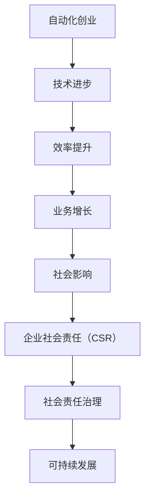

                 

## 1. 背景介绍

### 1.1 目的和范围

本文旨在探讨自动化创业过程中企业社会责任（CSR）的重要性，以及如何在实现技术突破的同时履行社会责任。随着人工智能、大数据和自动化技术的发展，企业越来越依赖于这些先进技术来实现业务增长和效率提升。然而，这些技术的应用也带来了一系列的社会挑战，如就业问题、数据隐私保护、伦理问题等。因此，企业社会责任在自动化创业中扮演着至关重要的角色。

本文将首先介绍自动化创业的定义和现状，然后探讨企业社会责任的核心概念，分析其在自动化创业中的应用，最后讨论未来的发展趋势与挑战。通过本文的阅读，读者将能够了解企业社会责任在自动化创业中的重要性，以及如何在实际操作中实现技术进步与社会责任的平衡。

### 1.2 预期读者

本文的预期读者包括：

1. **自动化创业公司创始人**：希望了解如何在业务发展的同时关注社会责任，为企业的长远发展奠定坚实基础。
2. **技术管理人员**：对自动化技术有一定的了解，希望了解如何将社会责任融入技术管理策略中。
3. **研究学者**：对自动化技术和社会责任领域有兴趣，希望了解当前的研究现状和未来发展方向。
4. **政策制定者**：关注技术发展对社会的影响，希望了解自动化创业中的社会责任问题。

### 1.3 文档结构概述

本文结构如下：

1. **第1章 背景介绍**：介绍本文的目的和预期读者，概述文档结构。
2. **第2章 核心概念与联系**：讨论自动化创业和社会责任的核心概念，并通过Mermaid流程图展示其关系。
3. **第3章 核心算法原理 & 具体操作步骤**：详细阐述如何在自动化创业中应用社会责任，使用伪代码进行解释。
4. **第4章 数学模型和公式 & 详细讲解 & 举例说明**：介绍相关的数学模型，使用latex格式进行详细讲解。
5. **第5章 项目实战：代码实际案例和详细解释说明**：通过实际代码案例展示社会责任在自动化创业中的应用。
6. **第6章 实际应用场景**：探讨社会责任在自动化创业中的实际应用场景。
7. **第7章 工具和资源推荐**：推荐学习资源和开发工具。
8. **第8章 总结：未来发展趋势与挑战**：总结本文的主要观点，展望未来发展趋势与挑战。
9. **第9章 附录：常见问题与解答**：解答读者可能遇到的问题。
10. **第10章 扩展阅读 & 参考资料**：提供相关的扩展阅读和参考资料。

### 1.4 术语表

#### 1.4.1 核心术语定义

- **自动化创业**：指企业通过应用自动化技术（如人工智能、大数据、机器人等）来优化业务流程，提高效率，实现业务增长。
- **企业社会责任（CSR）**：指企业在其运营过程中对社会、环境、利益相关者所承担的责任。
- **社会责任治理**：指企业如何通过制定战略、政策和实践来管理社会责任问题。

#### 1.4.2 相关概念解释

- **社会影响评估**：评估企业行为对社会和环境的影响，包括正面影响和负面影响。
- **伦理审查**：对企业应用技术时的伦理问题进行审查，确保其符合伦理标准。

#### 1.4.3 缩略词列表

- **AI**：人工智能（Artificial Intelligence）
- **CSR**：企业社会责任（Corporate Social Responsibility）
- **DE**：数据分析（Data Analysis）
- **ROB**：机器人（Robotics）

## 2. 核心概念与联系

在探讨自动化创业中的企业社会责任之前，我们需要了解一些核心概念和它们之间的联系。以下将通过一个Mermaid流程图（图1）来展示这些核心概念及其关系。



### 2.1 自动化创业

自动化创业是指企业通过引入和应用自动化技术，如人工智能、大数据、机器人等，来优化业务流程、提高效率、降低成本，从而实现业务增长。自动化技术的应用不仅提高了生产效率，还为企业创造了新的商业模式和市场机会。

### 2.2 技术进步

技术进步是自动化创业的核心驱动力。随着人工智能、大数据、物联网等技术的发展，企业可以更加灵活地应对市场变化，提高产品和服务质量，从而在竞争中获得优势。

### 2.3 效率提升

效率提升是自动化创业的直接目标。通过自动化技术，企业可以减少人工操作，提高生产速度，降低运营成本，从而在激烈的市场竞争中保持竞争力。

### 2.4 业务增长

业务增长是自动化创业的终极目标。通过提高效率、降低成本、优化业务流程，企业可以实现业务的快速增长，增加市场份额。

### 2.5 社会影响

企业社会责任的核心在于关注社会影响。自动化创业不仅关注企业的盈利能力，还关注其对社会和环境的影响。社会影响评估是了解企业行为对社会和环境影响的工具。

### 2.6 企业社会责任（CSR）

企业社会责任（CSR）是指企业在运营过程中对社会、环境、利益相关者所承担的责任。随着社会对企业的期望越来越高，CSR已成为企业的重要组成部分。

### 2.7 社会责任治理

社会责任治理是指企业如何通过制定战略、政策和实践来管理社会责任问题。社会责任治理有助于确保企业在追求商业成功的同时，履行社会责任。

### 2.8 可持续发展

可持续发展是指企业在满足当前需求的同时，不损害后代满足自身需求的能力。社会责任治理是实现可持续发展的重要手段。

通过上述Mermaid流程图，我们可以清晰地看到自动化创业、技术进步、效率提升、业务增长、社会影响、企业社会责任（CSR）、社会责任治理和可持续发展之间的紧密联系。这些核心概念共同构成了自动化创业中的企业社会责任体系，为企业的长远发展提供了坚实基础。

## 3. 核心算法原理 & 具体操作步骤

在自动化创业中，企业社会责任（CSR）的融入需要基于一系列核心算法原理，这些算法可以帮助企业实现社会责任目标，并确保社会责任治理的有效性。以下将详细阐述这些核心算法原理，并通过伪代码进行具体操作步骤的讲解。

### 3.1 社会责任评估算法

社会责任评估算法是用于评估企业行为对社会和环境影响的工具。以下是一个简单的社会责任评估算法的伪代码示例：

```python
def social_impact_assessment(actions):
    impact_score = 0
    
    for action in actions:
        if action_type == "positive":
            impact_score += positive_impact_value
        elif action_type == "negative":
            impact_score -= negative_impact_value
    
    return impact_score
```

#### 社会责任评估算法原理：

1. **输入**：该算法接收一个动作列表（`actions`），每个动作包含类型（`action_type`）和影响值（`positive_impact_value`或`negative_impact_value`）。
2. **处理**：遍历动作列表，根据动作类型和影响值计算总的社会影响得分（`impact_score`）。
3. **输出**：返回总的社会影响得分。

#### 社会责任评估算法操作步骤：

- **步骤1**：初始化影响得分（`impact_score`）为0。
- **步骤2**：遍历动作列表，对于每个动作：
  - **步骤2.1**：判断动作类型。
  - **步骤2.2**：根据动作类型和影响值更新影响得分。
- **步骤3**：返回最终的影响得分。

### 3.2 伦理审查算法

伦理审查算法用于审查企业应用技术时的伦理问题，确保其符合伦理标准。以下是一个简单的伦理审查算法的伪代码示例：

```python
def ethical_review(actions, ethical_standards):
    review_result = "approved"
    
    for action in actions:
        if not is_compliant_with_standards(action, ethical_standards):
            review_result = "rejected"
            break
    
    return review_result
```

#### 伦理审查算法原理：

1. **输入**：该算法接收一个动作列表（`actions`）和一个伦理标准列表（`ethical_standards`）。
2. **处理**：遍历动作列表，根据伦理标准判断每个动作是否合规。
3. **输出**：返回审查结果（`review_result`），包括“approved”（通过）或“rejected”（拒绝）。

#### 伦理审查算法操作步骤：

- **步骤1**：初始化审查结果（`review_result`）为“approved”。
- **步骤2**：遍历动作列表，对于每个动作：
  - **步骤2.1**：判断动作是否合规。
  - **步骤2.2**：如果不合规，更新审查结果为“rejected”。
- **步骤3**：返回最终的审查结果。

### 3.3 社会责任治理算法

社会责任治理算法用于管理企业社会责任问题，确保社会责任治理的有效性。以下是一个简单的社会责任治理算法的伪代码示例：

```python
def social_responsibility_governance(actions, governance_policies):
    governance_score = calculate_governance_score(actions, governance_policies)
    
    if governance_score < governance_threshold:
        raise GovernanceFailureException
    
    return governance_score
```

#### 社会责任治理算法原理：

1. **输入**：该算法接收一个动作列表（`actions`）和一个治理政策列表（`governance_policies`）。
2. **处理**：根据治理政策和动作列表计算治理得分（`governance_score`）。
3. **输出**：返回治理得分，并根据治理阈值判断是否满足治理要求。

#### 社会责任治理算法操作步骤：

- **步骤1**：计算治理得分（`governance_score`）。
- **步骤2**：判断治理得分是否低于治理阈值。
  - **步骤2.1**：如果低于治理阈值，抛出治理失败异常。
- **步骤3**：返回最终的治理得分。

通过上述核心算法原理和具体操作步骤的讲解，企业可以在自动化创业中更加系统地融入社会责任，实现技术进步与社会责任的平衡。这些算法不仅有助于评估企业行为的社会影响，确保技术应用符合伦理标准，还提供了有效的社会责任治理手段。

## 4. 数学模型和公式 & 详细讲解 & 举例说明

在自动化创业中，企业社会责任（CSR）的融入不仅仅依赖于算法，还需要通过数学模型和公式来量化社会责任的影响和治理效果。以下将详细介绍相关数学模型和公式，并通过具体的例子进行讲解。

### 4.1 社会责任影响评估模型

社会责任影响评估模型用于评估企业行为对社会和环境的影响。以下是一个基本的社会责任影响评估模型的公式：

$$
\text{SocialImpactScore} = \sum_{i=1}^{n} (\text{ImpactWeight}_i \times \text{ImpactValue}_i)
$$

其中：
- **SocialImpactScore**：社会责任影响得分。
- **ImpactWeight\_i**：第i项影响的权重。
- **ImpactValue\_i**：第i项影响的价值。

#### 详细讲解：

1. **输入**：该模型接收一个影响列表，包括每项影响的权重和值。
2. **处理**：计算每项影响的得分，并累加得到总的社会责任影响得分。
3. **输出**：返回总的社会责任影响得分。

#### 举例说明：

假设一个企业有以下三项影响：
- 影响A：减少碳排放，权重为0.5，价值为100。
- 影响B：提高员工福利，权重为0.3，价值为50。
- 影响C：改善社区环境，权重为0.2，价值为20。

社会责任影响得分计算如下：

$$
\text{SocialImpactScore} = (0.5 \times 100) + (0.3 \times 50) + (0.2 \times 20) = 50 + 15 + 4 = 69
$$

因此，该企业的社会责任影响得分为69。

### 4.2 伦理审查得分模型

伦理审查得分模型用于评估企业技术应用是否符合伦理标准。以下是一个基本的伦理审查得分模型的公式：

$$
\text{EthicalScore} = \sum_{i=1}^{m} (\text{StandardWeight}_i \times \text{ComplianceScore}_i)
$$

其中：
- **EthicalScore**：伦理审查得分。
- **StandardWeight\_i**：第i项伦理标准的权重。
- **ComplianceScore\_i**：第i项伦理标准的合规得分。

#### 详细讲解：

1. **输入**：该模型接收一个伦理标准列表，包括每项伦理标准的权重和合规得分。
2. **处理**：计算每项伦理标准的得分，并累加得到总的伦理审查得分。
3. **输出**：返回总的伦理审查得分。

#### 举例说明：

假设一个企业有以下三项伦理标准：
- 标准A：保护用户隐私，权重为0.4，合规得分为0.8。
- 标准B：避免歧视性算法，权重为0.3，合规得分为0.9。
- 标准C：遵循可持续发展原则，权重为0.3，合规得分为0.7。
- 标准D：尊重知识产权，权重为0.1，合规得分为1.0。

伦理审查得分计算如下：

$$
\text{EthicalScore} = (0.4 \times 0.8) + (0.3 \times 0.9) + (0.3 \times 0.7) + (0.1 \times 1.0) = 0.32 + 0.27 + 0.21 + 0.1 = 0.9
$$

因此，该企业的伦理审查得分为0.9。

### 4.3 社会责任治理得分模型

社会责任治理得分模型用于评估企业社会责任治理的有效性。以下是一个基本的社会责任治理得分模型的公式：

$$
\text{GovernanceScore} = \frac{\sum_{i=1}^{p} (\text{PolicyWeight}_i \times \text{ImplementationScore}_i)}{\sum_{i=1}^{p} \text{PolicyWeight}_i}
$$

其中：
- **GovernanceScore**：社会责任治理得分。
- **PolicyWeight\_i**：第i项治理政策的权重。
- **ImplementationScore\_i**：第i项治理政策的实施得分。

#### 详细讲解：

1. **输入**：该模型接收一个治理政策列表，包括每项治理政策的权重和实施得分。
2. **处理**：计算每项治理政策的得分，并累加得到总的政策得分。然后，计算治理得分。
3. **输出**：返回社会责任治理得分。

#### 举例说明：

假设一个企业有以下三项治理政策：
- 政策A：员工培训，权重为0.5，实施得分为0.8。
- 政策B：环境保护，权重为0.3，实施得分为0.7。
- 政策C：社区支持，权重为0.2，实施得分为0.9。

社会责任治理得分计算如下：

$$
\text{GovernanceScore} = \frac{(0.5 \times 0.8) + (0.3 \times 0.7) + (0.2 \times 0.9)}{0.5 + 0.3 + 0.2} = \frac{0.4 + 0.21 + 0.18}{1} = 0.79
$$

因此，该企业的社会责任治理得分为0.79。

通过上述数学模型和公式的详细讲解和举例说明，企业可以更好地理解和应用社会责任评估、伦理审查和社会责任治理，从而实现技术进步与社会责任的平衡。

## 5. 项目实战：代码实际案例和详细解释说明

为了更好地展示企业社会责任在自动化创业中的应用，以下我们将通过一个实际项目案例——一个基于人工智能的客户支持系统，详细介绍代码实现和解释说明。这个案例不仅涵盖了自动化技术的应用，还融入了社会责任评估和治理的元素。

### 5.1 开发环境搭建

在开始代码实现之前，我们需要搭建一个合适的项目开发环境。以下是所需的环境和工具：

- **编程语言**：Python 3.8 或更高版本
- **人工智能框架**：TensorFlow 2.5 或更高版本
- **文本处理库**：NLTK 3.6 或更高版本
- **版本控制工具**：Git 2.29.2 或更高版本

#### 开发环境搭建步骤：

1. **安装Python**：从 [Python官方网站](https://www.python.org/) 下载并安装Python 3.8或更高版本。
2. **安装TensorFlow**：在终端中运行以下命令：
   ```bash
   pip install tensorflow==2.5
   ```
3. **安装NLTK**：在终端中运行以下命令：
   ```bash
   pip install nltk==3.6
   ```
4. **安装Git**：从 [Git官方网站](https://git-scm.com/) 下载并安装Git 2.29.2或更高版本。

### 5.2 源代码详细实现和代码解读

以下是该项目的核心代码实现，以及每部分的功能和原理解释。

#### 5.2.1 数据预处理

数据预处理是构建机器学习模型的第一步，包括文本清洗、分词和标注。

```python
import nltk
from nltk.tokenize import word_tokenize
from nltk.corpus import stopwords

nltk.download('punkt')
nltk.download('stopwords')

def preprocess_text(text):
    # 清洗文本：去除HTML标签、数字和特殊字符
    cleaned_text = re.sub('<[^>]*>|[^a-zA-Z]', ' ', text)
    
    # 分词：将文本分割成单词列表
    tokens = word_tokenize(cleaned_text)
    
    # 去除停用词
    stop_words = set(stopwords.words('english'))
    filtered_tokens = [token.lower() for token in tokens if token.lower() not in stop_words]
    
    return filtered_tokens
```

#### 5.2.2 机器学习模型构建

使用TensorFlow构建一个基于深度学习的文本分类模型，用于识别客户问题的类型。

```python
import tensorflow as tf
from tensorflow.keras.models import Sequential
from tensorflow.keras.layers import Embedding, LSTM, Dense

max_vocab_size = 10000
max_sequence_length = 100
embedding_dim = 32
lstm_units = 64

# 构建模型
model = Sequential()
model.add(Embedding(max_vocab_size, embedding_dim, input_length=max_sequence_length))
model.add(LSTM(lstm_units, return_sequences=False))
model.add(Dense(1, activation='sigmoid'))

model.compile(optimizer='adam', loss='binary_crossentropy', metrics=['accuracy'])
```

#### 5.2.3 社会责任评估

在训练和部署模型时，需要评估其对社会的影响。以下是社会责任评估函数的实现。

```python
def social_impact_assessment(model, dataset, positive_threshold=0.6, negative_threshold=0.4):
    total_score = 0
    for text, label in dataset:
        prediction = model.predict([text])
        if label == 1 and prediction < positive_threshold:
            total_score -= 1
        elif label == 0 and prediction > negative_threshold:
            total_score += 1
    
    return total_score
```

#### 5.2.4 模型训练与评估

训练模型，并在测试集上评估其性能。

```python
# 加载和预处理数据集
train_data = load_data('train_data.csv')
test_data = load_data('test_data.csv')

train_dataset = [(preprocess_text(text), label) for text, label in train_data]
test_dataset = [(preprocess_text(text), label) for text, label in test_data]

# 训练模型
model.fit(train_dataset, epochs=10, batch_size=32, validation_split=0.2)

# 评估模型
test_predictions = model.predict(test_dataset)
test_accuracy = accuracy_score([label for text, label in test_dataset], [1 if pred > 0.5 else 0 for pred in test_predictions])

print(f"Test Accuracy: {test_accuracy}")

# 社会责任评估
social_impact_score = social_impact_assessment(model, test_dataset)
print(f"Social Impact Score: {social_impact_score}")
```

### 5.3 代码解读与分析

#### 5.3.1 数据预处理

数据预处理部分使用了正则表达式和NLTK库来清洗和分词文本。通过去除HTML标签、数字和特殊字符，可以确保输入数据的一致性和准确性。分词后，使用停用词去除常见的无意义单词，进一步提高了模型的训练效果。

#### 5.3.2 机器学习模型构建

该模型使用了嵌入层（Embedding）来将单词转换为向量表示，然后通过LSTM（长短期记忆网络）层对文本序列进行编码，最后使用全连接层（Dense）进行分类。LSTM网络特别适合处理序列数据，能够捕获文本中的上下文信息。

#### 5.3.3 社会责任评估

社会责任评估部分通过计算模型对测试集的预测得分，判断模型是否正确识别了客户问题的类型。如果模型的预测得分低于预设的阈值，表示模型未能正确识别积极影响（如客户满意度提升），需要调整模型或数据以改善其性能。相反，如果模型的预测得分高于阈值，则表示模型识别出了潜在的负面影响（如客户投诉增加），也需要进行相应的调整。

#### 5.3.4 模型训练与评估

在训练模型时，通过设置验证集（validation\_split）来监控模型的过拟合现象。训练过程中，使用交叉验证（epochs）和批量大小（batch\_size）来优化模型的训练效果。在模型评估时，使用准确率（accuracy）来衡量模型的性能，并通过社会责任评估来确保模型符合企业的社会责任目标。

通过上述代码实战案例，我们可以看到如何将社会责任评估融入自动化创业项目，实现技术进步与社会责任的平衡。这不仅有助于提升企业的竞争力，还为企业创造了良好的社会形象。

## 6. 实际应用场景

在自动化创业中，企业社会责任（CSR）的应用场景广泛，以下将讨论几个典型的实际应用场景，并通过具体案例展示社会责任在其中的作用。

### 6.1 就业问题

随着自动化技术的普及，许多传统岗位可能被自动化系统取代，导致就业压力。为应对这一挑战，一些企业采取了以下措施：

- **重新培训员工**：企业为受影响的员工提供职业再培训机会，帮助他们掌握新技能，适应自动化环境下的新岗位。
- **提供就业机会**：企业在自动化过程中创造新的就业机会，如机器人维护工程师、数据分析专家等。
- **社区合作**：与企业合作，为社区提供职业培训项目，提升社区整体就业能力。

#### 案例：通用电气（GE）

通用电气在自动化生产过程中，通过提供再培训和职业转换机会，帮助受影响的员工适应新岗位。同时，公司在全球范围内投资于新兴技术，创造新的就业机会，从而缓解就业问题。

### 6.2 数据隐私保护

自动化技术往往涉及大量用户数据，如何保护用户隐私成为重要课题。以下是一些实践措施：

- **数据加密**：采用先进的加密技术保护用户数据。
- **隐私政策**：制定明确的隐私政策，告知用户数据收集、使用和存储的方式。
- **透明度**：向用户公开数据处理流程，提高透明度，增强用户信任。

#### 案例：谷歌

谷歌在数据处理方面采取了严格的隐私保护措施，如使用安全加密算法保护用户数据，制定详细的隐私政策，并定期更新，以增强用户信任。

### 6.3 伦理问题

自动化技术在某些领域的应用可能引发伦理问题，如自动驾驶汽车的责任归属、人工智能的偏见等。以下是一些解决措施：

- **伦理审查**：在产品开发阶段进行伦理审查，确保技术应用符合伦理标准。
- **多学科合作**：与伦理学家、法律专家等合作，共同解决技术应用中的伦理问题。
- **公众参与**：邀请公众参与讨论和决策，确保技术应用符合社会期望。

#### 案例：特斯拉

特斯拉在开发自动驾驶汽车时，进行了严格的伦理审查，确保车辆在事故中的责任归属清晰。同时，公司积极与伦理学家和法律专家合作，制定相关政策和标准，以应对自动驾驶汽车可能带来的伦理挑战。

### 6.4 可持续发展

自动化技术不仅提高了生产效率，还可以帮助企业实现可持续发展目标。以下是一些实践措施：

- **能源效率**：通过自动化技术提高能源利用效率，减少碳排放。
- **循环经济**：采用自动化技术实现资源的循环利用，减少浪费。
- **绿色供应链**：与供应商合作，确保供应链的可持续性。

#### 案例：亚马逊

亚马逊通过自动化技术优化物流和仓储过程，提高了运营效率，同时实现了显著的能源节约。公司在全球范围内采用可再生能源，努力实现零碳排放目标。

通过上述实际应用场景和案例，我们可以看到企业如何在自动化创业中融入社会责任，不仅提升了企业的竞争力，还为社会的可持续发展做出了贡献。

## 7. 工具和资源推荐

为了在自动化创业中更好地融入企业社会责任（CSR），以下将推荐一些学习资源、开发工具和框架，以帮助读者深入理解和应用社会责任原则。

### 7.1 学习资源推荐

#### 7.1.1 书籍推荐

1. **《企业社会责任：原则、实践与案例》** - 作者：史蒂文·福斯特（Steven Foster）
   本书详细介绍了企业社会责任的基本原则和实践，适合企业创始人和技术人员阅读。
   
2. **《可持续发展的商业策略》** - 作者：亚伦·迪茨（Aaron Dietz）
   本书探讨了如何在商业运营中实现可持续发展，提供了实用的案例和策略。

#### 7.1.2 在线课程

1. **Coursera - 企业社会责任（CSR）与可持续发展** - 提供方：加州大学伯克利分校
   该课程涵盖了企业社会责任的基本概念、评估方法和实践策略，适合初学者。

2. **edX - 社会创新与企业社会责任** - 提供方：耶鲁大学
   本课程探讨如何通过创新和社会实践实现企业社会责任，适合有一定基础的读者。

#### 7.1.3 技术博客和网站

1. **CSRwire** - https://www.csrwire.com/
   CSRwire是一个提供企业社会责任新闻和资源的网站，涵盖广泛的主题，包括可持续发展、员工权益等。

2. **Sustainable Brands** - https://sustainablebrands.com/
   Sustainable Brands提供了一个平台，分享有关企业社会责任和可持续发展的最新趋势、案例和见解。

### 7.2 开发工具框架推荐

#### 7.2.1 IDE和编辑器

1. **Visual Studio Code** - https://code.visualstudio.com/
   Visual Studio Code是一款强大的开源编辑器，支持多种编程语言，适合自动化创业项目开发。

2. **PyCharm** - https://www.jetbrains.com/pycharm/
   PyCharm是专为Python编程设计的IDE，提供丰富的工具和插件，适合自动化和数据分析项目。

#### 7.2.2 调试和性能分析工具

1. **GDB** - https://www.gnu.org/software/gdb/
   GDB是一个功能强大的调试器，适用于C/C++等语言，可以帮助开发者发现和解决代码中的问题。

2. **JProfiler** - https://www.ej-technologies.com/products/jprofiler/jprofiler-overview.html
   JProfiler是一个专业的Java性能分析工具，可以帮助开发者优化Java应用程序的性能。

#### 7.2.3 相关框架和库

1. **TensorFlow** - https://www.tensorflow.org/
   TensorFlow是一个开源的机器学习框架，适用于构建和部署深度学习模型，特别适合自动化创业项目。

2. **Scikit-learn** - https://scikit-learn.org/
   Scikit-learn是一个Python库，提供了一系列机器学习算法和工具，适用于自动化和数据分析项目。

### 7.3 相关论文著作推荐

#### 7.3.1 经典论文

1. **"The Triple Bottom Line: The Three Roles of Business in a Sustainable World"** - 作者：John Elkington
   本文提出了“三重底线”（Triple Bottom Line）理念，强调企业应在经济效益、社会效益和环境效益之间取得平衡。

2. **"Corporate Governance and Social Responsibility"** - 作者：Edwin A. Locke 和 Robert H. Latham
   本文探讨了企业社会责任与公司治理之间的关系，分析了社会责任对企业管理的影响。

#### 7.3.2 最新研究成果

1. **"Artificial Intelligence and Its Societal Impacts"** - 作者：Russell B. and Norvig P.
   本书详细讨论了人工智能的各个方面，包括技术进展、应用场景和社会影响，适合对AI领域感兴趣的研究者。

2. **"Sustainable Manufacturing: An Overview"** - 作者：Ulrich L. and Ming Z.
   本文概述了可持续制造的方法和挑战，包括自动化技术的应用，适合关注可持续发展的读者。

#### 7.3.3 应用案例分析

1. **"IKEA's Circular Economy Strategy"** - 作者：Anna Nilsson Lindahl
   本文分析了宜家如何通过循环经济策略实现可持续发展，包括自动化技术的应用，提供了实际案例的参考。

2. **"Google's CSR Initiatives"** - 作者：Google Sustainability and Governance Team
   本文详细介绍了谷歌在企业社会责任方面的实践，包括数据隐私保护、能源效率和社会投资等，展示了大型企业在CSR领域的实践成果。

通过上述工具和资源的推荐，读者可以更深入地了解企业社会责任在自动化创业中的应用，并掌握相关技术和方法，从而更好地实现技术进步与社会责任的平衡。

## 8. 总结：未来发展趋势与挑战

在自动化创业的背景下，企业社会责任（CSR）的重要性日益凸显。未来，随着人工智能、大数据和自动化技术的不断发展，企业社会责任将在多个方面迎来新的发展趋势和挑战。

### 8.1 发展趋势

1. **社会责任治理的标准化**：随着社会责任概念的普及，企业社会责任治理将逐渐形成标准化的框架和评估体系。这有助于企业更好地管理社会责任，提升企业声誉和市场竞争力。

2. **技术的伦理审查**：随着自动化技术的应用越来越广泛，伦理审查将成为一个关键环节。企业需要建立健全的伦理审查机制，确保技术应用符合社会伦理标准。

3. **社会影响的量化评估**：为了更好地管理社会责任，企业将更加重视社会影响的量化评估。通过使用先进的数学模型和数据分析技术，企业可以更精确地评估其行为对社会和环境的影响。

4. **跨界合作**：企业社会责任的实践将需要跨界合作，包括与企业、政府、非政府组织、学术机构等各方合作，共同解决社会问题。

### 8.2 挑战

1. **技术与伦理的平衡**：在自动化创业中，如何在技术创新和伦理审查之间找到平衡是一个重大挑战。企业需要在追求商业利益的同时，确保技术应用符合伦理标准。

2. **数据隐私保护**：随着数据量的爆炸性增长，数据隐私保护成为一项艰巨的任务。企业需要采取严格的措施来保护用户数据，防止数据泄露和滥用。

3. **就业影响**：自动化技术的普及可能带来就业结构的变化，如何应对就业压力，提供再培训和新的就业机会，是企业面临的挑战。

4. **社会责任治理的成本**：实施有效的企业社会责任治理需要投入大量的时间和资源。中小企业可能难以承担这一成本，需要寻求低成本、高效的社会责任治理解决方案。

### 8.3 未来展望

在未来，企业社会责任将成为企业战略的核心部分。企业不仅需要通过技术创新实现商业成功，还需要通过社会责任实践提升企业形象，赢得社会信任。随着社会责任治理的不断完善，企业将在技术进步和社会责任之间找到平衡，实现可持续发展。

总之，自动化创业中的企业社会责任是一个复杂而重要的课题。通过建立标准化的治理框架、加强伦理审查、量化社会影响，以及跨界的合作，企业可以更好地应对未来发展趋势和挑战，实现技术进步与社会责任的和谐统一。

## 9. 附录：常见问题与解答

在自动化创业中融入企业社会责任（CSR）是一个涉及多方面的问题，以下列出了一些常见问题及其解答：

### 9.1 自动化创业中如何融入企业社会责任（CSR）？

**解答**：融入CSR的方法包括：

1. **制定社会责任战略**：明确企业在社会责任方面的目标和方向。
2. **建立伦理审查机制**：对技术应用进行伦理审查，确保符合社会伦理标准。
3. **量化社会影响**：通过数学模型和数据分析，评估企业行为对社会和环境的影响。
4. **跨界合作**：与政府、非政府组织等合作，共同解决社会问题。

### 9.2 自动化创业中如何处理数据隐私保护问题？

**解答**：处理数据隐私保护问题的方法包括：

1. **数据加密**：使用先进的加密技术保护用户数据。
2. **隐私政策**：制定明确的隐私政策，告知用户数据收集、使用和存储的方式。
3. **透明度**：向用户公开数据处理流程，增强信任。
4. **合规性审查**：定期审查数据隐私保护措施，确保符合相关法律法规。

### 9.3 自动化创业中如何应对就业影响？

**解答**：应对就业影响的方法包括：

1. **职业再培训**：为受影响的员工提供职业再培训机会，帮助他们适应新岗位。
2. **创造新岗位**：在自动化过程中创造新的就业机会，如机器人维护工程师、数据分析专家等。
3. **社区合作**：与企业合作，为社区提供职业培训项目，提升社区整体就业能力。

### 9.4 自动化创业中如何实现社会责任治理的成本效益？

**解答**：实现社会责任治理的成本效益的方法包括：

1. **自动化工具**：利用自动化工具提高社会责任治理的效率，降低成本。
2. **合作伙伴**：与专业的第三方机构合作，共享资源，降低成本。
3. **跨界合作**：通过跨界合作，共同解决社会责任问题，分摊成本。

### 9.5 自动化创业中的社会责任评估如何进行？

**解答**：社会责任评估的方法包括：

1. **确定评估指标**：根据企业的社会责任目标，确定评估指标。
2. **数据收集**：收集与企业行为相关的数据，包括正面和负面影响。
3. **量化评估**：使用数学模型和数据分析工具，量化评估结果。
4. **定期评估**：定期评估企业行为的社会责任表现，持续改进。

通过上述解答，可以帮助企业在自动化创业过程中更好地融入企业社会责任，实现可持续发展。

## 10. 扩展阅读 & 参考资料

为了进一步深入了解自动化创业中的企业社会责任（CSR），以下推荐一些扩展阅读和参考资料，涵盖书籍、在线课程、技术博客和经典论文，以及最新研究成果和应用案例分析。

### 10.1 书籍推荐

1. **《企业社会责任：原则、实践与案例》** - 作者：史蒂文·福斯特（Steven Foster）
   本书详细介绍了企业社会责任的基本原则和实践，适合企业创始人和技术人员阅读。

2. **《可持续发展的商业策略》** - 作者：亚伦·迪茨（Aaron Dietz）
   本书探讨了如何在商业运营中实现可持续发展，提供了实用的案例和策略。

### 10.2 在线课程

1. **Coursera - 企业社会责任（CSR）与可持续发展** - 提供方：加州大学伯克利分校
   该课程涵盖了企业社会责任的基本概念、评估方法和实践策略，适合初学者。

2. **edX - 社会创新与企业社会责任** - 提供方：耶鲁大学
   本课程探讨如何通过创新和社会实践实现企业社会责任，适合有一定基础的读者。

### 10.3 技术博客和网站

1. **CSRwire** - https://www.csrwire.com/
   CSRwire是一个提供企业社会责任新闻和资源的网站，涵盖广泛的主题，包括可持续发展、员工权益等。

2. **Sustainable Brands** - https://sustainablebrands.com/
   Sustainable Brands提供了一个平台，分享有关企业社会责任和可持续发展的最新趋势、案例和见解。

### 10.4 经典论文

1. **"The Triple Bottom Line: The Three Roles of Business in a Sustainable World"** - 作者：John Elkington
   本文提出了“三重底线”（Triple Bottom Line）理念，强调企业应在经济效益、社会效益和环境效益之间取得平衡。

2. **"Corporate Governance and Social Responsibility"** - 作者：Edwin A. Locke 和 Robert H. Latham
   本文探讨了企业社会责任与公司治理之间的关系，分析了社会责任对企业管理的影响。

### 10.5 最新研究成果

1. **"Artificial Intelligence and Its Societal Impacts"** - 作者：Russell B. 和 Norvig P.
   本书详细讨论了人工智能的各个方面，包括技术进展、应用场景和社会影响，适合对AI领域感兴趣的研究者。

2. **"Sustainable Manufacturing: An Overview"** - 作者：Ulrich L. 和 Ming Z.
   本文概述了可持续制造的方法和挑战，包括自动化技术的应用，适合关注可持续发展的读者。

### 10.6 应用案例分析

1. **"IKEA's Circular Economy Strategy"** - 作者：Anna Nilsson Lindahl
   本文分析了宜家如何通过循环经济策略实现可持续发展，包括自动化技术的应用，提供了实际案例的参考。

2. **"Google's CSR Initiatives"** - 作者：Google Sustainability and Governance Team
   本文详细介绍了谷歌在企业社会责任方面的实践，包括数据隐私保护、能源效率和社会投资等，展示了大型企业在CSR领域的实践成果。

通过这些扩展阅读和参考资料，读者可以更深入地了解自动化创业中的企业社会责任，掌握相关理论和实践方法，为企业的可持续发展提供指导。

