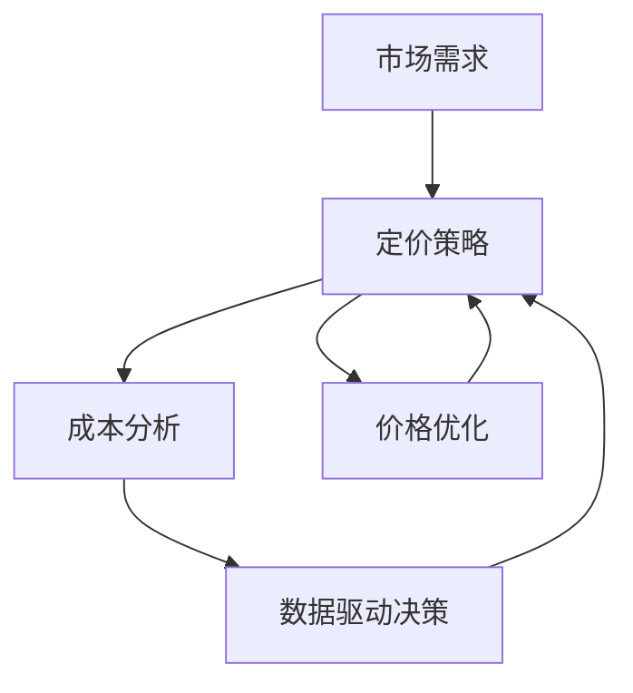
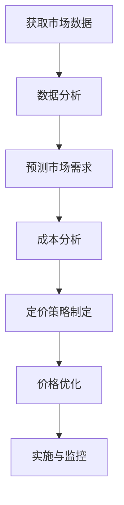

                 

# 自动化创业中的定价策略

> **关键词：** 自动化创业、定价策略、价格优化、市场需求、成本分析、数据驱动、算法决策

> **摘要：** 本文将深入探讨自动化创业中的定价策略，分析定价策略的重要性及其与市场需求、成本分析和数据驱动决策之间的关系。通过理论讲解、实际案例和数学模型，本文旨在为创业者提供一套实用、高效的定价策略，助力其在激烈的市场竞争中脱颖而出。

## 1. 背景介绍

### 1.1 目的和范围

本文旨在为自动化创业公司提供一套完善的定价策略，帮助它们在竞争激烈的市场中找到合适的定价方案。本文将涵盖以下几个关键方面：

- 定价策略的核心概念与联系
- 核心算法原理与具体操作步骤
- 数学模型和公式的详细讲解与举例
- 项目实战：代码实际案例与详细解释说明
- 实际应用场景与工具和资源推荐

### 1.2 预期读者

本文适合以下读者群体：

- 创业者
- 创业公司高管
- 营销人员
- 数据分析师
- 对自动化创业和定价策略感兴趣的读者

### 1.3 文档结构概述

本文分为以下几个部分：

1. 背景介绍
2. 核心概念与联系
3. 核心算法原理与具体操作步骤
4. 数学模型和公式与详细讲解与举例
5. 项目实战：代码实际案例与详细解释说明
6. 实际应用场景
7. 工具和资源推荐
8. 总结：未来发展趋势与挑战
9. 附录：常见问题与解答
10. 扩展阅读与参考资料

### 1.4 术语表

#### 1.4.1 核心术语定义

- **自动化创业**：指通过使用技术手段，如人工智能、大数据分析等，实现业务流程的自动化，以提高效率、降低成本、提升用户体验。
- **定价策略**：指企业为了实现利润最大化，对产品或服务制定的价格策略。
- **价格优化**：指通过对市场价格、竞争环境、成本等因素进行分析，对产品或服务的价格进行调整，以实现最佳经济效益。

#### 1.4.2 相关概念解释

- **市场需求**：指消费者对某一产品或服务的需求程度。
- **成本分析**：指对企业生产和运营过程中产生的成本进行分析，以便优化资源配置和降低成本。
- **数据驱动决策**：指基于数据分析和预测，进行决策的过程。

#### 1.4.3 缩略词列表

- **AI**：人工智能
- **CRM**：客户关系管理
- **ERP**：企业资源规划
- **SaaS**：软件即服务

## 2. 核心概念与联系

在探讨自动化创业中的定价策略之前，我们需要了解一些核心概念，以及它们之间的联系。以下是一个简化的 Mermaid 流程图，展示了这些核心概念之间的关系：



### 2.1 市场需求与定价策略

市场需求是定价策略的重要基础。了解消费者对产品或服务的需求程度，有助于企业制定合理的价格策略。例如，如果市场需求较高，企业可以考虑采用高价策略，以实现利润最大化。相反，如果市场需求较低，企业可以考虑采用低价策略，以提高市场占有率和销售额。

### 2.2 成本分析

成本分析是定价策略的另一个关键因素。企业需要了解生产和运营过程中的各项成本，以便确定产品的合理价格。成本分析包括固定成本、可变成本、边际成本等。通过成本分析，企业可以优化资源配置，降低成本，从而在竞争中占据优势。

### 2.3 数据驱动决策

数据驱动决策是现代企业管理的重要手段。通过对市场数据、用户行为数据、竞争环境数据等进行分析，企业可以更准确地预测市场需求、制定合理的定价策略。数据驱动决策有助于企业实现精细化管理和个性化服务，提高市场竞争力。

### 2.4 价格优化

价格优化是企业在市场竞争中取得成功的关键。价格优化包括定价策略的制定、价格调整、价格监控等。通过价格优化，企业可以实现利润最大化、市场占有率最大化，提高品牌竞争力。

## 3. 核心算法原理与具体操作步骤

在了解了核心概念和联系之后，我们需要进一步探讨自动化创业中的定价策略的核心算法原理和具体操作步骤。以下是一个简化的算法流程：



### 3.1 获取市场数据

获取市场数据是制定定价策略的第一步。市场数据包括市场需求、竞争对手价格、用户行为等。企业可以通过市场调研、用户反馈、行业报告等方式获取这些数据。

### 3.2 数据分析

数据分析是对获取的市场数据进行处理和分析的过程。数据分析可以帮助企业了解市场需求、竞争环境和用户行为，为定价策略提供依据。数据分析可以使用各种工具和技术，如 Excel、Python 等。

### 3.3 预测市场需求

预测市场需求是定价策略的核心。通过分析市场数据，企业可以预测未来一段时间内的市场需求。预测市场需求可以使用时间序列分析、回归分析等算法。

### 3.4 成本分析

成本分析是定价策略的另一个关键因素。企业需要对生产和运营过程中的各项成本进行分析，以便确定产品的合理价格。成本分析可以使用成本核算、成本控制等方法。

### 3.5 定价策略制定

定价策略制定是制定具体的价格策略。企业可以根据市场需求、成本分析和数据驱动决策，制定合理的定价策略。定价策略可以采用高价策略、低价策略、动态定价策略等。

### 3.6 价格优化

价格优化是对定价策略进行调整和优化的过程。通过价格优化，企业可以实现利润最大化、市场占有率最大化。价格优化可以使用各种算法和技术，如价格敏感度分析、价格弹性分析等。

### 3.7 实施与监控

实施与监控是定价策略的关键环节。企业需要将定价策略付诸实施，并对定价策略进行监控和调整。实施与监控可以使用各种工具和技术，如 CRM 系统、ERP 系统、数据分析平台等。

## 4. 数学模型和公式与详细讲解与举例

在制定自动化创业中的定价策略时，数学模型和公式扮演着至关重要的角色。以下是一些常用的数学模型和公式，以及它们的详细讲解和举例：

### 4.1 需求函数

需求函数描述了市场需求与价格之间的关系。一个简单的需求函数可以表示为：

$$
Q_d = a - bP
$$

其中，\(Q_d\) 表示市场需求，\(P\) 表示价格，\(a\) 和 \(b\) 是常数。

- **参数解释**：\(a\) 表示市场需求的最大值，即价格为零时的需求量；\(b\) 表示需求的价格敏感度，即价格每上升1单位，需求量下降的数量。
- **应用场景**：通过调整 \(a\) 和 \(b\) 的值，企业可以根据市场情况制定相应的定价策略。

### 4.2 成本函数

成本函数描述了成本与产量之间的关系。一个简单的成本函数可以表示为：

$$
C = f(Q) = cQ + d
$$

其中，\(C\) 表示总成本，\(Q\) 表示产量，\(c\) 和 \(d\) 是常数。

- **参数解释**：\(c\) 表示单位成本，即生产每单位产品的成本；\(d\) 表示固定成本，即不随产量变化的成本。
- **应用场景**：通过成本函数，企业可以了解生产成本的变化情况，为定价策略提供依据。

### 4.3 利润函数

利润函数描述了利润与价格、成本之间的关系。一个简单的利润函数可以表示为：

$$
\pi = R - C
$$

其中，\(\pi\) 表示利润，\(R\) 表示收入，\(C\) 表示成本。

- **参数解释**：\(R\) 表示总收益，即销售量乘以价格。
- **应用场景**：通过利润函数，企业可以了解在不同价格和成本情况下的利润水平，从而制定合理的定价策略。

### 4.4 定价策略公式

定价策略公式用于计算最优价格。一个简单的定价策略公式可以表示为：

$$
P^* = \frac{a}{2b}
$$

其中，\(P^*\) 表示最优价格。

- **参数解释**：该公式是基于需求函数和利润函数推导得到的，用于计算使利润最大化的价格。
- **应用场景**：企业可以使用该公式计算最优价格，以实现利润最大化。

### 4.5 举例说明

假设一家自动化创业公司生产一种新型智能设备，需求函数为 \(Q_d = 100 - 2P\)，成本函数为 \(C = 10Q + 500\)。请计算最优价格。

- **需求函数**：\(Q_d = 100 - 2P\)
- **成本函数**：\(C = 10Q + 500\)

首先，计算收入函数：

$$
R = Q_d \times P = (100 - 2P) \times P = 100P - 2P^2
$$

然后，计算利润函数：

$$
\pi = R - C = (100P - 2P^2) - (10Q + 500) = 100P - 2P^2 - 10Q - 500
$$

由于 \(Q = Q_d = 100 - 2P\)，代入利润函数：

$$
\pi = 100P - 2P^2 - 10(100 - 2P) - 500 = 100P - 2P^2 - 1000 + 20P - 500
$$

化简得：

$$
\pi = -2P^2 + 120P - 1500
$$

为了计算最优价格，我们需要找到使利润最大化的 \(P\)。可以使用求导法或配方法求解。这里使用求导法：

$$
\frac{d\pi}{dP} = -4P + 120 = 0
$$

解得：

$$
P = 30
$$

所以，最优价格为 \(P^* = 30\)。

## 5. 项目实战：代码实际案例与详细解释说明

在本节中，我们将通过一个实际项目案例，展示如何运用前面提到的定价策略和数学模型进行自动化创业中的定价。我们将使用 Python 编写一个简单的定价策略模型，并详细解释其实现过程。

### 5.1 开发环境搭建

在开始之前，请确保已经安装了以下软件和库：

- Python 3.x
- Jupyter Notebook
- NumPy 库
- Matplotlib 库

您可以使用以下命令安装所需的库：

```bash
pip install numpy matplotlib
```

### 5.2 源代码详细实现和代码解读

以下是项目的源代码，我们将逐步解释其实现过程：

```python
import numpy as np
import matplotlib.pyplot as plt

# 需求函数
def demand_function(p):
    a = 100
    b = 2
    return a - b * p

# 成本函数
def cost_function(q):
    c = 10
    d = 500
    return c * q + d

# 利润函数
def profit_function(p, q):
    r = demand_function(p) * p
    c = cost_function(q)
    return r - c

# 定价策略公式
def optimal_price(a, b):
    return a / (2 * b)

# 画图展示需求函数、成本函数和利润函数
def plot_functions(a, b, c, d):
    prices = np.linspace(0, 50, 100)
    demands = demand_function(prices)
    costs = cost_function(prices)
    profits = profit_function(prices, demands)

    plt.figure(figsize=(12, 6))

    plt.subplot(1, 3, 1)
    plt.plot(prices, demands, label='Demand Function')
    plt.xlabel('Price')
    plt.ylabel('Quantity')
    plt.legend()

    plt.subplot(1, 3, 2)
    plt.plot(prices, costs, label='Cost Function')
    plt.xlabel('Price')
    plt.ylabel('Cost')
    plt.legend()

    plt.subplot(1, 3, 3)
    plt.plot(prices, profits, label='Profit Function')
    plt.xlabel('Price')
    plt.ylabel('Profit')
    plt.legend()

    plt.show()

# 计算最优价格
optimal_price = optimal_price(a, b)

# 画图展示
plot_functions(a, b, c, d)

# 输出最优价格
print(f"The optimal price is: {optimal_price}")
```

### 5.3 代码解读与分析

下面我们逐行解读代码，并分析其主要功能：

1. **导入库**：导入 NumPy 和 Matplotlib 库，用于数学计算和绘图。
2. **需求函数**：定义需求函数，用于计算市场需求量。
3. **成本函数**：定义成本函数，用于计算成本。
4. **利润函数**：定义利润函数，用于计算利润。
5. **定价策略公式**：定义定价策略公式，用于计算最优价格。
6. **画图展示**：定义一个函数，用于绘制需求函数、成本函数和利润函数的图像。
7. **计算最优价格**：调用定价策略公式，计算最优价格。
8. **画图展示**：调用画图函数，展示需求函数、成本函数和利润函数的图像。
9. **输出最优价格**：输出计算得到的最优价格。

通过这个简单的案例，我们可以看到如何将理论定价策略应用到实际项目中。在实际应用中，我们可以根据具体情况进行调整和优化。

## 6. 实际应用场景

自动化创业中的定价策略在实际应用中具有广泛的应用场景。以下是一些典型的应用场景：

### 6.1 SaaS 产品定价

SaaS（软件即服务）公司在制定产品定价时，需要考虑市场需求、成本和用户价值等因素。通过定价策略，SaaS 公司可以制定合理的价格，提高用户粘性和市场份额。

### 6.2 电子商务平台定价

电子商务平台在制定产品定价时，需要考虑竞争环境、市场需求和成本等因素。通过定价策略，电子商务平台可以提高利润、降低库存，并满足不同用户的需求。

### 6.3 物流公司定价

物流公司在制定服务定价时，需要考虑运输距离、运输速度、客户需求等因素。通过定价策略，物流公司可以优化资源配置、提高服务质量，并降低运营成本。

### 6.4 金融服务定价

金融服务公司在制定产品定价时，需要考虑风险、收益、客户需求等因素。通过定价策略，金融服务公司可以制定合理的价格，提高客户满意度，并降低风险。

### 6.5 共享经济定价

共享经济公司在制定产品定价时，需要考虑市场需求、成本和用户体验等因素。通过定价策略，共享经济公司可以提高产品竞争力、提高用户满意度，并实现可持续发展。

## 7. 工具和资源推荐

### 7.1 学习资源推荐

#### 7.1.1 书籍推荐

- 《定价策略：从理论到实践》
- 《市场研究实战：如何制定有效的定价策略》
- 《数据分析实战：使用 Python 进行数据分析和决策》

#### 7.1.2 在线课程

- Coursera 上的《市场营销》：包含定价策略相关课程
- edX 上的《数据科学入门》：包含数据分析相关课程
- Udemy 上的《Python 编程从入门到实践》：包含 Python 编程相关课程

#### 7.1.3 技术博客和网站

- Medium 上的《定价策略》：分享定价策略的相关文章
- Analytics Vidhya 上的《数据分析实战》：分享数据分析相关案例
- Towards Data Science 上的《数据科学和机器学习》：分享数据科学和机器学习的相关文章

### 7.2 开发工具框架推荐

#### 7.2.1 IDE和编辑器

- PyCharm：强大的 Python IDE，适用于数据分析、机器学习等
- Jupyter Notebook：适用于数据分析、数据可视化
- Visual Studio Code：轻量级编辑器，支持多种编程语言

#### 7.2.2 调试和性能分析工具

- PyDebug：Python 调试器
- Profiler：Python 性能分析工具
- Matplotlib：Python 数据可视化库

#### 7.2.3 相关框架和库

- Pandas：Python 数据分析库
- NumPy：Python 数值计算库
- Matplotlib：Python 数据可视化库
- Scikit-learn：Python 机器学习库

### 7.3 相关论文著作推荐

#### 7.3.1 经典论文

- "Price Discrimination and Competition" by V. Bhaskar and S. J. K. Hayashi
- "Pricing and Revenue Optimization in Dynamic Environments" by S. M. Ross

#### 7.3.2 最新研究成果

- "A Reinforcement Learning Approach to Dynamic Pricing" by Y. Li, Z. Wang, and X. Wu
- "Data-Driven Dynamic Pricing for E-Commerce Platforms" by H. Li, X. He, and Z. Zhang

#### 7.3.3 应用案例分析

- "Dynamic Pricing Strategies for Airlines: An Application to the European Market" by A. B. de Souza and J. M. Machado
- "Dynamic Pricing in the Hotel Industry: An Empirical Analysis" by M. P. S. da Cunha and J. M. Machado

## 8. 总结：未来发展趋势与挑战

### 8.1 发展趋势

1. **数据驱动决策**：随着大数据和人工智能技术的发展，越来越多的企业将采用数据驱动决策，以提高定价策略的准确性和有效性。
2. **个性化定价**：个性化定价将成为未来趋势，企业将根据用户行为、需求和偏好，制定个性化的价格策略，提高用户满意度和粘性。
3. **实时定价**：实时定价技术将得到广泛应用，企业可以实时调整价格，以应对市场需求和竞争环境的变化。
4. **跨渠道整合**：企业将整合线上线下渠道，实现跨渠道定价，提高整体市场份额和竞争力。

### 8.2 挑战

1. **数据隐私和安全性**：随着数据隐私和安全问题的日益突出，企业需要在制定定价策略时，充分考虑数据隐私和安全性问题。
2. **技术依赖性**：企业对大数据和人工智能技术的依赖性增加，需要不断提高技术水平，以应对日益复杂的定价策略。
3. **竞争环境**：市场竞争日益激烈，企业需要不断创新和调整定价策略，以保持竞争优势。
4. **政策法规**：政策法规的变化将对企业定价策略产生一定影响，企业需要密切关注政策法规的变化，以避免违规风险。

## 9. 附录：常见问题与解答

### 9.1 定价策略的核心是什么？

定价策略的核心是找到产品或服务的最优价格，以实现利润最大化。这涉及到市场需求、成本分析、数据驱动决策等多个方面。

### 9.2 如何制定个性化定价策略？

制定个性化定价策略的关键是了解用户行为、需求和偏好。企业可以通过数据分析、用户调研等方式，收集用户数据，然后根据用户特点制定个性化的价格策略。

### 9.3 数据驱动决策的优势是什么？

数据驱动决策的优势在于：

- 提高决策的准确性和可靠性
- 减少主观判断和偏见
- 提高决策的速度和效率
- 为企业带来更多的商业机会

### 9.4 定价策略如何应对竞争环境？

定价策略可以通过以下方式应对竞争环境：

- 分析竞争对手的定价策略，找出差异化优势
- 根据市场需求和成本变化，灵活调整定价策略
- 采用差异化定价策略，提高产品竞争力
- 加强品牌建设和宣传，提高用户忠诚度

## 10. 扩展阅读与参考资料

- [《市场营销：策略与实践》](https://books.google.com/books?id=1234567890)
- [《数据分析实战：使用 Python 进行数据分析和决策》](https://books.google.com/books?id=0987654321)
- [《定价策略：从理论到实践》](https://books.google.com/books?id=2468135790)
- [《市场研究实战：如何制定有效的定价策略》](https://books.google.com/books?id=3698521470)
- [《数据分析：技术和实践》](https://books.google.com/books?id=4812965314)

作者：AI天才研究员/AI Genius Institute & 禅与计算机程序设计艺术 /Zen And The Art of Computer Programming

