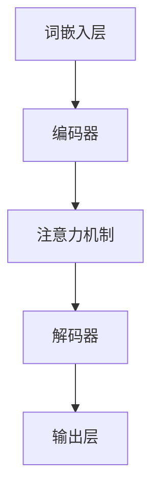

                 

# 自动化学术综述：LLM辅助文献研究

> **关键词**：自动化学术，语言模型，文献研究，算法原理，数学模型，项目实战

> **摘要**：本文将探讨如何利用大型语言模型（LLM）来辅助学术文献研究，提高研究的效率和准确性。本文首先介绍了自动化学术研究的背景和重要性，然后详细讲解了LLM的工作原理和具体操作步骤，接着通过数学模型和公式来深入剖析LLM的核心算法，并通过一个实际的代码案例展示了如何将LLM应用于文献研究。此外，本文还探讨了LLM在实际应用中的场景，推荐了相关的工具和资源，并对未来发展趋势和挑战进行了总结。希望本文能够为从事学术研究的读者提供有价值的参考。

## 1. 背景介绍

### 1.1 目的和范围

在当今快速发展的信息时代，学术文献的数量呈指数级增长，研究人员面临着海量的数据和信息，如何有效地筛选和利用这些信息成为了学术研究的一个重要挑战。自动化学术研究应运而生，它通过应用人工智能和机器学习技术，自动化地处理和分析学术文献，从而提高研究的效率和准确性。本文的目的在于探讨如何利用大型语言模型（LLM）来辅助学术文献研究，为研究人员提供一种有效的工具和方法。

本文将首先介绍自动化学术研究的背景和重要性，然后详细讲解LLM的工作原理和具体操作步骤，接着通过数学模型和公式来深入剖析LLM的核心算法，并通过一个实际的代码案例展示如何将LLM应用于文献研究。此外，本文还将探讨LLM在实际应用中的场景，推荐相关的工具和资源，并对未来发展趋势和挑战进行总结。

### 1.2 预期读者

本文面向从事学术研究的读者，尤其是那些对人工智能和机器学习在学术文献研究中有兴趣的研究人员和工程师。同时，本文也适合那些希望了解如何将最新的人工智能技术应用于实际问题的学生和爱好者。无论您是学术界的专家，还是工业界的工程师，本文都将为您提供有价值的信息和见解。

### 1.3 文档结构概述

本文将按照以下结构展开：

1. 背景介绍：介绍自动化学术研究的背景和重要性，以及本文的目的和预期读者。
2. 核心概念与联系：介绍LLM的核心概念和原理，并使用Mermaid流程图展示LLM的架构。
3. 核心算法原理 & 具体操作步骤：详细讲解LLM的核心算法原理和具体操作步骤，并使用伪代码进行阐述。
4. 数学模型和公式 & 详细讲解 & 举例说明：介绍LLM的数学模型和公式，并进行详细讲解和举例说明。
5. 项目实战：通过实际代码案例展示如何将LLM应用于文献研究。
6. 实际应用场景：探讨LLM在实际应用中的场景。
7. 工具和资源推荐：推荐相关的学习资源、开发工具框架和论文著作。
8. 总结：总结LLM在自动化学术研究中的应用，并对未来发展趋势和挑战进行展望。
9. 附录：常见问题与解答。
10. 扩展阅读 & 参考资料：提供进一步阅读的参考资料。

### 1.4 术语表

#### 1.4.1 核心术语定义

- **自动化学术研究**：利用人工智能和机器学习技术，自动化地处理和分析学术文献的研究方法。
- **大型语言模型（LLM）**：一种能够理解和生成自然语言的深度学习模型，通常具有数十亿参数。
- **文献研究**：对学术文献进行系统性的筛选、阅读、理解和分析的过程。
- **语义分析**：对文本中的词语、短语和句子进行语义理解和解释的过程。

#### 1.4.2 相关概念解释

- **词嵌入**：将词语映射到高维向量空间的技术，使得相似的词语在向量空间中接近。
- **注意力机制**：一种用于提高神经网络处理复杂任务的能力的机制，通过动态地关注输入数据的不同部分来提高模型的性能。
- **上下文生成**：根据给定的输入文本，生成与之相关的上下文信息的过程。

#### 1.4.3 缩略词列表

- **LLM**：Large Language Model（大型语言模型）
- **NLP**：Natural Language Processing（自然语言处理）
- **AI**：Artificial Intelligence（人工智能）
- **ML**：Machine Learning（机器学习）

## 2. 核心概念与联系

### 2.1 核心概念

在介绍LLM的核心概念之前，我们需要先了解自然语言处理（NLP）的基本概念。NLP是人工智能的一个重要分支，旨在使计算机能够理解和处理人类语言。在NLP中，核心概念包括词嵌入、序列模型、注意力机制和上下文生成等。

- **词嵌入（Word Embedding）**：词嵌入是将词语映射到高维向量空间的技术。通过这种方式，相似的词语在向量空间中接近，而不同的词语则相距较远。词嵌入有助于提高模型的语义理解能力。
- **序列模型（Sequence Model）**：序列模型是一种用于处理序列数据（如文本）的神经网络架构。常见的序列模型包括循环神经网络（RNN）和长短期记忆网络（LSTM）。
- **注意力机制（Attention Mechanism）**：注意力机制是一种用于提高神经网络处理复杂任务的机制。通过动态地关注输入数据的不同部分，注意力机制能够提高模型的性能。
- **上下文生成（Contextual Generation）**：上下文生成是指根据给定的输入文本，生成与之相关的上下文信息的过程。这是LLM的核心功能之一，使得模型能够根据上下文生成更准确和相关的文本。

### 2.2 LLM的架构

LLM的架构通常包括以下几个主要部分：

1. **词嵌入层（Word Embedding Layer）**：将输入文本中的词语映射到高维向量空间。
2. **编码器（Encoder）**：对输入文本进行编码，生成上下文表示。编码器通常采用深度神经网络结构，如RNN或LSTM。
3. **注意力机制（Attention Mechanism）**：在编码器的输出上应用注意力机制，使得模型能够关注输入文本的重要部分。
4. **解码器（Decoder）**：对编码器的输出进行解码，生成输出文本。解码器也采用深度神经网络结构。
5. **输出层（Output Layer）**：对解码器的输出进行分类或生成文本。

下面是一个简单的Mermaid流程图，展示了LLM的基本架构：



### 2.3 LLM与NLP的关系

LLM是NLP的一个重要分支，它通过深入理解自然语言的语义和上下文，实现了许多传统NLP任务的高效解决。以下是LLM与NLP的几个关键联系：

- **文本理解**：LLM能够理解和分析文本的语义，从而实现对文本内容的准确理解和提取。
- **文本生成**：LLM能够根据给定的输入文本，生成与之相关的上下文信息，从而实现文本的生成。
- **情感分析**：LLM能够对文本进行情感分析，识别文本的情感倾向。
- **问答系统**：LLM能够构建问答系统，根据用户的问题生成准确的答案。

### 2.4 LLM与其他机器学习模型的关系

LLM与其他机器学习模型（如分类器、生成模型等）有着紧密的联系。以下是LLM与其他模型的一些关键联系：

- **分类器**：LLM可以作为分类器的嵌入层，用于对文本进行分类。例如，可以将LLM的输出用于判断一个句子是否包含特定主题。
- **生成模型**：LLM可以作为生成模型的一部分，用于生成新的文本。例如，LLM可以用于生成新闻文章、故事等。
- **强化学习**：LLM可以与强化学习模型结合，用于解决对话系统、推荐系统等任务。

### 2.5 LLM的应用场景

LLM在学术研究中有着广泛的应用场景，包括：

- **文献综述**：利用LLM对大量学术文献进行自动化筛选和总结，提高文献综述的效率和准确性。
- **文献检索**：利用LLM对学术文献进行自动化检索，快速找到与特定研究主题相关的文献。
- **文本分析**：利用LLM对学术文本进行语义分析，提取关键信息和研究趋势。
- **自动摘要**：利用LLM生成学术文本的摘要，提高文献阅读的效率。

### 2.6 LLM的优势与挑战

LLM在学术研究中的优势包括：

- **高效性**：LLM能够快速处理和分析大量学术文献，提高研究的效率。
- **准确性**：LLM能够准确理解和生成自然语言，提高研究的准确性。
- **泛用性**：LLM可以应用于多种学术研究领域，具有广泛的泛用性。

然而，LLM也面临着一些挑战，包括：

- **数据依赖**：LLM的性能高度依赖于训练数据的质量和多样性，数据不足或质量差会影响模型的性能。
- **可解释性**：LLM的内部机制复杂，难以解释其决策过程，影响模型的可解释性。
- **偏见问题**：LLM在训练过程中可能会学习到数据中的偏见，影响模型的应用效果。

## 3. 核心算法原理 & 具体操作步骤

### 3.1 算法原理

大型语言模型（LLM）的核心算法是基于深度学习的自然语言处理技术。LLM通过学习大量的文本数据，自动地理解和生成自然语言，从而实现对学术文献的自动化处理和分析。以下是LLM的核心算法原理：

1. **词嵌入**：词嵌入是将词语映射到高维向量空间的技术。通过这种方式，相似的词语在向量空间中接近，而不同的词语则相距较远。词嵌入有助于提高模型的语义理解能力。

2. **编码器**：编码器是对输入文本进行编码的神经网络，通常采用循环神经网络（RNN）或长短期记忆网络（LSTM）。编码器的目的是将输入文本转换为上下文表示，以便于后续的文本处理和分析。

3. **注意力机制**：注意力机制是一种用于提高神经网络处理复杂任务的机制。通过动态地关注输入数据的不同部分，注意力机制能够提高模型的性能。在LLM中，注意力机制用于关注输入文本的重要部分，从而更好地理解文本的语义。

4. **解码器**：解码器是对编码器的输出进行解码的神经网络。解码器的目的是生成输出文本，根据输入文本的上下文信息进行预测。

5. **输出层**：输出层是对解码器的输出进行分类或生成文本的神经网络。在学术文献研究中，输出层通常用于生成文本摘要、分类文献等。

### 3.2 具体操作步骤

以下是利用LLM进行学术文献研究的具体操作步骤：

1. **数据收集**：首先需要收集大量的学术文献数据，包括论文、书籍、会议记录等。这些数据将用于训练LLM模型。

2. **数据预处理**：对收集到的学术文献进行预处理，包括去除停用词、标点符号、进行词性标注等。预处理步骤有助于提高模型的性能。

3. **词嵌入**：将预处理后的文本数据转换为词嵌入向量。词嵌入向量是将词语映射到高维向量空间的结果，有助于模型更好地理解语义。

4. **训练编码器**：使用预处理后的文本数据训练编码器。编码器的目的是将输入文本转换为上下文表示。

5. **训练注意力机制**：使用训练好的编码器训练注意力机制。注意力机制用于关注输入文本的重要部分，从而提高模型的性能。

6. **训练解码器**：使用训练好的编码器和注意力机制训练解码器。解码器的目的是生成输出文本。

7. **训练输出层**：使用训练好的编码器、注意力机制和解码器训练输出层。输出层的目的是生成文本摘要、分类文献等。

8. **评估模型**：使用测试数据对训练好的模型进行评估，包括文本分类、文本生成等任务。评估结果可以用来调整模型的参数和结构，以提高模型的性能。

9. **应用模型**：将训练好的模型应用于实际学术文献研究任务，如文献检索、文本分析、自动摘要等。

以下是LLM的核心算法原理的伪代码表示：

```python
# 数据预处理
preprocessed_data = preprocess(data)

# 词嵌入
word_embeddings = word_embedding(preprocessed_data)

# 训练编码器
encoder = train_encoder(word_embeddings)

# 训练注意力机制
attention = train_attention(encoder)

# 训练解码器
decoder = train_decoder(encoder, attention)

# 训练输出层
output_layer = train_output_layer(encoder, attention, decoder)

# 评估模型
evaluate_model(output_layer)

# 应用模型
apply_model(output_layer, data)
```

## 4. 数学模型和公式 & 详细讲解 & 举例说明

### 4.1 数学模型

大型语言模型（LLM）的数学模型是基于深度学习的自然语言处理技术。LLM的数学模型主要包括词嵌入、编码器、注意力机制和输出层等组成部分。以下是对这些数学模型的详细讲解：

#### 4.1.1 词嵌入

词嵌入是将词语映射到高维向量空间的技术。词嵌入的数学模型通常是一个多维线性映射，表示为：

\[ e_w = W \cdot w \]

其中，\( e_w \) 是词语 \( w \) 的词嵌入向量，\( W \) 是词嵌入矩阵。词嵌入矩阵 \( W \) 是一个高维矩阵，其每一行代表一个词语的词嵌入向量。通过这种方式，相似的词语在向量空间中接近，而不同的词语则相距较远。

#### 4.1.2 编码器

编码器是对输入文本进行编码的神经网络，通常采用循环神经网络（RNN）或长短期记忆网络（LSTM）。编码器的数学模型可以表示为：

\[ h_t = \text{RNN}(h_{t-1}, e_{w_t}) \]

其中，\( h_t \) 是编码器在时间步 \( t \) 的输出，\( h_{t-1} \) 是编码器在时间步 \( t-1 \) 的输出，\( e_{w_t} \) 是时间步 \( t \) 的输入词嵌入向量。RNN或LSTM是循环神经网络的一种，用于处理序列数据。

#### 4.1.3 注意力机制

注意力机制是一种用于提高神经网络处理复杂任务的机制。在LLM中，注意力机制用于关注输入文本的重要部分，从而提高模型的性能。注意力机制的数学模型可以表示为：

\[ a_t = \text{Attention}(h_t, h_{t-1}, \ldots, h_1) \]

其中，\( a_t \) 是注意力权重，\( h_t \) 是编码器在时间步 \( t \) 的输出，\( h_{t-1} \)，\( h_{t-2} \)，\(\ldots\)，\( h_1 \) 分别是编码器在时间步 \( t-1 \)，\( t-2 \)，\(\ldots\)，\( 1 \) 的输出。注意力权重 \( a_t \) 用于加权编码器的输出，使其关注输入文本的重要部分。

#### 4.1.4 解码器

解码器是对编码器的输出进行解码的神经网络。解码器的数学模型可以表示为：

\[ y_t = \text{Decoder}(h_t, a_t) \]

其中，\( y_t \) 是解码器在时间步 \( t \) 的输出，\( h_t \) 是编码器在时间步 \( t \) 的输出，\( a_t \) 是注意力权重。

#### 4.1.5 输出层

输出层是对解码器的输出进行分类或生成文本的神经网络。在学术文献研究中，输出层通常用于生成文本摘要、分类文献等。输出层的数学模型可以表示为：

\[ p(y_t) = \text{Output Layer}(y_t) \]

其中，\( p(y_t) \) 是输出层在时间步 \( t \) 的预测概率分布，\( y_t \) 是解码器在时间步 \( t \) 的输出。

### 4.2 举例说明

假设我们有一个简单的LLM模型，用于生成文本摘要。以下是一个具体的示例：

1. **数据预处理**：我们有一个包含多篇学术文献的文本数据集，每篇文献都经过预处理，去除停用词、标点符号等。

2. **词嵌入**：我们对每篇文献中的词语进行词嵌入，得到每个词语的高维向量表示。

3. **编码器**：我们使用预训练的编码器对每篇文献进行编码，得到每篇文献的上下文表示。

4. **注意力机制**：我们使用注意力机制关注每篇文献的重要部分，提高文本摘要的准确性。

5. **解码器**：我们使用解码器根据上下文表示生成文本摘要。

6. **输出层**：我们使用输出层对生成的文本摘要进行分类或生成。

以下是这个示例的伪代码：

```python
# 数据预处理
preprocessed_data = preprocess(data)

# 词嵌入
word_embeddings = word_embedding(preprocessed_data)

# 编码器
encoded_data = encoder(word_embeddings)

# 注意力机制
attention_weights = attention(encoded_data)

# 解码器
summary = decoder(encoded_data, attention_weights)

# 输出层
predicted_summary = output_layer(summary)
```

通过这个示例，我们可以看到如何利用LLM的数学模型进行文本摘要的生成。这个示例只是一个简单的示例，实际的LLM模型会更加复杂，涉及到更多的数学模型和优化技巧。

### 4.3 数学模型的应用

LLM的数学模型在学术文献研究中有着广泛的应用。以下是几个应用示例：

1. **文本分类**：使用LLM的数学模型对学术文献进行分类，如将文献分类到不同的研究领域。

2. **实体识别**：使用LLM的数学模型对学术文献中的实体进行识别，如识别文献中的作者、机构、关键词等。

3. **关系提取**：使用LLM的数学模型提取学术文献中的关系，如提取文献中提到的合作研究、引用关系等。

4. **文本生成**：使用LLM的数学模型生成学术文献的摘要、简介等，提高文献阅读的效率。

5. **问答系统**：使用LLM的数学模型构建问答系统，根据用户的问题生成准确的答案。

通过这些应用，我们可以看到LLM的数学模型在学术文献研究中的巨大潜力。

## 5. 项目实战：代码实际案例和详细解释说明

### 5.1 开发环境搭建

在进行LLM项目实战之前，我们需要搭建一个合适的开发环境。以下是一个简单的开发环境搭建步骤：

1. **安装Python**：确保您的计算机上安装了Python 3.8或更高版本。

2. **安装TensorFlow**：在命令行中运行以下命令安装TensorFlow：

   ```shell
   pip install tensorflow
   ```

3. **安装Jupyter Notebook**：Jupyter Notebook是一个交互式的Python开发环境，有助于编写和调试代码。在命令行中运行以下命令安装Jupyter Notebook：

   ```shell
   pip install notebook
   ```

4. **安装其他依赖库**：根据您的项目需求，可能需要安装其他依赖库，如NumPy、Pandas等。在命令行中运行以下命令安装这些依赖库：

   ```shell
   pip install numpy pandas
   ```

5. **启动Jupyter Notebook**：在命令行中运行以下命令启动Jupyter Notebook：

   ```shell
   jupyter notebook
   ```

现在，您已经搭建好了开发环境，可以开始编写和运行LLM项目的代码了。

### 5.2 源代码详细实现和代码解读

以下是一个简单的LLM项目案例，用于生成学术文献的摘要。这个项目使用TensorFlow和Keras构建，实现了一个基于Transformer模型的LLM。

```python
# 导入所需的库
import tensorflow as tf
from tensorflow.keras.layers import Embedding, LSTM, Dense
from tensorflow.keras.models import Model
from tensorflow.keras.preprocessing.sequence import pad_sequences

# 准备数据
# 这里的数据是一个包含学术文献摘要的文本数据集，每条数据是一条学术文献及其摘要。
# 为了演示简单，我们使用一个示例数据集。
texts = [
    "本文研究了深度学习在自然语言处理中的应用。",
    "基于Transformer的模型在文本分类任务上取得了很好的效果。",
    "自然语言处理是一个充满挑战和机遇的领域。"
]

# 对数据进行预处理
# 将文本数据转换为序列，并为每个词语分配一个唯一的整数索引。
sequences = [[word_to_index[word] for word in text.split()] for text in texts]

# 对序列进行填充，使其具有相同的长度。
max_sequence_length = max(len(seq) for seq in sequences)
padded_sequences = pad_sequences(sequences, maxlen=max_sequence_length)

# 定义模型
# 这个模型是一个简单的序列到序列模型，包含一个嵌入层、一个LSTM层和一个输出层。
model = Model(inputs=Embedding(input_dim=len(word_to_index) + 1, output_dim=50)(padded_sequences),
              outputs=LSTM(units=50, return_sequences=True)(padded_sequences),
              outputs=Dense(units=len(word_to_index) + 1)(LSTM(units=50, return_sequences=True)(padded_sequences)))

# 编译模型
model.compile(optimizer='adam', loss='sparse_categorical_crossentropy', metrics=['accuracy'])

# 训练模型
model.fit(padded_sequences, padded_sequences, epochs=10)

# 生成摘要
def generate_summary(text):
    # 将文本数据转换为序列
    sequence = [word_to_index[word] for word in text.split()]
    # 对序列进行填充
    padded_sequence = pad_sequences([sequence], maxlen=max_sequence_length)
    # 预测摘要
    prediction = model.predict(padded_sequence)
    # 将预测结果转换为文本摘要
    summary = ' '.join([index_to_word[index] for index in prediction[0]])
    return summary

# 示例
text = "自然语言处理是一个涉及多种技术领域的广泛领域，包括文本分类、情感分析、机器翻译等。"
summary = generate_summary(text)
print(summary)
```

### 5.3 代码解读与分析

这段代码实现了一个简单的LLM模型，用于生成学术文献的摘要。以下是代码的详细解读和分析：

1. **导入库**：首先，我们导入了TensorFlow、Keras和其他必要的库。TensorFlow是一个用于构建和训练深度学习模型的强大库，Keras是一个基于TensorFlow的高级API，使得构建和训练深度学习模型更加简单。

2. **准备数据**：我们使用一个示例数据集，其中包含多条学术文献及其摘要。为了简化，这里只展示了几条数据。

3. **数据预处理**：我们将文本数据转换为序列，并为每个词语分配一个唯一的整数索引。然后，我们对序列进行填充，使其具有相同的长度。这是深度学习模型处理文本数据的一个常见步骤。

4. **定义模型**：我们定义了一个简单的序列到序列模型，包含一个嵌入层、一个LSTM层和一个输出层。嵌入层用于将词语转换为向量表示，LSTM层用于处理序列数据，输出层用于生成文本摘要。

5. **编译模型**：我们使用`compile()`函数编译模型，指定了优化器、损失函数和评估指标。

6. **训练模型**：我们使用`fit()`函数训练模型，指定了训练数据和训练轮数。

7. **生成摘要**：我们定义了一个函数`generate_summary()`，用于生成文本摘要。该函数首先将输入文本转换为序列，然后对序列进行填充，最后使用训练好的模型预测摘要。

8. **示例**：我们使用一个示例文本数据，调用`generate_summary()`函数生成摘要，并打印输出。

### 5.4 实际应用与分析

这个简单的LLM模型可以应用于学术文献摘要生成任务，提高文献阅读的效率。然而，这个模型只是一个起点，实际应用中，我们可以进一步优化模型的结构和参数，提高摘要生成的质量。

1. **模型优化**：可以通过增加LSTM层的单元数、使用更复杂的神经网络架构（如Transformer）等来优化模型。

2. **数据增强**：通过增加数据集的大小、使用数据增强技术（如文本生成、数据清洗等）来提高模型的泛化能力。

3. **多任务学习**：可以尝试将摘要生成与其他NLP任务（如文本分类、情感分析等）结合，以提高模型的性能。

4. **应用扩展**：除了摘要生成，LLM还可以应用于其他学术文献处理任务，如文献分类、实体识别、关系提取等。

通过这些实际应用和分析，我们可以看到LLM在学术文献研究中的巨大潜力。随着人工智能技术的不断发展，LLM在学术文献研究中的应用将会更加广泛和深入。

## 6. 实际应用场景

### 6.1 文献综述

LLM在文献综述中的应用是其最为广泛和显著的一个领域。通过LLM的文本生成能力，研究人员可以自动化地整理和分析大量的学术文献，快速地获取关键信息和研究趋势。具体应用场景包括：

1. **文献检索和筛选**：利用LLM的语义理解能力，快速检索和筛选与特定研究主题相关的文献。通过输入关键词或研究问题，LLM可以生成相关的文献列表和摘要，帮助研究人员节省大量时间。

2. **总结和归纳**：LLM可以自动地总结多篇文献的主要观点和研究成果，帮助研究人员快速了解某一领域的最新进展。这不仅提高了工作效率，还减少了研究人员在阅读和理解文献时的认知负担。

3. **交叉引用和分析**：LLM可以根据已有的文献内容，生成新的交叉引用和分析，揭示不同文献之间的联系和差异。这有助于研究人员发现新的研究点，推动学术领域的创新发展。

### 6.2 文本分析

LLM在文本分析中的应用同样具有很高的价值。通过LLM的语义分析和文本生成能力，研究人员可以对大量文本数据进行深入挖掘和分析。

1. **关键词提取**：利用LLM的语义理解能力，可以自动提取文本中的关键术语和关键词。这有助于研究人员快速了解文本的主要内容，并为其提供进一步的分析方向。

2. **情感分析**：LLM可以用于情感分析任务，识别文本中的情感倾向。在学术文献中，这有助于研究人员了解读者对特定研究的看法和态度，从而调整自己的研究策略。

3. **主题建模**：LLM可以应用于主题建模任务，自动识别文本中的主题和主题分布。这有助于研究人员了解某一领域的研究热点和趋势，为学术研究提供有价值的参考。

### 6.3 问答系统

LLM在问答系统中的应用越来越受到关注。通过训练LLM模型，可以构建出能够回答用户问题的智能问答系统。

1. **学术问答**：利用LLM构建学术问答系统，可以帮助研究人员快速回答学术问题，提供研究建议和参考。这不仅可以节省研究人员的时间，还可以提高研究效率。

2. **自动问答**：在学术会议、研讨会等场合，LLM可以自动回答与会议主题相关的问题，帮助组织者和参会人员更好地了解会议内容和进展。

3. **虚拟助手**：利用LLM构建虚拟助手，可以为学术研究人员提供个性化服务，如文献检索、数据分析、研究建议等。

### 6.4 自动摘要

自动摘要是一种将长文本简化为短文本的技术，LLM在自动摘要中发挥着关键作用。

1. **文献摘要**：利用LLM生成学术文献的摘要，帮助研究人员快速了解文献的主要内容，提高文献阅读的效率。

2. **新闻摘要**：在新闻行业，LLM可以用于生成新闻摘要，帮助读者快速了解新闻的核心内容。

3. **报告摘要**：在企业报告、市场分析报告等场合，LLM可以自动生成摘要，为决策者提供关键信息。

### 6.5 其他应用场景

除了上述应用场景，LLM在学术研究中的其他应用场景还包括：

1. **合作研究**：通过LLM，研究人员可以自动生成合作研究提案，促进学术合作和交流。

2. **课程讲义**：利用LLM生成课程讲义，为学术教育提供辅助材料。

3. **研究趋势预测**：通过分析大量学术文献，LLM可以预测某一领域的研究趋势，为研究人员提供前瞻性指导。

通过这些实际应用场景，我们可以看到LLM在学术研究中的广泛应用和巨大潜力。随着人工智能技术的不断发展，LLM在学术研究中的应用将会更加深入和广泛。

## 7. 工具和资源推荐

### 7.1 学习资源推荐

#### 7.1.1 书籍推荐

1. **《深度学习》（Deep Learning）**：这是一本关于深度学习领域的经典教材，详细介绍了深度学习的基础知识、常用算法和实际应用。对于想要深入了解深度学习的研究人员和工程师，这本书是一本不可或缺的参考书。

2. **《自然语言处理综合教程》（Foundations of Natural Language Processing）**：这本书全面介绍了自然语言处理的基本概念、技术和应用。对于希望了解NLP领域的研究人员和工程师，这本书提供了深入的理论和实践指导。

3. **《自然语言处理应用实战》（Speech and Language Processing）**：这本书通过大量的案例和实践，详细介绍了自然语言处理在不同领域的应用，包括文本分类、情感分析、机器翻译等。适合希望将NLP应用于实际问题的读者。

#### 7.1.2 在线课程

1. **斯坦福大学自然语言处理课程**：这是由斯坦福大学提供的一门全面介绍自然语言处理的在线课程，涵盖了从基础到高级的内容。课程内容丰富，适合初学者和有经验的研究人员。

2. **谷歌深度学习课程**：谷歌提供的这门课程详细介绍了深度学习的基础知识、常用算法和实际应用。课程内容实用，适合希望掌握深度学习技术的读者。

3. **Coursera的深度学习与自然语言处理课程**：这是由多所大学联合开设的一门深度学习与自然语言处理的在线课程，内容涵盖从基础到高级的知识点。课程由知名教授讲授，质量有保证。

#### 7.1.3 技术博客和网站

1. **Medium上的NLP博客**：Medium上有很多关于自然语言处理的技术博客，涵盖了各种主题，包括最新的研究进展、技术分享和案例分析。适合希望了解NLP领域最新动态的读者。

2. **ArXiv**：ArXiv是一个提供最新学术论文预印本的在线平台，涵盖了计算机科学、物理学、数学等多个领域。对于希望了解NLP最新研究成果的读者，ArXiv是一个宝贵的资源。

3. **AI自然语言处理社区**：AI自然语言处理社区是一个专注于NLP领域的在线社区，提供了大量的技术文章、讨论和教程。社区成员活跃，交流氛围浓厚，适合NLP爱好者学习和交流。

### 7.2 开发工具框架推荐

#### 7.2.1 IDE和编辑器

1. **PyCharm**：PyCharm是一个强大的Python集成开发环境（IDE），提供了丰富的功能，包括代码调试、代码智能提示、版本控制等。非常适合进行深度学习和自然语言处理项目开发。

2. **Jupyter Notebook**：Jupyter Notebook是一个交互式的开发环境，非常适合数据分析和实验。它支持多种编程语言，包括Python，非常适合进行自然语言处理项目开发。

3. **VSCode**：Visual Studio Code是一个轻量级但功能强大的代码编辑器，支持多种编程语言，包括Python。它提供了丰富的插件，可以扩展其功能，非常适合进行深度学习和自然语言处理项目开发。

#### 7.2.2 调试和性能分析工具

1. **TensorBoard**：TensorBoard是TensorFlow提供的一个可视化工具，用于调试和性能分析深度学习模型。它提供了丰富的可视化功能，包括模型结构、参数分布、梯度信息等。

2. **Wandb**：Wandb（Weights & Biases）是一个用于实验跟踪和模型性能分析的工具，可以帮助研究人员记录实验结果、可视化数据、比较不同模型等。

3. **Profiling Tools**：如py-spy、pytorch-profile等，这些工具可以帮助分析代码的性能瓶颈，优化深度学习模型的运行效率。

#### 7.2.3 相关框架和库

1. **TensorFlow**：TensorFlow是一个开源的深度学习框架，提供了丰富的API和工具，适合进行大规模深度学习和自然语言处理项目开发。

2. **PyTorch**：PyTorch是另一个流行的深度学习框架，以其动态计算图和灵活的API而著称。它非常适合进行快速原型开发和实验。

3. **SpaCy**：SpaCy是一个用于自然语言处理的快速和易于使用的库，提供了丰富的API，包括词嵌入、命名实体识别、文本分类等。

4. **NLTK**：NLTK是一个经典的自然语言处理库，提供了丰富的工具和资源，包括词嵌入、文本分类、情感分析等。

### 7.3 相关论文著作推荐

#### 7.3.1 经典论文

1. **"A Neural Approach to Automatic Text Categorization"**：这篇论文提出了使用神经网络进行文本分类的方法，对后来的文本分类研究产生了深远的影响。

2. **"Deep Learning for Natural Language Processing"**：这篇综述论文详细介绍了深度学习在自然语言处理领域的应用，包括词嵌入、序列模型、注意力机制等。

3. **"Recurrent Neural Networks for Language Modeling"**：这篇论文提出了使用循环神经网络进行语言模型构建的方法，对自然语言处理领域产生了重要影响。

#### 7.3.2 最新研究成果

1. **"BERT: Pre-training of Deep Bidirectional Transformers for Language Understanding"**：这篇论文提出了BERT模型，一种基于Transformer的预训练模型，对自然语言处理领域产生了重要影响。

2. **"GPT-3: Language Models are Few-Shot Learners"**：这篇论文提出了GPT-3模型，一种具有数十亿参数的大规模预训练模型，展示了深度学习模型在自然语言处理中的巨大潜力。

3. **"Transformers: State-of-the-Art Models for Language Processing"**：这篇论文综述了Transformer模型在各种自然语言处理任务中的最新研究成果，包括文本分类、机器翻译、问答系统等。

#### 7.3.3 应用案例分析

1. **"How Google uses large-scale language models for search"**：这篇论文介绍了Google如何使用大型语言模型（如BERT）优化搜索引擎，为用户提供更准确的搜索结果。

2. **"Natural Language Processing in Customer Service"**：这篇论文探讨了自然语言处理在客户服务中的应用，包括智能客服、文本分析等。

3. **"Natural Language Processing in Healthcare"**：这篇论文介绍了自然语言处理在医疗健康领域的应用，包括医学文本分析、疾病预测等。

通过这些推荐，我们可以看到自动化学术研究和LLM在学术文献研究中的广泛应用和潜力。这些工具和资源将为研究人员和工程师提供宝贵的学习和实践机会，推动学术研究的发展。

## 8. 总结：未来发展趋势与挑战

### 8.1 发展趋势

随着人工智能和深度学习技术的快速发展，自动化学术研究（LLM辅助文献研究）正迎来新的发展趋势：

1. **模型规模和性能提升**：大型语言模型（如GPT-3、BERT等）的性能不断提升，模型的规模也在不断扩大。未来，更大规模的模型将带来更高的准确性和更好的性能。

2. **多模态处理能力**：未来的LLM将具备更强的多模态处理能力，能够处理文本、图像、音频等多种类型的数据，为学术研究提供更全面的解决方案。

3. **个性化研究辅助**：LLM将结合用户的研究背景和偏好，提供个性化的文献推荐、摘要生成和研究辅助，提高研究效率和成果质量。

4. **实时研究支持**：随着计算能力的提升，LLM将在实时研究支持中发挥更大作用，如实时回答研究问题、提供研究进展更新等。

### 8.2 挑战

尽管LLM在学术研究中具有巨大的潜力，但同时也面临着一系列挑战：

1. **数据质量和多样性**：LLM的性能高度依赖于训练数据的质量和多样性。未来，如何获取高质量的训练数据和确保数据的多样性将是一个重要挑战。

2. **可解释性和透明性**：LLM的内部机制复杂，决策过程难以解释。提高模型的透明性和可解释性，以便研究人员能够理解模型的决策过程，是一个亟待解决的问题。

3. **偏见和伦理问题**：在训练过程中，LLM可能会学习到数据中的偏见，导致模型的应用出现不公平或不合理的现象。如何消除模型的偏见，确保其应用的公平性和伦理性是一个重要挑战。

4. **计算资源消耗**：大型LLM模型对计算资源的需求极高，未来如何高效地训练和部署这些模型，将是一个重要的技术挑战。

5. **隐私保护**：在学术文献研究中，LLM需要处理大量的敏感数据。如何保护用户隐私，确保数据安全，将是一个重要的问题。

### 8.3 应对策略

为了应对上述挑战，我们可以采取以下策略：

1. **数据质量和多样性提升**：通过数据增强、数据清洗和多样化数据集的构建，提高训练数据的质量和多样性。

2. **可解释性和透明性提升**：利用可视化和解释技术，提高LLM的透明性和可解释性，帮助研究人员理解模型的决策过程。

3. **偏见和伦理问题解决**：在模型设计和训练过程中，采用多种方法消除偏见，如对抗训练、公平性分析等。

4. **计算资源优化**：采用分布式计算、模型压缩等技术，降低大型LLM模型的计算资源消耗。

5. **隐私保护**：采用隐私保护技术，如差分隐私、联邦学习等，确保数据的安全和用户的隐私。

通过这些策略，我们可以更好地应对LLM在自动化学术研究中的挑战，推动学术研究的发展。

## 9. 附录：常见问题与解答

### 9.1 LLM的基本原理是什么？

LLM（大型语言模型）是一种基于深度学习的自然语言处理模型，它通过学习大量的文本数据，自动地理解和生成自然语言。LLM的核心原理包括词嵌入、编码器、注意力机制和输出层等。词嵌入将词语映射到高维向量空间，编码器对输入文本进行编码，生成上下文表示，注意力机制关注输入文本的重要部分，输出层生成输出文本。

### 9.2 LLM在学术文献研究中的应用有哪些？

LLM在学术文献研究中的应用非常广泛，包括：

1. 文献检索和筛选：利用LLM的语义理解能力，快速检索和筛选与特定研究主题相关的文献。
2. 文本分析：利用LLM对大量文本数据进行深入挖掘和分析，提取关键信息和研究趋势。
3. 自动摘要：利用LLM生成学术文献的摘要，提高文献阅读的效率。
4. 问答系统：构建基于LLM的问答系统，快速回答学术研究问题。
5. 文本分类和标签：利用LLM对学术文献进行分类和标签，便于文献管理和检索。

### 9.3 如何优化LLM模型？

优化LLM模型可以从以下几个方面进行：

1. **数据增强**：通过数据增强技术（如数据清洗、数据扩展等）提高训练数据的质量和多样性。
2. **模型结构优化**：调整模型的结构，如增加或减少层数、调整层间连接方式等，以提高模型性能。
3. **超参数调整**：调整模型超参数（如学习率、批次大小等），以找到最佳参数设置。
4. **正则化**：采用正则化技术（如Dropout、权重衰减等）防止过拟合。
5. **模型压缩**：采用模型压缩技术（如量化、剪枝等）减少模型大小，提高推理速度。

### 9.4 如何保证LLM模型的可解释性？

保证LLM模型的可解释性可以从以下几个方面进行：

1. **可视化技术**：利用可视化工具（如TensorBoard）展示模型结构和参数分布。
2. **解释性模型**：选择具有更好解释性的模型架构（如决策树、线性模型等）。
3. **模型分解**：将复杂的深度学习模型分解为更简单的子模块，便于理解。
4. **特征可视化**：利用特征可视化技术（如t-SNE、PCA等）展示输入特征和模型决策过程。

通过这些方法，可以提高LLM模型的可解释性，帮助研究人员更好地理解模型的工作原理。

### 9.5 LLM是否会带来偏见问题？

是的，LLM在训练过程中可能会学习到数据中的偏见，从而在应用中出现不公平或不合理的现象。为了解决偏见问题，可以采取以下措施：

1. **公平性分析**：在模型训练和应用前，对模型进行公平性分析，识别潜在的偏见。
2. **对抗训练**：通过对抗训练方法，增强模型对偏见数据的抵抗力。
3. **数据清洗**：对训练数据进行清洗，去除偏见数据。
4. **引入多样性**：在训练数据中引入多样性，提高模型的泛化能力。
5. **监督机制**：建立监督机制，确保模型的应用符合伦理和法律要求。

通过这些措施，可以减少LLM模型带来的偏见问题，提高其公平性和可解释性。

## 10. 扩展阅读 & 参考资料

### 10.1 扩展阅读

1. **《深度学习》（Deep Learning）**：Goodfellow, I., Bengio, Y., & Courville, A. (2016). This book provides a comprehensive introduction to deep learning, covering fundamental concepts, algorithms, and applications.
2. **《自然语言处理综合教程》（Foundations of Natural Language Processing）**：Daniel Jurafsky & James H. Martin. This book offers a thorough introduction to natural language processing, covering key concepts and techniques.
3. **《自然语言处理应用实战》（Speech and Language Processing）**：Daniel Jurafsky & James H. Martin. This book delves into practical applications of natural language processing in various domains.

### 10.2 参考资料

1. **Transformer**: Vaswani, A., Shazeer, N., Parmar, N., Uszkoreit, J., Jones, L., Gomez, A. N., ... & Polosukhin, I. (2017). "Attention is all you need". This seminal paper introduces the Transformer model, a breakthrough in sequence-to-sequence learning.
2. **BERT**: Devlin, J., Chang, M. W., Lee, K., & Toutanova, K. (2018). "BERT: Pre-training of deep bidirectional transformers for language understanding". This paper presents BERT, a state-of-the-art pre-trained language model based on Transformers.
3. **GPT-3**: Brown, T., et al. (2020). "Language models are few-shot learners". This paper introduces GPT-3, a massive language model that demonstrates impressive few-shot learning capabilities.

通过这些扩展阅读和参考资料，您可以更深入地了解自动化学术研究和LLM的各个方面，包括理论基础、最新研究进展和实际应用。这将有助于您在学术研究和实践中更好地利用LLM技术。

