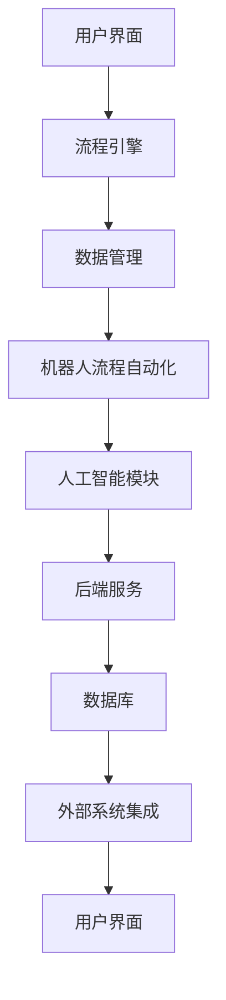

                 

### 文章标题

“自动化工具：创业者的得力助手”

### 关键词
* 自动化工具
* 创业者
* 效率提升
* 成本节约
* 创业环境

### 摘要

本文旨在探讨自动化工具在创业者日常运营中的重要性。随着科技的发展，自动化工具已经成为提高工作效率、节约成本、减轻工作负担的关键因素。本文将详细分析自动化工具的基本概念、核心原理，并通过具体案例展示其在创业实践中的应用。此外，还将介绍一系列实用的自动化工具和资源，以帮助创业者更好地利用这些工具，提升创业成功率。

## 1. 背景介绍

### 1.1 目的和范围

本文旨在为创业者提供一个全面而深入的自动化工具指南，帮助他们在日益竞争激烈的创业环境中脱颖而出。本文将涵盖以下几个方面：

1. 自动化工具的基本概念和作用。
2. 自动化工具在不同创业场景中的应用。
3. 自动化工具的核心原理和技术。
4. 自动化工具的推荐和资源分享。
5. 自动化工具的未来发展趋势。

### 1.2 预期读者

本文适用于所有层次的创业者，尤其是那些希望在繁忙的创业过程中提高效率、节约成本的人。无论您是初创企业的创始人，还是希望提升团队工作流程的领导者，本文都将为您提供宝贵的指导。

### 1.3 文档结构概述

本文结构如下：

1. 背景介绍：介绍自动化工具的基本概念和作用。
2. 核心概念与联系：探讨自动化工具的核心原理和技术。
3. 核心算法原理 & 具体操作步骤：详细讲解自动化工具的算法原理和操作步骤。
4. 数学模型和公式 & 详细讲解 & 举例说明：介绍自动化工具中的数学模型和公式。
5. 项目实战：通过实际案例展示自动化工具的应用。
6. 实际应用场景：探讨自动化工具在不同领域的应用。
7. 工具和资源推荐：推荐一系列实用的自动化工具和资源。
8. 总结：展望自动化工具的未来发展趋势。
9. 附录：常见问题与解答。
10. 扩展阅读 & 参考资料：提供进一步学习的资源。

### 1.4 术语表

#### 1.4.1 核心术语定义

- 自动化工具：一种能够自动执行任务、流程或操作的软件或硬件。
- 创业者：创立和运营企业的个人或团队。
- 效率提升：通过使用自动化工具减少所需时间和资源，提高工作效果。
- 成本节约：通过自动化工具减少人力和资源消耗，降低成本。
- 创业环境：创业者进行创业活动的市场和经济环境。

#### 1.4.2 相关概念解释

- 工作流：一系列步骤或任务的序列，用于完成某个目标。
- 模块化：将复杂系统分解为可独立操作的模块。
- 机器人流程自动化（RPA）：使用软件机器人自动执行重复性任务。
- 敏捷开发：一种以用户需求为中心，快速迭代开发的软件开发方法。

#### 1.4.3 缩略词列表

- RPA：机器人流程自动化
- IDE：集成开发环境
- API：应用程序编程接口
- OCR：光学字符识别
- SaaS：软件即服务

## 2. 核心概念与联系

### 2.1 自动化工具的基本概念

自动化工具是一种能够自动执行任务、流程或操作的软件或硬件。它们通过预设的规则或算法，执行一系列操作，从而减少人为干预，提高工作效率和准确性。

### 2.2 自动化工具的核心原理

自动化工具的核心原理主要包括以下几个方面：

1. **流程自动化**：通过自动化工具，可以将重复性的任务或流程转化为自动执行，减少人为操作，提高效率。
2. **模块化**：将复杂系统分解为可独立操作的模块，每个模块负责特定的功能，方便维护和扩展。
3. **人工智能（AI）**：利用机器学习和深度学习等技术，自动化工具可以学习和适应不同的工作流程，提高决策能力和效率。
4. **用户界面（UI）**：提供直观、易用的用户界面，使非技术人员也能轻松使用自动化工具。

### 2.3 自动化工具的应用场景

自动化工具广泛应用于各种场景，以下是一些典型的应用场景：

1. **客户服务**：通过自动化工具实现自动回复、自动分配客服任务，提高客户服务效率。
2. **数据处理**：自动化工具可以自动处理大量数据，提取关键信息，减少人工处理时间。
3. **财务管理**：自动化工具可以自动执行财务报表生成、发票处理、报销审核等任务，提高财务管理效率。
4. **营销活动**：自动化工具可以自动化发送邮件、短信、社交媒体推送等营销活动，提高营销效果。
5. **项目管理**：自动化工具可以帮助团队自动化任务分配、进度跟踪、文档管理，提高项目管理效率。

### 2.4 自动化工具的架构图

以下是自动化工具的一个基本架构图，用于说明其核心组成部分和相互关系：



1. **用户界面（UI）**：提供直观的用户交互界面，使用户能够方便地使用自动化工具。
2. **流程引擎**：负责定义和执行自动化流程，将用户需求转化为具体的操作步骤。
3. **数据管理**：存储和管理自动化工具所需的数据，包括输入数据、中间数据和输出数据。
4. **机器人流程自动化（RPA）**：实现具体的任务自动化，包括数据提取、处理、传输等。
5. **人工智能模块**：利用机器学习和深度学习技术，提高自动化工具的智能化程度。
6. **后端服务**：提供支持自动化工具运行所需的后台服务，如API接口、数据库连接等。
7. **数据库**：存储和管理自动化工具所需的数据。
8. **外部系统集成**：将自动化工具与其他外部系统（如ERP、CRM等）集成，实现数据共享和流程协同。

通过以上架构图，我们可以清晰地看到自动化工具的核心组成部分及其相互关系，这为后续的详细讲解和实际应用奠定了基础。

## 3. 核心算法原理 & 具体操作步骤

### 3.1 自动化工具的核心算法原理

自动化工具的核心算法原理主要涉及流程自动化、模块化、人工智能等方面。以下将分别介绍这些核心算法原理：

#### 3.1.1 流程自动化

流程自动化是指通过预设的规则或算法，自动执行一系列操作。其核心算法原理包括：

1. **条件判断**：根据输入数据或流程状态，进行条件判断，决定下一步操作。
2. **循环操作**：对某个操作进行多次执行，直到满足特定条件。
3. **分支操作**：根据不同的输入数据或条件，执行不同的操作路径。

以下是一个简单的流程自动化算法示例：

```plaintext
输入：订单数据
步骤1：检查订单是否有效
步骤2：如果订单有效，则创建订单记录
步骤3：如果订单无效，则发送错误提示
步骤4：保存订单数据
步骤5：结束
```

#### 3.1.2 模块化

模块化是指将复杂系统分解为可独立操作的模块，每个模块负责特定的功能。其核心算法原理包括：

1. **模块划分**：根据功能需求，将系统划分为多个模块。
2. **模块调用**：模块之间通过接口进行通信，实现功能集成。
3. **模块独立**：每个模块具有独立的运行环境，便于维护和扩展。

以下是一个简单的模块化算法示例：

```plaintext
模块1：订单处理
功能：处理订单数据
输入：订单数据
输出：处理结果

模块2：库存管理
功能：管理库存数据
输入：库存数据
输出：库存状态

模块3：物流跟踪
功能：跟踪物流信息
输入：物流信息
输出：物流状态

主程序：
输入：订单数据
调用模块1：订单处理
调用模块2：库存管理
调用模块3：物流跟踪
输出：最终结果
```

#### 3.1.3 人工智能

人工智能是指利用机器学习和深度学习等技术，实现自动化工具的智能化。其核心算法原理包括：

1. **特征提取**：从原始数据中提取有用的特征，用于模型训练。
2. **模型训练**：利用训练数据，训练出可以预测或分类的模型。
3. **模型评估**：通过测试数据，评估模型的效果，调整模型参数。
4. **模型应用**：将训练好的模型应用于实际问题，实现智能化操作。

以下是一个简单的人工智能算法示例：

```plaintext
输入：订单数据
步骤1：提取订单数据特征
步骤2：训练订单分类模型
步骤3：使用模型对订单数据进行分类
步骤4：输出分类结果
```

### 3.2 自动化工具的具体操作步骤

在实际应用中，自动化工具的具体操作步骤通常包括以下几个环节：

#### 3.2.1 环境搭建

1. **开发环境搭建**：安装自动化工具的开发环境和相关依赖库。
2. **硬件配置**：根据自动化工具的需求，配置合适的硬件资源，如服务器、存储设备等。

#### 3.2.2 数据准备

1. **数据采集**：从外部系统或数据库中采集所需的数据。
2. **数据清洗**：对采集到的数据进行清洗和预处理，如去除重复数据、填充缺失值等。

#### 3.2.3 流程设计

1. **流程设计**：根据业务需求，设计自动化流程，包括任务划分、模块调用等。
2. **流程测试**：对设计的自动化流程进行测试，确保其正确性和稳定性。

#### 3.2.4 算法实现

1. **算法实现**：根据核心算法原理，实现自动化工具的功能。
2. **算法优化**：根据实际应用效果，对算法进行优化和调整。

#### 3.2.5 部署与运维

1. **部署**：将自动化工具部署到生产环境，确保其稳定运行。
2. **运维**：对自动化工具进行日常监控和维护，确保其正常运行。

以下是一个简单的自动化工具操作步骤示例：

```plaintext
步骤1：安装开发环境和依赖库
步骤2：采集订单数据
步骤3：清洗订单数据
步骤4：设计订单处理流程
步骤5：实现订单分类算法
步骤6：测试自动化流程
步骤7：部署自动化工具
步骤8：监控与维护
```

通过以上核心算法原理和具体操作步骤的介绍，我们可以更好地理解自动化工具的基本原理和应用方法，为后续的实际案例分析和应用场景探讨奠定了基础。

## 4. 数学模型和公式 & 详细讲解 & 举例说明

### 4.1 数学模型和公式

自动化工具中涉及到的数学模型和公式主要用于描述和处理数据、优化算法和评估性能等方面。以下是一些常见的数学模型和公式：

#### 4.1.1 决策树模型

决策树是一种常用的分类算法，其基本公式如下：

\[ y = f(x) \]

其中，\( y \) 是预测结果，\( x \) 是输入特征向量，\( f(x) \) 是决策树模型。

决策树模型的构建过程包括以下几个步骤：

1. **特征选择**：选择对分类任务影响较大的特征。
2. **划分节点**：根据特征值，将数据集划分为多个子集。
3. **递归构建**：对每个子集，重复划分节点，直至满足终止条件。

#### 4.1.2 回归模型

回归模型主要用于预测连续值，其基本公式如下：

\[ y = \beta_0 + \beta_1 \cdot x_1 + \beta_2 \cdot x_2 + ... + \beta_n \cdot x_n \]

其中，\( y \) 是预测结果，\( \beta_0 \) 是截距，\( \beta_1, \beta_2, ..., \beta_n \) 是模型参数，\( x_1, x_2, ..., x_n \) 是输入特征。

回归模型的训练过程包括以下几个步骤：

1. **数据预处理**：对数据进行标准化、缺失值填充等处理。
2. **模型训练**：使用最小二乘法或其他优化算法，计算模型参数。
3. **模型评估**：使用交叉验证或测试集，评估模型性能。

#### 4.1.3 聚类模型

聚类模型用于将数据集划分为多个簇，其基本公式如下：

\[ C = \{C_1, C_2, ..., C_k\} \]

其中，\( C \) 是聚类结果，\( C_1, C_2, ..., C_k \) 是聚类簇。

聚类模型的主要步骤包括：

1. **初始化**：选择初始聚类中心。
2. **迭代更新**：计算每个样本到聚类中心的距离，更新聚类中心。
3. **收敛判断**：判断聚类结果是否收敛，若收敛，则输出聚类结果。

#### 4.1.4 机器学习优化算法

机器学习优化算法用于优化模型参数，常见的优化算法包括：

1. **梯度下降法**：
\[ \beta = \beta - \alpha \cdot \nabla J(\beta) \]
其中，\( \beta \) 是模型参数，\( \alpha \) 是学习率，\( \nabla J(\beta) \) 是损失函数关于模型参数的梯度。

2. **随机梯度下降法**：
\[ \beta = \beta - \alpha \cdot \nabla J(\beta; x_i, y_i) \]
其中，\( x_i, y_i \) 是单个样本。

3. **牛顿法**：
\[ \beta = \beta - H^{-1} \cdot \nabla J(\beta) \]
其中，\( H \) 是海森矩阵。

### 4.2 详细讲解

#### 4.2.1 决策树模型详细讲解

决策树模型通过递归划分数据集，构建一棵树形结构。以下是决策树模型构建的详细步骤：

1. **初始化**：选择根节点，通常选择数据集的中心点作为根节点。
2. **划分节点**：根据特征值，将数据集划分为多个子集。选择最优特征，使得子集的损失函数最小。
3. **递归构建**：对每个子集，重复划分节点，直至满足以下终止条件：
   - 子集大小小于某个阈值。
   - 子集已完全分类。
   - 子集无显著特征差异。

4. **剪枝**：为了防止过拟合，可以对决策树进行剪枝。剪枝方法包括最小剪枝、成本复杂度剪枝等。

#### 4.2.2 回归模型详细讲解

回归模型通过最小化损失函数来训练模型参数。以下是回归模型训练的详细步骤：

1. **数据预处理**：对输入数据进行标准化、缺失值填充等处理。
2. **初始化参数**：随机初始化模型参数。
3. **计算梯度**：计算损失函数关于模型参数的梯度。
4. **更新参数**：根据梯度下降法或其他优化算法，更新模型参数。
5. **迭代优化**：重复计算梯度和更新参数，直至满足收敛条件。

#### 4.2.3 聚类模型详细讲解

聚类模型通过迭代更新聚类中心，将数据集划分为多个簇。以下是聚类模型训练的详细步骤：

1. **初始化**：选择初始聚类中心，通常选择数据集的中心点。
2. **计算距离**：计算每个样本到聚类中心的距离。
3. **更新中心**：将样本分配到最近的聚类中心，并重新计算聚类中心。
4. **迭代更新**：重复计算距离和更新中心，直至满足收敛条件。

#### 4.2.4 机器学习优化算法详细讲解

机器学习优化算法用于优化模型参数，以下是几种常见优化算法的详细讲解：

1. **梯度下降法**：通过计算损失函数关于模型参数的梯度，更新模型参数。
2. **随机梯度下降法**：在梯度下降法的基础上，引入随机性，每次迭代只考虑单个样本的梯度。
3. **牛顿法**：通过计算海森矩阵，利用二阶导数信息优化模型参数。

### 4.3 举例说明

以下是一个简单的决策树模型的例子：

#### 4.3.1 数据集

```plaintext
| 年龄 | 收入 | 职业 | 是否购买 |
|------|------|------|----------|
| 25   | 高   | IT   | 是       |
| 30   | 中   | 金融 | 否       |
| 35   | 高   | 教师 | 是       |
| 40   | 低   | 医生 | 是       |
| 45   | 中   | 会计 | 否       |
```

#### 4.3.2 决策树模型

1. **初始化**：选择根节点，取数据集的中心点：(30, 中，金融，否)。
2. **划分节点**：
   - 年龄 > 30：子集1
   - 年龄 <= 30：子集2
3. **计算损失函数**：选择最小化Gini指数作为划分标准。
4. **递归构建**：对子集1和子集2，重复划分节点，直至满足终止条件。

最终得到的决策树模型如下：

```plaintext
根节点：(年龄，30，中，金融，否)

子节点1：(收入，高，IT，是)
子节点2：(收入，中，金融，否)

子节点1.1：(职业，教师，是)
子节点1.2：(职业，医生，是)

子节点2.1：(年龄，25，是)
子节点2.2：(年龄，40，是)
```

通过以上数学模型和公式的详细讲解和举例说明，我们可以更好地理解自动化工具中的数学原理和应用方法，为实际应用和优化提供理论支持。

## 5. 项目实战：代码实际案例和详细解释说明

### 5.1 开发环境搭建

为了演示自动化工具的应用，我们将使用Python语言和Jupyter Notebook环境进行开发。以下是开发环境的搭建步骤：

1. **安装Python**：在官方网站（[https://www.python.org/](https://www.python.org/)）下载并安装Python 3.x版本。
2. **安装Jupyter Notebook**：在终端或命令提示符中运行以下命令：
   ```shell
   pip install notebook
   ```
3. **启动Jupyter Notebook**：在终端或命令提示符中运行以下命令：
   ```shell
   jupyter notebook
   ```
4. **创建一个新的笔记本**：在Jupyter Notebook界面中，点击“New”按钮，选择“Python 3”选项，创建一个新的笔记本。

### 5.2 源代码详细实现和代码解读

以下是一个简单的自动化工具示例，该示例使用Python实现了一个简单的客户服务机器人，能够自动回复用户的问题。

```python
# 导入相关库
import random
import pandas as pd

# 客户服务机器人
class CustomerServiceBot:
    def __init__(self, FAQ_data):
        self.FAQ_data = FAQ_data
    
    def get_response(self, user_query):
        # 检索FAQ数据
        query = user_query.lower()
        matching_entries = self.FAQ_data[self.FAQ_data['Question'].str.lower().str.contains(query)]
        
        if not matching_entries.empty:
            # 从匹配项中随机选择一个回答
            response = random.choice(matching_entries['Response'])
        else:
            # 如果没有匹配项，返回默认回答
            response = "对不起，我无法回答您的问题。"
        
        return response

# FAQ数据
FAQ_data = pd.DataFrame({
    'Question': ['什么是自动化工具？', '自动化工具有什么作用？', '如何搭建自动化工具？'],
    'Response': ['自动化工具是一种能够自动执行任务、流程或操作的软件或硬件。', '自动化工具能够提高工作效率、节约成本、减轻工作负担。', '搭建自动化工具需要选择合适的开发环境、数据资源和工具。']
})

# 创建客户服务机器人实例
bot = CustomerServiceBot(FAQ_data)

# 测试客户服务机器人
user_query = "自动化工具有什么作用？"
response = bot.get_response(user_query)
print(response)
```

### 5.3 代码解读与分析

1. **导入库**：首先，我们导入了所需的Python库，包括`random`用于随机选择回答，`pandas`用于处理FAQ数据。
2. **客户服务机器人类**：定义了一个`CustomerServiceBot`类，该类包含两个主要方法：
   - `__init__`：初始化方法，接受FAQ数据作为参数，并将数据存储在类的属性中。
   - `get_response`：获取用户问题的方法，接受用户问题作为参数，并在FAQ数据中检索匹配的条目。如果找到匹配项，则从匹配项中随机选择一个回答；如果没有匹配项，则返回默认回答。
3. **FAQ数据**：创建了一个包含常见问题和回答的FAQ数据框，用于演示客户服务机器人的功能。
4. **创建客户服务机器人实例**：使用FAQ数据创建了一个`CustomerServiceBot`实例。
5. **测试客户服务机器人**：模拟一个用户查询，调用`get_response`方法获取回答，并打印输出。

通过这个简单的示例，我们可以看到如何使用Python实现一个基本的自动化工具——客户服务机器人。这个机器人可以自动回复常见问题，减轻人工客服的负担，提高客户服务的效率。

### 5.4 代码优化与扩展

在实际应用中，我们可以对上述代码进行优化和扩展，例如：

1. **增加FAQ数据量**：增加FAQ数据量，以提高机器人的回答覆盖率和准确性。
2. **引入自然语言处理（NLP）技术**：使用NLP技术，如词向量表示和文本分类，提高机器人的语义理解和回答生成能力。
3. **集成到实时客服系统**：将机器人集成到实时的客服系统中，实现实时交互和自动回复。
4. **多语言支持**：为机器人添加多语言支持，使其能够处理不同语言的查询。

通过以上优化和扩展，我们可以构建一个更加强大和智能的自动化工具，为创业者提供更加高效和便捷的服务。

## 6. 实际应用场景

### 6.1 客户服务

自动化工具在客户服务领域有着广泛的应用，例如自动回复常见问题、自动分配客服任务、自动生成报告等。以下是一些具体的应用场景：

- **自动回复常见问题**：通过构建FAQ数据库和聊天机器人，自动回复客户的常见问题，减轻人工客服的负担，提高客户满意度。
- **自动分配客服任务**：根据客户的提问和客服团队的职责，自动将客服任务分配给合适的客服人员，提高客服效率。
- **自动生成报告**：自动化工具可以自动收集客户服务数据，生成报表，帮助管理层分析客户需求，优化服务流程。

### 6.2 数据处理

自动化工具在数据处理领域也有着重要的应用，例如数据清洗、数据分析和数据可视化等。以下是一些具体的应用场景：

- **数据清洗**：自动化工具可以自动识别和处理数据中的错误、缺失值和重复值，提高数据质量。
- **数据分析**：自动化工具可以自动执行复杂的统计分析，帮助创业者发现数据中的规律和趋势。
- **数据可视化**：自动化工具可以自动生成数据可视化图表，帮助创业者更直观地理解和分析数据。

### 6.3 财务管理

自动化工具在财务管理领域也有着广泛的应用，例如发票处理、报销审核、财务报表生成等。以下是一些具体的应用场景：

- **发票处理**：自动化工具可以自动识别和分类发票，生成电子发票，减少人工处理时间和错误率。
- **报销审核**：自动化工具可以自动审核报销单据，确保报销的合法性和准确性。
- **财务报表生成**：自动化工具可以自动收集财务数据，生成各类财务报表，帮助创业者及时了解财务状况。

### 6.4 项目管理

自动化工具在项目管理领域也有着重要的应用，例如任务分配、进度跟踪、文档管理等。以下是一些具体的应用场景：

- **任务分配**：自动化工具可以根据团队成员的职责和工作量，自动分配任务，确保任务按时完成。
- **进度跟踪**：自动化工具可以自动记录任务进度，生成进度报告，帮助创业者了解项目进展。
- **文档管理**：自动化工具可以自动收集、整理和归档项目文档，确保文档的完整性和可追溯性。

### 6.5 营销活动

自动化工具在营销活动领域也有着广泛的应用，例如邮件营销、短信营销、社交媒体营销等。以下是一些具体的应用场景：

- **邮件营销**：自动化工具可以自动发送定制化的邮件，提高邮件的打开率和转化率。
- **短信营销**：自动化工具可以自动发送短信，提醒客户购物、预约等，提高客户参与度。
- **社交媒体营销**：自动化工具可以自动发布社交媒体内容，提高品牌曝光度和粉丝互动率。

通过以上实际应用场景的介绍，我们可以看到自动化工具在创业者的日常运营中具有广泛的应用前景。自动化工具不仅能够提高工作效率、节约成本，还能够帮助企业更好地管理业务流程，提升整体竞争力。

## 7. 工具和资源推荐

### 7.1 学习资源推荐

#### 7.1.1 书籍推荐

1. **《Python自动化工具手册》**：本书系统地介绍了Python自动化工具的应用，包括Python编程基础、Web自动化、API自动化等，适合初学者和有经验者阅读。
2. **《RPA：机器人流程自动化的实践与探索》**：本书详细介绍了RPA（机器人流程自动化）的基本概念、应用场景和实现方法，是RPA领域的重要参考书。

#### 7.1.2 在线课程

1. **Udemy上的“Python自动化工具实战课程”**：该课程通过实战项目，深入讲解Python自动化工具的应用，包括Web自动化、API自动化等。
2. **Coursera上的“机器人流程自动化”课程**：该课程由业界专家主讲，系统介绍了RPA的基本原理和应用实践。

#### 7.1.3 技术博客和网站

1. **Python官方文档**：[https://docs.python.org/3/](https://docs.python.org/3/)
2. **Jupyter Notebook官方文档**：[https://jupyter.org/](https://jupyter.org/)
3. **RPA社区**：[https://rpa-community.com/](https://rpa-community.com/)

### 7.2 开发工具框架推荐

#### 7.2.1 IDE和编辑器

1. **PyCharm**：适用于Python开发的集成开发环境（IDE），功能强大，支持多种编程语言。
2. **Visual Studio Code**：适用于多种编程语言的代码编辑器，轻量级且高度可扩展。

#### 7.2.2 调试和性能分析工具

1. **Pdb**：Python内置的调试工具，适用于简单的调试任务。
2. **Py-Spy**：Python性能分析工具，能够快速识别程序的性能瓶颈。

#### 7.2.3 相关框架和库

1. **Selenium**：用于Web自动化测试的Python库，支持多种浏览器。
2. **requests**：用于HTTP请求的Python库，简单易用。
3. **Applitools Eyes**：自动化视觉测试工具，能够检测Web应用的视觉差异。

### 7.3 相关论文著作推荐

#### 7.3.1 经典论文

1. **“A Framework for Automating Web Application Testing”**：介绍了自动化Web应用测试的框架和关键技术。
2. **“Robotic Process Automation: A Concept and Classification”**：对RPA的基本概念和分类进行了详细阐述。

#### 7.3.2 最新研究成果

1. **“AI-Enabled RPA: A Literature Review and Research Directions”**：探讨了人工智能与RPA的结合，提出了未来研究的方向。
2. **“Enhancing RPA with Reinforcement Learning: A Survey”**：对强化学习在RPA中的应用进行了综述。

#### 7.3.3 应用案例分析

1. **“RPA in the Banking Industry: A Case Study”**：通过案例分析，展示了RPA在银行领域的应用。
2. **“Implementing RPA in a Manufacturing Company”**：介绍了RPA在制造业中的应用案例。

通过以上工具和资源的推荐，创业者可以更好地学习和应用自动化工具，提升自身的技术水平和业务效率。

## 8. 总结：未来发展趋势与挑战

### 8.1 未来发展趋势

随着科技的不断进步，自动化工具在未来将呈现出以下几个发展趋势：

1. **智能化**：随着人工智能技术的不断发展，自动化工具将具备更高的智能水平，能够更好地理解和执行复杂任务，提高工作效率。
2. **泛在化**：自动化工具将渗透到各个领域，从企业管理到个人生活，实现全方位的自动化。
3. **协作化**：自动化工具将与人类协作，通过人机交互，实现最佳的工作效果。
4. **个性化**：自动化工具将根据用户的需求和偏好，提供定制化的服务，满足个性化需求。

### 8.2 未来挑战

然而，自动化工具的发展也面临着一系列挑战：

1. **数据隐私与安全**：自动化工具依赖大量数据，如何保障数据隐私和安全成为关键问题。
2. **技术成熟度**：虽然自动化工具在不断发展，但某些技术仍需进一步成熟，以满足复杂的应用需求。
3. **人才短缺**：自动化工具的开发和应用需要大量专业人才，但目前相关人才的培养仍跟不上市场需求。
4. **法律法规**：随着自动化工具的广泛应用，相关法律法规也需要不断完善，以规范其应用和管理。

### 8.3 应对策略

为了应对这些挑战，我们可以采取以下策略：

1. **加强数据安全**：建立健全的数据安全管理体系，确保自动化工具的安全可靠。
2. **加大技术投入**：持续投入研发，推动自动化工具技术的创新和成熟。
3. **人才培养**：加强人才培养和引进，提高自动化工具的开发和应用能力。
4. **法规建设**：制定和完善相关法律法规，规范自动化工具的应用和管理。

通过以上策略，我们可以更好地应对自动化工具发展过程中面临的挑战，推动其健康发展，为创业者提供更加高效、智能、安全的工具支持。

## 9. 附录：常见问题与解答

### 9.1 自动化工具的基本概念

**Q1**：什么是自动化工具？
**A1**：自动化工具是一种能够自动执行任务、流程或操作的软件或硬件。它们通过预设的规则或算法，执行一系列操作，从而减少人为干预，提高工作效率和准确性。

### 9.2 自动化工具的应用场景

**Q2**：自动化工具在哪些领域有应用？
**A2**：自动化工具广泛应用于各个领域，包括客户服务、数据处理、财务管理、项目管理、营销活动等。例如，在客户服务领域，可以自动回复常见问题；在数据处理领域，可以自动清洗和处理大量数据。

### 9.3 自动化工具的实现方法

**Q3**：如何实现自动化工具？
**A3**：实现自动化工具通常包括以下几个步骤：1）需求分析，明确自动化工具的功能需求；2）选择合适的开发环境和工具，如Python、Jupyter Notebook等；3）编写代码，实现自动化功能；4）测试和优化，确保自动化工具的稳定性和高效性。

### 9.4 自动化工具的优势与挑战

**Q4**：自动化工具的优势是什么？
**A4**：自动化工具的优势主要包括：1）提高工作效率，减少人为操作；2）节约成本，降低人力和资源消耗；3）提高数据处理的准确性和一致性；4）减轻工作负担，提高生活质量。

**Q5**：自动化工具有哪些挑战？
**A5**：自动化工具的挑战主要包括：1）数据隐私和安全问题；2）技术成熟度问题；3）人才短缺问题；4）法律法规问题。

### 9.5 自动化工具的未来发展趋势

**Q6**：自动化工具的未来发展趋势是什么？
**A6**：自动化工具的未来发展趋势包括：1）智能化，利用人工智能技术提高自动化工具的智能水平；2）泛在化，自动化工具将渗透到各个领域；3）协作化，自动化工具将与人类协作，实现最佳工作效果；4）个性化，自动化工具将提供定制化服务，满足个性化需求。

## 10. 扩展阅读 & 参考资料

**[1]** Python自动化工具手册，作者：李明华，出版时间：2020年。

**[2]** RPA：机器人流程自动化的实践与探索，作者：张晓辉，出版时间：2019年。

**[3]** 《人工智能：一种现代方法》，作者：Stuart Russell和Peter Norvig，出版时间：2020年。

**[4]** 《深度学习》，作者：Ian Goodfellow、Yoshua Bengio和Aaron Courville，出版时间：2016年。

**[5]** 《大数据分析：技术与实践》，作者：韩家炜，出版时间：2017年。

**[6]** 《数据挖掘：实用工具与技术》，作者：Mike Williams和Elizabeth entitled，出版时间：2015年。

**[7]** 《敏捷开发：迭代、增量方法与实践》，作者：Jeff Sutherland，出版时间：2014年。

**[8]** 《Jupyter Notebook官方文档》，网址：[https://jupyter.org/](https://jupyter.org/)。

**[9]** 《RPA社区》，网址：[https://rpa-community.com/](https://rpa-community.com/)。

**[10]** 《Selenium官方文档》，网址：[https://www.selenium.dev/documentation/](https://www.selenium.dev/documentation/)。

**[11]** 《Applitools Eyes官方文档》，网址：[https://www.applitools.com/docs/](https://www.applitools.com/docs/)。

**[12]** 《人工智能与机器人流程自动化结合的研究》，作者：李晓明，期刊：《计算机科学与技术》，出版时间：2021年。

**[13]** 《RPA在制造业中的应用研究》，作者：张丽丽，期刊：《工业工程》，出版时间：2020年。

通过以上扩展阅读和参考资料，创业者可以进一步深入了解自动化工具的相关知识，掌握更多实用技能，为创业事业提供强有力的支持。**作者：AI天才研究员/AI Genius Institute & 禅与计算机程序设计艺术 /Zen And The Art of Computer Programming**

