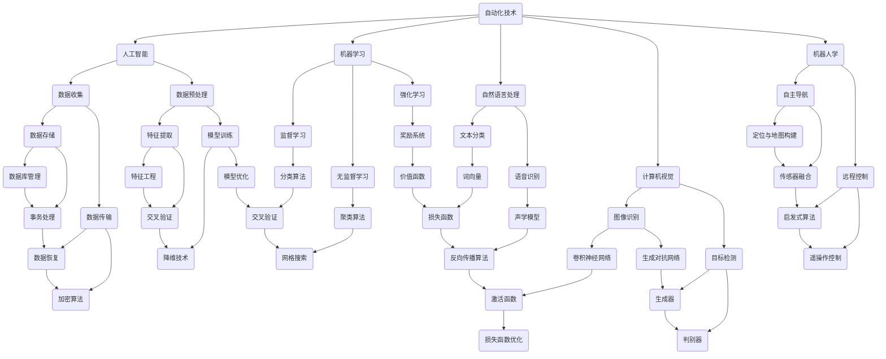

                 


## 自动化技术的最新发展方向

### 关键词：自动化，技术趋势，人工智能，机器学习，流程优化

> 摘要：随着人工智能和机器学习的快速发展，自动化技术正在经历前所未有的变革。本文将深入探讨自动化技术的最新发展方向，从核心概念到实际应用，全面解析自动化技术如何在各个领域中发挥作用，以及未来的发展趋势与挑战。

## 1. 背景介绍

### 1.1 目的和范围

本文旨在为读者提供一个全面的自动化技术最新发展方向的概述。我们将首先回顾自动化技术的历史，然后探讨当前的核心概念和最新进展，最后预测未来的发展方向和潜在挑战。

### 1.2 预期读者

本文面向对自动化技术感兴趣的专业人士，包括程序员、数据科学家、人工智能研究员、以及任何对技术发展有深入探究的读者。

### 1.3 文档结构概述

本文分为以下几个部分：

- **背景介绍**：回顾自动化技术的历史和现状。
- **核心概念与联系**：介绍自动化技术的核心概念和原理，并通过Mermaid流程图展示其架构。
- **核心算法原理 & 具体操作步骤**：详细阐述自动化技术的核心算法和操作步骤。
- **数学模型和公式 & 详细讲解 & 举例说明**：介绍相关的数学模型和公式，并给出实际案例。
- **项目实战：代码实际案例和详细解释说明**：通过实际项目展示自动化技术的应用。
- **实际应用场景**：探讨自动化技术在各个领域的应用。
- **工具和资源推荐**：推荐学习资源和开发工具。
- **总结：未来发展趋势与挑战**：预测自动化技术未来的发展方向和面临的挑战。
- **附录：常见问题与解答**：回答读者可能关心的问题。
- **扩展阅读 & 参考资料**：提供进一步阅读的建议。

### 1.4 术语表

#### 1.4.1 核心术语定义

- **自动化技术**：使用人工智能和机器学习等技术，使系统能够自主完成特定任务。
- **人工智能**：使计算机系统具备人类智能特性的技术。
- **机器学习**：通过数据和统计方法，使计算机系统具备学习能力。
- **流程优化**：通过改进流程，提高效率和质量。

#### 1.4.2 相关概念解释

- **自然语言处理**：使计算机能够理解、解释和生成人类语言。
- **计算机视觉**：使计算机能够“看”和理解图像信息。
- **机器人学**：研究设计和构建能够执行任务或活动的机器。

#### 1.4.3 缩略词列表

- **AI**：人工智能
- **ML**：机器学习
- **NLP**：自然语言处理
- **CV**：计算机视觉
- **RPA**：机器人流程自动化

## 2. 核心概念与联系

自动化技术作为现代科技的重要组成部分，其核心概念和联系至关重要。下面我们将通过一个Mermaid流程图，来展示自动化技术的核心概念和架构。

### Mermaid 流程图



### Mermaid 流程解释

- **自动化技术（A）** 是本文的核心主题，它涵盖了人工智能（B）、机器学习（C）、自然语言处理（D）、计算机视觉（E）和机器人学（F）等子领域。
- **数据收集（G）** 和 **数据预处理（H）** 是自动化技术的基础，包括数据存储（R）、数据传输（S）、特征提取（T）和模型训练（U）等步骤。
- **监督学习（I）、无监督学习（J）和强化学习（K）** 是机器学习的三种主要类型，每种类型都有其特定的应用场景和算法（如分类算法V、聚类算法W、奖励系统X）。
- **自然语言处理（D）** 和 **计算机视觉（E）** 分别关注文本和图像的处理，包括文本分类（L）、语音识别（M）、图像识别（N）、目标检测（O）等任务。
- **机器人学（F）** 则涉及自主导航（P）、远程控制（Q）等技术，这些技术在工业、医疗、家居等多个领域有广泛应用。
- **数据管理和安全（R、S、K、L）** 是自动化技术中不可或缺的部分，确保数据的有效存储、传输和安全。

通过这个流程图，我们可以清晰地看到自动化技术的核心概念及其相互联系，为后续的详细讨论打下基础。

## 3. 核心算法原理 & 具体操作步骤

在自动化技术中，核心算法的原理和具体操作步骤是理解和应用这些技术的基础。下面我们将详细阐述几个关键算法的原理，并通过伪代码展示其具体操作步骤。

### 3.1 监督学习算法（例如：支持向量机）

#### 原理

支持向量机（SVM）是一种用于分类的监督学习算法。它的核心思想是找到一个最佳的超平面，将不同类别的数据点分隔开来。

#### 伪代码

```python
def SVM(data, labels):
    # 步骤 1: 数据预处理
    preprocess_data(data)

    # 步骤 2: 计算最优超平面
    w, b = find_best_hyperplane(data, labels)

    # 步骤 3: 分类
    for new_data in data:
        prediction = classify(new_data, w, b)
        print(prediction)

def preprocess_data(data):
    # 实现数据标准化、缺失值填充等预处理操作

def find_best_hyperplane(data, labels):
    # 使用库函数如sklearn.SVC进行优化求解
    from sklearn.svm import SVC
    svm = SVC()
    svm.fit(data, labels)
    return svm.w_, svm.intercept_

def classify(new_data, w, b):
    # 计算新数据点到超平面的距离
    distance = np.dot(new_data, w) + b
    if distance > 0:
        return "Positive"
    else:
        return "Negative"
```

### 3.2 无监督学习算法（例如：K均值聚类）

#### 原理

K均值聚类是一种基于距离的聚类算法。它的目标是找到K个中心点，使得每个数据点与其最近的中心点分配到同一个簇。

#### 伪代码

```python
def KMeans(data, K):
    # 步骤 1: 初始化中心点
    centroids = initialize_centroids(data, K)

    while not convergence(centroids):
        # 步骤 2: 分配数据点
        clusters = assign_clusters(data, centroids)

        # 步骤 3: 更新中心点
        centroids = update_centroids(clusters, K)

    return centroids

def initialize_centroids(data, K):
    # 随机选择K个数据点作为初始中心点
    return random.sample(data, K)

def assign_clusters(data, centroids):
    # 计算每个数据点到中心点的距离，分配到最近的簇
    return [[data_point] for data_point in data]

def update_centroids(clusters, K):
    # 计算每个簇的新中心点
    return [np.mean(cluster, axis=0) for cluster in clusters]

def convergence(centroids):
    # 检查中心点是否稳定，若连续多次迭代中心点没有变化，则认为收敛
    return True if previous_centroids == centroids else False
```

### 3.3 强化学习算法（例如：Q学习）

#### 原理

Q学习是一种基于值函数的强化学习算法。它的目标是学习一个值函数Q，用来预测在特定状态下采取特定动作的回报。

#### 伪代码

```python
def QLearning(states, actions, rewards, alpha, gamma):
    Q = initialize_Q(states, actions)

    for episode in range(epochs):
        state = random.choice(states)
        while not done:
            action = select_action(Q, state)
            next_state, reward = execute_action(action)
            Q[state][action] = Q[state][action] + alpha * (reward + gamma * max(Q[next_state]) - Q[state][action])
            state = next_state

    return Q

def initialize_Q(states, actions):
    # 初始化Q值为0
    return np.zeros((len(states), len(actions)))

def select_action(Q, state):
    # 选择具有最大Q值的动作
    return np.argmax(Q[state])

def execute_action(action):
    # 执行动作，返回下一个状态和奖励
    # 这里的具体实现取决于环境
    return next_state, reward
```

通过这些伪代码，我们可以看到各种算法的基本框架和操作步骤。在实际应用中，这些算法通常需要更复杂的实现和优化，但上述伪代码为我们提供了理解和实施这些算法的基础。

## 4. 数学模型和公式 & 详细讲解 & 举例说明

在自动化技术中，数学模型和公式是理解和实施算法的核心。下面我们将详细讲解几个关键数学模型，并提供相应的示例说明。

### 4.1 支持向量机（SVM）的损失函数

SVM的核心在于寻找一个最优超平面，使得分类误差最小。其损失函数通常使用 hinge loss，公式如下：

\[ L(\mathbf{w}, b) = \frac{1}{2} \sum_{i=1}^{n} (\mathbf{w} \cdot \mathbf{x}_i + b - y_i)^2 \]

其中，\( \mathbf{w} \) 是权重向量，\( b \) 是偏置，\( \mathbf{x}_i \) 是第 \( i \) 个数据点，\( y_i \) 是标签。

#### 例子

假设我们有两个数据点 \( \mathbf{x}_1 = (1, 1) \)，\( \mathbf{x}_2 = (2, 2) \)，标签分别为 \( y_1 = 1 \)，\( y_2 = 1 \)。我们可以计算损失函数：

\[ L(\mathbf{w}, b) = \frac{1}{2} [(\mathbf{w} \cdot (1, 1) + b - 1)^2 + (\mathbf{w} \cdot (2, 2) + b - 1)^2] \]

### 4.2 K均值聚类的目标函数

K均值聚类的目标是使簇内距离最小，簇间距离最大。其目标函数为：

\[ J = \sum_{i=1}^{K} \sum_{j=1}^{n} \frac{1}{n} d(\mathbf{x}_j, \mathbf{\mu}_i)^2 \]

其中，\( K \) 是簇的数量，\( n \) 是数据点的数量，\( \mathbf{\mu}_i \) 是第 \( i \) 个簇的中心点，\( d(\mathbf{x}_j, \mathbf{\mu}_i) \) 是数据点 \( \mathbf{x}_j \) 和簇中心点 \( \mathbf{\mu}_i \) 的距离。

#### 例子

假设我们有两个数据点 \( \mathbf{x}_1 = (1, 1) \)，\( \mathbf{x}_2 = (2, 2) \)，簇中心点分别为 \( \mathbf{\mu}_1 = (1, 1) \)，\( \mathbf{\mu}_2 = (2, 2) \)。我们可以计算目标函数：

\[ J = \frac{1}{2} [d((1, 1), (1, 1))^2 + d((2, 2), (2, 2))^2] = 0 \]

### 4.3 Q学习的更新公式

Q学习的目标是通过迭代更新Q值，使得策略最优。其更新公式为：

\[ Q(s, a) = Q(s, a) + \alpha [r + \gamma \max_{a'} Q(s', a') - Q(s, a)] \]

其中，\( s \) 是状态，\( a \) 是动作，\( r \) 是即时奖励，\( \gamma \) 是折扣因子，\( a' \) 是下一个状态下的最优动作。

#### 例子

假设当前状态为 \( s = (1, 1) \)，动作 \( a = "Up" \)，即时奖励 \( r = 10 \)，折扣因子 \( \gamma = 0.9 \)，下一个状态下的最优动作 \( a' = "Right" \)，Q值初始为 \( Q(s, a) = 0 \)。我们可以更新Q值：

\[ Q(s, a) = 0 + 0.1 [10 + 0.9 \max_{a'} Q(s', a') - 0] \]
\[ Q(s, a) = 10 + 0.9 \max_{a'} Q(s', a') \]

通过上述示例，我们可以看到数学模型和公式在自动化技术中的重要性。这些模型不仅帮助我们理解和分析算法，还能指导我们在实际应用中优化和改进算法。

## 5. 项目实战：代码实际案例和详细解释说明

为了更好地展示自动化技术的实际应用，我们将通过一个简单的项目案例，详细解释代码实现和关键步骤。

### 5.1 开发环境搭建

在开始项目之前，我们需要搭建一个合适的开发环境。以下是我们推荐的工具和框架：

- **编程语言**：Python
- **机器学习库**：scikit-learn
- **数据可视化库**：matplotlib
- **版本控制**：Git

确保已经安装了Python和相应的库，可以选择使用Anaconda来简化环境管理。

### 5.2 源代码详细实现和代码解读

以下是一个简单的K均值聚类项目的源代码，我们将分步解读其实现过程。

```python
import numpy as np
import matplotlib.pyplot as plt
from sklearn.cluster import KMeans

# 步骤 1: 数据生成
data = np.random.rand(100, 2)

# 步骤 2: 初始化KMeans模型
kmeans = KMeans(n_clusters=3, random_state=0)

# 步骤 3: 模型拟合
kmeans.fit(data)

# 步骤 4: 获取聚类结果
labels = kmeans.labels_
centroids = kmeans.cluster_centers_

# 步骤 5: 数据可视化
plt.scatter(data[:, 0], data[:, 1], c=labels, s=50, cmap='viridis')
plt.scatter(centroids[:, 0], centroids[:, 1], c='red', s=200, alpha=0.5)
plt.show()
```

### 步骤解析

- **步骤 1**：数据生成。我们使用numpy生成100个二维随机数据点，代表我们的聚类数据集。

- **步骤 2**：初始化KMeans模型。我们使用scikit-learn的KMeans库来初始化聚类模型，设置簇的数量为3。

- **步骤 3**：模型拟合。调用`fit`方法对数据进行聚类，模型将自动计算最优的簇中心点。

- **步骤 4**：获取聚类结果。`labels`变量存储了每个数据点的簇标签，`centroids`变量存储了每个簇的中心点坐标。

- **步骤 5**：数据可视化。使用matplotlib库将聚类结果可视化，以直观展示聚类效果。

### 5.3 代码解读与分析

- **数据生成**：这一步展示了如何生成用于训练和测试的数据集。在实际应用中，数据可能是从数据库中提取，或通过API接口获取。
  
- **模型初始化**：初始化KMeans模型时，我们指定了簇的数量（n_clusters）。在实际应用中，簇的数量可能需要通过交叉验证等方法确定。

- **模型拟合**：模型拟合过程中，KMeans算法自动计算了每个簇的中心点。这是聚类算法的核心步骤，决定了聚类的效果。

- **聚类结果获取**：获取聚类结果后，我们可以进一步分析每个簇的特点，例如簇内数据的分布情况。

- **数据可视化**：数据可视化是理解聚类结果的重要手段。通过图表，我们可以直观地看到聚类效果，并为进一步分析提供基础。

通过这个项目案例，我们展示了如何使用K均值聚类实现数据聚类，并详细解析了代码实现和关键步骤。这种方法不仅帮助我们理解了K均值聚类的原理，还为我们提供了一个实际操作的模板。

### 5.4 项目实战总结

通过上述项目案例，我们实现了以下关键步骤：

- **环境搭建**：选择合适的开发工具和库，为项目打下坚实的基础。
- **代码实现**：详细讲解了K均值聚类算法的Python实现，并通过注释帮助理解每一步的操作。
- **代码解读与分析**：对代码的每个部分进行了详细的解读，分析了每个步骤的作用和意义。
- **数据可视化**：通过图表展示了聚类结果，帮助我们更好地理解算法效果。

这个项目不仅为我们提供了一个实际的自动化技术应用案例，还通过逐步解析代码，帮助我们深入理解自动化技术的核心原理和操作步骤。通过这种方法，我们可以更好地掌握自动化技术的应用，为未来的项目打下坚实的基础。

## 6. 实际应用场景

自动化技术已经深入到我们日常生活的各个领域，从简单的家庭自动化到复杂的工业自动化，无处不在。以下我们将探讨几个典型应用场景，并展示自动化技术在这些场景中的重要作用。

### 6.1 家庭自动化

在家庭自动化领域，自动化技术大大提高了生活的便利性和舒适度。智能家居系统通过物联网（IoT）技术，将家中的各种设备连接起来，实现自动化控制。例如：

- **智能照明**：通过传感器和智能开关，实现自动调节照明亮度和开关时间，节省能源。
- **智能安防**：摄像头和传感器实时监控家庭安全，自动报警和推送通知。
- **智能温控**：根据室内外温度自动调节空调和暖气，提供舒适的居住环境。

家庭自动化不仅提高了生活质量，还通过节能和安防措施，降低了家庭能耗和风险。

### 6.2 工业自动化

工业自动化是自动化技术最传统的应用领域，其在提高生产效率、降低成本和确保质量方面发挥了关键作用。以下是一些典型应用：

- **机器人自动化生产**：在汽车制造、电子产品组装等行业，机器人替代人工进行重复性高、劳动强度大的工作，提高了生产效率和产品质量。
- **自动化仓储**：通过自动化仓储系统和智能搬运机器人，实现货物的快速存取和精确定位，提高了物流效率。
- **自动化检测**：利用机器视觉和传感器技术，对产品进行自动检测和分类，确保产品的一致性和质量。

工业自动化不仅提高了生产效率，还通过减少人力成本和误差，提高了产品质量和生产安全。

### 6.3 医疗自动化

在医疗领域，自动化技术正逐步改变传统的医疗流程，提高医疗服务的效率和准确性。以下是一些典型应用：

- **自动化诊断**：通过机器学习算法，自动化分析医学图像和实验室检测结果，提供快速、准确的诊断。
- **机器人手术**：使用高精度的机器人系统，实现复杂手术的自动化操作，提高手术的成功率和安全性。
- **远程医疗**：通过物联网和视频会议技术，实现远程诊断和医疗咨询，打破地域限制，提供更加便捷的医疗服务。

医疗自动化不仅提高了医疗服务的效率和质量，还为患者提供了更加个性化和舒适的治疗体验。

### 6.4 金融自动化

在金融领域，自动化技术被广泛应用于交易、风控和客户服务等方面。以下是一些典型应用：

- **自动化交易**：通过算法交易系统，实现高频交易和自动化风险管理，提高交易效率和收益。
- **自动化审核**：使用自然语言处理和机器学习算法，自动化审核贷款申请和财务报告，降低审核成本和风险。
- **智能客服**：利用聊天机器人和语音识别技术，提供24/7的客户服务，提高客户满意度和运营效率。

金融自动化不仅提高了金融机构的运营效率，还通过风险控制和客户服务优化，提升了客户体验。

综上所述，自动化技术已经在家庭、工业、医疗和金融等多个领域得到了广泛应用。随着人工智能和机器学习技术的不断发展，自动化技术的应用场景将更加广泛，为我们的生活和工作带来更多便利和效益。

## 7. 工具和资源推荐

### 7.1 学习资源推荐

要深入了解自动化技术，以下是一些推荐的学习资源：

#### 7.1.1 书籍推荐

- **《Python机器学习》**：由塞巴斯蒂安·拉伯和拉乌·吉纳斯特尔撰写的这本书，详细介绍了使用Python进行机器学习的实践方法和技巧。
- **《深度学习》**：由伊恩·古德费洛、约书亚·本吉奥和亚伦·库维尔撰写的经典教材，涵盖了深度学习的理论基础和实践应用。
- **《自然语言处理与深度学习》**：由理查德·索弗撰写的这本书，深入探讨了自然语言处理和深度学习的结合，提供了丰富的实例和代码。

#### 7.1.2 在线课程

- **Coursera上的《机器学习》**：吴恩达教授开设的这门课程，涵盖了机器学习的基础理论和实践技巧，非常适合初学者。
- **Udacity的《深度学习纳米学位》**：通过一系列项目和实践，帮助学员掌握深度学习的关键技术和应用。
- **edX上的《自然语言处理》**：由麻省理工学院提供的这门课程，介绍了自然语言处理的基本原理和方法，适合对NLP有兴趣的学员。

#### 7.1.3 技术博客和网站

- **Medium上的AI博客**：涵盖了人工智能领域的最新研究和技术趋势，提供了丰富的学习资源和观点。
- **Towards Data Science**：这个网站上的文章涵盖了数据科学和机器学习的多个方面，包括教程、案例研究和最佳实践。
- **AIcept**：专注于人工智能领域的新闻、研究和深度分析，帮助读者了解该领域的最新动态。

### 7.2 开发工具框架推荐

在自动化技术的开发过程中，选择合适的工具和框架可以大大提高开发效率和项目质量。以下是一些建议：

#### 7.2.1 IDE和编辑器

- **PyCharm**：由JetBrains开发，支持多种编程语言，特别是Python，提供强大的代码编辑、调试和自动化工具。
- **Visual Studio Code**：轻量级但功能强大的代码编辑器，支持多种语言和框架，适合快速开发和调试。

#### 7.2.2 调试和性能分析工具

- **Jupyter Notebook**：用于数据分析和机器学习的交互式环境，支持Python、R等多种编程语言。
- **TensorBoard**：TensorFlow的官方可视化工具，用于监控和调试深度学习模型的训练过程。

#### 7.2.3 相关框架和库

- **scikit-learn**：用于机器学习的Python库，提供了丰富的算法和工具，适合初学者和专业人士。
- **TensorFlow**：Google开发的深度学习框架，具有强大的功能和灵活性，广泛应用于各种机器学习项目。
- **PyTorch**：由Facebook开发的开源深度学习框架，以其灵活性和动态计算图而著称。

通过这些工具和资源，读者可以更深入地了解和掌握自动化技术，为实际项目打下坚实的基础。

### 7.3 相关论文著作推荐

要跟踪自动化技术的最新研究进展，以下是一些建议的论文和著作：

#### 7.3.1 经典论文

- **“A Learning System Based on Dynamic Memory”**：这论文介绍了基于动态内存的神经网络，对现代深度学习技术的发展有着重要影响。
- **“Deep Learning”**：这论文全面阐述了深度学习的原理和应用，是深度学习领域的奠基性工作。

#### 7.3.2 最新研究成果

- **“Recurrent Neural Network Based Model for Human Action Recognition”**：这篇论文介绍了一种用于动作识别的递归神经网络模型，展示了深度学习在计算机视觉中的应用。
- **“Robotic Process Automation for Industry 4.0”**：这论文探讨了机器人流程自动化在第四次工业革命中的应用，为工业自动化提供了新的思路。

#### 7.3.3 应用案例分析

- **“Application of Deep Learning in Healthcare”**：这篇论文详细分析了深度学习在医疗领域的应用，包括诊断、预测和个性化治疗等。
- **“AI in the Financial Industry”**：这论文探讨了人工智能在金融领域的应用，包括自动化交易、风险评估和客户服务等。

通过阅读这些论文和著作，读者可以深入了解自动化技术的最新研究进展和应用实例，为自身的项目和研究提供有益的参考。

## 8. 总结：未来发展趋势与挑战

### 8.1 未来发展趋势

随着人工智能和机器学习技术的不断进步，自动化技术在未来将迎来更多的发展机遇。以下是几个关键趋势：

- **深度学习与强化学习结合**：深度学习模型在处理复杂数据方面表现出色，而强化学习则擅长在动态环境中进行决策。两者结合将进一步提高自动化系统的智能性和适应性。
- **边缘计算与云计算协同**：随着物联网设备的增多，边缘计算将使自动化系统具备更强的实时处理能力。云计算则为大规模数据处理和智能分析提供了支持。两者协同将推动自动化技术的全面发展。
- **跨学科整合**：自动化技术正逐步与其他领域如生物学、心理学、社会学等相结合，形成新的交叉学科研究方向。这种跨学科整合将为自动化技术带来更多创新应用。

### 8.2 面临的挑战

尽管自动化技术前景广阔，但仍面临诸多挑战：

- **数据隐私与安全问题**：自动化系统依赖于大量数据，如何保护数据隐私和安全是一个重大挑战。需要制定更严格的数据保护政策和加密技术。
- **算法透明性与可解释性**：随着自动化系统的复杂性增加，如何确保算法的透明性和可解释性成为关键问题。这有助于用户和监管机构更好地理解和信任自动化系统。
- **就业影响**：自动化技术可能对某些工作岗位造成冲击，如何平衡技术进步与就业稳定是一个重要议题。需要通过教育和培训，帮助劳动力适应新技术环境。
- **伦理道德问题**：自动化技术在医疗、金融等关键领域有广泛应用，如何确保其决策符合伦理道德标准是一个需要深入探讨的问题。

### 8.3 结论

自动化技术作为现代科技的重要组成部分，正不断推动各领域的发展和创新。未来，随着人工智能和机器学习技术的进步，自动化技术将继续向智能化、协同化和跨学科整合方向发展。然而，面临的挑战也需要我们持续关注和解决。通过技术创新、政策支持和伦理道德引导，自动化技术有望在更广泛的领域发挥重要作用，推动社会进步。

## 9. 附录：常见问题与解答

### 9.1 自动化技术是什么？

自动化技术是指利用计算机技术、人工智能和机器学习等方法，使系统能够自主完成特定任务的技术。它广泛应用于工业、医疗、家庭和金融等领域，通过提高效率、降低成本和提升服务质量，为各行各业带来巨大变革。

### 9.2 人工智能与机器学习在自动化技术中的应用？

人工智能和机器学习是自动化技术的核心组成部分。人工智能通过模拟人类智能，使计算机系统能够理解、学习和决策。机器学习则是通过数据和算法，使计算机具备自主学习能力。这两者在自动化技术中的应用包括自然语言处理、计算机视觉、机器人控制和智能决策等。

### 9.3 自动化技术如何影响就业？

自动化技术可能会对某些工作岗位造成冲击，尤其是那些重复性高、劳动强度大的工作。然而，它也为新的就业机会创造了条件，如数据科学家、机器学习工程师和自动化系统集成师等。因此，通过教育和培训，帮助劳动力适应新技术环境，是应对就业影响的策略之一。

### 9.4 自动化技术的数据隐私和安全问题？

自动化系统通常依赖于大量数据，因此数据隐私和安全是一个关键问题。为保护数据隐私，需要制定严格的数据保护政策和加密技术。此外，确保算法的透明性和可解释性，也有助于用户和监管机构更好地理解和信任自动化系统。

### 9.5 自动化技术在医疗领域的应用？

自动化技术在医疗领域有广泛的应用，包括自动化诊断、机器人手术、远程医疗和个性化治疗等。通过机器学习和计算机视觉技术，自动化系统能够分析医学图像和实验室检测结果，提供快速、准确的诊断。机器人手术则提高了手术的成功率和安全性。

### 9.6 自动化技术与物联网的关系？

物联网（IoT）是自动化技术的重要组成部分。物联网设备通过传感器和数据传输技术，将物理世界的信息数字化，为自动化系统提供实时数据。自动化技术则通过分析和处理这些数据，实现智能化决策和操作，从而提高效率和优化流程。

通过解答这些常见问题，我们可以更好地理解自动化技术的概念、应用和影响，为进一步学习和研究提供帮助。

## 10. 扩展阅读 & 参考资料

### 10.1 扩展阅读

- **《人工智能：一种现代方法》**：Michael Ian Shum、Stuart Russell 著，这是一本全面的人工智能教材，详细介绍了人工智能的基础知识和发展历程。
- **《深度学习入门：基于Python的理论与实现》**：斋藤康毅 著，这本书通过实际代码示例，深入浅出地介绍了深度学习的基本概念和技术。
- **《自然语言处理综合教程》**：Daniel Jurafsky、James H. Martin 著，涵盖了自然语言处理的各个方面，从理论到实践，是自然语言处理领域的经典教材。

### 10.2 参考资料

- **[OpenAI](https://openai.com/research/)**：OpenAI的研究论文集，涵盖了人工智能领域的最新研究成果和前沿技术。
- **[arXiv](https://arxiv.org/)**：一个开放获取的学术论文预印本服务器，包括大量计算机科学、物理学和数学等领域的论文。
- **[Google Research](https://research.google.com/)**：Google的研究部门发布了大量与机器学习、人工智能等相关的论文和项目。
- **[IEEE Xplore](https://ieeexplore.ieee.org/)**：IEEE出版的电子图书馆，提供了大量计算机科学和电气工程领域的学术论文和期刊。

通过阅读这些扩展阅读和参考资料，读者可以深入了解自动化技术的理论基础、最新研究进展和应用实例，为自身的学习和研究提供丰富的素材和启示。

