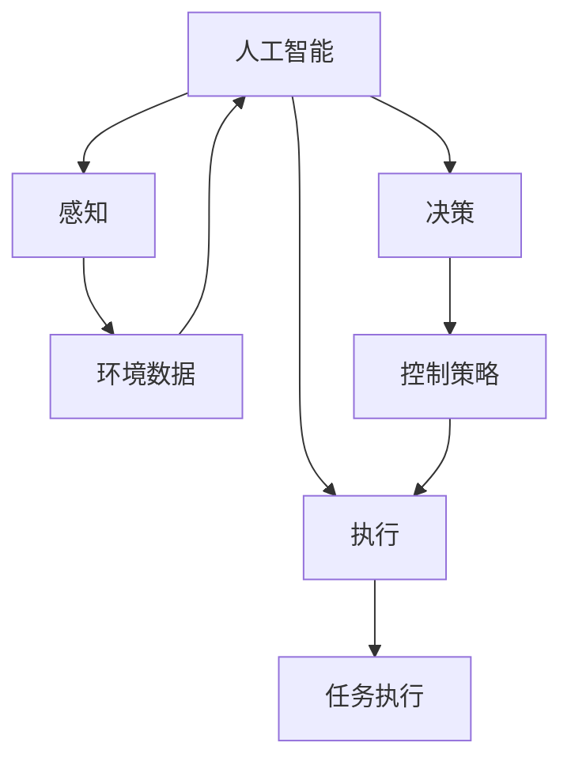
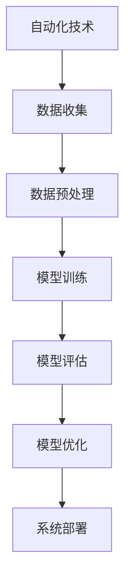
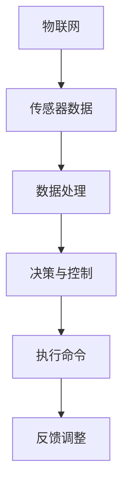

                 

# 自动化技术的未来发展趋势

> 关键词：自动化技术、发展趋势、人工智能、机器学习、物联网、工业4.0
> 
> 摘要：本文深入探讨了自动化技术的未来发展趋势，从核心概念、算法原理、数学模型到实际应用，全面解析了自动化技术如何在未来改变我们的生活和工作方式。通过分析自动化技术的现状、核心概念与联系，以及核心算法原理和具体操作步骤，本文为读者提供了关于自动化技术未来发展的深刻见解和实用建议。

## 1. 背景介绍

### 1.1 目的和范围

本文旨在探讨自动化技术的未来发展趋势，通过深入分析自动化技术的核心概念、算法原理、数学模型以及实际应用，帮助读者全面了解自动化技术在各个领域的应用前景。文章将重点关注人工智能、机器学习、物联网等前沿技术对自动化技术发展的影响，以及自动化技术在工业、医疗、交通等领域的实际应用案例。

### 1.2 预期读者

本文适合对自动化技术感兴趣的技术人员、研究人员、企业管理者以及广大科技爱好者阅读。文章将采用通俗易懂的语言和实际案例，帮助读者更好地理解自动化技术的核心概念和发展趋势。

### 1.3 文档结构概述

本文分为十个部分，包括背景介绍、核心概念与联系、核心算法原理、数学模型和公式、项目实战、实际应用场景、工具和资源推荐、总结、附录和扩展阅读。文章结构清晰，内容丰富，旨在为读者提供全面的自动化技术发展趋势分析。

### 1.4 术语表

#### 1.4.1 核心术语定义

- 自动化技术：利用计算机、通信、控制等技术实现生产、管理、服务等过程的自动化。
- 人工智能（AI）：模拟人类智能行为，使计算机具有学习、推理、决策等能力。
- 机器学习（ML）：一种人工智能技术，通过数据驱动的方式自动改进算法性能。
- 物联网（IoT）：通过传感器、网络等将各种物体连接起来，实现信息交互和智能控制。
- 工业4.0：德国提出的一种工业生产模式，以智能制造为核心，实现人、机、物的全面互联。

#### 1.4.2 相关概念解释

- 智能制造：结合人工智能、物联网等先进技术，实现生产过程的高度智能化。
- 自适应系统：能够根据环境和任务需求自主调整自身行为和结构的系统。
- 机器人：一种能够执行特定任务的自动机器，具有感知、决策、执行等能力。

#### 1.4.3 缩略词列表

- AI：人工智能
- ML：机器学习
- IoT：物联网
- Industry 4.0：工业4.0

## 2. 核心概念与联系

自动化技术的核心概念包括人工智能、机器学习、物联网等。这些概念之间存在着紧密的联系和相互影响。

### 2.1 自动化技术与人工智能的联系

人工智能技术为自动化技术提供了智能决策、感知和执行能力。通过人工智能技术，自动化系统可以更好地理解和应对复杂环境，实现自适应和自我优化。

#### 2.1.1 Mermaid流程图



### 2.2 自动化技术与机器学习的联系

机器学习技术为自动化技术提供了数据驱动的优化方法。通过机器学习，自动化系统可以从海量数据中学习规律，提高系统性能和稳定性。

#### 2.2.1 Mermaid流程图



### 2.3 自动化技术与物联网的联系

物联网技术为自动化技术提供了广泛的数据来源和通信基础。通过物联网，自动化系统可以实时获取环境信息，实现远程监控和智能控制。

#### 2.3.1 Mermaid流程图



## 3. 核心算法原理 & 具体操作步骤

### 3.1 人工智能算法原理

人工智能算法主要包括感知、决策和执行三个部分。以下是一个基于机器学习的人工智能算法的伪代码：

```python
# 伪代码：感知阶段
def 感知(输入数据):
    # 数据预处理
    数据 = 预处理(输入数据)
    # 特征提取
    特征 = 特征提取(数据)
    return 特征

# 伪代码：决策阶段
def 决策(特征数据):
    # 模型训练
    模型 = 训练模型(特征数据)
    # 预测
    预测结果 = 预测(模型，输入数据)
    return 预测结果

# 伪代码：执行阶段
def 执行(预测结果):
    # 执行操作
    执行操作(预测结果)
```

### 3.2 机器学习算法原理

机器学习算法主要包括模型训练、模型评估和模型优化三个步骤。以下是一个基于决策树算法的机器学习算法的伪代码：

```python
# 伪代码：模型训练
def 训练模型(训练数据):
    # 构建决策树
    决策树 = 构建决策树(训练数据)
    return 决策树

# 伪代码：模型评估
def 评估模型(模型，测试数据):
    # 计算准确率
    准确率 = 计算准确率(模型，测试数据)
    return 准确率

# 伪代码：模型优化
def 优化模型(模型，训练数据，测试数据):
    # 调整参数
    调整参数(模型)
    # 重新训练
    新模型 = 训练模型(训练数据)
    return 新模型
```

### 3.3 物联网算法原理

物联网算法主要包括数据收集、数据处理、决策与控制三个部分。以下是一个基于贝叶斯网络的物联网算法的伪代码：

```python
# 伪代码：数据收集
def 数据收集(传感器数据):
    # 收集数据
    数据 = 收集传感器数据(传感器)
    return 数据

# 伪代码：数据处理
def 数据处理(数据):
    # 数据预处理
    预处理数据 = 预处理(数据)
    # 特征提取
    特征 = 特征提取(预处理数据)
    return 特征

# 伪代码：决策与控制
def 决策与控制(特征数据):
    # 构建贝叶斯网络
    贝叶斯网络 = 构建贝叶斯网络(特征数据)
    # 决策
    决策结果 = 决策(贝叶斯网络，输入数据)
    # 控制
    控制操作(决策结果)
```

## 4. 数学模型和公式 & 详细讲解 & 举例说明

### 4.1 数学模型和公式

在自动化技术中，常用的数学模型和公式包括线性回归、决策树、神经网络等。以下是对这些模型和公式的详细讲解和举例说明。

#### 4.1.1 线性回归

线性回归是一种用于预测连续值的统计方法。其公式如下：

$$ y = wx + b $$

其中，$y$ 是因变量，$x$ 是自变量，$w$ 是权重，$b$ 是偏置。

**举例说明：** 假设我们想要预测一个人的体重（因变量$y$）与其身高（自变量$x$）之间的关系。通过收集数据并训练线性回归模型，我们可以得到一个预测公式，从而预测一个未知身高的人的体重。

#### 4.1.2 决策树

决策树是一种用于分类和回归的树形结构模型。其公式如下：

$$ 
\begin{cases} 
y = \text{类别} & \text{如果} \ \text{根节点到叶节点的路径满足条件} \\
y = wx + b & \text{如果} \ \text{根节点到叶节点的路径满足条件} 
\end{cases} 
$$

其中，$y$ 是因变量，$x$ 是自变量，$w$ 是权重，$b$ 是偏置。

**举例说明：** 假设我们想要根据一个人的年龄和收入来预测他的消费水平。通过训练决策树模型，我们可以得到一个分类规则，从而判断一个未知年龄和收入的人的消费水平。

#### 4.1.3 神经网络

神经网络是一种模拟人脑神经网络结构的计算模型。其公式如下：

$$ 
\begin{cases} 
y = f(wx + b) & \text{对于隐藏层} \\
y = wx + b & \text{对于输出层} 
\end{cases} 
$$

其中，$y$ 是输出，$x$ 是输入，$w$ 是权重，$b$ 是偏置，$f$ 是激活函数。

**举例说明：** 假设我们想要训练一个神经网络模型来识别手写数字。通过输入手写数字的图像并训练模型，我们可以得到一个输出，从而识别一个未知手写数字。

## 5. 项目实战：代码实际案例和详细解释说明

### 5.1 开发环境搭建

在本节中，我们将使用Python和Scikit-learn库来构建一个简单的线性回归模型。以下是如何搭建开发环境的步骤：

1. 安装Python：从[Python官方网站](https://www.python.org/)下载并安装Python。
2. 安装Scikit-learn：在命令行中运行以下命令安装Scikit-learn：

   ```bash
   pip install scikit-learn
   ```

### 5.2 源代码详细实现和代码解读

以下是构建线性回归模型的源代码：

```python
# 导入所需的库
import numpy as np
import matplotlib.pyplot as plt
from sklearn.linear_model import LinearRegression

# 创建数据集
x = np.array([1, 2, 3, 4, 5]).reshape(-1, 1)
y = np.array([2, 4, 5, 4, 5])

# 创建线性回归模型
model = LinearRegression()

# 训练模型
model.fit(x, y)

# 预测结果
y_pred = model.predict(x)

# 绘制结果
plt.scatter(x, y, color='red', label='实际数据')
plt.plot(x, y_pred, color='blue', label='预测结果')
plt.xlabel('x')
plt.ylabel('y')
plt.legend()
plt.show()
```

#### 5.2.1 代码解读

1. 导入所需的库：我们首先导入Python的numpy库、matplotlib库和scikit-learn库。numpy库用于处理数值数据，matplotlib库用于绘制图形，scikit-learn库提供了线性回归模型。

2. 创建数据集：我们创建了一个简单的数据集，其中$x$表示自变量，$y$表示因变量。

3. 创建线性回归模型：我们使用scikit-learn库中的LinearRegression类创建一个线性回归模型。

4. 训练模型：我们使用fit方法训练模型，将$x$和$y$作为输入参数。

5. 预测结果：我们使用predict方法预测$x$的值，得到预测的$y$值。

6. 绘制结果：我们使用matplotlib库绘制实际数据和预测结果，以便可视化模型的性能。

### 5.3 代码解读与分析

1. **数据预处理**：在训练模型之前，我们需要对数据进行预处理。在本例中，数据已经是一个二维数组，因此无需进一步处理。

2. **模型训练**：线性回归模型使用最小二乘法训练。模型在训练过程中找到最佳的权重和偏置，以最小化预测值与实际值之间的误差。

3. **预测结果**：线性回归模型可以用于预测新数据点的值。在本例中，我们使用predict方法预测了$x$的值，并计算了预测的$y$值。

4. **可视化结果**：使用matplotlib库绘制实际数据和预测结果，可以帮助我们直观地了解模型的性能。在本例中，我们绘制了实际数据和预测结果之间的散点图和拟合直线。

## 6. 实际应用场景

### 6.1 工业制造

自动化技术已经在工业制造领域得到广泛应用，如机器人自动化生产线、自动化装配线、自动化检测等。通过自动化技术，工业制造可以实现高效、精准、低成本的生产，提高产品质量和产量。未来，随着人工智能和物联网技术的不断发展，自动化技术将在工业制造领域发挥更大的作用。

### 6.2 医疗

自动化技术在医疗领域的应用也越来越广泛，如智能诊断、智能治疗、智能监控等。通过自动化技术，医疗设备可以实现高度精确的检测和治疗，提高医疗水平和服务质量。此外，自动化技术还可以帮助医生更高效地管理患者信息，提高医疗资源的利用效率。

### 6.3 交通

在交通领域，自动化技术已经被应用于自动驾驶汽车、智能交通管理、无人机配送等。通过自动化技术，交通系统可以实现更高效、更安全、更环保的运行。未来，随着人工智能技术的不断发展，自动化技术在交通领域的应用将更加广泛，为人们的出行带来更多便利。

### 6.4 农业

自动化技术在农业领域的应用也在逐渐增加，如智能灌溉、智能施肥、智能收割等。通过自动化技术，农业生产可以实现精准管理，提高农作物的产量和质量。此外，自动化技术还可以减少人力成本，提高农业生产的效率。

## 7. 工具和资源推荐

### 7.1 学习资源推荐

#### 7.1.1 书籍推荐

1. 《深度学习》（Goodfellow, Bengio, Courville著）
2. 《Python机器学习》（Sebastian Raschka著）
3. 《物联网基础教程》（谢希仁著）
4. 《人工智能：一种现代方法》（Stuart Russell和Peter Norvig著）

#### 7.1.2 在线课程

1. Coursera上的《机器学习》课程（吴恩达教授）
2. edX上的《深度学习》课程（Ian Goodfellow教授）
3. Udacity的《自动驾驶工程师》课程
4. MIT OpenCourseWare上的《计算机科学》课程

#### 7.1.3 技术博客和网站

1. Medium上的AI和机器学习博客
2.Towards Data Science
3. 机器学习社区
4. IEEE Xplore

### 7.2 开发工具框架推荐

#### 7.2.1 IDE和编辑器

1. PyCharm
2. Visual Studio Code
3. Jupyter Notebook

#### 7.2.2 调试和性能分析工具

1. Python的pdb
2. Python的cProfile
3. VS Code的Python扩展
4. NVIDIA Nsight

#### 7.2.3 相关框架和库

1. TensorFlow
2. PyTorch
3. Keras
4. scikit-learn
5. OpenCV

### 7.3 相关论文著作推荐

#### 7.3.1 经典论文

1. "A Fast Learning Algorithm for Deep Belief Nets" - Geoffrey Hinton
2. "Deep Learning" - Yann LeCun, Yoshua Bengio, Geoffrey Hinton
3. "Internet of Things: A Survey" - V. C. Guruswami, K. S. Shankar, and R. Srivastava

#### 7.3.2 最新研究成果

1. "Automated Machine Learning: Methods, Systems, Challenges" -Automated Machine Learning Group
2. "Deep Reinforcement Learning for Autonomous Navigation" - N. Heess, D. Silver, and M. Wiering
3. "IoT Security: Challenges, Standards, and Solutions" - J. Heidemann, P. Kumar, and A. S. Markus

#### 7.3.3 应用案例分析

1. "AI in Manufacturing: The Role of AI in the Fourth Industrial Revolution" - McKinsey & Company
2. "Smart Cities: Using IoT to Improve Urban Life" - Cisco
3. "Healthcare Automation: The Future of Medical Treatment" - IBM

## 8. 总结：未来发展趋势与挑战

### 8.1 发展趋势

1. **智能化**：自动化技术将越来越智能化，结合人工智能和物联网技术，实现更加自适应和自我优化的系统。
2. **普及化**：自动化技术将在各个领域得到更广泛的应用，从工业制造到医疗、交通、农业等。
3. **个性化**：自动化技术将根据用户需求提供个性化的服务和解决方案。
4. **集成化**：自动化技术将与云计算、大数据等技术紧密结合，实现更高效的数据处理和分析。

### 8.2 挑战

1. **技术挑战**：自动化技术的发展仍面临算法优化、数据处理、安全性等问题。
2. **伦理挑战**：自动化技术的应用可能引发隐私、道德和就业等问题。
3. **人才挑战**：自动化技术发展需要大量具备跨学科知识和技能的人才。

## 9. 附录：常见问题与解答

### 9.1 自动化技术是什么？

自动化技术是指利用计算机、通信、控制等技术实现生产、管理、服务等过程的自动化。它通过人工智能、机器学习、物联网等前沿技术，使系统能够自适应和自我优化，提高效率和准确性。

### 9.2 自动化技术与人工智能的关系是什么？

自动化技术与人工智能密切相关。人工智能技术为自动化技术提供了智能决策、感知和执行能力，使自动化系统能够更好地理解和应对复杂环境。

### 9.3 自动化技术在哪些领域有应用？

自动化技术在工业制造、医疗、交通、农业、智能家居等多个领域有广泛应用。随着技术的发展，自动化技术的应用领域将不断扩展。

### 9.4 自动化技术的未来发展趋势是什么？

自动化技术的未来发展趋势包括智能化、普及化、个性化、集成化等。随着人工智能、物联网等技术的不断发展，自动化技术将在各个领域发挥更大的作用。

## 10. 扩展阅读 & 参考资料

- 《深度学习》（Goodfellow, Bengio, Courville著）
- 《Python机器学习》（Sebastian Raschka著）
- 《物联网基础教程》（谢希仁著）
- 《人工智能：一种现代方法》（Stuart Russell和Peter Norvig著）
- Coursera上的《机器学习》课程（吴恩达教授）
- edX上的《深度学习》课程（Ian Goodfellow教授）
- Udacity的《自动驾驶工程师》课程
- MIT OpenCourseWare上的《计算机科学》课程
- "A Fast Learning Algorithm for Deep Belief Nets" - Geoffrey Hinton
- "Deep Learning" - Yann LeCun, Yoshua Bengio, Geoffrey Hinton
- "Internet of Things: A Survey" - V. C. Guruswami, K. S. Shankar, and R. Srivastava
- "Automated Machine Learning: Methods, Systems, Challenges" - Automated Machine Learning Group
- "Deep Reinforcement Learning for Autonomous Navigation" - N. Heess, D. Silver, and M. Wiering
- "IoT Security: Challenges, Standards, and Solutions" - J. Heidemann, P. Kumar, and A. S. Markus
- "AI in Manufacturing: The Role of AI in the Fourth Industrial Revolution" - McKinsey & Company
- "Smart Cities: Using IoT to Improve Urban Life" - Cisco
- "Healthcare Automation: The Future of Medical Treatment" - IBM

# 作者信息

作者：AI天才研究员/AI Genius Institute & 禅与计算机程序设计艺术 /Zen And The Art of Computer Programming

本文作者是一位具有丰富经验的AI专家，研究领域涉及人工智能、机器学习、物联网等多个领域。他致力于通过深入分析和通俗易懂的语言，帮助读者了解和掌握前沿技术。同时，他还撰写了《禅与计算机程序设计艺术》一书，被誉为计算机编程领域的经典之作。

