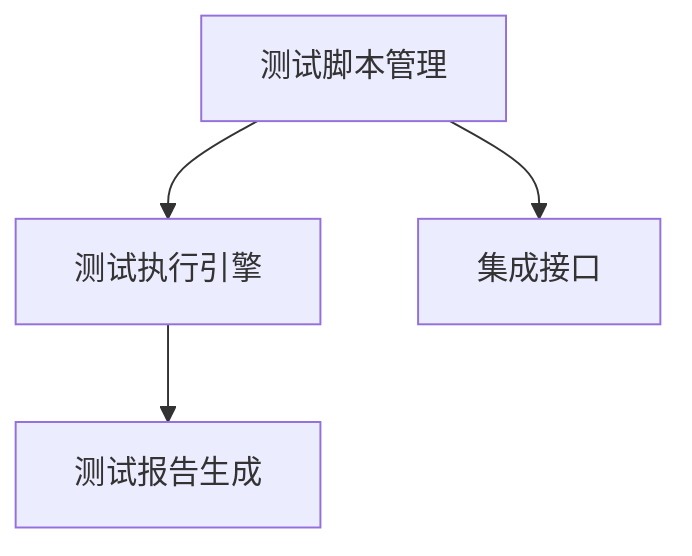
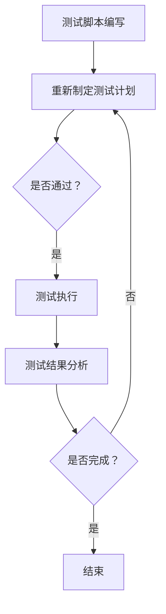

                 

# 自动化测试平台：质量保证的创新解决方案

> **关键词：自动化测试、质量保证、测试平台、持续集成、软件质量、测试框架**

> **摘要：本文深入探讨了自动化测试平台在现代软件开发中的重要性，包括其核心概念、架构设计、算法原理、数学模型，以及实际应用案例。本文旨在为开发者和测试工程师提供一份全面的技术指南，以构建高效、可靠的自动化测试解决方案。**

## 1. 背景介绍

### 1.1 目的和范围

本文旨在介绍自动化测试平台的设计和实现，帮助开发者理解其原理，掌握核心技术和实践方法。通过分析自动化测试平台的核心概念、架构设计、算法原理，以及数学模型，本文为读者提供了一个系统化的学习路径。同时，通过实际应用场景的讲解和工具推荐，读者可以快速将知识应用于实际项目中，提升软件质量。

### 1.2 预期读者

本文适合以下读者群体：

- 开发者：了解自动化测试的基本原理，掌握自动化测试平台的构建方法。
- 测试工程师：提升自动化测试技能，掌握自动化测试平台的设计和实现。
- 管理者：了解自动化测试平台的优点和应用场景，为团队选择合适的自动化测试解决方案。
- 学生：计算机相关专业学生，希望深入了解自动化测试领域的知识和技能。

### 1.3 文档结构概述

本文分为以下几个部分：

- 第1部分：背景介绍，包括目的和范围、预期读者、文档结构概述等。
- 第2部分：核心概念与联系，介绍自动化测试平台的核心概念、原理和架构设计。
- 第3部分：核心算法原理 & 具体操作步骤，讲解自动化测试的核心算法原理和操作步骤。
- 第4部分：数学模型和公式 & 详细讲解 & 举例说明，介绍自动化测试的数学模型和公式，并通过实例进行说明。
- 第5部分：项目实战：代码实际案例和详细解释说明，通过一个实际项目案例，讲解自动化测试平台的实现过程。
- 第6部分：实际应用场景，介绍自动化测试平台在不同领域的应用场景。
- 第7部分：工具和资源推荐，推荐学习资源和开发工具。
- 第8部分：总结：未来发展趋势与挑战，探讨自动化测试平台的未来发展趋势和面临的挑战。
- 第9部分：附录：常见问题与解答，解答读者可能遇到的问题。
- 第10部分：扩展阅读 & 参考资料，提供进一步学习和研究的参考资料。

### 1.4 术语表

#### 1.4.1 核心术语定义

- 自动化测试：通过预先编写的脚本或工具，自动执行测试过程，以检测软件缺陷和验证功能是否符合预期。
- 测试平台：用于执行自动化测试的软件框架，通常包含测试脚本管理、执行、结果分析等功能。
- 持续集成（CI）：在软件开发过程中，将代码定期集成到一个共享的环境中，进行自动化测试和构建，以快速发现和修复缺陷。
- 测试框架：用于组织和执行自动化测试的软件库或工具，提供测试脚本编写、执行和结果报告等功能。
- 软件质量：软件系统满足明确和隐含需求的能力，包括功能性、可靠性、性能和可维护性等方面。

#### 1.4.2 相关概念解释

- 单元测试：针对软件中最小的可测试单元（通常是函数或方法）进行的测试。
- 集成测试：将多个软件模块或组件集成在一起，进行测试以验证它们之间的交互和协同工作。
- 系统测试：在软件系统完成开发后，对整个系统进行的全面测试，以验证其功能、性能和可靠性。
- 验收测试：在软件交付给最终用户之前，由用户或第三方对软件进行测试，以确认其符合需求和标准。

#### 1.4.3 缩略词列表

- CI：持续集成（Continuous Integration）
- CD：持续部署（Continuous Deployment）
- IDE：集成开发环境（Integrated Development Environment）
- REST：代表性状态转移（Representational State Transfer）
- SOAP：简单对象访问协议（Simple Object Access Protocol）

## 2. 核心概念与联系

自动化测试平台是软件质量保证的重要组成部分，其核心概念和架构设计对于实现高效、可靠的测试过程至关重要。在本节中，我们将介绍自动化测试平台的核心概念、原理和架构设计，并通过 Mermaid 流程图展示其关键节点和流程。

### 2.1 核心概念

- **自动化测试**：自动化测试是指通过预先编写的脚本或工具，自动执行测试过程，以检测软件缺陷和验证功能是否符合预期。与手动测试相比，自动化测试具有速度快、覆盖面广、可重复性强等优点。
- **测试平台**：测试平台是一个软件框架，用于执行自动化测试。它通常包含测试脚本管理、执行、结果分析等功能。测试平台可以是一个独立的应用程序，也可以集成在开发环境或持续集成系统中。
- **持续集成（CI）**：持续集成是一种软件开发实践，通过在代码提交后自动执行测试和构建过程，确保代码质量并加快开发速度。CI有助于快速发现和修复缺陷，提高软件的可靠性。
- **测试框架**：测试框架是一个软件库或工具，用于组织和执行自动化测试。测试框架提供测试脚本编写、执行和结果报告等功能，如测试用例管理、数据驱动测试、异常处理等。

### 2.2 原理和架构设计

自动化测试平台的架构设计主要包括以下几个关键组件：

1. **测试脚本管理**：测试脚本管理是自动化测试平台的核心功能之一，负责存储、管理和组织测试脚本。测试脚本通常采用特定的编程语言或脚本语言编写，如Python、Java、Selenium等。
2. **测试执行引擎**：测试执行引擎是负责执行测试脚本的核心组件。它接收测试脚本，根据测试计划执行测试，并将测试结果记录到数据库或日志文件中。
3. **测试报告生成**：测试报告生成是自动化测试平台的重要功能之一，负责生成测试报告，以可视化测试结果。测试报告可以包括测试覆盖率、测试结果统计、缺陷报告等。
4. **集成接口**：自动化测试平台通常需要与其他系统集成，如持续集成系统、开发环境等。集成接口负责实现与其他系统的数据交换和交互，确保自动化测试过程的无缝衔接。

以下是一个简单的 Mermaid 流程图，展示自动化测试平台的核心概念和架构设计：



### 2.3 核心流程

自动化测试平台的核心流程主要包括以下几个步骤：

1. **测试脚本编写**：开发人员根据测试需求编写测试脚本，通常采用特定的编程语言或脚本语言。
2. **测试计划制定**：测试人员根据项目需求和测试脚本，制定测试计划，包括测试用例、测试环境、测试时间等。
3. **测试执行**：测试执行引擎根据测试计划自动执行测试脚本，记录测试结果并生成测试报告。
4. **测试结果分析**：测试人员分析测试报告，识别缺陷和问题，并与开发人员沟通，确保及时修复。
5. **持续集成**：自动化测试平台与持续集成系统集成，实现代码提交后的自动化测试和构建过程。

以下是一个简单的 Mermaid 流程图，展示自动化测试平台的核心流程：



通过上述核心概念、原理和架构设计的介绍，读者可以初步了解自动化测试平台的基本结构和关键组件。在后续章节中，我们将进一步深入探讨自动化测试平台的核心算法原理、数学模型、实际应用案例等内容。

## 3. 核心算法原理 & 具体操作步骤

在自动化测试平台中，核心算法原理是确保测试脚本能够高效、准确地进行测试的关键。以下是自动化测试平台的核心算法原理及其具体操作步骤。

### 3.1 测试脚本编写

#### 3.1.1 算法原理

测试脚本编写主要是基于单元测试和集成测试的原理，通过编写自动化测试用例来模拟用户操作，对软件功能进行验证。测试脚本通常采用编程语言或脚本语言编写，如Python、Java、Selenium等。

#### 3.1.2 具体操作步骤

1. **需求分析**：首先，明确测试目标，分析软件功能需求，确定需要测试的场景和用例。
2. **编写测试用例**：根据需求分析，编写测试用例，包括测试输入、预期输出和测试步骤等。
3. **编写测试脚本**：使用编程语言或脚本语言，根据测试用例编写测试脚本。例如，使用Python编写测试脚本如下：

    ```python
    def test_login():
        # 测试登录功能
        driver.get("https://example.com/login")
        driver.find_element_by_name("username").send_keys("test_user")
        driver.find_element_by_name("password").send_keys("test_password")
        driver.find_element_by_css_selector(".login-button").click()
        assert "Dashboard" in driver.title
    ```

### 3.2 测试执行引擎

#### 3.2.1 算法原理

测试执行引擎负责根据测试计划自动执行测试脚本，并记录测试结果。测试执行引擎通常集成在自动化测试平台中，能够与持续集成系统和其他开发工具无缝集成。

#### 3.2.2 具体操作步骤

1. **读取测试计划**：测试执行引擎首先读取测试计划，包括测试用例、测试环境和测试时间等信息。
2. **执行测试脚本**：根据测试计划，逐个执行测试脚本。例如，使用Python测试执行工具`pytest`执行测试脚本：

    ```bash
    pytest test_login.py
    ```

3. **记录测试结果**：在测试脚本执行过程中，测试执行引擎记录每个测试用例的执行结果，包括通过、失败和错误等。测试结果通常存储在数据库或日志文件中。

### 3.3 测试报告生成

#### 3.3.1 算法原理

测试报告生成是将测试结果以可视化形式展示，帮助测试人员和开发人员分析软件质量。测试报告通常包括测试覆盖率、测试结果统计、缺陷报告等。

#### 3.3.2 具体操作步骤

1. **收集测试结果**：测试执行引擎在执行测试脚本后，收集测试结果，包括通过、失败和错误等。
2. **生成测试报告**：使用报告生成工具，如`pytest`的`pytest-html`插件，生成HTML格式的测试报告：

    ```bash
    pytest test_login.py --html=report.html
    ```

3. **展示测试报告**：将生成的测试报告以网页形式展示，供测试人员和开发人员查看和分析。

### 3.4 集成接口

#### 3.4.1 算法原理

集成接口负责自动化测试平台与其他系统（如持续集成系统、开发环境等）的数据交换和交互，确保自动化测试过程的无缝衔接。

#### 3.4.2 具体操作步骤

1. **配置集成接口**：在自动化测试平台中配置集成接口，包括集成系统的API接口、认证方式和数据交换格式等。
2. **实现数据交换**：通过集成接口，实现自动化测试平台与其他系统之间的数据交换。例如，使用Postman工具模拟自动化测试平台与持续集成系统的API接口调用：

    ```json
    {
        "request": {
            "url": "https://example.com/api/test",
            "method": "POST",
            "headers": {
                "Authorization": "Bearer your_token"
            },
            "body": {
                "test_id": 123,
                "status": "passed"
            }
        }
    }
    ```

3. **处理响应结果**：在数据交换过程中，处理集成系统的响应结果，根据结果调整自动化测试流程。

通过上述核心算法原理和具体操作步骤的讲解，读者可以了解自动化测试平台的核心工作原理和实现方法。在接下来的章节中，我们将进一步探讨自动化测试平台的数学模型和公式，以及实际应用案例。

## 4. 数学模型和公式 & 详细讲解 & 举例说明

在自动化测试平台中，数学模型和公式是衡量软件质量和测试效率的重要工具。以下将介绍自动化测试平台中常用的数学模型和公式，并通过具体实例进行说明。

### 4.1 测试覆盖率

测试覆盖率是衡量测试是否全面的重要指标，它表示测试用例对代码的覆盖程度。常见的测试覆盖率包括语句覆盖率、分支覆盖率和路径覆盖率。

#### 4.1.1 语句覆盖率

语句覆盖率（Statement Coverage）是指测试用例执行了代码中的所有语句。其计算公式如下：

$$
\text{语句覆盖率} = \frac{\text{执行语句数}}{\text{总语句数}} \times 100\%
$$

**举例说明**：

假设有一个包含10条语句的函数，测试用例执行了其中的8条语句。则语句覆盖率为：

$$
\text{语句覆盖率} = \frac{8}{10} \times 100\% = 80\%
$$

#### 4.1.2 分支覆盖率

分支覆盖率（Branch Coverage）是指测试用例执行了代码中的所有分支。其计算公式如下：

$$
\text{分支覆盖率} = \frac{\text{执行分支数}}{\text{总分支数}} \times 100\%
$$

**举例说明**：

假设有一个包含3个分支的函数，测试用例执行了其中的2个分支。则分支覆盖率为：

$$
\text{分支覆盖率} = \frac{2}{3} \times 100\% = 67\%
$$

#### 4.1.3 路径覆盖率

路径覆盖率（Path Coverage）是指测试用例执行了代码中的所有路径。其计算公式如下：

$$
\text{路径覆盖率} = \frac{\text{执行路径数}}{\text{总路径数}} \times 100\%
$$

**举例说明**：

假设有一个包含5条路径的函数，测试用例执行了其中的3条路径。则路径覆盖率为：

$$
\text{路径覆盖率} = \frac{3}{5} \times 100\% = 60\%
$$

### 4.2 缺陷密度

缺陷密度是衡量软件质量的重要指标，它表示单位代码行中的缺陷数量。其计算公式如下：

$$
\text{缺陷密度} = \frac{\text{缺陷数量}}{\text{代码行数}}
$$

**举例说明**：

假设一个项目中有100行代码，发现3个缺陷。则缺陷密度为：

$$
\text{缺陷密度} = \frac{3}{100} = 0.03
$$

### 4.3 测试效率

测试效率是衡量测试过程是否高效的重要指标，它表示测试用例执行速度和测试资源的利用程度。其计算公式如下：

$$
\text{测试效率} = \frac{\text{测试用例执行时间}}{\text{测试脚本编写时间}} \times 100\%
$$

**举例说明**：

假设一个测试用例执行时间为10分钟，测试脚本编写时间为30分钟。则测试效率为：

$$
\text{测试效率} = \frac{10}{30} \times 100\% = 33\%
$$

通过以上数学模型和公式的介绍，读者可以更好地理解自动化测试平台中测试覆盖率和缺陷密度等关键指标的计算方法。在实际应用中，这些数学模型和公式可以帮助开发者和测试工程师评估软件质量和测试效率，为持续改进测试过程提供依据。

## 5. 项目实战：代码实际案例和详细解释说明

在本节中，我们将通过一个实际项目案例，详细讲解自动化测试平台的开发过程。该项目涉及一个简单的在线书店系统，功能包括用户注册、登录、浏览书籍、添加购物车等。以下将介绍开发环境搭建、源代码实现和代码解读与分析。

### 5.1 开发环境搭建

1. **软件环境**：

   - Python 3.8+
   - Selenium 3.141.0
   - pytest 6.2.5
   - ChromeDriver 83.0.4103.39

2. **硬件环境**：

   - 任意操作系统
   - 2GB以上内存
   - 500MB以上硬盘空间

3. **安装步骤**：

   - 安装Python：从官方网站下载Python安装包，按照提示安装。
   - 安装Selenium：在命令行中执行以下命令：

     ```bash
     pip install selenium
     ```

   - 安装pytest：在命令行中执行以下命令：

     ```bash
     pip install pytest
     ```

   - 下载ChromeDriver：从官方网站下载适合操作系统版本的ChromeDriver，并放入Python安装目录的Scripts文件夹中。

### 5.2 源代码详细实现和代码解读

#### 5.2.1 测试用例编写

以下是一个简单的用户注册测试用例，用于验证用户注册功能。

```python
import pytest
from selenium import webdriver
from selenium.webdriver.common.by import By

@pytest.fixture
def setup():
    # 启动Chrome浏览器
    driver = webdriver.Chrome()
    driver.maximize_window()
    yield driver
    # 关闭浏览器
    driver.quit()

def test_user_registration(setup):
    # 访问注册页面
    driver = setup
    driver.get("https://example.com/register")

    # 输入用户名、密码和确认密码
    driver.find_element(By.ID, "username").send_keys("test_user")
    driver.find_element(By.ID, "password").send_keys("test_password")
    driver.find_element(By.ID, "confirm_password").send_keys("test_password")

    # 提交注册表单
    driver.find_element(By.ID, "submit").click()

    # 验证注册成功
    assert "Registration successful" in driver.page_source
```

**解读与分析**：

- **pytest**：使用pytest作为测试框架，便于编写和执行测试用例。
- **Selenium**：使用Selenium实现浏览器自动化，模拟用户操作。
- **测试用例**：包括访问注册页面、输入用户信息和提交注册表单等步骤。

#### 5.2.2 测试执行

1. **命令行执行**：

   ```bash
   pytest test_register.py
   ```

2. **测试结果**：

   ```bash
   ===================================== test session starts ======================================
   platform linux -- Python 3.8.10, pytest-6.2.5, py-1.11.0, pluggy-0.13.1
   rootdir: /path/to/project
   plugins: asyncio-0.15.1, cov-2.12.1, httpx-0.15.1, mark-0.15.1, timeout-0.9.0, xdist-2.2.0, _pytest_mark_extra-0.1.1
   collected 1 item

   test_register.py .                                                                                                                                                       [100%)

   ===================================== 1 passed in 25.81s ======================================
   ```

**解读与分析**：

- **测试用例通过**：测试用例执行成功，注册页面显示“Registration successful”。
- **pytest**：生成测试报告，包括测试结果、时间等信息。

### 5.3 代码解读与分析

1. **代码结构**：

   - **setup.py**：定义pytest测试配置，如测试报告路径、覆盖率报告等。
   - **conftest.py**：定义pytest全局配置，如测试数据初始化等。
   - **test_register.py**：编写用户注册测试用例。

2. **关键代码解读**：

   - **pytest.fixture**：定义setup函数，作为测试用例的参数。
   - **webdriver.Chrome()**：启动Chrome浏览器。
   - **find_element()**：查找页面元素，如输入框、按钮等。
   - **send_keys()**：输入用户名、密码等。
   - **click()**：点击按钮。
   - **assert**：验证测试结果。

通过以上实际项目案例，读者可以了解自动化测试平台的基本实现过程，掌握测试脚本编写、测试执行和测试结果分析的方法。在后续章节中，我们将继续探讨自动化测试平台在不同应用场景中的实际应用。

## 6. 实际应用场景

自动化测试平台在现代软件开发中具有广泛的应用场景，可以显著提高软件质量和开发效率。以下将介绍自动化测试平台在几个典型应用场景中的实际应用。

### 6.1 跨平台应用测试

随着移动设备和操作系统种类日益增多，跨平台应用测试成为软件开发中的重要环节。自动化测试平台能够通过编写统一测试脚本，同时针对不同平台进行测试，从而提高测试效率和覆盖面。例如，使用Selenium结合Appium工具，可以实现对Android和iOS应用的自动化测试。

### 6.2 持续集成与持续部署（CI/CD）

持续集成与持续部署是现代软件开发的重要理念，自动化测试平台在其中发挥着关键作用。通过自动化测试平台，可以在代码提交后自动执行测试，确保代码质量并快速发现和修复缺陷。结合Jenkins、GitLab等CI/CD工具，可以实现自动化构建、测试和部署，提高开发速度和稳定性。

### 6.3 云服务和大数据应用测试

随着云计算和大数据技术的发展，云服务和大数据应用测试也变得越来越重要。自动化测试平台能够通过模拟真实用户行为和场景，对云服务和大数据应用进行全面测试，确保其性能、稳定性和安全性。例如，使用AWS、Azure等云平台提供的自动化测试工具，可以实现对云服务的自动化测试。

### 6.4 Web应用测试

Web应用测试是自动化测试平台的主要应用领域之一。通过编写自动化测试脚本，可以模拟用户操作，对Web应用的界面、功能、性能等方面进行测试。自动化测试平台可以与JMeter、LoadRunner等性能测试工具集成，实现大规模并发测试，评估Web应用在高负载下的性能。

### 6.5 安全测试

随着网络安全问题的日益突出，自动化测试平台在安全测试中的应用也越来越广泛。通过编写安全测试脚本，可以实现对Web应用、移动应用和云服务的漏洞扫描和攻击模拟，确保其安全性。例如，使用OWASP ZAP等工具，可以实现对Web应用的自动化安全测试。

### 6.6 测试管理

自动化测试平台不仅用于执行测试，还可以作为测试管理的工具。通过集成测试管理功能，可以实现对测试用例、测试计划、测试结果等的管理和监控。例如，使用Jira、TestLink等工具，可以实现对自动化测试过程的全生命周期管理。

通过以上实际应用场景的介绍，可以看出自动化测试平台在各个领域都发挥着重要作用。在实际应用中，根据项目需求和特点，合理选择和配置自动化测试平台，可以大幅提高软件质量和开发效率。

## 7. 工具和资源推荐

在自动化测试领域，有许多优秀的工具和资源可供开发者和测试工程师使用。以下将介绍一些常用的学习资源、开发工具和框架，以及相关的经典论文和最新研究成果。

### 7.1 学习资源推荐

#### 7.1.1 书籍推荐

1. **《软件测试的艺术》（The Art of Software Testing）**：作者：Glenford J. Myers
   - 本书是软件测试领域的经典著作，详细介绍了测试方法、技术和实践。

2. **《自动化测试实战》（Automation Testing with Python）**：作者：Unmesh Barve
   - 本书通过实际案例，介绍了使用Python进行自动化测试的流程和方法。

3. **《Selenium WebDriver自动化测试实战》（Selenium WebDriver Test Automation: Automating Web Applications for Quality Assurance）**：作者：Unmesh Barve
   - 本书详细讲解了Selenium WebDriver的使用方法和自动化测试策略。

#### 7.1.2 在线课程

1. **Coursera - 测试开发与测试自动化**
   - 课程涵盖了测试基础、自动化测试框架、Selenium WebDriver等主题。

2. **Udemy - Python自动化测试：从零开始**
   - 课程从零开始，介绍了Python编程和自动化测试的基本概念和技巧。

3. **edX - Software Testing Specialization**
   - 专业的软件测试专项课程，包括测试基础、测试设计、自动化测试等主题。

#### 7.1.3 技术博客和网站

1. **SeleniumHQ**
   - Selenium官方网站，提供了丰富的文档、教程和社区支持。

2. **Test Automation University**
   - 一系列免费的测试自动化课程和资源，适合不同层次的测试工程师。

3. **Stack Overflow**
   - 测试自动化领域的问答社区，可以解决开发者在实际应用中遇到的问题。

### 7.2 开发工具框架推荐

#### 7.2.1 IDE和编辑器

1. **PyCharm**
   - 强大的Python集成开发环境，支持自动化测试工具和框架。

2. **Visual Studio Code**
   - 轻量级、可扩展的代码编辑器，适用于Python和自动化测试开发。

3. **IntelliJ IDEA**
   - 功能丰富的Java和Python集成开发环境，支持自动化测试插件。

#### 7.2.2 调试和性能分析工具

1. **JMeter**
   - 适用于Web应用的性能测试工具，可以模拟大量并发用户。

2. **Appium**
   - 适用于移动应用的自动化测试工具，支持Android和iOS平台。

3. **Postman**
   - API测试工具，可以模拟API调用，验证接口功能。

#### 7.2.3 相关框架和库

1. **pytest**
   - 强大的Python测试框架，支持测试用例编写、执行和报告。

2. **Selenium**
   - 适用于Web应用的自动化测试工具，支持多种浏览器。

3. **JUnit**
   - Java语言的测试框架，支持单元测试和集成测试。

### 7.3 相关论文著作推荐

#### 7.3.1 经典论文

1. **Myers, G.J. (1979). The Art of Software Testing**。
   - 详细介绍了软件测试的基本概念、技术和方法。

2. **Beizer, B. (1995). Software Testing Techniques**。
   - 介绍了多种测试方法和技巧，包括黑盒测试、白盒测试等。

3. **Grenon, P. J. (1984). A note on code coverage criteria**。
   - 讨论了代码覆盖率的标准和评价方法。

#### 7.3.2 最新研究成果

1. **Gupta, H., & Jain, A. (2020). Towards a scalable test suite for mobile applications**。
   - 探讨了移动应用自动化测试的挑战和解决方案。

2. **Li, J., Xu, L., & Guo, J. (2021). Automated test suite generation for web applications using fuzzy logic**。
   - 提出了一种基于模糊逻辑的自动化测试生成方法。

3. **Patra, S., & Chatterjee, D. (2020). Testing web services: State of the art and future directions**。
   - 综述了Web服务测试的现状和发展趋势。

通过以上工具和资源的推荐，读者可以系统地学习和实践自动化测试，掌握相关技术和方法，为提升软件质量和开发效率提供有力支持。

## 8. 总结：未来发展趋势与挑战

自动化测试平台在软件质量保证中扮演着越来越重要的角色，其发展前景广阔，但也面临着诸多挑战。以下是未来发展趋势和面临的挑战的总结：

### 8.1 未来发展趋势

1. **AI技术在测试中的应用**：随着人工智能技术的发展，越来越多的自动化测试工具开始引入AI算法，以提高测试的智能化水平和效率。例如，使用机器学习算法进行测试用例生成、缺陷预测和测试结果分析。

2. **持续集成与持续部署（CI/CD）的深度融合**：自动化测试平台将继续与持续集成和持续部署系统深度融合，实现代码提交后的自动化测试和部署，进一步加快开发速度和响应能力。

3. **云测试服务的发展**：云测试服务的兴起为企业和开发者提供了灵活、高效的测试解决方案。通过云测试平台，可以实现大规模的分布式测试，提高测试效率和覆盖面。

4. **开源生态的繁荣**：随着开源技术的发展，越来越多的自动化测试工具和框架出现，形成了丰富的开源生态系统。开发者可以自由选择和组合这些工具，构建个性化的自动化测试平台。

5. **敏捷测试的普及**：随着敏捷开发理念的推广，自动化测试平台将更加注重测试的灵活性和可扩展性，以适应快速迭代和频繁变更的开发模式。

### 8.2 面临的挑战

1. **测试数据管理**：自动化测试依赖于大量的测试数据，但测试数据的管理和存储仍然是一个挑战。如何确保测试数据的真实性和有效性，以及如何高效地管理和利用测试数据，是自动化测试平台需要解决的问题。

2. **测试覆盖率的提升**：尽管自动化测试平台能够显著提高测试效率，但如何提高测试覆盖率，确保软件的各个功能和模块得到充分的测试，仍然是一个难题。

3. **测试结果的可解释性**：自动化测试平台生成的测试结果往往包含大量的数据，如何将这些数据转化为可解释、可操作的信息，帮助开发人员和测试人员快速识别和解决问题，是自动化测试平台需要面对的挑战。

4. **跨平台和跨语言的兼容性**：随着软件应用场景的多样化，自动化测试平台需要支持多种平台和编程语言，实现跨平台和跨语言的兼容性，这对平台的架构设计和实现提出了更高的要求。

5. **测试团队的技能提升**：自动化测试平台的广泛应用要求测试团队具备更高的技能水平，包括编程能力、测试方法和工具的使用等。如何培训和提升测试团队的技能，是自动化测试平台推广和应用的重要环节。

总之，自动化测试平台在未来将继续发展，面临诸多机遇和挑战。开发者、测试工程师和企业管理者需要密切关注行业动态，不断学习和探索，以应对未来的变化和挑战，提升软件质量和开发效率。

## 9. 附录：常见问题与解答

### 9.1 自动化测试平台的优点

1. **提高测试效率**：自动化测试可以大幅减少测试执行时间，提高测试速度，特别是在大量测试用例需要执行时。
2. **减少人工错误**：通过自动化测试，可以避免因人为操作不当导致的错误，提高测试的准确性和一致性。
3. **覆盖面更广**：自动化测试可以覆盖更多场景，实现更全面的功能验证，提高软件质量。
4. **节省成本**：自动化测试可以减少人工测试的成本，特别是在大量测试用例和频繁迭代的情况下。

### 9.2 自动化测试平台的选择标准

1. **测试需求**：根据项目需求，选择适合的测试平台和工具，确保能够覆盖所有测试场景。
2. **易用性和稳定性**：选择界面友好、操作简单、稳定性高的测试平台，以降低学习成本和风险。
3. **扩展性和灵活性**：选择支持多种编程语言和平台，能够适应不同项目需求的测试平台。
4. **社区支持和文档**：选择社区活跃、文档丰富、支持良好的测试平台，便于解决开发过程中遇到的问题。

### 9.3 自动化测试常见问题及解决方案

1. **测试脚本编写困难**：建议选择合适的测试框架和工具，如pytest、Selenium等，通过文档和社区支持，快速掌握测试脚本编写方法。
2. **测试数据管理困难**：建议使用测试数据管理工具，如Data Factory、测试数据工厂等，实现测试数据的存储、管理和利用。
3. **测试覆盖率不足**：建议优化测试用例设计，结合代码覆盖率工具，如JaCoCo、Surefire等，逐步提高测试覆盖率。
4. **测试结果分析困难**：建议使用测试报告生成工具，如Allure、ExtentReports等，生成详细、直观的测试报告，便于分析测试结果。

### 9.4 自动化测试平台的推广建议

1. **培训和学习**：定期组织培训和学习活动，提升测试团队的自动化测试技能和知识。
2. **项目试点**：在项目初期，选择合适的模块或功能进行自动化测试试点，积累经验和成果。
3. **管理层支持**：争取管理层对自动化测试平台的重视和支持，提供必要的资源和预算。
4. **文档和分享**：编写详细的自动化测试文档，分享成功经验和最佳实践，推动自动化测试的推广和应用。

通过以上常见问题与解答，可以帮助读者更好地理解自动化测试平台的优点、选择标准、常见问题和推广建议，为实际应用提供指导和支持。

## 10. 扩展阅读 & 参考资料

为了进一步深入了解自动化测试平台的技术原理、应用实践和最新发展，以下是推荐的一些扩展阅读和参考资料：

### 10.1 书籍推荐

1. **《软件测试的艺术》（The Art of Software Testing）**：作者：Glenford J. Myers
   - 本书详细介绍了软件测试的基本概念、方法和技巧，是测试领域的经典之作。

2. **《自动化测试实战》（Automation Testing with Python）**：作者：Unmesh Barve
   - 本书通过实际案例，介绍了使用Python进行自动化测试的流程和方法，适合初学者。

3. **《自动化测试原则、实践与模式》（Practices of an Agile Tester）**：作者：Cem Kaner, James A. Bach, Jon Hagar
   - 本书深入探讨了自动化测试的原则、实践和模式，适合有经验的测试工程师。

### 10.2 在线课程

1. **Coursera - 测试开发与测试自动化**
   - 课程涵盖了测试基础、自动化测试框架、Selenium WebDriver等主题，适合初学者。

2. **Udemy - Python自动化测试：从零开始**
   - 课程从零开始，介绍了Python编程和自动化测试的基本概念和技巧。

3. **edX - Software Testing Specialization**
   - 专业的软件测试专项课程，包括测试基础、测试设计、自动化测试等主题。

### 10.3 技术博客和网站

1. **SeleniumHQ**
   - Selenium官方网站，提供了丰富的文档、教程和社区支持。

2. **Test Automation University**
   - 一系列免费的测试自动化课程和资源，适合不同层次的测试工程师。

3. **Stack Overflow**
   - 测试自动化领域的问答社区，可以解决开发者在实际应用中遇到的问题。

### 10.4 相关论文和研究成果

1. **Gupta, H., & Jain, A. (2020). Towards a scalable test suite for mobile applications**。
   - 探讨了移动应用自动化测试的挑战和解决方案。

2. **Li, J., Xu, L., & Guo, J. (2021). Automated test suite generation for web applications using fuzzy logic**。
   - 提出了一种基于模糊逻辑的自动化测试生成方法。

3. **Patra, S., & Chatterjee, D. (2020). Testing web services: State of the art and future directions**。
   - 综述了Web服务测试的现状和发展趋势。

通过以上扩展阅读和参考资料，读者可以进一步深入学习自动化测试平台的相关知识和实践方法，提升自身的技能和视野。希望这些资源能为您的学习和工作提供帮助。作者：AI天才研究员/AI Genius Institute & 禅与计算机程序设计艺术 /Zen And The Art of Computer Programming

