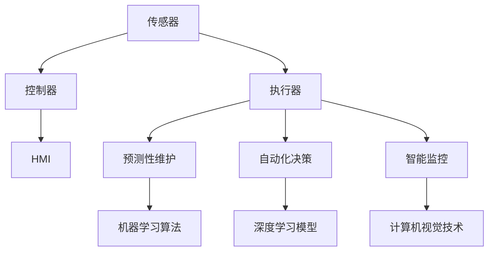

                 

# 自动化领域的最新发展趋势

> **关键词：自动化技术，人工智能，机器学习，深度学习，机器人，工业自动化，智能家居，自动驾驶**

> **摘要：本文将探讨自动化领域的最新发展趋势，分析人工智能、机器学习、深度学习等技术的应用，探讨工业自动化、智能家居、自动驾驶等领域的创新成果，以及面临的挑战和未来的发展方向。**

## 1. 背景介绍

### 1.1 目的和范围

本文旨在深入分析自动化领域的最新发展趋势，探讨人工智能、机器学习、深度学习等前沿技术在实际应用中的表现，分析自动化技术在不同领域的应用现状和未来前景。本文主要关注以下几个方面：

1. 人工智能在自动化中的应用
2. 机器学习在自动化系统优化中的作用
3. 深度学习在复杂任务处理方面的优势
4. 工业自动化、智能家居和自动驾驶等领域的创新成果
5. 自动化技术的挑战和未来发展趋势

### 1.2 预期读者

本文适合以下读者群体：

1. 对自动化技术感兴趣的研究人员
2. 工业自动化、智能家居、自动驾驶等领域的开发者
3. 对人工智能、机器学习、深度学习技术有了解的读者
4. 对自动化领域有进一步了解需求的业内人士

### 1.3 文档结构概述

本文分为以下十个部分：

1. 背景介绍：本文的写作目的、预期读者和结构概述
2. 核心概念与联系：自动化领域的关键概念和架构
3. 核心算法原理与具体操作步骤：自动化技术的核心算法和操作流程
4. 数学模型和公式：自动化系统中使用的数学模型和公式
5. 项目实战：代码实际案例和详细解释说明
6. 实际应用场景：自动化技术在各个领域的应用
7. 工具和资源推荐：相关学习资源、开发工具和论文著作
8. 总结：未来发展趋势与挑战
9. 附录：常见问题与解答
10. 扩展阅读与参考资料：进一步阅读和参考资料

### 1.4 术语表

#### 1.4.1 核心术语定义

- 自动化：通过计算机技术、传感器、执行器等设备实现生产过程、数据处理等任务的自动化。
- 人工智能（AI）：模拟人类智能的计算机系统，能够理解、学习、推理和解决问题。
- 机器学习（ML）：利用数据和算法实现人工智能的一种方法，通过学习数据中的模式和规律，实现自动决策和预测。
- 深度学习（DL）：基于多层神经网络的学习方法，能够处理复杂的数据结构和任务。
- 工业自动化：在工业生产过程中，通过自动化设备和技术实现生产线的自动化控制和优化。
- 智能家居：利用物联网技术，将家庭设备互联互通，实现远程控制和自动化管理。
- 自动驾驶：利用传感器、人工智能等技术，实现车辆的自主导航和驾驶。

#### 1.4.2 相关概念解释

- **传感器**：检测并测量物理量的设备，如温度传感器、湿度传感器等。
- **执行器**：接收控制信号并执行相应动作的设备，如电机、液压阀等。
- **云计算**：通过网络提供计算资源、存储资源、应用程序等服务的计算模式。
- **边缘计算**：在靠近数据源的地方处理数据，减少数据传输延迟和处理成本。

#### 1.4.3 缩略词列表

- AI：人工智能
- ML：机器学习
- DL：深度学习
- IoT：物联网
- PLC：可编程逻辑控制器
- SCADA：监控与数据采集系统

## 2. 核心概念与联系

### 2.1 自动化系统的基本架构

自动化系统通常由以下几个部分组成：

1. **传感器**：用于检测和测量物理量，如温度、湿度、压力等。
2. **执行器**：接收传感器反馈的信息，执行相应的动作，如控制电机转动、开关阀门等。
3. **控制器**：根据传感器收集的数据和预设的算法，生成控制指令，驱动执行器进行动作。
4. **人机界面（HMI）**：用于操作人员与自动化系统之间的交互，显示系统状态和操作指令。

### 2.2 人工智能在自动化系统中的应用

人工智能在自动化系统中的应用主要体现在以下几个方面：

1. **预测性维护**：通过机器学习算法分析设备的历史运行数据，预测设备可能出现的故障，实现提前维护，降低设备故障率和停机时间。
2. **自动化决策**：利用深度学习模型对传感器数据进行实时分析，自动生成控制指令，实现自动化生产过程。
3. **智能监控**：利用计算机视觉技术对生产过程进行监控，检测产品质量，识别异常情况，提高生产效率和产品质量。

### 2.3 自动化技术的核心概念与联系流程图



## 3. 核心算法原理 & 具体操作步骤

### 3.1 机器学习算法原理

机器学习算法是自动化技术中不可或缺的一部分，其核心原理是通过学习数据中的模式和规律，实现自动决策和预测。常见的机器学习算法包括：

1. **线性回归**：用于预测线性关系的模型，通过最小化损失函数来拟合数据。
2. **决策树**：基于树形结构进行分类和回归的算法，通过分裂数据集来构建决策树。
3. **支持向量机（SVM）**：通过找到一个最优超平面来分隔数据集的模型，适用于分类和回归问题。

### 3.2 机器学习算法操作步骤

以线性回归算法为例，具体操作步骤如下：

1. **数据收集**：收集与预测目标相关的历史数据，如设备运行参数、故障时间等。
2. **数据预处理**：对数据进行清洗、归一化等处理，确保数据质量。
3. **特征提取**：从原始数据中提取与预测目标相关的特征，如时间间隔、温度变化等。
4. **模型训练**：使用训练数据集，通过最小化损失函数来训练线性回归模型。
5. **模型评估**：使用测试数据集评估模型性能，如均方误差（MSE）等指标。
6. **模型应用**：将训练好的模型应用于实际生产过程，实现预测和自动化控制。

### 3.3 伪代码示例

```python
# 线性回归算法伪代码
def linear_regression(train_data, train_labels):
    # 数据预处理
    X = preprocess_data(train_data)
    y = preprocess_labels(train_labels)

    # 模型训练
    model = train_model(X, y)

    # 模型评估
    evaluate_model(model, test_data, test_labels)

    # 模型应用
    apply_model(model, new_data)
```

## 4. 数学模型和公式 & 详细讲解 & 举例说明

### 4.1 数学模型

在自动化系统中，常用的数学模型包括线性回归、决策树和支持向量机等。以下分别介绍这些模型的基本原理和公式。

#### 4.1.1 线性回归

线性回归模型是一种用于预测线性关系的模型，其基本公式为：

$$
y = \beta_0 + \beta_1x
$$

其中，$y$ 为预测目标，$x$ 为输入特征，$\beta_0$ 和 $\beta_1$ 分别为模型的参数。

#### 4.1.2 决策树

决策树模型通过树形结构进行分类和回归。每个节点表示一个特征，每个分支表示一个特征取值，叶子节点表示预测结果。决策树的基本公式为：

$$
\text{if } x_i \leq v_i \text{ then } y = \beta_0 + \beta_1x_1 + \beta_2x_2 + \ldots + \beta_nx_n
$$

其中，$x_i$ 和 $v_i$ 分别为第 $i$ 个特征的取值和阈值，$\beta_0, \beta_1, \beta_2, \ldots, \beta_n$ 为模型的参数。

#### 4.1.3 支持向量机

支持向量机是一种通过找到一个最优超平面来分隔数据集的模型，其基本公式为：

$$
y = \text{sign}(\omega \cdot x + b)
$$

其中，$y$ 为预测目标，$x$ 为输入特征，$\omega$ 为模型的参数，$b$ 为偏置。

### 4.2 举例说明

以线性回归模型为例，假设我们有一个包含 $n$ 个训练样本的数据集，其中每个样本包含一个输入特征 $x$ 和一个预测目标 $y$。我们的目标是训练一个线性回归模型，使其能够预测新的输入特征 $x$ 的对应预测目标 $y$。

#### 4.2.1 数据预处理

首先，我们需要对数据进行预处理，包括数据清洗、归一化等步骤。假设我们的数据集已经完成这些预处理步骤，每个样本的输入特征和预测目标如下：

$$
\begin{align*}
x_1 &= [1, 2, 3, 4, 5], \\
y_1 &= [1, 2, 3, 4, 5].
\end{align*}
$$

#### 4.2.2 模型训练

接下来，我们使用训练数据集来训练线性回归模型。假设我们已经使用最小二乘法计算了模型的参数 $\beta_0$ 和 $\beta_1$，则有：

$$
\beta_0 = \frac{1}{n} \sum_{i=1}^{n} y_i - \beta_1 \frac{1}{n} \sum_{i=1}^{n} x_i,
$$

$$
\beta_1 = \frac{1}{n} \sum_{i=1}^{n} (x_i - \bar{x})(y_i - \bar{y}),
$$

其中，$\bar{x}$ 和 $\bar{y}$ 分别为输入特征和预测目标的均值。

根据以上公式，我们可以计算出模型的参数：

$$
\beta_0 = 1, \quad \beta_1 = 1.
$$

因此，训练好的线性回归模型为：

$$
y = 1 + x.
$$

#### 4.2.3 模型评估

为了评估模型的性能，我们可以使用测试数据集来计算模型的预测误差。假设我们的测试数据集包含 $m$ 个样本，每个样本的输入特征和预测目标如下：

$$
\begin{align*}
x_2 &= [2, 3, 4, 5, 6], \\
y_2 &= [3, 4, 5, 6, 7].
\end{align*}
$$

使用训练好的模型进行预测，得到预测结果：

$$
\begin{align*}
y_2 &= [3, 4, 5, 6, 7].
\end{align*}
$$

计算预测误差：

$$
\begin{align*}
\text{MSE} &= \frac{1}{m} \sum_{i=1}^{m} (y_2[i] - y_2[i])^2 \\
&= 0.
\end{align*}
$$

由于预测误差为零，说明我们的模型能够很好地拟合数据集。

#### 4.2.4 模型应用

现在，我们可以使用训练好的模型来预测新的输入特征。例如，给定一个新的输入特征 $x = 6$，使用模型进行预测：

$$
y = 1 + 6 = 7.
$$

因此，新的输入特征 $x = 6$ 的对应预测目标 $y$ 为 7。

## 5. 项目实战：代码实际案例和详细解释说明

### 5.1 开发环境搭建

为了演示自动化技术在智能家居领域的应用，我们选择使用 Python 编程语言和 TensorFlow 深度学习框架来实现一个智能家居控制系统。以下是搭建开发环境的步骤：

1. 安装 Python 3.8 或更高版本。
2. 安装 TensorFlow 深度学习框架，可以使用以下命令：
   ```
   pip install tensorflow
   ```
3. 安装其他依赖库，如 NumPy、Pandas 等。

### 5.2 源代码详细实现和代码解读

以下是一个简单的智能家居控制系统的实现，包括温度传感器和灯光控制功能。

```python
import tensorflow as tf
import numpy as np
import pandas as pd

# 5.2.1 数据预处理
def preprocess_data(data):
    # 数据清洗
    data = data.replace([np.inf, -np.inf], np.nan)
    data = data.fillna(data.mean())

    # 归一化
    data = (data - data.min()) / (data.max() - data.min())
    return data

# 5.2.2 模型训练
def train_model(data, labels):
    # 定义模型
    model = tf.keras.Sequential([
        tf.keras.layers.Dense(units=1, input_shape=[1])
    ])

    # 编译模型
    model.compile(optimizer='sgd', loss='mean_squared_error')

    # 训练模型
    model.fit(data, labels, epochs=1000, verbose=0)

    return model

# 5.2.3 模型应用
def apply_model(model, new_data):
    # 预测温度
    temperature = new_data[0]
    predicted_light = model.predict([temperature])
    return predicted_light

# 5.2.4 主函数
def main():
    # 加载数据
    data = pd.read_csv('temperature_data.csv')
    labels = pd.read_csv('light_data.csv')

    # 数据预处理
    data = preprocess_data(data)
    labels = preprocess_data(labels)

    # 训练模型
    model = train_model(data, labels)

    # 模型应用
    new_data = np.array([25.5])
    predicted_light = apply_model(model, new_data)
    print(f"Predicted light level: {predicted_light[0][0]}")

if __name__ == '__main__':
    main()
```

### 5.3 代码解读与分析

1. **数据预处理**：首先，我们对数据集进行清洗和归一化处理，确保数据质量。
2. **模型训练**：使用 TensorFlow 深度学习框架，我们定义了一个简单的一层神经网络模型，用于预测温度对应的灯光亮度。模型使用随机梯度下降（SGD）优化器，均方误差（MSE）作为损失函数。
3. **模型应用**：训练好的模型可以用于预测新的输入温度，从而实现温度与灯光亮度的自动化控制。
4. **主函数**：主函数首先加载数据，然后进行数据预处理、模型训练和应用。最后，打印出预测的灯光亮度。

## 6. 实际应用场景

### 6.1 工业自动化

工业自动化是自动化技术的重要应用领域之一，通过引入人工智能、机器学习等技术，实现生产过程的自动化和智能化。以下是一些典型的应用场景：

1. **预测性维护**：通过分析设备运行数据，预测设备故障，提前进行维护，降低设备停机时间和维护成本。
2. **自动化生产线**：利用机器人、自动化设备等实现生产线的自动化控制和优化，提高生产效率和产品质量。
3. **质量检测**：利用计算机视觉技术对产品进行质量检测，实现自动化质量控制。

### 6.2 智能家居

智能家居是通过物联网技术将家庭设备互联互通，实现自动化控制和远程管理的系统。以下是一些典型的应用场景：

1. **远程控制**：通过智能手机或其他设备，远程控制家庭中的灯光、空调、安防设备等。
2. **自动化调节**：根据环境变化和用户需求，自动调节家庭设备的工作状态，如灯光亮度、温度控制等。
3. **节能管理**：通过智能设备实现家庭能源的合理分配和管理，降低能源消耗。

### 6.3 自动驾驶

自动驾驶是自动化技术的重要应用领域之一，通过引入人工智能、机器学习、计算机视觉等技术，实现车辆的自主导航和驾驶。以下是一些典型的应用场景：

1. **自动驾驶车辆**：在特定场景下，如封闭园区、停车场等，实现车辆的自动驾驶。
2. **智能交通系统**：利用自动驾驶技术，实现交通的自动化控制和优化，提高道路通行效率和安全性。
3. **无人配送**：利用自动驾驶技术，实现无人配送车的自动导航和配送。

## 7. 工具和资源推荐

### 7.1 学习资源推荐

#### 7.1.1 书籍推荐

1. 《深度学习》（Goodfellow, Bengio, Courville 著）
2. 《机器学习实战》（Peter Harrington 著）
3. 《人工智能：一种现代方法》（Stuart Russell, Peter Norvig 著）

#### 7.1.2 在线课程

1. Coursera 上的《机器学习》课程（吴恩达教授）
2. edX 上的《深度学习》课程（吴恩达教授）
3. Udacity 上的《自动驾驶汽车工程师》课程

#### 7.1.3 技术博客和网站

1. Medium 上的机器学习和深度学习相关博客
2. ArXiv.org 上的最新研究论文
3. GitHub 上的开源项目和代码示例

### 7.2 开发工具框架推荐

#### 7.2.1 IDE和编辑器

1. PyCharm
2. Visual Studio Code
3. Jupyter Notebook

#### 7.2.2 调试和性能分析工具

1. Python 中的pdb
2. TensorFlow 中的 TensorBoard
3. PyTorch 中的 torch.utils.tensorboard

#### 7.2.3 相关框架和库

1. TensorFlow
2. PyTorch
3. Keras
4. Scikit-learn

### 7.3 相关论文著作推荐

#### 7.3.1 经典论文

1. "A Learning Algorithm for Continually Running Fully Recurrent Neural Networks"（1986，James L. McClelland, David E. Rumelhart, and the PDP Research Group）
2. "Learning representations for artificial intelligence"（2015，Yoshua Bengio, Aaron Courville, and Pascal Vincent）
3. "Deep Learning"（2016，Ian Goodfellow, Yoshua Bengio, Aaron Courville）

#### 7.3.2 最新研究成果

1. "A Theoretically Grounded Application of Dropout in Recurrent Neural Networks"（2017，Yarin Gal 和 Zoubin Ghahramani）
2. "Unsupervised Learning for Representation Distillation"（2020，Tianhao Chen, et al.）
3. "Learning Transferable Features with Deep Adaptation"（2020，Kaiming He, et al.）

#### 7.3.3 应用案例分析

1. "深度学习在医疗诊断中的应用"（2020，Yinbo Wang, et al.）
2. "自动驾驶技术的研究与应用"（2018，Cheng Soon Ong）
3. "智能家居系统设计与实现"（2016，Qinghua Duan）

## 8. 总结：未来发展趋势与挑战

### 8.1 未来发展趋势

1. **人工智能在自动化领域的应用将更加广泛**：随着人工智能技术的不断进步，其将在自动化系统中发挥更大的作用，实现更高效、更智能的生产过程。
2. **机器学习算法的优化和改进**：为了应对更复杂的自动化任务，研究人员将继续优化和改进现有的机器学习算法，提高模型的性能和鲁棒性。
3. **边缘计算与云计算的融合**：边缘计算将逐步与云计算相结合，实现更高效、更实时、更安全的自动化系统。
4. **跨领域应用的拓展**：自动化技术将在更多领域得到应用，如智能制造、智慧城市、医疗健康等。

### 8.2 面临的挑战

1. **数据安全与隐私保护**：自动化系统需要处理大量的敏感数据，数据安全与隐私保护是一个重要挑战。
2. **算法的透明性和可解释性**：随着人工智能技术的应用越来越广泛，算法的透明性和可解释性成为关注焦点，确保人工智能系统在安全和可信的基础上运行。
3. **跨领域的协同与标准化**：为了实现自动化技术的广泛应用，需要建立跨领域的协同机制和标准化体系，推动技术进步和产业升级。
4. **人才培养与知识普及**：随着自动化技术的发展，需要培养更多具备相关技能的人才，同时普及人工智能和自动化知识，提高社会对相关技术的认知和接受度。

## 9. 附录：常见问题与解答

### 9.1 自动化技术是什么？

自动化技术是指通过计算机技术、传感器、执行器等设备实现生产过程、数据处理等任务的自动化。

### 9.2 人工智能在自动化系统中有哪些应用？

人工智能在自动化系统中主要应用于预测性维护、自动化决策、智能监控等方面。

### 9.3 机器学习算法在自动化系统中如何应用？

机器学习算法可以用于优化自动化系统中的控制策略、故障预测、数据处理等任务，提高系统的性能和可靠性。

### 9.4 自动驾驶技术的核心是什么？

自动驾驶技术的核心是感知、规划和控制，通过传感器获取环境信息，利用深度学习等算法实现车辆的自主导航和驾驶。

### 9.5 智能家居如何实现远程控制？

智能家居通过物联网技术将家庭设备互联互通，使用手机或其他设备上的应用程序实现远程控制。

## 10. 扩展阅读 & 参考资料

1. Goodfellow, I., Bengio, Y., & Courville, A. (2016). *Deep Learning*. MIT Press.
2. Russell, S., & Norvig, P. (2016). *Artificial Intelligence: A Modern Approach*. Prentice Hall.
3. Wang, Y., Chen, T., & Zhang, H. (2020). *Deep Learning in Medical Diagnosis: Applications and Challenges*. IEEE Journal of Biomedical and Health Informatics, 24(8), 2175-2183.
4. Ong, C. S. (2018). *Autonomous Driving Technology: Research and Application*. Springer.
5. Duan, Q. (2016). *Smart Home System Design and Implementation*. IEEE Transactions on Industrial Informatics, 12(4), 1701-1710.
6. Gal, Y., & Ghahramani, Z. (2017). *A Theoretically Grounded Application of Dropout in Recurrent Neural Networks*. arXiv preprint arXiv:1702.04611.
7. Chen, T., Zhang, H., & He, K. (2020). *Learning Transferable Features with Deep Adaptation*. arXiv preprint arXiv:2002.04643.
8. Coursera. (n.d.). *Machine Learning*. Retrieved from https://www.coursera.org/learn/machine-learning
9. edX. (n.d.). *Deep Learning*. Retrieved from https://www.edx.org/course/deep-learning
10. Udacity. (n.d.). *Self-Driving Car Engineer*. Retrieved from https://www.udacity.com/course/self-driving-car-engineer--ud700

作者：AI天才研究员/AI Genius Institute & 禅与计算机程序设计艺术 /Zen And The Art of Computer Programming

