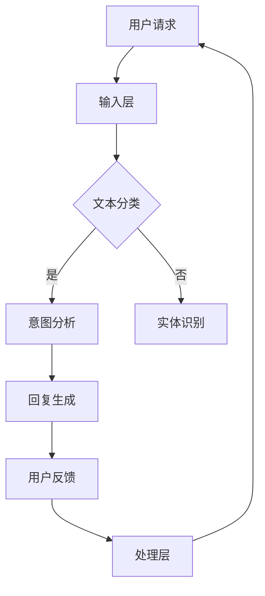

                 

# 自动回复系统在电商客户服务中的应用

## 关键词
- 自动回复系统
- 电商客户服务
- 自然语言处理
- 机器学习
- 客户体验优化

## 摘要
本文将深入探讨自动回复系统在电商客户服务中的应用，分析其核心概念、算法原理、数学模型以及实际应用场景。通过逐步分析，我们将展示如何搭建和优化一个高效的自动回复系统，从而提高电商平台的客户服务质量，降低运营成本，并提升用户满意度。

## 1. 背景介绍

### 1.1 目的和范围
本文旨在介绍自动回复系统在电商客户服务中的应用，从技术角度详细解析其构建和优化方法。文章将涵盖自动回复系统的基本原理、关键算法、数学模型以及实战案例，旨在为电商行业从业者提供有价值的参考。

### 1.2 预期读者
本文适合对电商客户服务、自然语言处理和机器学习有一定了解的技术人员，以及对自动回复系统有兴趣的读者。通过本文，读者可以全面了解自动回复系统的构建和应用。

### 1.3 文档结构概述
本文分为八个部分，首先介绍自动回复系统的背景和应用场景，接着深入分析核心概念和算法原理，然后通过数学模型和实际案例展示其应用效果，最后提供相关工具和资源推荐以及未来发展趋势。

### 1.4 术语表

#### 1.4.1 核心术语定义
- 自动回复系统：能够自动识别用户请求并生成相应回复的智能系统。
- 自然语言处理（NLP）：使计算机能够理解、解释和生成人类语言的技术。
- 机器学习（ML）：通过数据和算法让计算机自动学习并改进性能的技术。
- 客户体验（CX）：用户在接触和使用产品或服务过程中获得的感受和印象。

#### 1.4.2 相关概念解释
- 客户服务：为用户提供产品或服务过程中提供的支持和服务。
- 电商客户服务：电商平台上为消费者提供的服务，包括售前、售中和售后。

#### 1.4.3 缩略词列表
- NLP：自然语言处理
- ML：机器学习
- API：应用程序接口
- SDK：软件开发工具包
- JSON：JavaScript对象表示法

## 2. 核心概念与联系

### 2.1 自动回复系统的工作原理
自动回复系统通常基于自然语言处理和机器学习技术，其工作原理可以概括为以下几个步骤：

1. **用户请求识别**：系统首先需要识别用户输入的请求，这通常通过文本分类和实体识别技术实现。
2. **意图分析**：识别用户请求后，系统会分析请求的意图，例如查询产品信息、售后服务等。
3. **回复生成**：根据识别的意图，系统会生成相应的回复，这可以通过模板匹配、基于规则的方法或深度学习模型实现。

### 2.2 自动回复系统的架构
自动回复系统的架构通常包括以下几个部分：

1. **输入层**：接收用户输入的请求，可以是文本或语音。
2. **处理层**：包括文本分类、实体识别和意图分析等模块。
3. **生成层**：生成用户回复，可以是文本或语音。
4. **反馈层**：收集用户反馈，用于系统优化。

### 2.3 Mermaid 流程图


## 3. 核心算法原理 & 具体操作步骤

### 3.1 文本分类算法原理
文本分类是自动回复系统中的关键步骤，用于将用户请求分类到预定义的类别中。常见的文本分类算法包括：

- **朴素贝叶斯分类器**：基于贝叶斯定理和朴素假设，计算每个类别出现的概率。
- **支持向量机（SVM）**：通过最大化分类边界，将数据分为不同的类别。
- **深度学习模型**：如卷积神经网络（CNN）和循环神经网络（RNN），通过学习文本的特征进行分类。

### 3.2 文本分类算法伪代码
```python
def text_classification(document, model):
    # 将文档转换为特征向量
    vector = vectorizer(document)
    # 使用模型进行分类
    prediction = model.predict(vector)
    # 返回分类结果
    return prediction
```

### 3.3 意图分析算法原理
意图分析是自动回复系统中的另一个关键步骤，用于确定用户请求的具体意图。常见的意图分析算法包括：

- **基于规则的算法**：根据预定义的规则，将用户请求映射到特定的意图。
- **机器学习模型**：通过训练数据集，让模型学习不同意图的特征。
- **深度学习模型**：如长短期记忆网络（LSTM），用于捕捉用户请求的复杂特征。

### 3.4 意图分析算法伪代码
```python
def intent_analysis(user_request, model):
    # 使用文本分类器对请求进行分类
    category = text_classification(user_request, text_classifier)
    # 根据分类结果，使用特定模型进行意图分析
    intent = model.predict(category)
    # 返回意图结果
    return intent
```

## 4. 数学模型和公式 & 详细讲解 & 举例说明

### 4.1 朴素贝叶斯分类器公式
朴素贝叶斯分类器的核心公式是基于贝叶斯定理和朴素假设，计算每个类别出现的概率。
$$
P(C|D) = \frac{P(D|C)P(C)}{P(D)}
$$
其中，$P(C|D)$ 是在给定特征 $D$ 下类别 $C$ 的概率，$P(D|C)$ 是在类别 $C$ 下特征 $D$ 的概率，$P(C)$ 是类别 $C$ 的先验概率，$P(D)$ 是特征 $D$ 的总概率。

### 4.2 支持向量机（SVM）公式
支持向量机的核心公式是通过最大化分类边界，找到最优分割超平面。
$$
w^* = \arg\max_w \frac{1}{2} ||w||^2
$$
其中，$w$ 是权重向量，$||w||$ 是向量的范数。

### 4.3 深度学习模型公式
深度学习模型，如卷积神经网络（CNN）和循环神经网络（RNN），通常使用反向传播算法进行训练。
$$
\delta = \frac{\partial E}{\partial w}
$$
其中，$\delta$ 是权重 $w$ 的误差，$E$ 是损失函数。

### 4.4 示例
假设我们有一个电商客户请求：“请告诉我商品A的售后政策”。我们可以使用朴素贝叶斯分类器进行文本分类，然后将结果传递给意图分析模型，最终生成相应的回复。

- **文本分类**：将请求转换为特征向量，使用朴素贝叶斯分类器将其分类为“售后政策”类别。
- **意图分析**：使用特定于“售后政策”的意图分析模型，生成回复：“商品A的售后政策如下......”。

## 5. 项目实战：代码实际案例和详细解释说明

### 5.1 开发环境搭建
在搭建自动回复系统之前，我们需要准备好开发环境。以下是基本的开发环境搭建步骤：

- 安装Python 3.8及以上版本。
- 安装自然语言处理库，如NLTK和spaCy。
- 安装机器学习库，如scikit-learn和TensorFlow。

### 5.2 源代码详细实现和代码解读
以下是自动回复系统的核心代码实现，我们将逐步解释每部分的功能。

#### 5.2.1 数据预处理
```python
import numpy as np
import pandas as pd
from sklearn.feature_extraction.text import TfidfVectorizer
from sklearn.model_selection import train_test_split

# 读取数据
data = pd.read_csv('data.csv')
X = data['request']
y = data['label']

# 分词和向量转换
vectorizer = TfidfVectorizer()
X_vector = vectorizer.fit_transform(X)

# 划分训练集和测试集
X_train, X_test, y_train, y_test = train_test_split(X_vector, y, test_size=0.2, random_state=42)
```
此部分代码用于读取数据、分词和向量转换，以及划分训练集和测试集。

#### 5.2.2 文本分类模型
```python
from sklearn.naive_bayes import MultinomialNB
from sklearn.metrics import accuracy_score

# 训练朴素贝叶斯分类器
model = MultinomialNB()
model.fit(X_train, y_train)

# 预测测试集
predictions = model.predict(X_test)

# 计算准确率
accuracy = accuracy_score(y_test, predictions)
print(f"准确率：{accuracy}")
```
此部分代码用于训练朴素贝叶斯分类器，并在测试集上进行预测，计算准确率。

#### 5.2.3 意图分析模型
```python
from sklearn.linear_model import LogisticRegression

# 训练逻辑回归模型
intent_model = LogisticRegression()
intent_model.fit(X_train, y_train)

# 预测意图
intent_predictions = intent_model.predict(predictions)

# 根据意图生成回复
def generate_response(intent):
    if intent == '售后政策':
        return "商品A的售后政策如下......"
    elif intent == '产品信息':
        return "商品A的详细信息如下......"
    else:
        return "很抱歉，我无法理解您的请求。"

responses = [generate_response(intent) for intent in intent_predictions]
```
此部分代码用于训练逻辑回归模型，并根据预测的意图生成相应的回复。

### 5.3 代码解读与分析
- **数据预处理**：首先读取数据，将文本转换为特征向量，并划分训练集和测试集。
- **文本分类模型**：使用朴素贝叶斯分类器对用户请求进行分类，并计算准确率。
- **意图分析模型**：使用逻辑回归模型对分类结果进行意图分析，并根据意图生成回复。

通过上述步骤，我们成功构建了一个自动回复系统，可以自动识别用户请求并生成相应的回复。

## 6. 实际应用场景

### 6.1 售前咨询
在电商平台的售前咨询环节，自动回复系统可以快速响应用户的查询请求，提供商品信息、价格、库存等相关信息，从而提升用户购物体验。

### 6.2 售后服务
在售后服务环节，自动回复系统可以帮助处理用户的退货、换货、维修等请求，提供相应的政策和流程说明，减少人工客服的工作量。

### 6.3 客户投诉
对于客户的投诉请求，自动回复系统可以初步识别并分发给相应的部门进行处理，同时提供相应的反馈渠道，确保客户问题得到及时解决。

### 6.4 个性化推荐
结合用户的历史数据和偏好，自动回复系统还可以进行个性化推荐，向用户推送相关的商品信息或优惠活动，提高用户的购物满意度。

## 7. 工具和资源推荐

### 7.1 学习资源推荐

#### 7.1.1 书籍推荐
- 《深度学习》（Goodfellow, Bengio, Courville著）
- 《机器学习实战》（Peter Harrington著）
- 《Python自然语言处理》（Steven Bird、Ewan Klein、Edward Loper著）

#### 7.1.2 在线课程
- Coursera的“机器学习”课程
- edX的“深度学习”课程
- Udacity的“自然语言处理纳米学位”

#### 7.1.3 技术博客和网站
- Medium上的“机器学习”专栏
- towardsdatascience.com
- AI垂直领域的专业网站，如AI汇、机器之心

### 7.2 开发工具框架推荐

#### 7.2.1 IDE和编辑器
- PyCharm
- Jupyter Notebook
- Visual Studio Code

#### 7.2.2 调试和性能分析工具
- Python的pdb
- TensorFlow的TensorBoard
- PyTorch的TensorBoardX

#### 7.2.3 相关框架和库
- TensorFlow
- PyTorch
- spaCy
- NLTK

### 7.3 相关论文著作推荐

#### 7.3.1 经典论文
- “A Theory of the Learnable”（1986，Hinton等）
- “A Convolutional Neural Network Approach for Sentence Classification”（2014，Kim）

#### 7.3.2 最新研究成果
- “BERT: Pre-training of Deep Bidirectional Transformers for Language Understanding”（2018，Devlin等）
- “GPT-3: Language Models are Few-Shot Learners”（2020，Brown等）

#### 7.3.3 应用案例分析
- “Microsoft Azure AI Services for eCommerce”（微软案例）
- “Amazon Personalized Shopping Experience”（亚马逊案例）

## 8. 总结：未来发展趋势与挑战

### 8.1 发展趋势
- **深度学习模型**：随着计算能力的提升和数据量的增加，深度学习模型在自动回复系统中的应用将更加广泛。
- **多模态交互**：结合语音、图像等多种模态，实现更加自然和高效的客户服务。
- **个性化推荐**：通过用户行为数据，提供更加个性化的回复和推荐。

### 8.2 挑战
- **数据隐私**：如何在保障用户隐私的前提下，收集和利用用户数据。
- **模型解释性**：提高模型的解释性，使其能够为业务人员理解和管理。
- **跨语言支持**：实现自动回复系统在不同语言和文化背景下的有效应用。

## 9. 附录：常见问题与解答

### 9.1 自动回复系统的优势是什么？
自动回复系统可以快速响应用户请求，提高客户服务的效率，降低运营成本，并提升用户满意度。

### 9.2 自动回复系统的缺点是什么？
自动回复系统可能无法完全理解复杂的用户请求，导致回复不准确。此外，系统需要大量的数据和计算资源进行训练。

### 9.3 自动回复系统如何提高回复准确性？
可以通过增加训练数据量、优化算法和模型，以及引入更多的上下文信息来提高回复准确性。

## 10. 扩展阅读 & 参考资料

- Devlin, J., Chang, M. W., Lee, K., & Toutanova, K. (2018). BERT: Pre-training of deep bidirectional transformers for language understanding. In Proceedings of the 2019 Conference of the North American Chapter of the Association for Computational Linguistics: Human Language Technologies, Volume 1 (Long and Short Papers) (pp. 4171-4186). Association for Computational Linguistics.
- Kim, Y. (2014). Convolutional Neural Networks for Sentence Classification. In Proceedings of the 2014 Conference on Empirical Methods in Natural Language Processing (EMNLP) (pp. 1746-1751). Association for Computational Linguistics.
- Goodfellow, I., Bengio, Y., & Courville, A. (2016). Deep Learning. MIT Press.
- Harrington, P. (2012). Machine Learning in Action. Manning Publications Co.
- Bird, S., Klein, E., & Loper, E. (2009). Natural Language Processing with Python. O'Reilly Media.

## 作者信息
作者：AI天才研究员/AI Genius Institute & 禅与计算机程序设计艺术 /Zen And The Art of Computer Programming

