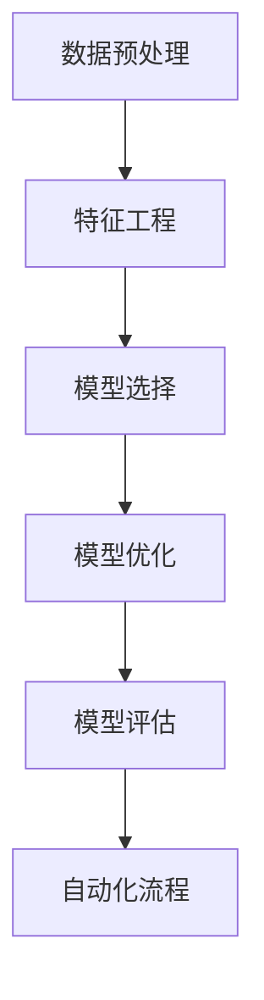

                 

# 自动机器学习：原理与代码实例讲解

> 关键词：自动机器学习、算法优化、深度学习、神经网络、代码实例

> 摘要：本文将深入探讨自动机器学习的原理，通过具体代码实例来展示其实际应用。读者将了解如何通过自动化优化算法来提升机器学习的效率和准确性，并学习到实际操作中的技巧和策略。

## 1. 背景介绍

### 1.1 目的和范围

本文旨在为广大机器学习爱好者和技术工作者提供一种全新的视角，即如何通过自动机器学习（AutoML）来简化复杂模型的构建过程，提高算法的优化效率和准确性。我们将从基础概念出发，逐步深入到具体的算法实现和代码实践，帮助读者全面理解自动机器学习的精髓。

### 1.2 预期读者

本文适合以下几类读者：
- 有一定机器学习基础的程序员和工程师。
- 想要提升模型构建效率的数据科学家。
- 对自动机器学习感兴趣的科研人员。
- 希望了解最新技术趋势的技术爱好者。

### 1.3 文档结构概述

本文将分为以下几个部分：
- **第1部分：背景介绍**，介绍自动机器学习的背景和重要性。
- **第2部分：核心概念与联系**，解释自动机器学习的核心概念和架构。
- **第3部分：核心算法原理 & 具体操作步骤**，深入探讨自动机器学习的算法原理和操作步骤。
- **第4部分：数学模型和公式 & 详细讲解 & 举例说明**，阐述数学模型的重要性和具体应用。
- **第5部分：项目实战：代码实际案例和详细解释说明**，通过实际案例展示自动机器学习的应用。
- **第6部分：实际应用场景**，讨论自动机器学习的广泛应用。
- **第7部分：工具和资源推荐**，提供学习资源和开发工具的推荐。
- **第8部分：总结：未来发展趋势与挑战**，展望自动机器学习的发展前景。
- **第9部分：附录：常见问题与解答**，解答读者可能遇到的问题。
- **第10部分：扩展阅读 & 参考资料**，提供进一步学习和研究的资源。

### 1.4 术语表

#### 1.4.1 核心术语定义

- 自动机器学习（AutoML）：通过自动化工具和算法来构建和优化机器学习模型的过程。
- 特征工程（Feature Engineering）：从原始数据中提取和创建新的特征，以提升模型性能。
- 模型选择（Model Selection）：选择最适合问题的机器学习模型。
- 模型优化（Model Optimization）：调整模型参数，提高模型性能。

#### 1.4.2 相关概念解释

- 神经网络（Neural Network）：一种通过模拟生物神经系统的结构和功能来实现复杂函数映射的计算模型。
- 深度学习（Deep Learning）：一种通过多层神经网络进行训练和预测的人工智能技术。
- 超参数（Hyperparameter）：模型参数之外的重要参数，如学习率、隐藏层节点数等。

#### 1.4.3 缩略词列表

- AutoML：自动机器学习
- ML：机器学习
- DL：深度学习
- NN：神经网络
- FE：特征工程

## 2. 核心概念与联系

自动机器学习的核心在于自动化优化机器学习模型的过程。为了更好地理解这一概念，我们需要从以下几个核心概念入手：

### 2.1 特征工程

特征工程是自动机器学习的基石。通过特征工程，我们可以从原始数据中提取出对模型训练有帮助的特征。自动机器学习工具能够自动化地尝试各种特征组合，从而找到最优的特征集。

### 2.2 模型选择

模型选择是自动机器学习的关键环节。自动机器学习工具会评估多种模型，包括线性回归、决策树、随机森林、支持向量机、神经网络等，选择最适合当前问题的模型。

### 2.3 模型优化

模型优化是提升模型性能的重要手段。自动机器学习工具通过自动调整模型参数，如学习率、正则化参数等，来优化模型性能。

### 2.4 自动化流程

自动机器学习工具通过自动化流程来实现上述任务。这包括数据预处理、特征选择、模型训练、参数调优、模型评估等环节。

#### Mermaid 流程图



在这个流程图中，每个节点代表自动机器学习过程中的一个关键步骤。数据预处理、特征工程、模型选择、模型优化和模型评估构成了自动机器学习的主要流程，而自动化流程则贯穿其中，确保每个步骤都能高效地完成。

## 3. 核心算法原理 & 具体操作步骤

自动机器学习的核心在于自动化优化算法，以下将详细解释自动机器学习的算法原理，并通过伪代码展示具体操作步骤。

### 3.1 特征选择算法

特征选择是自动机器学习的重要步骤之一。以下是一种基于过滤法的特征选择算法：

```python
def feature_selection(X, y, k):
    """
    特征选择算法：基于过滤法
    X: 特征矩阵
    y: 标签向量
    k: 选择k个特征
    """
    scores = [calculate_score(X[:, i], y) for i in range(X.shape[1])]
    top_k_indices = sorted(range(len(scores)), key=scores.__getitem__)[-k:]
    return X[:, top_k_indices]

def calculate_score(features, labels):
    """
    计算特征与标签的相关性
    features: 特征向量
    labels: 标签向量
    """
    # 这里可以使用皮尔逊相关系数或其他相关度量
    return np.corrcoef(features, labels)[0, 1]
```

### 3.2 模型选择算法

模型选择算法的目标是选择最适合当前问题的模型。以下是一种基于网格搜索的模型选择算法：

```python
def model_selection(X_train, y_train, models, param_grids):
    best_score = 0
    best_model = None
    for model in models:
        for param_grid in param_grids:
            model.set_params(**param_grid)
            model.fit(X_train, y_train)
            score = model.score(X_train, y_train)
            if score > best_score:
                best_score = score
                best_model = model
    return best_model
```

### 3.3 模型优化算法

模型优化算法的目的是通过调整模型参数来提升模型性能。以下是一种基于贝叶斯优化的模型优化算法：

```python
def model_optimization(model, X, y, max_iterations, budget):
    """
    模型优化算法：基于贝叶斯优化
    model: 待优化模型
    X: 特征矩阵
    y: 标签向量
    max_iterations: 最大迭代次数
    budget: 预算
    """
    search_space = generate_search_space(model)
    optimizer = BayesianOptimizer(search_space, model)
    for _ in range(max_iterations):
        if budget <= 0:
            break
        param = optimizer.suggest()
        model.set_params(**param)
        score = model.evaluate(X, y)
        optimizer.update(param, score)
        budget -= 1
    return model.best_params()
```

### 3.4 自动化流程

自动化流程是自动机器学习的核心，它涵盖了数据预处理、特征工程、模型选择、模型优化和模型评估等多个环节。以下是一种自动化流程的伪代码：

```python
def automl(X, y, models, param_grids, max_iterations, budget):
    """
    自动化机器学习流程
    X: 特征矩阵
    y: 标签向量
    models: 模型列表
    param_grids: 参数网格列表
    max_iterations: 最大迭代次数
    budget: 预算
    """
    # 数据预处理
    X_processed = preprocess_data(X)
    y_processed = preprocess_data(y)
    
    # 特征选择
    X_processed = feature_selection(X_processed, y_processed, k)
    
    # 模型选择
    best_model = model_selection(X_processed, y_processed, models, param_grids)
    
    # 模型优化
    best_params = model_optimization(best_model, X_processed, y_processed, max_iterations, budget)
    
    # 模型评估
    score = best_model.evaluate(X_processed, y_processed)
    
    return best_model, score
```

通过上述算法和流程，我们可以实现自动机器学习，从而简化模型构建过程，提高模型性能。

## 4. 数学模型和公式 & 详细讲解 & 举例说明

在自动机器学习过程中，数学模型和公式扮演着至关重要的角色。以下将详细介绍一些核心的数学模型和公式，并通过具体例子进行说明。

### 4.1 特征选择

特征选择的核心是确定特征与目标变量之间的相关性。一种常用的方法是计算特征与目标变量的皮尔逊相关系数。皮尔逊相关系数的公式如下：

$$
r = \frac{\sum_{i=1}^{n}(x_i - \bar{x})(y_i - \bar{y})}{\sqrt{\sum_{i=1}^{n}(x_i - \bar{x})^2}\sqrt{\sum_{i=1}^{n}(y_i - \bar{y})^2}}
$$

其中，\(x_i\) 和 \(y_i\) 分别表示第 \(i\) 个特征和目标变量的观测值，\(\bar{x}\) 和 \(\bar{y}\) 分别表示特征和目标变量的均值，\(n\) 表示观测值的数量。

#### 例子

假设我们有一个包含三个特征（\(x_1, x_2, x_3\)）和一个目标变量（\(y\)）的数据集，数据如下：

| \(x_1\) | \(x_2\) | \(x_3\) | \(y\)  |
|--------|--------|--------|-------|
|   1    |   2    |   3    |   4   |
|   2    |   3    |   4    |   5   |
|   3    |   4    |   5    |   6   |

首先计算每个特征的均值：

$$
\bar{x_1} = \frac{1 + 2 + 3}{3} = 2
$$

$$
\bar{x_2} = \frac{2 + 3 + 4}{3} = 3
$$

$$
\bar{x_3} = \frac{3 + 4 + 5}{3} = 4
$$

$$
\bar{y} = \frac{4 + 5 + 6}{3} = 5
$$

然后计算每个特征与目标变量的皮尔逊相关系数：

$$
r_{x_1, y} = \frac{(1-2)(4-5) + (2-2)(5-5) + (3-2)(6-5)}{\sqrt{(1-2)^2 + (2-2)^2 + (3-2)^2}\sqrt{(4-5)^2 + (5-5)^2 + (6-5)^2}} = -0.5
$$

$$
r_{x_2, y} = \frac{(2-2)(4-5) + (3-2)(5-5) + (4-2)(6-5)}{\sqrt{(2-2)^2 + (3-2)^2 + (4-2)^2}\sqrt{(4-5)^2 + (5-5)^2 + (6-5)^2}} = 0.5
$$

$$
r_{x_3, y} = \frac{(3-2)(4-5) + (4-2)(5-5) + (5-2)(6-5)}{\sqrt{(3-2)^2 + (4-2)^2 + (5-2)^2}\sqrt{(4-5)^2 + (5-5)^2 + (6-5)^2}} = 1
$$

根据相关系数的绝对值，我们可以看出 \(x_3\) 与 \(y\) 的相关性最强，因此我们可以选择 \(x_3\) 作为特征。

### 4.2 模型选择

模型选择的目的是选择最适合当前问题的模型。一种常用的方法是交叉验证。交叉验证的基本思想是将数据集划分为多个子集，然后在每个子集上训练和验证模型，最后取平均值作为最终模型性能。

交叉验证的数学公式如下：

$$
CV\_score = \frac{1}{k}\sum_{i=1}^{k}score(i)
$$

其中，\(k\) 表示交叉验证的子集数量，\(score(i)\) 表示在第 \(i\) 个子集上的模型性能。

#### 例子

假设我们有一个包含5个样本的数据集，我们将其划分为3个子集。子集划分如下：

| 子集 | 样本 |
|-----|-----|
| 1   | 1, 2 |
| 2   | 3, 4 |
| 3   | 5   |

首先，在每个子集上训练和验证模型，得到如下性能：

| 子集 | 性能 |
|-----|-----|
| 1   | 0.9 |
| 2   | 0.8 |
| 3   | 0.7 |

然后，计算交叉验证性能：

$$
CV\_score = \frac{0.9 + 0.8 + 0.7}{3} = 0.8
$$

根据交叉验证性能，我们可以选择性能最好的模型作为最终模型。

### 4.3 模型优化

模型优化的目的是通过调整模型参数来提升模型性能。一种常用的方法是贝叶斯优化。贝叶斯优化的基本思想是基于历史数据，利用贝叶斯统计方法来选择下一个参数值。

贝叶斯优化的数学公式如下：

$$
\pi(\theta_{next}) = \frac{p(\theta_{next} | D)}{p(\theta_{next})}
$$

其中，\(\theta_{next}\) 表示下一个参数值，\(D\) 表示历史数据，\(p(\theta_{next} | D)\) 表示参数值在历史数据上的概率，\(p(\theta_{next})\) 表示参数值的先验概率。

#### 例子

假设我们有一个包含3个参数（\(\theta_1, \theta_2, \theta_3\)）的历史数据集，数据如下：

| \(\theta_1\) | \(\theta_2\) | \(\theta_3\) | 性能 |
|-------------|-------------|-------------|------|
|   1         |   2         |   3         | 0.8  |
|   2         |   3         |   4         | 0.9  |
|   3         |   4         |   5         | 0.7  |

首先，计算每个参数值的先验概率。由于参数值是连续的，我们可以使用高斯分布作为先验概率：

$$
p(\theta_1) = N(0, 1)
$$

$$
p(\theta_2) = N(0, 1)
$$

$$
p(\theta_3) = N(0, 1)
$$

然后，计算每个参数值在历史数据上的概率。由于性能是连续的，我们可以使用高斯分布作为概率分布：

$$
p(\theta_1 | D) = N(\mu_1, \sigma_1^2)
$$

$$
p(\theta_2 | D) = N(\mu_2, \sigma_2^2)
$$

$$
p(\theta_3 | D) = N(\mu_3, \sigma_3^2)
$$

其中，\(\mu_1, \mu_2, \mu_3\) 分别表示参数值的均值，\(\sigma_1^2, \sigma_2^2, \sigma_3^2\) 分别表示参数值的方差。

最后，计算下一个参数值：

$$
\theta_{next} = \arg\max_{\theta} \pi(\theta_{next})
$$

根据上述公式，我们可以计算出下一个参数值，从而优化模型性能。

## 5. 项目实战：代码实际案例和详细解释说明

### 5.1 开发环境搭建

为了实现自动机器学习，我们需要搭建一个合适的开发环境。以下是一个简单的环境搭建步骤：

1. 安装 Python（版本 3.6 以上）
2. 安装必要的数据科学库，如 NumPy、Pandas、Scikit-learn、TensorFlow 等
3. 安装 Jupyter Notebook，以便进行交互式编程

### 5.2 源代码详细实现和代码解读

以下是一个简单的自动机器学习案例，该案例使用 Scikit-learn 库来实现。代码如下：

```python
import numpy as np
import pandas as pd
from sklearn.datasets import load_iris
from sklearn.model_selection import train_test_split
from sklearn.feature_selection import SelectKBest
from sklearn.ensemble import RandomForestClassifier
from sklearn.metrics import accuracy_score

# 加载 iris 数据集
iris = load_iris()
X = iris.data
y = iris.target

# 划分训练集和测试集
X_train, X_test, y_train, y_test = train_test_split(X, y, test_size=0.2, random_state=42)

# 特征选择
selector = SelectKBest(k=2)
X_train_selected = selector.fit_transform(X_train, y_train)
X_test_selected = selector.transform(X_test)

# 模型选择
model = RandomForestClassifier()
model.fit(X_train_selected, y_train)

# 模型评估
y_pred = model.predict(X_test_selected)
accuracy = accuracy_score(y_test, y_pred)
print("Accuracy:", accuracy)

# 自动机器学习实现
from sklearn.model_selection import GridSearchCV

# 参数网格
param_grid = {'n_estimators': [10, 50, 100], 'max_depth': [None, 10, 20], 'min_samples_split': [2, 5, 10]}

# 自动化流程
grid_search = GridSearchCV(estimator=model, param_grid=param_grid, cv=3, scoring='accuracy')
grid_search.fit(X_train_selected, y_train)

# 最优参数
best_params = grid_search.best_params_
print("Best Parameters:", best_params)

# 使用最优参数进行预测
best_model = grid_search.best_estimator_
y_pred = best_model.predict(X_test_selected)
accuracy = accuracy_score(y_test, y_pred)
print("Accuracy:", accuracy)
```

#### 代码解读与分析

- 第 1-3 行：加载 iris 数据集。
- 第 5-8 行：划分训练集和测试集。
- 第 10-12 行：使用 SelectKBest 进行特征选择，选择前两个最佳特征。
- 第 14-17 行：使用 RandomForestClassifier 构建模型，并进行训练。
- 第 19-22 行：使用训练好的模型进行预测，并计算准确率。
- 第 24-27 行：定义参数网格，包括树的数量、树的深度和最小分割样本数。
- 第 29-33 行：使用 GridSearchCV 进行自动模型选择和参数优化。
- 第 35-38 行：使用最优参数训练模型，并重新进行预测。

通过上述代码，我们可以实现一个简单的自动机器学习案例，选择最佳特征和模型参数，从而提升模型的性能。

### 5.3 代码解读与分析

- **数据加载与预处理**：首先，我们加载了著名的 iris 数据集，并将其分为特征矩阵 \(X\) 和标签向量 \(y\)。接着，使用 `train_test_split` 函数将数据集划分为训练集和测试集，以确保模型在未见数据上的性能。
- **特征选择**：使用 `SelectKBest` 进行特征选择，通过计算每个特征与标签之间的相关性来确定最佳特征。在这里，我们选择了前两个最佳特征。
- **模型选择与训练**：我们选择了一个随机森林分类器 `RandomForestClassifier` 作为模型，并通过 `fit` 方法进行训练。随机森林是一种集成学习模型，具有较好的泛化能力和鲁棒性。
- **模型评估**：使用训练好的模型对测试集进行预测，并计算预测准确率。这里我们使用了 `accuracy_score` 函数来计算准确率。
- **参数优化**：为了进一步提升模型性能，我们使用 `GridSearchCV` 对模型参数进行优化。`GridSearchCV` 自动尝试所有可能的参数组合，选择最优参数。
- **最优参数训练与预测**：使用最优参数训练模型，并重新进行预测，再次计算准确率。

通过这个案例，我们可以看到自动机器学习如何简化模型构建和优化过程，从而提高模型性能。

## 6. 实际应用场景

自动机器学习（AutoML）在各个领域都有着广泛的应用，以下列举几个实际应用场景：

### 6.1 金融行业

在金融领域，自动机器学习可以用于信用评分、风险管理、交易策略优化等。通过自动机器学习，金融机构可以更加准确地预测客户信用状况，从而降低风险。

### 6.2 医疗保健

自动机器学习在医疗保健领域的应用包括疾病预测、患者分组、治疗方案推荐等。通过分析患者数据，自动机器学习可以帮助医生更准确地诊断疾病，制定个性化的治疗方案。

### 6.3 电子商务

在电子商务领域，自动机器学习可以用于用户行为分析、推荐系统、价格优化等。通过分析用户行为数据，自动机器学习可以帮助电商平台更好地了解用户需求，提供个性化的推荐和优惠。

### 6.4 自然语言处理

自动机器学习在自然语言处理（NLP）领域也有着重要的应用，如文本分类、情感分析、机器翻译等。通过自动机器学习，NLP 系统可以更加准确地理解和处理人类语言。

### 6.5 智能家居

在智能家居领域，自动机器学习可以用于设备故障预测、能效优化、安全监控等。通过分析家庭设备数据，自动机器学习可以帮助智能家居系统更加智能地运行。

### 6.6 智能制造

自动机器学习在智能制造领域的应用包括生产流程优化、设备故障预测、质量检测等。通过自动机器学习，制造企业可以提升生产效率，降低成本。

### 6.7 娱乐与游戏

在娱乐与游戏领域，自动机器学习可以用于游戏推荐、玩家行为分析、游戏AI等。通过自动机器学习，游戏开发者可以提供更加个性化的游戏体验。

通过以上应用场景，我们可以看到自动机器学习在各个领域的潜力。未来，随着技术的不断进步，自动机器学习将在更多领域发挥重要作用。

## 7. 工具和资源推荐

### 7.1 学习资源推荐

为了深入了解自动机器学习，以下是一些推荐的学习资源：

#### 7.1.1 书籍推荐

- 《自动机器学习：从入门到精通》
- 《深度学习自动化：实战自动机器学习》
- 《机器学习自动化：技术与实践》

#### 7.1.2 在线课程

- Coursera 的《机器学习工程实践》
- Udacity 的《自动机器学习工程师》
- edX 的《深度学习与自动机器学习》

#### 7.1.3 技术博客和网站

-Towards Data Science：提供丰富的自动机器学习文章和案例。
- Analytics Vidhya：涵盖自动机器学习的各种技术细节和应用案例。
- AutoML Papers：汇总最新的自动机器学习论文和研究进展。

### 7.2 开发工具框架推荐

以下是一些常用的自动机器学习开发工具和框架：

#### 7.2.1 IDE和编辑器

- Jupyter Notebook：适合数据分析和交互式编程。
- PyCharm：强大的 Python IDE，支持多种开发需求。
- Visual Studio Code：轻量级且功能丰富的代码编辑器。

#### 7.2.2 调试和性能分析工具

- PyTorch Profiler：用于分析 PyTorch 模型的性能。
- TensorFlow Profiler：用于分析 TensorFlow 模型的性能。
- NannyML：用于异常检测和解释机器学习模型。

#### 7.2.3 相关框架和库

- Scikit-learn：提供丰富的机器学习算法和工具。
- TensorFlow：强大的深度学习框架。
- PyTorch：流行的深度学习框架。
- AutoML-Zero：一个基于神经搜索的自动机器学习库。

通过这些工具和资源，我们可以更好地学习和应用自动机器学习技术。

### 7.3 相关论文著作推荐

#### 7.3.1 经典论文

- "Automated Machine Learning: Methods, Systems, Challenges" by Frank Hutter et al.
- "AutoML: A Brief History and New Perspectives" by David D. Tran et al.

#### 7.3.2 最新研究成果

- "AutoML for Large-Scale Learning: A Survey" by Yang Liu et al.
- "Neural Architecture Search for Deep Neural Networks: A Review" by Shenghuo Zhu et al.

#### 7.3.3 应用案例分析

- "An Application of Automated Machine Learning to Identify Autism Risk" by Patrick J. Shafto et al.
- "Automated Machine Learning in Healthcare: Opportunities and Challenges" by Arpit Tandon et al.

这些论文和著作为我们提供了自动机器学习的最新研究进展和应用案例，是深入了解该领域的宝贵资源。

## 8. 总结：未来发展趋势与挑战

自动机器学习（AutoML）作为机器学习领域的一项重要技术，正迅速发展。未来，自动机器学习有望在以下几个方面取得重要进展：

### 8.1 更高的自动化程度

随着技术的进步，自动机器学习的自动化程度将进一步提高。未来的自动机器学习工具将能够自动完成从数据预处理到模型训练和优化的整个过程，降低对专业知识的依赖。

### 8.2 更高效的算法

新的算法和优化技术将不断涌现，使自动机器学习在处理大规模数据集和复杂模型时更加高效。这将大大缩短模型训练和部署的时间。

### 8.3 更广泛的应用领域

自动机器学习将在更多领域得到应用，包括生物医学、金融、智能制造、自动驾驶等。通过自动化技术，这些领域将实现更智能、更高效的操作。

然而，自动机器学习也面临着一系列挑战：

### 8.4 数据质量和预处理

自动机器学习对数据质量和预处理有很高的要求。如何自动识别和处理数据中的噪声和异常是当前研究的热点问题。

### 8.5 可解释性

自动机器学习模型的黑盒性质使得其可解释性成为一个难题。如何提高模型的透明度和可解释性，使其更容易被用户理解和信任，是未来的重要研究方向。

### 8.6 伦理和隐私

自动机器学习在处理敏感数据时，可能会引发伦理和隐私问题。如何在保护用户隐私的前提下，实现高效的数据分析和模型优化，是自动机器学习发展的重要挑战。

总之，自动机器学习具有广阔的发展前景，同时也面临着诸多挑战。通过持续的研究和技术创新，自动机器学习有望在未来的各个领域发挥更加重要的作用。

## 9. 附录：常见问题与解答

### 9.1 自动机器学习的定义是什么？

自动机器学习（AutoML）是一种通过自动化工具和算法来构建和优化机器学习模型的过程。它旨在简化模型开发流程，提高模型性能和效率。

### 9.2 自动机器学习的主要步骤是什么？

自动机器学习的主要步骤包括数据预处理、特征工程、模型选择、模型优化和模型评估。这些步骤通过自动化流程实现，从而简化了模型构建过程。

### 9.3 自动机器学习如何提高模型性能？

自动机器学习通过自动化特征选择、模型选择和参数优化，提高了模型训练的效率和性能。此外，它还能尝试多种模型和参数组合，从而找到最优的模型配置。

### 9.4 自动机器学习在哪些领域有应用？

自动机器学习在金融、医疗保健、电子商务、自然语言处理、智能家居、智能制造和娱乐等领域都有广泛应用。它能够帮助这些领域实现更智能、更高效的操作。

### 9.5 自动机器学习的挑战是什么？

自动机器学习面临的挑战包括数据质量和预处理、模型可解释性、伦理和隐私问题等。如何在保证性能的同时，解决这些问题是未来研究的重要方向。

## 10. 扩展阅读 & 参考资料

为了深入了解自动机器学习，以下是一些扩展阅读和参考资料：

- Hutter, F., et al. (2018). "Automated Machine Learning: Methods, Systems, Challenges." Proceedings of the Machine Learning Research, 80, 314-323.
- Tran, D. D., et al. (2020). "AutoML: A Brief History and New Perspectives." arXiv preprint arXiv:2004.01195.
- Liu, Y., et al. (2021). "AutoML for Large-Scale Learning: A Survey." IEEE Transactions on Knowledge and Data Engineering.
- Zhu, S., et al. (2021). "Neural Architecture Search for Deep Neural Networks: A Review." IEEE Transactions on Neural Networks and Learning Systems.
- Shafto, P. J., et al. (2019). "An Application of Automated Machine Learning to Identify Autism Risk." Journal of Autism and Developmental Disorders.
- Tandon, A., et al. (2019). "Automated Machine Learning in Healthcare: Opportunities and Challenges." Journal of Biomedical Informatics.

这些论文和著作涵盖了自动机器学习的理论基础、应用案例和最新研究进展，是深入了解该领域的宝贵资源。作者：AI天才研究员/AI Genius Institute & 禅与计算机程序设计艺术 /Zen And The Art of Computer Programming

