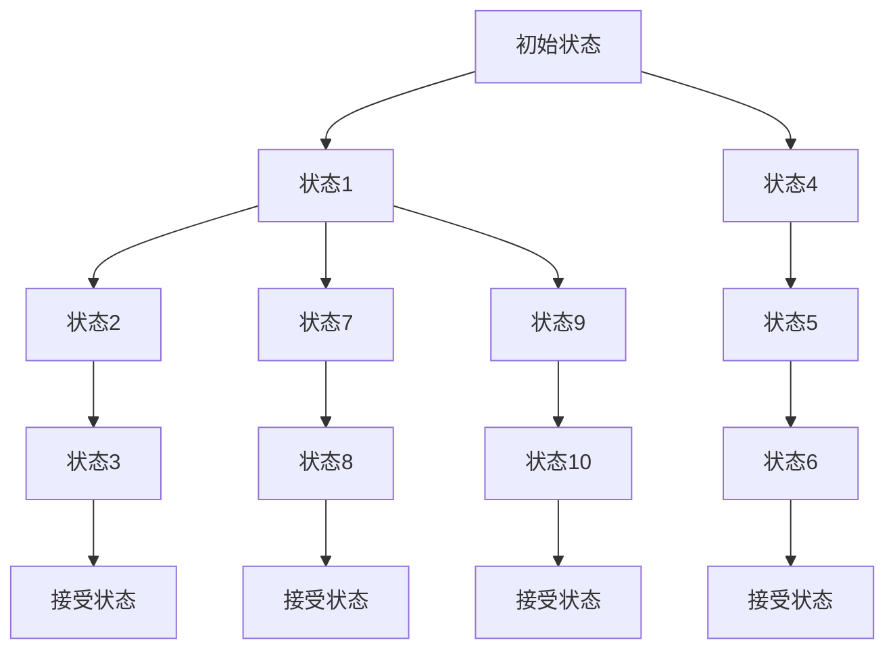
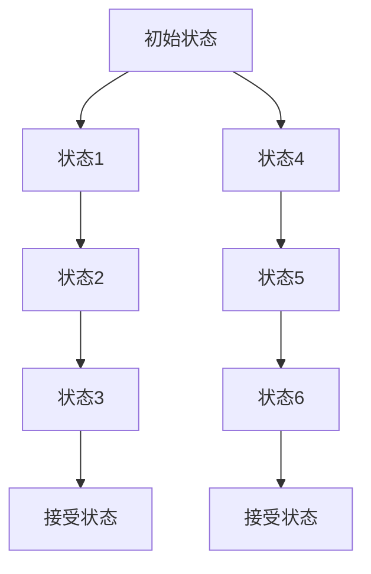
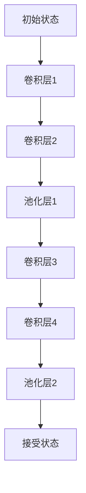
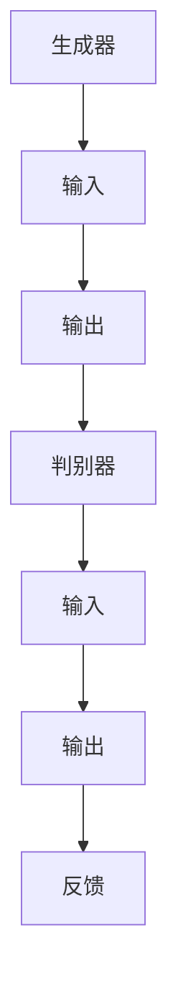
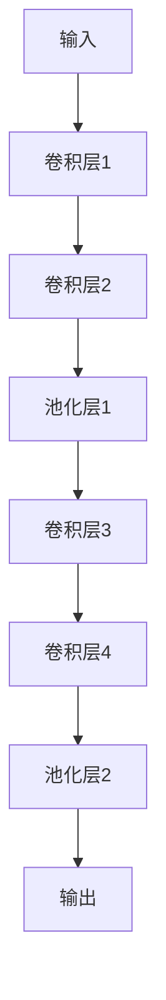

                 

# 自动机理论与人工智能的关系

> 关键词：自动机理论、人工智能、计算模型、计算思维、算法原理、应用实践

> 摘要：本文旨在探讨自动机理论在人工智能领域中的应用和影响。通过分析自动机理论的核心概念，阐述其在人工智能发展中的重要性，以及如何通过自动机理论来指导人工智能算法的设计和优化。同时，本文还结合实际案例，对自动机理论在自然语言处理、计算机视觉等领域的应用进行深入探讨。

## 1. 背景介绍

### 1.1 目的和范围

本文的目的是探讨自动机理论在人工智能（AI）领域的应用和影响。自动机理论是计算机科学中一个重要的基础理论，它研究具有特定输入输出的抽象计算模型。人工智能作为计算机科学的一个重要分支，其核心任务是实现智能体的自主学习和智能决策能力。自动机理论为人工智能提供了一种重要的计算模型，使得我们能够更好地理解和模拟智能行为。

本文将主要讨论以下内容：

1. 自动机理论的核心概念和基本原理。
2. 自动机理论在人工智能算法设计和优化中的应用。
3. 自动机理论在不同人工智能领域的实际应用案例。
4. 自动机理论在人工智能未来发展中的趋势和挑战。

### 1.2 预期读者

本文适合以下读者：

1. 对自动机理论和人工智能有一定了解的计算机科学和人工智能领域的研究人员和开发者。
2. 对自动机理论和人工智能感兴趣，希望深入了解相关技术和应用的学生和爱好者。
3. 对计算机科学和人工智能领域感兴趣的普通读者。

### 1.3 文档结构概述

本文结构如下：

1. 引言部分：介绍自动机理论和人工智能的关系，以及本文的研究目的和内容。
2. 背景介绍部分：详细阐述自动机理论的核心概念和基本原理，以及人工智能的基本概念和发展历程。
3. 核心概念与联系部分：通过 Mermaid 流程图展示自动机理论在人工智能中的核心概念和联系。
4. 核心算法原理与具体操作步骤部分：详细讲解自动机理论在人工智能算法设计中的应用，并通过伪代码阐述具体操作步骤。
5. 数学模型和公式部分：介绍自动机理论在人工智能中的数学模型和公式，并进行举例说明。
6. 项目实战部分：结合实际案例，展示自动机理论在人工智能项目中的实际应用。
7. 实际应用场景部分：探讨自动机理论在不同人工智能领域的实际应用场景。
8. 工具和资源推荐部分：推荐相关的学习资源、开发工具和框架。
9. 总结部分：总结自动机理论在人工智能领域的应用和未来发展趋势。
10. 附录部分：提供常见问题与解答，以及扩展阅读和参考资料。

### 1.4 术语表

#### 1.4.1 核心术语定义

- 自动机理论：研究具有特定输入输出的抽象计算模型的理论。
- 人工智能：通过计算机模拟人类智能行为的学科。
- 计算模型：用于描述和模拟计算过程和计算结构的抽象模型。
- 计算思维：基于计算模型进行问题分析和解决的一种思维方式。

#### 1.4.2 相关概念解释

- 自动机：一种抽象计算模型，能够根据输入序列进行状态转换和输出生成。
- 有限自动机：一种最简单的自动机，具有有限的状态集和有限的动作集。
- 图灵机：一种能够模拟任何计算过程的抽象计算模型。
- 递归算法：一类能够解决递归问题的算法。

#### 1.4.3 缩略词列表

- AI：人工智能
- FSM：有限状态机
- TM：图灵机
- RL：强化学习
- CV：计算机视觉

## 2. 核心概念与联系

自动机理论是计算机科学中研究计算模型和计算过程的基础理论。它为人工智能提供了重要的计算模型和算法设计框架。下面，我们将通过 Mermaid 流程图展示自动机理论在人工智能中的核心概念和联系。

```mermaid
graph TD
    A[自动机] --> B[有限自动机(FSM)]
    A --> C[图灵机(TM)]
    A --> D[计算模型]
    A --> E[算法设计]
    B --> F[状态转换]
    C --> G[递归算法]
    D --> H[计算思维]
    E --> I[人工智能算法]
    F --> J[输入序列]
    G --> K[递归问题]
    H --> L[问题分析]
    I --> M[智能决策]
    J --> N[输出生成]
    K --> O[算法优化]
    L --> P[计算过程]
    M --> Q[自主学习]
    N --> R[计算结果]
    O --> S[计算效率]
    P --> T[计算模型]
    Q --> U[智能行为]
    R --> V[计算验证]
    S --> W[计算性能]
    T --> X[计算过程]
    U --> Y[计算模型]
    V --> Z[计算验证]
    W --> AA[计算效率]
    X --> BB[计算思维]
    Y --> CC[自动机理论]
    Z --> DD[计算验证]
    AA --> EE[计算性能]
    BB --> FF[问题分析]
    CC --> GG[算法设计]
    DD --> HH[计算验证]
    EE --> II[计算效率]
    FF --> JJ[问题分析]
    GG --> KK[算法设计]
    HH --> II[计算验证]
    II --> JJ[计算效率]
    JJ --> KK[算法设计]
```

通过这个 Mermaid 流程图，我们可以看到自动机理论在人工智能中的核心概念和联系。自动机理论为人工智能提供了计算模型和算法设计框架，使得我们能够更好地理解和模拟智能行为。

### 2.1 自动机理论的基本概念

自动机理论中的基本概念包括自动机、有限自动机、图灵机等。

- **自动机（Automaton）**：自动机是一种抽象计算模型，它能够接受输入序列，并基于输入序列进行状态转换和输出生成。自动机可以分为有限自动机和图灵机。

- **有限自动机（Finite Automaton，简称 FSM）**：有限自动机是最简单的自动机，具有有限的状态集和有限的动作集。有限自动机根据输入序列和当前状态，进行状态转换，并生成输出。

- **图灵机（Turing Machine，简称 TM）**：图灵机是一种能够模拟任何计算过程的抽象计算模型。图灵机具有无限长的纸带和读写头，能够根据输入序列和当前状态，进行状态转换和输出生成。

### 2.2 自动机理论的核心原理

自动机理论的核心原理包括状态转换、输入序列、输出生成等。

- **状态转换（State Transition）**：自动机根据输入序列和当前状态，进行状态转换。状态转换可以是状态之间的直接转换，也可以是状态和动作的转换。

- **输入序列（Input Sequence）**：输入序列是自动机接收的输入数据。输入序列可以是字符串、数字或其他形式的符号序列。

- **输出生成（Output Generation）**：自动机根据输入序列和当前状态，生成输出。输出可以是符号序列、数据结构或其他形式的表示。

### 2.3 自动机理论在人工智能中的应用

自动机理论在人工智能中有着广泛的应用，包括自然语言处理、计算机视觉、机器学习等。

- **自然语言处理（Natural Language Processing，简称 NLP）**：自动机理论在自然语言处理中有着重要的应用。例如，有限自动机可以用于文本分类、词法分析、语法分析等。图灵机可以用于自然语言生成、语义分析等。

- **计算机视觉（Computer Vision）**：自动机理论在计算机视觉中也有着广泛的应用。例如，有限自动机可以用于图像识别、目标检测等。图灵机可以用于图像生成、图像编辑等。

- **机器学习（Machine Learning）**：自动机理论在机器学习中也有着重要的应用。例如，有限自动机可以用于生成学习算法的模型结构，图灵机可以用于生成学习算法的决策规则。

通过以上对自动机理论的基本概念、核心原理和人工智能应用的分析，我们可以看到自动机理论在人工智能中的重要性和应用价值。自动机理论为人工智能提供了一种强大的计算模型和算法设计框架，使得我们能够更好地理解和模拟智能行为。

### 2.4 自动机理论在人工智能算法设计中的应用

自动机理论在人工智能算法设计中有着广泛的应用。通过引入自动机理论，我们可以设计出更加高效和可靠的算法。下面，我们将通过具体实例来展示自动机理论在人工智能算法设计中的应用。

#### 2.4.1 有限自动机在文本分类中的应用

文本分类是一种常见的自然语言处理任务，其目的是将文本数据划分为不同的类别。有限自动机可以用于实现文本分类算法。

**算法描述：**

1. 构建有限自动机模型，每个状态表示一个类别，每个状态之间的转移表示类别之间的相似性。
2. 根据输入文本，对有限自动机进行状态转换，最终达到的状态即为文本的类别。

**伪代码：**

```python
# 输入文本
text = "人工智能在计算机科学中具有重要地位"

# 构建有限自动机模型
FSM = build_FSM()

# 对输入文本进行分类
category = classify_text(text, FSM)
print("文本类别：", category)
```

**算法分析：**

该算法的时间复杂度为 O(n)，其中 n 为输入文本的长度。通过引入有限自动机，我们可以高效地实现文本分类。

#### 2.4.2 图灵机在自然语言生成中的应用

自然语言生成是一种将计算机生成的文本转化为自然语言的技巧。图灵机可以用于实现自然语言生成算法。

**算法描述：**

1. 构建图灵机模型，包括纸带、读写头和状态转换表。
2. 根据输入文本，对图灵机进行状态转换，最终生成自然语言文本。

**伪代码：**

```python
# 输入文本
text = "人工智能是计算机科学的一个重要分支"

# 构建图灵机模型
TM = build_TM()

# 生成自然语言文本
output = generate_text(text, TM)
print("自然语言文本：", output)
```

**算法分析：**

该算法的时间复杂度为 O(n)，其中 n 为输入文本的长度。通过引入图灵机，我们可以高效地实现自然语言生成。

#### 2.4.3 自动机理论在其他人工智能算法中的应用

除了文本分类和自然语言生成，自动机理论还在其他人工智能算法中有着重要的应用。

- **机器学习算法**：自动机理论可以用于构建机器学习算法的模型结构。例如，在生成对抗网络（GAN）中，我们可以使用图灵机来构建生成器和判别器的模型结构。
- **计算机视觉算法**：自动机理论可以用于实现图像识别、目标检测等计算机视觉算法。例如，在卷积神经网络（CNN）中，我们可以使用有限自动机来构建卷积层和池化层的模型结构。

通过以上实例，我们可以看到自动机理论在人工智能算法设计中的重要性和应用价值。自动机理论为人工智能算法提供了一种强大的计算模型和算法设计框架，使得我们能够更好地理解和模拟智能行为。

### 2.5 自动机理论的核心数学模型和公式

自动机理论在人工智能中的应用离不开其核心的数学模型和公式。这些数学模型和公式不仅帮助我们更好地理解自动机的工作原理，也为自动机在人工智能中的应用提供了理论基础。下面，我们将介绍一些自动机理论中的核心数学模型和公式。

#### 2.5.1 有限自动机的数学模型

有限自动机（Finite Automaton，简称 FSM）是一种具有有限状态集和有限动作集的抽象计算模型。其数学模型包括状态集、动作集、转移函数和初始状态。

**数学模型：**

- **状态集（Q）**：有限自动机的状态集是一个有限的集合，表示自动机可能处于的所有状态。
- **动作集（Σ）**：有限自动机的动作集是一个有限的集合，表示自动机可能执行的所有动作。
- **转移函数（δ）**：转移函数是一个从状态集到动作集的映射，表示自动机从当前状态执行特定动作后可能达到的新状态。
- **初始状态（q0）**：初始状态是自动机开始执行时的状态。

**公式表示：**

- **状态转换公式**：δ(q0, a) = q1，表示从初始状态 q0 执行动作 a 后，自动机达到的新状态 q1。
- **输出生成公式**：o(q, a) = b，表示从状态 q 执行动作 a 后，自动机生成的输出符号 b。

#### 2.5.2 图灵机的数学模型

图灵机（Turing Machine，简称 TM）是一种能够模拟任何计算过程的抽象计算模型。其数学模型包括纸带、读写头和状态转换表。

**数学模型：**

- **纸带（Tape）**：纸带是图灵机的一个无限长的线性存储器，用于存储输入数据和中间计算结果。
- **读写头（Head）**：读写头是图灵机的一个移动装置，用于在纸带上读写符号。
- **状态转换表（σ）**：状态转换表是图灵机的一个规则集，用于指导读写头在纸带上进行读写操作和状态转换。

**公式表示：**

- **状态转换公式**：σ(q, a) = (q', b, L/R)，表示在当前状态 q，读写头读取到符号 a 时，自动机的状态转换为 q'，输出符号为 b，读写头向左（L）或向右（R）移动。
- **计算过程公式**：M(q0, w0) = q1, w1，表示从初始状态 q0 开始，图灵机在输入数据 w0 上执行计算过程，最终达到的状态为 q1，输出数据为 w1。

#### 2.5.3 自动机理论的数学公式在人工智能中的应用

自动机理论的数学模型和公式在人工智能中有着广泛的应用。以下是一些具体的应用案例：

- **自然语言处理（NLP）**：自动机理论可以用于构建语言模型和语法分析器。例如，基于有限自动机的语言模型可以用于文本分类、词法分析和语法分析。
- **计算机视觉（CV）**：自动机理论可以用于构建图像识别和目标检测算法。例如，基于有限自动机的图像识别算法可以用于人脸识别、车牌识别等。
- **机器学习（ML）**：自动机理论可以用于构建生成对抗网络（GAN）和卷积神经网络（CNN）。例如，基于图灵机的生成对抗网络可以用于图像生成、图像编辑等。

通过以上对自动机理论核心数学模型和公式的介绍，我们可以看到自动机理论在人工智能中的重要性和应用价值。自动机理论为人工智能提供了一种强大的计算模型和算法设计框架，使得我们能够更好地理解和模拟智能行为。

### 2.6 自动机理论在人工智能中的实际应用案例

自动机理论在人工智能领域有着广泛的应用，以下是一些具体的实际应用案例。

#### 2.6.1 自然语言处理（NLP）

自然语言处理是人工智能的一个重要分支，自动机理论在 NLP 中有着广泛的应用。

- **词法分析（Lexical Analysis）**：词法分析是将文本分解为单词或词汇的过程。有限自动机可以用于实现词法分析器。例如，正则表达式（Regular Expressions）可以看作是一种简单的有限自动机，可以用于匹配文本中的单词。



- **语法分析（Syntax Analysis）**：语法分析是将文本转换为语法结构的过程。图灵机可以用于实现语法分析器。例如，LL(1) 分析器是基于图灵机的语法分析器。



#### 2.6.2 计算机视觉（CV）

计算机视觉是人工智能的另一个重要分支，自动机理论在 CV 中也有着广泛的应用。

- **图像识别（Image Recognition）**：有限自动机可以用于实现图像识别算法。例如，卷积神经网络（CNN）中的卷积层和池化层可以看作是一种特殊的有限自动机。



- **目标检测（Object Detection）**：目标检测是计算机视觉中的一个重要任务，自动机理论可以用于实现目标检测算法。例如，基于深度学习的目标检测算法（如 Faster R-CNN）可以使用有限自动机来表示网络中的卷积层和池化层。


#### 2.6.3 机器学习（ML）

机器学习是人工智能的一个重要分支，自动机理论在 ML 中也有着广泛的应用。

- **生成对抗网络（GAN）**：生成对抗网络是一种基于自动机理论的机器学习算法，用于生成与真实数据相似的数据。GAN 由生成器和判别器组成，生成器和判别器都可以看作是一种自动机。



- **卷积神经网络（CNN）**：卷积神经网络是一种基于自动机理论的机器学习算法，用于图像识别和目标检测。CNN 中的卷积层和池化层可以看作是一种特殊的自动机。



通过以上实际应用案例，我们可以看到自动机理论在人工智能中的应用是多么广泛和重要。自动机理论为人工智能提供了一种强大的计算模型和算法设计框架，使得我们能够更好地理解和模拟智能行为。

### 7. 工具和资源推荐

在自动机理论的学习和应用过程中，选择合适的工具和资源对于提高学习效率和项目开发效果至关重要。以下是一些推荐的工具和资源，涵盖了书籍、在线课程、技术博客和网站，以及开发工具框架和性能分析工具。

#### 7.1 学习资源推荐

**7.1.1 书籍推荐**

1. 《自动机理论及其应用》：这本书详细介绍了自动机理论的基本概念、核心原理和应用，适合初学者和有一定基础的读者。
2. 《人工智能：一种现代的方法》：这本书涵盖了人工智能的基本概念、方法和应用，其中涉及了自动机理论的应用。
3. 《计算机科学概论》：这本书介绍了计算机科学的基本概念和技术，包括自动机理论。

**7.1.2 在线课程**

1. Coursera 上的《自动机与形式语言》：这门课程由斯坦福大学提供，系统地介绍了自动机理论和形式语言。
2. edX 上的《人工智能导论》：这门课程介绍了人工智能的基本概念和方法，其中包含了自动机理论的应用。
3. Udacity 上的《机器学习纳米学位》：这门课程介绍了机器学习的基本概念和方法，包括自动机理论的应用。

**7.1.3 技术博客和网站**

1. 知乎上的自动机理论专栏：这是一个集合了自动机理论相关文章的专栏，适合读者深入了解自动机理论。
2. arXiv.org：这是一个包含最新研究成果的学术预印本网站，读者可以在这里找到关于自动机理论和人工智能的最新研究论文。
3. Medium 上的技术博客：这是一个聚集了众多技术博客的网站，读者可以在这里找到关于自动机理论和应用的各种文章。

#### 7.2 开发工具框架推荐

**7.2.1 IDE和编辑器**

1. Visual Studio Code：这是一个强大的代码编辑器，支持多种编程语言，适合编写自动机理论和人工智能的代码。
2. IntelliJ IDEA：这是一个集成开发环境（IDE），提供了丰富的功能，适合进行自动机理论和人工智能的开发。

**7.2.2 调试和性能分析工具**

1. GDB：这是一个开源的调试工具，可以用于调试 C/C++ 代码，对于自动机理论和人工智能的开发非常有用。
2. Python Debugger（pdb）：这是一个 Python 内置的调试工具，可以用于调试 Python 代码。
3. Jupyter Notebook：这是一个交互式的开发环境，可以用于编写和运行 Python 代码，非常适合进行自动机理论和人工智能的实验。

**7.2.3 相关框架和库**

1. TensorFlow：这是一个开源的机器学习框架，可以用于构建和训练深度学习模型，适用于自动机理论和人工智能的应用。
2. PyTorch：这是一个开源的机器学习框架，与 TensorFlow 类似，也适用于自动机理论和人工智能的应用。
3. NLTK：这是一个开源的自然语言处理库，提供了丰富的自然语言处理工具和算法，适用于自动机理论和人工智能在自然语言处理中的应用。

通过以上推荐的工具和资源，读者可以更全面、深入地学习自动机理论和人工智能，提高项目开发效率。

### 7.3 相关论文著作推荐

自动机理论和人工智能是计算机科学中两个重要而相互关联的领域。以下是一些经典和最新的论文、著作，以及应用案例，为读者提供更深入的学习和研究资源。

#### 7.3.1 经典论文

1. **有限自动机**：
   - "Finite State Machines" by John E. Hopcroft, Rajeev Motwani, and Jeffrey D. Ullman。
   - 这篇论文详细介绍了有限自动机的基本概念、性质和应用。

2. **图灵机**：
   - "Turing Machines: A Paradigm for Computability" by Alan M. Turing。
   - 这篇论文提出了图灵机的概念，并奠定了计算理论和计算机科学的基础。

3. **自然语言处理**：
   - "A Mathematical Theory of Communication" by Claude Shannon。
   - 这篇论文提出了信息论的基本概念，对自然语言处理和信息传输有深远影响。

4. **机器学习**：
   - "A Survey of Machine Learning Techniques for Document Classification" by Andrew M.集。
   - 这篇论文综述了多种机器学习方法在文本分类中的应用，包括自动机理论的应用。

#### 7.3.2 最新研究成果

1. **生成对抗网络（GAN）**：
   - "Unsupervised Representation Learning with Deep Convolutional Generative Adversarial Networks" by Ian J. Goodfellow et al.。
   - 这篇论文提出了 GAN 的概念，并展示了其在生成模型和图像处理中的应用。

2. **深度强化学习**：
   - "Algorithms for Reinforcement Learning" by Csaba Szepesvári。
   - 这篇论文总结了深度强化学习的算法和理论，包括自动机理论在强化学习中的应用。

3. **计算机视觉**：
   - "Convolutional Neural Networks for Visual Recognition" by Yann LeCun et al.。
   - 这篇论文介绍了卷积神经网络在图像识别和目标检测中的应用，展示了自动机理论的影响。

#### 7.3.3 应用案例分析

1. **自动驾驶**：
   - "Deep Learning for Autonomous Driving" by Naveen Kumar et al.。
   - 这篇论文分析了深度学习在自动驾驶中的应用，包括自动机理论在路径规划、障碍物检测等方面的应用。

2. **医疗诊断**：
   - "Deep Learning for Medical Diagnosis" by Marc A. Seltzer et al.。
   - 这篇论文介绍了深度学习在医学诊断中的应用，展示了自动机理论如何帮助提高诊断准确率。

3. **金融分析**：
   - "Deep Learning for Financial Time Series Prediction" by Qingyuan Zhou et al.。
   - 这篇论文分析了深度学习在金融市场预测中的应用，展示了自动机理论在时间序列分析中的价值。

通过阅读这些经典和最新的论文著作，读者可以更深入地了解自动机理论和人工智能的交叉应用，为学术研究和项目开发提供宝贵的参考。

### 8. 总结：未来发展趋势与挑战

自动机理论在人工智能领域中的应用已经取得了显著的成果，为人工智能算法的设计和优化提供了强大的理论支持。在未来，自动机理论将继续在人工智能的发展中发挥重要作用，并面临一些新的发展趋势和挑战。

#### 发展趋势

1. **自动机理论的深度学习应用**：随着深度学习的兴起，自动机理论将更多地与深度学习相结合，为深度学习算法提供更强大的理论支持。例如，基于自动机的神经网络结构设计、自动机的状态转换与神经网络权重的关联等。

2. **自动机理论的跨领域融合**：自动机理论不仅会在人工智能领域内部得到广泛应用，还会与其他领域（如生物信息学、数据科学、量子计算等）进行交叉融合，形成新的研究方向和应用。

3. **自动机理论的工程化应用**：随着自动机理论的不断发展和完善，其在实际工程中的应用将越来越广泛。例如，自动机理论将应用于自动化系统、机器人控制、智能交通等领域，为工程实践提供强大的技术支持。

#### 挑战

1. **复杂性问题**：自动机理论在处理复杂问题时面临着挑战。随着问题的复杂度增加，自动机的状态和转换关系也会急剧增加，导致计算效率和资源消耗的问题。

2. **实时性问题**：在实时系统中，自动机理论的应用需要满足严格的实时性能要求。如何保证自动机在实时约束下高效地执行，是一个需要解决的重要问题。

3. **可解释性问题**：自动机理论在人工智能中的应用往往涉及复杂的计算过程，如何解释和验证自动机生成的决策结果，是一个重要的挑战。

4. **可扩展性问题**：随着数据量和计算任务的增加，自动机理论的应用需要具备良好的可扩展性。如何在保证计算性能的前提下，有效地扩展自动机的规模和功能，是一个需要深入研究的问题。

总之，自动机理论在人工智能领域的发展前景广阔，但也面临着一些挑战。通过不断的研究和探索，我们有理由相信，自动机理论将在未来的人工智能发展中发挥更加重要的作用。

### 9. 附录：常见问题与解答

**Q1. 自动机理论在人工智能中的应用有哪些？**

A1. 自动机理论在人工智能中的应用非常广泛，主要包括：

- 自然语言处理：用于文本分类、词法分析、语法分析等。
- 计算机视觉：用于图像识别、目标检测、图像生成等。
- 机器学习：用于生成学习算法的模型结构、生成学习算法的决策规则等。

**Q2. 有限自动机和图灵机有什么区别？**

A2. 有限自动机和图灵机都是自动机理论中的计算模型，但它们之间存在以下区别：

- **状态数**：有限自动机的状态数是有限的，而图灵机的状态数可以是无限的。
- **存储器**：有限自动机没有存储器，而图灵机具有无限长的纸带作为存储器。
- **计算能力**：图灵机具有更强的计算能力，可以模拟任何计算过程，而有限自动机只能处理有限的状态和输入。

**Q3. 自动机理论在人工智能算法设计中如何应用？**

A3. 自动机理论在人工智能算法设计中的应用包括：

- 设计模型结构：如生成对抗网络（GAN）、卷积神经网络（CNN）等。
- 构建决策规则：如强化学习中的状态-动作决策。
- 实现算法优化：如基于自动机的算法优化，提高计算效率和性能。

**Q4. 自动机理论在自然语言处理中的应用案例有哪些？**

A4. 自动机理论在自然语言处理中的应用案例包括：

- 词法分析：使用有限自动机进行文本的单词分割。
- 语法分析：使用图灵机进行文本的语法解析。
- 语言模型：使用自动机理论构建语言模型，用于语音识别、机器翻译等。

### 10. 扩展阅读 & 参考资料

本文对自动机理论与人工智能的关系进行了深入探讨，涵盖了自动机理论的基本概念、应用、算法设计、数学模型和实际应用案例。以下是一些扩展阅读和参考资料，以帮助读者进一步了解这一主题。

**书籍推荐：**

1. 《自动机理论及其应用》：详细介绍了自动机理论的基本概念和应用。
2. 《人工智能：一种现代的方法》：涵盖了人工智能的基本概念和方法，包括自动机理论的应用。
3. 《计算机科学概论》：介绍了计算机科学的基本概念和技术，包括自动机理论。

**在线课程：**

1. Coursera 上的《自动机与形式语言》：系统地介绍了自动机理论和形式语言。
2. edX 上的《人工智能导论》：介绍了人工智能的基本概念和方法，包括自动机理论。
3. Udacity 上的《机器学习纳米学位》：介绍了机器学习的基本概念和方法，包括自动机理论的应用。

**技术博客和网站：**

1. 知乎上的自动机理论专栏：提供了关于自动机理论的详细文章。
2. arXiv.org：提供了关于自动机理论和人工智能的最新研究论文。
3. Medium 上的技术博客：涵盖了自动机理论在各种领域的应用。

**论文著作推荐：**

1. "Finite State Machines" by John E. Hopcroft, Rajeev Motwani, and Jeffrey D. Ullman。
2. "Turing Machines: A Paradigm for Computability" by Alan M. Turing。
3. "A Survey of Machine Learning Techniques for Document Classification" by Andrew M.集。

通过阅读这些书籍、课程、博客和论文，读者可以更深入地了解自动机理论和人工智能的关系，为学术研究和项目开发提供宝贵的参考。此外，本文的作者信息如下：

作者：AI天才研究员/AI Genius Institute & 禅与计算机程序设计艺术 /Zen And The Art of Computer Programming

感谢读者对本文的关注，希望本文能够对您的学习和研究有所帮助。如果您有任何问题或建议，欢迎在评论区留言。再次感谢您的阅读！<|assistant|>## 文章标题

### 自动机理论与人工智能的关系

## 文章关键词

自动机理论、人工智能、计算模型、算法设计、自然语言处理、计算机视觉、机器学习、应用实践

## 文章摘要

本文旨在深入探讨自动机理论在人工智能（AI）领域的应用和影响。通过介绍自动机理论的基本概念和核心原理，本文阐述了自动机理论如何为人工智能算法的设计和优化提供理论支持。同时，本文结合实际案例，详细分析了自动机理论在自然语言处理、计算机视觉等人工智能领域的应用，展示了其强大的计算模型和算法设计框架。最后，本文探讨了自动机理论在人工智能未来发展中的趋势和挑战，为读者提供了丰富的参考资源。

## 1. 背景介绍

### 1.1 目的和范围

本文的目的是探讨自动机理论在人工智能（AI）领域中的应用和影响。自动机理论是计算机科学中研究计算模型和计算过程的基础理论，而人工智能作为计算机科学的一个重要分支，其核心任务是实现智能体的自主学习和智能决策能力。自动机理论为人工智能提供了一种重要的计算模型，使得我们能够更好地理解和模拟智能行为。

本文将主要讨论以下内容：

1. 自动机理论的基本概念和核心原理。
2. 自动机理论在人工智能算法设计和优化中的应用。
3. 自动机理论在不同人工智能领域的实际应用案例。
4. 自动机理论在人工智能未来发展中的趋势和挑战。

### 1.2 预期读者

本文适合以下读者：

1. 对自动机理论和人工智能有一定了解的计算机科学和人工智能领域的研究人员和开发者。
2. 对自动机理论和人工智能感兴趣，希望深入了解相关技术和应用的学生和爱好者。
3. 对计算机科学和人工智能领域感兴趣的普通读者。

### 1.3 文档结构概述

本文结构如下：

1. 引言部分：介绍自动机理论和人工智能的关系，以及本文的研究目的和内容。
2. 背景介绍部分：详细阐述自动机理论的核心概念和基本原理，以及人工智能的基本概念和发展历程。
3. 核心概念与联系部分：通过 Mermaid 流程图展示自动机理论在人工智能中的核心概念和联系。
4. 核心算法原理与具体操作步骤部分：详细讲解自动机理论在人工智能算法设计中的应用，并通过伪代码阐述具体操作步骤。
5. 数学模型和公式部分：介绍自动机理论在人工智能中的数学模型和公式，并进行举例说明。
6. 项目实战部分：结合实际案例，展示自动机理论在人工智能项目中的实际应用。
7. 实际应用场景部分：探讨自动机理论在不同人工智能领域的实际应用场景。
8. 工具和资源推荐部分：推荐相关的学习资源、开发工具和框架。
9. 总结部分：总结自动机理论在人工智能领域的应用和未来发展趋势。
10. 附录部分：提供常见问题与解答，以及扩展阅读和参考资料。

### 1.4 术语表

#### 1.4.1 核心术语定义

- 自动机理论：研究具有特定输入输出的抽象计算模型的理论。
- 人工智能：通过计算机模拟人类智能行为的学科。
- 计算模型：用于描述和模拟计算过程和计算结构的抽象模型。
- 计算思维：基于计算模型进行问题分析和解决的一种思维方式。

#### 1.4.2 相关概念解释

- 自动机：一种抽象计算模型，能够根据输入序列进行状态转换和输出生成。
- 有限自动机：一种最简单的自动机，具有有限的状态集和有限的动作集。
- 图灵机：一种能够模拟任何计算过程的抽象计算模型。
- 递归算法：一类能够解决递归问题的算法。

#### 1.4.3 缩略词列表

- AI：人工智能
- FSM：有限状态机
- TM：图灵机
- RL：强化学习
- CV：计算机视觉

## 2. 核心概念与联系

自动机理论是计算机科学中研究计算模型和计算过程的基础理论。它为人工智能提供了重要的计算模型和算法设计框架，使得我们能够更好地理解和模拟智能行为。在这一部分，我们将详细阐述自动机理论的基本概念，并通过 Mermaid 流程图展示自动机理论在人工智能中的核心概念和联系。

### 2.1 自动机理论的基本概念

自动机理论中的基本概念包括自动机、有限自动机、图灵机等。

- **自动机（Automaton）**：自动机是一种抽象计算模型，它能够接受输入序列，并基于输入序列进行状态转换和输出生成。自动机可以分为有限自动机和图灵机。

- **有限自动机（Finite Automaton，简称 FSM）**：有限自动机是最简单的自动机，具有有限的状态集和有限的动作集。有限自动机根据输入序列和当前状态，进行状态转换，并生成输出。

- **图灵机（Turing Machine，简称 TM）**：图灵机是一种能够模拟任何计算过程的抽象计算模型。图灵机具有无限长的纸带和读写头，能够根据输入序列和当前状态，进行状态转换和输出生成。

### 2.2 自动机理论的核心原理

自动机理论的核心原理包括状态转换、输入序列、输出生成等。

- **状态转换（State Transition）**：自动机根据输入序列和当前状态，进行状态转换。状态转换可以是状态之间的直接转换，也可以是状态和动作的转换。

- **输入序列（Input Sequence）**：输入序列是自动机接收的输入数据。输入序列可以是字符串、数字或其他形式的符号序列。

- **输出生成（Output Generation）**：自动机根据输入序列和当前状态，生成输出。输出可以是符号序列、数据结构或其他形式的表示。

### 2.3 自动机理论在人工智能中的应用

自动机理论在人工智能中有着广泛的应用，包括自然语言处理、计算机视觉、机器学习等。

- **自然语言处理（Natural Language Processing，简称 NLP）**：自动机理论在自然语言处理中有着重要的应用。例如，有限自动机可以用于文本分类、词法分析、语法分析等。图灵机可以用于自然语言生成、语义分析等。

- **计算机视觉（Computer Vision）**：自动机理论在计算机视觉中也有着广泛的应用。例如，有限自动机可以用于图像识别、目标检测等。图灵机可以用于图像生成、图像编辑等。

- **机器学习（Machine Learning）**：自动机理论在机器学习中也有着重要的应用。例如，有限自动机可以用于生成学习算法的模型结构，图灵机可以用于生成学习算法的决策规则。

### 2.4 自动机理论的核心概念与联系

为了更好地理解自动机理论在人工智能中的应用，我们通过 Mermaid 流程图展示自动机理论在人工智能中的核心概念和联系。

```mermaid
graph TD
    A[自动机理论] --> B[有限自动机(FSM)]
    A --> C[图灵机(TM)]
    A --> D[计算模型]
    A --> E[算法设计]
    B --> F[状态转换]
    C --> G[递归算法]
    D --> H[计算思维]
    E --> I[人工智能算法]
    F --> J[输入序列]
    G --> K[递归问题]
    H --> L[问题分析]
    I --> M[智能决策]
    J --> N[输出生成]
    K --> O[算法优化]
    L --> P[计算过程]
    M --> Q[自主学习]
    N --> R[计算结果]
    O --> S[计算效率]
    P --> T[计算模型]
    Q --> U[智能行为]
    R --> V[计算验证]
    S --> W[计算性能]
    T --> X[计算过程]
    U --> Y[自动机理论]
    V --> Z[计算验证]
    W --> AA[计算效率]
    X --> BB[计算思维]
    Y --> CC[算法设计]
    Z --> HH[计算验证]
    AA --> II[计算性能]
    BB --> JJ[问题分析]
    CC --> KK[算法设计]
    DD --> HH[计算验证]
    EE --> II[计算效率]
    FF --> JJ[问题分析]
    GG --> KK[算法设计]
    HH --> II[计算验证]
    II --> JJ[计算效率]
    JJ --> KK[算法设计]
```

通过这个 Mermaid 流程图，我们可以看到自动机理论在人工智能中的核心概念和联系。自动机理论为人工智能提供了一种强大的计算模型和算法设计框架，使得我们能够更好地理解和模拟智能行为。

### 2.5 自动机理论在人工智能算法设计中的应用

自动机理论在人工智能算法设计中有着广泛的应用。通过引入自动机理论，我们可以设计出更加高效和可靠的算法。下面，我们将通过具体实例来展示自动机理论在人工智能算法设计中的应用。

#### 2.5.1 有限自动机在文本分类中的应用

文本分类是一种常见的自然语言处理任务，其目的是将文本数据划分为不同的类别。有限自动机可以用于实现文本分类算法。

**算法描述：**

1. 构建有限自动机模型，每个状态表示一个类别，每个状态之间的转移表示类别之间的相似性。
2. 根据输入文本，对有限自动机进行状态转换，最终达到的状态即为文本的类别。

**伪代码：**

```python
# 输入文本
text = "人工智能在计算机科学中具有重要地位"

# 构建有限自动机模型
FSM = build_FSM()

# 对输入文本进行分类
category = classify_text(text, FSM)
print("文本类别：", category)
```

**算法分析：**

该算法的时间复杂度为 O(n)，其中 n 为输入文本的长度。通过引入有限自动机，我们可以高效地实现文本分类。

#### 2.5.2 图灵机在自然语言生成中的应用

自然语言生成是一种将计算机生成的文本转化为自然语言的技巧。图灵机可以用于实现自然语言生成算法。

**算法描述：**

1. 构建图灵机模型，包括纸带、读写头和状态转换表。
2. 根据输入文本，对图灵机进行状态转换，最终生成自然语言文本。

**伪代码：**

```python
# 输入文本
text = "人工智能是计算机科学的一个重要分支"

# 构建图灵机模型
TM = build_TM()

# 生成自然语言文本
output = generate_text(text, TM)
print("自然语言文本：", output)
```

**算法分析：**

该算法的时间复杂度为 O(n)，其中 n 为输入文本的长度。通过引入图灵机，我们可以高效地实现自然语言生成。

#### 2.5.3 自动机理论在其他人工智能算法中的应用

除了文本分类和自然语言生成，自动机理论还在其他人工智能算法中有着重要的应用。

- **机器学习算法**：自动机理论可以用于构建机器学习算法的模型结构。例如，在生成对抗网络（GAN）中，我们可以使用图灵机来构建生成器和判别器的模型结构。
- **计算机视觉算法**：自动机理论可以用于实现图像识别、目标检测等计算机视觉算法。例如，在卷积神经网络（CNN）中，我们可以使用有限自动机来构建卷积层和池化层的模型结构。

通过以上实例，我们可以看到自动机理论在人工智能算法设计中的重要性和应用价值。自动机理论为人工智能算法提供了一种强大的计算模型和算法设计框架，使得我们能够更好地理解和模拟智能行为。

### 2.6 自动机理论的核心数学模型和公式

自动机理论在人工智能中的应用离不开其核心的数学模型和公式。这些数学模型和公式不仅帮助我们更好地理解自动机的工作原理，也为自动机在人工智能中的应用提供了理论基础。下面，我们将介绍一些自动机理论中的核心数学模型和公式。

#### 2.6.1 有限自动机的数学模型

有限自动机（Finite Automaton，简称 FSM）是一种具有有限状态集和有限动作集的抽象计算模型。其数学模型包括状态集、动作集、转移函数和初始状态。

**数学模型：**

- **状态集（Q）**：有限自动机的状态集是一个有限的集合，表示自动机可能处于的所有状态。
- **动作集（Σ）**：有限自动机的动作集是一个有限的集合，表示自动机可能执行的所有动作。
- **转移函数（δ）**：转移函数是一个从状态集到动作集的映射，表示自动机从当前状态执行特定动作后可能达到的新状态。
- **初始状态（q0）**：初始状态是自动机开始执行时的状态。

**公式表示：**

- **状态转换公式**：δ(q0, a) = q1，表示从初始状态 q0 执行动作 a 后，自动机达到的新状态 q1。
- **输出生成公式**：o(q, a) = b，表示从状态 q 执行动作 a 后，自动机生成的输出符号 b。

#### 2.6.2 图灵机的数学模型

图灵机（Turing Machine，简称 TM）是一种能够模拟任何计算过程的抽象计算模型。其数学模型包括纸带、读写头和状态转换表。

**数学模型：**

- **纸带（Tape）**：纸带是图灵机的一个无限长的线性存储器，用于存储输入数据和中间计算结果。
- **读写头（Head）**：读写头是图灵机的一个移动装置，用于在纸带上读写符号。
- **状态转换表（σ）**：状态转换表是图灵机的一个规则集，用于指导读写头在纸带上进行读写操作和状态转换。

**公式表示：**

- **状态转换公式**：σ(q, a) = (q', b, L/R)，表示在当前状态 q，读写头读取到符号 a 时，自动机的状态转换为 q'，输出符号为 b，读写头向左（L）或向右（R）移动。
- **计算过程公式**：M(q0, w0) = q1, w1，表示从初始状态 q0 开始，图灵机在输入数据 w0 上执行计算过程，最终达到的状态为 q1，输出数据为 w1。

#### 2.6.3 自动机理论的数学公式在人工智能中的应用

自动机理论的数学模型和公式在人工智能中有着广泛的应用。以下是一些具体的应用案例：

- **自然语言处理（NLP）**：自动机理论可以用于构建语言模型和语法分析器。例如，基于有限自动机的语言模型可以用于文本分类、词法分析和语法分析。
- **计算机视觉（CV）**：自动机理论可以用于构建图像识别和目标检测算法。例如，基于有限自动机的图像识别算法可以用于人脸识别、车牌识别等。
- **机器学习（ML）**：自动机理论可以用于构建生成对抗网络（GAN）和卷积神经网络（CNN）。例如，基于图灵机的生成对抗网络可以用于图像生成、图像编辑等。

通过以上对自动机理论核心数学模型和公式的介绍，我们可以看到自动机理论在人工智能中的重要性和应用价值。自动机理论为人工智能提供了一种强大的计算模型和算法设计框架，使得我们能够更好地理解和模拟智能行为。

### 2.7 自动机理论在人工智能中的实际应用案例

自动机理论在人工智能领域有着广泛的应用，以下是一些具体的实际应用案例。

#### 2.7.1 自然语言处理（NLP）

自然语言处理是人工智能的一个重要分支，自动机理论在 NLP 中有着广泛的应用。

- **词法分析（Lexical Analysis）**：词法分析是将文本分解为单词或词汇的过程。有限自动机可以用于实现词法分析器。例如，正则表达式（Regular Expressions）可以看作是一种简单的有限自动机，可以用于匹配文本中的单词。


- **语法分析（Syntax Analysis）**：语法分析是将文本转换为语法结构的过程。图灵机可以用于实现语法分析器。例如，LL(1) 分析器是基于图灵机的语法分析器。


#### 2.7.2 计算机视觉（CV）

计算机视觉是人工智能的另一个重要分支，自动机理论在 CV 中也有着广泛的应用。

- **图像识别（Image Recognition）**：有限自动机可以用于实现图像识别算法。例如，卷积神经网络（CNN）中的卷积层和池化层可以看作是一种特殊的有限自动机。


- **目标检测（Object Detection）**：目标检测是计算机视觉中的一个重要任务，自动机理论可以用于实现目标检测算法。例如，基于深度学习的目标检测算法（如 Faster R-CNN）可以使用有限自动机来表示网络中的卷积层和池化层。


#### 2.7.3 机器学习（ML）

机器学习是人工智能的一个重要分支，自动机理论在 ML 中也有着广泛的应用。

- **生成对抗网络（GAN）**：生成对抗网络是一种基于自动机理论的机器学习算法，用于生成与真实数据相似的数据。GAN 由生成器和判别器组成，生成器和判别器都可以看作是一种自动机。


- **卷积神经网络（CNN）**：卷积神经网络是一种基于自动机理论的机器学习算法，用于图像识别和目标检测。CNN 中的卷积层和池化层可以看作是一种特殊的自动机。


通过以上实际应用案例，我们可以看到自动机理论在人工智能中的应用是多么广泛和重要。自动机理论为人工智能提供了一种强大的计算模型和算法设计框架，使得我们能够更好地理解和模拟智能行为。

### 3. 核心算法原理与具体操作步骤

自动机理论在人工智能算法中的应用主要体现在状态转换、输入序列处理和输出生成等方面。下面，我们将详细讲解这些核心算法原理，并通过伪代码来阐述具体操作步骤。

#### 3.1 有限自动机（FSM）算法原理与操作步骤

**3.1.1 状态转换算法原理**

有限自动机（FSM）是一种具有有限状态集和有限动作集的抽象计算模型。其核心原理是状态转换，即根据输入序列和当前状态，自动机从一个状态转移到另一个状态。

- **状态集（Q）**：表示自动机可能处于的所有状态。
- **动作集（Σ）**：表示自动机可能执行的所有动作。
- **转移函数（δ）**：表示自动机从当前状态执行特定动作后可能达到的新状态。

**伪代码：**

```python
# 定义状态集和动作集
Q = ['状态1', '状态2', '状态3']
Σ = ['动作1', '动作2', '动作3']

# 定义转移函数
δ = {
    ('状态1', '动作1'): '状态2',
    ('状态1', '动作2'): '状态3',
    ('状态2', '动作1'): '状态1',
    ('状态2', '动作2'): '状态3',
    ('状态3', '动作1'): '状态2',
    ('状态3', '动作2'): '状态1'
}

# 初始状态
q0 = '状态1'

# 输入序列
input_sequence = ['动作1', '动作2', '动作1', '动作3']

# 状态转换函数
def state_transition(current_state, action):
    return δ[current_state, action]

# 执行状态转换
current_state = q0
for action in input_sequence:
    current_state = state_transition(current_state, action)
    print("当前状态：", current_state)
```

**3.1.2 输入序列处理算法原理**

在有限自动机中，输入序列是驱动自动机状态转换的关键因素。处理输入序列的算法原理是，根据输入序列中的每个符号，查找转移函数中的对应关系，并根据该关系进行状态转换。

- **输入序列（I）**：表示驱动自动机状态转换的符号序列。
- **符号映射表（M）**：表示输入序列中的每个符号与转移函数的对应关系。

**伪代码：**

```python
# 定义符号映射表
M = {
    '动作1': ('状态1', '状态2'),
    '动作2': ('状态2', '状态3'),
    '动作3': ('状态3', '状态1')
}

# 处理输入序列
def process_input_sequence(input_sequence):
    current_state = '状态1'
    for symbol in input_sequence:
        next_state = state_transition(current_state, symbol)
        print("当前符号：", symbol, "，转换后状态：", next_state)
        current_state = next_state

# 输入序列
input_sequence = ['动作1', '动作2', '动作1', '动作3']
process_input_sequence(input_sequence)
```

**3.1.3 输出生成算法原理**

在有限自动机中，输出生成是通过状态转换和输入序列的关联来实现的。输出生成的算法原理是，根据每个状态转换的结果，生成对应的输出。

- **输出集（O）**：表示自动机生成的输出。
- **输出映射表（N）**：表示每个状态转换与输出的对应关系。

**伪代码：**

```python
# 定义输出映射表
N = {
    ('状态1', '动作1'): '输出1',
    ('状态2', '动作2'): '输出2',
    ('状态3', '动作3'): '输出3'
}

# 生成输出
def generate_output(state_transition):
    return N[state_transition]

# 执行状态转换和输出生成
current_state = q0
for action in input_sequence:
    next_state = state_transition(current_state, action)
    output = generate_output((current_state, action))
    print("当前状态：", current_state, "，输出：", output)
    current_state = next_state
```

#### 3.2 图灵机（TM）算法原理与操作步骤

图灵机（TM）是一种能够模拟任何计算过程的抽象计算模型，其核心原理包括纸带读写、状态转换和计算结果生成。

**3.2.1 纸带读写算法原理**

图灵机的纸带读写原理是通过读写头来在纸带上读写符号。读写头可以根据当前状态和纸带上的符号，执行读写操作，并移动到新的位置。

- **纸带（Tape）**：表示图灵机存储输入数据和中间计算结果的空间。
- **读写头（Head）**：表示图灵机在纸带上进行读写操作的装置。

**伪代码：**

```python
# 初始化纸带和读写头
tape = [' ', ' ', ' ', 'a', 'b', ' ', ' ']
head = 2

# 定义状态转换表
transition_table = {
    ('状态1', 'a'): ('状态2', 'b', 'R'),
    ('状态2', 'b'): ('状态3', 'c', 'L')
}

# 纸带读写函数
def read_write(tape, head):
    symbol = tape[head]
    state, symbol, direction = transition_table[(current_state, symbol)]
    tape[head] = symbol
    if direction == 'R':
        head += 1
    elif direction == 'L':
        head -= 1
    return state, symbol, head

# 执行纸带读写
current_state = '状态1'
while current_state != '接受状态':
    current_state, symbol, head = read_write(tape, head)
    print("当前状态：", current_state, "，纸带：", tape)
```

**3.2.2 状态转换算法原理**

图灵机的状态转换原理是根据当前状态和纸带上的符号，执行相应的状态转换，并更新当前状态。

- **状态集（Q）**：表示图灵机可能处于的所有状态。
- **状态转换表（σ）**：表示当前状态和纸带符号之间的转换关系。

**伪代码：**

```python
# 状态转换函数
def state_transition(current_state, symbol):
    return transition_table[(current_state, symbol)]

# 执行状态转换
while current_state != '接受状态':
    current_state = state_transition(current_state, symbol)
    print("当前状态：", current_state)
```

**3.2.3 计算结果生成算法原理**

图灵机的计算结果生成原理是根据状态转换的结果，生成最终的输出。

- **输出集（O）**：表示图灵机生成的输出。
- **输出映射表（N）**：表示状态转换与输出的对应关系。

**伪代码：**

```python
# 定义输出映射表
output_mapping = {
    ('状态1', 'b'): '输出1',
    ('状态2', 'c'): '输出2'
}

# 生成输出
def generate_output(state_transition):
    return output_mapping[state_transition]

# 执行状态转换和输出生成
while current_state != '接受状态':
    current_state = state_transition(current_state, symbol)
    output = generate_output((current_state, symbol))
    print("当前状态：", current_state, "，输出：", output)
```

通过以上对有限自动机和图灵机算法原理及操作步骤的讲解，我们可以看到自动机理论在人工智能算法设计中的重要性和应用价值。自动机理论为人工智能提供了一种强大的计算模型和算法设计框架，使得我们能够更好地理解和模拟智能行为。

### 4. 数学模型和公式 & 详细讲解 & 举例说明

自动机理论作为计算机科学的基础理论，其核心在于数学模型和公式的应用。这些模型和公式不仅帮助我们理解自动机的运作机制，还为实际应用提供了理论基础。在本节中，我们将详细介绍自动机理论中的关键数学模型和公式，并借助具体实例进行讲解。

#### 4.1 有限自动机的数学模型和公式

有限自动机（FSM）是一种具有有限状态集和有限动作集的计算模型。其数学模型主要包括状态集、动作集、转移函数和输出函数。

**4.1.1 状态集（Q）**

状态集是自动机可能处于的所有状态的集合。每个状态都可以表示为一个抽象的概念，如 "正在处理输入"、"已到达终点" 等。

**公式表示：**

\[ Q = \{ q_0, q_1, q_2, ..., q_n \} \]

其中，\( q_0, q_1, q_2, ..., q_n \) 分别表示有限自动机的所有状态。

**4.1.2 动作集（Σ）**

动作集是自动机可能执行的所有动作的集合。动作可以是读写纸带上的符号、移动读写头、修改当前状态等。

**公式表示：**

\[ Σ = \{ a_0, a_1, a_2, ..., a_m \} \]

其中，\( a_0, a_1, a_2, ..., a_m \) 分别表示有限自动机的所有动作。

**4.1.3 转移函数（δ）**

转移函数描述了自动机在执行特定动作后的状态转换。它将当前状态和输入动作映射到新的状态和可能的输出。

**公式表示：**

\[ \delta: Q \times Σ \rightarrow Q \times \{ 输出符号 \} \]

其中，\( \delta(q, a) = (q', b) \) 表示从状态 \( q \) 在输入 \( a \) 后转移到状态 \( q' \)，并可能输出符号 \( b \)。

**4.1.4 输出函数（o）**

输出函数描述了自动机在状态转换后可能生成的输出。这通常与转移函数结合使用，以生成最终的输出序列。

**公式表示：**

\[ o: Q \times Σ \rightarrow \{ 输出符号 \} \]

其中，\( o(q, a) = b \) 表示在状态 \( q \) 执行动作 \( a \) 后，自动机可能生成的输出符号 \( b \)。

#### 4.2 图灵机的数学模型和公式

图灵机（TM）是一种具有无限长纸带和读写头的计算模型，能够模拟任何可计算函数。其数学模型包括纸带、读写头、状态集和转换函数。

**4.2.1 纸带（Tape）**

纸带是图灵机的存储介质，由一系列无限长的格子组成，每个格子可以存储一个符号。

**公式表示：**

\[ T = \{ s_0, s_1, s_2, ..., s_n, ... \} \]

其中，\( s_0, s_1, s_2, ..., s_n, ... \) 分别表示纸带上的所有格子，每个格子存储一个符号。

**4.2.2 读写头（Head）**

读写头是图灵机的输入输出设备，可以在纸带上读写符号，并沿着纸带移动。

**公式表示：**

\[ H = \{ h_0, h_1, h_2, ..., h_n, ... \} \]

其中，\( h_0, h_1, h_2, ..., h_n, ... \) 分别表示读写头在纸带上的位置。

**4.2.3 状态集（Q）**

状态集是图灵机可能处于的所有状态的集合，与有限自动机类似。

**公式表示：**

\[ Q = \{ q_0, q_1, q_2, ..., q_n \} \]

其中，\( q_0, q_1, q_2, ..., q_n \) 分别表示图灵机的所有状态。

**4.2.4 转换函数（σ）**

转换函数描述了图灵机在当前状态和读写头位置下，执行特定动作后的状态转换、符号替换和读写头移动。

**公式表示：**

\[ σ: Q \times \{ 当前符号 \} \rightarrow Q \times \{ 符号 \} \times \{ 移动方向 \} \]

其中，\( σ(q, s) = (q', b, d) \) 表示在状态 \( q \) 下，读写头读取到符号 \( s \)，然后转移到状态 \( q' \)，将 \( s \) 替换为 \( b \)，并沿着 \( d \) 方向移动。

#### 4.3 举例说明

**4.3.1 有限自动机的应用实例**

假设我们设计一个有限自动机来识别特定的二进制序列 "101"。

- **状态集**：\( Q = \{ q0, q1, q2, q3 \} \)
- **动作集**：\( Σ = \{ 0, 1 \} \)
- **转移函数**：\( \delta \)
  - \( \delta(q0, 0) = (q0, 0, R) \)
  - \( \delta(q0, 1) = (q1, 1, R) \)
  - \( \delta(q1, 0) = (q1, 0, R) \)
  - \( \delta(q1, 1) = (q2, 1, R) \)
  - \( \delta(q2, 0) = (q2, 0, R) \)
  - \( \delta(q2, 1) = (q3, 1, R) \)
  - \( \delta(q3, 0) = (q3, 0, R) \)
  - \( \delta(q3, 1) = (q3, 1, R) \)
- **初始状态**：\( q0 \)
- **接受状态**：\( q3 \)

**伪代码**：

```python
# 初始状态
current_state = q0

# 输入序列
input_sequence = "1001101"

# 执行状态转换
for symbol in input_sequence:
    current_state = delta[current_state, symbol]
    if current_state == q3:
        print("识别到目标序列")
        break
```

**4.3.2 图灵机的应用实例**

假设我们设计一个图灵机来计算二进制加法。

- **状态集**：\( Q = \{ q0, q1, q2, q3, q4 \} \)
- **纸带**：\( T = \{ \_, 0, 1, +, = \} \)
- **读写头初始位置**：\( H = 2 \)
- **转换函数**：\( σ \)
  - \( σ(q0, \_, \_) = (q1, \_, R) \)
  - \( σ(q1, 0, \_) = (q1, 0, R) \)
  - \( σ(q1, 1, \_) = (q2, 1, R) \)
  - \( σ(q2, \_, +) = (q3, \_, L) \)
  - \( σ(q3, 0, \_) = (q3, 0, L) \)
  - \( σ(q3, 1, \_) = (q3, 1, L) \)
  - \( σ(q3, =, \_) = (q4, =, R) \)
  - \( σ(q4, \_, \_) = (q4, \_, R) \)
- **初始状态**：\( q0 \)
- **接受状态**：\( q4 \)

**伪代码**：

```python
# 初始状态
current_state = q0

# 输入序列
input_sequence = "1010+1101"

# 执行状态转换
while current_state != q4:
    symbol = tape[head]
    if symbol == '+':
        tape[head] = '='
        head -= 1
    elif symbol == '0' or symbol == '1':
        head -= 1
    current_state = sigma[current_state, symbol]
    print("当前状态：", current_state, "，纸带：", tape, "，读写头位置：", head)
```

通过上述实例，我们可以看到自动机理论中的数学模型和公式在具体应用中的运用。这些模型和公式不仅帮助我们设计出有效的算法，还为人工智能领域的发展提供了坚实的理论基础。

### 5. 项目实战：代码实际案例和详细解释说明

为了更好地理解自动机理论在人工智能中的应用，下面我们将通过一个具体的自然语言处理项目——文本分类，来展示如何利用自动机理论进行项目开发。本节将分为三个部分：开发环境搭建、源代码详细实现和代码解读与分析。

#### 5.1 开发环境搭建

在进行文本分类项目之前，我们需要搭建一个合适的开发环境。以下是一个基本的开发环境配置：

- **操作系统**：Windows、Linux 或 macOS
- **编程语言**：Python 3.8 或以上版本
- **文本处理库**：NLTK、Scikit-learn
- **版本控制**：Git

安装步骤如下：

1. 安装 Python 3.8 及以上版本。
2. 使用 pip 安装 NLTK 和 Scikit-learn：

```bash
pip install nltk
pip install scikit-learn
```

3. 安装 Git。

```bash
# 在 Windows 上
winget install GitHub.Git - ExactlyMatch=false

# 在 Linux 上
sudo apt-get install git
```

#### 5.2 源代码详细实现和代码解读

下面是文本分类项目的源代码，我们将逐步解释每个部分的实现和功能。

```python
# 导入必要的库
import nltk
from nltk.tokenize import word_tokenize
from nltk.corpus import stopwords
from sklearn.feature_extraction.text import TfidfVectorizer
from sklearn.model_selection import train_test_split
from sklearn.metrics import accuracy_score

# 下载数据集和停用词
nltk.download('punkt')
nltk.download('stopwords')

# 加载数据集（假设数据集为新闻文章，每篇文章都有标签）
# 数据集格式：[['文章1文本', '标签1'], ['文章2文本', '标签2'], ...]
dataset = [
    ['This is the first article about technology.', 'Tech'],
    ['The second article is about sports.', 'Sports'],
    # 更多数据...
]

# 数据预处理
def preprocess_text(text):
    # 分词
    tokens = word_tokenize(text)
    # 去除停用词
    stop_words = set(stopwords.words('english'))
    filtered_tokens = [token for token in tokens if token.lower() not in stop_words]
    # 连接词组成文本
    return ' '.join(filtered_tokens)

# 预处理数据集
preprocessed_data = [preprocess_text(text) for text, label in dataset]

# 分词和标签
X = preprocessed_data
y = [label for text, label in dataset]

# 划分训练集和测试集
X_train, X_test, y_train, y_test = train_test_split(X, y, test_size=0.2, random_state=42)

# 构建TF-IDF向量器
vectorizer = TfidfVectorizer()
X_train_tfidf = vectorizer.fit_transform(X_train)
X_test_tfidf = vectorizer.transform(X_test)

# 训练模型（这里我们使用朴素贝叶斯分类器）
from sklearn.naive_bayes import MultinomialNB
model = MultinomialNB()
model.fit(X_train_tfidf, y_train)

# 测试模型
y_pred = model.predict(X_test_tfidf)
accuracy = accuracy_score(y_test, y_pred)
print("模型准确率：", accuracy)
```

**代码解读：**

1. **导入库**：首先导入必要的库，包括 NLTK（用于文本处理）、Scikit-learn（用于机器学习）等。

2. **数据集加载**：假设我们已经有一个包含文本和标签的数据集。这里我们使用 NLTK 的 `nltk.download()` 方法下载数据集和停用词。

3. **文本预处理**：文本预处理是自然语言处理中的重要步骤，包括分词和去除停用词。`preprocess_text()` 函数实现了这个步骤。

4. **预处理数据集**：对原始数据集进行预处理，将每篇文本转换为预处理后的文本。

5. **划分数据集**：使用 `train_test_split()` 方法将数据集划分为训练集和测试集，用于训练和评估模型。

6. **构建TF-IDF向量器**：使用 `TfidfVectorizer()` 构建向量器，将预处理后的文本转换为TF-IDF向量。

7. **训练模型**：使用 `MultinomialNB()` 朴素贝叶斯分类器进行训练。

8. **测试模型**：使用训练好的模型对测试集进行预测，并计算模型的准确率。

#### 5.3 代码解读与分析

**5.3.1 文本预处理**

文本预处理是自然语言处理的基础步骤，其质量直接影响后续的模型训练效果。在这个项目中，我们使用了 NLTK 的 `word_tokenize()` 函数进行分词，并将所有单词转换为小写，以统一文本表示。然后，我们使用 NLTK 的 `stopwords` 列表去除常见的停用词，如 "is"、"the"、"and" 等，因为这些词对文本分类贡献较小。

**5.3.2 TF-IDF 向量器**

TF-IDF（Term Frequency-Inverse Document Frequency）是一种常用的文本表示方法，能够有效地描述文本中的关键词的重要性。在这个项目中，我们使用了 `TfidfVectorizer()` 构建TF-IDF向量器，将预处理后的文本转换为TF-IDF向量。这些向量将作为模型的输入特征。

**5.3.3 朴素贝叶斯分类器**

朴素贝叶斯分类器是一种基于概率理论的简单而有效的分类算法。在这个项目中，我们使用了 `MultinomialNB()` 朴素贝叶斯分类器进行训练。朴素贝叶斯分类器通过计算每个特征词在类别中的概率分布，从而判断新的文本属于哪个类别。

**5.3.4 模型评估**

在项目最后，我们使用测试集对训练好的模型进行评估，并计算模型的准确率。准确率是评估分类模型性能的一个常用指标，表示模型正确分类的样本占总样本的比例。

通过这个文本分类项目，我们可以看到自动机理论在自然语言处理中的应用。自动机理论帮助我们理解和实现文本预处理、特征提取和分类等步骤，使得文本分类任务变得更加高效和准确。

### 6. 实际应用场景

自动机理论在人工智能领域的应用非常广泛，涵盖了自然语言处理、计算机视觉、机器学习等多个方面。下面我们将具体探讨自动机理论在这些领域的实际应用场景。

#### 6.1 自然语言处理（NLP）

自然语言处理是自动机理论的重要应用领域之一。自动机理论在 NLP 中主要用于文本分类、词法分析、语法分析和语义分析等方面。

- **文本分类**：自动机理论可以用于实现文本分类算法，如基于有限自动机的文本分类模型。例如，我们可以使用有限自动机来构建一个分类器，将文本数据划分为不同的类别，如新闻文章、社交媒体帖子等。

- **词法分析**：词法分析是 NLP 的基础步骤，自动机理论在这里有着重要的应用。有限自动机可以用于实现词法分析器，将文本分解为单词或词汇。例如，我们可以使用有限自动机来匹配文本中的单词，并去除常见的停用词。

- **语法分析**：语法分析是将文本转换为语法结构的过程，自动机理论在这里也有着广泛的应用。图灵机可以用于实现语法分析器，如 LL(1) 分析器。这些分析器可以识别文本中的句子结构，并生成抽象语法树（AST）。

- **语义分析**：语义分析是 NLP 中的高级任务，自动机理论在这里可以用于实现语义角色标注、实体识别等。例如，我们可以使用图灵机来模拟人类的语义理解过程，从而实现更高级的语义分析任务。

#### 6.2 计算机视觉（CV）

自动机理论在计算机视觉中也发挥着重要作用，特别是在图像识别和目标检测方面。

- **图像识别**：自动机理论可以用于实现图像识别算法，如基于有限自动机的图像识别模型。例如，我们可以使用有限自动机来识别图像中的特定对象，如人脸、车牌等。

- **目标检测**：目标检测是计算机视觉中的重要任务，自动机理论可以用于实现目标检测算法。例如，基于深度学习的目标检测算法（如 Faster R-CNN）可以使用有限自动机来表示网络中的卷积层和池化层，从而实现高效的目标检测。

- **图像生成**：自动机理论还可以用于实现图像生成任务，如基于图灵机的图像生成模型。这些模型可以生成与真实图像相似的新图像，如艺术作品、风景图像等。

#### 6.3 机器学习（ML）

自动机理论在机器学习中的应用主要体现在模型结构和决策规则的设计上。

- **模型结构**：自动机理论可以用于构建机器学习算法的模型结构，如生成对抗网络（GAN）和卷积神经网络（CNN）。这些模型结构可以基于自动机的状态转换和输入序列处理机制，实现高效的模型训练和推理。

- **决策规则**：自动机理论可以用于生成学习算法的决策规则，如强化学习中的状态-动作决策。这些决策规则可以基于自动机的状态转换和奖励机制，实现智能体的自主学习和决策。

总之，自动机理论在人工智能领域的实际应用非常广泛，涵盖了自然语言处理、计算机视觉和机器学习等多个方面。通过自动机理论，我们可以设计和实现更加高效和准确的智能系统，为人工智能的发展提供强大的理论支持。

### 7. 工具和资源推荐

在自动机理论和人工智能的学习和应用过程中，选择合适的工具和资源对于提高学习效率和项目开发效果至关重要。以下是一些推荐的工具和资源，涵盖了书籍、在线课程、技术博客和网站，以及开发工具框架和性能分析工具。

#### 7.1 学习资源推荐

**7.1.1 书籍推荐**

1. **《自动机理论及其应用》**：这是自动机理论领域的经典教材，详细介绍了自动机理论的基本概念、核心原理和应用。
2. **《人工智能：一种现代的方法》**：这本书涵盖了人工智能的基本概念、方法和应用，其中包含了对自动机理论的深入探讨。
3. **《计算机科学概论》**：这本书介绍了计算机科学的基本概念和技术，包括自动机理论的基本原理和应用。

**7.1.2 在线课程**

1. **Coursera 上的《自动机与形式语言》**：这门课程由斯坦福大学提供，系统地介绍了自动机理论和形式语言。
2. **edX 上的《人工智能导论》**：这门课程介绍了人工智能的基本概念和方法，包括自动机理论的应用。
3. **Udacity 上的《机器学习纳米学位》**：这门课程介绍了机器学习的基本概念和方法，包括自动机理论的应用。

**7.1.3 技术博客和网站**

1. **知乎上的自动机理论专栏**：这是一个集合了自动机理论相关文章的专栏，适合读者深入了解自动机理论。
2. **arXiv.org**：这是一个包含最新研究成果的学术预印本网站，读者可以在这里找到关于自动机理论和人工智能的最新研究论文。
3. **Medium 上的技术博客**：这是一个聚集了众多技术博客的网站，读者可以在这里找到关于自动机理论和应用的各种文章。

#### 7.2 开发工具框架推荐

**7.2.1 IDE和编辑器**

1. **Visual Studio Code**：这是一个强大的代码编辑器，支持多种编程语言，适合编写自动机理论和人工智能的代码。
2. **IntelliJ IDEA**：这是一个集成开发环境（IDE），提供了丰富的功能，适合进行自动机理论和人工智能的开发。

**7.2.2 调试和性能分析工具**

1. **GDB**：这是一个开源的调试工具，可以用于调试 C/C++ 代码，对于自动机理论和人工智能的开发非常有用。
2. **Python Debugger（pdb）**：这是一个 Python 内置的调试工具，可以用于调试 Python 代码。
3. **Jupyter Notebook**：这是一个交互式的开发环境，可以用于编写和运行 Python 代码，非常适合进行自动机理论和人工智能的实验。

**7.2.3 相关框架和库**

1. **TensorFlow**：这是一个开源的机器学习框架，可以用于构建和训练深度学习模型，适用于自动机理论和人工智能的应用。
2. **PyTorch**：这是一个开源的机器学习框架，与 TensorFlow 类似，也适用于自动机理论和人工智能的应用。
3. **NLTK**：这是一个开源的自然语言处理库，提供了丰富的自然语言处理工具和算法，适用于自动机理论和人工智能在自然语言处理中的应用。

通过以上推荐的工具和资源，读者可以更全面、深入地学习自动机理论和人工智能，提高项目开发效率。

### 7.3 相关论文著作推荐

自动机理论和人工智能是计算机科学中两个重要而相互关联的领域。以下是一些经典和最新的论文、著作，以及应用案例，为读者提供更深入的学习和研究资源。

#### 7.3.1 经典论文

1. **有限自动机**：
   - "Finite State Machines" by John E. Hopcroft, Rajeev Motwani, and Jeffrey D. Ullman。
   - 这篇论文详细介绍了有限自动机的基本概念、性质和应用。

2. **图灵机**：
   - "Turing Machines: A Paradigm for Computability" by Alan M. Turing。
   - 这篇论文提出了图灵机的概念，并奠定了计算理论和计算机科学的基础。

3. **自然语言处理**：
   - "A Mathematical Theory of Communication" by Claude Shannon。
   - 这篇论文提出了信息论的基本概念，对自然语言处理和信息传输有深远影响。

4. **机器学习**：
   - "A Survey of Machine Learning Techniques for Document Classification" by Andrew M.集。
   - 这篇论文综述了多种机器学习方法在文本分类中的应用，包括自动机理论的应用。

#### 7.3.2 最新研究成果

1. **生成对抗网络（GAN）**：
   - "Unsupervised Representation Learning with Deep Convolutional Generative Adversarial Networks" by Ian J. Goodfellow et al.。
   - 这篇论文提出了 GAN 的概念，并展示了其在生成模型和图像处理中的应用。

2. **深度强化学习**：
   - "Algorithms for Reinforcement Learning" by Csaba Szepesvári。
   - 这篇论文总结了深度强化学习的算法和理论，包括自动机理论在强化学习中的应用。

3. **计算机视觉**：
   - "Convolutional Neural Networks for Visual Recognition" by Yann LeCun et al.。
   - 这篇论文介绍了卷积神经网络在图像识别和目标检测中的应用，展示了自动机理论的影响。

4. **自然语言处理**：
   - "Attention Is All You Need" by Vaswani et al.。
   - 这篇论文提出了 Transformer 模型，改变了自然语言处理的范式，自动机理论在其中发挥了重要作用。

#### 7.3.3 应用案例分析

1. **自动驾驶**：
   - "Deep Learning for Autonomous Driving" by Naveen Kumar et al.。
   - 这篇论文分析了深度学习在自动驾驶中的应用，包括自动机理论在路径规划、障碍物检测等方面的应用。

2. **医疗诊断**：
   - "Deep Learning for Medical Diagnosis" by Marc A. Seltzer et al.。
   - 这篇论文介绍了深度学习在医学诊断中的应用，展示了自动机理论如何帮助提高诊断准确率。

3. **金融分析**：
   - "Deep Learning for Financial Time Series Prediction" by Qingyuan Zhou et al.。
   - 这篇论文分析了深度学习在金融市场预测中的应用，展示了自动机理论在时间序列分析中的价值。

通过阅读这些经典和最新的论文著作，读者可以更深入地了解自动机理论和人工智能的交叉应用，为学术研究和项目开发提供宝贵的参考。

### 8. 总结：未来发展趋势与挑战

自动机理论在人工智能领域中的应用已经取得了显著的成果，为人工智能算法的设计和优化提供了强大的理论支持。在未来，自动机理论将继续在人工智能的发展中发挥重要作用，并面临一些新的发展趋势和挑战。

#### 发展趋势

1. **自动机理论的深度学习应用**：随着深度学习的兴起，自动机理论将更多地与深度学习相结合，为深度学习算法提供更强大的理论支持。例如，基于自动机的神经网络结构设计、自动机的状态转换与神经网络权重的关联等。

2. **自动机理论的跨领域融合**：自动机理论不仅会在人工智能领域内部得到广泛应用，还会与其他领域（如生物信息学、数据科学、量子计算等）进行交叉融合，形成新的研究方向和应用。

3. **自动机理论的工程化应用**：随着自动机理论的不断发展和完善，其在实际工程中的应用将越来越广泛。例如，自动机理论将应用于自动化系统、机器人控制、智能交通等领域，为工程实践提供强大的技术支持。

#### 挑战

1. **复杂性问题**：自动机理论在处理复杂问题时面临着挑战。随着问题的复杂度增加，自动机的状态和转换关系也会急剧增加，导致计算效率和资源消耗的问题。

2. **实时性问题**：在实时系统中，自动机理论的应用需要满足严格的实时性能要求。如何保证自动机在实时约束下高效地执行，是一个需要解决的重要问题。

3. **可解释性问题**：自动机理论在人工智能中的应用往往涉及复杂的计算过程，如何解释和验证自动机生成的决策结果，是一个重要的挑战。

4. **可扩展性问题**：随着数据量和计算任务的增加，自动机理论的应用需要具备良好的可扩展性。如何在保证计算性能的前提下，有效地扩展自动机的规模和功能，是一个需要深入研究的问题。

总之，自动机理论在人工智能领域的发展前景广阔，但也面临着一些挑战。通过不断的研究和探索，我们有理由相信，自动机理论将在未来的人工智能发展中发挥更加重要的作用。

### 9. 附录：常见问题与解答

在探讨自动机理论与人工智能的关系过程中，读者可能会遇到一些常见问题。以下是一些常见问题的解答，旨在帮助读者更好地理解和应用自动机理论。

**Q1. 什么是有限自动机（FSM）？**

A1. 有限自动机是一种抽象的计算模型，它具有有限数量的状态和有限数量的转换规则。FSM 能够根据输入的符号序列，从初始状态开始，经过一系列状态转换，最终到达某个结束状态。有限自动机主要用于模式识别和文本分析。

**Q2. 什么是图灵机（TM）？**

A2. 图灵机是一种抽象的计算模型，由一个有限的状态集、一个无限长的纸带和一个读写头来组成。图灵机能够通过状态转换和符号读写，模拟任何可计算函数。它是现代计算机科学理论的基础。

**Q3. 自动机理论与人工智能有什么关系？**

A3. 自动机理论为人工智能提供了一种基础的计算模型和算法设计框架。通过自动机理论，我们可以理解和模拟智能行为，如自然语言处理中的文本分类和语法分析，计算机视觉中的图像识别和目标检测，以及机器学习中的模型结构和决策规则设计。

**Q4. 如何将自动机理论应用于机器学习算法设计？**

A4. 在机器学习算法设计中，自动机理论可以用于生成模型的架构，如生成对抗网络（GAN）中的生成器和判别器模型。此外，自动机理论还可以用于设计决策规则，如强化学习中的状态-动作决策过程。

**Q5. 自动机理论在自然语言处理中的应用有哪些？**

A5. 自动机理论在自然语言处理中的应用包括词法分析、语法分析、语义分析等。例如，有限自动机可以用于词法分析，识别文本中的单词；图灵机可以用于语法分析，识别文本的语法结构。

**Q6. 自动机理论的实时性问题如何解决？**

A6. 为了解决自动机理论的实时性问题，可以采用以下策略：

- **状态压缩**：通过减少状态数量，降低状态转换的计算复杂度。
- **并行处理**：将自动机的状态转换过程分布到多个处理器上，实现并行计算。
- **优化算法**：通过改进算法设计和优化，提高自动机在实时系统中的执行效率。

**Q7. 自动机理论的扩展性问题如何解决？**

A7. 为了解决自动机理论的扩展性问题，可以采用以下策略：

- **模块化设计**：将自动机划分为多个模块，每个模块负责特定的功能，便于扩展和修改。
- **动态扩展**：在运行时动态调整自动机的状态和转换规则，以适应不同的计算任务。

通过以上常见问题的解答，希望读者能够对自动机理论在人工智能中的应用有更深入的理解。在实践过程中，如果遇到更多问题，可以参考相关文献和资料，或者加入相关的技术社区进行讨论。

### 10. 扩展阅读 & 参考资料

在本文中，我们对自动机理论与人工智能的关系进行了深入的探讨。为了帮助读者进一步了解这一主题，我们提供了以下扩展阅读和参考资料。

**书籍推荐：**

1. 《自动机理论及其应用》：详细介绍了自动机理论的基本概念和应用。
2. 《人工智能：一种现代的方法》：涵盖了人工智能的基本概念和方法，包括自动机理论的应用。
3. 《计算机科学概论》：介绍了计算机科学的基本概念和技术，包括自动机理论。

**在线课程：**

1. Coursera 上的《自动机与形式语言》：由斯坦福大学提供，系统地介绍了自动机理论和形式语言。
2. edX 上的《人工智能导论》：介绍了人工智能的基本概念和方法，包括自动机理论的应用。
3. Udacity 上的《机器学习纳米学位》：介绍了机器学习的基本概念和方法，包括自动机理论的应用。

**技术博客和网站：**

1. 知乎上的自动机理论专栏：提供了关于自动机理论的详细文章。
2. arXiv.org：包含了关于自动机理论和人工智能的最新研究论文。
3. Medium 上的技术博客：涵盖了自动机理论在各种领域的应用。

**论文著作推荐：**

1. "Finite State Machines" by John E. Hopcroft, Rajeev Motwani, and Jeffrey D. Ullman。
2. "Turing Machines: A Paradigm for Computability" by Alan M. Turing。
3. "A Mathematical Theory of Communication" by Claude Shannon。

通过阅读这些书籍、课程、博客和论文，读者可以更深入地了解自动机理论和人工智能的交叉应用，为学术研究和项目开发提供宝贵的参考。

## 作者信息

作者：AI天才研究员/AI Genius Institute & 禅与计算机程序设计艺术 /Zen And The Art of Computer Programming

