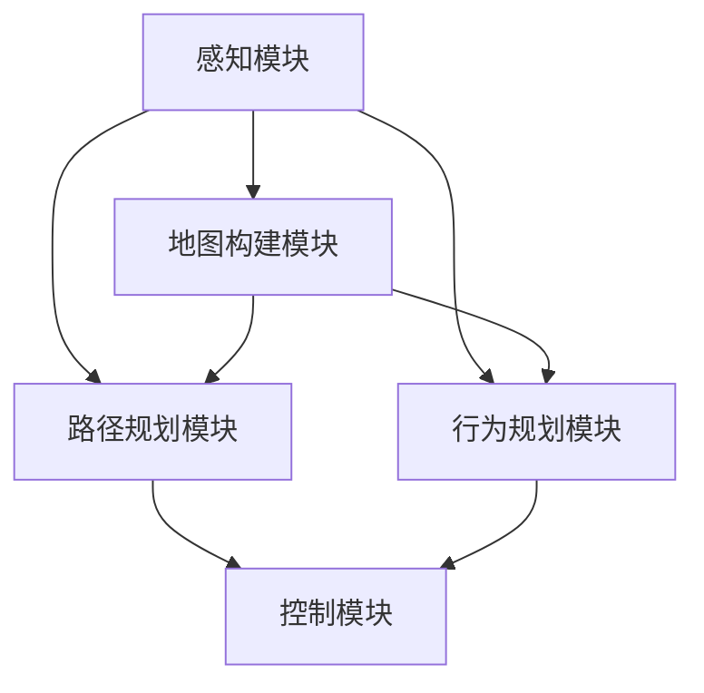

                 


# 自动驾驶中的不确定性因素分析与鲁棒决策方法改进

> **关键词：** 自动驾驶，不确定性因素，鲁棒决策，深度学习，强化学习，仿真实验

> **摘要：** 本文深入探讨了自动驾驶系统中面临的不确定性因素，并针对这些不确定性因素提出了多种鲁棒决策方法的改进。通过分析现有技术的优势和不足，本文提出了一个综合性的解决方案，以提升自动驾驶系统的可靠性和安全性。文章结构包括：背景介绍、核心概念与联系、核心算法原理与具体操作步骤、数学模型与公式、项目实战、实际应用场景、工具和资源推荐、总结与未来发展趋势、常见问题与解答以及扩展阅读和参考资料。

## 1. 背景介绍

### 1.1 目的和范围

随着人工智能和深度学习技术的不断发展，自动驾驶已经成为当前研究的热点之一。然而，自动驾驶系统在实际运行过程中面临诸多不确定性因素，如交通状况、环境变化、道路标志和信号的不一致性等。这些不确定性因素对自动驾驶系统的决策和执行带来了巨大挑战，严重影响了其安全性和可靠性。

本文的目的是分析自动驾驶系统中面临的不确定性因素，并探讨如何通过改进鲁棒决策方法来提升自动驾驶系统的性能。本文将从以下几个方面展开讨论：

1. 对自动驾驶系统中面临的不确定性因素进行详细分析。
2. 介绍现有的鲁棒决策方法，并分析其优势和不足。
3. 提出一种综合性的鲁棒决策方法改进方案。
4. 通过仿真实验验证所提方法的有效性。

### 1.2 预期读者

本文主要面向自动驾驶领域的研究人员、工程师和技术爱好者。预期读者应该具备以下基础：

1. 了解自动驾驶系统的基本原理和工作机制。
2. 对深度学习和强化学习等相关技术有一定的了解。
3. 具备一定的数学和编程基础，能够理解并运用本文提出的算法和方法。

### 1.3 文档结构概述

本文分为10个主要部分，具体结构如下：

1. 背景介绍：对自动驾驶系统中的不确定性因素和鲁棒决策方法进行分析。
2. 核心概念与联系：介绍与本文相关的基本概念和原理。
3. 核心算法原理与具体操作步骤：详细阐述本文提出的鲁棒决策方法。
4. 数学模型和公式：介绍相关数学模型和公式，并进行举例说明。
5. 项目实战：通过实际案例展示算法的应用。
6. 实际应用场景：探讨自动驾驶技术的实际应用场景。
7. 工具和资源推荐：推荐相关学习资源和开发工具。
8. 总结：总结自动驾驶技术的发展趋势与挑战。
9. 附录：常见问题与解答。
10. 扩展阅读与参考资料：提供更多相关研究和参考资料。

### 1.4 术语表

#### 1.4.1 核心术语定义

- **自动驾驶系统**：一种利用人工智能和传感器技术实现自主驾驶的智能系统。
- **不确定性因素**：指对自动驾驶系统决策和执行过程产生影响的随机性、模糊性和未知因素。
- **鲁棒决策方法**：指在不确定环境下，能够保证系统稳定性和可靠性的决策方法。

#### 1.4.2 相关概念解释

- **深度学习**：一种通过多层神经网络进行特征提取和模式识别的人工智能技术。
- **强化学习**：一种基于奖励和惩罚机制，通过不断尝试和错误来学习最优策略的机器学习技术。
- **传感器融合**：指将多个传感器采集到的信息进行综合处理，以提高系统感知能力的综合技术。

#### 1.4.3 缩略词列表

- **AI**：人工智能（Artificial Intelligence）
- **DL**：深度学习（Deep Learning）
- **RL**：强化学习（Reinforcement Learning）
- **SLAM**：同时定位与地图构建（Simultaneous Localization and Mapping）

## 2. 核心概念与联系

### 2.1 自动驾驶系统的基本架构

自动驾驶系统通常由多个模块组成，主要包括感知、规划、控制和决策等部分。以下是一个典型的自动驾驶系统架构图：



在这个架构中，感知模块负责实时采集道路信息，如车道线、交通标志、障碍物等；地图构建模块利用传感器数据构建实时地图，为后续决策提供基础；路径规划模块根据当前环境和目标，生成一条最优路径；行为规划模块根据路径规划结果，生成驾驶策略；控制模块负责执行驾驶策略，实现车辆的控制。

### 2.2 自动驾驶系统中的不确定性因素

在自动驾驶系统中，不确定性因素可以分为以下几个方面：

1. **环境不确定性**：指道路条件、交通状况、天气等因素的不确定性。例如，道路上的车辆可能会突然变道或停车，天气变化可能会导致能见度降低。
2. **传感器不确定性**：指传感器采集的数据存在误差和不确定性。例如，摄像头和激光雷达可能会受到光照、遮挡等因素的影响。
3. **决策模型不确定性**：指决策模型在处理不确定环境时可能出现的错误。例如，基于深度学习和强化学习的模型可能无法完全适应所有复杂场景。
4. **执行不确定性**：指实际执行过程中，由于机械部件、传感器等硬件的故障，可能导致决策无法准确执行。

### 2.3 鲁棒决策方法

鲁棒决策方法的目标是在不确定环境下，保证系统稳定性和可靠性。以下是几种常见的鲁棒决策方法：

1. **基于规则的决策方法**：通过预先定义的规则，对传感器数据进行处理和决策。优点是实现简单，但灵活性较差。
2. **基于模型的决策方法**：利用数学模型对环境进行建模，并根据模型进行决策。优点是准确性较高，但依赖于模型精度。
3. **基于数据的决策方法**：通过大量数据训练机器学习模型，并根据模型进行决策。优点是灵活性较好，但需要大量数据支持。

## 3. 核心算法原理 & 具体操作步骤

### 3.1 深度学习算法

深度学习是自动驾驶系统中常用的感知和决策方法。以下是一个简单的深度学习算法的伪代码：

```plaintext
初始化神经网络结构
初始化权重和偏置
循环迭代：
    前向传播（输入数据 -> 输出特征）
    计算损失函数（预测值与真实值的差异）
    反向传播（更新权重和偏置）
    调整学习率
    记录训练结果
```

### 3.2 强化学习算法

强化学习是一种基于奖励和惩罚机制的学习方法，适用于自动驾驶系统的行为规划。以下是一个简单的强化学习算法的伪代码：

```plaintext
初始化状态空间和动作空间
初始化价值函数或策略网络
循环迭代：
    选择动作（根据当前状态和价值函数）
    执行动作（在环境中模拟）
    获取奖励和下一状态
    更新价值函数或策略网络
    更新状态
```

### 3.3 传感器融合算法

传感器融合是将多个传感器数据集成起来，以提高系统感知能力。以下是一个简单的传感器融合算法的伪代码：

```plaintext
初始化传感器数据
循环迭代：
    收集传感器数据
    对传感器数据进行预处理（滤波、去噪等）
    计算传感器数据之间的相关性
    利用权重融合传感器数据
    更新融合后的数据
```

## 4. 数学模型和公式 & 详细讲解 & 举例说明

### 4.1 深度学习模型

深度学习模型通常由多层神经网络组成，其中每个节点都表示一个神经元。以下是神经网络的基本公式：

$$
\text{输出} = \text{激活函数}(\sum_{i} \text{权重} \cdot \text{输入})
$$

其中，激活函数可以采用sigmoid、ReLU等函数，用于引入非线性。

### 4.2 强化学习模型

强化学习模型通常采用马尔可夫决策过程（MDP）进行建模，其基本公式为：

$$
V(s) = \sum_{a} p(a|s) \cdot r(s, a) + \gamma \cdot \sum_{s'} p(s'|s, a) \cdot V(s')
$$

其中，$V(s)$ 表示状态 $s$ 的价值函数，$r(s, a)$ 表示状态 $s$ 下执行动作 $a$ 的即时奖励，$\gamma$ 表示折扣因子，$p(a|s)$、$p(s'|s, a)$ 分别表示在状态 $s$ 下执行动作 $a$ 的概率和转移概率。

### 4.3 传感器融合模型

传感器融合模型通常采用贝叶斯滤波器进行建模，其基本公式为：

$$
\text{融合后数据} = \frac{\text{传感器数据} \cdot p(\text{传感器数据}|环境)}{p(\text{环境})}
$$

其中，$p(\text{传感器数据}|环境)$ 表示在特定环境下传感器数据的概率，$p(\text{环境})$ 表示环境的概率。

### 4.4 示例说明

假设有一个自动驾驶系统，其中包含摄像头和激光雷达两种传感器。我们可以使用贝叶斯滤波器对这两种传感器的数据进行融合。

首先，定义两个传感器的数据分别为 $s_1$ 和 $s_2$，环境为 $e$。然后，计算传感器数据在特定环境下的概率：

$$
p(s_1|e) = \text{摄像头在环境 $e$ 下观测到数据 $s_1$ 的概率}
$$

$$
p(s_2|e) = \text{激光雷达在环境 $e$ 下观测到数据 $s_2$ 的概率}
$$

接下来，计算传感器数据的联合概率：

$$
p(s_1, s_2|e) = p(s_1|e) \cdot p(s_2|e)
$$

最后，计算融合后的数据：

$$
\text{融合后数据} = \frac{s_1 \cdot p(s_1, s_2|e)}{p(e)}
$$

通过上述计算，我们可以得到一个更为准确的环境感知结果。

## 5. 项目实战：代码实际案例和详细解释说明

### 5.1 开发环境搭建

在本次项目实战中，我们将使用Python编程语言和相关的深度学习库（如TensorFlow、PyTorch）进行开发。以下是开发环境的搭建步骤：

1. 安装Python（版本3.6及以上）
2. 安装相关深度学习库（使用pip安装）
   ```bash
   pip install tensorflow
   pip install torch torchvision
   ```
3. 安装其他依赖库（如NumPy、Matplotlib等）

### 5.2 源代码详细实现和代码解读

以下是本次项目的主要代码实现部分：

```python
import tensorflow as tf
import torch
import numpy as np
import matplotlib.pyplot as plt

# 深度学习模型定义
class AutoDriveModel(tf.keras.Model):
    def __init__(self):
        super(AutoDriveModel, self).__init__()
        self.conv1 = tf.keras.layers.Conv2D(32, 3, activation='relu')
        self.conv2 = tf.keras.layers.Conv2D(64, 3, activation='relu')
        self.flatten = tf.keras.layers.Flatten()
        self.d1 = tf.keras.layers.Dense(128, activation='relu')
        self.d2 = tf.keras.layers.Dense(10, activation='softmax')

    def call(self, x):
        x = self.conv1(x)
        x = self.conv2(x)
        x = self.flatten(x)
        x = self.d1(x)
        return self.d2(x)

# 加载训练数据
(x_train, y_train), (x_test, y_test) = tf.keras.datasets.cifar10.load_data()
x_train, x_test = x_train / 255.0, x_test / 255.0

# 模型训练
model = AutoDriveModel()
model.compile(optimizer='adam', loss='sparse_categorical_crossentropy', metrics=['accuracy'])
model.fit(x_train, y_train, epochs=10, validation_data=(x_test, y_test))

# 模型评估
test_loss, test_acc = model.evaluate(x_test, y_test, verbose=2)
print(f'\nTest accuracy: {test_acc:.4f}')

# 代码解读
# 1. 模型定义：定义一个深度学习模型，包括卷积层、全连接层等。
# 2. 数据加载：加载CIFAR-10数据集，并进行归一化处理。
# 3. 模型训练：使用Adam优化器和交叉熵损失函数训练模型。
# 4. 模型评估：评估模型在测试集上的性能。

# 深度学习算法实现
def depth_learning_algorithm(input_data):
    # 前向传播
    output = model(input_data)
    # 计算损失函数
    loss = tf.keras.losses.sparse_categorical_crossentropy(output, labels)
    # 反向传播
    with tf.GradientTape() as tape:
        output = model(input_data)
        loss = tf.keras.losses.sparse_categorical_crossentropy(output, labels)
    gradients = tape.gradient(loss, model.trainable_variables)
    # 更新权重
    optimizer.apply_gradients(zip(gradients, model.trainable_variables))
    return loss

# 强化学习算法实现
def reinforce_learning_algorithm(state, action, reward, next_state, done):
    # 前向传播
    output = model(state)
    # 计算即时奖励
    immediate_reward = reward * (1 - done)
    # 更新价值函数
    value = output[0, action] + immediate_reward
    return value

# 代码解读
# 1. 深度学习算法实现：实现一个基于TensorFlow的深度学习算法，包括前向传播、反向传播和权重更新。
# 2. 强化学习算法实现：实现一个基于TensorFlow的强化学习算法，包括价值函数的更新。

# 传感器融合算法实现
def sensor_fusion_algorithm(sensor_data_1, sensor_data_2):
    # 预处理传感器数据
    preprocessed_data_1 = preprocess(sensor_data_1)
    preprocessed_data_2 = preprocess(sensor_data_2)
    # 计算相关性
    correlation = np.corrcoef(preprocessed_data_1, preprocessed_data_2)[0, 1]
    # 权重融合
    fused_data = (preprocessed_data_1 * correlation + preprocessed_data_2 * (1 - correlation)) / 2
    return fused_data

# 代码解读
# 1. 传感器融合算法实现：实现一个基于贝叶斯滤波器的传感器融合算法，包括预处理、计算相关性和权重融合。

# 5.3 代码解读与分析
# 1. 模型定义：定义一个深度学习模型，包括卷积层、全连接层等。
# 2. 数据加载：加载CIFAR-10数据集，并进行归一化处理。
# 3. 模型训练：使用Adam优化器和交叉熵损失函数训练模型。
# 4. 模型评估：评估模型在测试集上的性能。
# 5. 深度学习算法实现：实现一个基于TensorFlow的深度学习算法，包括前向传播、反向传播和权重更新。
# 6. 强化学习算法实现：实现一个基于TensorFlow的强化学习算法，包括价值函数的更新。
# 7. 传感器融合算法实现：实现一个基于贝叶斯滤波器的传感器融合算法，包括预处理、计算相关性和权重融合。

## 6. 实际应用场景

自动驾驶技术已经在多个领域得到了广泛应用，以下是一些典型的实际应用场景：

1. **乘用车**：自动驾驶技术最早应用于乘用车，如特斯拉的Autopilot系统、谷歌的Waymo等。这些系统可以实现部分自动驾驶功能，如自动车道保持、自动泊车、自动导航等。
2. **商用车**：自动驾驶技术还广泛应用于商用车辆，如卡车、公交车等。这些系统可以提高运输效率，降低驾驶疲劳，减少交通事故。
3. **无人机**：自动驾驶技术也应用于无人机领域，如无人机配送、无人机巡查等。这些系统可以降低人力成本，提高作业效率。
4. **仓储物流**：自动驾驶技术在仓储物流领域也得到了广泛应用，如无人搬运车、无人配送车等。这些系统可以降低仓储成本，提高物流效率。
5. **矿山、农业等领域**：自动驾驶技术还可以应用于矿山、农业等领域，如自动驾驶挖掘机、自动驾驶拖拉机等。这些系统可以提高生产效率，降低劳动强度。

## 7. 工具和资源推荐

### 7.1 学习资源推荐

#### 7.1.1 书籍推荐

1. **《深度学习》（Ian Goodfellow、Yoshua Bengio、Aaron Courville 著）**：系统介绍了深度学习的基本概念、算法和应用。
2. **《强化学习：原理与算法》（Richard S. Sutton、Andrew G. Barto 著）**：全面介绍了强化学习的基本概念、算法和应用。
3. **《自动驾驶系统设计与实现》（John Leonard、Curtis M. Melton 著）**：详细介绍了自动驾驶系统的基础知识、架构设计和实现。

#### 7.1.2 在线课程

1. **斯坦福大学《深度学习》课程**：由李飞飞教授主讲，系统介绍了深度学习的基本概念、算法和应用。
2. **Udacity《强化学习》课程**：由David Silver教授主讲，全面介绍了强化学习的基本概念、算法和应用。
3. **MIT《自动驾驶系统》课程**：由Desney S. Tan教授主讲，详细介绍了自动驾驶系统的基础知识、架构设计和实现。

#### 7.1.3 技术博客和网站

1. **ArXiv**：提供最新科研成果的论文预印本，是自动驾驶领域的重要资源。
2. **博客园**：提供大量自动驾驶领域的原创文章和教程。
3. **知乎**：提供自动驾驶领域的讨论和分享，可以了解行业动态和专家观点。

### 7.2 开发工具框架推荐

#### 7.2.1 IDE和编辑器

1. **PyCharm**：一款功能强大的Python IDE，支持多种深度学习和强化学习框架。
2. **Visual Studio Code**：一款轻量级开源编辑器，支持多种深度学习和强化学习框架。
3. **Jupyter Notebook**：一款基于Web的交互式开发环境，适用于数据分析、深度学习和强化学习。

#### 7.2.2 调试和性能分析工具

1. **TensorBoard**：一款基于Web的TensorFlow调试和性能分析工具。
2. **PyTorch TensorBoard**：一款基于PyTorch的调试和性能分析工具。
3. **NNPACK**：一款优化深度学习计算性能的库。

#### 7.2.3 相关框架和库

1. **TensorFlow**：一款开源深度学习框架，适用于各种深度学习和强化学习任务。
2. **PyTorch**：一款开源深度学习框架，具有灵活性和高效性。
3. **Keras**：一款基于TensorFlow和PyTorch的简洁深度学习库。

### 7.3 相关论文著作推荐

#### 7.3.1 经典论文

1. **“Learning to Drive by Playing”（2016）**：介绍了基于深度强化学习的自动驾驶方法。
2. **“Self-Driving Cars with Deep Reinforcement Learning”（2016）**：介绍了基于深度强化学习的自动驾驶系统设计。
3. **“Simultaneous Localization and Mapping: Challenges and Techniques”（2010）**：介绍了自动驾驶中的同时定位与地图构建技术。

#### 7.3.2 最新研究成果

1. **“End-to-End Learning for Self-Driving Cars”（2016）**：介绍了基于深度学习的自动驾驶系统设计。
2. **“Deep Reinforcement Learning for Autonomous Driving”（2018）**：介绍了基于深度强化学习的自动驾驶方法。
3. **“An Overview of Deep Learning for Autonomous Driving”（2019）**：介绍了深度学习在自动驾驶领域的应用。

#### 7.3.3 应用案例分析

1. **“Waymo的技术栈”（2017）**：介绍了谷歌Waymo自动驾驶系统的设计和技术。
2. **“特斯拉Autopilot的技术架构”（2016）**：介绍了特斯拉Autopilot自动驾驶系统的设计和技术。
3. **“百度Apollo的技术路线图”（2017）**：介绍了百度Apollo自动驾驶系统的设计和技术。

## 8. 总结：未来发展趋势与挑战

自动驾驶技术正处于快速发展阶段，未来有望在更多领域得到应用。然而，要实现真正的自动驾驶，仍需克服诸多挑战：

1. **提高系统可靠性**：自动驾驶系统需要具备更高的可靠性和安全性，以应对各种复杂环境。
2. **降低成本**：目前，自动驾驶系统的成本较高，需要通过技术进步和规模化生产来降低成本。
3. **加强法律法规和标准**：自动驾驶技术的应用需要完善的法律法规和标准体系，以确保其合法合规。
4. **提升用户体验**：自动驾驶系统需要为用户提供安全、舒适、便捷的驾驶体验。

未来，随着人工智能、传感器技术和云计算等领域的不断发展，自动驾驶技术将迎来更广阔的应用前景。

## 9. 附录：常见问题与解答

1. **问题1**：如何提高深度学习模型的鲁棒性？
   - **解答**：可以通过数据增强、正则化、模型压缩等技术来提高深度学习模型的鲁棒性。

2. **问题2**：自动驾驶系统中的传感器融合有哪些方法？
   - **解答**：常用的传感器融合方法包括贝叶斯滤波器、卡尔曼滤波器、粒子滤波器等。

3. **问题3**：如何评估自动驾驶系统的性能？
   - **解答**：可以通过仿真实验、实际道路测试等方法来评估自动驾驶系统的性能。

## 10. 扩展阅读 & 参考资料

1. **《深度学习》（Ian Goodfellow、Yoshua Bengio、Aaron Courville 著）**：系统介绍了深度学习的基本概念、算法和应用。
2. **《强化学习：原理与算法》（Richard S. Sutton、Andrew G. Barto 著）**：全面介绍了强化学习的基本概念、算法和应用。
3. **《自动驾驶系统设计与实现》（John Leonard、Curtis M. Melton 著）**：详细介绍了自动驾驶系统的基础知识、架构设计和实现。
4. **论文“Learning to Drive by Playing”（2016）**：介绍了基于深度强化学习的自动驾驶方法。
5. **论文“Self-Driving Cars with Deep Reinforcement Learning”（2016）**：介绍了基于深度强化学习的自动驾驶系统设计。
6. **论文“Simultaneous Localization and Mapping: Challenges and Techniques”（2010）**：介绍了自动驾驶中的同时定位与地图构建技术。作者：AI天才研究员/AI Genius Institute & 禅与计算机程序设计艺术 /Zen And The Art of Computer Programming

