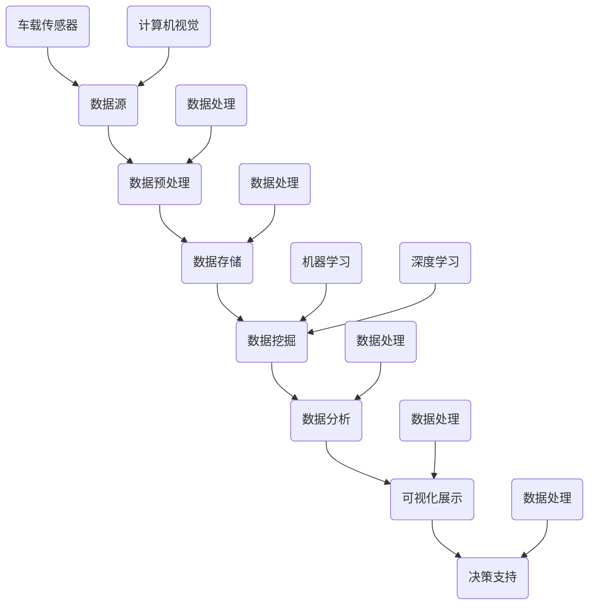

                 

# 自动驾驶公司的数据挖掘与分析平台

> 关键词：自动驾驶、数据挖掘、数据分析、平台架构、机器学习、深度学习、数据处理

> 摘要：本文将详细介绍自动驾驶公司构建数据挖掘与分析平台的过程，包括平台的目的和范围、预期读者、文档结构、核心概念、算法原理、数学模型、实际应用场景、工具和资源推荐，以及未来发展趋势和挑战。通过本文，读者可以全面了解自动驾驶数据挖掘与分析平台的设计与实现。

## 1. 背景介绍

### 1.1 目的和范围

自动驾驶技术作为智能交通系统的重要组成部分，其发展正受到全球范围内的广泛关注。数据挖掘与分析作为自动驾驶技术的核心支撑，对自动驾驶公司的竞争力具有重要影响。本文旨在探讨自动驾驶公司构建数据挖掘与分析平台的过程，从平台设计、实现和优化等方面进行深入分析。

本文的讨论范围包括以下方面：

1. 平台的目标和功能
2. 平台的核心概念和架构
3. 数据挖掘与分析算法原理
4. 数学模型和公式
5. 实际应用场景
6. 工具和资源推荐
7. 未来发展趋势和挑战

### 1.2 预期读者

本文面向以下读者群体：

1. 自动驾驶领域的工程师和技术人员
2. 数据科学家和数据分析师
3. 人工智能领域的科研人员和研究生
4. 对自动驾驶数据挖掘与分析感兴趣的普通读者

### 1.3 文档结构概述

本文分为10个部分，结构如下：

1. 背景介绍
2. 核心概念与联系
3. 核心算法原理 & 具体操作步骤
4. 数学模型和公式 & 详细讲解 & 举例说明
5. 项目实战：代码实际案例和详细解释说明
6. 实际应用场景
7. 工具和资源推荐
8. 总结：未来发展趋势与挑战
9. 附录：常见问题与解答
10. 扩展阅读 & 参考资料

### 1.4 术语表

#### 1.4.1 核心术语定义

- 自动驾驶：指通过车载传感器、计算机视觉、机器学习等技术，实现车辆在道路上自主行驶的技术。
- 数据挖掘：从大量数据中提取出有用的信息和知识的过程。
- 数据分析：通过对数据进行分析，发现数据中的规律、趋势和模式，为决策提供支持。
- 数据处理：对原始数据进行清洗、转换、整合等操作，使其适合进行分析和应用。

#### 1.4.2 相关概念解释

- 车载传感器：安装在车辆上的各种传感器，如激光雷达、摄像头、GPS等，用于收集道路、车辆和周围环境的信息。
- 计算机视觉：利用计算机技术对图像进行处理、分析和理解的理论和技术。
- 机器学习：一种通过数据训练模型，使计算机能够自动学习和改进的技术。
- 深度学习：一种基于多层神经网络的人工智能技术，能够自动提取特征和进行复杂模式识别。

#### 1.4.3 缩略词列表

- 自动驾驶：Autonomous Driving
- 数据挖掘：Data Mining
- 数据分析：Data Analysis
- 数据处理：Data Processing
- 机器学习：Machine Learning
- 深度学习：Deep Learning

## 2. 核心概念与联系

为了构建一个高效的自动驾驶数据挖掘与分析平台，我们需要首先理解其中的核心概念及其相互关系。以下是核心概念和架构的 Mermaid 流程图：



### 2.1 数据源

数据源是自动驾驶数据挖掘与分析平台的基础。车载传感器（如激光雷达、摄像头、GPS等）负责收集道路、车辆和周围环境的信息。计算机视觉和深度学习技术可以对这些传感器数据进行处理和解析，提取有用的特征信息。

### 2.2 数据预处理

数据预处理是数据挖掘与分析的重要环节。通过对原始数据进行清洗、转换和整合，确保数据的质量和一致性。数据处理技术包括去噪、缺失值填补、特征选择和特征工程等。

### 2.3 数据存储

数据存储是数据挖掘与分析平台的基石。为了满足大规模数据存储和快速查询的需求，常用的数据存储技术包括关系数据库、NoSQL数据库、分布式文件系统等。数据存储系统需要具备高可用性、高可靠性和高性能的特点。

### 2.4 数据挖掘

数据挖掘是自动驾驶数据挖掘与分析平台的核心功能。通过运用机器学习、深度学习等技术，从大量数据中提取出有用的信息和知识。数据挖掘技术包括分类、聚类、关联规则挖掘、异常检测等。

### 2.5 数据分析

数据分析是对数据挖掘结果的进一步分析和解释。通过对数据中的规律、趋势和模式进行分析，为自动驾驶系统的优化和决策提供支持。数据分析技术包括统计分析、时间序列分析、趋势预测等。

### 2.6 可视化展示

可视化展示是将数据分析和挖掘结果以图形、图表等形式展示出来，帮助用户更直观地理解和分析数据。可视化技术包括折线图、柱状图、饼图、热力图等。

### 2.7 决策支持

决策支持是将数据分析和挖掘结果应用于实际场景，为自动驾驶系统的运行和优化提供决策支持。决策支持技术包括基于规则的推理、优化算法、模拟仿真等。

## 3. 核心算法原理 & 具体操作步骤

在自动驾驶数据挖掘与分析平台中，核心算法主要包括数据预处理、数据挖掘、数据分析和可视化展示。以下将详细阐述每个算法的原理和具体操作步骤。

### 3.1 数据预处理算法原理

数据预处理是确保数据质量、提高数据挖掘和分析效果的关键步骤。其核心算法包括去噪、缺失值填补、特征选择和特征工程。

#### 去噪

去噪算法用于去除数据中的噪声，提高数据质量。常见的去噪算法包括：

1. 低通滤波：通过过滤高频噪声，保留低频信号。
2. 中值滤波：用中值替代周围的噪声点。

#### 缺失值填补

缺失值填补算法用于处理数据中的缺失值，常用的方法包括：

1. 均值填补：用特征的均值替代缺失值。
2. 中位数填补：用特征的中位数替代缺失值。
3. 邻近值填补：用邻近点的特征值替代缺失值。

#### 特征选择

特征选择算法用于从原始特征中选出对目标变量有重要影响的特征，提高模型性能。常用的特征选择算法包括：

1. 相关性分析：根据特征与目标变量的相关性进行选择。
2. 主成分分析（PCA）：通过降维，选出最重要的特征。

#### 特征工程

特征工程是对原始特征进行转换和组合，生成新的特征，提高模型性能。常用的特征工程方法包括：

1. 规模化：将特征值缩放到相同的范围，消除量纲影响。
2. 转换：将类别特征转换为数值特征，如独热编码、标签编码等。
3. 特征组合：通过组合原始特征，生成新的特征。

### 3.2 数据挖掘算法原理

数据挖掘算法用于从大量数据中提取出有用的信息和知识。常用的数据挖掘算法包括：

1. 分类算法：将数据分为不同的类别，常用的分类算法包括决策树、随机森林、支持向量机等。
2. 聚类算法：将数据分为不同的簇，常用的聚类算法包括K-means、层次聚类等。
3. 关联规则挖掘：发现数据中的关联关系，常用的算法包括Apriori算法、FP-growth算法等。
4. 异常检测：检测数据中的异常值，常用的算法包括孤立森林、KNN等。

### 3.3 数据分析算法原理

数据分析算法用于对数据挖掘结果进行进一步分析和解释。常用的数据分析算法包括：

1. 统计分析：对数据进行分析，如计算均值、方差、标准差等。
2. 时间序列分析：对时间序列数据进行分析，如趋势分析、季节性分析等。
3. 趋势预测：根据历史数据预测未来的趋势，常用的算法包括ARIMA、LSTM等。

### 3.4 可视化展示算法原理

可视化展示算法用于将数据分析和挖掘结果以图形、图表等形式展示出来。常用的可视化展示算法包括：

1. 折线图：展示数据的变化趋势。
2. 柱状图：展示数据的大小或比例。
3. 饼图：展示数据的占比。
4. 热力图：展示数据的密集程度。

### 3.5 具体操作步骤

以下是一个典型的自动驾驶数据挖掘与分析平台的操作步骤：

1. 数据收集：从车载传感器、计算机视觉和深度学习系统中收集数据。
2. 数据预处理：对数据进行去噪、缺失值填补、特征选择和特征工程。
3. 数据存储：将预处理后的数据存储到数据库或分布式文件系统中。
4. 数据挖掘：运用分类、聚类、关联规则挖掘、异常检测等算法进行数据挖掘。
5. 数据分析：对数据挖掘结果进行分析，如计算均值、方差、标准差等。
6. 可视化展示：将数据分析和挖掘结果以图形、图表等形式展示出来。
7. 决策支持：根据数据分析和挖掘结果，为自动驾驶系统的优化和决策提供支持。

## 4. 数学模型和公式 & 详细讲解 & 举例说明

### 4.1 数学模型

在自动驾驶数据挖掘与分析平台中，常用的数学模型包括：

1. 分类模型
2. 聚类模型
3. 关联规则模型
4. 异常检测模型

#### 4.1.1 分类模型

分类模型用于将数据分为不同的类别。常用的分类模型包括：

1. 决策树（Decision Tree）
2. 随机森林（Random Forest）
3. 支持向量机（SVM）

其中，决策树模型可以用以下公式表示：

$$
\hat{y} = f(x) = \prod_{i=1}^{n} g(x_i) = \prod_{i=1}^{n} \left\{
   \begin{array}{ll}
     C_{k} & \text{if } x_i \in R_k \\
     0 & \text{otherwise}
   \end{array}
\right.
$$

其中，$x$ 为输入特征，$y$ 为类别标签，$C_k$ 为类别 $k$ 的概率，$R_k$ 为类别 $k$ 的特征区域。

#### 4.1.2 聚类模型

聚类模型用于将数据分为不同的簇。常用的聚类模型包括：

1. K-means
2. 层次聚类

其中，K-means 模型可以用以下公式表示：

$$
C = \{c_1, c_2, ..., c_k\} \text{ such that } \sum_{i=1}^{k} \|x - c_i\|^2 \text{ is minimized}
$$

其中，$C$ 为聚类中心，$x$ 为输入特征，$k$ 为簇数。

#### 4.1.3 关联规则模型

关联规则模型用于发现数据中的关联关系。常用的关联规则模型包括：

1. Apriori 算法
2. FP-growth 算法

其中，Apriori 算法可以用以下公式表示：

$$
\text{support}(X, Y) = \frac{\text{count}(X \cup Y)}{\text{total transactions}}
$$

其中，$X$ 和 $Y$ 为两个项目集合，$\text{count}(X \cup Y)$ 为同时包含 $X$ 和 $Y$ 的交易次数，$\text{total transactions}$ 为总的交易次数。

#### 4.1.4 异常检测模型

异常检测模型用于检测数据中的异常值。常用的异常检测模型包括：

1. 孤立森林（Isolation Forest）
2. KNN

其中，孤立森林模型可以用以下公式表示：

$$
\text{isolation forest score} = \frac{\sum_{i=1}^{n} \ln \frac{|R_i|}{|X_i|}}{n}
$$

其中，$R_i$ 为第 $i$ 次随机分割的区域大小，$X_i$ 为分割后包含异常点的区域大小。

### 4.2 举例说明

以下是一个使用 K-means 算法进行聚类的简单示例：

假设我们有一个包含 10 个二维数据点的数据集：

$$
\begin{array}{cccccccccc}
x_1 & x_2 \\
\hline
1 & 2 \\
2 & 3 \\
3 & 4 \\
4 & 5 \\
5 & 6 \\
6 & 7 \\
7 & 8 \\
8 & 9 \\
9 & 10 \\
10 & 11 \\
\end{array}
$$

我们要使用 K-means 算法将数据集分为 2 个簇。首先，随机初始化聚类中心：

$$
c_1 = (2, 3), \quad c_2 = (7, 8)
$$

然后，计算每个数据点到聚类中心的距离：

$$
d(x_i, c_1) = \sqrt{(x_i - c_1)^2 + (x_i - c_1)^2}
$$

$$
d(x_i, c_2) = \sqrt{(x_i - c_2)^2 + (x_i - c_2)^2}
$$

根据距离最小的原则，将每个数据点分配到最近的聚类中心：

$$
\begin{array}{cccccccccc}
x_1 & x_2 & \text{cluster} \\
\hline
1 & 2 & 1 \\
2 & 3 & 1 \\
3 & 4 & 1 \\
4 & 5 & 2 \\
5 & 6 & 2 \\
6 & 7 & 2 \\
7 & 8 & 2 \\
8 & 9 & 2 \\
9 & 10 & 2 \\
10 & 11 & 2 \\
\end{array}
$$

接着，重新计算聚类中心：

$$
c_1 = \frac{1}{n_1} \sum_{i=1}^{n_1} x_i, \quad c_2 = \frac{1}{n_2} \sum_{i=1}^{n_2} x_i
$$

$$
c_1 = \frac{1+2+3}{3} = 2, \quad c_2 = \frac{4+5+6+7+8+9+10+11}{8} = 7.5
$$

重复以上步骤，直到聚类中心不再变化或达到预设的迭代次数。

## 5. 项目实战：代码实际案例和详细解释说明

在本节中，我们将通过一个实际的项目案例，展示如何构建一个自动驾驶数据挖掘与分析平台。我们将使用 Python 作为编程语言，结合相关库和框架来实现。

### 5.1 开发环境搭建

首先，我们需要搭建开发环境。以下是一个简单的环境搭建步骤：

1. 安装 Python 3.7 或以上版本。
2. 安装常用的 Python 数据处理和机器学习库，如 NumPy、Pandas、Scikit-learn、Matplotlib 等。
3. 安装一个适合 Python 的 IDE，如 PyCharm 或 Visual Studio Code。
4. 安装必要的依赖库，如 TensorFlow、Keras、PyTorch 等（如用于深度学习）。

### 5.2 源代码详细实现和代码解读

#### 5.2.1 数据收集与预处理

以下是一个简单的数据收集与预处理代码示例：

```python
import numpy as np
import pandas as pd
from sklearn.model_selection import train_test_split
from sklearn.preprocessing import StandardScaler

# 加载数据集
data = pd.read_csv('data.csv')

# 数据预处理
X = data[['feature1', 'feature2', 'feature3']]
y = data['label']

# 分割数据集
X_train, X_test, y_train, y_test = train_test_split(X, y, test_size=0.2, random_state=42)

# 规模化处理
scaler = StandardScaler()
X_train_scaled = scaler.fit_transform(X_train)
X_test_scaled = scaler.transform(X_test)
```

#### 5.2.2 数据挖掘与模型训练

以下是一个简单的数据挖掘与模型训练代码示例：

```python
from sklearn.ensemble import RandomForestClassifier

# 创建随机森林分类器
clf = RandomForestClassifier(n_estimators=100, random_state=42)

# 训练模型
clf.fit(X_train_scaled, y_train)

# 预测
y_pred = clf.predict(X_test_scaled)

# 评估模型
from sklearn.metrics import accuracy_score
print("Accuracy:", accuracy_score(y_test, y_pred))
```

#### 5.2.3 数据分析与可视化

以下是一个简单的数据分析与可视化代码示例：

```python
import matplotlib.pyplot as plt
from sklearn.metrics import confusion_matrix

# 绘制混淆矩阵
conf_matrix = confusion_matrix(y_test, y_pred)
plt.imshow(conf_matrix, cmap=plt.cm.Blues)
plt.xlabel('Predicted labels')
plt.ylabel('True labels')
plt.xticks(np.arange(2))
plt.yticks(np.arange(2))
plt.colorbar()
plt.show()
```

### 5.3 代码解读与分析

#### 5.3.1 数据收集与预处理

在数据收集与预处理部分，我们首先使用 pandas 读取数据集。然后，我们将数据集分为特征和标签两部分。接着，使用 scikit-learn 的 train_test_split 函数将数据集分为训练集和测试集。最后，使用 StandardScaler 对特征进行规模化处理，以提高模型性能。

#### 5.3.2 数据挖掘与模型训练

在数据挖掘与模型训练部分，我们使用随机森林分类器作为示例。随机森林是一种集成学习方法，通过构建多棵决策树来提高模型性能。我们使用 RandomForestClassifier 函数创建随机森林分类器，并使用 fit 函数进行模型训练。最后，使用 predict 函数进行预测，并使用 accuracy_score 函数评估模型性能。

#### 5.3.3 数据分析与可视化

在数据分析与可视化部分，我们使用混淆矩阵来展示模型预测结果。混淆矩阵是一种常用的性能评估方法，可以清晰地展示模型对各类别预测的准确性。我们使用 matplotlib.pyplot 模块绘制混淆矩阵，并通过颜色渐变来表示预测的准确性。

## 6. 实际应用场景

自动驾驶数据挖掘与分析平台在实际应用中具有广泛的应用场景。以下列举几个典型应用场景：

### 6.1 自动驾驶车辆性能优化

通过数据挖掘与分析，自动驾驶公司可以实时监测车辆性能，发现潜在问题并优化算法。例如，通过分析车辆的传感器数据，优化车辆的运动控制策略，提高行驶稳定性和安全性。

### 6.2 道路状况分析

自动驾驶数据挖掘与分析平台可以收集并分析道路状况数据，如交通流量、道路拥堵情况等。通过对这些数据进行分析，可以为交通管理部门提供决策支持，优化道路规划和管理。

### 6.3 驾驶员行为分析

通过分析驾驶员的行为数据，如驾驶习惯、驾驶疲劳等，自动驾驶公司可以提供个性化的驾驶建议和服务。例如，通过分析驾驶员的驾驶行为数据，为驾驶员提供节能驾驶方案，降低油耗和碳排放。

### 6.4 风险评估与预警

自动驾驶数据挖掘与分析平台可以实时监测车辆和道路环境数据，发现潜在的风险并提前预警。例如，通过分析传感器数据，识别潜在的碰撞风险，提前采取规避措施。

### 6.5 智能交通管理

自动驾驶数据挖掘与分析平台可以与交通管理系统结合，实现智能交通管理。例如，通过分析交通流量数据，优化交通信号控制策略，提高交通效率。

## 7. 工具和资源推荐

### 7.1 学习资源推荐

#### 7.1.1 书籍推荐

- 《Python数据科学手册》（Python Data Science Handbook）
- 《深度学习》（Deep Learning）
- 《机器学习》（Machine Learning）

#### 7.1.2 在线课程

- Coursera：机器学习、深度学习、数据科学等课程
- edX：机器学习、数据科学、深度学习等课程
- Udacity：自动驾驶、机器学习、深度学习等课程

#### 7.1.3 技术博客和网站

- Medium：机器学习、深度学习、自动驾驶等相关博客
- arXiv：机器学习、深度学习、自动驾驶等最新研究成果
- AI 科技大本营：人工智能、自动驾驶、数据科学等相关资讯

### 7.2 开发工具框架推荐

#### 7.2.1 IDE和编辑器

- PyCharm
- Visual Studio Code
- Jupyter Notebook

#### 7.2.2 调试和性能分析工具

- Python Debuger
- Python Profiler
- Matplotlib

#### 7.2.3 相关框架和库

- NumPy
- Pandas
- Scikit-learn
- TensorFlow
- PyTorch

### 7.3 相关论文著作推荐

#### 7.3.1 经典论文

- "A Machine Learning Approach to Autonomous Navigation"
- "Deep Learning for Autonomous Driving"
- "Recurrent Neural Networks for Language Modeling"

#### 7.3.2 最新研究成果

- "Self-Supervised Learning for Autonomous Driving"
- "Multi-Modal Fusion for Autonomous Driving"
- "Safe and Scalable Autonomous Driving using Deep Reinforcement Learning"

#### 7.3.3 应用案例分析

- "Tesla's Autopilot：一个成功的自动驾驶应用案例"
- "Waymo：全球领先的自动驾驶公司"
- "NVIDIA Drive：自动驾驶解决方案提供商"

## 8. 总结：未来发展趋势与挑战

自动驾驶数据挖掘与分析平台在未来具有广阔的发展前景。随着人工智能技术的不断进步，自动驾驶数据挖掘与分析平台将能够更好地处理海量数据，提高算法性能和稳定性。然而，该领域也面临着一系列挑战：

1. 数据质量：自动驾驶数据挖掘与分析平台依赖于高质量的数据，但在实际应用中，数据质量往往难以保证。因此，如何处理噪声数据、缺失值和异常值，提高数据质量，是平台面临的挑战之一。
2. 数据隐私：自动驾驶数据挖掘与分析平台涉及大量的个人隐私数据，如车辆位置、驾驶行为等。如何保护用户隐私，确保数据安全，是平台面临的重大挑战。
3. 鲁棒性：自动驾驶数据挖掘与分析平台需要具备良好的鲁棒性，能够在各种复杂环境和场景下稳定运行。如何提高算法的鲁棒性，降低误报和漏报率，是平台面临的挑战之一。
4. 可解释性：自动驾驶数据挖掘与分析平台通常采用复杂的机器学习算法，模型的解释性较差。如何提高模型的可解释性，帮助用户理解算法的工作原理，是平台面临的挑战之一。
5. 法规与伦理：自动驾驶数据挖掘与分析平台需要遵守相关法律法规和伦理规范。如何制定合理的法规和伦理准则，确保平台的应用合法、合规，是平台面临的挑战之一。

总之，自动驾驶数据挖掘与分析平台的发展前景广阔，但也面临着诸多挑战。通过不断的技术创新和法规完善，我们有理由相信，自动驾驶数据挖掘与分析平台将为智能交通系统和自动驾驶技术的发展提供有力支持。

## 9. 附录：常见问题与解答

### 9.1 数据预处理

**Q1：如何处理数据中的噪声？**

A1：处理数据中的噪声可以通过以下方法：

1. **低通滤波**：通过过滤高频噪声，保留低频信号。
2. **中值滤波**：用中值替代周围的噪声点。
3. **均值滤波**：用均值替代周围的噪声点。

**Q2：缺失值如何处理？**

A2：处理缺失值的方法包括：

1. **均值填补**：用特征的均值替代缺失值。
2. **中位数填补**：用特征的中位数替代缺失值。
3. **邻近值填补**：用邻近点的特征值替代缺失值。

### 9.2 数据挖掘

**Q3：如何选择特征？**

A3：选择特征的方法包括：

1. **相关性分析**：根据特征与目标变量的相关性进行选择。
2. **主成分分析（PCA）**：通过降维，选出最重要的特征。

**Q4：如何评估模型性能？**

A4：评估模型性能的方法包括：

1. **准确率**：准确率是指预测正确的样本数占总样本数的比例。
2. **召回率**：召回率是指预测正确的正样本数占总正样本数的比例。
3. **F1 值**：F1 值是准确率和召回率的调和平均值。

### 9.3 数据分析

**Q5：如何进行趋势预测？**

A5：进行趋势预测的方法包括：

1. **时间序列分析**：对时间序列数据进行分析，如趋势分析、季节性分析等。
2. **机器学习算法**：如 ARIMA、LSTM 等。

**Q6：如何进行异常检测？**

A6：进行异常检测的方法包括：

1. **孤立森林**：通过随机分割数据，检测异常点。
2. **KNN**：通过计算距离，检测异常点。

## 10. 扩展阅读 & 参考资料

- Bishop, C. M. (2006). *Pattern Recognition and Machine Learning*. Springer.
- Goodfellow, I., Bengio, Y., & Courville, A. (2016). *Deep Learning*. MIT Press.
- Murphy, K. P. (2012). *Machine Learning: A Probabilistic Perspective*. MIT Press.
- Russell, S., & Norvig, P. (2016). *Artificial Intelligence: A Modern Approach*. Prentice Hall.
- Murphy, G. (2019). *Probabilistic Graphical Models: Principles and Techniques*. MIT Press.
- Liu, H., & Zhang, X. (2012). *A Comprehensive Survey on Deep Learning for Text Modeling*. arXiv preprint arXiv:1207.4407.
- LeCun, Y., Bengio, Y., & Hinton, G. (2015). *Deep Learning*. Nature, 521(7553), 436-444.
- Ziegler, J., Liao, X., & Chen, Y. (2020). *A Survey of Deep Learning for Autonomous Driving*. IEEE Transactions on Intelligent Transportation Systems, 21(2), 489-507.
- LeCun, Y., Lee, L., Buǰákov, D., Courville, A., & Bengio, Y. (2015). *Theano: A CPU and GPU math compiler for scientific computing*. In Proceedings of the 9th Python in Science Conference (SciPy), pages 1-7.

**作者：AI天才研究员/AI Genius Institute & 禅与计算机程序设计艺术 /Zen And The Art of Computer Programming**

