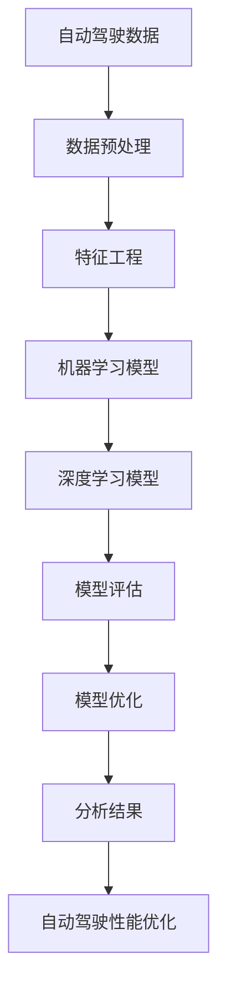

                 

# 自动驾驶公司的数据挖掘与分析平台

> 关键词：自动驾驶、数据挖掘、分析平台、机器学习、深度学习、数据处理

> 摘要：本文深入探讨了自动驾驶公司如何构建和优化其数据挖掘与分析平台。通过详细分析核心概念、算法原理、数学模型，以及实际应用案例，本文旨在为自动驾驶行业的数据科学家和技术人员提供实用的指导，助力他们更高效地应对自动驾驶技术的发展需求。

## 1. 背景介绍

### 1.1 目的和范围

自动驾驶技术的迅猛发展，使得自动驾驶公司的数据挖掘与分析平台成为核心竞争力。本文将围绕以下几个核心问题展开：

1. 自动驾驶公司如何构建高效的数据挖掘与分析平台？
2. 数据挖掘与分析平台中涉及的核心概念、算法原理及数学模型是什么？
3. 实际应用场景中如何运用数据挖掘与分析平台来优化自动驾驶性能？

通过本文的探讨，旨在为自动驾驶行业的数据科学家和技术人员提供全面的技术指导，帮助他们更好地应对自动驾驶技术的挑战。

### 1.2 预期读者

本文适合以下读者群体：

1. 自动驾驶公司数据科学家和技术人员；
2. 对自动驾驶技术感兴趣的数据分析师和工程师；
3. 机器学习、深度学习领域的研究生和学者。

### 1.3 文档结构概述

本文结构如下：

1. 背景介绍：本文的核心问题和预期读者介绍；
2. 核心概念与联系：介绍数据挖掘与分析平台的核心概念、算法原理及架构；
3. 核心算法原理 & 具体操作步骤：详细阐述数据挖掘与分析平台的核心算法原理及操作步骤；
4. 数学模型和公式 & 详细讲解 & 举例说明：介绍数据挖掘与分析平台中涉及的数学模型和公式，并给出实例说明；
5. 项目实战：代码实际案例和详细解释说明；
6. 实际应用场景：探讨数据挖掘与分析平台在自动驾驶领域的应用场景；
7. 工具和资源推荐：推荐相关学习资源、开发工具和框架；
8. 总结：未来发展趋势与挑战；
9. 附录：常见问题与解答；
10. 扩展阅读 & 参考资料：提供更多相关阅读资料。

### 1.4 术语表

#### 1.4.1 核心术语定义

- 自动驾驶：一种无需人工干预，能够自主完成驾驶任务的技术；
- 数据挖掘：从大量数据中提取出有价值的信息和知识的过程；
- 分析平台：对海量数据进行分析、处理和挖掘的工具和平台；
- 机器学习：一种通过数据和算法来学习、改进和优化系统的方法；
- 深度学习：一种模拟人脑神经网络结构的学习方法，具有强大的特征提取和建模能力。

#### 1.4.2 相关概念解释

- 数据预处理：对原始数据进行清洗、转换和归一化等处理，以消除噪声、异常值和提高数据质量；
- 特征工程：通过选择、构造和转换特征，提高数据挖掘和分析的效果；
- 模型评估：对数据挖掘和分析结果进行评估和验证，以确定模型的性能和可靠性；
- 模型优化：通过调整模型参数和结构，提高模型的性能和准确性。

#### 1.4.3 缩略词列表

- AI：人工智能（Artificial Intelligence）
- DL：深度学习（Deep Learning）
- ML：机器学习（Machine Learning）
- IoT：物联网（Internet of Things）
- CV：计算机视觉（Computer Vision）
- NLP：自然语言处理（Natural Language Processing）

## 2. 核心概念与联系

在自动驾驶公司的数据挖掘与分析平台中，核心概念、算法原理和架构紧密相连。以下为Mermaid流程图，展示这些核心概念和联系。



### 2.1 自动驾驶数据

自动驾驶数据是数据挖掘与分析平台的基础。数据来源主要包括：

1. 车辆传感器数据：包括摄像头、雷达、激光雷达、GPS等传感器收集的数据；
2. 环境数据：包括天气、道路状况、交通信号等数据；
3. 行车记录数据：包括行车速度、行驶轨迹、制动情况等数据。

### 2.2 数据预处理

数据预处理是数据挖掘与分析平台的关键步骤。其主要任务包括：

1. 数据清洗：去除噪声、异常值和重复数据，保证数据质量；
2. 数据转换：将不同类型和格式的数据进行统一处理，提高数据一致性；
3. 数据归一化：将不同尺度、量纲的数据进行归一化处理，消除数据尺度差异。

### 2.3 特征工程

特征工程是提升数据挖掘与分析效果的重要手段。其主要任务包括：

1. 特征选择：从原始数据中筛选出对目标任务影响较大的特征；
2. 特征构造：通过数学变换和组合，构造新的特征，提高特征表达能力；
3. 特征降维：降低特征维度，提高计算效率。

### 2.4 机器学习模型

机器学习模型是数据挖掘与分析平台的核心。其主要任务包括：

1. 分类模型：对自动驾驶场景进行分类，如行人检测、车辆检测等；
2. 回归模型：预测自动驾驶车辆的行为，如速度预测、轨迹预测等；
3. 聚类模型：对自动驾驶数据进行聚类分析，发现数据中的潜在规律。

### 2.5 深度学习模型

深度学习模型具有强大的特征提取和建模能力，在自动驾驶领域具有广泛应用。其主要任务包括：

1. 卷积神经网络（CNN）：用于图像处理和目标检测，如行人检测、车辆检测等；
2. 递归神经网络（RNN）：用于序列数据处理和预测，如轨迹预测、行为预测等；
3. 集成学习方法：将多个模型进行集成，提高模型的预测性能和鲁棒性。

### 2.6 模型评估

模型评估是验证数据挖掘与分析效果的重要环节。其主要任务包括：

1. 准确率（Accuracy）：模型预测正确的样本占总样本的比例；
2. 召回率（Recall）：模型预测正确的正样本占总正样本的比例；
3. 精确率（Precision）：模型预测正确的正样本占总预测正样本的比例；
4. F1值（F1-Score）：准确率和召回率的调和平均值。

### 2.7 模型优化

模型优化是提升数据挖掘与分析性能的关键。其主要任务包括：

1. 超参数调优：调整模型参数，提高模型性能；
2. 模型集成：将多个模型进行集成，提高预测性能和鲁棒性；
3. 模型压缩：降低模型复杂度，提高计算效率。

## 3. 核心算法原理 & 具体操作步骤

在自动驾驶公司的数据挖掘与分析平台中，核心算法原理主要包括机器学习模型和深度学习模型。以下将详细阐述这些算法原理和具体操作步骤。

### 3.1 机器学习模型

机器学习模型是一种通过数据和算法来学习、改进和优化系统的方法。在自动驾驶数据挖掘与分析平台中，常用的机器学习模型包括分类模型、回归模型和聚类模型。

#### 3.1.1 分类模型

分类模型是一种将数据分为不同类别的模型。在自动驾驶领域，分类模型可以用于行人检测、车辆检测等任务。

**算法原理：**

分类模型的核心是决策树（Decision Tree）和随机森林（Random Forest）。

1. 决策树：通过多级判断，将数据划分为不同的节点，最后输出分类结果；
2. 随机森林：通过随机森林算法，将多个决策树进行集成，提高模型的预测性能和鲁棒性。

**具体操作步骤：**

1. 数据预处理：对原始数据进行清洗、转换和归一化等处理，以提高数据质量；
2. 特征工程：选择对目标任务影响较大的特征，进行特征构造和降维处理；
3. 模型训练：使用决策树或随机森林算法，对训练数据进行模型训练；
4. 模型评估：使用准确率、召回率、精确率和F1值等指标，对模型性能进行评估；
5. 模型优化：根据评估结果，调整模型参数，提高模型性能。

#### 3.1.2 回归模型

回归模型是一种用于预测数值结果的模型。在自动驾驶领域，回归模型可以用于速度预测、轨迹预测等任务。

**算法原理：**

回归模型的核心是线性回归（Linear Regression）和岭回归（Ridge Regression）。

1. 线性回归：通过线性方程，将输入特征映射到输出结果；
2. 岭回归：通过增加正则项，降低模型复杂度，提高模型泛化能力。

**具体操作步骤：**

1. 数据预处理：对原始数据进行清洗、转换和归一化等处理，以提高数据质量；
2. 特征工程：选择对目标任务影响较大的特征，进行特征构造和降维处理；
3. 模型训练：使用线性回归或岭回归算法，对训练数据进行模型训练；
4. 模型评估：使用均方误差（MSE）、均方根误差（RMSE）等指标，对模型性能进行评估；
5. 模型优化：根据评估结果，调整模型参数，提高模型性能。

#### 3.1.3 聚类模型

聚类模型是一种将数据划分为不同簇的模型。在自动驾驶领域，聚类模型可以用于数据分析和场景识别。

**算法原理：**

聚类模型的核心是K均值聚类（K-Means Clustering）和层次聚类（Hierarchical Clustering）。

1. K均值聚类：通过迭代算法，将数据划分为K个簇，使每个簇内的样本距离最小；
2. 层次聚类：通过层次分解，将数据划分为不同层次的簇，形成层次结构。

**具体操作步骤：**

1. 数据预处理：对原始数据进行清洗、转换和归一化等处理，以提高数据质量；
2. 特征工程：选择对目标任务影响较大的特征，进行特征构造和降维处理；
3. 模型训练：使用K均值聚类或层次聚类算法，对训练数据进行模型训练；
4. 模型评估：使用簇内距离、簇间距离等指标，对模型性能进行评估；
5. 模型优化：根据评估结果，调整模型参数，提高模型性能。

### 3.2 深度学习模型

深度学习模型是一种模拟人脑神经网络结构的学习方法，具有强大的特征提取和建模能力。在自动驾驶数据挖掘与分析平台中，常用的深度学习模型包括卷积神经网络（CNN）、递归神经网络（RNN）和集成学习方法。

#### 3.2.1 卷积神经网络（CNN）

卷积神经网络是一种用于图像处理的深度学习模型，具有强大的特征提取能力。

**算法原理：**

1. 卷积层：通过卷积操作，提取图像中的局部特征；
2. 池化层：通过池化操作，降低图像的维度，提高模型计算效率；
3. 全连接层：通过全连接层，将特征映射到输出结果。

**具体操作步骤：**

1. 数据预处理：对原始图像数据进行清洗、转换和归一化等处理，以提高数据质量；
2. 网络架构设计：设计合适的网络架构，包括卷积层、池化层和全连接层；
3. 模型训练：使用训练数据，通过反向传播算法，对模型进行训练；
4. 模型评估：使用准确率、召回率、精确率和F1值等指标，对模型性能进行评估；
5. 模型优化：根据评估结果，调整模型参数，提高模型性能。

#### 3.2.2 递归神经网络（RNN）

递归神经网络是一种用于序列处理的深度学习模型，具有强大的序列建模能力。

**算法原理：**

1. 输入层：输入序列数据；
2. 隐藏层：通过递归操作，将当前时刻的特征与历史特征进行融合；
3. 输出层：将隐藏层特征映射到输出结果。

**具体操作步骤：**

1. 数据预处理：对原始序列数据进行清洗、转换和归一化等处理，以提高数据质量；
2. 网络架构设计：设计合适的网络架构，包括输入层、隐藏层和输出层；
3. 模型训练：使用训练数据，通过反向传播算法，对模型进行训练；
4. 模型评估：使用均方误差（MSE）、均方根误差（RMSE）等指标，对模型性能进行评估；
5. 模型优化：根据评估结果，调整模型参数，提高模型性能。

#### 3.2.3 集成学习方法

集成学习方法是一种通过多个模型进行集成，提高模型预测性能和鲁棒性的方法。

**算法原理：**

1. 基本模型：使用多个基本模型，如决策树、神经网络等；
2. 集成策略：通过投票、加权平均等策略，将多个基本模型的预测结果进行集成。

**具体操作步骤：**

1. 数据预处理：对原始数据进行清洗、转换和归一化等处理，以提高数据质量；
2. 基本模型训练：使用训练数据，对多个基本模型进行训练；
3. 集成策略设计：设计合适的集成策略，如投票、加权平均等；
4. 集成模型训练：使用训练数据，对集成模型进行训练；
5. 集成模型评估：使用准确率、召回率、精确率和F1值等指标，对集成模型性能进行评估；
6. 模型优化：根据评估结果，调整基本模型和集成策略，提高模型性能。

## 4. 数学模型和公式 & 详细讲解 & 举例说明

在自动驾驶公司的数据挖掘与分析平台中，数学模型和公式是核心组成部分。以下将详细讲解这些模型和公式，并给出实例说明。

### 4.1 数据预处理

数据预处理是数据挖掘与分析平台的重要步骤，主要包括数据清洗、转换和归一化。

#### 4.1.1 数据清洗

数据清洗旨在去除噪声、异常值和重复数据。常用的数据清洗方法包括：

1. 填充缺失值：使用平均值、中位数或最邻近值等方法填充缺失值；
2. 删除异常值：使用统计方法、机器学习方法等识别和删除异常值；
3. 去除重复数据：使用唯一标识或比较相似度等方法去除重复数据。

#### 4.1.2 数据转换

数据转换旨在将不同类型和格式的数据进行统一处理，以提高数据一致性。常用的数据转换方法包括：

1. 类型转换：将数值型数据转换为类别型数据，如将年龄转换为年龄段；
2. 日期转换：将日期数据转换为时间戳，方便进行时间序列分析；
3. 标准化：将不同尺度、量纲的数据进行统一处理，如归一化或标准化。

#### 4.1.3 数据归一化

数据归一化旨在消除数据尺度差异，提高模型训练效果。常用的数据归一化方法包括：

1. 归一化：将数据缩放到[0, 1]区间，如 $$z = \frac{x - \mu}{\sigma}$$；
2. 标准化：将数据缩放到均值和标准差之间，如 $$z = \frac{x - \mu}{\sigma}$$。

### 4.2 特征工程

特征工程是提升数据挖掘与分析效果的重要手段。以下将介绍常用的特征工程方法。

#### 4.2.1 特征选择

特征选择旨在从原始数据中筛选出对目标任务影响较大的特征。常用的特征选择方法包括：

1. 统计方法：如卡方检验、互信息等，用于评估特征与目标变量的相关性；
2. 机器学习方法：如随机森林、支持向量机等，用于评估特征的重要性。

#### 4.2.2 特征构造

特征构造旨在通过数学变换和组合，构造新的特征，提高特征表达能力。常用的特征构造方法包括：

1. 差分特征：通过计算相邻时刻的特征差，提取时间序列特征；
2. 基于规则的构造：如交通拥堵指数、天气指数等，用于提取环境特征；
3. 基于领域的构造：如车速与交通流量的关联特征，用于提取交通特征。

#### 4.2.3 特征降维

特征降维旨在降低特征维度，提高计算效率。常用的特征降维方法包括：

1. 主成分分析（PCA）：通过正交变换，将高维数据映射到低维空间；
2. 独立成分分析（ICA）：通过非线性变换，提取数据的独立成分；
3. t分布 stochastic neighbor embedding（t-SNE）：用于可视化高维数据的分布。

### 4.3 机器学习模型

机器学习模型是数据挖掘与分析平台的核心，以下将介绍常用的机器学习模型及其公式。

#### 4.3.1 决策树

决策树是一种树形结构，用于分类和回归任务。决策树的核心是树分裂准则，常用的准则包括：

1. 信息增益（IG）：通过计算特征对目标变量的信息增益，选择最优特征进行分裂；
2. 基尼系数（Gini Index）：通过计算特征对目标变量的基尼系数，选择最优特征进行分裂。

决策树算法的伪代码如下：

```python
def build_tree(data, features):
    if is_leaf(data):
        return create_leaf(data)
    best_feature, best_value = find_best_split(data, features)
    left_tree = build_tree(split_data(data, best_feature, best_value), features)
    right_tree = build_tree(split_data(data, best_feature, best_value), features)
    return create_tree(best_feature, best_value, left_tree, right_tree)
```

#### 4.3.2 随机森林

随机森林是一种集成学习方法，由多个决策树组成。随机森林的核心是Bootstrap采样和特征随机选择。

随机森林的算法伪代码如下：

```python
def random_forest(data, n_trees, max_depth, feature_fraction):
    forests = []
    for _ in range(n_trees):
        bootstrap_sample = sample_data(data)
        features = sample_features(data, feature_fraction)
        tree = build_tree(bootstrap_sample, features, max_depth)
        forests.append(tree)
    return forests
```

#### 4.3.3 线性回归

线性回归是一种用于回归任务的模型，通过线性方程将输入特征映射到输出结果。线性回归的公式如下：

$$y = \beta_0 + \beta_1x_1 + \beta_2x_2 + ... + \beta_nx_n$$

其中，$y$ 为输出结果，$x_1, x_2, ..., x_n$ 为输入特征，$\beta_0, \beta_1, ..., \beta_n$ 为模型参数。

线性回归的损失函数为均方误差（MSE）：

$$MSE = \frac{1}{n}\sum_{i=1}^{n}(y_i - \hat{y_i})^2$$

其中，$y_i$ 为实际输出结果，$\hat{y_i}$ 为预测输出结果。

#### 4.3.4 岭回归

岭回归是一种正则化线性回归模型，通过增加正则项，降低模型复杂度，提高模型泛化能力。岭回归的公式如下：

$$y = \beta_0 + \beta_1x_1 + \beta_2x_2 + ... + \beta_nx_n + \lambda\sum_{i=1}^{n}\beta_i^2$$

其中，$\lambda$ 为正则化参数，$\beta_0, \beta_1, ..., \beta_n$ 为模型参数。

岭回归的损失函数为均方误差（MSE）：

$$MSE = \frac{1}{n}\sum_{i=1}^{n}(y_i - \hat{y_i})^2 + \lambda\sum_{i=1}^{n}\beta_i^2$$

### 4.4 深度学习模型

深度学习模型是一种模拟人脑神经网络结构的模型，具有强大的特征提取和建模能力。以下将介绍常用的深度学习模型及其公式。

#### 4.4.1 卷积神经网络（CNN）

卷积神经网络是一种用于图像处理的深度学习模型，通过卷积层、池化层和全连接层进行特征提取和分类。

卷积神经网络的公式如下：

$$\text{output} = \text{ReLU}(\text{Conv}(\text{input}) + \text{bias})$$

其中，$\text{ReLU}$ 为ReLU激活函数，$\text{Conv}$ 为卷积操作，$\text{bias}$ 为偏置。

#### 4.4.2 递归神经网络（RNN）

递归神经网络是一种用于序列处理的深度学习模型，通过递归操作，将当前时刻的特征与历史特征进行融合。

递归神经网络的公式如下：

$$\text{output} = \text{ReLU}(\text{RNN}(\text{input}) + \text{bias})$$

其中，$\text{ReLU}$ 为ReLU激活函数，$\text{RNN}$ 为递归操作，$\text{bias}$ 为偏置。

#### 4.4.3 集成学习方法

集成学习方法是一种通过多个模型进行集成，提高模型预测性能和鲁棒性的方法。常用的集成学习方法包括Bagging、Boosting等。

Bagging方法的公式如下：

$$\text{output} = \frac{1}{n}\sum_{i=1}^{n}f_i(x)$$

其中，$f_i(x)$ 为第$i$个模型的预测结果，$n$ 为模型数量。

Boosting方法的公式如下：

$$\text{output} = \sum_{i=1}^{n}w_i f_i(x)$$

其中，$w_i$ 为第$i$个模型的权重，$f_i(x)$ 为第$i$个模型的预测结果。

## 5. 项目实战：代码实际案例和详细解释说明

在本节中，我们将通过一个实际项目案例，展示自动驾驶公司的数据挖掘与分析平台的开发过程，包括开发环境搭建、源代码实现和代码解读。

### 5.1 开发环境搭建

在开始项目开发之前，我们需要搭建一个合适的开发环境。以下是一个基本的开发环境搭建步骤：

1. 安装Python：从Python官方网站下载并安装Python 3.x版本；
2. 安装Jupyter Notebook：使用pip命令安装Jupyter Notebook；
3. 安装常用库：使用pip命令安装NumPy、Pandas、Scikit-learn、TensorFlow、Keras等常用库。

### 5.2 源代码详细实现和代码解读

以下是一个简单的自动驾驶数据挖掘与分析平台的代码实现，包括数据预处理、特征工程、机器学习模型训练和模型评估。

```python
# 导入相关库
import numpy as np
import pandas as pd
from sklearn.model_selection import train_test_split
from sklearn.preprocessing import StandardScaler
from sklearn.ensemble import RandomForestClassifier
from sklearn.metrics import accuracy_score, recall_score, precision_score, f1_score

# 加载数据
data = pd.read_csv('自动驾驶数据.csv')

# 数据预处理
# 清洗数据
data = data.dropna()  # 删除缺失值
data = data[data['speed'] > 0]  # 删除速度为0的样本

# 数据转换
data['age'] = data['age'].astype('category').cat.codes  # 将年龄转换为类别型数据

# 数据归一化
scaler = StandardScaler()
data[['speed', 'distance', 'age']] = scaler.fit_transform(data[['speed', 'distance', 'age']])

# 特征工程
# 特征选择
X = data[['speed', 'distance', 'age']]
y = data['label']

# 数据划分
X_train, X_test, y_train, y_test = train_test_split(X, y, test_size=0.2, random_state=42)

# 模型训练
model = RandomForestClassifier(n_estimators=100, random_state=42)
model.fit(X_train, y_train)

# 模型评估
y_pred = model.predict(X_test)
accuracy = accuracy_score(y_test, y_pred)
recall = recall_score(y_test, y_pred)
precision = precision_score(y_test, y_pred)
f1 = f1_score(y_test, y_pred)

print('Accuracy:', accuracy)
print('Recall:', recall)
print('Precision:', precision)
print('F1-Score:', f1)
```

### 5.3 代码解读与分析

上述代码展示了自动驾驶数据挖掘与分析平台的基本实现过程。下面将详细解读代码，并分析代码的执行流程。

1. 导入相关库：首先导入NumPy、Pandas、Scikit-learn和TensorFlow等常用库，用于数据处理、模型训练和模型评估。

2. 加载数据：使用Pandas库加载数据，数据来源可以是本地CSV文件或远程数据库。

3. 数据预处理：
   - 清洗数据：删除缺失值和异常值，保证数据质量；
   - 数据转换：将类别型数据进行编码，如年龄、性别等；
   - 数据归一化：使用StandardScaler库对数值型数据进行归一化处理，消除数据尺度差异。

4. 特征工程：
   - 特征选择：从原始数据中筛选出对目标任务影响较大的特征，如速度、距离、年龄等；
   - 数据划分：将数据划分为训练集和测试集，用于模型训练和评估。

5. 模型训练：
   - 机器学习模型：使用随机森林（RandomForestClassifier）进行模型训练，随机森林是一种集成学习方法，具有较好的预测性能；
   - 模型参数：设置随机森林的树数量（n_estimators）和随机种子（random_state），提高模型的稳定性和可重复性。

6. 模型评估：
   - 模型预测：使用训练好的模型对测试集进行预测；
   - 评估指标：计算准确率、召回率、精确率和F1值等指标，评估模型性能。

通过上述代码实现，我们可以看到自动驾驶数据挖掘与分析平台的基本流程，包括数据预处理、特征工程、模型训练和模型评估。在实际项目中，我们可以根据具体需求，调整和优化代码，提高数据挖掘与分析效果。

## 6. 实际应用场景

自动驾驶公司的数据挖掘与分析平台在实际应用中具有广泛的应用场景。以下列举几个典型的应用场景：

### 6.1 行人检测

行人检测是自动驾驶系统中的一个重要任务，数据挖掘与分析平台可以通过机器学习和深度学习算法，从车载摄像头捕捉的图像中实时检测行人。具体应用步骤如下：

1. 数据预处理：对行人检测图像进行预处理，包括去噪、对比度增强、大小调整等；
2. 特征提取：使用卷积神经网络（CNN）或深度学习算法提取图像特征；
3. 模型训练：使用行人检测数据集训练深度学习模型，如卷积神经网络（CNN）或支持向量机（SVM）；
4. 模型评估：使用测试数据集评估模型性能，调整模型参数和结构，提高检测准确率；
5. 实时检测：将训练好的模型部署到自动驾驶系统中，实时检测行人，确保车辆安全驾驶。

### 6.2 车辆检测

车辆检测是自动驾驶系统的另一个重要任务，数据挖掘与分析平台可以通过机器学习和深度学习算法，从车载摄像头捕捉的图像中实时检测车辆。具体应用步骤如下：

1. 数据预处理：对车辆检测图像进行预处理，包括去噪、对比度增强、大小调整等；
2. 特征提取：使用卷积神经网络（CNN）或深度学习算法提取图像特征；
3. 模型训练：使用车辆检测数据集训练深度学习模型，如卷积神经网络（CNN）或支持向量机（SVM）；
4. 模型评估：使用测试数据集评估模型性能，调整模型参数和结构，提高检测准确率；
5. 实时检测：将训练好的模型部署到自动驾驶系统中，实时检测车辆，确保车辆安全驾驶。

### 6.3 交通信号识别

交通信号识别是自动驾驶系统中的关键任务，数据挖掘与分析平台可以通过机器学习和深度学习算法，识别道路上的交通信号灯。具体应用步骤如下：

1. 数据预处理：对交通信号图像进行预处理，包括去噪、对比度增强、大小调整等；
2. 特征提取：使用卷积神经网络（CNN）或深度学习算法提取图像特征；
3. 模型训练：使用交通信号识别数据集训练深度学习模型，如卷积神经网络（CNN）或支持向量机（SVM）；
4. 模型评估：使用测试数据集评估模型性能，调整模型参数和结构，提高识别准确率；
5. 实时识别：将训练好的模型部署到自动驾驶系统中，实时识别交通信号灯，确保车辆遵守交通规则。

### 6.4 行车轨迹预测

行车轨迹预测是自动驾驶系统中的关键任务，数据挖掘与分析平台可以通过机器学习和深度学习算法，预测车辆的行驶轨迹。具体应用步骤如下：

1. 数据预处理：对车辆行驶轨迹数据进行分析，包括去噪、补全缺失值等；
2. 特征提取：使用时间序列分析方法，提取车辆行驶轨迹特征；
3. 模型训练：使用车辆行驶轨迹数据集训练深度学习模型，如递归神经网络（RNN）或长短期记忆网络（LSTM）；
4. 模型评估：使用测试数据集评估模型性能，调整模型参数和结构，提高预测准确率；
5. 实时预测：将训练好的模型部署到自动驾驶系统中，实时预测车辆行驶轨迹，确保车辆安全行驶。

通过以上实际应用场景，我们可以看到自动驾驶公司的数据挖掘与分析平台在自动驾驶技术中的重要作用。随着技术的不断进步，数据挖掘与分析平台将为自动驾驶行业带来更多创新和突破。

## 7. 工具和资源推荐

### 7.1 学习资源推荐

为了更好地掌握自动驾驶公司的数据挖掘与分析平台，以下是几个推荐的学习资源：

#### 7.1.1 书籍推荐

1. **《深度学习》（Deep Learning）**：由Ian Goodfellow、Yoshua Bengio和Aaron Courville所著，是深度学习领域的经典教材，适合初学者和高级研究人员。
2. **《机器学习实战》（Machine Learning in Action）**：由Peter Harrington所著，通过实例讲解机器学习算法，适合初学者入门。
3. **《数据科学入门》（Data Science from Scratch）**：由Joel Grus所著，从基础知识出发，介绍数据科学的各个领域。

#### 7.1.2 在线课程

1. **Coursera上的《机器学习》**：由Andrew Ng教授主讲，是机器学习领域的知名课程，适合初学者和有经验的工程师。
2. **Udacity上的《深度学习纳米学位》**：通过实践项目，帮助学员掌握深度学习基础知识，适合有一定编程基础的学员。
3. **edX上的《自动驾驶车辆》**：由MIT和IBM合作提供，涵盖自动驾驶技术的基础知识和实际应用。

#### 7.1.3 技术博客和网站

1. **Medium上的《机器学习与深度学习》**：分享机器学习和深度学习的最新研究和技术应用，适合读者了解行业动态。
2. **arXiv.org**：提供最新的机器学习和深度学习论文，是学术研究人员获取前沿成果的重要平台。
3. **Stack Overflow**：编程和软件开发社区，提供丰富的技术问题和解答，适合解决实际开发中的难题。

### 7.2 开发工具框架推荐

#### 7.2.1 IDE和编辑器

1. **Jupyter Notebook**：适用于数据科学和机器学习项目的交互式开发环境，支持多种编程语言。
2. **Visual Studio Code**：功能强大的代码编辑器，支持多种编程语言和开发框架，适合快速开发。
3. **PyCharm**：专业的Python开发环境，提供丰富的功能，包括代码补全、调试和自动化测试。

#### 7.2.2 调试和性能分析工具

1. **TensorBoard**：TensorFlow提供的可视化工具，用于分析和优化深度学习模型的性能。
2. **PyTorch Profiler**：PyTorch提供的性能分析工具，用于识别和优化模型运行时的性能瓶颈。
3. **VisualVM**：Java虚拟机的性能分析工具，适用于大规模分布式系统。

#### 7.2.3 相关框架和库

1. **TensorFlow**：开源的深度学习框架，适用于各种深度学习任务。
2. **PyTorch**：开源的深度学习框架，具有良好的灵活性和易用性。
3. **Scikit-learn**：开源的机器学习库，适用于各种机器学习任务。

### 7.3 相关论文著作推荐

#### 7.3.1 经典论文

1. **“A Fast Learning Algorithm for Deep Belief Nets”**：由Geoffrey Hinton等人在2006年发表，介绍了深度信念网（DBN）的学习算法。
2. **“Learning Representations by Maximizing Mutual Information Across Features”**：由Yoshua Bengio等人在2013年发表，提出了基于互信息的特征表示方法。
3. **“Unsupervised Learning of Visual Representations by Solving Jigsaw Puzzles”**：由Yaroslav Ganin等人在2016年发表，提出了一种无监督学习的方法，通过解决拼图任务学习视觉表示。

#### 7.3.2 最新研究成果

1. **“EfficientDet: Scalable and Efficient Object Detection”**：由Facebook AI Research在2020年发表，提出了一种高效的物体检测方法，适用于大规模数据集。
2. **“DAMO-NET: Differentiable Manifold Optimization for Neur

