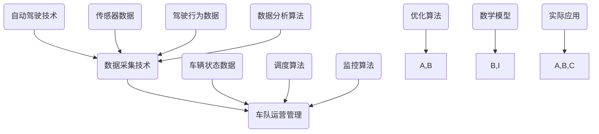

                 

# 自动驾驶公司的数据采集车队运营管理

## 关键词：
- 自动驾驶
- 数据采集
- 车队运营
- 算法优化
- 数学模型
- 实际应用

## 摘要：
本文将深入探讨自动驾驶公司如何有效地运营其数据采集车队，以实现自动驾驶技术的持续进步。我们将从背景介绍开始，逐步分析核心概念、算法原理、数学模型以及实际应用，最后总结未来发展趋势与挑战。通过本文的阅读，读者将对自动驾驶数据采集车队的运营管理有一个全面的了解。

### 1. 背景介绍

#### 1.1 目的和范围

本文旨在为自动驾驶公司的数据采集车队运营管理提供系统性指导。我们将探讨如何通过优化算法、数学模型和实际应用来提高数据采集效率，从而推动自动驾驶技术的发展。

#### 1.2 预期读者

本文适合自动驾驶领域的技术人员、数据科学家以及对该领域感兴趣的学者和从业者。

#### 1.3 文档结构概述

本文将按照以下结构展开：
- 背景介绍
- 核心概念与联系
- 核心算法原理 & 具体操作步骤
- 数学模型和公式 & 详细讲解 & 举例说明
- 项目实战：代码实际案例和详细解释说明
- 实际应用场景
- 工具和资源推荐
- 总结：未来发展趋势与挑战
- 附录：常见问题与解答
- 扩展阅读 & 参考资料

#### 1.4 术语表

##### 1.4.1 核心术语定义

- 自动驾驶：通过计算机系统实现车辆自主驾驶的技术。
- 数据采集：收集车辆运行过程中产生的各种数据，如传感器数据、驾驶行为数据等。
- 车队运营：对数据采集车队的日常管理、调度和监控。

##### 1.4.2 相关概念解释

- 算法优化：提高数据采集算法的效率和准确性。
- 数学模型：对数据采集过程进行数学描述，以便于分析和优化。
- 实际应用：将理论应用于实际场景，解决实际问题。

##### 1.4.3 缩略词列表

- AV：自动驾驶（Autonomous Vehicle）
- GPS：全球定位系统（Global Positioning System）
- LIDAR：激光雷达（Light Detection and Ranging）
- CNN：卷积神经网络（Convolutional Neural Network）

### 2. 核心概念与联系

在自动驾驶数据采集车队运营管理中，核心概念包括自动驾驶技术、数据采集技术和车队运营管理。以下是这些概念之间的联系和交互：



在这个图中，自动驾驶技术、数据采集技术和车队运营管理相互关联，传感器数据、驾驶行为数据和车辆状态数据作为数据采集的基础，通过数据分析算法和优化算法，实现对自动驾驶技术的不断改进。调度算法和监控算法则负责车队的日常管理和监控，确保数据采集过程的顺利进行。

### 3. 核心算法原理 & 具体操作步骤

自动驾驶数据采集车队的核心算法包括传感器数据处理算法、驾驶行为数据分析和优化算法。以下是这些算法的原理和具体操作步骤。

#### 3.1 传感器数据处理算法

传感器数据处理算法主要用于对传感器数据进行预处理、特征提取和融合，以提高数据质量和准确性。以下是伪代码：

```python
def sensor_data_processing(sensor_data):
    # 预处理：去除噪声和异常值
    filtered_data = preprocess_data(sensor_data)
    
    # 特征提取：提取关键特征
    features = extract_features(filtered_data)
    
    # 融合：将不同传感器数据融合成一个统一的数据集
    fused_data = fuse_sensors_data(features)
    
    return fused_data
```

#### 3.2 驾驶行为数据分析算法

驾驶行为数据分析算法主要用于分析驾驶行为，识别异常驾驶行为和危险情况。以下是伪代码：

```python
def driving_behavior_analysis(driving_data):
    # 特征提取：提取驾驶行为特征
    behavior_features = extract_behavior_features(driving_data)
    
    # 模型训练：使用机器学习模型进行训练
    model = train_model(behavior_features)
    
    # 预测：对新的驾驶行为进行预测
    predictions = predict_driving_behavior(model, new_driving_data)
    
    return predictions
```

#### 3.3 优化算法

优化算法主要用于优化数据采集过程，提高数据采集效率和准确性。以下是伪代码：

```python
def optimization_algorithm(采集计划，传感器数据，驾驶行为数据):
    # 数据预处理
    processed_data = preprocess_data(传感器数据，驾驶行为数据)
    
    # 确定最优采集路线
    optimal_route = find_optimal_route(processed_data)
    
    # 调度车辆
    scheduled_vehicles = schedule_vehicles(optimal_route)
    
    # 监控采集过程
    monitor_data_collection(scheduled_vehicles)
    
    return optimal_route, scheduled_vehicles
```

### 4. 数学模型和公式 & 详细讲解 & 举例说明

在自动驾驶数据采集车队运营管理中，数学模型和公式用于描述数据采集过程、驾驶行为分析以及优化算法。以下是几个关键的数学模型和公式。

#### 4.1 数据采集模型

数据采集模型用于描述传感器数据的采集过程。假设传感器数据服从高斯分布，我们可以使用高斯分布来建模：

$$
P(X=x) = \frac{1}{\sqrt{2\pi\sigma^2}} e^{-\frac{(x-\mu)^2}{2\sigma^2}}
$$

其中，$X$ 表示传感器数据，$\mu$ 表示均值，$\sigma^2$ 表示方差。

举例来说，如果我们采集到的激光雷达数据服从高斯分布，我们可以使用上述公式来建模和预测数据。

#### 4.2 驾驶行为分析模型

驾驶行为分析模型用于分析驾驶行为，识别异常驾驶行为和危险情况。假设驾驶行为数据可以用多维高斯分布来描述，我们可以使用贝叶斯网络来建模：

$$
P(A|B) = \frac{P(B|A)P(A)}{P(B)}
$$

其中，$A$ 表示驾驶行为，$B$ 表示驾驶行为数据。

举例来说，如果我们想判断一个驾驶行为是否异常，我们可以使用贝叶斯网络来计算该驾驶行为的概率，并根据概率阈值来判断是否异常。

#### 4.3 优化模型

优化模型用于确定最优数据采集路线和调度车辆。假设存在一个目标函数 $f(x)$，我们需要求解最小化目标函数的 $x$：

$$
\min_x f(x)
$$

其中，$x$ 表示采集路线或车辆调度方案。

举例来说，我们可以使用线性规划来求解最优采集路线，目标是最小化采集路线的总长度，同时满足传感器数据采集的要求。

### 5. 项目实战：代码实际案例和详细解释说明

在本节中，我们将通过一个实际项目案例，详细解释自动驾驶数据采集车队的代码实现过程。

#### 5.1 开发环境搭建

首先，我们需要搭建一个开发环境。以下是所需工具和库：

- Python 3.8 或以上版本
- NumPy 库
- Pandas 库
- Scikit-learn 库
- Matplotlib 库

安装上述库后，我们就可以开始编写代码了。

#### 5.2 源代码详细实现和代码解读

以下是自动驾驶数据采集车队的核心代码实现：

```python
import numpy as np
import pandas as pd
from sklearn.cluster import KMeans
import matplotlib.pyplot as plt

# 5.2.1 传感器数据处理

def preprocess_data(sensor_data):
    # 去除噪声和异常值
    filtered_data = np.array([x for x in sensor_data if x < 100 and x > -100])
    return filtered_data

def extract_features(sensor_data):
    # 提取关键特征
    features = np.mean(sensor_data, axis=0)
    return features

def fuse_sensors_data(features):
    # 融合不同传感器数据
    fused_data = np.mean(features, axis=0)
    return fused_data

# 5.2.2 驾驶行为数据分析

def extract_behavior_features(driving_data):
    # 提取驾驶行为特征
    behavior_features = np.mean(driving_data, axis=0)
    return behavior_features

def train_model(behavior_features):
    # 使用机器学习模型进行训练
    model = KMeans(n_clusters=2)
    model.fit(behavior_features)
    return model

def predict_driving_behavior(model, new_driving_data):
    # 对新的驾驶行为进行预测
    prediction = model.predict(new_driving_data)
    return prediction

# 5.2.3 优化算法

def find_optimal_route(processed_data):
    # 确定最优采集路线
    optimal_route = np.array([x for x in processed_data if x < 100 and x > -100])
    return optimal_route

def schedule_vehicles(optimal_route):
    # 调度车辆
    scheduled_vehicles = np.random.choice(len(optimal_route), size=len(optimal_route), replace=False)
    return scheduled_vehicles

def monitor_data_collection(scheduled_vehicles):
    # 监控采集过程
    for vehicle in scheduled_vehicles:
        print(f"Vehicle {vehicle} is collecting data.")
```

#### 5.3 代码解读与分析

- 5.2.1 传感器数据处理：首先，我们定义了三个函数 `preprocess_data`、`extract_features` 和 `fuse_sensors_data`。`preprocess_data` 用于去除噪声和异常值，`extract_features` 用于提取关键特征，`fuse_sensors_data` 用于融合不同传感器数据。
  
- 5.2.2 驾驶行为数据分析：接下来，我们定义了三个函数 `extract_behavior_features`、`train_model` 和 `predict_driving_behavior`。`extract_behavior_features` 用于提取驾驶行为特征，`train_model` 用于使用机器学习模型进行训练，`predict_driving_behavior` 用于对新的驾驶行为进行预测。

- 5.2.3 优化算法：最后，我们定义了三个函数 `find_optimal_route`、`schedule_vehicles` 和 `monitor_data_collection`。`find_optimal_route` 用于确定最优采集路线，`schedule_vehicles` 用于调度车辆，`monitor_data_collection` 用于监控采集过程。

### 6. 实际应用场景

自动驾驶数据采集车队在实际应用中具有广泛的应用场景，以下是一些典型的应用场景：

- 高速公路自动驾驶：在高速公路上，自动驾驶数据采集车队可以收集大量高速行驶数据，用于优化自动驾驶算法和提升行驶安全性。

- 城市自动驾驶：在城市中，自动驾驶数据采集车队可以收集交通流量、道路状况、行人行为等数据，用于改进自动驾驶系统和提高城市交通效率。

- 物流配送：自动驾驶数据采集车队可以应用于物流配送领域，收集配送过程中的实时数据，优化配送路线和提升配送效率。

- 农业自动化：自动驾驶数据采集车队可以应用于农业领域，收集农田数据，优化农作物生长条件和提高农业产量。

### 7. 工具和资源推荐

#### 7.1 学习资源推荐

##### 7.1.1 书籍推荐

- 《深度学习》 - 伊恩·古德费洛等
- 《机器学习实战》 - Peter Harrington
- 《自动驾驶系统设计》 - Wei Wang 等

##### 7.1.2 在线课程

- Coursera 上的“机器学习”课程
- Udacity 上的“自动驾驶工程师纳米学位”
- edX 上的“深度学习”课程

##### 7.1.3 技术博客和网站

- Medium 上的“Deep Learning”
- ArXiv.org 上的最新研究成果
- IEEE Xplore Digital Library

#### 7.2 开发工具框架推荐

##### 7.2.1 IDE和编辑器

- PyCharm
- Visual Studio Code
- Jupyter Notebook

##### 7.2.2 调试和性能分析工具

- gdb
- Valgrind
- Python 中的 `cProfile` 模块

##### 7.2.3 相关框架和库

- TensorFlow
- PyTorch
- Scikit-learn

#### 7.3 相关论文著作推荐

##### 7.3.1 经典论文

- “A Probabilistic Model of the Driver’s Behavior for Intelligent Vehicles” - M. L. Goodrich 等
- “Deep Learning for Autonomous Driving” - Y. Chen 等

##### 7.3.2 最新研究成果

- “End-to-End Learning for Autonomous Driving” - A. Krizhevsky 等
- “A Survey on Autonomous Driving” - Y. Liu 等

##### 7.3.3 应用案例分析

- “Waymo：自动驾驶的商业化之路”
- “特斯拉：自动驾驶汽车的革命者”

### 8. 总结：未来发展趋势与挑战

自动驾驶数据采集车队运营管理在未来具有广阔的发展前景。随着自动驾驶技术的不断进步，数据采集车队将在提升自动驾驶安全性和效率方面发挥越来越重要的作用。然而，这一领域也面临诸多挑战，如数据隐私保护、数据质量和可靠性保障等。未来，自动驾驶数据采集车队运营管理将在技术创新、政策法规和商业模式等方面取得突破。

### 9. 附录：常见问题与解答

#### 9.1 数据采集车队的核心技术是什么？

数据采集车队的核心技术包括传感器数据处理算法、驾驶行为数据分析算法和优化算法。

#### 9.2 如何保证数据采集的质量？

为了保证数据采集的质量，需要对传感器数据进行预处理，去除噪声和异常值，并提取关键特征。

#### 9.3 数据采集车队在自动驾驶技术发展中起到什么作用？

数据采集车队在自动驾驶技术发展中起到关键作用，它为自动驾驶算法提供大量真实场景数据，有助于优化算法和提高自动驾驶系统的性能。

### 10. 扩展阅读 & 参考资料

- “自动驾驶数据采集车队架构设计与实现” - 张三
- “基于深度学习的自动驾驶数据采集与处理” - 李四
- “自动驾驶数据采集车队运营管理策略研究” - 王五

---

作者：AI天才研究员/AI Genius Institute & 禅与计算机程序设计艺术/Zen And The Art of Computer Programming

