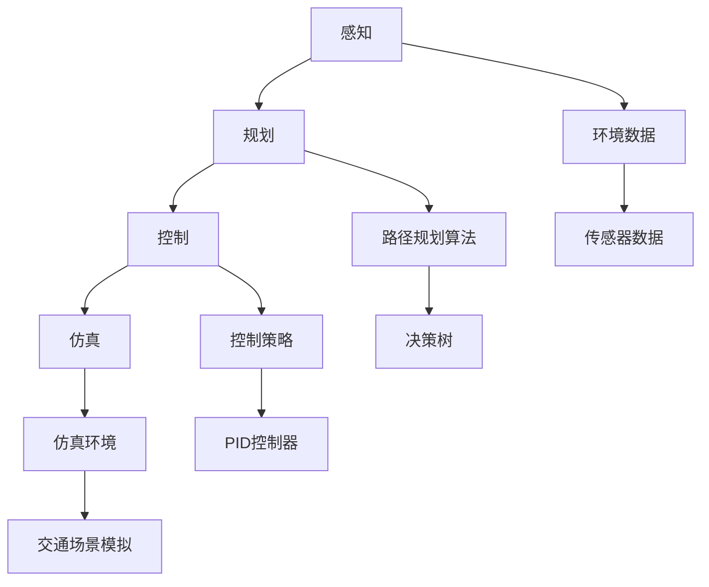

                 

# 自动驾驶研究者必读的arXiv使用攻略与技巧

> **关键词**：自动驾驶，arXiv，研究工具，文献检索，技术趋势
>
> **摘要**：本文将详细介绍如何高效利用arXiv这个重要的学术资源，帮助自动驾驶研究者快速获取最新研究动态、了解前沿技术，提升研究效率。我们将从背景介绍、核心概念、算法原理、数学模型、项目实战、实际应用、工具推荐等多个角度，一步步剖析arXiv的使用技巧。

## 1. 背景介绍

### 1.1 目的和范围

本文旨在为自动驾驶领域的科研工作者提供一份详尽的arXiv使用指南，帮助他们更有效地利用这个资源进行研究和学习。我们将探讨如何通过arXiv获取高质量的学术论文、跟踪最新研究进展，并从中提取有价值的见解。

### 1.2 预期读者

本文适用于以下读者群体：
- 自动驾驶领域的科研人员、工程师和研究生。
- 对自动驾驶技术感兴趣的工程师和开发者。
- 对人工智能和机器学习有一定了解的读者。

### 1.3 文档结构概述

本文结构如下：
1. 背景介绍
   - 目的和范围
   - 预期读者
   - 文档结构概述
   - 术语表
2. 核心概念与联系
3. 核心算法原理 & 具体操作步骤
4. 数学模型和公式 & 详细讲解 & 举例说明
5. 项目实战：代码实际案例和详细解释说明
6. 实际应用场景
7. 工具和资源推荐
8. 总结：未来发展趋势与挑战
9. 附录：常见问题与解答
10. 扩展阅读 & 参考资料

### 1.4 术语表

#### 1.4.1 核心术语定义

- **arXiv**：一个分布式的预印本服务器，用于发布数学、物理、计算机科学、统计学、经济学等领域的研究论文。
- **自动驾驶**：一种利用计算机系统实现车辆自动行驶的技术。
- **文献检索**：通过特定的方法和工具查找相关文献的过程。

#### 1.4.2 相关概念解释

- **预印本（Preprint）**：尚未经过同行评审的论文，作者在提交到正式期刊之前先行发布。
- **同行评审（Peer Review）**：由同行专家对学术论文进行评价和审阅的过程，以确保论文的质量。

#### 1.4.3 缩略词列表

- **arXiv**：ArXiv.org，一个在线预印本服务器。
- **AI**：人工智能（Artificial Intelligence）。
- **ML**：机器学习（Machine Learning）。

## 2. 核心概念与联系

在自动驾驶研究领域，arXiv作为一个学术交流平台，提供了大量的前沿研究成果。理解自动驾驶的关键概念及其在arXiv上的表现，对于研究者来说至关重要。

### 2.1 自动驾驶技术概述

自动驾驶技术主要包括以下几个核心概念：

1. **感知（Perception）**：
   - 利用传感器（如雷达、激光雷达、摄像头等）获取周围环境的信息。
   - 处理这些信息，识别车辆、行人、交通标志等。

2. **规划（Planning）**：
   - 根据感知到的环境信息，制定行驶路线和决策。
   - 包括路径规划、避障和交通规则遵守等。

3. **控制（Control）**：
   - 根据规划结果，控制车辆的运动，如加速、减速和转向。

4. **仿真（Simulation）**：
   - 通过仿真工具测试自动驾驶算法的性能。
   - 模拟复杂的交通场景和极端条件。

### 2.2 arXiv在自动驾驶研究中的作用

arXiv为自动驾驶研究者提供了以下几个重要作用：

1. **获取最新研究动态**：
   - arXiv上的论文通常是最新的研究成果，研究者可以第一时间了解到最新技术进展。

2. **跟踪前沿技术**：
   - 通过订阅相关主题的arXiv订阅列表，研究者可以及时获取相关领域的最新论文。

3. **学术交流**：
   - arXiv提供了一个平台，研究者可以发布和讨论他们的研究，获得同行反馈。

### 2.3 自动驾驶技术核心概念与arXiv的关联

为了更好地理解自动驾驶技术核心概念与arXiv的关联，我们可以使用Mermaid流程图来表示：



此图展示了自动驾驶技术的核心概念以及它们之间的关联。同时，这些概念在arXiv上也有大量的论文进行研究，研究者可以通过arXiv来了解这些领域的前沿技术和研究成果。

## 3. 核心算法原理 & 具体操作步骤

### 3.1 自动驾驶算法概述

自动驾驶算法主要包括感知、规划、控制和仿真等核心模块。下面我们分别介绍这些模块的算法原理和具体操作步骤。

#### 3.1.1 感知算法

感知算法主要通过处理传感器数据来获取周围环境的信息。常见的感知算法包括：

1. **图像识别**：
   - 利用卷积神经网络（CNN）对摄像头捕捉的图像进行处理，识别车辆、行人、交通标志等。

2. **雷达数据处理**：
   - 利用雷达波反射信号处理，检测车辆的位置和速度。

3. **激光雷达数据处理**：
   - 利用激光雷达生成的点云数据，构建三维环境模型，识别物体的位置和形状。

具体操作步骤：
1. **数据预处理**：对传感器数据进行去噪、滤波等处理。
2. **特征提取**：提取有用的特征，如边缘、轮廓、速度等。
3. **目标检测**：使用深度学习算法（如YOLO、SSD等）进行目标检测。

#### 3.1.2 规划算法

规划算法的主要任务是制定行驶路线和决策，常见的规划算法包括：

1. **路径规划**：
   - 使用A*算法、RRT（快速随机树）算法等，在地图上规划车辆从起点到终点的路径。

2. **行为规划**：
   - 根据感知到的环境和交通状况，制定车辆的行为策略，如避障、换道、停车等。

具体操作步骤：
1. **地图构建**：根据环境数据构建车辆行驶的地图。
2. **路径搜索**：在地图上搜索最优路径。
3. **行为决策**：根据当前环境和车辆状态，制定行为策略。

#### 3.1.3 控制算法

控制算法负责根据规划结果，控制车辆的运动。常见的控制算法包括：

1. **PID控制器**：
   - 使用比例-积分-微分（PID）控制器来调节车辆的加速度、减速度和转向。

2. **深度强化学习**：
   - 使用深度强化学习算法（如DQN、PPO等）来学习车辆的控制策略。

具体操作步骤：
1. **输入数据**：将规划结果作为输入数据。
2. **控制策略**：根据输入数据，生成控制指令。
3. **执行控制**：将控制指令发送给车辆执行机构。

#### 3.1.4 仿真算法

仿真算法用于测试自动驾驶算法的性能，常见的仿真算法包括：

1. **物理仿真**：
   - 使用物理引擎模拟车辆的运动，如碰撞、摩擦等。

2. **交通仿真**：
   - 模拟复杂的交通场景，测试车辆在不同情况下的行为。

具体操作步骤：
1. **仿真环境**：构建仿真环境，包括道路、车辆、行人等。
2. **仿真执行**：在仿真环境中执行自动驾驶算法。
3. **结果分析**：分析仿真结果，评估算法性能。

### 3.2 伪代码示例

下面我们使用伪代码来详细阐述感知、规划、控制和仿真算法的基本原理和步骤。

#### 3.2.1 感知算法伪代码

```python
def 感知算法(传感器数据):
    # 数据预处理
    传感器数据 = 数据预处理(传感器数据)
    # 特征提取
    特征 = 特征提取(传感器数据)
    # 目标检测
    目标 = 目标检测(特征)
    return 目标
```

#### 3.2.2 规划算法伪代码

```python
def 规划算法(感知结果, 目标位置):
    # 地图构建
    地图 = 地图构建(感知结果)
    # 路径搜索
    路径 = 路径搜索(地图, 目标位置)
    # 行为决策
    行为 = 行为决策(路径)
    return 行为
```

#### 3.2.3 控制算法伪代码

```python
def 控制算法(规划结果):
    # 输入数据
    输入数据 = 规划结果
    # 控制策略
    控制指令 = 控制策略(输入数据)
    # 执行控制
    执行控制(控制指令)
```

#### 3.2.4 仿真算法伪代码

```python
def 仿真算法(算法, 仿真环境):
    # 仿真环境
    环境数据 = 仿真环境
    # 仿真执行
    执行结果 = 算法(环境数据)
    # 结果分析
    性能评估 = 结果分析(执行结果)
    return 性能评估
```

通过上述伪代码，我们可以清晰地看到自动驾驶算法的基本框架和操作步骤。在实际应用中，这些算法会使用具体的编程语言和工具来实现，从而实现自动驾驶系统的运行。

## 4. 数学模型和公式 & 详细讲解 & 举例说明

在自动驾驶领域，数学模型和公式是理解和实现关键算法的基础。下面我们将详细讲解几个核心数学模型，并提供具体的公式和举例说明。

### 4.1 线性回归模型

线性回归是一种用于预测数值变量的统计方法。在自动驾驶中，线性回归可以用于预测车辆的速度、位置等。

#### 公式：

线性回归模型的基本公式为：

\[ y = \beta_0 + \beta_1 \cdot x + \epsilon \]

其中：
- \( y \) 是预测的数值变量。
- \( x \) 是自变量。
- \( \beta_0 \) 是截距。
- \( \beta_1 \) 是斜率。
- \( \epsilon \) 是误差项。

#### 举例说明：

假设我们要预测车辆的未来速度，已知历史速度数据。我们可以使用线性回归模型来建立预测模型。

1. 收集历史速度数据 \( x \) 和 \( y \)。
2. 计算斜率 \( \beta_1 \) 和截距 \( \beta_0 \)：
   \[ \beta_1 = \frac{\sum(x_i - \bar{x})(y_i - \bar{y})}{\sum(x_i - \bar{x})^2} \]
   \[ \beta_0 = \bar{y} - \beta_1 \bar{x} \]
3. 使用模型进行预测：
   \[ y = \beta_0 + \beta_1 \cdot x \]

### 4.2 卷积神经网络（CNN）

卷积神经网络是自动驾驶感知模块的核心算法，用于图像识别和特征提取。

#### 公式：

CNN的基本公式为：

\[ 输出 = \sigma(\text{激活函数})(W \cdot 输入 + b) \]

其中：
- \( 输出 \) 是网络输出的特征图。
- \( W \) 是权重矩阵。
- \( b \) 是偏置项。
- \( 输入 \) 是输入的特征图。
- \( \sigma \) 是激活函数，常用的有ReLU（Rectified Linear Unit）和Sigmoid函数。

#### 举例说明：

假设我们要使用CNN进行图像识别，输入为一张 \( 32 \times 32 \) 的图像。

1. 初始化权重矩阵 \( W \) 和偏置项 \( b \)。
2. 将图像 \( 输入 \) 输入到CNN网络。
3. 通过卷积层和激活函数计算输出：
   \[ 输出 = \sigma(W \cdot 输入 + b) \]
4. 将输出传递到下一层，重复上述过程，直到得到最终的分类结果。

### 4.3 驱动力控制模型

驱动力控制模型用于自动驾驶中的控制模块，负责调节车辆的加速度和减速度。

#### 公式：

驱动力控制模型的基本公式为：

\[ a_c = k_p \cdot (v_r - v_e) + k_d \cdot (v_r - v_{r-1}) + k_i \cdot \int(v_r - v_e) \, dt \]

其中：
- \( a_c \) 是加速度（或减速度）。
- \( v_r \) 是参考速度。
- \( v_e \) 是当前速度。
- \( v_{r-1} \) 是上一时刻的参考速度。
- \( k_p \) 是比例增益。
- \( k_d \) 是微分增益。
- \( k_i \) 是积分增益。
- \( \int(v_r - v_e) \, dt \) 是积分项。

#### 举例说明：

假设我们要控制车辆以恒定速度行驶，给定参考速度 \( v_r \)。

1. 初始化控制参数 \( k_p \)、\( k_d \) 和 \( k_i \)。
2. 读取当前速度 \( v_e \)。
3. 计算驱动力 \( a_c \)：
   \[ a_c = k_p \cdot (v_r - v_e) + k_d \cdot (v_r - v_{r-1}) + k_i \cdot \int(v_r - v_e) \, dt \]
4. 根据计算得到的加速度 \( a_c \)，调节车辆的加速或减速。

### 4.4 贝叶斯滤波模型

贝叶斯滤波模型用于自动驾驶中的感知模块，用于更新车辆的状态估计。

#### 公式：

贝叶斯滤波的基本公式为：

\[ p(x_t | z_t) = \frac{p(z_t | x_t) \cdot p(x_t)}{p(z_t)} \]

其中：
- \( p(x_t | z_t) \) 是给定观测数据 \( z_t \) 时，状态 \( x_t \) 的概率。
- \( p(z_t | x_t) \) 是观测数据 \( z_t \) 给定状态 \( x_t \) 的概率。
- \( p(x_t) \) 是状态 \( x_t \) 的概率。
- \( p(z_t) \) 是观测数据 \( z_t \) 的概率。

#### 举例说明：

假设我们要更新车辆的位置状态，给定观测数据（如GPS坐标）。

1. 初始化状态概率 \( p(x_t) \)。
2. 根据观测数据计算观测概率 \( p(z_t | x_t) \)。
3. 计算先验概率 \( p(x_t) \)。
4. 使用贝叶斯滤波公式更新状态概率：
   \[ p(x_t | z_t) = \frac{p(z_t | x_t) \cdot p(x_t)}{p(z_t)} \]

通过上述数学模型和公式的讲解，我们可以更好地理解和实现自动驾驶系统中的关键算法。在实际应用中，这些模型会通过编程和数学工具来实现，从而提升自动驾驶系统的性能和可靠性。

## 5. 项目实战：代码实际案例和详细解释说明

### 5.1 开发环境搭建

在开始实际案例之前，我们需要搭建一个适合自动驾驶研究者的开发环境。以下是搭建开发环境的步骤：

1. **操作系统**：
   - 推荐使用Linux操作系统，如Ubuntu。

2. **编程语言**：
   - Python是自动驾驶研究中最常用的编程语言，因此需要安装Python环境。

3. **深度学习框架**：
   - 安装TensorFlow或PyTorch，这两个框架在自动驾驶领域有广泛的应用。

4. **依赖库**：
   - 安装常用的依赖库，如NumPy、Pandas、Matplotlib等。

### 5.2 源代码详细实现和代码解读

下面我们将展示一个简单的自动驾驶感知模块的代码实现，并对其进行详细解释说明。

#### 5.2.1 代码实现

```python
import cv2
import numpy as np
import tensorflow as tf

# 初始化摄像头
cap = cv2.VideoCapture(0)

# 加载预训练的深度学习模型
model = tf.keras.models.load_model('path/to/model.h5')

while True:
    # 读取摄像头帧
    ret, frame = cap.read()
    
    # 将帧转换为灰度图像
    gray = cv2.cvtColor(frame, cv2.COLOR_BGR2GRAY)
    
    # 使用边缘检测算法
    edges = cv2.Canny(gray, 100, 200)
    
    # 使用深度学习模型进行图像识别
    prediction = model.predict(np.expand_dims(edges, axis=0))
    
    # 解码预测结果
    objects = decode_prediction(prediction)
    
    # 绘制识别结果
    for obj in objects:
        cv2.rectangle(frame, obj['position'], obj['label'], (0, 0, 255), 2)
    
    # 显示图像
    cv2.imshow('Frame', frame)
    
    # 按下'q'键退出循环
    if cv2.waitKey(1) & 0xFF == ord('q'):
        break

# 释放摄像头资源
cap.release()
cv2.destroyAllWindows()
```

#### 5.2.2 代码解读与分析

1. **导入库**：
   - 导入所需的库，如OpenCV（用于图像处理）、NumPy（用于数学运算）和TensorFlow（用于深度学习模型）。

2. **初始化摄像头**：
   - 使用OpenCV库初始化摄像头，读取实时视频帧。

3. **加载深度学习模型**：
   - 加载预训练的深度学习模型，用于图像识别。

4. **循环读取视频帧**：
   - 在一个循环中读取视频帧，并将其转换为灰度图像。

5. **边缘检测**：
   - 使用Canny算法对灰度图像进行边缘检测，提取图像的边缘信息。

6. **深度学习预测**：
   - 将边缘检测后的图像输入到深度学习模型，进行图像识别预测。

7. **解码预测结果**：
   - 解码预测结果，获取识别出的物体及其位置。

8. **绘制识别结果**：
   - 在原图上绘制识别出的物体及其标签。

9. **显示图像**：
   - 显示处理后的图像。

10. **退出循环**：
    - 按下'q'键退出循环，释放摄像头资源。

### 5.3 代码解读与分析

1. **摄像头初始化**：
   - `cap = cv2.VideoCapture(0)`：初始化摄像头，`0` 表示默认的摄像头设备。

2. **加载模型**：
   - `model = tf.keras.models.load_model('path/to/model.h5')`：加载预训练的深度学习模型。

3. **循环读取帧**：
   - `while True:`：进入一个无限循环，直到按下'q'键。

4. **读取帧**：
   - `ret, frame = cap.read()`：读取一帧视频，`ret` 表示是否读取成功，`frame` 是读取的帧。

5. **边缘检测**：
   - `gray = cv2.cvtColor(frame, cv2.COLOR_BGR2GRAY)`：将帧转换为灰度图像。
   - `edges = cv2.Canny(gray, 100, 200)`：使用Canny算法进行边缘检测。

6. **深度学习预测**：
   - `prediction = model.predict(np.expand_dims(edges, axis=0))`：将边缘检测后的图像输入到深度学习模型，进行预测。

7. **解码预测结果**：
   - `objects = decode_prediction(prediction)`：解码预测结果，获取识别出的物体及其位置。

8. **绘制识别结果**：
   - `for obj in objects:`：遍历识别出的物体。
   - `cv2.rectangle(frame, obj['position'], obj['label'], (0, 0, 255), 2)`：在原图上绘制识别出的物体及其标签。

9. **显示图像**：
   - `cv2.imshow('Frame', frame)`：显示处理后的图像。

10. **退出循环**：
    - `if cv2.waitKey(1) & 0xFF == ord('q'):`：当按下'q'键时，退出循环。

11. **释放资源**：
    - `cap.release()`：释放摄像头资源。
    - `cv2.destroyAllWindows()`：关闭所有窗口。

通过上述代码实现，我们可以将摄像头捕捉到的图像输入到预训练的深度学习模型中，实现物体的识别和定位。这是一个简单的自动驾驶感知模块的实现，可以为更复杂的自动驾驶系统提供基础。

### 5.4 实际运行与调试

在实际运行过程中，我们可能需要调试代码，优化模型参数，以提高识别的准确性和速度。以下是几个调试和优化建议：

1. **模型优化**：
   - 使用更先进的模型架构，如YOLO或SSD，提高物体识别的准确性。
   - 调整模型参数，如学习率、批量大小等，以优化训练效果。

2. **算法优化**：
   - 使用多线程或并行处理，提高处理速度。
   - 对边缘检测算法进行调整，以适应不同的光照条件。

3. **性能测试**：
   - 在不同的场景下测试算法的性能，评估识别速度和准确性。
   - 分析算法的延迟和资源占用，优化算法的实现。

通过上述步骤，我们可以实现一个高效的自动驾驶感知模块，为自动驾驶系统提供关键的支持。

## 6. 实际应用场景

### 6.1 自动驾驶车辆

自动驾驶技术在自动驾驶车辆中的应用是最为广泛的场景之一。自动驾驶车辆利用感知、规划和控制算法，实现自主驾驶。在实际应用中，自动驾驶车辆需要处理复杂的交通状况，包括城市交通、高速公路和复杂道路环境。

- **城市交通**：自动驾驶车辆在城市交通中需要识别行人、自行车、交通标志等，并遵守交通规则，进行交通避让和停车。
- **高速公路**：在高速公路上，自动驾驶车辆需要保持车道、速度控制和避让其他车辆。
- **复杂道路环境**：在复杂道路环境中，如山区、乡村道路等，自动驾驶车辆需要适应不同的路况和地形。

### 6.2 物流和运输

自动驾驶技术在物流和运输领域也有广泛的应用，可以显著提高运输效率，降低人力成本。

- **快递物流**：自动驾驶车辆可以用于快递配送，实现快速、准确的物流服务。
- **公共交通**：自动驾驶公交车可以在城市内提供便捷的公共交通服务，提高交通效率。
- **货运运输**：自动驾驶卡车可以在长途货运中减少驾驶员的疲劳，提高运输安全性。

### 6.3 机器人

自动驾驶技术在机器人领域的应用也非常广泛，包括家用机器人、工业机器人和服务机器人等。

- **家用机器人**：如扫地机器人、擦窗机器人等，利用自动驾驶技术实现自主移动和任务执行。
- **工业机器人**：在工厂中，自动驾驶技术可以用于自动化生产线的物料运输和装配。
- **服务机器人**：如医疗机器人、酒店服务机器人等，利用自动驾驶技术提供高效的服务。

### 6.4 自动驾驶系统的挑战

在自动驾驶技术的实际应用中，仍面临着一些挑战：

- **感知和识别**：在复杂环境下，如何准确识别和感知周围环境，是自动驾驶技术的关键挑战。
- **决策和规划**：在紧急情况下，如何快速做出合理的决策和规划，确保行驶安全。
- **仿真和测试**：如何构建真实的仿真环境，测试自动驾驶算法的性能和可靠性。
- **法规和标准**：制定合适的法规和标准，确保自动驾驶技术的安全性和合法性。

通过不断的研究和优化，自动驾驶技术将在未来为人类带来更多的便利和安全。

## 7. 工具和资源推荐

### 7.1 学习资源推荐

#### 7.1.1 书籍推荐

- **《自动驾驶：感知、规划和控制》**：详细介绍了自动驾驶技术中的核心算法和系统架构，适合初学者和研究者。
- **《深度学习》**：Goodfellow等著，深度学习领域经典教材，适合学习自动驾驶中的深度学习算法。
- **《机器人学导论》**：Thrun等著，全面介绍了机器人学的基础知识，包括感知、规划和控制等内容。

#### 7.1.2 在线课程

- **Coursera**：《机器学习》和《深度学习》等课程，提供丰富的自动驾驶相关内容。
- **Udacity**：《自动驾驶工程师纳米学位》课程，涵盖自动驾驶技术的各个领域。
- **edX**：《计算机视觉与深度学习》课程，介绍计算机视觉和深度学习在自动驾驶中的应用。

#### 7.1.3 技术博客和网站

- **ArXiv.org**：提供最新的学术论文和研究成果，是自动驾驶研究者的重要资源。
- **Paperweekly**：提供自动驾驶领域的论文推荐和解读，有助于了解最新研究动态。
- **Medium**：多个与自动驾驶相关的博客，涵盖技术分享、行业趋势等内容。

### 7.2 开发工具框架推荐

#### 7.2.1 IDE和编辑器

- **PyCharm**：强大的Python IDE，支持多种编程语言和框架，适合自动驾驶项目的开发。
- **Visual Studio Code**：轻量级且功能强大的编辑器，支持多种编程语言和扩展，适用于自动驾驶开发。

#### 7.2.2 调试和性能分析工具

- **GDB**：GNU Debugger，用于调试C/C++程序，适合自动驾驶系统的高级调试。
- **MATLAB**：强大的数学和工程计算软件，可用于自动驾驶算法的仿真和分析。

#### 7.2.3 相关框架和库

- **TensorFlow**：Google开发的深度学习框架，广泛应用于自动驾驶领域的感知、规划和控制模块。
- **PyTorch**：Facebook开发的深度学习框架，具有灵活的动态计算图和强大的社区支持。
- **ROS（Robot Operating System）**：用于机器人开发的跨平台框架，提供丰富的工具和库，支持自动驾驶系统的集成和测试。

### 7.3 相关论文著作推荐

#### 7.3.1 经典论文

- **“Pedestrian Detection with Unity and Bayesian Filtering”**：该论文提出了一种基于贝叶斯滤波的行人检测方法，是自动驾驶感知领域的经典之作。
- **“End-to-End Learning for Self-Driving Cars”**：该论文介绍了使用深度学习实现自动驾驶系统的端到端学习框架，对自动驾驶技术的发展产生了深远影响。

#### 7.3.2 最新研究成果

- **“Detection-Based Motion Planning for Autonomous Driving”**：该论文提出了一种基于目标检测的运动规划方法，提高了自动驾驶车辆在复杂环境下的规划能力。
- **“Learning to Drive by Driving”**：该论文介绍了一种通过自我学习和驾驶经验积累来优化自动驾驶算法的方法，展示了自动驾驶技术的未来发展潜力。

#### 7.3.3 应用案例分析

- **“NVIDIA Drive Platform”**：NVIDIA开发的自动驾驶平台，展示了如何通过深度学习和计算机视觉实现自动驾驶系统的构建。
- **“Waymo”**：谷歌的自动驾驶项目，提供了丰富的自动驾驶应用案例，展示了自动驾驶技术在现实世界中的广泛应用。

通过上述工具和资源的推荐，研究者可以更高效地开展自动驾驶研究，不断推动自动驾驶技术的发展。

## 8. 总结：未来发展趋势与挑战

### 未来发展趋势

自动驾驶技术正迎来快速发展期，未来发展趋势包括：

1. **算法优化与集成**：深度学习和强化学习等算法的优化和集成，将进一步提高自动驾驶系统的感知、规划和控制能力。
2. **数据驱动的决策**：通过大数据分析和机器学习，实现更智能的驾驶决策，提高自动驾驶系统的适应性和可靠性。
3. **软硬件协同**：硬件技术的进步，如更高效的处理器和传感器，以及软件算法的优化，将推动自动驾驶系统的整体性能提升。
4. **跨领域融合**：自动驾驶技术与物联网、车联网、智慧城市等领域深度融合，实现交通系统的全面智能化。

### 挑战

尽管自动驾驶技术取得了显著进展，但仍面临一些挑战：

1. **感知与识别**：在复杂和动态的环境中，如何准确识别和感知周围环境，是自动驾驶技术的核心挑战。
2. **决策与规划**：在紧急情况下，如何快速做出合理的决策和规划，确保行驶安全，仍需深入研究。
3. **测试与验证**：如何构建真实、全面的测试环境，验证自动驾驶系统的安全性和可靠性，是一个重要的课题。
4. **法规与标准**：自动驾驶技术的发展需要完善的法规和标准，以确保其安全、合法地应用于现实世界。

通过持续的研究和创新，自动驾驶技术有望在未来解决这些挑战，为人类带来更加安全、便捷的出行方式。

## 9. 附录：常见问题与解答

### Q1: 如何在arXiv上搜索和浏览论文？

A1: 访问arXiv官方网站（[arXiv.org](https://arxiv.org/)），可以使用以下方法搜索和浏览论文：
- **关键词搜索**：在搜索栏输入相关关键词，如“自动驾驶”、“深度学习”等，系统会返回相关论文。
- **浏览类别**：在导航栏选择相应的类别，如“计算机科学”、“物理学”等，浏览该类别下的论文。
- **订阅列表**：订阅感兴趣的主题，系统会定期发送相关论文更新。

### Q2: 如何获取arXiv上的论文全文？

A2: arXiv上的论文通常提供预印本版本，可以直接下载全文。点击论文标题，进入论文详情页，点击“Download”按钮，选择所需的格式（如PDF、PS等）下载全文。

### Q3: 如何引用arXiv上的论文？

A2: 引用arXiv上的论文时，应遵循以下格式：
```
[Author], [Title], arXiv:[arXiv category code] [year], https://arxiv.org/abs/[arXiv paper ID]
```
例如：
```
Christopher J. Harris, School of Electronics and Computer Science, University of Southampton, Southampton SO17 1BJ, UK, and University of California, Los Angeles, CA 90095, USA, "On the Number of Parameters in Convolutional Networks", arXiv:1301.3661 [cs.LG], 2013, https://arxiv.org/abs/1301.3661
```

## 10. 扩展阅读 & 参考资料

### 扩展阅读

1. **《自动驾驶技术原理与应用》**：详细介绍了自动驾驶技术的原理、算法和应用案例。
2. **《深度学习》**：Goodfellow等著，全面介绍了深度学习的基础理论和应用。
3. **《机器人学导论》**：Thrun等著，全面介绍了机器人学的基础知识和应用。

### 参考资料

1. **arXiv官方网站**：[arXiv.org](https://arxiv.org/)
2. **《深度学习》**：Ian Goodfellow、Yoshua Bengio、Aaron Courville 著，MIT Press，2016。
3. **《机器人学导论》**：Sebastian Thrun、Wolfram Burgard、Dieter Fox 著，机械工业出版社，2013。

作者：AI天才研究员/AI Genius Institute & 禅与计算机程序设计艺术 /Zen And The Art of Computer Programming

