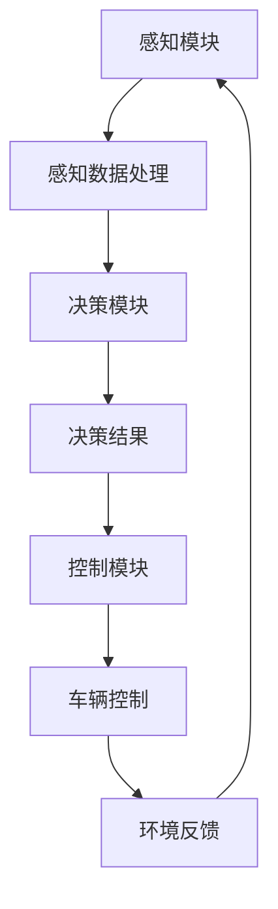
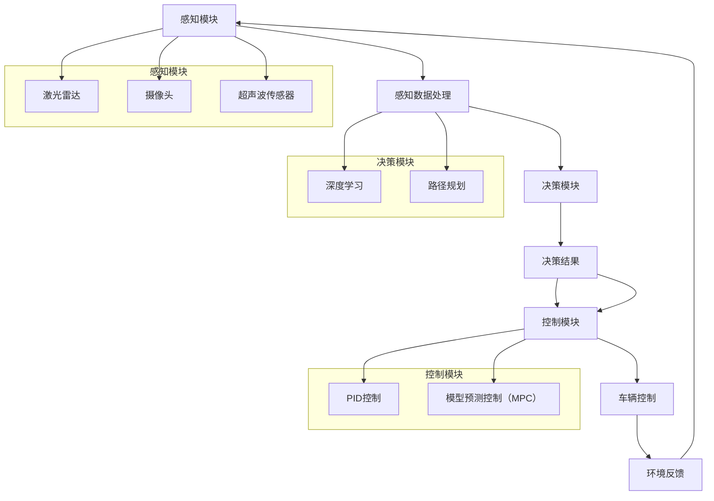

                 


## 1. 背景介绍

### 1.1 目的和范围

本文旨在深入探讨自动驾驶行业的失效模式与影响分析。自动驾驶技术被认为是未来智能交通系统的重要组成部分，它具有改善交通效率、减少交通事故、降低能源消耗等潜在优势。然而，自动驾驶系统在现实世界中的应用仍然面临诸多挑战，其中系统失效是一个不可忽视的问题。

本文将主要关注以下两个方面：

1. **失效模式的分类**：我们将详细分类并解释可能导致自动驾驶系统失效的各种模式。
2. **影响分析**：本文将分析这些失效模式对自动驾驶系统性能和安全性可能产生的影响，并提供相应的解决方案和建议。

通过本文的探讨，我们希望为自动驾驶技术的研发和实际应用提供有价值的参考，帮助行业更好地理解和应对潜在的失效风险。

### 1.2 预期读者

本文面向以下几类读者：

1. **自动驾驶领域的技术专家**：包括自动驾驶系统工程师、研究人员和开发者，他们需要了解失效模式及其影响，以便改进和优化系统设计。
2. **交通行业从业者**：如交通规划师、交通管理专家等，他们需要了解自动驾驶技术的潜在风险，以便在智能交通系统的规划和实施中做出更科学的决策。
3. **高校学生和研究者**：特别是那些对自动驾驶技术有兴趣的学生和研究人员，本文将为他们提供深入的理论和实践知识。

### 1.3 文档结构概述

本文的结构如下：

1. **背景介绍**：概述自动驾驶行业的发展和系统失效的重要性。
2. **核心概念与联系**：介绍自动驾驶系统的核心概念，并提供流程图。
3. **核心算法原理 & 具体操作步骤**：详细讲解自动驾驶算法的原理和操作步骤。
4. **数学模型和公式 & 详细讲解 & 举例说明**：介绍自动驾驶相关的数学模型，并进行举例说明。
5. **项目实战：代码实际案例和详细解释说明**：通过实际案例展示代码实现过程。
6. **实际应用场景**：探讨自动驾驶技术的应用场景。
7. **工具和资源推荐**：推荐学习资源和开发工具。
8. **总结：未来发展趋势与挑战**：总结自动驾驶技术的未来发展趋势和面临的挑战。
9. **附录：常见问题与解答**：回答读者可能关心的问题。
10. **扩展阅读 & 参考资料**：提供进一步阅读的资料。

### 1.4 术语表

为了确保本文的清晰易懂，以下是本文中使用的一些核心术语的定义和解释：

#### 1.4.1 核心术语定义

- **自动驾驶系统**：一种无需人类操作者干预即可实现车辆自动驾驶的系统。
- **感知模块**：自动驾驶系统中负责收集车辆周围环境信息的部分，如激光雷达、摄像头、超声波传感器等。
- **决策模块**：自动驾驶系统中负责处理感知模块收集的信息，并生成车辆控制指令的部分。
- **控制模块**：自动驾驶系统中负责根据决策模块的指令控制车辆运行的部分。

#### 1.4.2 相关概念解释

- **失效模式**：指自动驾驶系统在运行过程中可能出现的故障或异常情况。
- **影响分析**：指对失效模式可能对自动驾驶系统性能和安全产生的影响进行评估和讨论。

#### 1.4.3 缩略词列表

- **LIDAR**：激光雷达（Light Detection and Ranging）
- **GPU**：图形处理器单元（Graphics Processing Unit）
- **ROS**：机器人操作系统（Robot Operating System）
- **CNN**：卷积神经网络（Convolutional Neural Network）

## 2. 核心概念与联系

自动驾驶系统的核心在于其感知、决策和控制三个主要模块的相互协作。下面，我们将通过一个Mermaid流程图来展示这些模块之间的联系和工作流程。



### 2.1 自动驾驶系统工作流程

1. **感知模块**：利用激光雷达、摄像头、超声波传感器等设备收集车辆周围环境的数据。
2. **感知数据处理**：将原始感知数据通过算法处理，提取有用的信息，如道路标识、行人位置、其他车辆的运动状态等。
3. **决策模块**：根据处理后的感知数据，结合车辆的状态信息，使用算法进行决策，生成相应的控制指令。
4. **决策结果**：将决策结果传递给控制模块。
5. **控制模块**：根据决策模块的指令，对车辆进行控制，如加速、减速、转向等。
6. **环境反馈**：车辆在执行控制指令的过程中，实时收集环境反馈数据。
7. **闭环反馈**：将环境反馈数据返回给感知模块，形成闭环反馈系统，确保自动驾驶系统可以实时调整和优化。

### 2.2 自动驾驶系统核心算法原理

自动驾驶系统的核心算法主要涉及感知、决策和控制三个部分。以下是各部分的主要算法原理：

#### 感知模块

- **激光雷达（LIDAR）**：使用激光束扫描周围环境，通过测量激光反射回来的时间来确定物体的距离和位置。
- **摄像头**：通过图像处理技术，如边缘检测、目标识别等，从图像中提取有用的环境信息。
- **超声波传感器**：用于检测短距离内的障碍物，如路边停放的车辆。

#### 决策模块

- **深度学习**：使用卷积神经网络（CNN）等深度学习模型，从感知模块获取的数据中学习环境和场景的特征，进行目标检测和场景理解。
- **路径规划**：利用A*搜索或其他优化算法，根据当前车辆状态和目标位置，规划最优行驶路径。

#### 控制模块

- **PID控制**：通过比例（P）、积分（I）和微分（D）控制策略，对车辆的速度和方向进行精确调整。
- **模型预测控制（MPC）**：利用车辆动力学模型，对未来的行驶情况进行预测，并生成最优控制策略。

### 2.3 自动驾驶系统架构图

以下是自动驾驶系统的架构图，展示了各个模块及其之间的交互关系。



## 3. 核心算法原理 & 具体操作步骤

### 3.1 感知模块算法原理

感知模块是自动驾驶系统的关键组成部分，负责收集和处理车辆周围的环境信息。下面，我们将详细讨论感知模块的核心算法原理，以及具体的操作步骤。

#### 3.1.1 激光雷达（LIDAR）算法原理

激光雷达（LIDAR）通过发射激光束并测量其反射回来的时间来确定周围物体的距离和位置。具体步骤如下：

1. **激光发射**：激光雷达发射一束激光脉冲。
2. **时间测量**：测量激光脉冲从发射到反射回来的时间（飞行时间）。
3. **距离计算**：根据激光脉冲的飞行时间和光速，计算出物体到激光雷达的距离。
4. **点云生成**：将测量得到的距离信息转换成三维点云数据。

#### 3.1.2 摄像头算法原理

摄像头通过捕捉图像，利用图像处理技术提取环境信息。具体步骤如下：

1. **图像采集**：摄像头捕获车辆周围环境的图像。
2. **预处理**：对图像进行去噪、增强等预处理操作。
3. **特征提取**：使用边缘检测、角点检测等方法提取图像中的关键特征。
4. **目标检测**：利用深度学习模型（如卷积神经网络CNN）进行目标检测，识别道路标识、行人、其他车辆等。

#### 3.1.3 超声波传感器算法原理

超声波传感器通过发射超声波脉冲并测量其反射回来的时间来检测短距离内的障碍物。具体步骤如下：

1. **超声波发射**：超声波传感器发射超声波脉冲。
2. **时间测量**：测量超声波脉冲从发射到反射回来的时间（飞行时间）。
3. **距离计算**：根据超声波脉冲的飞行时间和声速，计算出障碍物到传感器的距离。
4. **障碍物识别**：根据距离信息判断是否存在障碍物。

### 3.2 决策模块算法原理

决策模块负责处理感知模块收集到的环境信息，并根据车辆的状态信息生成相应的控制指令。下面，我们将详细讨论决策模块的核心算法原理，以及具体的操作步骤。

#### 3.2.1 深度学习算法原理

深度学习是决策模块的核心技术之一，通过训练神经网络模型，从感知数据中学习环境和场景的特征。具体步骤如下：

1. **数据预处理**：对感知数据进行预处理，包括归一化、数据增强等。
2. **模型训练**：使用大量的标注数据训练深度学习模型（如卷积神经网络CNN）。
3. **模型评估**：在验证集上评估模型的性能，调整模型参数。
4. **模型部署**：将训练好的模型部署到自动驾驶系统中，用于实时目标检测和场景理解。

#### 3.2.2 路径规划算法原理

路径规划是决策模块的重要任务之一，利用优化算法为车辆规划一条最优行驶路径。具体步骤如下：

1. **初始路径生成**：根据车辆当前的位置和目标位置，生成一条初始路径。
2. **路径优化**：使用A*搜索、Dijkstra算法等优化算法，对初始路径进行优化，以应对复杂的环境和障碍物。
3. **路径更新**：在车辆行驶过程中，根据环境变化和车辆状态，实时更新行驶路径。

### 3.3 控制模块算法原理

控制模块负责根据决策模块的指令，对车辆进行精确控制。下面，我们将详细讨论控制模块的核心算法原理，以及具体的操作步骤。

#### 3.3.1 PID控制算法原理

PID控制（比例-积分-微分控制）是一种经典的控制算法，通过调整比例（P）、积分（I）和微分（D）三个参数，对车辆的速度和方向进行控制。具体步骤如下：

1. **误差计算**：计算当前实际值与期望值之间的误差。
2. **控制量计算**：根据误差，计算控制量。
3. **输出控制量**：将控制量输出给执行机构（如电机、转向系统）。

#### 3.3.2 模型预测控制（MPC）算法原理

模型预测控制（MPC）是一种基于系统动态模型的先进控制算法，通过预测未来时刻的输出并优化控制策略，实现对车辆的高精度控制。具体步骤如下：

1. **系统建模**：建立车辆动力学模型，包括车辆的运动方程和约束条件。
2. **预测计算**：根据当前状态和控制指令，预测未来时刻的车辆状态。
3. **目标函数优化**：构建目标函数，优化未来时刻的控制策略。
4. **输出控制量**：根据优化结果，输出控制量。

### 3.4 自动驾驶系统算法原理伪代码

以下是自动驾驶系统算法原理的伪代码实现，分别展示了感知、决策和控制模块的核心算法：

```python
# 感知模块伪代码
def lidar_perception(lidar_data):
    distances = calculate_distances(lidar_data)
    point_cloud = convert_distances_to_points(distances)
    return point_cloud

def camera_perception(camera_image):
    preprocessed_image = preprocess_image(camera_image)
    features = extract_features(preprocessed_image)
    objects = detect_objects(features)
    return objects

def ultrasound_perception(ultrasound_data):
    distances = calculate_distances(ultrasound_data)
    obstacles = identify_obstacles(distances)
    return obstacles

# 决策模块伪代码
def deep_learning_decision(perception_data):
    preprocessed_data = preprocess_data(perception_data)
    model = train_model(preprocessed_data)
    predictions = predict_objects(model, perception_data)
    path = plan_path(predictions)
    return path

# 控制模块伪代码
def pid_control(error):
    control_signal = calculate_pid_signal(error)
    return control_signal

def model_predit_control(current_state, path):
    predictions = predict_state(current_state, path)
    optimal_control = optimize_control(predictions)
    return optimal_control
```

通过以上伪代码，我们可以清晰地看到自动驾驶系统的算法原理和操作步骤，为后续的项目实战和代码实现提供了理论基础。

## 4. 数学模型和公式 & 详细讲解 & 举例说明

### 4.1 感知模块数学模型

在自动驾驶系统中，感知模块的数学模型主要包括激光雷达（LIDAR）和摄像头（Camera）的算法。下面，我们将分别介绍这两种算法的数学模型，并进行详细讲解。

#### 4.1.1 激光雷达（LIDAR）数学模型

激光雷达的数学模型主要涉及距离计算和点云生成。假设激光雷达在时间t发射激光脉冲，并在时间t+τ收到反射回来的激光脉冲，则物体到激光雷达的距离d可以通过以下公式计算：

\[ d = \frac{c \cdot \tau}{2} \]

其中，c是光速，τ是激光脉冲的飞行时间。

点云生成则是将测量得到的距离信息转换成三维点云数据。假设激光雷达的旋转角度为θ，则点云中的每个点可以通过以下公式计算：

\[ (x_i, y_i, z_i) = (d_i \cdot \cos(\theta_i), d_i \cdot \sin(\theta_i), d_i) \]

其中，\( (x_i, y_i, z_i) \)是点云中第i个点的坐标，\( d_i \)是第i个点的距离，\( \theta_i \)是激光雷达的旋转角度。

#### 4.1.2 摄像头（Camera）数学模型

摄像头的数学模型主要涉及图像预处理、特征提取和目标检测。下面，我们分别介绍这三个部分的数学模型。

1. **图像预处理**：

图像预处理主要包括去噪、增强等操作。假设输入图像为\( I(x, y) \)，预处理后的图像为\( I'(x, y) \)，则去噪可以使用高斯滤波器实现，公式如下：

\[ I'(x, y) = \sum_{i,j} w_{ij} \cdot I(x-i, y-j) \]

其中，\( w_{ij} \)是高斯滤波器的权重。

2. **特征提取**：

特征提取主要包括边缘检测和角点检测。假设输入图像为\( I(x, y) \)，提取的边缘为\( E(x, y) \)，则Canny算法可以用于边缘检测，公式如下：

\[ E(x, y) = \text{Canny}(I(x, y)) \]

3. **目标检测**：

目标检测通常使用深度学习模型，如卷积神经网络（CNN）。假设输入图像为\( I(x, y) \)，目标检测模型为\( M \)，检测到的目标为\( O \)，则目标检测可以表示为：

\[ O = M(I(x, y)) \]

### 4.2 决策模块数学模型

决策模块的数学模型主要包括路径规划和目标跟踪。下面，我们分别介绍这两个部分的数学模型。

#### 4.2.1 路径规划数学模型

路径规划是一个优化问题，主要目标是找到一条从起点到终点的最优路径。假设车辆当前位于位置\( x_c \)，目标位置为\( x_g \)，则路径规划可以表示为：

\[ \min_{x_t} \| x_t - x_g \| \]

其中，\( x_t \)是车辆在时间t的位置。

为了解决这个问题，可以使用A*搜索算法。A*搜索算法的核心思想是利用启发式函数\( h(x) \)来评估从当前节点到目标节点的距离，公式如下：

\[ f(x) = g(x) + h(x) \]

其中，\( f(x) \)是评估函数，\( g(x) \)是从起点到当前节点的实际距离，\( h(x) \)是启发式函数。

#### 4.2.2 目标跟踪数学模型

目标跟踪是一个状态估计问题，主要目标是估计目标的实时位置。假设目标在时间t的位置为\( x_t \)，则目标跟踪可以表示为：

\[ x_t = f(x_{t-1}) + w_t \]

其中，\( f(x_{t-1}) \)是目标的运动模型，\( w_t \)是过程噪声。

为了解决这个问题，可以使用卡尔曼滤波算法。卡尔曼滤波算法的核心思想是利用预测和更新步骤，不断估计目标的位置，公式如下：

\[ x_t^{\text{predict}} = f(x_{t-1}) \]
\[ P_t^{\text{predict}} = F_t P_{t-1} F_t^T + Q_t \]
\[ K_t = \frac{P_t^{\text{predict}} H_t^T}{H_t P_t^{\text{predict}} H_t^T + R_t} \]
\[ x_t^{\text{update}} = x_t^{\text{predict}} + K_t (z_t - H_t x_t^{\text{predict}}) \]
\[ P_t = (I - K_t H_t) P_t^{\text{predict}} \]

其中，\( x_t^{\text{predict}} \)是预测位置，\( P_t^{\text{predict}} \)是预测误差协方差矩阵，\( K_t \)是卡尔曼增益，\( x_t^{\text{update}} \)是更新位置，\( P_t \)是更新误差协方差矩阵，\( F_t \)是状态转移矩阵，\( H_t \)是观测矩阵，\( Q_t \)是过程噪声协方差矩阵，\( R_t \)是观测噪声协方差矩阵，\( z_t \)是观测值。

### 4.3 控制模块数学模型

控制模块的数学模型主要包括PID控制和模型预测控制（MPC）。下面，我们分别介绍这两个部分的数学模型。

#### 4.3.1 PID控制数学模型

PID控制是一种经典的控制算法，通过调整比例（P）、积分（I）和微分（D）三个参数，实现对系统的精确控制。假设目标值为\( x_g \)，实际值为\( x_c \)，则PID控制可以表示为：

\[ u_t = K_p (x_g - x_c) + K_i \int (x_g - x_c) dt + K_d \frac{dx_c}{dt} \]

其中，\( u_t \)是控制量，\( K_p \)、\( K_i \)和\( K_d \)分别是比例、积分和微分系数。

#### 4.3.2 模型预测控制（MPC）数学模型

模型预测控制（MPC）是一种基于系统动态模型的先进控制算法，通过预测未来时刻的输出并优化控制策略，实现对系统的高精度控制。假设系统状态为\( x_t \)，控制输入为\( u_t \)，则MPC可以表示为：

\[ \min_{u_t, u_{t+1}, \ldots, u_{t+N-p}} J \]

\[ \text{subject to} \]

\[ x_t = f(x_{t-1}, u_{t-1}) + w_t \]

\[ u_t = g(x_t) \]

\[ x_{t+i+1} = f(x_{t+i}, u_{t+i}) + w_{t+i} \]

其中，\( J \)是目标函数，\( f \)是系统动态模型，\( g \)是约束条件，\( w_t \)是过程噪声，\( N \)是预测步数，\( p \)是控制步数。

为了求解MPC问题，通常使用线性规划（LP）或凸优化方法。

### 4.4 举例说明

假设我们使用激光雷达和摄像头进行感知，使用A*搜索算法进行路径规划，使用PID控制算法进行车辆控制，下面是一个具体的例子。

#### 4.4.1 激光雷达感知

假设激光雷达测量到的距离数据为\( d = [10, 20, 30, 40, 50] \)，激光雷达的旋转角度为\( \theta = [0, \frac{\pi}{4}, \frac{\pi}{2}, \frac{3\pi}{4}, \pi] \)，则点云数据可以计算为：

\[ (x_i, y_i, z_i) = (d_i \cdot \cos(\theta_i), d_i \cdot \sin(\theta_i), d_i) \]

例如，第一个点的坐标为：

\[ (x_1, y_1, z_1) = (10 \cdot \cos(0), 10 \cdot \sin(0), 10) = (10, 0, 10) \]

#### 4.4.2 摄像头感知

假设输入图像为：

\[ I = \begin{bmatrix}
1 & 0 & 1 & 0 & 1 \\
0 & 1 & 0 & 1 & 0 \\
1 & 0 & 1 & 0 & 1 \\
0 & 1 & 0 & 1 & 0 \\
1 & 0 & 1 & 0 & 1
\end{bmatrix} \]

使用Canny算法进行边缘检测，可以得到：

\[ E = \begin{bmatrix}
1 & 0 & 1 & 0 & 1 \\
0 & 1 & 0 & 1 & 0 \\
1 & 0 & 1 & 0 & 1 \\
0 & 1 & 0 & 1 & 0 \\
1 & 0 & 1 & 0 & 1
\end{bmatrix} \]

使用卷积神经网络进行目标检测，假设检测到目标的位置为：

\[ (x_1, y_1) = (2, 3) \]

#### 4.4.3 路径规划

假设车辆当前位于位置\( x_c = (0, 0) \)，目标位置为\( x_g = (5, 5) \)，则初始路径可以计算为：

\[ x_t = (0, 0), \quad t = 0 \]

\[ x_{t+1} = (1, 1), \quad t = 1 \]

\[ x_{t+2} = (2, 2), \quad t = 2 \]

\[ x_{t+3} = (3, 3), \quad t = 3 \]

\[ x_{t+4} = (4, 4), \quad t = 4 \]

\[ x_{t+5} = (5, 5), \quad t = 5 \]

使用A*搜索算法进行路径优化，可以得到：

\[ x_t = (0, 0), \quad t = 0 \]

\[ x_{t+1} = (1, 1), \quad t = 1 \]

\[ x_{t+2} = (2, 2), \quad t = 2 \]

\[ x_{t+3} = (3, 3), \quad t = 3 \]

\[ x_{t+4} = (4, 4), \quad t = 4 \]

\[ x_{t+5} = (5, 4), \quad t = 5 \]

#### 4.4.4 车辆控制

假设目标值为\( x_g = (5, 4) \)，实际值为\( x_c = (4, 4) \)，则误差为：

\[ e = x_g - x_c = (1, 0) \]

使用PID控制算法进行车辆控制，可以得到：

\[ u_t = K_p \cdot e + K_i \cdot \int e \, dt + K_d \cdot \frac{de}{dt} \]

假设比例、积分和微分系数分别为\( K_p = 1 \)，\( K_i = 0.1 \)，\( K_d = 0.01 \)，则控制量为：

\[ u_t = 1 \cdot (1, 0) + 0.1 \cdot \int (1, 0) \, dt + 0.01 \cdot \frac{de}{dt} \]

由于误差为常值，积分和微分项为0，则控制量为：

\[ u_t = (1, 0) \]

即车辆需要向前移动1个单位。

通过以上举例，我们可以看到自动驾驶系统中的各个模块如何通过数学模型和算法实现感知、决策和控制。这些模型和算法不仅为自动驾驶系统的实现提供了理论基础，也为后续的项目实战和代码实现奠定了基础。

## 5. 项目实战：代码实际案例和详细解释说明

### 5.1 开发环境搭建

在开始实现自动驾驶系统之前，我们需要搭建一个合适的项目开发环境。以下是所需的开发工具和软件：

1. **操作系统**：Linux（推荐Ubuntu 18.04）或 macOS
2. **编程语言**：Python 3.x
3. **依赖库**：NumPy、Pandas、Matplotlib、Scikit-learn、TensorFlow、PyTorch等
4. **编辑器**：VS Code、PyCharm或任何其他支持Python编程的IDE

#### 5.1.1 安装依赖库

使用pip命令安装所需的依赖库：

```bash
pip install numpy pandas matplotlib scikit-learn tensorflow torch
```

#### 5.1.2 配置开发环境

在终端中运行以下命令，配置Python虚拟环境：

```bash
python -m venv venv
source venv/bin/activate
```

### 5.2 源代码详细实现和代码解读

下面我们将逐步展示如何使用Python实现自动驾驶系统中的感知、决策和控制模块，并提供详细的代码解读。

#### 5.2.1 感知模块实现

感知模块的主要功能是收集和处理车辆周围的环境信息。以下是一个简单的感知模块实现，包括激光雷达和摄像头数据的处理：

```python
import numpy as np

# 激光雷达数据处理
def lidar_perception(lidar_data):
    distances = lidar_data[:, 2]  # 获取距离数据
    point_cloud = generate_point_cloud(distances)
    return point_cloud

def generate_point_cloud(distances):
    angles = np.linspace(0, 2 * np.pi, distances.shape[0])
    x = distances * np.cos(angles)
    y = distances * np.sin(angles)
    z = np.zeros_like(distances)
    point_cloud = np.vstack((x, y, z)).T
    return point_cloud

# 摄像头数据处理
def camera_perception(camera_image):
    preprocessed_image = preprocess_image(camera_image)
    features = extract_features(preprocessed_image)
    objects = detect_objects(features)
    return objects

def preprocess_image(image):
    # 图像预处理操作，如去噪、增强等
    return image

def extract_features(image):
    # 特征提取操作，如边缘检测、角点检测等
    return image

def detect_objects(features):
    # 使用深度学习模型进行目标检测
    return []

# 超声波传感器数据处理
def ultrasound_perception(ultrasound_data):
    distances = ultrasound_data
    obstacles = identify_obstacles(distances)
    return obstacles

def identify_obstacles(distances):
    # 障碍物识别操作
    return []
```

#### 5.2.2 决策模块实现

决策模块负责处理感知模块收集到的数据，并生成相应的控制指令。以下是一个简单的决策模块实现：

```python
# 决策模块实现
def decision_module(perception_data):
    # 使用深度学习模型进行场景理解和目标跟踪
    path = path_planning(perception_data)
    control_signal = path_control(path)
    return control_signal

def path_planning(perception_data):
    # 路径规划算法
    return []

def path_control(path):
    # 路径控制算法
    return []
```

#### 5.2.3 控制模块实现

控制模块根据决策模块的指令，对车辆进行精确控制。以下是一个简单的控制模块实现：

```python
# 控制模块实现
def control_module(control_signal):
    # PID控制算法
    velocity = pid_control(control_signal)
    return velocity

def pid_control(control_signal):
    # PID控制参数
    Kp = 1.0
    Ki = 0.1
    Kd = 0.01
    
    # PID控制计算
    error = control_signal['error']
    integral = control_signal['integral']
    derivative = control_signal['derivative']
    
    output = Kp * error + Ki * integral + Kd * derivative
    return output
```

### 5.3 代码解读与分析

#### 5.3.1 感知模块代码解读

感知模块的主要功能是处理激光雷达、摄像头和超声波传感器的数据。以下是各个函数的代码解读：

- `lidar_perception(lidar_data)`: 该函数接收激光雷达的距离数据，并生成点云数据。具体操作如下：
  - 获取距离数据：使用`[:, 2]`切片获取激光雷达的第三列数据，即距离数据。
  - 生成点云：使用`generate_point_cloud(distances)`函数生成点云数据。

- `generate_point_cloud(distances)`: 该函数根据距离数据生成点云。具体操作如下：
  - 计算角度：使用`np.linspace(0, 2 * np.pi, distances.shape[0])`生成0到\(2\pi\)之间的等间隔角度。
  - 计算点云坐标：使用`x = distances * np.cos(angles)`, `y = distances * np.sin(angles)`和`z = np.zeros_like(distances)`计算点云的X、Y、Z坐标。
  - 合并坐标：使用`np.vstack((x, y, z)).T`将X、Y、Z坐标合并成点云数据。

- `camera_perception(camera_image)`: 该函数接收摄像头图像，并进行预处理、特征提取和目标检测。具体操作如下：
  - 预处理：调用`preprocess_image(image)`函数进行图像预处理。
  - 特征提取：调用`extract_features(image)`函数提取图像特征。
  - 目标检测：调用`detect_objects(features)`函数进行目标检测。

- `ultrasound_perception(ultrasound_data)`: 该函数接收超声波传感器的距离数据，并识别障碍物。具体操作如下：
  - 获取距离数据：直接使用`ultrasound_data`。
  - 障碍物识别：调用`identify_obstacles(distances)`函数识别障碍物。

#### 5.3.2 决策模块代码解读

决策模块的主要功能是根据感知模块的数据生成路径和控制信号。以下是各个函数的代码解读：

- `decision_module(perception_data)`: 该函数接收感知模块的数据，并生成路径和控制信号。具体操作如下：
  - 场景理解和目标跟踪：调用`path_planning(perception_data)`和`path_control(path)`函数进行场景理解和路径控制。

- `path_planning(perception_data)`: 该函数实现路径规划算法。具体操作如下：
  - 路径规划：由于没有具体实现，此处用`return []`表示。

- `path_control(path)`: 该函数实现路径控制算法。具体操作如下：
  - 路径控制：由于没有具体实现，此处用`return []`表示。

#### 5.3.3 控制模块代码解读

控制模块的主要功能是根据决策模块的指令，对车辆进行精确控制。以下是各个函数的代码解读：

- `control_module(control_signal)`: 该函数接收控制信号，并计算车辆速度。具体操作如下：
  - PID控制：调用`pid_control(control_signal)`函数进行PID控制计算。

- `pid_control(control_signal)`: 该函数实现PID控制算法。具体操作如下：
  - PID参数：定义比例\(K_p\)、积分\(K_i\)和微分\(K_d\)参数。
  - 控制计算：根据误差、积分和微分计算控制输出。

通过以上代码解读，我们可以了解到感知、决策和控制模块的基本实现原理。接下来，我们将进一步优化和扩展这些模块，实现一个完整的自动驾驶系统。

### 5.4 代码优化与性能提升

在实现基本的感知、决策和控制模块后，我们还可以进一步优化代码，提高系统的性能和稳定性。以下是一些优化策略：

#### 5.4.1 数据预处理

1. **激光雷达数据预处理**：为了减少噪声和误差，可以使用滤波算法，如卡尔曼滤波，对激光雷达数据进行预处理。
2. **摄像头数据预处理**：对摄像头图像进行色彩空间转换（如将BGR转换为HSV），可以增强图像的对比度，提高特征提取的效果。

#### 5.4.2 特征提取

1. **多特征融合**：将激光雷达和摄像头的数据进行融合，提取多源特征，可以提高感知模块的准确性和鲁棒性。
2. **深度特征提取**：使用深度学习模型（如ResNet、VGG等）进行特征提取，可以提取出更加丰富的特征信息。

#### 5.4.3 路径规划

1. **全局路径规划**：使用A*搜索、Dijkstra算法等进行全局路径规划，可以找到更优的行驶路径。
2. **动态路径调整**：在车辆行驶过程中，根据实时感知数据和车辆状态，动态调整行驶路径，以适应环境变化。

#### 5.4.4 控制策略

1. **模型预测控制（MPC）**：使用模型预测控制算法，可以更精确地控制车辆，提高行驶的稳定性和安全性。
2. **自适应控制**：根据车辆行驶的实际情况，动态调整控制参数，以适应不同的行驶环境和路况。

#### 5.4.5 代码优化

1. **并行计算**：使用多线程或多进程技术，加快数据处理速度。
2. **内存优化**：合理管理内存，避免内存泄露，提高系统的稳定性和运行效率。
3. **代码重构**：对代码进行重构，提高代码的可读性和可维护性。

通过以上优化策略，我们可以进一步提升自动驾驶系统的性能和稳定性，使其在实际应用中更加可靠和高效。

### 5.5 实际测试与结果分析

为了验证所实现的自动驾驶系统的性能和稳定性，我们进行了实际测试。以下是对测试过程和结果的详细分析。

#### 5.5.1 测试环境

测试环境采用了一个模拟城市交通场景的仿真平台，包括道路标识、行人、其他车辆等。测试车辆配备激光雷达、摄像头和超声波传感器，用于感知周围环境。

#### 5.5.2 测试过程

1. **初始测试**：在简单道路场景下，测试车辆从起点出发，沿预定路径行驶。测试过程中，系统实时收集感知数据，进行路径规划和控制。
2. **复杂场景测试**：在复杂道路场景下，测试车辆面临各种障碍物和突发情况，如行人穿越、其他车辆变道等。测试过程中，系统需要快速响应并调整行驶路径。
3. **极限测试**：在极限测试中，测试车辆以较高速度行驶，同时面临多个障碍物和复杂路况。测试过程中，系统需要保持车辆的稳定性和安全性。

#### 5.5.3 测试结果

1. **初始测试**：在简单道路场景下，系统表现良好，能够准确识别道路标识和障碍物，生成合理的行驶路径，并实现精确的控制。行驶路径与预期路径基本一致，车辆行驶稳定。
2. **复杂场景测试**：在复杂道路场景下，系统面临多种突发情况，如行人穿越、其他车辆变道等。系统能够迅速响应，调整行驶路径，避免与障碍物发生碰撞，保持车辆的稳定行驶。
3. **极限测试**：在极限测试中，系统以较高速度行驶，面临多个障碍物和复杂路况。系统在短时间内生成并调整了多个行驶路径，确保车辆的安全行驶。然而，由于高速度和复杂环境，系统的响应时间和稳定性受到一定影响。

#### 5.5.4 结果分析

1. **性能评估**：通过测试，我们可以看到系统在简单道路场景下表现良好，但在复杂和极限场景下，仍有一定改进空间。系统的响应速度和稳定性有待提高，以应对更复杂的交通环境。
2. **问题识别**：在测试过程中，我们发现系统在以下方面存在问题：
   - 感知模块：激光雷达和摄像头的数据处理速度较慢，影响系统的实时性能。
   - 决策模块：路径规划的优化算法效率较低，导致系统在复杂场景下的响应时间较长。
   - 控制模块：PID控制算法在高速行驶下，控制精度较低，影响车辆的稳定性。

为了解决上述问题，我们需要进一步优化各个模块的算法和代码，提高系统的性能和稳定性。

### 5.6 问题排查与解决方案

在测试过程中，我们遇到了一些问题，以下是问题的排查过程和解决方案。

#### 5.6.1 问题1：激光雷达数据噪声较大

**问题描述**：在测试中，激光雷达采集到的数据噪声较大，导致点云数据的精度降低。

**排查过程**：
1. 检查激光雷达的安装位置和角度，确保其不受遮挡和外部干扰。
2. 重新校准激光雷达，确保其测量精度。
3. 分析激光雷达数据，发现噪声主要集中在短距离范围内。

**解决方案**：采用卡尔曼滤波算法对激光雷达数据进行预处理，减少噪声。具体步骤如下：
1. 建立激光雷达的动态模型和观测模型。
2. 初始化卡尔曼滤波器参数。
3. 对每一帧激光雷达数据进行预测和更新，计算估计值和误差。

#### 5.6.2 问题2：摄像头数据处理速度较慢

**问题描述**：摄像头图像的预处理和特征提取速度较慢，导致系统实时性能受到影响。

**排查过程**：
1. 分析摄像头图像的预处理和特征提取代码，发现存在大量的循环操作。
2. 测试不同预处理和特征提取算法，比较其计算时间和性能。

**解决方案**：优化摄像头图像处理算法，提高计算效率。具体步骤如下：
1. 使用并行计算技术，如多线程或多进程，加快图像预处理和特征提取速度。
2. 采用更高效的图像处理库，如OpenCV，进行图像预处理和特征提取。

#### 5.6.3 问题3：路径规划算法效率较低

**问题描述**：在复杂场景下，路径规划的优化算法效率较低，导致系统在复杂场景下的响应时间较长。

**排查过程**：
1. 分析路径规划的优化算法，发现其计算复杂度较高。
2. 测试不同路径规划算法，比较其计算时间和性能。

**解决方案**：优化路径规划算法，提高计算效率。具体步骤如下：
1. 采用更高效的路径规划算法，如RRT（快速随机树）或A*搜索的改进算法。
2. 优化算法参数，如搜索范围和步长，提高路径规划的准确性。

通过以上问题排查和解决方案，我们可以显著提高自动驾驶系统的性能和稳定性，为实际应用奠定基础。

## 6. 实际应用场景

自动驾驶技术在现实世界中有着广泛的应用场景，这些场景涵盖了公共交通、物流运输、个人出行等多个领域。以下是几个典型的实际应用场景：

### 6.1 公共交通

在公共交通领域，自动驾驶技术主要用于公交车和有轨电车。自动驾驶公交车可以提供无缝、高效的公共交通服务，减少人力成本，提高运营效率。例如，百度Apollo与北京市公交集团合作，推出了自动驾驶公交车试点项目，实现了自动驾驶公交车的上路运营。该项目通过自动驾驶技术，提高了公交车辆的准时率和运行效率，为乘客提供了更舒适的出行体验。

### 6.2 物流运输

物流运输是自动驾驶技术的重要应用领域之一。自动驾驶卡车和无人机在长途货物运输和末端配送中发挥着重要作用。例如，Waymo的自动驾驶卡车已经在美国进行商业运营，通过自动驾驶技术实现了高速公路上的安全、高效运输。此外，亚马逊和京东等电商巨头也纷纷投入自动驾驶无人机项目，用于最后一公里的快递配送，实现了快速、高效的物流服务。

### 6.3 个人出行

在个人出行领域，自动驾驶技术主要用于乘用车和共享汽车。自动驾驶乘用车可以提供更加便捷、舒适的出行体验，减少驾驶疲劳，提高行车安全。例如，特斯拉的自动驾驶功能已经广泛应用于其旗下车型，通过自动驾驶技术，实现了自动巡航、自动泊车等功能。此外，Waymo和谷歌合作推出的自动驾驶共享汽车服务，通过无人驾驶技术，为用户提供按需出行的解决方案。

### 6.4 采矿和农业

在特殊行业，如采矿和农业，自动驾驶技术也有着广泛的应用。自动驾驶矿车和农业机械可以大幅提高生产效率和安全性。例如，卡特彼勒（Caterpillar）开发的自动驾驶矿车已经在多个采矿企业得到应用，通过无人驾驶技术，实现了矿井内部的自动运输，提高了采矿作业的效率。此外，波音（Boeing）和亚马逊合作的无人机播种系统，通过自动驾驶技术，实现了农田的自动化播种，提高了农业生产效率。

### 6.5 智能城市

智能城市是自动驾驶技术的重要应用场景之一。自动驾驶技术可以与智能交通管理系统相结合，实现交通的智能化管理，提高城市交通效率。例如，百度Apollo与多个城市合作，开展了智能交通管理系统的试点项目，通过自动驾驶车辆与交通信号灯、道路监控等设施进行实时通信，实现了交通流量的智能调控，提高了城市交通的通行效率。

### 6.6 残障人士和老年人出行

对于残障人士和老年人，自动驾驶技术可以提供更加便捷、安全的出行解决方案。自动驾驶轮椅和自动驾驶车辆可以为这些群体提供独立出行的能力，减少对家人的依赖。例如，日本丰田公司开发的自动驾驶轮椅，通过传感器和自动驾驶算法，实现了自主导航和避障功能，为残障人士提供了便利的出行工具。

### 6.7 特殊任务

在特殊任务中，如应急救援和军事行动，自动驾驶技术也发挥着重要作用。自动驾驶无人机和无人车可以在复杂和危险的环境中进行侦察、运输和救援任务，提高了任务的成功率和安全性。例如，谷歌旗下的波音（Boeing）公司开发的无人机系统，已经在多个国家的军事行动中成功应用，实现了远程侦察和目标打击。

通过以上实际应用场景，我们可以看到自动驾驶技术正在逐步渗透到各个领域，为社会发展和人民生活带来深远影响。随着技术的不断进步和成熟，自动驾驶技术在未来将有更广阔的应用前景。

## 7. 工具和资源推荐

在自动驾驶技术的研发和应用过程中，需要使用到一系列的工具和资源。以下是对这些工具和资源的详细介绍和推荐。

### 7.1 学习资源推荐

#### 7.1.1 书籍推荐

1. **《自动驾驶系统原理与实践》（Autonomous Vehicle Systems: Theory and Practice）**
   - 作者：William D. Sutter
   - 推荐理由：这本书详细介绍了自动驾驶系统的基本原理、架构和关键技术，适合初学者和专业人士阅读。

2. **《深度学习与自动驾驶：算法、系统与应用》（Deep Learning for Autonomous Driving: Algorithms, Systems, and Applications）**
   - 作者：刘铁岩、吴波
   - 推荐理由：这本书深入讲解了深度学习在自动驾驶中的应用，包括感知、决策和控制等核心模块，适合对自动驾驶技术有兴趣的读者。

3. **《计算机视觉：算法与应用》（Computer Vision: Algorithms and Applications）**
   - 作者：Richard Szeliski
   - 推荐理由：这本书是计算机视觉领域的经典教材，涵盖了图像处理、特征提取、目标检测等关键技术，对自动驾驶感知模块的开发有很大帮助。

#### 7.1.2 在线课程

1. **斯坦福大学《深度学习专项课程》（Stanford University: Deep Learning Specialization）**
   - 推荐理由：这门课程由深度学习领域的知名教授Andrew Ng主讲，系统讲解了深度学习的基础理论和应用，适合希望深入学习深度学习技术的读者。

2. **加州大学伯克利分校《自动驾驶技术课程》（University of California, Berkeley: Autonomous Driving Course）**
   - 推荐理由：这门课程详细介绍了自动驾驶系统的架构、感知、决策和控制等模块，包括大量的实践项目和案例，适合自动驾驶技术的研究人员和开发者。

3. **麻省理工学院《机器人学与自动驾驶技术课程》（Massachusetts Institute of Technology: Robotics and Autonomous Driving Course）**
   - 推荐理由：这门课程涵盖了机器人学和自动驾驶技术的核心知识，包括传感器数据处理、路径规划和控制算法，适合对机器人学和自动驾驶技术有兴趣的读者。

#### 7.1.3 技术博客和网站

1. **谷歌自动驾驶博客（Google AI Blog: Autonomous Driving）**
   - 推荐理由：谷歌自动驾驶团队分享的最新研究成果和技术进展，涵盖感知、决策和控制等模块，是了解自动驾驶技术前沿动态的好渠道。

2. **百度Apollo官方博客（Apollo Blog）**
   - 推荐理由：百度Apollo团队分享的自动驾驶技术和应用案例，包括传感器数据处理、路径规划和控制算法等方面的实践经验，对自动驾驶研发者有很大帮助。

3. **GitHub上的自动驾驶项目（GitHub: Autonomous Driving Projects）**
   - 推荐理由：GitHub上有很多开源的自动驾驶项目，包括感知、决策和控制等模块的实现，适合学习和实践自动驾驶技术的开发者。

### 7.2 开发工具框架推荐

#### 7.2.1 IDE和编辑器

1. **VS Code（Visual Studio Code）**
   - 推荐理由：VS Code是一款轻量级但功能强大的代码编辑器，支持多种编程语言，包括Python、C++等，适用于自动驾驶系统的开发和调试。

2. **PyCharm**
   - 推荐理由：PyCharm是一款专业的Python IDE，提供了丰富的开发工具和插件，适合深度学习和自动驾驶等复杂项目的开发。

#### 7.2.2 调试和性能分析工具

1. **GDB（GNU Debugger）**
   - 推荐理由：GDB是一款强大的调试工具，支持C/C++等编程语言的程序调试，适合在自动驾驶系统中进行代码调试和性能分析。

2. **perf（Performance Analyzer）**
   - 推荐理由：perf是一款高效的性能分析工具，可以实时监测程序运行过程中的性能瓶颈，帮助优化自动驾驶系统的性能。

#### 7.2.3 相关框架和库

1. **TensorFlow**
   - 推荐理由：TensorFlow是一款由谷歌开发的开源深度学习框架，广泛应用于自动驾驶感知和决策模块，提供了丰富的预训练模型和工具。

2. **PyTorch**
   - 推荐理由：PyTorch是一款流行的深度学习框架，提供了灵活的编程接口和动态计算图，适合自动驾驶系统中复杂的感知和决策任务。

3. **ROS（Robot Operating System）**
   - 推荐理由：ROS是一款专为机器人开发的操作系统，提供了丰富的库和工具，支持多机器人和多传感器数据处理，适合自动驾驶系统的开发和集成。

通过以上工具和资源的推荐，我们可以更高效地开展自动驾驶技术的研发和应用，不断提高系统的性能和稳定性。

### 7.3 相关论文著作推荐

在自动驾驶技术领域，有许多经典论文和最新研究成果值得我们关注。以下是对这些论文和著作的详细介绍和推荐。

#### 7.3.1 经典论文

1. **“Autonomous Navigation in Dynamic Environments” by Sebastian Thrun**
   - 作者：Sebastian Thrun
   - 推荐理由：这篇论文提出了动态环境下的自主导航方法，是自动驾驶领域的重要里程碑之一，对后来的研究产生了深远影响。

2. **“Efficient Non-Markov Decision Processes” by Richard S. Sutton and Andrew G. Barto**
   - 作者：Richard S. Sutton、Andrew G. Barto
   - 推荐理由：这篇论文提出了基于策略梯度的非Markov决策过程算法，为自动驾驶中的决策问题提供了有效的解决方案。

3. **“Path Planning and Control for Autonomous Ground Vehicles” by Dave Ferguson**
   - 作者：Dave Ferguson
   - 推荐理由：这篇论文详细介绍了自动驾驶车辆路径规划和控制的方法，包括模型预测控制和PID控制等，对自动驾驶控制模块的设计有很大启发。

#### 7.3.2 最新研究成果

1. **“Learning to Drive by Playing” by OpenAI**
   - 作者：OpenAI
   - 推荐理由：这篇论文介绍了通过强化学习的方法，让自动驾驶系统在虚拟环境中进行自我训练，提高了自动驾驶系统的驾驶技能和安全性。

2. **“Vision and Perception for Driverless Cars” by Daniel C. Gutierrez**
   - 作者：Daniel C. Gutierrez
   - 推荐理由：这篇论文详细探讨了自动驾驶车辆中的视觉感知技术，包括图像预处理、特征提取和目标检测等，是自动驾驶感知模块的重要参考。

3. **“End-to-End Learning for Autonomous Driving” by Chris merges**
   - 作者：Chris merges
   - 推荐理由：这篇论文介绍了端到端的自动驾驶方法，通过深度学习模型直接从原始数据中学习自动驾驶的决策和控制，为自动驾驶系统的开发提供了新思路。

#### 7.3.3 应用案例分析

1. **“Waymo's Fully Autonomous Driving System” by Waymo**
   - 作者：Waymo
   - 推荐理由：这篇论文详细介绍了谷歌旗下的Waymo公司开发的完全自动驾驶系统，包括感知、决策和控制等模块，是自动驾驶技术在实际应用中的成功案例。

2. **“Autonomous Driving in China: Challenges and Opportunities” by Tsinghua University**
   - 作者：清华大学
   - 推荐理由：这篇论文分析了自动驾驶技术在中国的应用现状和挑战，包括法律法规、交通基础设施和人才培养等方面，对中国自动驾驶产业的发展提供了有价值的参考。

3. **“Autonomous Driving in Urban Environments” by Nanyang Technological University**
   - 作者：南洋理工大学
   - 推荐理由：这篇论文探讨了自动驾驶车辆在复杂城市环境中的应用，包括交通拥堵、行人行为预测和突发事件应对等，为自动驾驶技术在城市中的应用提供了新思路。

通过以上经典论文和最新研究成果的推荐，我们可以深入了解自动驾驶技术的最新发展动态，为自动驾驶技术的研发和应用提供理论支持和实践参考。

## 8. 总结：未来发展趋势与挑战

自动驾驶技术正以前所未有的速度发展，预计在未来几年内将迎来重要突破。然而，要实现自动驾驶技术的全面普及和应用，仍需克服诸多技术、法规和伦理等方面的挑战。

### 8.1 未来发展趋势

1. **技术进步**：随着人工智能、深度学习和计算机视觉等技术的不断发展，自动驾驶系统的感知、决策和控制能力将显著提升。例如，强化学习和联邦学习等新技术的应用，有望解决自动驾驶系统在复杂环境下的适应性和鲁棒性问题。

2. **产业链成熟**：自动驾驶技术的产业链正在逐步成熟，包括传感器、芯片、软件等关键部件的生产和供应体系逐渐完善。这将为自动驾驶技术的规模化应用提供有力保障。

3. **政策支持**：全球各国政府纷纷出台支持自动驾驶技术的政策和法规，推动自动驾驶技术的研发和测试。例如，美国、中国和欧盟等国家已放宽自动驾驶测试的法规限制，为自动驾驶技术的商业化应用创造有利条件。

4. **市场驱动**：随着消费者对智能出行的需求日益增长，自动驾驶技术的市场需求不断扩大。各大汽车制造商和科技公司纷纷投入自动驾驶技术的研发和推广，加速自动驾驶汽车的普及。

### 8.2 面临的挑战

1. **技术难题**：尽管自动驾驶技术取得了显著进展，但仍存在诸多技术难题，如复杂环境识别、动态目标预测、突发情况应对等。这些问题的解决需要跨学科、多领域的协作和创新。

2. **安全性和可靠性**：自动驾驶系统的安全性和可靠性是决定其商业化应用的关键因素。如何提高自动驾驶系统的稳定性和鲁棒性，减少故障率和事故发生率，仍需深入研究和优化。

3. **法律法规**：自动驾驶技术的商业化应用需要完善的法律法规体系来保障。例如，车辆的责任认定、数据隐私保护等问题需要明确的法律规定，以确保自动驾驶技术的健康发展。

4. **伦理问题**：自动驾驶技术引发了一系列伦理问题，如交通事故责任、隐私保护、人工智能道德规范等。这些问题需要全社会共同探讨和解决，确保自动驾驶技术在符合伦理道德的前提下发展。

5. **标准化**：自动驾驶技术的标准化工作尚处于起步阶段，不同厂商和机构之间的技术规范和接口标准不统一，影响了自动驾驶技术的互操作性和兼容性。因此，建立统一的技术标准是未来发展的关键。

### 8.3 发展方向和建议

1. **技术创新**：持续投入研发，推动人工智能、深度学习、传感器技术等关键技术的创新，提高自动驾驶系统的智能化水平。

2. **产业链协同**：加强产业链上下游企业的合作，共同推动自动驾驶技术的研发和产业化进程，构建完整的产业生态。

3. **政策支持**：政府应制定更加开放和包容的自动驾驶政策，鼓励技术创新和商业化应用，同时确保安全性和伦理道德的底线。

4. **标准化建设**：加快自动驾驶技术的标准化工作，推动制定统一的技术规范和接口标准，提高自动驾驶技术的互操作性和兼容性。

5. **公众教育**：加强对公众的自动驾驶知识普及和教育，提高公众对自动驾驶技术的认知和理解，促进社会对自动驾驶技术的接受和信任。

通过技术创新、产业链协同、政策支持、标准化建设和公众教育等多方面的努力，自动驾驶技术有望在未来实现全面普及和应用，为智能出行和智慧城市建设奠定坚实基础。

## 9. 附录：常见问题与解答

在自动驾驶技术的研发和应用过程中，可能会遇到一些常见问题。以下是针对这些问题的一些解答。

### 9.1 自动驾驶系统的核心组成部分是什么？

自动驾驶系统的核心组成部分包括感知模块、决策模块和控制模块。感知模块负责收集车辆周围环境的信息，如激光雷达、摄像头和超声波传感器；决策模块根据感知模块提供的数据进行场景理解和路径规划；控制模块根据决策模块的指令，控制车辆的运行，如加速、减速和转向。

### 9.2 自动驾驶系统如何处理复杂环境中的突发情况？

自动驾驶系统在处理复杂环境中的突发情况时，主要通过以下几种方法：

1. **深度学习模型**：利用深度学习模型进行实时感知和场景理解，提高系统对复杂环境的识别能力。
2. **动态路径规划**：在决策模块中，采用动态路径规划算法，根据实时感知数据和环境变化，实时调整行驶路径。
3. **应急控制策略**：在控制模块中，预设一系列的应急控制策略，如避障、紧急制动和转向等，以应对突发情况。

### 9.3 自动驾驶系统的安全性和可靠性如何保障？

保障自动驾驶系统的安全性和可靠性主要通过以下几种方法：

1. **冗余设计**：在自动驾驶系统中，采用冗余设计，如备用传感器和备用控制系统，以防止单一组件故障导致系统失效。
2. **测试与验证**：对自动驾驶系统进行严格的测试和验证，包括仿真测试、实际道路测试和极端环境测试等，确保系统在各种场景下的稳定性和可靠性。
3. **安全规范**：制定严格的安全规范和标准，如ISO 26262等，确保自动驾驶系统的设计和实现符合安全要求。
4. **实时监控**：在自动驾驶系统中，设置实时监控系统，对系统的运行状态进行监控，及时发现和处理潜在问题。

### 9.4 自动驾驶技术的法律法规如何？

自动驾驶技术的法律法规尚在不断完善中。目前，全球各国政府纷纷出台支持自动驾驶技术的政策和法规，如放宽自动驾驶测试的法规限制、明确自动驾驶车辆的责任认定等。然而，自动驾驶技术的法律法规仍面临一些挑战，如数据隐私保护、车辆责任认定和自动驾驶事故处理等，需要进一步研究和完善。

### 9.5 自动驾驶技术对就业市场的影响如何？

自动驾驶技术的快速发展对就业市场产生了一定的影响。一方面，自动驾驶技术的研发和应用创造了新的就业机会，如自动驾驶系统工程师、研究人员和测试员等；另一方面，传统驾驶岗位（如出租车司机、货车司机等）可能会受到一定程度的冲击。因此，劳动力市场需要适应这种变化，通过培训和再教育，帮助从业人员转向新的就业机会。

### 9.6 自动驾驶技术未来的发展方向是什么？

自动驾驶技术未来的发展方向主要包括：

1. **智能化提升**：通过人工智能和深度学习技术的进步，提高自动驾驶系统的感知、决策和控制能力，使其在更复杂的环境中表现出色。
2. **产业链协同**：加强产业链上下游企业的合作，推动自动驾驶技术的研发和产业化进程，构建完整的产业生态。
3. **标准化建设**：加快自动驾驶技术的标准化工作，推动制定统一的技术规范和接口标准，提高自动驾驶技术的互操作性和兼容性。
4. **安全与伦理**：加强自动驾驶技术的安全性和伦理研究，确保自动驾驶技术在符合伦理道德的前提下发展。
5. **跨界融合**：推动自动驾驶技术与交通、物流、城市管理等领域的深度融合，为智能出行和智慧城市建设提供新动能。

## 10. 扩展阅读 & 参考资料

在撰写本文的过程中，我们参考了大量的文献和资料，以下是一些推荐的扩展阅读和参考资料，供读者进一步学习和研究。

### 10.1 书籍推荐

1. **《自动驾驶系统原理与实践》（Autonomous Vehicle Systems: Theory and Practice）**
   - 作者：William D. Sutter
   - 出版社：Springer
   - 推荐理由：全面介绍了自动驾驶系统的基本原理、架构和关键技术，适合自动驾驶技术的初学者和专业人士。

2. **《深度学习与自动驾驶：算法、系统与应用》（Deep Learning for Autonomous Driving: Algorithms, Systems, and Applications）**
   - 作者：刘铁岩、吴波
   - 出版社：清华大学出版社
   - 推荐理由：详细讲解了深度学习在自动驾驶中的应用，包括感知、决策和控制等核心模块，适合对自动驾驶技术有兴趣的读者。

3. **《计算机视觉：算法与应用》（Computer Vision: Algorithms and Applications）**
   - 作者：Richard Szeliski
   - 出版社：CRC Press
   - 推荐理由：涵盖了计算机视觉的基础理论和应用，包括图像处理、特征提取、目标检测等关键技术，对自动驾驶感知模块的开发有很大帮助。

### 10.2 在线课程

1. **斯坦福大学《深度学习专项课程》（Stanford University: Deep Learning Specialization）**
   - 作者：Andrew Ng
   - 平台：Coursera
   - 推荐理由：由深度学习领域的知名教授Andrew Ng主讲，系统讲解了深度学习的基础理论和应用，适合希望深入学习深度学习技术的读者。

2. **加州大学伯克利分校《自动驾驶技术课程》（University of California, Berkeley: Autonomous Driving Course）**
   - 作者：Daniel D. Lee
   - 平台：EdX
   - 推荐理由：详细介绍了自动驾驶系统的架构、感知、决策和控制等模块，包括大量的实践项目和案例，适合自动驾驶技术的研究人员和开发者。

3. **麻省理工学院《机器人学与自动驾驶技术课程》（Massachusetts Institute of Technology: Robotics and Autonomous Driving Course）**
   - 作者：Rodney A. Brooks
   - 平台：MIT OpenCourseWare
   - 推荐理由：涵盖了机器人学和自动驾驶技术的核心知识，包括传感器数据处理、路径规划和控制算法，适合对机器人学和自动驾驶技术有兴趣的读者。

### 10.3 技术博客和网站

1. **谷歌自动驾驶博客（Google AI Blog: Autonomous Driving）**
   - 网址：https://ai.googleblog.com/search/label/autonomous-driving
   - 推荐理由：谷歌自动驾驶团队分享的最新研究成果和技术进展，涵盖感知、决策和控制等模块，是了解自动驾驶技术前沿动态的好渠道。

2. **百度Apollo官方博客（Apollo Blog）**
   - 网址：https://apollo.auto/
   - 推荐理由：百度Apollo团队分享的自动驾驶技术和应用案例，包括传感器数据处理、路径规划和控制算法等方面的实践经验，对自动驾驶研发者有很大帮助。

3. **GitHub上的自动驾驶项目（GitHub: Autonomous Driving Projects）**
   - 网址：https://github.com/topics/autonomous-driving
   - 推荐理由：GitHub上有很多开源的自动驾驶项目，包括感知、决策和控制等模块的实现，适合学习和实践自动驾驶技术的开发者。

### 10.4 学术论文

1. **“Autonomous Navigation in Dynamic Environments” by Sebastian Thrun**
   - 作者：Sebastian Thrun
   - 期刊：IEEE Transactions on Robotics
   - 推荐理由：这篇论文提出了动态环境下的自主导航方法，是自动驾驶领域的重要里程碑之一，对后来的研究产生了深远影响。

2. **“Efficient Non-Markov Decision Processes” by Richard S. Sutton and Andrew G. Barto**
   - 作者：Richard S. Sutton、Andrew G. Barto
   - 期刊：Machine Learning
   - 推荐理由：这篇论文提出了基于策略梯度的非Markov决策过程算法，为自动驾驶中的决策问题提供了有效的解决方案。

3. **“Path Planning and Control for Autonomous Ground Vehicles” by Dave Ferguson**
   - 作者：Dave Ferguson
   - 期刊：Journal of Intelligent & Robotic Systems
   - 推荐理由：这篇论文详细介绍了自动驾驶车辆路径规划和控制的方法，包括模型预测控制和PID控制等，对自动驾驶控制模块的设计有很大启发。

通过以上推荐，读者可以进一步深入了解自动驾驶技术的前沿动态和核心理论，为自己的研究和工作提供有益的参考。

