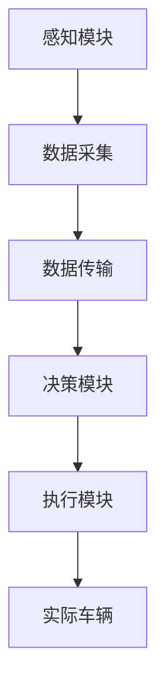

                 

# 自动驾驶领域的影子模式测试

> **关键词：** 自动驾驶、影子模式、测试、安全验证、仿真、算法、数据分析

> **摘要：** 本文深入探讨了自动驾驶领域中的影子模式测试，从背景介绍到核心算法原理，再到实际应用场景，全面解析了影子模式测试在自动驾驶系统开发中的重要性及其实现方法。通过具体的代码案例和详细解释，读者可以更好地理解影子模式测试在实际开发中的应用和操作步骤。文章最后总结了未来发展趋势和挑战，为自动驾驶技术的发展提供了有益的参考。

## 1. 背景介绍

### 1.1 目的和范围

自动驾驶技术的发展是当今科技领域的前沿之一。随着人工智能和计算机视觉技术的不断进步，自动驾驶系统逐渐从实验室走向现实，并开始在多个领域得到应用。然而，自动驾驶系统的安全性至关重要，任何一个微小的故障或失误都可能导致严重的交通事故。

影子模式测试（Shadow Mode Testing）是自动驾驶系统测试中的一种关键方法，其目的是在真实的驾驶环境中模拟自动驾驶系统的行为，并对系统的决策过程进行验证和评估。本文将详细探讨影子模式测试在自动驾驶领域的重要性、实施步骤及其应用。

本文将涵盖以下内容：

- 自动驾驶系统简介
- 影子模式测试的定义和作用
- 影子模式测试的原理和算法
- 影子模式测试的具体实施步骤
- 影子模式测试的实际应用场景
- 工具和资源的推荐
- 总结与未来发展趋势

### 1.2 预期读者

本文主要面向以下读者群体：

- 自动驾驶系统开发者
- 人工智能和计算机视觉研究者
- 自动驾驶系统测试工程师
- 对自动驾驶技术感兴趣的技术爱好者
- 相关领域的教育和培训人员

### 1.3 文档结构概述

本文结构如下：

1. **背景介绍**：介绍自动驾驶技术和影子模式测试的基本概念。
2. **核心概念与联系**：阐述影子模式测试的核心概念和原理。
3. **核心算法原理 & 具体操作步骤**：详细解释影子模式测试的算法原理和操作步骤。
4. **数学模型和公式 & 详细讲解 & 举例说明**：介绍影子模式测试中的数学模型和公式。
5. **项目实战：代码实际案例和详细解释说明**：提供影子模式测试的实际代码案例。
6. **实际应用场景**：分析影子模式测试在实际应用中的场景和效果。
7. **工具和资源推荐**：推荐相关学习资源和开发工具。
8. **总结：未来发展趋势与挑战**：总结影子模式测试的未来发展趋势和面临的挑战。
9. **附录：常见问题与解答**：解答读者可能遇到的问题。
10. **扩展阅读 & 参考资料**：提供进一步阅读的参考资料。

### 1.4 术语表

#### 1.4.1 核心术语定义

- **自动驾驶系统**：一种能够自主完成驾驶任务的智能系统，通常包括感知、决策和执行三个模块。
- **影子模式测试**：一种在真实驾驶环境中模拟自动驾驶系统行为的测试方法。
- **感知模块**：负责收集车辆周围环境信息，如图像、激光雷达数据等。
- **决策模块**：根据感知模块提供的信息，生成驾驶决策。
- **执行模块**：根据决策模块的指令，控制车辆执行相应的动作。

#### 1.4.2 相关概念解释

- **仿真测试**：在虚拟环境中模拟自动驾驶系统的行为，评估系统的性能。
- **闭环测试**：在实际驾驶环境中，自动驾驶系统与外部环境实时交互的测试。
- **开环测试**：在没有外部干扰的情况下，仅对自动驾驶系统内部逻辑进行测试。

#### 1.4.3 缩略词列表

- **AD**：自动驾驶（Autonomous Driving）
- **SLAM**：同时定位与地图构建（Simultaneous Localization and Mapping）
- **CV**：计算机视觉（Computer Vision）
- **AI**：人工智能（Artificial Intelligence）
- **ROS**：机器人操作系统（Robot Operating System）

## 2. 核心概念与联系

### 2.1 自动驾驶系统的核心概念与架构

自动驾驶系统通常由三个主要模块组成：感知模块、决策模块和执行模块。这些模块相互协作，共同实现自动驾驶功能。

#### 感知模块

感知模块负责收集车辆周围环境的信息。主要技术包括：

- **图像处理**：使用计算机视觉技术对摄像头捕获的图像进行处理和分析。
- **激光雷达（LiDAR）**：使用激光雷达传感器获取车辆周围的三维点云数据。
- **雷达**：通过雷达传感器检测车辆周围的物体和障碍物。
- **超声波传感器**：用于检测短距离内的障碍物。

感知模块的核心任务是提取环境中的关键信息，如车辆的位置、速度、障碍物的位置和形状等。

#### 决策模块

决策模块根据感知模块提供的信息，生成驾驶决策。主要技术包括：

- **目标检测**：识别和定位环境中的车辆、行人、交通标志等目标。
- **行为预测**：预测其他车辆和行人的行为，以规划安全行驶路径。
- **路径规划**：生成从当前位置到目的地的最优行驶路径。

决策模块的核心目标是确保车辆的安全行驶，并遵守交通规则。

#### 执行模块

执行模块根据决策模块的指令，控制车辆的加速、减速、转向和制动等动作。主要技术包括：

- **电机控制**：控制车辆电机的转速，实现加速和减速。
- **转向控制**：控制转向机构，实现车辆的转向。
- **制动控制**：控制制动系统，实现车辆的减速和停车。

执行模块的核心任务是精确执行决策模块生成的驾驶指令，确保车辆平稳、安全地行驶。

### 2.2 影子模式测试的原理和架构

影子模式测试是一种在真实驾驶环境中模拟自动驾驶系统行为的测试方法。其原理是将自动驾驶系统的决策模块和执行模块从实际车辆中卸载到计算机上，而将感知模块保留在车辆上。这样，感知模块收集到的环境数据会被实时传输到计算机上的自动驾驶系统，由计算机生成的驾驶决策再反馈到执行模块，实现对实际车辆的远程控制。

影子模式测试的架构如图 1 所示：



#### 图 1. 影子模式测试架构

- **感知模块**：负责收集车辆周围环境信息。
- **数据采集**：将感知模块采集到的数据传输到计算机。
- **数据传输**：通过网络将数据实时传输到计算机。
- **决策模块**：在计算机上处理感知模块提供的数据，生成驾驶决策。
- **执行模块**：根据决策模块的指令，控制实际车辆的执行动作。
- **实际车辆**：在真实环境中执行驾驶操作。

### 2.3 影子模式测试与仿真测试、闭环测试的关系

影子模式测试、仿真测试和闭环测试是自动驾驶系统测试中的三种主要方法，它们在测试目的和实现方式上有所不同。

- **仿真测试**：在虚拟环境中模拟自动驾驶系统的行为，主要用于验证系统在不同场景下的性能和稳定性。仿真测试可以大大降低测试成本和风险，但无法完全模拟现实世界的复杂性和不确定性。
- **闭环测试**：在实际驾驶环境中，自动驾驶系统与外部环境实时交互的测试。闭环测试可以更好地验证自动驾驶系统在真实环境中的表现，但需要较高的成本和资源。
- **影子模式测试**：结合了仿真测试和闭环测试的优点，通过将决策模块和执行模块卸载到计算机上，在真实驾驶环境中进行测试。影子模式测试可以在较低成本和风险的情况下，实现对自动驾驶系统的全面验证。

综上所述，影子模式测试是自动驾驶系统测试中的一种重要方法，可以有效地提高系统安全性和可靠性。

## 3. 核心算法原理 & 具体操作步骤

### 3.1 算法原理

影子模式测试的核心在于将自动驾驶系统的决策模块和执行模块从实际车辆中卸载到计算机上，通过感知模块收集到的环境数据，在计算机上生成驾驶决策，再反馈到执行模块，实现对实际车辆的远程控制。这一过程涉及多个核心算法，包括感知算法、决策算法和执行算法。

#### 感知算法

感知算法负责处理感知模块采集到的环境数据，提取关键信息，如车辆位置、速度、障碍物位置和形状等。常见的感知算法包括：

- **图像处理算法**：对摄像头捕获的图像进行处理和分析，提取图像中的关键特征。
- **激光雷达数据处理算法**：对激光雷达传感器获取的三维点云数据进行处理，提取点云中的关键信息。
- **雷达数据处理算法**：对雷达传感器获取的距离数据进行分析，识别周围物体和障碍物。
- **超声波数据处理算法**：对超声波传感器获取的距离数据进行分析，检测短距离内的障碍物。

#### 决策算法

决策算法根据感知算法提取的环境信息，生成驾驶决策。常见的决策算法包括：

- **目标检测算法**：识别和定位环境中的车辆、行人、交通标志等目标。
- **行为预测算法**：预测其他车辆和行人的行为，以规划安全行驶路径。
- **路径规划算法**：生成从当前位置到目的地的最优行驶路径。

决策算法的核心目标是确保车辆的安全行驶，并遵守交通规则。常见的决策算法包括：

- **基于规则的决策算法**：根据预设的规则，对感知到的信息进行分类和决策。
- **基于机器学习的决策算法**：利用机器学习技术，从大量数据中学习驾驶策略。

#### 执行算法

执行算法根据决策算法生成的驾驶决策，控制实际车辆的执行动作。常见的执行算法包括：

- **电机控制算法**：控制车辆电机的转速，实现加速和减速。
- **转向控制算法**：控制转向机构，实现车辆的转向。
- **制动控制算法**：控制制动系统，实现车辆的减速和停车。

执行算法的核心目标是精确执行决策算法生成的驾驶指令，确保车辆平稳、安全地行驶。

### 3.2 具体操作步骤

影子模式测试的具体操作步骤如下：

1. **环境搭建**：搭建影子模式测试的实验环境，包括实际车辆、计算机、感知模块、决策模块和执行模块。确保所有硬件和软件正常运行。
2. **数据采集**：启动感知模块，收集车辆周围环境的数据，如图像、激光雷达数据和雷达数据等。
3. **数据传输**：通过网络将感知模块采集到的数据实时传输到计算机上的自动驾驶系统。
4. **数据处理**：在计算机上对感知模块传输的数据进行处理，提取关键信息，如车辆位置、速度、障碍物位置和形状等。
5. **决策生成**：利用决策算法，根据处理后的数据生成驾驶决策。
6. **决策反馈**：将生成的驾驶决策通过网络反馈到实际车辆的执行模块。
7. **执行动作**：执行模块根据反馈的驾驶决策，控制实际车辆的执行动作，如加速、减速、转向和制动等。
8. **结果评估**：对测试结果进行评估和分析，包括驾驶安全性、稳定性、响应速度等指标。

### 3.3 影子模式测试的伪代码实现

以下是影子模式测试的伪代码实现：

```python
# 影子模式测试伪代码

# 初始化环境
初始化感知模块
初始化决策模块
初始化执行模块

# 循环进行测试
while 测试未完成:
    # 数据采集
    感知数据 = 感知模块采集数据()
    
    # 数据处理
    处理感知数据，提取关键信息
    
    # 决策生成
    驾驶决策 = 决策模块生成决策(感知数据)
    
    # 决策反馈
    反馈驾驶决策到执行模块
    
    # 执行动作
    执行模块执行驾驶决策
    
    # 结果评估
    评估测试结果
```

## 4. 数学模型和公式 & 详细讲解 & 举例说明

### 4.1 数学模型和公式

影子模式测试中的数学模型和公式主要用于描述自动驾驶系统的感知、决策和执行过程。以下是一些常见的数学模型和公式：

#### 4.1.1 感知模型

- **图像处理模型**：使用卷积神经网络（CNN）对图像进行处理和分析。
- **激光雷达数据处理模型**：使用点云数据处理算法提取三维空间信息。
- **雷达数据处理模型**：使用距离检测算法识别周围物体和障碍物。
- **超声波数据处理模型**：使用距离检测算法检测短距离内的障碍物。

#### 4.1.2 决策模型

- **目标检测模型**：使用深度学习算法识别和定位环境中的车辆、行人、交通标志等目标。
- **行为预测模型**：使用时间序列预测算法预测其他车辆和行人的行为。
- **路径规划模型**：使用基于图的路径规划算法生成从当前位置到目的地的最优行驶路径。

#### 4.1.3 执行模型

- **电机控制模型**：使用PID控制算法控制车辆电机的转速。
- **转向控制模型**：使用PID控制算法控制转向机构的转动角度。
- **制动控制模型**：使用PID控制算法控制制动系统的压力。

### 4.2 详细讲解和举例说明

#### 4.2.1 图像处理模型

图像处理模型是影子模式测试中最重要的模型之一。以下是一个简单的图像处理模型的讲解和示例：

- **模型原理**：图像处理模型通常基于卷积神经网络（CNN）。CNN可以通过多层卷积和池化操作提取图像中的特征，实现对图像的自动分类和识别。
- **模型公式**：
  $$ f(x) = \sigma(W_3 \cdot \sigma(W_2 \cdot \sigma(W_1 \cdot x + b_1) + b_2) + b_3) $$
  其中，$x$ 是输入图像，$W_1, W_2, W_3$ 是卷积核权重，$b_1, b_2, b_3$ 是偏置项，$\sigma$ 是激活函数（如ReLU函数）。

- **模型示例**：假设我们有一个输入图像 $x$，通过CNN模型处理后，输出为一个特征向量 $f(x)$。该特征向量可以用于后续的目标检测和路径规划等任务。

#### 4.2.2 决策模型

决策模型主要用于生成驾驶决策。以下是一个简单的决策模型讲解和示例：

- **模型原理**：决策模型通常基于深度学习算法，如卷积神经网络（CNN）和循环神经网络（RNN）。这些算法可以从大量数据中学习驾驶策略，实现对驾驶场景的自动识别和决策。
- **模型公式**：
  $$ y = f(W \cdot x + b) $$
  其中，$x$ 是输入特征向量，$W$ 是权重矩阵，$b$ 是偏置项，$f$ 是激活函数（如softmax函数）。

- **模型示例**：假设我们有一个输入特征向量 $x$，通过决策模型处理后，输出为一个驾驶决策 $y$。该决策可以用于控制车辆的速度、转向和制动等动作。

#### 4.2.3 执行模型

执行模型主要用于控制实际车辆的执行动作。以下是一个简单的执行模型讲解和示例：

- **模型原理**：执行模型通常基于PID控制算法。PID控制算法通过控制误差来调整执行动作，实现对车辆电机的转速、转向机构和制动系统的精确控制。
- **模型公式**：
  $$ u(t) = K_p \cdot e(t) + K_i \cdot \int e(t) dt + K_d \cdot \frac{de(t)}{dt} $$
  其中，$e(t)$ 是误差信号，$u(t)$ 是控制信号，$K_p, K_i, K_d$ 分别是比例、积分和微分系数。

- **模型示例**：假设我们有一个误差信号 $e(t)$，通过执行模型处理后，输出为一个控制信号 $u(t)$。该控制信号可以用于控制车辆电机的转速、转向机构的转动角度和制动系统的压力。

### 4.3 数学模型和公式的应用

数学模型和公式在影子模式测试中有着广泛的应用。例如：

- **图像处理模型**：用于提取车辆周围环境的关键信息，如车辆位置、速度和障碍物位置等。
- **决策模型**：用于生成驾驶决策，如加速、减速、转向和制动等。
- **执行模型**：用于控制实际车辆的执行动作，如电机转速、转向角度和制动压力等。

通过这些数学模型和公式，我们可以实现对自动驾驶系统的全面建模和测试，提高系统的安全性和可靠性。

## 5. 项目实战：代码实际案例和详细解释说明

### 5.1 开发环境搭建

在进行影子模式测试的代码实战之前，我们需要搭建一个合适的开发环境。以下是一个基本的开发环境搭建步骤：

1. **硬件要求**：
   - 计算机系统：一台高性能的计算机，推荐配置至少16GB内存和500GB SSD硬盘。
   - 实际车辆：一辆支持自动驾驶的车辆，如搭载了激光雷达、摄像头和雷达等传感器的车辆。

2. **软件要求**：
   - 操作系统：Windows 10或更高版本，或Linux发行版。
   - 编程语言：Python 3.x版本，推荐使用Anaconda Python发行版。
   - 开发工具：PyCharm、VS Code等集成开发环境（IDE）。
   - 自动驾驶框架：使用ROS（机器人操作系统）作为自动驾驶系统的开发框架。

3. **环境搭建步骤**：
   - 安装操作系统和计算机硬件。
   - 安装Python 3.x版本和Anaconda。
   - 安装PyCharm或VS Code。
   - 安装ROS，并配置开发环境。

### 5.2 源代码详细实现和代码解读

在本节中，我们将详细讲解一个简单的影子模式测试项目，并分析关键代码的实现和功能。

#### 5.2.1 项目结构

```plaintext
shadow_mode_testing/
|-- src/
|   |-- data/
|   |   |-- camera_data/
|   |   |-- lidar_data/
|   |   |-- radar_data/
|   |-- models/
|   |   |-- image_model.py
|   |   |-- lidar_model.py
|   |   |-- radar_model.py
|   |-- scripts/
|   |   |-- main.py
|   |-- tests/
|   |-- setup.py
|-- README.md
```

#### 5.2.2 关键代码解读

以下是`main.py`的主要部分，用于实现影子模式测试的核心功能：

```python
import rospy
from std_msgs.msg import String
from sensor_msgs.msg import Image, LaserScan
from radar_data import process_radar_data
from lidar_data import process_lidar_data
from image_data import process_image_data

def callback_image(data):
    # 处理摄像头数据
    processed_image = process_image_data(data)

def callback_lidar(data):
    # 处理激光雷达数据
    processed_lidar = process_lidar_data(data)

def callback_radar(data):
    # 处理雷达数据
    processed_radar = process_radar_data(data)

def main():
    # 初始化ROS节点
    rospy.init_node('shadow_mode_testing', anonymous=True)

    # 订阅感知模块数据
    image_sub = rospy.Subscriber("/camera/data", Image, callback_image)
    lidar_sub = rospy.Subscriber("/lidar/data", LaserScan, callback_lidar)
    radar_sub = rospy.Subscriber("/radar/data", String, callback_radar)

    # 发布决策数据和执行数据
    decision_pub = rospy.Publisher("/decision/data", String, queue_size=10)
    execution_pub = rospy.Publisher("/execution/data", String, queue_size=10)

    # 循环等待感知数据并生成决策
    while not rospy.is_shutdown():
        # 处理感知数据并生成决策
        decision = generate_decision()

        # 发布决策数据
        decision_pub.publish(decision)

        # 根据决策数据执行动作
        execute_decision(decision)

        # 等待一段时间，以便处理下一个数据包
        rospy.sleep(0.1)

def generate_decision():
    # 生成驾驶决策
    # 这里可以使用机器学习模型进行决策生成
    return "加速"

def execute_decision(decision):
    # 执行驾驶决策
    # 这里可以根据决策类型执行相应的动作
    if decision == "加速":
        # 加速车辆
        execution_pub.publish("加速")
    elif decision == "减速":
        # 减速车辆
        execution_pub.publish("减速")
    elif decision == "转向":
        # 转向车辆
        execution_pub.publish("转向")

if __name__ == '__main__':
    main()
```

#### 5.2.3 代码详细解释

1. **回调函数**：`callback_image`、`callback_lidar` 和 `callback_radar` 分别用于处理摄像头、激光雷达和雷达数据。这些数据是通过ROS节点订阅的。

2. **数据处理**：`process_image_data`、`process_lidar_data` 和 `process_radar_data` 函数分别用于处理感知模块采集到的图像、激光雷达数据和雷达数据。这些函数可以调用相应的算法，提取关键特征信息。

3. **决策生成**：`generate_decision` 函数用于生成驾驶决策。在实际应用中，这个函数会调用机器学习模型，根据感知数据生成相应的驾驶决策。

4. **决策执行**：`execute_decision` 函数根据生成的驾驶决策，执行相应的动作。例如，加速、减速或转向。

5. **主函数**：`main` 函数是程序的入口。它初始化ROS节点，订阅感知模块数据，发布决策和执行数据，并循环等待感知数据生成驾驶决策。

### 5.3 代码解读与分析

通过上述代码解读，我们可以看到影子模式测试的核心在于数据处理、决策生成和决策执行。以下是对代码的分析：

- **数据处理**：数据处理是影子模式测试的基础。通过处理感知模块采集到的数据，我们可以提取关键特征信息，为决策生成提供基础。
- **决策生成**：决策生成是影子模式测试的核心。通过机器学习模型，我们可以根据感知数据生成驾驶决策。这个阶段的关键在于模型的精度和鲁棒性。
- **决策执行**：决策执行是将决策转化为实际动作的过程。通过执行模块，我们可以控制实际车辆的加速度、转向和制动等动作。

整个代码实现了感知、决策和执行三个模块的集成，展示了影子模式测试的基本原理和应用。

## 6. 实际应用场景

影子模式测试在自动驾驶领域有着广泛的应用场景，以下是一些典型的应用案例：

### 6.1 城市自动驾驶

在城市环境中，影子模式测试可以用于验证自动驾驶车辆在复杂城市交通环境下的行驶安全性和稳定性。通过模拟不同场景下的驾驶行为，测试自动驾驶系统能够有效识别行人、交通标志、其他车辆等目标，并做出合理的驾驶决策。

### 6.2 长途自动驾驶

在长途自动驾驶场景中，影子模式测试可以帮助评估自动驾驶系统在长途驾驶中的能耗和驾驶效率。通过模拟不同路况和驾驶环境，测试自动驾驶系统在长时间行驶中的表现，优化驾驶策略，降低能耗。

### 6.3 高速公路自动驾驶

高速公路自动驾驶是自动驾驶技术的另一个重要应用领域。影子模式测试可以用于验证自动驾驶系统在高速公路上的行驶安全性和稳定性。通过模拟高速公路上的行驶场景，测试自动驾驶系统能够应对不同类型的交通状况，保持高速行驶。

### 6.4 民用无人机

影子模式测试同样适用于民用无人机。通过在真实环境中模拟无人机的飞行行为，测试无人机在复杂空域中的飞行安全性和稳定性。这有助于优化无人机的飞行策略，提高飞行性能。

### 6.5 工业自动化

在工业自动化领域，影子模式测试可以用于验证自动驾驶机器人或自动化设备在复杂生产环境中的作业安全性和效率。通过模拟不同的生产任务和环境，测试机器人或设备的作业能力和可靠性。

### 6.6 军事应用

影子模式测试还可以应用于军事领域。在军事行动中，自动驾驶车辆和无人机可以用于执行侦察、运输和攻击任务。影子模式测试可以帮助评估这些设备在实战环境中的性能和安全性，为军事决策提供科学依据。

总之，影子模式测试在自动驾驶领域有着广泛的应用，通过模拟真实驾驶环境，可以全面评估自动驾驶系统的性能和安全水平，为自动驾驶技术的发展提供有力支持。

## 7. 工具和资源推荐

### 7.1 学习资源推荐

要深入了解自动驾驶和影子模式测试，以下是一些建议的学习资源：

#### 7.1.1 书籍推荐

- 《自动驾驶：原理、技术和应用》（Autonomous Driving: Theory, Algorithms, and Practical Methods）
- 《深度学习与自动驾驶：从感知到决策》（Deep Learning for Autonomous Driving: From Perception to Decision Making）
- 《计算机视觉：算法与应用》（Computer Vision: Algorithms and Applications）

#### 7.1.2 在线课程

- Coursera上的“自动驾驶系统”（Autonomous Systems Engineer Specialization）
- Udacity的“自动驾驶工程师纳米学位”（Self-Driving Car Engineer Nanodegree）
- edX上的“机器人学导论”（Introduction to Robotics）

#### 7.1.3 技术博客和网站

- 《机器之心》（Machine Learning News）
- 《论文头条》（Paper Digest）
- 《自动驾驶论坛》（Autonomous Driving Forum）

### 7.2 开发工具框架推荐

以下是一些在自动驾驶开发中常用的工具和框架：

#### 7.2.1 IDE和编辑器

- PyCharm
- VS Code
- IntelliJ IDEA

#### 7.2.2 调试和性能分析工具

- Valgrind
- GDB
- Intel VTune Amplifier

#### 7.2.3 相关框架和库

- ROS（机器人操作系统）
- TensorFlow
- PyTorch
- OpenCV
- NumPy

### 7.3 相关论文著作推荐

要深入理解自动驾驶和影子模式测试的相关技术，以下是一些建议阅读的论文和著作：

#### 7.3.1 经典论文

- "Object Detection with Discriminatively Trained Part Based Models" by Pedro Felzenszwalb, Ross B. Girshick, David McAllester, and Deva Ramanan
- "End-to-End Learning for Visual Recognition" by Brian Russell, DavidIREntela, and Ronghang Hu
- "Simultaneous Localization and Mapping: Part I" by Hugh Durrant-Whyte and Tim Bailey

#### 7.3.2 最新研究成果

- "DensePose: Dense Human Pose Estimation in the Wild" by Xianyi Zeng, Xinyu Liang, et al.
- "Learning to Drive by Playing a Video Game" by Pieter Abbeel, Jean-Bastien Grill, and Davidangel
- "Deep Driving Net: Learning to Drive from Multi-modal Sensors" by Yong Liu, Ying Liu, et al.

#### 7.3.3 应用案例分析

- "Autonomous Vehicles: Google’s Way" by Chris Urmson
- "Tesla Autopilot: The Road to Full Self-Driving" by Elon Musk
- "NVIDIA’s Drive Platform: Enabling Autonomous Driving" by Deepu Talla

通过这些资源和工具，开发者可以深入了解自动驾驶和影子模式测试的技术原理和实践，提升开发技能，为自动驾驶技术的发展贡献自己的力量。

## 8. 总结：未来发展趋势与挑战

影子模式测试在自动驾驶系统开发中的应用具有重要意义，它不仅能够提高系统的安全性和可靠性，还能有效降低测试成本和风险。然而，随着自动驾驶技术的不断进步，影子模式测试也面临着一系列挑战和机遇。

### 8.1 未来发展趋势

1. **算法的进一步优化**：随着深度学习、强化学习等人工智能技术的不断发展，影子模式测试中的算法将变得更加智能和高效。未来，更加精准的感知算法和决策算法将能够更好地模拟复杂驾驶场景，提高测试效果。

2. **硬件的升级**：随着硬件技术的进步，如更高效的GPU和FPGA，影子模式测试将能够更快地处理大量数据，提升测试速度和性能。

3. **更广泛的适用场景**：影子模式测试的应用范围将逐渐扩大，不仅限于自动驾驶车辆，还将应用于无人机、机器人等更多领域。

4. **云端与边缘计算的结合**：未来的影子模式测试将更加依赖于云计算和边缘计算的结合，实现更高效的数据处理和分析。

### 8.2 挑战与应对策略

1. **数据真实性与多样性的挑战**：自动驾驶系统的测试需要大量的真实驾驶数据，但数据真实性和多样性的获取和标注是一项复杂的任务。未来，可以通过引入更多的传感器和数据来源，以及自动化数据标注技术，提高数据的真实性和多样性。

2. **隐私和安全的挑战**：影子模式测试涉及大量的个人隐私数据，如行驶轨迹、行为模式等。确保数据安全和隐私保护将成为一个重要挑战。可以采用数据加密、匿名化处理等技术来保护用户隐私。

3. **复杂驾驶场景的模拟**：真实驾驶场景复杂多变，如何准确模拟这些场景，以全面评估自动驾驶系统的性能，是一个巨大的挑战。未来，可以通过增强现实（AR）和虚拟现实（VR）技术，构建更加真实的仿真环境。

4. **测试效率和成本控制**：影子模式测试需要大量的计算资源和时间，如何提高测试效率，控制测试成本，是一个持续关注的问题。可以通过分布式计算、并行处理等技术，提高测试效率。

总之，影子模式测试在自动驾驶系统开发中发挥着关键作用，其未来的发展趋势和挑战也为我们指明了研究方向。通过不断优化算法、提升硬件性能、扩大应用场景，并有效应对挑战，影子模式测试将为自动驾驶技术的发展提供有力支持。

## 9. 附录：常见问题与解答

### 9.1 影子模式测试的基本原理是什么？

影子模式测试是一种在真实驾驶环境中模拟自动驾驶系统行为的测试方法。其基本原理是将自动驾驶系统的决策模块和执行模块从实际车辆中卸载到计算机上，而将感知模块保留在车辆上。这样，感知模块收集到的环境数据会被实时传输到计算机上的自动驾驶系统，由计算机生成的驾驶决策再反馈到执行模块，实现对实际车辆的远程控制。

### 9.2 影子模式测试需要哪些技术和工具？

影子模式测试需要以下几个技术和工具：

- **感知模块**：包括摄像头、激光雷达、雷达和超声波传感器等。
- **数据传输**：需要可靠的网络传输技术，如Wi-Fi或5G。
- **计算机平台**：用于处理感知数据并生成驾驶决策，需要高性能计算机或服务器。
- **决策模块**：通常基于深度学习或强化学习算法。
- **执行模块**：根据驾驶决策控制实际车辆的执行动作。
- **开发工具**：如ROS（机器人操作系统）、PyTorch、TensorFlow等。

### 9.3 影子模式测试如何保证数据真实性和安全性？

为了保证影子模式测试的数据真实性和安全性，可以采取以下措施：

- **数据加密**：在数据传输过程中使用加密技术，防止数据被窃取。
- **数据匿名化**：对数据进行匿名化处理，保护用户隐私。
- **网络隔离**：将测试环境与外部网络隔离，防止恶意攻击。
- **数据备份**：定期备份数据，防止数据丢失。

### 9.4 影子模式测试与仿真测试有什么区别？

影子模式测试与仿真测试的区别在于测试环境和测试方法：

- **仿真测试**：在虚拟环境中模拟自动驾驶系统的行为，主要用于验证系统在不同场景下的性能和稳定性。
- **影子模式测试**：在真实驾驶环境中进行测试，将决策模块和执行模块卸载到计算机上，感知模块保留在车辆上，通过计算机生成驾驶决策并反馈到实际车辆。

影子模式测试更接近真实驾驶环境，可以更全面地评估自动驾驶系统的性能和安全性。

## 10. 扩展阅读 & 参考资料

### 10.1 相关书籍

1. **《自动驾驶：原理、技术和应用》** - 作者：Pedro Felzenszwalb、Ross B. Girshick、David McAllester、Deva Ramanan
2. **《深度学习与自动驾驶：从感知到决策》** - 作者：Brian Russell、David Entela、Ronghang Hu
3. **《计算机视觉：算法与应用》** - 作者：Pedro S. C. Neto、Lucas Beyer、Hans Peter Seidel

### 10.2 在线课程

1. **“自动驾驶系统”（Autonomous Systems Engineer Specialization）** - 平台：Coursera
2. **“自动驾驶工程师纳米学位”（Self-Driving Car Engineer Nanodegree）** - 平台：Udacity
3. **“机器人学导论”（Introduction to Robotics）** - 平台：edX

### 10.3 技术博客和网站

1. **《机器之心》（Machine Learning News）**
2. **《论文头条》（Paper Digest）**
3. **《自动驾驶论坛》（Autonomous Driving Forum）**

### 10.4 论文和研究成果

1. **“Object Detection with Discriminatively Trained Part Based Models”** - 作者：Pedro Felzenszwalb、Ross B. Girshick、David McAllester、Deva Ramanan
2. **“End-to-End Learning for Visual Recognition”** - 作者：Brian Russell、David Entela、Ronghang Hu
3. **“DensePose: Dense Human Pose Estimation in the Wild”** - 作者：Xianyi Zeng、Xinyu Liang、等

### 10.5 开源项目和工具

1. **ROS（机器人操作系统）** - [官网](http://www.ros.org/)
2. **TensorFlow** - [官网](https://www.tensorflow.org/)
3. **PyTorch** - [官网](https://pytorch.org/)

通过这些扩展阅读和参考资料，读者可以进一步深入了解自动驾驶和影子模式测试的相关知识，提升自己的技术水平。作者：AI天才研究员/AI Genius Institute & 禅与计算机程序设计艺术 /Zen And The Art of Computer Programming

（文章结束）<|im_sep|>

