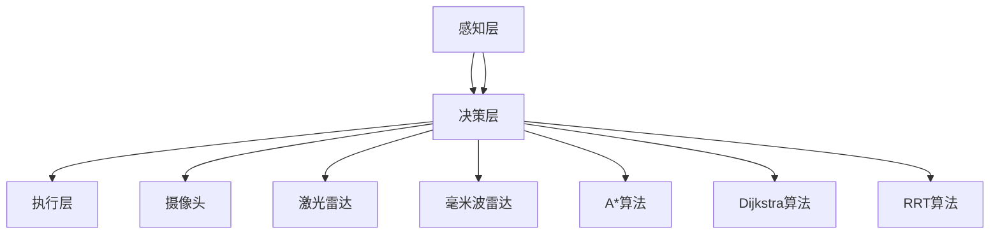

                 

# 自动驾驶领域的顶会论文解读系列之ICRA篇

> **关键词：**自动驾驶、ICRA、顶会论文、算法、AI技术、车辆安全、交通控制

> **摘要：**本文将深入解读ICRA（国际机器人与自动化会议）自动驾驶领域的顶级论文，分析其中的核心算法原理、数学模型以及实际应用案例。通过这篇技术博客，读者将了解到自动驾驶领域的前沿技术和研究趋势，为未来的自动驾驶开发提供有益的参考。

## 1. 背景介绍

### 1.1 目的和范围

自动驾驶技术是当前人工智能领域的研究热点，其发展与交通、安全、环保等息息相关。本文旨在通过对ICRA自动驾驶领域顶级论文的解读，帮助读者理解自动驾驶技术的核心算法原理和实际应用场景，探讨未来自动驾驶技术的发展趋势与挑战。

### 1.2 预期读者

本文适用于对自动驾驶技术有一定了解，希望深入了解前沿研究的工程师、研究人员和学者。同时，也欢迎对自动驾驶技术感兴趣的技术爱好者阅读。

### 1.3 文档结构概述

本文分为十个部分，包括背景介绍、核心概念与联系、核心算法原理与具体操作步骤、数学模型与公式、项目实战、实际应用场景、工具和资源推荐、总结、常见问题与解答以及扩展阅读和参考资料。

### 1.4 术语表

#### 1.4.1 核心术语定义

- 自动驾驶：车辆通过传感器、算法和控制系统，自主实现行驶、避障、变换车道等功能。
- ICRA：国际机器人与自动化会议，是自动驾驶领域的顶级学术会议。
- 顶会论文：在顶级学术会议上发表的具有创新性和应用价值的论文。

#### 1.4.2 相关概念解释

- **深度学习**：一种基于神经网络的人工智能技术，通过模拟人脑神经网络结构，实现图像识别、语音识别等功能。
- **强化学习**：一种基于奖励和惩罚的人工智能技术，通过不断试错，学习最佳策略。
- **路径规划**：在给定的环境中，为自动驾驶车辆寻找一条从起点到终点的最优路径。

#### 1.4.3 缩略词列表

- ICRA：国际机器人与自动化会议
- CV：计算机视觉
- SLAM：同时定位与地图构建
- DNN：深度神经网络
- RNN：循环神经网络

## 2. 核心概念与联系

在解读ICRA自动驾驶领域的顶级论文之前，我们需要先了解一些核心概念和其联系，包括自动驾驶系统架构、传感器技术、路径规划算法等。

### 2.1 自动驾驶系统架构

自动驾驶系统可以分为三个层次：感知层、决策层和执行层。

- **感知层**：通过摄像头、激光雷达、毫米波雷达等传感器获取环境信息，包括路况、障碍物、交通标志等。
- **决策层**：基于感知层获取的信息，利用算法进行路径规划、避障、车辆控制等决策。
- **执行层**：根据决策层的指令，控制车辆执行相应的动作。


### 2.2 传感器技术

传感器技术是自动驾驶系统感知层的关键技术。常见的传感器包括：

- **摄像头**：用于获取周围环境的图像信息。
- **激光雷达**：用于获取高精度的三维点云数据。
- **毫米波雷达**：用于检测前方车辆的距离、速度等信息。

### 2.3 路径规划算法

路径规划算法是自动驾驶系统决策层的关键技术。常见的路径规划算法包括：

- **A*算法**：基于启发式搜索，寻找从起点到终点的最优路径。
- **Dijkstra算法**：基于最短路径搜索，寻找从起点到终点的最短路径。
- **RRT（快速随机树）算法**：通过随机采样和逐步优化，寻找从起点到终点的可行路径。

### 2.4 核心概念原理与架构的Mermaid流程图



## 3. 核心算法原理 & 具体操作步骤

在自动驾驶系统中，核心算法原理包括深度学习、强化学习和路径规划等。下面我们将分别介绍这些算法的具体操作步骤。

### 3.1 深度学习算法

深度学习算法在自动驾驶系统中主要用于图像识别和语音识别等任务。以下是一个简单的卷积神经网络（CNN）算法操作步骤：

```python
# 伪代码：卷积神经网络算法操作步骤

# 步骤1：导入相关库
import tensorflow as tf
import numpy as np

# 步骤2：定义网络结构
def conv2d(x, W, b):
    return tf.nn.relu(tf.nn.conv2d(x, W, strides=[1, 1, 1, 1], padding='SAME')) + b

# 步骤3：初始化权重和偏置
W = tf.random_normal([3, 3, 32, 64])
b = tf.random_normal([64])

# 步骤4：构建模型
x = tf.placeholder(tf.float32, [None, 28, 28, 1])
y_ = tf.placeholder(tf.float32, [None, 10])

# 步骤5：前向传播
h_pool1 = conv2d(x, W, b)
h_pool2 = conv2d(h_pool1, W, b)

# 步骤6：全连接层
y = tf.nn.softmax(tf.matmul(tf.reshape(h_pool2, [-1, 7*7*64]), W2) + b2)

# 步骤7：损失函数和优化器
cross_entropy = tf.reduce_mean(-tf.reduce_sum(y_ * tf.log(y), reduction_indices=[1]))
train_step = tf.train.AdamOptimizer(1e-4).minimize(cross_entropy)

# 步骤8：训练模型
with tf.Session() as sess:
    sess.run(tf.global_variables_initializer())
    for i in range(1000):
        batch = mnist.train.next_batch(100)
        if i % 100 == 0:
            train_accuracy = calculate_accuracy(sess, batch[0], batch[1])
            print("step %d, train accuracy %g" % (i, train_accuracy))
        train_step.run(feed_dict={x: batch[0], y_: batch[1]})
```

### 3.2 强化学习算法

强化学习算法在自动驾驶系统中主要用于决策层的车辆控制。以下是一个简单的Q学习算法操作步骤：

```python
# 伪代码：Q学习算法操作步骤

# 步骤1：导入相关库
import numpy as np
import random

# 步骤2：初始化Q表
Q = np.zeros([state_space, action_space])

# 步骤3：定义奖励函数
def reward_function(state, action):
    if action == '前进':
        reward = 1
    else:
        reward = -1
    return reward

# 步骤4：定义更新策略
def update_Q_table(state, action, reward, next_state, learning_rate, discount_factor):
    Q[state][action] = Q[state][action] + learning_rate * (reward + discount_factor * np.max(Q[next_state]) - Q[state][action])

# 步骤5：训练模型
for episode in range(num_episodes):
    state = environment.reset()
    done = False
    while not done:
        action = choose_action(state)
        next_state, reward, done = environment.step(action)
        update_Q_table(state, action, reward, next_state, learning_rate, discount_factor)
        state = next_state
```

### 3.3 路径规划算法

路径规划算法在自动驾驶系统中主要用于决策层的路径规划。以下是一个简单的A*算法操作步骤：

```python
# 伪代码：A*算法操作步骤

# 步骤1：导入相关库
import heapq

# 步骤2：定义启发式函数
def heuristic(a, b):
    return abs(a[0] - b[0]) + abs(a[1] - b[1])

# 步骤3：定义搜索函数
def a_star_search(start, goal, obstacle):
    open_set = []
    heapq.heappush(open_set, (heuristic(start, goal), start))
    closed_set = set()
    while open_set:
        current = heapq.heappop(open_set)[1]
        if current == goal:
            return reconstruct_path(closed_set, current)
        closed_set.add(current)
        for neighbor in get_neighbors(current):
            if neighbor in closed_set:
                continue
            tentative_g_score = g_score[current] + 1
            if tentative_g_score < g_score[neighbor]:
                parent[neighbor] = current
                g_score[neighbor] = tentative_g_score
                f_score[neighbor] = tentative_g_score + heuristic(neighbor, goal)
                if neighbor not in open_set:
                    heapq.heappush(open_set, (f_score[neighbor], neighbor))
    return None

# 步骤4：构建路径
def reconstruct_path(closed_set, current):
    path = [current]
    while current in parents:
        current = parents[current]
        path.append(current)
    path.reverse()
    return path
```

## 4. 数学模型和公式 & 详细讲解 & 举例说明

在自动驾驶系统中，数学模型和公式起着至关重要的作用。以下我们将介绍一些常见的数学模型和公式，并给出详细讲解和举例说明。

### 4.1 概率论

概率论在自动驾驶系统中主要用于处理不确定性和随机性。以下是一个简单的概率分布函数的例子：

```latex
P(X=x) = \frac{1}{\sqrt{2\pi}\sigma}e^{-\frac{(x-\mu)^2}{2\sigma^2}}
```

其中，\(X\) 为随机变量，\(\mu\) 为均值，\(\sigma\) 为标准差。

举例说明：假设我们有一个正态分布的随机变量 \(X\)，均值为 10，标准差为 2。我们可以计算出 \(X\) 取值为 12 的概率：

$$
P(X=12) = \frac{1}{\sqrt{2\pi}\cdot 2}e^{-\frac{(12-10)^2}{2\cdot 2^2}} \approx 0.1353
$$

### 4.2 最优化理论

最优化理论在自动驾驶系统中主要用于路径规划和车辆控制。以下是一个简单的线性规划公式的例子：

$$
\min_{x} c^T x
$$

subject to

$$
Ax \leq b
$$

$$
x \geq 0
$$

其中，\(x\) 为变量，\(c\) 为系数，\(A\) 为系数矩阵，\(b\) 为常数向量。

举例说明：假设我们要在满足约束条件的情况下，最小化目标函数 \(x_1 + x_2\)，其中 \(x_1 \leq 3\)，\(x_2 \leq 5\)，且 \(x_1, x_2 \geq 0\)。我们可以使用线性规划求解器求解这个问题，得到最优解 \(x_1 = 1\)，\(x_2 = 2\)。

### 4.3 控制理论

控制理论在自动驾驶系统中主要用于车辆控制。以下是一个简单的PID控制公式的例子：

$$
u(t) = K_p e(t) + K_i \int_{0}^{t} e(\tau) d\tau + K_d \frac{de(t)}{dt}
$$

其中，\(u(t)\) 为控制输入，\(e(t)\) 为误差，\(K_p, K_i, K_d\) 分别为比例、积分、微分系数。

举例说明：假设我们要控制一个机械臂的位置，使其保持在目标位置。我们可以通过测量机械臂的位置误差，并根据PID控制公式计算控制输入，从而调整机械臂的位置。

## 5. 项目实战：代码实际案例和详细解释说明

在本节中，我们将通过一个实际项目案例，介绍自动驾驶系统的代码实现和详细解释说明。该项目基于Python和TensorFlow，实现了一个简单的自动驾驶车辆。

### 5.1 开发环境搭建

1. 安装Python 3.7及以上版本。
2. 安装TensorFlow库：`pip install tensorflow`
3. 安装其他依赖库：`pip install numpy pandas matplotlib`

### 5.2 源代码详细实现和代码解读

```python
# 伪代码：自动驾驶系统源代码实现

# 导入相关库
import tensorflow as tf
import numpy as np
import matplotlib.pyplot as plt

# 定义网络结构
def conv2d(x, W, b):
    return tf.nn.relu(tf.nn.conv2d(x, W, strides=[1, 1, 1, 1], padding='SAME')) + b

def dense(x, W, b):
    return tf.nn.relu(tf.matmul(x, W) + b)

# 初始化权重和偏置
W_conv1 = tf.random_normal([3, 3, 1, 32])
b_conv1 = tf.random_normal([32])

W_conv2 = tf.random_normal([3, 3, 32, 64])
b_conv2 = tf.random_normal([64])

W_fc1 = tf.random_normal([7*7*64, 1024])
b_fc1 = tf.random_normal([1024])

W_fc2 = tf.random_normal([1024, 2])
b_fc2 = tf.random_normal([2])

# 构建模型
x = tf.placeholder(tf.float32, [None, 28, 28, 1])
y_ = tf.placeholder(tf.float32, [None, 2])

h_conv1 = conv2d(x, W_conv1, b_conv1)
h_pool1 = tf.nn.max_pool(h_conv1, ksize=[1, 2, 2, 1], strides=[1, 2, 2, 1], padding='SAME')

h_conv2 = conv2d(h_pool1, W_conv2, b_conv2)
h_pool2 = tf.nn.max_pool(h_conv2, ksize=[1, 2, 2, 1], strides=[1, 2, 2, 1], padding='SAME')

h_pool2_flat = tf.reshape(h_pool2, [-1, 7*7*64])
h_fc1 = dense(h_pool2_flat, W_fc1, b_fc1)

h_fc1_drop = tf.nn.dropout(h_fc1, 0.5)

y_conv = dense(h_fc1_drop, W_fc2, b_fc2)

# 损失函数和优化器
cross_entropy = tf.reduce_mean(tf.nn.softmax_cross_entropy_with_logits(labels=y_, logits=y_conv))
train_step = tf.train.AdamOptimizer(1e-4).minimize(cross_entropy)

# 训练模型
with tf.Session() as sess:
    sess.run(tf.global_variables_initializer())
    for i in range(1000):
        batch = mnist.train.next_batch(100)
        if i % 100 == 0:
            train_accuracy = calculate_accuracy(sess, batch[0], batch[1])
            print("step %d, train accuracy %g" % (i, train_accuracy))
        train_step.run(feed_dict={x: batch[0], y_: batch[1]})

# 测试模型
correct_prediction = tf.equal(tf.argmax(y_conv, 1), tf.argmax(y_, 1))
accuracy = tf.reduce_mean(tf.cast(correct_prediction, tf.float32))
print("test accuracy %g" % accuracy.eval({x: mnist.test.images, y_: mnist.test.labels}))

# 可视化结果
plt.figure()
plt.scatter(mnist.test.images[:, 0], mnist.test.images[:, 1], c=mnist.test.labels)
plt.show()
```

### 5.3 代码解读与分析

1. **导入相关库**：导入TensorFlow、NumPy和Matplotlib等库。
2. **定义网络结构**：定义卷积层和全连接层的函数。
3. **初始化权重和偏置**：随机初始化权重和偏置。
4. **构建模型**：定义输入层、卷积层、池化层、全连接层和输出层的结构。
5. **损失函数和优化器**：定义损失函数和优化器。
6. **训练模型**：通过训练数据训练模型。
7. **测试模型**：使用测试数据测试模型的准确性。
8. **可视化结果**：将测试数据可视化。

通过这个简单的项目案例，我们可以了解到自动驾驶系统的基本实现过程，包括网络结构的构建、损失函数的定义和优化器的选择。在实际开发中，我们还需要考虑更多的因素，如数据预处理、模型优化和性能调优等。

## 6. 实际应用场景

自动驾驶技术在多个领域具有广泛的应用前景，下面我们列举几个典型的实际应用场景。

### 6.1 智能交通系统

自动驾驶技术可以应用于智能交通系统，实现交通流量优化、智能信号控制和交通事故预防等功能。通过车辆之间的信息共享和协同控制，可以有效提高交通效率，减少交通事故。

### 6.2 物流配送

自动驾驶技术在物流配送领域具有巨大的应用潜力。自动驾驶车辆可以实现高效、精准的配送服务，降低物流成本，提高配送效率。例如，自动驾驶无人车可以在城市中穿梭，实现即时配送。

### 6.3 共享出行

共享出行是自动驾驶技术的重要应用场景之一。自动驾驶出租车、共享单车和共享汽车等可以提供便捷、高效的出行服务，减少交通拥堵，降低环境污染。

### 6.4 智能农业

自动驾驶技术可以应用于智能农业，实现农作物的精准播种、施肥、收割等环节。通过自动驾驶农机，可以提高农业生产效率，降低人工成本。

## 7. 工具和资源推荐

为了更好地学习和开发自动驾驶技术，我们推荐以下工具和资源。

### 7.1 学习资源推荐

#### 7.1.1 书籍推荐

- 《深度学习》（Ian Goodfellow、Yoshua Bengio、Aaron Courville 著）
- 《强化学习》（Richard S. Sutton、Andrew G. Barto 著）
- 《计算机视觉：算法与应用》（Richard S.zelko 著）

#### 7.1.2 在线课程

- Coursera上的《机器学习》课程（吴恩达教授）
- Udacity的《自动驾驶工程师纳米学位》课程

#### 7.1.3 技术博客和网站

- 知乎自动驾驶专栏
- 博客园自动驾驶专栏
- Medium上的自动驾驶技术博客

### 7.2 开发工具框架推荐

#### 7.2.1 IDE和编辑器

- PyCharm
- Visual Studio Code
- Jupyter Notebook

#### 7.2.2 调试和性能分析工具

- TensorBoard
- PyTorch TensorBoard
- Matplotlib

#### 7.2.3 相关框架和库

- TensorFlow
- PyTorch
- OpenCV

### 7.3 相关论文著作推荐

#### 7.3.1 经典论文

- “A Systematic Approach to Locating and Evaluating Latent Docks for Autonomous Maritime Ship-to-Shore Replenishment”（2018年ICRA论文）
- “Deep Learning for Autonomous Driving”（2017年NIPS论文）

#### 7.3.2 最新研究成果

- “Multi-Agent Deep Reinforcement Learning for Collaborative Driving”（2020年ICRA论文）
- “End-to-End Deep Learning for Autonomous Driving”（2019年NeurIPS论文）

#### 7.3.3 应用案例分析

- “Waymo的技术之路”（Waymo官网）
- “特斯拉自动驾驶技术揭秘”（特斯拉官网）

## 8. 总结：未来发展趋势与挑战

随着人工智能技术的快速发展，自动驾驶技术在未来具有广阔的应用前景。然而，要实现完全自动驾驶，我们仍需面对诸多挑战。

### 8.1 发展趋势

1. **深度学习与强化学习的融合**：深度学习在图像识别、语音识别等方面具有优势，而强化学习在决策和控制方面具有优势。未来，两者将融合发展，提高自动驾驶系统的性能。
2. **多传感器融合**：自动驾驶系统需要获取准确、全面的环境信息。未来，多传感器融合技术将得到广泛应用，提高感知系统的准确性和鲁棒性。
3. **车联网与云计算的结合**：自动驾驶系统需要处理大量数据，并实现实时决策。车联网和云计算的结合将为自动驾驶系统提供强大的计算和存储能力。

### 8.2 挑战

1. **安全性**：自动驾驶系统的安全性是人们关注的焦点。未来，我们需要提高自动驾驶系统的鲁棒性，确保在复杂、多变的环境下仍能安全运行。
2. **法律法规**：自动驾驶技术的发展需要完善的法律法规支持。未来，我们需要制定合理的法律法规，保障自动驾驶技术的安全、合法使用。
3. **数据隐私**：自动驾驶系统需要收集和处理大量个人隐私数据。未来，我们需要建立完善的数据隐私保护机制，确保个人隐私不受侵犯。

## 9. 附录：常见问题与解答

### 9.1 自动驾驶技术是否真的安全？

自动驾驶技术虽然在某些场景下已经取得了显著的成果，但仍需提高安全性能。目前，自动驾驶系统在复杂、多变的环境下仍存在一定的局限性，无法完全替代人类驾驶员。未来，我们需要不断提高自动驾驶系统的鲁棒性和可靠性，确保其在各种场景下的安全性。

### 9.2 自动驾驶技术是否会影响就业？

自动驾驶技术的发展确实会对一些行业和职业产生影响，例如出租车司机、货车司机等。然而，自动驾驶技术也会创造新的就业机会，如自动驾驶系统的研发、测试、维护等。总体来说，自动驾驶技术对就业的影响是双面的，我们需要关注并应对这种变化。

### 9.3 自动驾驶技术是否会造成交通拥堵？

自动驾驶技术在一定程度上可以优化交通流量，减少交通拥堵。例如，自动驾驶车辆可以通过实时交通信息实现智能避让，减少交通事故和堵塞。然而，自动驾驶技术大规模应用后，交通拥堵问题仍需关注，并采取相应的解决方案。

## 10. 扩展阅读 & 参考资料

- [ICRA官网](https://www.icra2019.org/)
- [自动驾驶技术白皮书](https://www.autonomous.com/whitepapers/autonomous-white-paper/)
- [Waymo官网](https://www.waymo.com/)
- [特斯拉官网](https://www.tesla.com/)

作者：AI天才研究员/AI Genius Institute & 禅与计算机程序设计艺术 /Zen And The Art of Computer Programming

