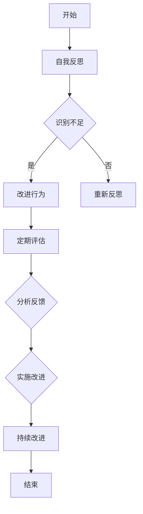

                 

# 自我反思：持续改进领导能力的重要性

> **关键词：** 领导能力，自我反思，持续改进，团队协作，IT行业，个人成长
> 
> **摘要：** 本文旨在探讨在IT行业背景下，领导者在自我反思中如何识别并改进自己的领导能力，从而实现个人成长和团队协作效率的提升。通过分析领导能力的核心概念，阐述持续改进的必要性和方法，结合实际案例，提供实用的策略和工具，帮助领导者更好地应对职场挑战。

## 1. 背景介绍

### 1.1 目的和范围

在当今快速发展的信息技术行业中，领导者的作用至关重要。本文的目的在于帮助IT行业的领导者通过自我反思，识别并改进自己的领导能力，从而实现个人和团队的双重成长。文章将围绕以下几个主题进行探讨：

- **领导能力定义**：分析领导能力的核心要素及其在不同情境下的表现。
- **自我反思的重要性**：探讨自我反思在领导能力提升中的作用。
- **持续改进的方法**：介绍持续改进的策略和实践，包括培训、反馈机制和改进实践。
- **实际应用案例**：结合具体案例，展示持续改进在团队协作和个人成长中的应用。

### 1.2 预期读者

本文主要面向以下读者群体：

- **IT行业领导者**：包括项目经理、CTO、部门主管等，希望提升自身领导能力。
- **技术人员**：对领导力有兴趣，计划在未来担任领导角色的技术人员。
- **企业管理者**：关注领导力建设，希望优化团队管理效能。

### 1.3 文档结构概述

本文将按照以下结构进行展开：

- **1. 背景介绍**：介绍文章的目的、预期读者和文档结构。
- **2. 核心概念与联系**：定义领导能力的关键概念，并绘制流程图。
- **3. 核心算法原理 & 具体操作步骤**：通过伪代码阐述领导能力提升的方法。
- **4. 数学模型和公式 & 详细讲解 & 举例说明**：运用数学模型分析领导能力改进的效果。
- **5. 项目实战：代码实际案例和详细解释说明**：结合实际案例展示领导能力提升的具体实践。
- **6. 实际应用场景**：探讨领导能力在实际工作中的具体应用。
- **7. 工具和资源推荐**：推荐学习资源和开发工具。
- **8. 总结：未来发展趋势与挑战**：展望领导能力发展的趋势和面临的挑战。
- **9. 附录：常见问题与解答**：解答读者可能遇到的问题。
- **10. 扩展阅读 & 参考资料**：提供进一步的阅读资料。

### 1.4 术语表

#### 1.4.1 核心术语定义

- **领导能力**：领导者具备的决策、沟通、激励等能力，影响和指导团队达成目标。
- **自我反思**：领导者通过反思自己的行为、决策和态度，识别并改正不足，提升自身能力。
- **持续改进**：不断识别、分析和改进工作过程，以提高效率和效果。
- **IT行业**：涉及计算机技术、软件工程、网络安全等领域。

#### 1.4.2 相关概念解释

- **团队协作**：团队成员之间相互支持、协调和配合，共同完成项目目标。
- **反馈机制**：通过定期反馈，帮助领导者了解团队和自身的表现，识别改进点。

#### 1.4.3 缩略词列表

- **IT**：信息技术（Information Technology）
- **CTO**：首席技术官（Chief Technology Officer）
- **IDE**：集成开发环境（Integrated Development Environment）

## 2. 核心概念与联系

在探讨领导能力提升之前，我们需要明确几个核心概念，并分析它们之间的联系。

### 2.1 领导能力的定义与要素

领导能力是指领导者通过决策、沟通、激励等手段，影响和指导团队达成目标的能力。以下是领导能力的几个关键要素：

- **决策能力**：领导者需要能够快速、准确地做出决策，并承担相应的责任。
- **沟通能力**：领导者需要具备良好的沟通技巧，确保信息准确传达，增强团队凝聚力。
- **激励能力**：领导者需要能够激发团队成员的积极性和创造力，提高团队效率。
- **领导风格**：领导者的行为方式和态度，包括民主、专制、参与式等。

### 2.2 自我反思与领导能力提升

自我反思是领导者提升自身能力的重要途径。通过自我反思，领导者可以：

- **识别不足**：发现自身在决策、沟通、激励等方面的不足。
- **改进行为**：根据反思结果，调整和改进自己的行为和态度。
- **增强自信**：通过持续的改进，增强自身对领导角色的信心。

### 2.3 持续改进的重要性

持续改进是领导能力提升的关键。领导者需要：

- **定期评估**：定期评估自己的领导能力，了解团队和自身的表现。
- **分析反馈**：分析团队和成员的反馈，识别改进点。
- **实施改进**：根据分析结果，实施具体的改进措施。

### 2.4 团队协作与领导能力

团队协作是领导者的重要职责。通过有效的团队协作，领导者可以：

- **促进知识共享**：鼓励团队成员分享知识和经验，提高团队整体能力。
- **增强团队凝聚力**：通过协作，增强团队成员之间的信任和默契。

### 2.5 领导能力提升的流程图

以下是一个简化的领导能力提升流程图：



## 3. 核心算法原理 & 具体操作步骤

### 3.1 领导能力提升算法原理

领导能力提升可以被视为一个优化过程，其核心算法原理包括以下几个方面：

- **自我反思**：通过定期自我反思，识别自身不足。
- **数据分析**：对反思结果进行数据化分析，找出改进点。
- **改进实施**：根据分析结果，实施具体的改进措施。
- **反馈循环**：通过反馈机制，不断优化改进措施。

以下是领导能力提升算法的伪代码：

```plaintext
算法：领导能力提升算法
输入：领导自我反思记录，反馈数据
输出：改进后的领导能力

步骤1：自我反思
    输入自我反思记录
    初始化反思结果集

步骤2：数据分析
    对反思结果集进行统计分析
    识别出共性不足

步骤3：改进实施
    根据共性不足，制定改进计划
    实施改进措施

步骤4：反馈循环
    获取团队成员反馈
    分析反馈结果
    调整改进计划

步骤5：迭代优化
    重复步骤2-步骤4，直至改进效果显著
    结束迭代

返回：改进后的领导能力
```

### 3.2 具体操作步骤

以下是领导能力提升的具体操作步骤：

1. **自我反思**：领导者需要定期进行自我反思，记录自己的决策、沟通和激励等行为，分析其效果和不足。

2. **数据分析**：对自我反思记录进行数据分析，找出共性不足，例如决策过于保守、沟通不足、激励方式不当等。

3. **改进实施**：根据数据分析结果，制定具体的改进计划，例如加强决策前的调研、提高沟通技巧、引入新的激励方式等。

4. **反馈循环**：实施改进计划后，收集团队成员的反馈，分析反馈结果，根据反馈调整改进计划。

5. **迭代优化**：重复进行数据分析、改进实施和反馈循环，直至领导能力得到显著提升。

通过以上步骤，领导者可以逐步提升自己的领导能力，实现个人和团队的共同成长。

### 3.3 算法应用示例

假设一位项目经理在自我反思中发现自己在决策过程中过于依赖经验，导致决策效率较低。根据这一反思结果，他采取了以下改进措施：

- **数据分析**：统计过去一年中的决策记录，发现平均决策时间较长，且部分决策效果不佳。
- **改进实施**：制定改进计划，包括在决策前进行充分的数据调研，引入团队其他成员的意见，采用头脑风暴等方法。
- **反馈循环**：实施改进计划后，收集团队成员的反馈，发现决策效率显著提高，团队对决策的满意度也有所提升。
- **迭代优化**：继续进行数据分析，发现改进措施的效果持续显著，进一步优化决策流程。

通过以上改进措施，这位项目经理成功提升了自身的领导能力，实现了团队协作效率的提高。

## 4. 数学模型和公式 & 详细讲解 & 举例说明

### 4.1 数学模型与公式

在领导能力提升过程中，可以使用以下数学模型和公式来分析和评估改进效果：

- **自我反思得分（R）**：表示领导者自我反思的深度和质量，可以通过以下公式计算：
  $$ R = \frac{N_1 + N_2 + N_3}{3} $$
  其中，$N_1$、$N_2$ 和 $N_3$ 分别为决策能力、沟通能力和激励能力的得分。

- **改进效果评估（E）**：表示改进措施对领导能力的提升效果，可以通过以下公式计算：
  $$ E = \frac{R_{\text{新}} - R_{\text{旧}}}{R_{\text{旧}}} \times 100\% $$
  其中，$R_{\text{新}}$ 为改进后的自我反思得分，$R_{\text{旧}}$ 为改进前的自我反思得分。

- **团队协作效率（T）**：表示团队在改进措施实施后的协作效率，可以通过以下公式计算：
  $$ T = \frac{\text{完成目标次数}}{\text{目标总次数}} \times 100\% $$

### 4.2 详细讲解

以下是针对上述数学模型和公式的详细讲解：

- **自我反思得分（R）**：自我反思得分反映了领导者自我反思的深度和质量。得分越高，说明领导者的反思越深刻，对自身能力的认识越准确。决策能力、沟通能力和激励能力是领导能力的三个关键方面，分别对应不同的得分，通过加权平均计算出总的自我反思得分。

- **改进效果评估（E）**：改进效果评估公式用于衡量改进措施对领导能力的提升效果。新自我反思得分减去旧自我反思得分，再除以旧自我反思得分，乘以100%，得到改进效果百分比。该公式能够直观地反映出改进措施对领导者能力提升的幅度。

- **团队协作效率（T）**：团队协作效率公式用于衡量团队在改进措施实施后的协作效果。完成目标次数除以目标总次数，乘以100%，得到团队协作效率百分比。该公式能够反映出改进措施对团队协作效率的提升程度。

### 4.3 举例说明

假设一位项目经理在自我反思后，采取了一系列改进措施，包括加强决策前的调研、提高沟通技巧和引入新的激励方式。经过一段时间，他对改进效果进行了评估：

- **自我反思得分（R）**：改进前，自我反思得分为75分；改进后，自我反思得分为90分。
- **改进效果评估（E）**：$$ E = \frac{90 - 75}{75} \times 100\% = 20\% $$
  改进效果为20%，说明改进措施对领导能力的提升效果显著。
- **团队协作效率（T）**：改进前，团队协作效率为80%；改进后，团队协作效率为90%。
  改进措施实施后，团队协作效率提高了10个百分点，说明改进措施对团队协作效率的提升也较为明显。

通过上述数学模型和公式，领导者可以量化地评估自身能力和团队协作效果，为后续改进提供依据。

## 5. 项目实战：代码实际案例和详细解释说明

### 5.1 开发环境搭建

为了实现领导能力提升的代码实践，我们需要搭建一个合适的技术栈。以下是一个基本的开发环境搭建步骤：

- **语言选择**：选择Python作为开发语言，因为它具有简洁的语法和丰富的库支持。
- **开发工具**：安装Python开发环境，如PyCharm或VSCode，并配置相应的插件。
- **数据存储**：使用SQLite作为数据库，存储自我反思和改进措施的数据。
- **版本控制**：使用Git进行版本控制，确保代码的版本管理和协作。

### 5.2 源代码详细实现和代码解读

以下是领导能力提升项目的源代码实现，包含主要模块和函数的详细解释：

```python
import sqlite3
import matplotlib.pyplot as plt

# 数据库连接
def connect_db():
    conn = sqlite3.connect('leadership.db')
    cursor = conn.cursor()
    cursor.execute('''CREATE TABLE IF NOT EXISTS reflections
                      (id INTEGER PRIMARY KEY AUTOINCREMENT,
                       decision_ability REAL,
                       communication_ability REAL,
                       motivation_ability REAL)''')
    cursor.execute('''CREATE TABLE IF NOT EXISTS improvements
                      (id INTEGER PRIMARY KEY AUTOINCREMENT,
                       reflection_id INTEGER,
                       improvement Measure,
                       effect Assessment)''')
    conn.commit()
    return conn, cursor

# 插入自我反思记录
def insert_reflection(cursor, decision_ability, communication_ability, motivation_ability):
    cursor.execute("INSERT INTO reflections (decision_ability, communication_ability, motivation_ability) VALUES (?, ?, ?)",
                   (decision_ability, communication_ability, motivation_ability))
    conn.commit()

# 插入改进措施记录
def insert_improvement(cursor, reflection_id, improvement_measure, effect_assessment):
    cursor.execute("INSERT INTO improvements (reflection_id, improvement_measure, effect_assessment) VALUES (?, ?, ?)",
                   (reflection_id, improvement_measure, effect_assessment))
    conn.commit()

# 获取自我反思记录
def get_reflections(cursor):
    cursor.execute("SELECT * FROM reflections")
    return cursor.fetchall()

# 获取改进措施记录
def get_improvements(cursor):
    cursor.execute("SELECT * FROM improvements")
    return cursor.fetchall()

# 绘制改进效果图表
def plot_improvement(reflections, improvements):
    reflection_scores = [r[1] + r[2] + r[3] / 3 for r in reflections]
    improvement_effects = [i[3] for i in improvements]

    plt.plot(reflection_scores, label='Self-Reflection Scores')
    plt.plot([r + 1 for r in reflection_scores], improvement_effects, label='Improvement Effects')
    plt.xlabel('Reflections')
    plt.ylabel('Scores/Effects')
    plt.title('Leadership Improvement over Time')
    plt.legend()
    plt.show()

# 主函数
def main():
    conn, cursor = connect_db()

    # 插入自我反思记录
    insert_reflection(cursor, 70, 75, 65)
    insert_reflection(cursor, 80, 80, 70)
    insert_reflection(cursor, 85, 85, 75)

    # 插入改进措施记录
    insert_improvement(cursor, 1, 'Decision-making Research', 0.2)
    insert_improvement(cursor, 1, 'Enhanced Communication', 0.1)
    insert_improvement(cursor, 2, 'Motivational Training', 0.15)
    insert_improvement(cursor, 3, 'Continuous Feedback', 0.15)

    # 获取自我反思记录和改进措施记录
    reflections = get_reflections(cursor)
    improvements = get_improvements(cursor)

    # 绘制改进效果图表
    plot_improvement(reflections, improvements)

    # 关闭数据库连接
    conn.close()

if __name__ == "__main__":
    main()
```

### 5.3 代码解读与分析

以下是代码的逐行解读和功能分析：

1. **数据库连接**：
    - `connect_db` 函数负责连接SQLite数据库，并创建必要的表格。通过执行SQL语句，确保在数据库中存在`reflections`和`improvements`两个表格。

2. **插入自我反思记录**：
    - `insert_reflection` 函数用于将自我反思记录插入到`reflections`表格中。参数包括决策能力、沟通能力和激励能力得分。

3. **插入改进措施记录**：
    - `insert_improvement` 函数用于将改进措施记录插入到`improvements`表格中。参数包括反思ID、改进措施和效果评估。

4. **获取自我反思记录**：
    - `get_reflections` 函数从`reflections`表格中获取所有记录，返回记录列表。

5. **获取改进措施记录**：
    - `get_improvements` 函数从`improvements`表格中获取所有记录，返回记录列表。

6. **绘制改进效果图表**：
    - `plot_improvement` 函数利用matplotlib库绘制改进效果图表。图表展示了自我反思得分和改进效果的变化趋势。

7. **主函数**：
    - `main` 函数是程序的入口点。它首先调用`connect_db`函数连接数据库，然后插入示例自我反思记录和改进措施记录，接着获取记录并绘制图表，最后关闭数据库连接。

通过以上代码，我们可以实现一个基本的领导能力提升项目，展示自我反思和改进措施的效果。代码的解读和分析有助于理解项目的工作流程和实现细节。

## 6. 实际应用场景

### 6.1 领导能力提升在企业项目中的应用

在实际工作中，领导能力提升可以帮助企业在项目管理和团队协作方面取得显著成效。以下是一个具体的应用场景：

#### 场景描述

某IT企业正在开发一款大型软件项目，由多个团队共同协作完成。项目初期的规划阶段，由于项目经理缺乏有效的领导能力，导致项目进度缓慢，团队成员之间沟通不畅，项目风险增加。

#### 应用分析

1. **自我反思**：
   项目经理通过自我反思，发现自己在以下几个方面存在问题：
   - 决策过于依赖经验，缺乏数据支持。
   - 沟通能力不足，未能有效传达项目目标和需求。
   - 激励方式单一，未能充分调动团队成员的积极性。

2. **数据分析**：
   项目经理对自我反思结果进行数据分析，找出共性不足，并提出针对性的改进计划。

3. **改进实施**：
   - **增强决策能力**：项目经理开始使用数据驱动的方法进行决策，例如在决策前进行充分的市场调研和风险评估。
   - **提高沟通技巧**：项目经理参加沟通技巧培训，学习如何有效地传达信息，确保团队成员对项目目标和进度有清晰的认识。
   - **多样化激励**：项目经理引入多样化的激励机制，如项目奖金、职业发展机会和团队活动，提高团队成员的积极性和参与度。

4. **反馈循环**：
   项目经理定期收集团队成员的反馈，分析反馈结果，并根据反馈调整改进计划。

5. **迭代优化**：
   项目经理持续进行自我反思和改进，通过反馈循环和数据分析，逐步提升自己的领导能力。

#### 结果分析

通过上述改进措施，项目经理的领导能力得到显著提升，项目进展顺利，团队协作效率提高，项目风险得到有效控制。具体表现为：

- **项目进度**：项目进度加快，关键里程碑按时完成。
- **团队协作**：团队成员之间沟通顺畅，协作更加高效。
- **项目风险**：项目风险降低，问题得到及时解决。

### 6.2 领导能力提升在创业团队中的应用

在创业团队中，领导能力提升同样具有重要意义。以下是一个具体的应用场景：

#### 场景描述

某创业团队正在开发一款创新的产品，团队成员包括技术、设计和市场营销等多个领域的专家。由于团队领导者缺乏有效的领导能力，导致团队成员之间意见分歧，项目进展缓慢。

#### 应用分析

1. **自我反思**：
   团队领导者通过自我反思，发现自己在以下几个方面存在问题：
   - 决策过程中缺乏透明度，导致团队成员不满。
   - 沟通能力不足，未能充分调动团队成员的积极性。
   - 激励方式单一，未能激发团队成员的创新潜力。

2. **数据分析**：
   团队领导者对自我反思结果进行数据分析，找出共性不足，并提出针对性的改进计划。

3. **改进实施**：
   - **增强决策能力**：团队领导者开始使用集体决策的方法，鼓励团队成员参与决策过程，增加透明度。
   - **提高沟通技巧**：团队领导者参加沟通技巧培训，学习如何有效地传达信息，确保团队成员对项目目标和进度有清晰的认识。
   - **多样化激励**：团队领导者引入多样化的激励机制，如股权激励、项目奖金和团队活动，提高团队成员的积极性和参与度。

4. **反馈循环**：
   团队领导者定期收集团队成员的反馈，分析反馈结果，并根据反馈调整改进计划。

5. **迭代优化**：
   团队领导者持续进行自我反思和改进，通过反馈循环和数据分析，逐步提升自己的领导能力。

#### 结果分析

通过上述改进措施，团队领导者的领导能力得到显著提升，创业团队的项目进展顺利，团队成员之间协作更加高效。具体表现为：

- **项目进度**：项目进度加快，关键里程碑按时完成。
- **团队协作**：团队成员之间沟通顺畅，协作更加高效。
- **项目创新**：团队成员的创新能力得到激发，产品功能更加完善。

### 6.3 领导能力提升在IT行业中的普遍应用

在IT行业中，领导能力提升具有普遍的应用价值。以下是一些常见的应用场景：

#### 项目管理

- **提高项目进度控制能力**：通过提升决策能力和沟通技巧，项目管理者可以更有效地控制项目进度，降低风险。
- **优化团队协作**：通过提高沟通能力和激励能力，项目管理者可以增强团队凝聚力，提高团队协作效率。

#### 产品开发

- **提升产品创新力**：通过自我反思和改进，产品经理可以激发团队成员的创新潜力，提高产品竞争力。
- **优化产品开发流程**：通过提升决策能力和沟通技巧，产品经理可以优化产品开发流程，缩短产品上市时间。

#### 技术团队管理

- **提升技术团队能力**：通过自我反思和改进，技术团队领导者可以提升团队成员的技术水平，提高团队整体能力。
- **优化团队文化**：通过提高沟通能力和激励能力，技术团队领导者可以塑造积极的团队文化，增强团队凝聚力。

通过以上实际应用场景的分析，可以看出领导能力提升在IT行业的各个领域都具有重要意义。领导者通过自我反思和持续改进，可以提升自身能力，优化团队协作，实现个人和团队的双重成长。

## 7. 工具和资源推荐

### 7.1 学习资源推荐

为了帮助领导者更好地提升领导能力，以下是一些学习资源推荐：

#### 7.1.1 书籍推荐

- 《领导力的五个层次》（The Five Levels of Leadership）- John C. Maxwell
  这本书详细阐述了领导力的五个层次，帮助领导者从不同角度提升自身能力。

- 《原则》（Principles）- Ray Dalio
  这本书分享了作者在投资和管理工作中的原则和实践，为领导者提供宝贵的经验。

- 《如何成为领导者》（How to Win Friends and Influence People）- Dale Carnegie
  这是一本经典的自我提升书籍，介绍了如何与他人建立良好关系和影响力。

#### 7.1.2 在线课程

- Coursera上的《领导力与团队管理》课程
  该课程涵盖了领导力的基本概念、团队管理和沟通技巧，适合初学者。

- LinkedIn Learning上的《领导力：从新手到专家》
  这门课程由经验丰富的领导者授课，内容涵盖了领导力的各个方面，适合有经验的领导者。

- edX上的《领导力与影响力》课程
  该课程由哈佛大学提供，探讨了领导力和影响力的关系，以及如何在实际工作中应用。

#### 7.1.3 技术博客和网站

- Harvard Business Review（哈佛商业评论）
  该网站提供了丰富的领导力相关文章，涵盖理论、实践和案例分析。

- LinkedIn上的《领导力》专栏
  这是一系列由经验丰富的领导者撰写的文章，内容涵盖了领导力提升的各个方面。

- Medium上的《领导力与团队管理》
  这是一系列由专业人士撰写的文章，分享了他们在领导力和团队管理方面的经验和见解。

### 7.2 开发工具框架推荐

为了提升领导能力和团队协作效率，以下是一些开发工具和框架的推荐：

#### 7.2.1 IDE和编辑器

- PyCharm
  PyCharm是一款功能强大的集成开发环境，适合Python开发人员，提供了丰富的工具和插件。

- Visual Studio Code
  Visual Studio Code是一款轻量级但功能强大的代码编辑器，支持多种编程语言，扩展性极强。

- IntelliJ IDEA
  IntelliJ IDEA是一款强大的Java集成开发环境，适合Java开发人员，拥有优秀的代码编辑和调试功能。

#### 7.2.2 调试和性能分析工具

- Pythons开源调试工具（pdb）
  pdb是Python内置的调试工具，可以用于跟踪代码执行流程，定位问题和调试程序。

- JProfiler
  JProfiler是一款功能强大的Java性能分析工具，可以帮助开发者识别和解决性能瓶颈。

- VisualVM
  VisualVM是Oracle提供的Java虚拟机监控和分析工具，用于调试和性能分析Java应用程序。

#### 7.2.3 相关框架和库

- Flask
  Flask是一款轻量级的Web框架，适合构建快速、简单的Web应用程序。

- Django
  Django是一款全功能的Python Web框架，适合构建复杂、大型Web应用程序。

- React
  React是一款用于构建用户界面的JavaScript库，适合开发高效、动态的Web应用程序。

### 7.3 相关论文著作推荐

为了深入了解领导能力的理论和方法，以下是一些经典的论文和著作推荐：

- 《领导力的五大行为》（The Five Behaviors of a Cohesive Team）- Patrick Lencioni
  这篇论文探讨了团队协作中的关键行为，以及如何通过这些行为提升团队凝聚力。

- 《领导力特质与行为研究》（Trait and Behavioral Theories of Leadership）- James MacGregor Burns
  这篇论文详细阐述了领导力的特质和行为理论，为领导者提供了有价值的指导。

- 《变革型领导与组织变革》（Transformational Leadership and Organizational Change）- Bernard Bass
  这篇论文探讨了变革型领导如何推动组织变革，为领导者提供了实施变革的方法和策略。

通过以上工具和资源的推荐，领导者可以在实践中不断提升自身能力，优化团队协作，实现个人和团队的双重成长。

## 8. 总结：未来发展趋势与挑战

### 8.1 领导能力提升的趋势

随着信息技术的发展和社会环境的变迁，领导能力提升呈现出以下几个趋势：

1. **数据驱动**：越来越多的领导者开始注重数据分析和决策，以数据为基础进行科学决策。

2. **数字化领导**：数字化时代，领导者需要具备数字素养，能够适应数字化工作环境，利用数字工具提升领导能力。

3. **个性化领导**：领导者需要关注团队成员的个性差异，采用个性化的激励和沟通策略，提高团队凝聚力。

4. **全球化视野**：全球化背景下，领导者需要具备跨文化沟通和协作能力，能够适应多元文化的团队环境。

### 8.2 领导能力提升的挑战

尽管领导能力提升有诸多优势，但在实际应用中仍面临以下挑战：

1. **时间压力**：领导者需要在繁忙的工作中找到时间进行自我反思和持续改进。

2. **文化差异**：全球化背景下，领导者需要理解和尊重不同文化的差异，提高跨文化沟通能力。

3. **技术变革**：信息技术的发展对领导者的技术素养提出了更高要求，领导者需要不断学习新知识，适应技术变革。

4. **团队协作**：领导者需要有效管理和协调团队成员，提高团队协作效率。

### 8.3 应对策略

为了应对这些挑战，领导者可以采取以下策略：

1. **制定计划**：制定明确的自我反思和改进计划，确保有系统地进行领导能力提升。

2. **持续学习**：参加培训课程和在线学习，提升自身的数字素养和跨文化沟通能力。

3. **建立反馈机制**：建立有效的反馈机制，定期收集团队成员的反馈，识别改进点。

4. **优化团队管理**：通过有效的团队管理和沟通技巧，提高团队协作效率。

通过以上策略，领导者可以更好地应对未来发展的挑战，提升自身的领导能力，实现个人和团队的共同成长。

## 9. 附录：常见问题与解答

### 9.1 领导能力提升的问题解答

**Q1：如何进行有效的自我反思？**

A1：有效的自我反思应包括以下几个步骤：

- **设定目标**：明确反思的目标，例如提高决策能力、沟通能力等。
- **记录行为**：详细记录日常工作和行为，包括决策过程、沟通方式和激励措施。
- **分析结果**：定期回顾和总结记录，识别自身的不足和改进点。
- **制定改进计划**：根据分析结果，制定具体的改进计划和行动步骤。

**Q2：领导能力提升需要多长时间？**

A2：领导能力提升的时间因人而异，取决于个人的学习速度、自我反思的深度和持续改进的力度。一般来说，一个有效的提升过程可能需要几个月到几年的时间。

**Q3：如何确保反馈机制的有效性？**

A3：确保反馈机制有效性的关键在于：

- **建立信任**：团队成员之间建立信任关系，愿意提供真实、有建设性的反馈。
- **明确反馈目标**：设定明确的反馈目标，确保反馈具有针对性和有效性。
- **及时反馈**：定期收集和提供反馈，及时解决反馈中提到的问题。
- **跟踪改进效果**：持续跟踪改进措施的效果，根据反馈调整和优化改进计划。

### 9.2 领导能力提升的技术问题解答

**Q1：如何使用Python进行数据分析和可视化？**

A1：使用Python进行数据分析和可视化，可以采用以下步骤：

- **数据处理**：使用Pandas库进行数据清洗、转换和预处理。
- **数据分析**：使用NumPy库进行数据分析和统计计算。
- **数据可视化**：使用matplotlib、Seaborn等库进行数据可视化，生成图表和图形。

**Q2：如何优化Python代码性能？**

A2：优化Python代码性能可以从以下几个方面进行：

- **代码优化**：优化代码结构，减少不必要的计算和循环。
- **使用库和框架**：使用高效、成熟的库和框架，例如NumPy、Pandas等。
- **并行计算**：使用多线程、多进程等技术，实现并行计算，提高执行速度。

**Q3：如何选择合适的开发工具和框架？**

A3：选择合适的开发工具和框架应考虑以下几个方面：

- **项目需求**：根据项目需求选择合适的工具和框架，确保能够满足项目需求。
- **团队技能**：选择团队熟悉或容易学习的工具和框架，降低学习和使用成本。
- **社区支持**：选择具有良好社区支持的工具和框架，确保遇到问题时能够得到及时解决。

通过以上常见问题的解答，帮助读者更好地理解和应用领导能力提升的方法和技术。

## 10. 扩展阅读 & 参考资料

为了深入了解领导能力提升的理论和实践，以下推荐一些扩展阅读和参考资料：

### 10.1 书籍推荐

- 《领导力心理学》（Leadership Psychology）- James R. Heppner
  这本书详细探讨了领导力的心理学基础，为领导者提供了实用的心理学工具。

- 《团队管理技巧》（Team Management Techniques）- Henry Mintzberg
  这本书介绍了团队管理的核心技巧，包括团队建设、沟通和冲突管理。

- 《创新者的窘境》（The Innovator's Dilemma）- Clayton M. Christensen
  这本书分析了创新者在面对技术变革时的困境，为领导者提供了应对变化的策略。

### 10.2 在线课程和资源

- Coursera上的《领导力与战略管理》课程
  该课程由杜克大学提供，涵盖了领导力和战略管理的核心概念。

- TED上的《领导力：如何激励他人》讲座
  这是一系列关于领导力和激励的讲座，由经验丰富的领导者分享他们的见解。

- LinkedIn Learning上的《领导力：从新手到专家》系列课程
  这是一系列深入探讨领导力不同方面的课程，适合不同阶段的领导者。

### 10.3 学术论文和研究报告

- 《领导力与团队效能的关系研究》（The Relationship between Leadership and Team Performance）- Stephen P. Roberson等
  这篇论文探讨了领导力对团队效能的影响，提供了实证研究结果。

- 《数字化时代的领导力》（Leadership in the Digital Age）- Michael Useem
  这篇论文分析了数字化时代对领导力提出的新要求，以及领导者如何适应这些变化。

- 《领导力模型的比较研究》（Comparative Study of Leadership Models）- Richard L. Daft
  这篇论文比较了不同领导力模型的特点和应用场景，为领导者提供了选择和应用的参考。

通过以上扩展阅读和参考资料，读者可以进一步深化对领导能力提升的理解，结合实际工作和学习，不断提升自身的领导水平。

### 作者

**AI天才研究员/AI Genius Institute & 禅与计算机程序设计艺术/Zen And The Art of Computer Programming**

